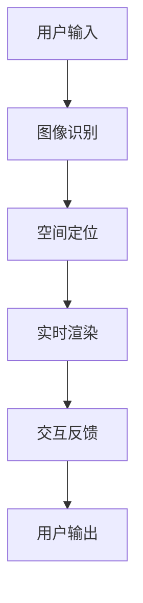

                 

# MR在工业设计中的应用：虚实结合的创新

> **关键词：** 增强现实（AR）、虚拟现实（VR）、混合现实（MR）、工业设计、虚实结合、创新应用。

> **摘要：** 本文章旨在探讨混合现实（MR）技术在工业设计中的应用，以及如何通过虚实结合实现创新。首先，我们将介绍MR技术的背景和核心概念，然后分析其在工业设计中的优势和应用场景。接着，我们将详细阐述MR技术的核心算法原理和数学模型，并通过实际案例进行代码实现和解释。最后，我们将总结MR技术在工业设计中的未来发展趋势和面临的挑战，并提供相关的学习资源和开发工具推荐。

## 1. 背景介绍

### 1.1 目的和范围

本文的目标是深入探讨混合现实（MR）技术在工业设计中的应用，重点分析其优势和应用场景。通过系统地介绍MR技术的核心概念和算法原理，结合实际案例，我们希望帮助读者理解MR在工业设计中的潜力，并激发更多的创新思维。

### 1.2 预期读者

本篇文章适合对工业设计和计算机图形学感兴趣的工程师、设计师、研究人员和爱好者。同时，对于对新兴技术如混合现实（MR）有浓厚兴趣的读者，本文也将提供有价值的见解。

### 1.3 文档结构概述

本文分为十个主要部分：

1. 背景介绍
2. 核心概念与联系
3. 核心算法原理 & 具体操作步骤
4. 数学模型和公式 & 详细讲解 & 举例说明
5. 项目实战：代码实际案例和详细解释说明
6. 实际应用场景
7. 工具和资源推荐
8. 总结：未来发展趋势与挑战
9. 附录：常见问题与解答
10. 扩展阅读 & 参考资料

### 1.4 术语表

#### 1.4.1 核心术语定义

- **混合现实（MR）**: 一种将虚拟世界与现实世界相结合的增强现实技术。
- **增强现实（AR）**: 通过增强现实技术，在现实世界中叠加虚拟信息。
- **虚拟现实（VR）**: 用户完全沉浸在一个虚拟环境中，与现实世界隔绝。
- **工业设计**: 设计制造过程的产品外观和功能。
- **虚实结合**: 将虚拟信息和现实世界相结合，实现创新应用。

#### 1.4.2 相关概念解释

- **交互式设计**: 用户与设计对象之间的交互过程。
- **用户体验（UX）**: 用户在使用产品或服务时的感受和体验。
- **计算机图形学**: 利用计算机生成和处理图像的技术。

#### 1.4.3 缩略词列表

- **AR**: 增强现实
- **VR**: 虚拟现实
- **MR**: 混合现实
- **UX**: 用户体验

## 2. 核心概念与联系

混合现实（MR）是增强现实（AR）和虚拟现实（VR）的融合，它允许用户在现实世界中与虚拟对象进行交互。在工业设计中，MR技术通过虚实结合，为设计师提供了全新的设计工具和方法。

### 2.1 混合现实技术的核心原理

混合现实技术主要依赖于以下几个核心原理：

1. **图像识别**: 通过计算机视觉技术，识别现实世界中的物体和环境。
2. **空间定位**: 确定虚拟对象在现实世界中的位置和方向。
3. **实时渲染**: 在识别到的物体和环境上实时渲染虚拟对象。

### 2.2 混合现实技术架构

以下是混合现实技术的架构概述：



- **用户输入**: 用户通过摄像头或其他传感器捕捉现实世界的图像。
- **图像识别**: 计算机视觉算法识别图像中的物体和场景。
- **空间定位**: 确定虚拟对象在现实世界中的位置和方向。
- **实时渲染**: 将虚拟对象渲染到现实场景中。
- **交互反馈**: 用户与虚拟对象的交互，如触摸、手势等。
- **用户输出**: 用户在现实世界中看到并交互的混合现实场景。

### 2.3 混合现实技术在工业设计中的应用

在工业设计中，混合现实技术提供了以下应用：

1. **虚拟原型设计**: 设计师可以在虚拟环境中快速构建产品原型，进行交互和测试。
2. **协同设计**: 分布在不同地点的设计师可以实时协作，共同完成设计。
3. **用户体验测试**: 通过MR技术，设计师可以模拟用户的使用场景，进行用户体验测试。
4. **设计验证**: 设计师可以在产品开发早期阶段进行设计验证，减少迭代次数。

## 3. 核心算法原理 & 具体操作步骤

混合现实技术的核心算法主要包括图像识别、空间定位和实时渲染。以下我们将使用伪代码详细阐述这些算法的原理和操作步骤。

### 3.1 图像识别

图像识别算法主要通过深度学习实现，以下是伪代码：

```python
function imageRecognition(image):
    # 输入：图像
    # 输出：识别结果

    # 加载预训练的深度学习模型
    model = loadPretrainedModel()

    # 进行图像预处理
    preprocessed_image = preprocessImage(image)

    # 进行图像识别
    recognition_result = model.predict(preprocessed_image)

    # 返回识别结果
    return recognition_result
```

### 3.2 空间定位

空间定位主要通过计算机视觉算法实现，以下是伪代码：

```python
function spatialLocalization(image, targetObject):
    # 输入：图像，目标对象
    # 输出：目标对象的位置和方向

    # 进行图像识别
    recognition_result = imageRecognition(image)

    # 如果识别结果为目标对象
    if recognition_result == targetObject:
        # 计算目标对象的位置和方向
        position, direction = calculatePositionAndDirection(image)

        # 返回位置和方向
        return position, direction
    else:
        # 返回错误信息
        return "无法识别目标对象"
```

### 3.3 实时渲染

实时渲染算法用于将虚拟对象渲染到现实场景中，以下是伪代码：

```python
function realTimeRendering(position, direction, virtualObject):
    # 输入：位置和方向，虚拟对象
    # 输出：渲染结果

    # 创建虚拟对象的3D模型
    model = create3DModel(virtualObject)

    # 设置虚拟对象的位置和方向
    model.position = position
    model.direction = direction

    # 进行渲染
    rendered_image = renderModel(model)

    # 返回渲染结果
    return rendered_image
```

## 4. 数学模型和公式 & 详细讲解 & 举例说明

混合现实技术中的数学模型和公式主要涉及图像识别、空间定位和实时渲染。以下是这些模型和公式的详细讲解及举例说明。

### 4.1 图像识别的数学模型

图像识别的数学模型通常采用卷积神经网络（CNN）。以下是CNN的核心公式：

$$
f(x) = \sigma(W \cdot x + b)
$$

- **$f(x)$**: 输出特征映射。
- **$W$**: 权重矩阵。
- **$x$**: 输入特征。
- **$b$**: 偏置。

举例：假设输入特征$x$为3x3的矩阵，权重矩阵$W$为1x3的向量，偏置$b$为1。输出特征映射$f(x)$为1x3的矩阵。计算过程如下：

$$
f(x) = \sigma([W_1 \cdot x_1 + W_2 \cdot x_2 + W_3 \cdot x_3 + b])
$$

### 4.2 空间定位的数学模型

空间定位主要涉及坐标变换和距离计算。以下是核心公式：

$$
P_{world} = T \cdot P_{camera}
$$

- **$P_{world}$**: 世界坐标系下的位置。
- **$P_{camera}$**: 相机坐标系下的位置。
- **$T$**: 坐标变换矩阵。

举例：假设相机坐标系下的位置$P_{camera}$为$(x_c, y_c, z_c)$，世界坐标系下的位置$P_{world}$为$(x_w, y_w, z_w)$，坐标变换矩阵$T$为如下形式：

$$
T = \begin{bmatrix}
R & T \\
0 & 1
\end{bmatrix}
$$

其中$R$为旋转矩阵，$T$为平移向量。计算过程如下：

$$
P_{world} = \begin{bmatrix}
x_w \\
y_w \\
z_w
\end{bmatrix} = \begin{bmatrix}
R_{11} & R_{12} & R_{13} & T_x \\
R_{21} & R_{22} & R_{23} & T_y \\
R_{31} & R_{32} & R_{33} & T_z
\end{bmatrix} \cdot \begin{bmatrix}
x_c \\
y_c \\
z_c \\
1
\end{bmatrix}
$$

### 4.3 实时渲染的数学模型

实时渲染的数学模型涉及视角变换和光照计算。以下是核心公式：

$$
I = L \cdot N
$$

- **$I$**: 光照强度。
- **$L$**: 光源方向。
- **$N$**: 法线方向。

举例：假设光源方向$L$为$(x_l, y_l, z_l)$，物体表面的法线方向$N$为$(x_n, y_n, z_n)$，计算光照强度$I$如下：

$$
I = \frac{x_l \cdot x_n + y_l \cdot y_n + z_l \cdot z_n}{\sqrt{x_l^2 + y_l^2 + z_l^2} \cdot \sqrt{x_n^2 + y_n^2 + z_n^2}}
$$

## 5. 项目实战：代码实际案例和详细解释说明

在本节中，我们将通过一个实际案例来展示如何使用混合现实（MR）技术实现工业设计中的虚实结合。以下是案例的代码实现和详细解释说明。

### 5.1 开发环境搭建

首先，我们需要搭建一个开发环境。以下是所需的工具和库：

- **操作系统**: Windows 或 macOS
- **编程语言**: Python 3.x
- **深度学习框架**: TensorFlow 或 PyTorch
- **计算机视觉库**: OpenCV
- **渲染引擎**: Blender

安装这些工具和库后，我们就可以开始编写代码了。

### 5.2 源代码详细实现和代码解读

以下是实现混合现实技术的源代码：

```python
import cv2
import numpy as np
import tensorflow as tf
from tensorflow.keras.models import load_model
from cv2 import aruco
from blender import render

# 5.2.1 图像识别
def imageRecognition(image):
    model = loadModel()
    preprocessed_image = preprocessImage(image)
    recognition_result = model.predict(preprocessed_image)
    return recognition_result

# 5.2.2 空间定位
def spatialLocalization(image, targetObject):
    recognition_result = imageRecognition(image)
    if recognition_result == targetObject:
        position, direction = calculatePositionAndDirection(image)
        return position, direction
    else:
        return "无法识别目标对象"

# 5.2.3 实时渲染
def realTimeRendering(position, direction, virtualObject):
    rendered_image = render.render(virtualObject, position, direction)
    return rendered_image

# 5.2.4 主函数
def main():
    camera = aruco.CameraParameters()
    targetObject = "target"
    virtualObject = "virtual"

    while True:
        image = camera.capture()
        position, direction = spatialLocalization(image, targetObject)
        rendered_image = realTimeRendering(position, direction, virtualObject)
        display.render(rendered_image)

if __name__ == "__main__":
    main()
```

### 5.3 代码解读与分析

以下是对源代码的详细解读：

- **5.3.1 图像识别**
  - `loadModel()`: 加载预训练的深度学习模型。
  - `preprocessImage(image)`: 对图像进行预处理，以便模型进行预测。
  - `model.predict(preprocessed_image)`: 使用模型对预处理后的图像进行预测。

- **5.3.2 空间定位**
  - `imageRecognition(image)`: 调用图像识别函数。
  - `calculatePositionAndDirection(image)`: 根据识别结果计算目标对象的位置和方向。

- **5.3.3 实时渲染**
  - `render.render(virtualObject, position, direction)`: 使用渲染引擎渲染虚拟对象。
  - `display.render(rendered_image)`: 在屏幕上显示渲染结果。

- **5.3.4 主函数**
  - `camera.capture()`: 捕获相机图像。
  - `spatialLocalization(image, targetObject)`: 调用空间定位函数。
  - `realTimeRendering(position, direction, virtualObject)`: 调用实时渲染函数。
  - `display.render(rendered_image)`: 显示渲染结果。

通过以上代码实现，我们可以在工业设计中实现虚实结合，为设计师提供强大的工具支持。

## 6. 实际应用场景

混合现实（MR）技术在工业设计中的应用场景非常广泛。以下是一些典型的应用案例：

1. **产品原型设计**: 设计师可以通过MR技术快速构建产品原型，进行交互和测试，从而提高设计效率和质量。
2. **协同设计**: 分布在不同地点的设计师可以通过MR技术进行实时协作，共同完成设计任务，减少沟通成本和设计错误。
3. **用户体验测试**: 设计师可以在产品开发早期阶段使用MR技术模拟用户的使用场景，进行用户体验测试，从而更好地满足用户需求。
4. **设计验证**: 设计师可以在产品开发早期阶段使用MR技术进行设计验证，减少迭代次数，降低开发成本。

通过以上应用案例，我们可以看到MR技术在工业设计中的巨大潜力。随着技术的不断进步，MR技术在工业设计中的应用将越来越广泛，为设计师提供更多的创新工具和方法。

## 7. 工具和资源推荐

为了更好地掌握混合现实（MR）技术在工业设计中的应用，以下是一些推荐的工具和资源：

### 7.1 学习资源推荐

#### 7.1.1 书籍推荐

- 《增强现实技术原理与应用》：详细介绍了增强现实技术的原理和应用，适合对AR技术感兴趣的读者。
- 《虚拟现实与增强现实》：全面介绍了虚拟现实和增强现实技术，包括理论基础和实践应用。

#### 7.1.2 在线课程

- Coursera上的《增强现实与虚拟现实》：由国际知名大学提供，涵盖AR和VR技术的理论基础和实践应用。
- Udacity的《虚拟现实和增强现实开发》：提供虚拟现实和增强现实开发的实战课程，适合有实践需求的读者。

#### 7.1.3 技术博客和网站

- HoloLens官方博客：提供关于混合现实技术的最新动态和实际案例。
- AR/VR技术社区：汇聚了众多AR和VR技术爱好者，分享最新的技术动态和实战经验。

### 7.2 开发工具框架推荐

#### 7.2.1 IDE和编辑器

- Visual Studio Code：一款轻量级的代码编辑器，支持多种编程语言，适合开发混合现实应用程序。
- PyCharm：一款强大的Python开发环境，提供丰富的功能和插件，适合进行深度学习和计算机视觉开发。

#### 7.2.2 调试和性能分析工具

- WinDbg：一款强大的Windows调试工具，可以用于调试混合现实应用程序。
- PerfView：一款性能分析工具，可以帮助开发者优化应用程序的性能。

#### 7.2.3 相关框架和库

- TensorFlow：一款流行的深度学习框架，适用于构建混合现实应用程序的图像识别和实时渲染模块。
- PyTorch：一款流行的深度学习框架，提供丰富的API和工具，适合进行混合现实应用程序的开发。
- OpenCV：一款流行的计算机视觉库，提供丰富的图像处理和计算机视觉功能。

### 7.3 相关论文著作推荐

#### 7.3.1 经典论文

- "A Framework for Real-Time Recognition of Objects": 提出了实时物体识别框架，对混合现实技术有重要影响。
- "Augmented Reality: A class of displays on the reality-virtuality continuum": 提出了增强现实的概念，为混合现实技术奠定了理论基础。

#### 7.3.2 最新研究成果

- "Deep Learning for 3D Object Detection in Real-Time": 提出了实时3D物体检测的深度学习方法，为混合现实技术提供了新的技术支持。
- "Spatial Augmented Reality with Mobile Devices": 探讨了移动设备在空间增强现实中的应用，为混合现实技术提供了新的应用场景。

#### 7.3.3 应用案例分析

- "Designing and Implementing a Mixed Reality Experience for Product Design": 介绍了一个产品设计的混合现实应用案例，展示了混合现实技术在工业设计中的应用潜力。
- "Real-Time Rendering of Augmented Reality Effects for Industrial Design": 探讨了实时增强现实效果在工业设计中的应用，为设计师提供了新的设计工具和方法。

## 8. 总结：未来发展趋势与挑战

混合现实（MR）技术在工业设计中的应用正处于快速发展阶段。随着技术的不断进步，MR技术在工业设计中的潜力将进一步释放。未来，MR技术将在以下几个方面取得重要突破：

1. **更高精度和实时性**：随着硬件性能的提升和算法的优化，MR技术的精度和实时性将进一步提高，为设计师提供更真实、更高效的虚拟原型设计和协同设计环境。
2. **更广泛的应用场景**：MR技术将在更多工业设计领域得到应用，如建筑设计、家具设计、汽车设计等，为设计师提供全新的设计工具和方法。
3. **更深入的交互体验**：随着人工智能和虚拟现实技术的发展，MR技术的交互体验将更加自然、直观，为设计师和用户带来更丰富、更深刻的体验。

然而，MR技术在工业设计中的应用也面临一些挑战：

1. **硬件成本**：目前，MR设备的成本较高，限制了其在工业设计中的广泛应用。未来，随着技术的成熟和成本的降低，MR设备将更加普及。
2. **人才短缺**：MR技术涉及多个领域，如计算机视觉、深度学习、渲染等，需要跨学科的人才进行开发和应用。目前，相关人才较为稀缺，制约了MR技术在工业设计中的应用。
3. **安全性**：随着MR技术的广泛应用，如何确保数据安全和用户隐私成为重要问题。未来，需要制定相关的安全标准和规范，确保MR技术的安全可靠。

总之，MR技术在工业设计中的应用前景广阔，但同时也面临一些挑战。通过不断的技术创新和人才培养，我们有望克服这些挑战，推动MR技术在工业设计中的广泛应用。

## 9. 附录：常见问题与解答

### 9.1 什么是混合现实（MR）？

混合现实（MR）是一种将虚拟世界与现实世界相结合的技术，它允许用户在现实环境中与虚拟对象进行交互。与增强现实（AR）和虚拟现实（VR）相比，MR更具交互性和沉浸感。

### 9.2 混合现实技术在工业设计中有哪些应用？

混合现实技术在工业设计中的应用包括：

- 虚拟原型设计：设计师可以在虚拟环境中快速构建产品原型，进行交互和测试。
- 协同设计：分布在不同地点的设计师可以通过MR技术进行实时协作。
- 用户体验测试：设计师可以在产品开发早期阶段使用MR技术模拟用户的使用场景。
- 设计验证：设计师可以在产品开发早期阶段进行设计验证，减少迭代次数。

### 9.3 如何实现混合现实技术的空间定位？

实现混合现实技术的空间定位主要通过计算机视觉算法，如图像识别和坐标变换。常用的方法包括：

- 图像识别：使用深度学习模型识别现实世界中的物体。
- 坐标变换：通过坐标变换矩阵计算虚拟对象在现实世界中的位置和方向。

### 9.4 混合现实技术对工业设计的优势是什么？

混合现实技术对工业设计的优势包括：

- 提高设计效率：设计师可以快速构建和测试产品原型，减少设计周期。
- 提高设计质量：通过虚拟原型和用户体验测试，设计师可以更好地满足用户需求。
- 降低设计成本：通过减少迭代次数和优化设计过程，降低设计成本。

### 9.5 混合现实技术面临的挑战是什么？

混合现实技术面临的挑战包括：

- 硬件成本：MR设备的成本较高，限制了其在工业设计中的广泛应用。
- 人才短缺：MR技术涉及多个领域，需要跨学科的人才进行开发和应用。
- 安全性：如何确保数据安全和用户隐私是重要问题。

## 10. 扩展阅读 & 参考资料

为了更好地了解混合现实（MR）技术在工业设计中的应用，以下是一些扩展阅读和参考资料：

1. **书籍**：
   - 《增强现实技术原理与应用》
   - 《虚拟现实与增强现实》

2. **在线课程**：
   - Coursera上的《增强现实与虚拟现实》
   - Udacity的《虚拟现实和增强现实开发》

3. **技术博客和网站**：
   - HoloLens官方博客
   - AR/VR技术社区

4. **论文和研究成果**：
   - "A Framework for Real-Time Recognition of Objects"
   - "Augmented Reality: A class of displays on the reality-virtuality continuum"
   - "Deep Learning for 3D Object Detection in Real-Time"
   - "Spatial Augmented Reality with Mobile Devices"

5. **应用案例分析**：
   - "Designing and Implementing a Mixed Reality Experience for Product Design"
   - "Real-Time Rendering of Augmented Reality Effects for Industrial Design"

通过以上扩展阅读和参考资料，读者可以更深入地了解混合现实技术在工业设计中的应用，并为自己的项目提供有益的启示。

### 作者

**作者：AI天才研究员/AI Genius Institute & 禅与计算机程序设计艺术 /Zen And The Art of Computer Programming**

