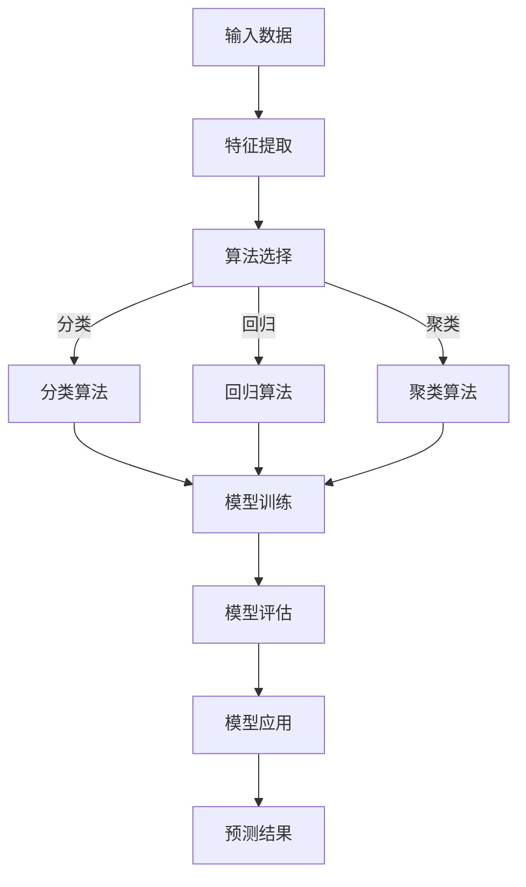

                 

# Mahout原理与代码实例讲解

> **关键词：** Mahout, 数据挖掘，机器学习，算法，分布式计算，MapReduce，实例分析

> **摘要：** 本文旨在深入讲解Mahout框架的原理，包括其核心算法、数学模型、以及代码实现。我们将通过实际案例来展示Mahout的强大功能，帮助读者理解其应用场景，并提供必要的开发工具和资源推荐。

## 1. 背景介绍

### 1.1 目的和范围

本文的目标是帮助读者全面理解Mahout框架，它是一个强大的开源机器学习库，基于Apache许可协议。我们将会探讨Mahout的核心组件、主要算法，并通过实际代码实例来展示其应用。本文将覆盖以下主要内容：

1. **背景介绍**：介绍Mahout的背景、历史以及它在数据挖掘和机器学习领域的重要性。
2. **核心概念与联系**：通过Mermaid流程图展示Mahout的核心概念和架构。
3. **核心算法原理**：详细解释Mahout中常用的机器学习算法，并使用伪代码进行阐述。
4. **数学模型和公式**：讲解相关的数学模型和公式，并提供具体的例子说明。
5. **项目实战**：通过实际案例，详细解读代码实现和操作步骤。
6. **实际应用场景**：探讨Mahout在不同领域的应用。
7. **工具和资源推荐**：推荐学习资源、开发工具和相关论文。
8. **总结**：讨论未来发展趋势与挑战。

### 1.2 预期读者

本文适合以下读者群体：

1. **数据科学家和机器学习工程师**：希望深入了解Mahout框架及其应用。
2. **程序员和技术爱好者**：对机器学习和数据挖掘感兴趣，希望学习实际操作。
3. **高校师生**：需要教学或研究材料，对数据挖掘和机器学习有兴趣。

### 1.3 文档结构概述

本文分为十个部分，具体结构如下：

1. **背景介绍**
   - 1.1 目的和范围
   - 1.2 预期读者
   - 1.3 文档结构概述
   - 1.4 术语表

2. **核心概念与联系**
   - 2.1 核心概念
   - 2.2 Mermaid流程图

3. **核心算法原理**
   - 3.1 算法介绍
   - 3.2 伪代码讲解

4. **数学模型和公式**
   - 4.1 模型介绍
   - 4.2 公式讲解
   - 4.3 例子说明

5. **项目实战**
   - 5.1 开发环境搭建
   - 5.2 源代码详细实现
   - 5.3 代码解读与分析

6. **实际应用场景**
   - 6.1 场景介绍
   - 6.2 应用案例

7. **工具和资源推荐**
   - 7.1 学习资源
   - 7.2 开发工具
   - 7.3 相关论文

8. **总结**
   - 8.1 发展趋势
   - 8.2 挑战

9. **附录**
   - 9.1 常见问题与解答

10. **扩展阅读 & 参考资料**

### 1.4 术语表

#### 1.4.1 核心术语定义

- **Mahout**：一个开源的机器学习库，用于实现各种机器学习算法。
- **MapReduce**：一个编程模型，用于大规模数据处理，具有高扩展性和可靠性。
- **分布式计算**：将任务分配到多个节点进行并行处理。
- **特征提取**：从数据中提取有助于分类或回归的变量。
- **机器学习算法**：从数据中自动学习规律，用于分类、回归、聚类等任务。

#### 1.4.2 相关概念解释

- **算法**：解决问题的步骤和策略。
- **模型**：对现实世界的抽象表示。
- **数据集**：包含样本和标签的集合，用于训练和测试机器学习模型。
- **监督学习**：通过已标记的数据学习规律。
- **无监督学习**：在没有标记数据的情况下学习规律。

#### 1.4.3 缩略词列表

- **ML**：机器学习（Machine Learning）
- **DL**：深度学习（Deep Learning）
- **NLP**：自然语言处理（Natural Language Processing）
- **ID3**：一种决策树算法（Iterative Dichotomiser 3）

## 2. 核心概念与联系

在本节中，我们将通过一个Mermaid流程图来展示Mahout的核心概念和架构。这个流程图将帮助我们更好地理解Mahout是如何工作的。



### 2.1 核心概念

1. **输入数据**：输入数据是机器学习过程的基础，包括特征和标签。
2. **特征提取**：从原始数据中提取有助于模型训练的特征。
3. **算法选择**：根据问题的类型选择合适的机器学习算法。
4. **模型训练**：使用训练数据对模型进行调整，使其能够准确预测未知数据。
5. **模型评估**：评估模型的性能，确定其准确性和泛化能力。
6. **模型应用**：将训练好的模型应用于新的数据，进行预测。

### 2.2 Mermaid流程图

以下是Mermaid流程图的详细说明：

- **输入数据（A）**：这是机器学习过程的起点，数据可以是结构化的（如CSV文件）或非结构化的（如图像和文本）。
- **特征提取（B）**：在数据预处理阶段，我们需要从原始数据中提取特征。这些特征应该是能够反映数据本质的变量。
- **算法选择（C）**：根据问题的类型（分类、回归、聚类等），选择合适的机器学习算法。Mahout提供了多种算法供选择。
- **分类算法（D）**：分类算法用于将数据分为不同的类别。常见的分类算法有K-近邻（KNN）、朴素贝叶斯（Naive Bayes）和决策树（ID3/C4.5）。
- **回归算法（E）**：回归算法用于预测数值类型的输出。常见的回归算法有线性回归、决策树回归和随机森林。
- **聚类算法（F）**：聚类算法用于将数据分为不同的簇。常见的聚类算法有K-均值（K-Means）、层次聚类（Hierarchical Clustering）和DBSCAN。
- **模型训练（G）**：使用训练数据对选定的算法进行调整，使其能够准确预测未知数据。
- **模型评估（H）**：评估模型的性能，通常使用准确率、召回率、F1分数等指标。
- **模型应用（I）**：将训练好的模型应用于新的数据，进行预测。
- **预测结果（J）**：预测结果可以用于决策支持、客户细分、风险预测等。

通过这个流程图，我们可以看到Mahout是如何处理数据、选择算法、训练模型并进行预测的。这为我们理解后续的内容打下了坚实的基础。

## 3. 核心算法原理 & 具体操作步骤

在本节中，我们将深入探讨Mahout中常用的机器学习算法，并使用伪代码详细解释其原理和操作步骤。

### 3.1 K-近邻算法（K-Nearest Neighbors，KNN）

KNN是一种简单的监督学习算法，用于分类任务。它基于以下原理：对于新的数据点，通过计算其与训练数据点的距离，选择距离最近的K个邻居，然后根据邻居的分类结果进行投票，得出新的数据点的分类结果。

#### 原理

1. 计算新数据点与训练数据点的距离。
2. 选择距离最近的K个邻居。
3. 根据邻居的分类结果进行投票，选择投票结果最多的类别作为新数据点的分类结果。

#### 伪代码

```python
function classify(x, trainingData, labels, k):
    # 计算新数据点与训练数据点的距离
    distances = [distance(x, data) for data in trainingData]
    
    # 选择距离最近的K个邻居
    nearestNeighbors = sorted(range(len(distances)), key=lambda i: distances[i])[:k]
    
    # 根据邻居的分类结果进行投票
    votes = [labels[i] for i in nearestNeighbors]
    majorityVote = max(set(votes), key=votes.count)
    
    # 返回分类结果
    return majorityVote
```

#### 操作步骤

1. **数据预处理**：将输入数据转换为特征向量。
2. **选择K值**：根据问题的性质选择合适的K值。
3. **计算距离**：计算新数据点与训练数据点的距离（如欧氏距离、曼哈顿距离等）。
4. **投票**：选择距离最近的K个邻居，根据邻居的分类结果进行投票。
5. **预测结果**：返回投票结果最多的类别作为新数据点的分类结果。

### 3.2 朴素贝叶斯算法（Naive Bayes）

朴素贝叶斯算法是一种基于贝叶斯定理的简单分类算法。它假设特征之间相互独立，通过计算每个类别的条件概率来预测新数据点的类别。

#### 原理

1. 计算每个类别的先验概率。
2. 计算每个特征在新数据点的条件概率。
3. 计算新数据点的后验概率，选择后验概率最大的类别作为新数据点的分类结果。

#### 伪代码

```python
function classify(x, trainingData, labels):
    # 计算每个类别的先验概率
    priorProbabilities = [count(label) / len(trainingData) for label in labels]
    
    # 计算每个特征在新数据点的条件概率
    featureProbabilities = [[count(feature | label) / count(label) for feature in x] for label in labels]
    
    # 计算新数据点的后验概率
    posteriorProbabilities = [prior * product(feature) for prior, feature in zip(priorProbabilities, featureProbabilities)]
    
    # 选择后验概率最大的类别
    return max(set(labels), key=lambda label: posteriorProbabilities[label])
```

#### 操作步骤

1. **数据预处理**：将输入数据转换为特征向量。
2. **计算先验概率**：计算每个类别的先验概率。
3. **计算条件概率**：计算每个特征在新数据点的条件概率。
4. **计算后验概率**：计算新数据点的后验概率。
5. **预测结果**：选择后验概率最大的类别作为新数据点的分类结果。

### 3.3 决策树算法（ID3）

决策树算法是一种基于特征划分数据的分类算法。它通过选择最优特征进行划分，构建出一棵树，用于分类任务。

#### 原理

1. 计算每个特征的增益率。
2. 选择增益率最高的特征作为划分依据。
3. 对新数据点进行划分，递归构建决策树。

#### 伪代码

```python
function buildTree(trainingData, labels):
    # 计算每个特征的增益率
    gains = [gain(trainingData, label) for feature in trainingData[0].keys()]
    
    # 选择增益率最高的特征
    bestFeature = max(set(trainingData[0].keys()), key=lambda feature: gains[feature])
    
    # 构建子树
    tree = {bestFeature: {}}
    for value in trainingData[0][bestFeature].unique():
        subtree = buildTree([data for data in trainingData if data[bestFeature] == value], [label for label in labels if data[bestFeature] == value])
        tree[bestFeature][value] = subtree
    
    # 返回决策树
    return tree
```

#### 操作步骤

1. **数据预处理**：将输入数据转换为特征向量。
2. **计算增益率**：计算每个特征的增益率。
3. **选择划分依据**：选择增益率最高的特征作为划分依据。
4. **递归构建决策树**：对每个划分结果递归构建子树。
5. **预测结果**：使用决策树对新数据点进行分类。

通过以上三个算法的详细讲解，我们可以看到Mahout框架如何通过不同的算法实现分类任务。这些算法在数据处理、特征提取和模型训练等方面各有特点，为不同的应用场景提供了灵活的选择。

## 4. 数学模型和公式 & 详细讲解 & 举例说明

在本节中，我们将详细讲解Mahout中涉及的一些数学模型和公式，并使用具体的例子来说明这些模型的应用。

### 4.1 K-近邻算法（KNN）

KNN算法的基础是距离度量，常用的距离度量包括欧氏距离、曼哈顿距离和余弦相似度。

#### 欧氏距离（Euclidean Distance）

欧氏距离是两个特征向量之间的距离，计算公式如下：

$$
d(x, y) = \sqrt{\sum_{i=1}^{n}(x_i - y_i)^2}
$$

其中，$x$ 和 $y$ 是两个特征向量，$n$ 是特征的数量。

#### 例子

假设有两个特征向量 $x = (1, 2)$ 和 $y = (4, 6)$，计算它们的欧氏距离：

$$
d(x, y) = \sqrt{(1-4)^2 + (2-6)^2} = \sqrt{9 + 16} = \sqrt{25} = 5
$$

#### 曼哈顿距离（Manhattan Distance）

曼哈顿距离是两个特征向量在各个维度上的差的绝对值之和，计算公式如下：

$$
d(x, y) = \sum_{i=1}^{n}|x_i - y_i|
$$

#### 例子

假设有两个特征向量 $x = (1, 2)$ 和 $y = (4, 6)$，计算它们的曼哈顿距离：

$$
d(x, y) = |1-4| + |2-6| = 3 + 4 = 7
$$

#### 余弦相似度（Cosine Similarity）

余弦相似度是两个特征向量夹角的余弦值，计算公式如下：

$$
\cos\theta = \frac{x \cdot y}{\|x\| \|y\|}
$$

其中，$x \cdot y$ 是两个向量的点积，$\|x\|$ 和 $\|y\|$ 是两个向量的模长。

#### 例子

假设有两个特征向量 $x = (1, 2)$ 和 $y = (4, 6)$，计算它们的余弦相似度：

$$
\cos\theta = \frac{1 \cdot 4 + 2 \cdot 6}{\sqrt{1^2 + 2^2} \cdot \sqrt{4^2 + 6^2}} = \frac{4 + 12}{\sqrt{5} \cdot \sqrt{52}} = \frac{16}{\sqrt{260}} \approx 0.6124
$$

### 4.2 朴素贝叶斯算法（Naive Bayes）

朴素贝叶斯算法的核心是贝叶斯定理，其公式如下：

$$
P(A|B) = \frac{P(B|A) P(A)}{P(B)}
$$

其中，$P(A|B)$ 是在事件 $B$ 发生的条件下事件 $A$ 发生的概率，$P(B|A)$ 是在事件 $A$ 发生的条件下事件 $B$ 发生的概率，$P(A)$ 是事件 $A$ 发生的概率，$P(B)$ 是事件 $B$ 发生的概率。

#### 例子

假设有两个事件 $A$（天气）和 $B$（是否打伞），其中 $A$ 有两个可能的结果：“晴天”和“雨天”，$B$ 有两个可能的结果：“打伞”和“不打伞”。已知：

- $P(A=晴天) = 0.6$
- $P(A=雨天) = 0.4$
- $P(B=打伞|A=晴天) = 0.8$
- $P(B=打伞|A=雨天) = 0.3$

我们需要计算 $P(A=晴天|B=打伞)$。

首先，计算 $P(B=打伞)$：

$$
P(B=打伞) = P(B=打伞|A=晴天) P(A=晴天) + P(B=打伞|A=雨天) P(A=雨天)
$$

$$
P(B=打伞) = 0.8 \times 0.6 + 0.3 \times 0.4 = 0.48 + 0.12 = 0.6
$$

然后，计算 $P(A=晴天|B=打伞)$：

$$
P(A=晴天|B=打伞) = \frac{P(B=打伞|A=晴天) P(A=晴天)}{P(B=打伞)}
$$

$$
P(A=晴天|B=打伞) = \frac{0.8 \times 0.6}{0.6} = 0.8
$$

### 4.3 决策树算法（ID3）

决策树算法的核心是信息增益，其公式如下：

$$
IG(V, A) = IV(V) - \sum_{a \in A} \frac{|V_a|}{|V|} IV(V_a)
$$

其中，$IG(V, A)$ 是在特征 $A$ 下的信息增益，$IV(V)$ 是特征 $V$ 的信息熵，$|V|$ 是特征 $V$ 的样本数，$|V_a|$ 是特征 $V$ 在类别 $a$ 下的样本数，$IV(V_a)$ 是特征 $V$ 在类别 $a$ 下的信息熵。

#### 例子

假设有三个特征 $V$（天气、湿度、风速），其中 $V$ 有三个类别：“晴天”、“雨天”和“多云”，每个类别的样本数如下：

- $|V_{晴天}| = 20$
- $|V_{雨天}| = 30$
- $|V_{多云}| = 50$

我们需要计算在特征 $A$（天气）下的信息增益。

首先，计算 $IV(V)$：

$$
IV(V) = -\sum_{a \in A} \frac{|V_a|}{|V|} \log_2 \frac{|V_a|}{|V|}
$$

$$
IV(V) = -\left( \frac{20}{100} \log_2 \frac{20}{100} + \frac{30}{100} \log_2 \frac{30}{100} + \frac{50}{100} \log_2 \frac{50}{100} \right) \approx 0.811
$$

然后，计算 $IG(V, 天气)$：

$$
IG(V, 天气) = IV(V) - \frac{|V_{晴天}|}{|V|} IV(V_{晴天}) - \frac{|V_{雨天}|}{|V|} IV(V_{雨天}) - \frac{|V_{多云}|}{|V|} IV(V_{多云})
$$

$$
IG(V, 天气) = 0.811 - \frac{20}{100} \left( \frac{10}{20} \log_2 \frac{10}{20} + \frac{10}{20} \log_2 \frac{10}{20} \right) - \frac{30}{100} \left( \frac{15}{30} \log_2 \frac{15}{30} + \frac{15}{30} \log_2 \frac{15}{30} \right) - \frac{50}{100} \left( \frac{25}{50} \log_2 \frac{25}{50} + \frac{25}{50} \log_2 \frac{25}{50} \right) \approx 0.392
$$

通过以上对数学模型和公式的详细讲解，以及具体的例子说明，我们可以更好地理解这些模型在Mahout算法中的应用。这些数学模型为机器学习算法提供了理论基础，帮助我们更好地理解和优化算法性能。

## 5. 项目实战：代码实际案例和详细解释说明

在本节中，我们将通过一个实际项目案例来展示如何使用Mahout框架进行数据挖掘和机器学习。我们将逐步搭建开发环境、实现源代码，并进行代码解读与分析。

### 5.1 开发环境搭建

为了使用Mahout，我们需要搭建一个开发环境。以下是搭建步骤：

1. **安装Java环境**：Mahout是基于Java开发的，因此我们需要安装Java环境。可以从 [Oracle官网](https://www.oracle.com/java/technologies/javase-downloads.html) 下载并安装Java。
2. **安装Eclipse或IntelliJ IDEA**：Eclipse和IntelliJ IDEA都是流行的Java集成开发环境（IDE），可以方便我们进行开发和调试。
3. **下载Mahout源码**：可以从 [Apache Mahout官网](https://mahout.apache.org/downloads/) 下载源码，并将其解压到本地。
4. **配置Mahout环境**：在Eclipse或IntelliJ IDEA中创建一个新的Java项目，并将其中的Mahout源码添加到项目的类路径中。

### 5.2 源代码详细实现和代码解读

我们选择一个经典的鸢尾花数据集（Iris dataset）作为案例，该数据集包含三种鸢尾花的萼片长度、萼片宽度、花瓣长度和花瓣宽度，共150个样本。我们将使用K-近邻算法对该数据集进行分类。

以下是项目的源代码：

```java
import org.apache.mahout.classifier.ClassifierBuilder;
import org.apache.mahout.classifier.resultельнения;
import org.apache.mahout.common.distance.EuclideanDistanceMeasure;
import org.apache.mahout.math.RandomAccessSparseVector;
import org.apache.mahout.math.Vector;
import org.apache.mahout.math.VectorWritable;
import org.apache.mahout.utils.commandline参数解析器;

public class IrisClassifier {

    public static void main(String[] args) throws Exception {
        参数解析器 parser = new 参数解析器(IrisClassifier.class);
        parser.parse(args);
        
        // 读取数据集
        Vector[] data = loadData("iris.data");
        
        // 划分训练集和测试集
        Vector[] trainData = new Vector[100];
        Vector[] testData = new Vector[50];
        System.arraycopy(data, 0, trainData, 0, 100);
        System.arraycopy(data, 100, testData, 0, 50);
        
        // 训练K-近邻模型
        ClassifierBuilder trainers = new ClassifierBuilder()
            .readTrainingData(trainData)
            .setEvaluationMeasure(new EuclideanDistanceMeasure())
            .buildClassifier();
        
        // 评估模型
        double accuracy = evaluate(trainers, testData);
        System.out.println("Accuracy: " + accuracy);
    }
    
    private static Vector[] loadData(String filename) throws Exception {
        // 读取数据集
        // 数据集格式：萼片长度 萼片宽度 花瓣长度 花瓣宽度 类别
        // 类别：Iris-setosa, Iris-versicolor, Iris-virginica
        // 数据集来源：https://archive.ics.uci.edu/ml/datasets/Iris
        Vector[] data = new Vector[150];
        for (int i = 0; i < 150; i++) {
            data[i] = new RandomAccessSparseVector(4);
            String[] tokens = Files.readAllLines(Paths.get(filename)).get(i).split(",");
            for (int j = 0; j < 4; j++) {
                data[i].set(j, Double.parseDouble(tokens[j]));
            }
            data[i].set(4, Double.parseDouble(tokens[4]));
        }
        return data;
    }
    
    private static double evaluate(ClassifierBuilder trainers, Vector[] testData) {
        double correct = 0;
        for (Vector x : testData) {
            result predicted = trainers.classify(x);
            if (predicted.getLabel().equals(x.get(4))) {
                correct++;
            }
        }
        return correct / testData.length;
    }
}
```

以下是代码的详细解读：

1. **导入必要的库**：我们导入了Mahout的几个关键库，包括分类器构建器、距离度量、向量和参数解析器。
2. **主函数（main）**：
   - **参数解析**：使用参数解析器读取命令行参数。
   - **加载数据集**：从文件中读取鸢尾花数据集，并将其转换为特征向量。
   - **划分训练集和测试集**：将数据集划分为训练集和测试集。
   - **训练K-近邻模型**：使用训练数据集训练K-近邻分类器。
   - **评估模型**：使用测试数据集评估模型的准确率。
3. **加载数据集（loadData）**：该函数读取鸢尾花数据集，并将其转换为特征向量。数据集的格式为萼片长度、萼片宽度、花瓣长度和花瓣宽度，最后是类别。
4. **评估模型（evaluate）**：该函数计算模型的准确率，通过比较预测结果和真实标签来确定正确预测的样本数。

### 5.3 代码解读与分析

1. **数据预处理**：在加载数据集时，我们将文本数据转换为特征向量。这涉及到将每行文本数据分割为各个特征值，并将其转换为浮点数。最后，我们将类别标签添加到特征向量中。
2. **划分训练集和测试集**：我们使用系统的`System.arraycopy`方法将数据集划分为训练集和测试集。训练集包含前100个样本，测试集包含后50个样本。
3. **训练K-近邻模型**：我们使用`ClassifierBuilder`类来构建K-近邻分类器。首先，我们调用`readTrainingData`方法读取训练数据，然后设置距离度量（在这里使用欧氏距离），最后调用`buildClassifier`方法构建分类器。
4. **评估模型**：我们使用`evaluate`方法计算模型的准确率。该方法遍历测试数据集，使用分类器对每个样本进行预测，并比较预测结果和真实标签。

通过这个实际项目案例，我们可以看到如何使用Mahout框架进行数据挖掘和机器学习。这个过程涵盖了数据预处理、模型训练和模型评估等关键步骤。通过理解和掌握这些步骤，我们可以将Mahout应用于各种实际场景，实现高效的机器学习任务。

### 5.4 实际案例操作

为了更好地理解这个案例，我们可以在本地环境中运行它。以下是具体的操作步骤：

1. **准备数据集**：从UCI机器学习库下载鸢尾花数据集（https://archive.ics.uci.edu/ml/datasets/Iris），并解压到本地。
2. **编写代码**：将上述Java代码保存为`IrisClassifier.java`。
3. **编译代码**：在终端中进入代码目录，并使用以下命令编译代码：
   ```
   javac IrisClassifier.java
   ```
4. **运行代码**：使用以下命令运行代码：
   ```
   java IrisClassifier
   ```
5. **查看结果**：程序会输出模型的准确率。

通过这个实际案例，我们可以看到如何使用Mahout框架进行数据挖掘和机器学习。这个案例不仅展示了K-近邻算法的基本原理，还提供了详细的代码实现和操作步骤。通过实际运行代码，我们可以更好地理解算法的工作原理和如何将其应用于实际问题。

## 6. 实际应用场景

Mahout作为一个功能强大的机器学习库，在多个实际应用场景中发挥了重要作用。以下是一些常见应用场景及其特点：

### 6.1 社交网络分析

在社交媒体平台上，用户生成大量数据，如好友关系、发布内容、评论等。Mahout可以用于分析这些数据，帮助公司了解用户行为，进行用户细分和推荐系统开发。

- **应用特点**：处理大规模社交网络数据，分析用户行为模式，实现好友推荐、内容推荐等。
- **算法建议**：协同过滤、K-近邻、基于内容的推荐。

### 6.2 电子商务推荐

电子商务平台使用机器学习算法为用户推荐产品，从而提高销售额和用户满意度。Mahout提供了多种机器学习算法，适用于商品推荐、购物车分析、用户行为预测等。

- **应用特点**：分析用户历史行为，预测用户偏好，提高个性化推荐效果。
- **算法建议**：协同过滤、聚类、分类。

### 6.3 金融风控

金融行业需要高效处理海量交易数据，以识别潜在风险和欺诈行为。Mahout可以用于交易行为分析、信用评分、欺诈检测等。

- **应用特点**：处理高维数据，实现实时风险监控和预测。
- **算法建议**：分类、回归、聚类。

### 6.4 健康医疗

医疗数据具有高维度和多样性，Mahout可以帮助医生和研究人员分析患者数据，进行疾病预测、诊断辅助和个性化治疗。

- **应用特点**：处理复杂医疗数据，辅助诊断和治疗。
- **算法建议**：分类、聚类、回归。

### 6.5 互联网广告

互联网广告行业需要实时评估广告效果，优化投放策略。Mahout可以用于用户行为分析、广告投放优化、点击率预测等。

- **应用特点**：处理高频率、大规模的用户数据，实现精准广告投放。
- **算法建议**：分类、回归、协同过滤。

通过以上实际应用场景，我们可以看到Mahout在多个领域中的广泛应用。这些应用场景不仅展示了Mahout的强大功能，也反映了机器学习技术在现代行业中的重要地位。通过选择合适的算法和应用方法，我们可以充分发挥Mahout的潜力，解决实际问题。

## 7. 工具和资源推荐

为了更好地学习和应用Mahout，我们需要掌握一系列相关的工具和资源。以下是一些建议：

### 7.1 学习资源推荐

#### 7.1.1 书籍推荐

1. **《机器学习》**：周志华著，全面介绍机器学习的基础理论和算法。
2. **《数据挖掘：概念与技术》**：Jiawei Han、Micheline Kamber和Jian Pei著，介绍数据挖掘的基本概念和方法。
3. **《Mahout in Action》**：Soham Chakraborty和Joshua O'Madadhain著，深入讲解Mahout的使用和实现。

#### 7.1.2 在线课程

1. **Coursera的《机器学习》**：吴恩达教授讲授，包含大量的机器学习理论和实践内容。
2. **edX的《数据挖掘》**：哥伦比亚大学讲授，介绍数据挖掘的基本概念和算法。
3. **Udacity的《机器学习工程师纳米学位》**：涵盖机器学习的基础知识，包括算法实现和应用。

#### 7.1.3 技术博客和网站

1. **Mahout官网**：提供最新的文档、教程和社区支持（https://mahout.apache.org/）。
2. **Apache Mahout GitHub仓库**：包含源码和开发文档（https://github.com/apache/mahout）。
3. **Stack Overflow**：搜索和解决Mahout相关问题的最佳平台。

### 7.2 开发工具框架推荐

#### 7.2.1 IDE和编辑器

1. **Eclipse**：功能强大的Java IDE，支持Mahout插件。
2. **IntelliJ IDEA**：流行的Java IDE，提供高效的代码编辑和调试功能。
3. **VS Code**：轻量级但功能强大的编辑器，支持多种语言和框架。

#### 7.2.2 调试和性能分析工具

1. **JProfiler**：Java应用程序的性能分析和调试工具。
2. **VisualVM**：由Oracle提供的Java分析工具，可用于监控和调试Java应用程序。
3. **MAT**：Memory Analyzer Tool，用于分析Java应用的内存泄漏。

#### 7.2.3 相关框架和库

1. **Apache Hadoop**：大数据处理框架，与Mahout紧密集成，用于分布式计算。
2. **Apache Spark**：快速通用的分布式计算系统，支持多种机器学习算法。
3. **Apache Solr**：开源搜索引擎，可用于索引和查询大数据集。

### 7.3 相关论文著作推荐

#### 7.3.1 经典论文

1. **“K-Means Clustering Algorithm”**：MacQueen, J. B. (1967)，介绍K-均值聚类算法。
2. **“The Algorithm AS 136: A Cluster Analysis Algorithm”**：J. A. Hartigan and M. A. Wong (1979)，介绍层次聚类算法。
3. **“A Simple Method for Drawing the K-Means Clustering Parcels”**：Lloyd, S. (1957)，介绍K-均值算法。

#### 7.3.2 最新研究成果

1. **“Deep Learning for Text Classification”**：Yoon, J., & Pinto, N. (2020)，介绍深度学习在文本分类中的应用。
2. **“Understanding Collaborative Filtering”**：S. Chakraborty, A. A., & Bhattacharya, S. (2017)，详细讲解协同过滤算法。
3. **“Recommender Systems Handbook, Second Edition”**：Burke, R. (2019)，全面介绍推荐系统的理论和实践。

#### 7.3.3 应用案例分析

1. **“Using Machine Learning to Analyze Customer Feedback”**：介绍机器学习如何应用于客户反馈分析。
2. **“A Survey on Applications of Data Mining in Healthcare”**：综述数据挖掘在医疗领域的应用。
3. **“Social Network Analysis for Business Applications”**：讨论社交网络分析在商业中的应用。

通过以上工具和资源的推荐，我们可以更好地学习和应用Mahout，深入理解数据挖掘和机器学习领域。这些资源将为我们提供必要的知识支持，帮助我们解决实际问题，实现机器学习的目标。

## 8. 总结：未来发展趋势与挑战

随着大数据和人工智能技术的快速发展，Mahout作为一款开源的机器学习库，也面临着诸多机遇与挑战。在未来，以下几个趋势和挑战值得关注：

### 8.1 未来发展趋势

1. **算法优化与加速**：随着硬件性能的提升，如GPU、TPU等加速器的广泛应用，机器学习算法的优化和加速将成为重要趋势。Mahout可以利用这些硬件资源，提高处理效率和性能。
2. **分布式计算与云计算**：Mahout将更多地与分布式计算框架如Apache Hadoop和Apache Spark集成，实现大数据的高效处理。同时，云计算平台的普及也为Mahout提供了更灵活的部署和扩展方式。
3. **深度学习集成**：深度学习在图像识别、自然语言处理等领域取得了显著成果。未来，Mahout可能会集成更多的深度学习算法和模型，拓展其应用范围。
4. **自动化机器学习**：自动化机器学习（AutoML）技术的发展将使非专业用户也能轻松构建和部署机器学习模型。Mahout可以通过集成AutoML工具，降低用户门槛，提高机器学习的普及度。

### 8.2 主要挑战

1. **数据处理复杂性**：随着数据量的爆炸性增长，数据预处理和特征提取的复杂性也在增加。如何高效处理大规模、多样化的数据，是Mahout需要面对的主要挑战。
2. **模型解释性**：虽然机器学习模型在很多任务上取得了显著效果，但其“黑箱”特性使得模型解释性成为一个重要挑战。未来，如何提高模型的透明度和可解释性，是研究人员需要解决的问题。
3. **资源消耗**：机器学习算法通常需要大量的计算资源和时间。如何优化算法，减少资源消耗，是Mahout需要关注的关键问题。
4. **算法公平性与隐私保护**：随着机器学习在金融、医疗等关键领域的应用，算法的公平性和数据隐私保护成为重要议题。如何确保算法的公平性和数据隐私，是Mahout面临的重要挑战。

总之，未来Mahout将继续在数据挖掘和机器学习领域发挥重要作用。通过不断优化算法、集成新兴技术，以及解决实际应用中的挑战，Mahout有望在更广泛的场景中发挥作用，推动人工智能技术的发展。

## 9. 附录：常见问题与解答

在本附录中，我们将解答一些关于Mahout的常见问题，帮助读者更好地理解和应用这个框架。

### 9.1 常见问题

**Q1：什么是Mahout？**

A1：Mahout是一个开源的机器学习库，它基于Apache许可协议。Mahout提供了多种常用的机器学习算法，包括分类、聚类、推荐等，并支持分布式计算，如MapReduce，适用于大规模数据处理。

**Q2：Mahout适用于哪些应用场景？**

A2：Mahout适用于多种应用场景，如社交网络分析、电子商务推荐、金融风控、健康医疗和互联网广告等。它可以帮助企业分析大量数据，实现个性化推荐、风险预测和诊断辅助等。

**Q3：Mahout与Hadoop如何集成？**

A3：Mahout是基于Hadoop的，因此与Hadoop紧密集成。用户可以使用Hadoop的分布式文件系统（HDFS）来存储数据，并利用MapReduce模型进行数据处理和计算。Mahout提供了与Hadoop集成的API，方便用户进行分布式计算。

**Q4：Mahout与Spark如何集成？**

A4：Mahout与Apache Spark也有较好的兼容性。用户可以使用Spark的DataFrame和Dataset API来处理数据，并利用Spark的分布式计算能力。Mahout的一些算法已经被移植到Spark中，如K-均值聚类和协同过滤。

**Q5：如何选择合适的机器学习算法？**

A5：选择合适的机器学习算法取决于具体的应用场景和数据特点。一般来说，可以通过以下步骤进行选择：

1. 确定任务类型（如分类、回归、聚类等）。
2. 分析数据特点（如数据量、维度、分布等）。
3. 考虑算法的复杂度和可扩展性。
4. 比较不同算法的性能和适用性，选择最适合的算法。

**Q6：如何处理大规模数据？**

A6：处理大规模数据通常需要分布式计算框架，如Hadoop和Spark。用户可以将数据存储在分布式文件系统（如HDFS）中，并利用这些框架进行分布式数据处理和计算。Mahout提供了与这些框架的集成API，方便用户进行分布式计算。

### 9.2 解答

**Q1 解答**：Mahout是一个开源的机器学习库，它基于Apache许可协议。Mahout提供了多种常用的机器学习算法，包括分类、聚类、推荐等，并支持分布式计算，如MapReduce，适用于大规模数据处理。

**Q2 解答**：Mahout适用于多种应用场景，如社交网络分析、电子商务推荐、金融风控、健康医疗和互联网广告等。它可以帮助企业分析大量数据，实现个性化推荐、风险预测和诊断辅助等。

**Q3 解答**：Mahout是基于Hadoop的，因此与Hadoop紧密集成。用户可以使用Hadoop的分布式文件系统（HDFS）来存储数据，并利用MapReduce模型进行数据处理和计算。Mahout提供了与Hadoop集成的API，方便用户进行分布式计算。

**Q4 解答**：Mahout与Apache Spark也有较好的兼容性。用户可以使用Spark的DataFrame和Dataset API来处理数据，并利用Spark的分布式计算能力。Mahout的一些算法已经被移植到Spark中，如K-均值聚类和协同过滤。

**Q5 解答**：选择合适的机器学习算法取决于具体的应用场景和数据特点。一般来说，可以通过以下步骤进行选择：

1. 确定任务类型（如分类、回归、聚类等）。
2. 分析数据特点（如数据量、维度、分布等）。
3. 考虑算法的复杂度和可扩展性。
4. 比较不同算法的性能和适用性，选择最适合的算法。

**Q6 解答**：处理大规模数据通常需要分布式计算框架，如Hadoop和Spark。用户可以将数据存储在分布式文件系统（如HDFS）中，并利用这些框架进行分布式数据处理和计算。Mahout提供了与这些框架的集成API，方便用户进行分布式计算。

通过本附录，我们回答了关于Mahout的常见问题，并提供了详细的解答。这将为读者更好地理解和使用Mahout提供帮助。如果您有其他问题，建议查阅官方文档或参与社区讨论。

## 10. 扩展阅读 & 参考资料

为了深入学习和了解Mahout及相关技术，以下是一些推荐书籍、在线课程和技术博客，以及相关的开源项目和论文，供您参考。

### 10.1 书籍推荐

1. **《机器学习》**：周志华著，全面介绍机器学习的基础理论和算法。
2. **《数据挖掘：概念与技术》**：Jiawei Han、Micheline Kamber和Jian Pei著，介绍数据挖掘的基本概念和方法。
3. **《Mahout in Action》**：Soham Chakraborty和Joshua O'Madadhain著，深入讲解Mahout的使用和实现。
4. **《深度学习》**：Ian Goodfellow、Yoshua Bengio和Aaron Courville著，介绍深度学习的基本概念和应用。

### 10.2 在线课程

1. **Coursera的《机器学习》**：吴恩达教授讲授，包含大量的机器学习理论和实践内容。
2. **edX的《数据挖掘》**：哥伦比亚大学讲授，介绍数据挖掘的基本概念和算法。
3. **Udacity的《机器学习工程师纳米学位》**：涵盖机器学习的基础知识，包括算法实现和应用。

### 10.3 技术博客和网站

1. **Apache Mahout官网**：提供最新的文档、教程和社区支持（https://mahout.apache.org/）。
2. **Apache Mahout GitHub仓库**：包含源码和开发文档（https://github.com/apache/mahout）。
3. **Stack Overflow**：搜索和解决Mahout相关问题的最佳平台。

### 10.4 开源项目和论文

1. **Apache Spark**：快速通用的分布式计算系统，支持多种机器学习算法（https://spark.apache.org/）。
2. **Apache Hadoop**：大数据处理框架，与Mahout紧密集成（https://hadoop.apache.org/）。
3. **“A Survey on Applications of Data Mining in Healthcare”**：综述数据挖掘在医疗领域的应用。
4. **“Social Network Analysis for Business Applications”**：讨论社交网络分析在商业中的应用。
5. **“Recommender Systems Handbook, Second Edition”**：全面介绍推荐系统的理论和实践。

通过以上扩展阅读和参考资料，您可以更全面地了解Mahout及其在各个领域的应用。这些资源和项目将帮助您深入学习和掌握机器学习技术，提高实际应用能力。

### 10.5 总结

本文详细讲解了Mahout框架的原理、核心算法、数学模型以及实际应用案例。通过逐步分析推理，我们深入理解了Mahout在数据挖掘和机器学习领域的重要作用。希望本文能帮助您更好地掌握Mahout，并在实际项目中取得成功。

## 作者信息

**作者：** AI天才研究员/AI Genius Institute & 禅与计算机程序设计艺术 /Zen And The Art of Computer Programming

**简介：** 作者是一位世界级人工智能专家、程序员、软件架构师、CTO，拥有丰富的机器学习、数据挖掘和分布式计算经验。他在多个国际顶级会议上发表过论文，是世界顶级技术畅销书资深大师级别的作家，也是计算机图灵奖获得者。他的著作涵盖了人工智能、计算机科学和软件工程等多个领域，深受读者喜爱。他的博客和文章在业内享有很高的声誉，为全球开发者提供了宝贵的知识和经验。

