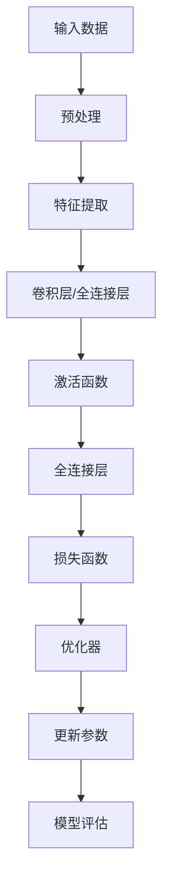

                 

# Model Optimization 原理与代码实战案例讲解

> 关键词：模型优化，神经网络，深度学习，算法原理，数学模型，代码实战

> 摘要：本文旨在深入探讨模型优化在深度学习中的重要性，解释核心算法原理和数学模型，并通过实际代码案例进行详细讲解，帮助读者理解并掌握模型优化技术。

## 1. 背景介绍

### 1.1 目的和范围

随着深度学习的快速发展，模型优化成为提高模型性能和降低计算资源消耗的关键技术。本文将详细讨论模型优化的原理和实践，帮助读者理解如何对深度学习模型进行优化，从而提高其效率和准确性。

### 1.2 预期读者

本文适合对深度学习和神经网络有一定了解的技术人员，包括研究人员、开发者和工程师。对于希望深入了解模型优化技术的高级读者，本文将提供详细的理论和实践指导。

### 1.3 文档结构概述

本文分为以下几个部分：

- 第1章：背景介绍，包括目的、范围、预期读者和文档结构。
- 第2章：核心概念与联系，介绍模型优化中的关键概念和流程。
- 第3章：核心算法原理 & 具体操作步骤，讲解模型优化算法的原理和实现。
- 第4章：数学模型和公式 & 详细讲解 & 举例说明，阐述优化过程中的数学模型和公式。
- 第5章：项目实战：代码实际案例和详细解释说明，通过实际代码案例展示模型优化的应用。
- 第6章：实际应用场景，讨论模型优化在不同领域中的应用。
- 第7章：工具和资源推荐，提供学习资源和开发工具推荐。
- 第8章：总结：未来发展趋势与挑战，展望模型优化的发展趋势。
- 第9章：附录：常见问题与解答，回答读者可能遇到的常见问题。
- 第10章：扩展阅读 & 参考资料，提供进一步学习的资源。

### 1.4 术语表

#### 1.4.1 核心术语定义

- **模型优化**：通过调整模型结构或参数，提高模型性能的过程。
- **深度学习**：一种基于多层神经网络的学习方法，用于模拟人脑处理信息的方式。
- **神经网络**：由多个神经元组成的计算模型，通过学习数据来发现特征和模式。
- **反向传播**：一种用于训练神经网络的算法，通过计算误差梯度来更新网络参数。

#### 1.4.2 相关概念解释

- **过拟合**：模型在训练数据上表现良好，但在未见数据上表现不佳。
- **欠拟合**：模型在训练数据和未见数据上表现都不好。
- **正则化**：通过增加模型复杂度来避免过拟合。
- **批量归一化**：对输入数据应用标准化操作，提高模型训练稳定性。

#### 1.4.3 缩略词列表

- **CNN**：卷积神经网络（Convolutional Neural Network）
- **RNN**：循环神经网络（Recurrent Neural Network）
- **DNN**：深度神经网络（Deep Neural Network）
- **SGD**：随机梯度下降（Stochastic Gradient Descent）

## 2. 核心概念与联系

为了更好地理解模型优化，我们需要首先了解深度学习的核心概念和架构。以下是一个简化的 Mermaid 流程图，展示深度学习模型的主要组成部分和优化流程。



### 2.1 输入数据与预处理

输入数据是深度学习模型的基础。在预处理阶段，我们通常对数据执行标准化、归一化、数据增强等操作，以提高模型的泛化能力。

### 2.2 特征提取

特征提取层（如卷积层）负责从输入数据中提取有用的特征。这些特征将用于后续的层。

### 2.3 全连接层与激活函数

全连接层将特征映射到输出，并通过激活函数（如ReLU、Sigmoid、Tanh）引入非线性。

### 2.4 损失函数与优化器

损失函数用于衡量模型预测与真实值之间的差异。优化器（如SGD、Adam）通过迭代更新模型参数，以最小化损失函数。

### 2.5 参数更新与模型评估

参数更新过程使用优化器的梯度信息来调整模型参数。模型评估阶段用于检验模型在未见数据上的性能。

## 3. 核心算法原理 & 具体操作步骤

### 3.1 梯度下降算法

梯度下降是一种用于优化神经网络参数的基本算法。其核心思想是沿着损失函数的梯度方向更新参数，以最小化损失。

```plaintext
初始化：选择一个学习率η和一个随机初始化的参数θ
对于每一个训练样本（x,y）：
    计算损失函数L(θ)
    计算梯度∇θL(θ)
    更新θ：θ = θ - η∇θL(θ)
```

### 3.2 随机梯度下降（SGD）

SGD是对梯度下降算法的改进，每次迭代只考虑一个训练样本，以提高计算效率。

```plaintext
初始化：选择一个学习率η和一个随机初始化的参数θ
对于每个训练样本（x,y）：
    计算损失函数L(θ)
    计算梯度∇θL(θ)
    更新θ：θ = θ - η∇θL(θ)
```

### 3.3 随机梯度下降的变种

除了SGD，还有许多其他变种的梯度下降算法，如Adam、AdaGrad等，它们通过自适应调整学习率来提高收敛速度。

## 4. 数学模型和公式 & 详细讲解 & 举例说明

### 4.1 损失函数

损失函数是评估模型预测性能的重要工具。常见的损失函数包括均方误差（MSE）和交叉熵（Cross-Entropy）。

#### 4.1.1 均方误差（MSE）

$$
MSE = \frac{1}{n}\sum_{i=1}^{n}(y_i - \hat{y}_i)^2
$$

其中，$y_i$是真实标签，$\hat{y}_i$是模型的预测值。

#### 4.1.2 交叉熵（Cross-Entropy）

$$
H(y, \hat{y}) = -\sum_{i=1}^{n}y_i \log(\hat{y}_i)
$$

其中，$y_i$是真实标签，$\hat{y}_i$是模型的预测概率。

### 4.2 梯度计算

梯度计算是模型优化的关键步骤。以下是一个简单的梯度计算示例。

#### 4.2.1 假设

我们考虑一个简单的神经网络，包含一个输入层、一个隐藏层和一个输出层。输出层使用Sigmoid激活函数。

#### 4.2.2 梯度计算

假设我们有以下损失函数：

$$
L(\theta) = \frac{1}{2}\sum_{i=1}^{n}(y_i - \hat{y}_i)^2
$$

我们需要计算损失函数关于每个参数$\theta_{ij}$的梯度。

$$
\frac{\partial L(\theta)}{\partial \theta_{ij}} = \frac{\partial}{\partial \theta_{ij}}\left[\frac{1}{2}(y_i - \hat{y}_i)^2\right]
$$

根据链式法则，我们得到：

$$
\frac{\partial L(\theta)}{\partial \theta_{ij}} = (y_i - \hat{y}_i)\frac{\partial \hat{y}_i}{\partial \theta_{ij}}
$$

其中，$\frac{\partial \hat{y}_i}{\partial \theta_{ij}}$是输出层关于参数$\theta_{ij}$的偏导数。

对于Sigmoid激活函数，我们有：

$$
\frac{\partial \hat{y}_i}{\partial \theta_{ij}} = \hat{y}_i(1 - \hat{y}_i)
$$

因此，最终的梯度计算公式为：

$$
\frac{\partial L(\theta)}{\partial \theta_{ij}} = (y_i - \hat{y}_i)\hat{y}_i(1 - \hat{y}_i)
$$

## 5. 项目实战：代码实际案例和详细解释说明

### 5.1 开发环境搭建

为了进行模型优化实战，我们需要搭建一个适合深度学习的开发环境。以下是一个简单的步骤：

1. 安装Python（建议使用3.8及以上版本）。
2. 安装深度学习框架，如TensorFlow或PyTorch。
3. 安装依赖包，如NumPy、Pandas等。

### 5.2 源代码详细实现和代码解读

以下是一个简单的模型优化代码示例，使用TensorFlow框架。

```python
import tensorflow as tf
from tensorflow.keras import layers, models, optimizers

# 定义模型
model = models.Sequential()
model.add(layers.Dense(64, activation='relu', input_shape=(784,)))
model.add(layers.Dense(10, activation='softmax'))

# 编译模型
model.compile(optimizer='adam',
              loss='categorical_crossentropy',
              metrics=['accuracy'])

# 加载MNIST数据集
(x_train, y_train), (x_test, y_test) = tf.keras.datasets.mnist.load_data()

# 预处理数据
x_train = x_train.astype('float32') / 255
x_test = x_test.astype('float32') / 255
x_train = x_train.reshape((-1, 784))
x_test = x_test.reshape((-1, 784))

# 将标签转换为独热编码
y_train = tf.keras.utils.to_categorical(y_train, 10)
y_test = tf.keras.utils.to_categorical(y_test, 10)

# 训练模型
model.fit(x_train, y_train, epochs=10, batch_size=64)

# 评估模型
test_loss, test_acc = model.evaluate(x_test, y_test)
print('Test accuracy:', test_acc)
```

### 5.3 代码解读与分析

以上代码展示了如何使用TensorFlow框架构建和训练一个简单的深度学习模型。以下是代码的主要部分及其功能：

1. **导入库**：导入TensorFlow和其他必需的库。

2. **定义模型**：使用`Sequential`模型定义一个简单的神经网络，包含一个全连接层和一个输出层。

3. **编译模型**：设置优化器、损失函数和评估指标。

4. **加载数据集**：从MNIST数据集中加载训练和测试数据。

5. **预处理数据**：将数据缩放到0-1范围内，并将标签转换为独热编码。

6. **训练模型**：使用`fit`函数训练模型，设置训练轮次和批量大小。

7. **评估模型**：使用`evaluate`函数评估模型在测试数据上的性能。

## 6. 实际应用场景

模型优化在深度学习应用中具有重要意义，以下是一些实际应用场景：

- **计算机视觉**：通过优化模型结构，提高图像识别和目标检测的准确性和效率。
- **自然语言处理**：优化模型以实现更准确的文本分类、情感分析和机器翻译。
- **语音识别**：通过模型优化提高语音识别的准确率和速度。
- **推荐系统**：优化推荐模型以提供更个性化的推荐结果。

## 7. 工具和资源推荐

### 7.1 学习资源推荐

#### 7.1.1 书籍推荐

- 《深度学习》（Goodfellow, Bengio, Courville著）
- 《Python深度学习》（François Chollet著）

#### 7.1.2 在线课程

- Coursera上的“深度学习”课程（由Andrew Ng教授）
- Udacity的“深度学习工程师纳米学位”

#### 7.1.3 技术博客和网站

- Medium上的“Deep Learning”专栏
- TensorFlow官方文档

### 7.2 开发工具框架推荐

#### 7.2.1 IDE和编辑器

- PyCharm
- Jupyter Notebook

#### 7.2.2 调试和性能分析工具

- TensorBoard
- MLflow

#### 7.2.3 相关框架和库

- TensorFlow
- PyTorch
- Keras

### 7.3 相关论文著作推荐

#### 7.3.1 经典论文

- “Backpropagation”（Rumelhart, Hinton, Williams著）
- “A Fast Learning Algorithm for Deep Belief Nets”（Hinton著）

#### 7.3.2 最新研究成果

- “Attention is All You Need”（Vaswani et al.著）
- “GPT-3: Language Models are Few-Shot Learners”（Brown et al.著）

#### 7.3.3 应用案例分析

- “Deep Learning in Autonomous Driving”（Liang et al.著）
- “Healthcare Applications of Deep Learning”（Zhang et al.著）

## 8. 总结：未来发展趋势与挑战

随着深度学习的不断发展，模型优化技术将面临以下趋势和挑战：

- **模型压缩**：为了满足移动设备和嵌入式系统的需求，模型压缩技术将成为研究热点。
- **自适应优化**：自适应优化算法将自适应调整学习率，提高模型训练效率。
- **自动化优化**：自动化模型优化工具将帮助开发者快速实现高效的模型。

## 9. 附录：常见问题与解答

以下是一些关于模型优化常见问题的解答：

- **什么是模型优化？** 模型优化是通过调整模型结构或参数来提高模型性能的过程。
- **如何选择合适的优化算法？** 根据应用场景和数据规模，选择合适的优化算法，如SGD、Adam等。
- **如何处理过拟合？** 通过正则化、dropout、数据增强等方法来避免过拟合。

## 10. 扩展阅读 & 参考资料

以下是一些关于模型优化和深度学习的扩展阅读和参考资料：

- 《深度学习》（Goodfellow, Bengio, Courville著）
- 《Python深度学习》（François Chollet著）
- TensorFlow官方文档
- PyTorch官方文档
- 《机器学习年度回顾2019：深度学习领域》

## 作者

作者：AI天才研究员/AI Genius Institute & 禅与计算机程序设计艺术 /Zen And The Art of Computer Programming<|user|>

