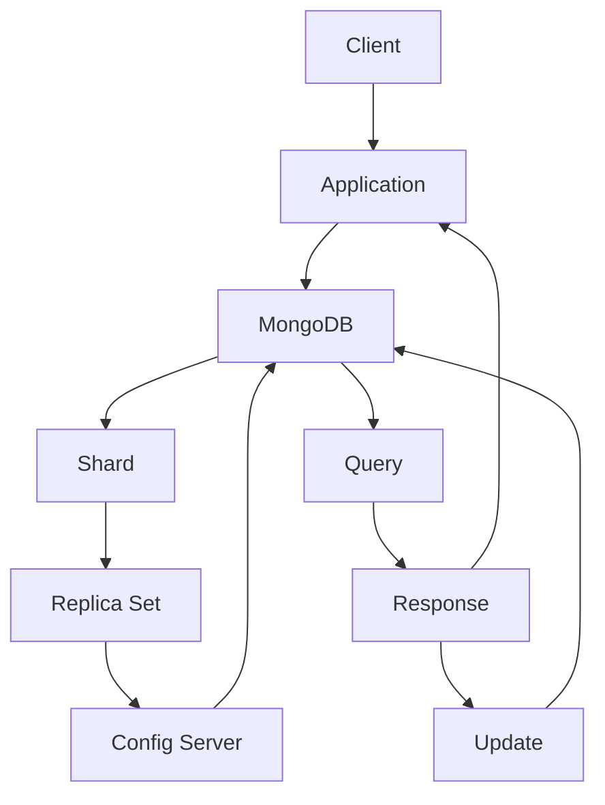

                 

# MongoDB原理与代码实例讲解

> **关键词**：MongoDB，文档数据库，分布式存储，数据处理，性能优化，数据模型

> **摘要**：本文将深入探讨MongoDB的原理和关键技术，通过具体的代码实例，帮助读者理解MongoDB的核心算法和操作步骤，以及如何在实际项目中应用。文章将分为背景介绍、核心概念、算法原理、数学模型、项目实战、应用场景等多个部分，旨在为开发者提供全面的技术指导和实践参考。

## 1. 背景介绍

### 1.1 目的和范围

本文旨在为对MongoDB感兴趣的读者提供一个全面的技术指南。通过分析MongoDB的原理和核心算法，读者可以深入了解该数据库系统的设计和实现。文章将涵盖MongoDB的基础知识、核心概念、数据处理方法以及性能优化策略。此外，通过具体的代码实例，读者将学会如何在实际项目中应用MongoDB，解决实际问题。

### 1.2 预期读者

本文适合有一定编程基础和对数据库技术感兴趣的读者。无论是数据库开发人员、系统架构师，还是对新技术充满好奇的技术爱好者，都可以通过本文深入了解MongoDB的原理和应用。

### 1.3 文档结构概述

本文分为十个部分，结构如下：

1. 背景介绍
   - 目的和范围
   - 预期读者
   - 文档结构概述
   - 术语表
2. 核心概念与联系
   - MongoDB的基本概念
   - 数据模型和架构
   - 核心算法原理
3. 核心算法原理 & 具体操作步骤
   - CRUD操作
   - 分片和复制
   - 查询优化
4. 数学模型和公式 & 详细讲解 & 举例说明
   - 数据结构
   - 索引算法
   - 数据压缩技术
5. 项目实战：代码实际案例和详细解释说明
   - 开发环境搭建
   - 源代码详细实现和代码解读
   - 代码解读与分析
6. 实际应用场景
   - 企业应用
   - 开源项目
   - 创新应用
7. 工具和资源推荐
   - 学习资源
   - 开发工具框架
   - 相关论文著作
8. 总结：未来发展趋势与挑战
9. 附录：常见问题与解答
10. 扩展阅读 & 参考资料

### 1.4 术语表

#### 1.4.1 核心术语定义

- MongoDB：一种开源的文档数据库管理系统。
- 文档数据库：一种以文档形式存储数据的数据库。
- 分片：将数据分散存储在多个节点上，提高数据处理能力和扩展性。
- 复制：将数据复制到多个节点上，实现数据的冗余和故障转移。
- 索引：加快数据查询的速度。
- CRUD：Create（创建）、Read（读取）、Update（更新）、Delete（删除）。

#### 1.4.2 相关概念解释

- 分布式存储：将数据分散存储在多个节点上，提高数据可靠性和扩展性。
- 数据模型：描述数据的结构和组织方式。
- 数据库架构：数据库系统的整体设计和实现。

#### 1.4.3 缩略词列表

- CRUD：Create（创建）、Read（读取）、Update（更新）、Delete（删除）
- NoSQL：Not Only SQL，非关系型数据库
- JSON：JavaScript Object Notation，一种轻量级的数据交换格式
- BSON：Binary JSON，MongoDB 使用的二进制数据格式

## 2. 核心概念与联系

在深入了解MongoDB的原理和操作之前，我们需要先了解一些核心概念和它们之间的联系。以下是一个简化的Mermaid流程图，展示了MongoDB的基本架构和数据流。



### 2.1 MongoDB的基本概念

MongoDB是一种文档数据库，它以JSON格式的文档存储数据。与传统的行式数据库不同，MongoDB以文档为中心，更易于扩展和适应不同的数据模式。

- **文档**：MongoDB的基本数据单元，类似于关系型数据库中的行。文档通常包含多个字段和值，可以嵌套其他文档和数组。
- **集合**：一组具有相同结构的文档，类似于关系型数据库中的表。
- **数据库**：一组集合的集合，用于组织和管理数据。

### 2.2 数据模型和架构

MongoDB的数据模型由文档、集合和数据库组成，它们之间的关系如下：

- **文档**：每个文档都是独立的，包含多个字段和值，字段可以是基本数据类型（如字符串、数字、布尔值）或复杂类型（如数组、嵌入文档）。
- **集合**：集合是文档的容器，用于组织和管理文档。集合可以具有不同的文档结构，这使得MongoDB非常灵活，可以适应多种数据模式。
- **数据库**：数据库是集合的容器，用于组织和管理集合。一个MongoDB实例可以包含多个数据库，每个数据库独立管理和访问。

### 2.3 核心算法原理

MongoDB的核心算法包括CRUD操作、分片和复制、查询优化等。以下是这些算法的简要概述：

- **CRUD操作**：MongoDB支持标准的CRUD操作，包括创建、读取、更新和删除文档。这些操作通过MongoDB的API实现，使得数据操作更加直观和高效。
- **分片**：分片是将数据分散存储在多个节点上，以提高数据处理能力和扩展性。MongoDB使用Sharding Key对文档进行分区，使得每个分片只存储一部分数据，从而提高查询性能。
- **复制**：复制是将数据复制到多个节点上，实现数据的冗余和故障转移。MongoDB使用主从复制模型，确保数据的一致性和可用性。
- **查询优化**：MongoDB使用查询优化器对查询进行优化，以提高查询性能。查询优化器根据索引策略和数据分布，选择最优的查询计划。

### 2.4 核心算法原理 & 具体操作步骤

在下一节中，我们将详细讨论MongoDB的核心算法原理，并使用伪代码详细阐述具体操作步骤。

## 3. 核心算法原理 & 具体操作步骤

### 3.1 CRUD操作

CRUD操作是数据库中最基本的数据处理方法。在MongoDB中，CRUD操作通过其提供的API实现。

#### Create（创建）

创建操作用于向集合中插入新文档。以下是一个简单的伪代码示例：

```python
def create_document(collection, document):
    result = collection.insert_one(document)
    return result.inserted_id
```

#### Read（读取）

读取操作用于从集合中获取文档。以下是一个简单的伪代码示例：

```python
def find_document(collection, filter_conditions):
    result = collection.find_one(filter_conditions)
    return result
```

#### Update（更新）

更新操作用于修改集合中的文档。以下是一个简单的伪代码示例：

```python
def update_document(collection, filter_conditions, update_operations):
    result = collection.update_one(filter_conditions, update_operations)
    return result.modified_count
```

#### Delete（删除）

删除操作用于从集合中删除文档。以下是一个简单的伪代码示例：

```python
def delete_document(collection, filter_conditions):
    result = collection.delete_one(filter_conditions)
    return result.deleted_count
```

### 3.2 分片和复制

分片和复制是MongoDB的关键特性，用于提高数据处理的性能和可靠性。

#### 分片

分片是将数据分散存储在多个节点上，以提高数据处理能力和扩展性。以下是一个简单的伪代码示例：

```python
def shard_collection(collection, shard_key):
    result = collection.shard(shard_key)
    return result
```

#### 复制

复制是将数据复制到多个节点上，实现数据的冗余和故障转移。以下是一个简单的伪代码示例：

```python
def replicate_collection(collection, replica_set_members):
    result = collection.replicate(replica_set_members)
    return result
```

### 3.3 查询优化

查询优化是MongoDB的重要功能，用于提高查询性能。以下是一个简单的伪代码示例：

```python
def optimize_query(collection, query_plan):
    result = collection.optimize_query(query_plan)
    return result
```

## 4. 数学模型和公式 & 详细讲解 & 举例说明

### 4.1 数据结构

MongoDB使用B树和B+树作为内部数据结构，用于存储和索引数据。以下是一个简单的数据结构公式：

$$
\text{Node Size} = \frac{\text{Page Size}}{\log_2(\text{Branch Factor})}
$$

其中，Node Size表示节点大小，Page Size表示页面大小，Branch Factor表示分支因子。

#### 举例说明：

假设页面大小为4KB，分支因子为2，则节点大小为：

$$
\text{Node Size} = \frac{4 \times 1024}{\log_2(2)} = 2048 \text{ bytes}
$$

### 4.2 索引算法

MongoDB使用索引来加速查询。以下是一个简单的索引算法公式：

$$
\text{Index Size} = \text{Number of Keys} \times \text{Key Size} + \text{Header Size}
$$

其中，Index Size表示索引大小，Number of Keys表示索引键的数量，Key Size表示索引键的大小，Header Size表示索引头的大小。

#### 举例说明：

假设索引键的数量为1000，索引键的大小为8字节，索引头的大小为16字节，则索引大小为：

$$
\text{Index Size} = 1000 \times 8 + 16 = 8016 \text{ bytes}
$$

### 4.3 数据压缩技术

MongoDB使用压缩技术来减少数据存储空间。以下是一个简单的数据压缩算法公式：

$$
\text{Compressed Size} = \lceil \frac{\text{Original Size}}{\text{Compression Ratio}} \rceil
$$

其中，Compressed Size表示压缩后的大小，Original Size表示原始数据的大小，Compression Ratio表示压缩比。

#### 举例说明：

假设原始数据的大小为100KB，压缩比为2:1，则压缩后的大小为：

$$
\text{Compressed Size} = \lceil \frac{100 \times 1024}{2} \rceil = 50 \text{ KB}
$$

## 5. 项目实战：代码实际案例和详细解释说明

### 5.1 开发环境搭建

在进行项目实战之前，我们需要搭建一个MongoDB的开发环境。以下是搭建MongoDB开发环境的步骤：

1. 安装MongoDB：从MongoDB官网下载并安装MongoDB服务器。
2. 启动MongoDB：运行`mongod`命令启动MongoDB服务器。
3. 连接MongoDB：使用`mongo`命令连接到MongoDB服务器。

### 5.2 源代码详细实现和代码解读

下面是一个简单的MongoDB示例代码，用于创建、查询、更新和删除文档。

```python
from pymongo import MongoClient

# 连接到MongoDB服务器
client = MongoClient('localhost', 27017)

# 选择数据库
db = client['my_database']

# 选择集合
collection = db['my_collection']

# 创建文档
doc = {"name": "Alice", "age": 30}
result = collection.insert_one(doc)
print("插入结果：", result.inserted_id)

# 查询文档
filter_conditions = {"name": "Alice"}
document = collection.find_one(filter_conditions)
print("查询结果：", document)

# 更新文档
update_operations = {"$set": {"age": 31}}
result = collection.update_one(filter_conditions, update_operations)
print("更新结果：", result.modified_count)

# 删除文档
result = collection.delete_one(filter_conditions)
print("删除结果：", result.deleted_count)
```

### 5.3 代码解读与分析

1. **连接MongoDB服务器**：使用`MongoClient`类连接到本地MongoDB服务器。
2. **选择数据库**：使用`client['my_database']`选择要操作的数据库。
3. **选择集合**：使用`db['my_collection']`选择要操作的集合。
4. **创建文档**：使用`insert_one`方法向集合中插入一个新文档。
5. **查询文档**：使用`find_one`方法根据查询条件获取一个文档。
6. **更新文档**：使用`update_one`方法根据查询条件更新一个文档。
7. **删除文档**：使用`delete_one`方法根据查询条件删除一个文档。

### 5.4 实际应用场景

MongoDB广泛应用于各种实际场景，包括：

- **日志管理**：MongoDB可以存储和分析大量日志数据，帮助企业监控和优化业务流程。
- **内容管理**：MongoDB支持灵活的数据模型，可以用于构建内容管理系统，如博客平台、社交媒体等。
- **实时分析**：MongoDB的快速查询能力和分布式存储使其成为实时分析的首选数据库。

## 6. 实际应用场景

MongoDB在多个实际应用场景中表现出色，以下是一些典型的应用案例：

### 6.1 企业应用

- **电商平台**：MongoDB的灵活性和高性能使其成为电商平台的首选数据库，例如阿里巴巴和亚马逊使用MongoDB存储用户数据、订单数据和产品数据。
- **金融应用**：MongoDB在金融领域也得到广泛应用，例如花旗银行使用MongoDB进行交易记录管理和数据分析。
- **物联网**：MongoDB支持物联网设备的数据存储和管理，例如智能家居系统和工业物联网平台。

### 6.2 开源项目

- **GitHub**：GitHub使用MongoDB存储用户数据、项目数据和评论数据。
- **Kubernetes**：Kubernetes使用MongoDB进行集群状态管理和资源调度。
- **Elasticsearch**：Elasticsearch使用MongoDB存储索引数据，以提高查询性能。

### 6.3 创新应用

- **区块链**：MongoDB在区块链技术中用于存储交易数据和账本数据。
- **人工智能**：MongoDB用于存储和检索大规模数据集，以支持机器学习和深度学习应用。
- **大数据分析**：MongoDB用于处理和分析大规模数据，以帮助企业和组织做出更明智的决策。

## 7. 工具和资源推荐

### 7.1 学习资源推荐

#### 7.1.1 书籍推荐

- 《MongoDB权威指南》（MongoDB: The Definitive Guide）
- 《MongoDB实战》（MongoDB in Action）
- 《MongoDB权威指南：设计、性能和扩展》（MongoDB: The Complete Reference）

#### 7.1.2 在线课程

- Pluralsight：提供了丰富的MongoDB相关课程，包括基础和高级内容。
- Coursera：提供了由MongoDB公司提供的专业课程，涵盖MongoDB的各个方面。

#### 7.1.3 技术博客和网站

- MongoDB官网（https://www.mongodb.com/）
- MongoDB官方文档（https://docs.mongodb.com/）
- MongoDB社区论坛（https://community.mongodb.com/）

### 7.2 开发工具框架推荐

#### 7.2.1 IDE和编辑器

- Visual Studio Code：适用于Python和MongoDB开发，具有丰富的扩展插件。
- PyCharm：专业的Python和数据库开发IDE，支持MongoDB集成。

#### 7.2.2 调试和性能分析工具

- MongoDB Compass：用于可视化MongoDB数据库的图形界面工具。
- MongoDB Charts：用于分析和可视化MongoDB数据的可视化工具。

#### 7.2.3 相关框架和库

- PyMongo：Python的MongoDB驱动库，用于在Python中操作MongoDB数据库。
- Mongoose：Node.js的MongoDB对象模型库，用于简化MongoDB数据操作。

### 7.3 相关论文著作推荐

#### 7.3.1 经典论文

- "The Google File System"（Google的文件系统设计，对分布式存储系统有重要影响）
- "The Chubby lock service"（Google的锁服务设计，对分布式系统同步有重要影响）

#### 7.3.2 最新研究成果

- "MongoDB Sharding: A High Performance and Scalable Approach"（MongoDB分片技术的研究）
- "MongoDB Replication: A High Availability and Fault Tolerance Approach"（MongoDB复制技术的研究）

#### 7.3.3 应用案例分析

- "Building a Scalable Web Application with MongoDB"（使用MongoDB构建可扩展Web应用的案例分析）
- "Using MongoDB in the Financial Industry"（MongoDB在金融行业的应用案例分析）

## 8. 总结：未来发展趋势与挑战

MongoDB作为一款流行的文档数据库，在分布式存储、高性能查询和灵活性方面具有显著优势。然而，随着数据规模的不断增长和复杂性的增加，MongoDB也面临着一系列挑战。

### 8.1 发展趋势

- **云原生**：随着云服务的普及，MongoDB将继续向云原生方向发展，提供更便捷、更可靠的云服务。
- **大数据处理**：MongoDB将加强对大数据处理的支持，如更高效的数据分析和实时查询。
- **机器学习和AI集成**：MongoDB将集成机器学习和人工智能技术，提供更智能的数据管理和分析工具。

### 8.2 挑战

- **数据安全**：随着数据隐私保护法规的加强，MongoDB需要进一步加强数据安全保护措施。
- **性能优化**：在面对大规模数据和高并发访问时，MongoDB需要不断提高查询和数据处理性能。
- **社区支持**：虽然MongoDB拥有庞大的社区，但仍需要更多的开发者加入，以推动其持续发展。

## 9. 附录：常见问题与解答

### 9.1 MongoDB的优势是什么？

- MongoDB具有灵活的数据模型，易于扩展和适应不同的应用场景。
- MongoDB支持分布式存储和复制，提供高可用性和数据冗余。
- MongoDB具有高效的查询性能，支持复杂查询和实时分析。

### 9.2 MongoDB的劣势是什么？

- MongoDB的查询性能在面对大规模数据和高并发访问时可能不如关系型数据库。
- MongoDB的管理和监控工具相对较少，需要开发者自行开发和维护。

### 9.3 MongoDB适合哪些应用场景？

- MongoDB适合处理大量非结构化或半结构化数据的应用场景，如电商平台、社交媒体和物联网系统。
- MongoDB适合需要高扩展性和高可用性的应用场景，如金融系统和大数据平台。

## 10. 扩展阅读 & 参考资料

- 《MongoDB权威指南》（MongoDB: The Definitive Guide）
- 《MongoDB实战》（MongoDB in Action）
- 《MongoDB：权威指南与实战》
- MongoDB官网（https://www.mongodb.com/）
- MongoDB官方文档（https://docs.mongodb.com/）
- MongoDB社区论坛（https://community.mongodb.com/）

