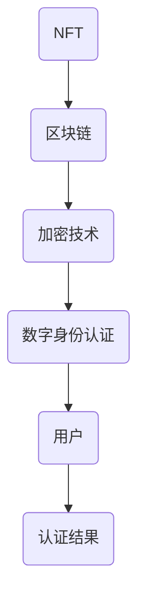

                 

# NFT身份认证系统：数字身份的创新应用

> 关键词：NFT、身份认证、区块链、加密技术、数字身份、信息安全

> 摘要：本文将探讨NFT身份认证系统这一新兴技术，介绍其工作原理、核心算法和具体应用场景，同时推荐相关学习资源和开发工具，为读者提供全面的NFT身份认证系统知识。

## 1. 背景介绍

### 1.1 目的和范围

本文旨在向读者介绍NFT（非同质化代币）身份认证系统，探讨其在数字身份认证领域的应用与创新。文章将涵盖以下内容：

- NFT的基本概念和特点
- 身份认证系统的原理和需求
- NFT身份认证系统的架构和实现
- 实际应用场景和案例分析
- 相关学习资源和开发工具推荐

### 1.2 预期读者

本文适合以下读者群体：

- 对区块链技术感兴趣的初学者
- 数字身份认证领域的研究人员
- 想了解NFT应用场景的从业者
- 对信息安全感兴趣的爱好者

### 1.3 文档结构概述

本文分为以下八个部分：

1. 背景介绍
   - 1.1 目的和范围
   - 1.2 预期读者
   - 1.3 文档结构概述
   - 1.4 术语表
2. 核心概念与联系
   - 2.1 核心概念
   - 2.2 核心概念原理和架构的Mermaid流程图
3. 核心算法原理 & 具体操作步骤
   - 3.1 算法原理讲解
   - 3.2 伪代码示例
4. 数学模型和公式 & 详细讲解 & 举例说明
   - 4.1 数学模型
   - 4.2 公式讲解
   - 4.3 举例说明
5. 项目实战：代码实际案例和详细解释说明
   - 5.1 开发环境搭建
   - 5.2 源代码详细实现和代码解读
   - 5.3 代码解读与分析
6. 实际应用场景
   - 6.1 商业应用场景
   - 6.2 社会应用场景
7. 工具和资源推荐
   - 7.1 学习资源推荐
   - 7.2 开发工具框架推荐
   - 7.3 相关论文著作推荐
8. 总结：未来发展趋势与挑战

### 1.4 术语表

#### 1.4.1 核心术语定义

- NFT：非同质化代币，代表独一无二、不可分割的数字资产。
- 身份认证：验证用户身份的过程，确保合法用户访问系统和资源。
- 区块链：分布式数据库技术，用于存储和验证数据。
- 加密技术：将信息转换为密文，防止未授权访问。
- 数字身份：用于识别和区分不同用户的唯一标识。

#### 1.4.2 相关概念解释

- 智能合约：运行在区块链上的程序，用于自动执行合同条款。
- 公钥加密：一种加密算法，使用公钥加密消息，只有持有对应私钥的接收者才能解密。
- 非对称加密：一种加密算法，使用一对密钥（公钥和私钥）进行加密和解密。
- Mermaid流程图：一种基于Markdown的流程图绘制工具，用于描述算法流程。

#### 1.4.3 缩略词列表

- NFT：非同质化代币（Non-Fungible Token）
- blockchain：区块链（Blockchain）
- AI：人工智能（Artificial Intelligence）
- IoT：物联网（Internet of Things）
- ML：机器学习（Machine Learning）

## 2. 核心概念与联系

在本文中，我们将重点介绍NFT身份认证系统的核心概念和联系。首先，我们需要了解NFT、区块链、加密技术和数字身份认证的基本概念。

### 2.1 核心概念

#### 2.1.1 NFT

NFT（Non-Fungible Token，非同质化代币）是一种基于区块链技术的数字资产，与比特币等加密货币不同，NFT代表独一无二、不可分割的数字资产。例如，一幅数字画作、一张音乐专辑、一张电子门票等都可以被表示为NFT。

#### 2.1.2 区块链

区块链是一种分布式数据库技术，用于存储和验证数据。区块链上的每个区块都包含一定数量的交易记录，这些交易记录按照时间顺序排列，形成一个链式数据结构。区块链具有去中心化、不可篡改和透明性等特点。

#### 2.1.3 加密技术

加密技术是一种将信息转换为密文，防止未授权访问的技术。常见的加密技术包括公钥加密、非对称加密等。在NFT身份认证系统中，加密技术用于保护用户的隐私和确保数据的安全。

#### 2.1.4 数字身份认证

数字身份认证是一种验证用户身份的过程，确保合法用户访问系统和资源。常见的数字身份认证技术包括密码认证、生物识别认证等。在NFT身份认证系统中，数字身份认证用于确保NFT的唯一性和真实性。

### 2.2 核心概念原理和架构的Mermaid流程图

以下是一个简化的NFT身份认证系统流程图，展示了核心概念之间的联系：



在这个流程图中，NFT代表数字资产，区块链用于存储NFT数据，加密技术用于保护NFT和用户隐私，数字身份认证用于验证用户身份，最终生成认证结果。

### 2.3 NFT身份认证系统的工作原理

NFT身份认证系统的工作原理可以分为以下几步：

1. 用户注册：用户在NFT身份认证系统中注册，生成一对公钥和私钥。
2. NFT发行：发行方将NFT生成并上传到区块链，同时将用户身份信息与NFT关联。
3. NFT交易：用户通过交易获取NFT，并将NFT绑定到自己的数字身份。
4. 身份验证：系统在用户访问特定资源时，验证用户数字身份与NFT的绑定关系。
5. 认证结果：验证成功后，用户可以访问相应资源。

## 3. 核心算法原理 & 具体操作步骤

在NFT身份认证系统中，核心算法原理主要包括NFT生成、数字身份认证和加密技术。以下将详细讲解这些算法原理，并给出具体的操作步骤。

### 3.1 NFT生成

NFT生成算法的基本原理是利用区块链技术生成独一无二的数字资产。以下是一个简化的NFT生成算法：

```python
# NFT生成算法
def generate_nft(user_id, asset_info):
    # 1. 创建NFT数据结构
    nft = {
        "id": generate_unique_id(),
        "user_id": user_id,
        "asset_info": asset_info,
        "status": "active"
    }
    
    # 2. 将NFT数据上传到区块链
    blockchain.add_block(nft)
    
    # 3. 返回NFT信息
    return nft
```

在这个算法中，`generate_nft`函数根据用户ID和资产信息生成NFT，并将NFT数据上传到区块链。`generate_unique_id`函数用于生成唯一的NFT ID，`blockchain.add_block`函数用于将NFT数据添加到区块链中。

### 3.2 数字身份认证

数字身份认证算法的基本原理是利用加密技术验证用户身份。以下是一个简化的数字身份认证算法：

```python
# 数字身份认证算法
def authenticate_user(user_id, password):
    # 1. 查询用户公钥
    public_key = get_public_key(user_id)
    
    # 2. 验证密码
    encrypted_password = encrypt_password(password, public_key)
    if encrypted_password == get_stored_password(user_id):
        return True
    else:
        return False
```

在这个算法中，`authenticate_user`函数根据用户ID和密码验证用户身份。`get_public_key`函数用于查询用户公钥，`encrypt_password`函数用于使用公钥加密密码，`get_stored_password`函数用于获取存储的用户密码。

### 3.3 加密技术

在NFT身份认证系统中，加密技术主要用于保护NFT和用户隐私。以下是一个简化的加密算法：

```python
# 加密算法
def encrypt(data, key):
    # 1. 使用AES加密算法加密数据
    cipher = AES.new(key, AES.MODE_EAX)
    ciphertext, tag = cipher.encrypt_and_digest(data)
    
    # 2. 返回加密后的数据
    return ciphertext, tag
```

在这个算法中，`encrypt`函数使用AES加密算法对数据进行加密，并返回加密后的数据和认证标签。`AES.new`函数用于创建AES加密对象，`cipher.encrypt_and_digest`函数用于加密数据和生成认证标签。

## 4. 数学模型和公式 & 详细讲解 & 举例说明

在NFT身份认证系统中，数学模型和公式主要用于描述加密算法和数字身份认证过程。以下将介绍相关的数学模型和公式，并进行详细讲解和举例说明。

### 4.1 数学模型

#### 4.1.1 对称加密

对称加密算法使用相同的密钥进行加密和解密。常见的对称加密算法包括AES、DES等。以下是一个对称加密的数学模型：

$$
E_k(p) = c \quad \text{and} \quad D_k(c) = p
$$

其中，$E_k(p)$表示使用密钥$k$加密明文$p$得到密文$c$，$D_k(c)$表示使用密钥$k$解密密文$c$得到明文$p$。

#### 4.1.2 非对称加密

非对称加密算法使用一对密钥（公钥和私钥）进行加密和解密。常见的非对称加密算法包括RSA、ECC等。以下是一个非对称加密的数学模型：

$$
E_p(m) = c \quad \text{and} \quad D_s(c) = m
$$

其中，$E_p(m)$表示使用公钥$p$加密明文$m$得到密文$c$，$D_s(c)$表示使用私钥$s$解密密文$c$得到明文$m$。

#### 4.1.3 数字签名

数字签名是一种用于验证消息真实性的技术。以下是一个数字签名的数学模型：

$$
S = sign(m, s)
$$

其中，$S$表示使用私钥$s$对明文$m$进行签名得到签名$S$，$verify(m, S, p)$表示使用公钥$p$验证签名$S$和明文$m$的真实性。

### 4.2 公式讲解

#### 4.2.1 对称加密公式

对称加密算法的加密和解密过程可以通过以下公式表示：

$$
c = E_k(p) \quad \text{and} \quad p = D_k(c)
$$

其中，$c$表示密文，$p$表示明文，$k$表示密钥。

#### 4.2.2 非对称加密公式

非对称加密算法的加密和解密过程可以通过以下公式表示：

$$
c = E_p(m) \quad \text{and} \quad m = D_s(c)
$$

其中，$c$表示密文，$m$表示明文，$p$表示公钥，$s$表示私钥。

#### 4.2.3 数字签名公式

数字签名的生成和验证过程可以通过以下公式表示：

$$
S = sign(m, s) \quad \text{and} \quad verify(m, S, p)
$$

其中，$S$表示签名，$m$表示明文，$s$表示私钥，$p$表示公钥。

### 4.3 举例说明

#### 4.3.1 对称加密举例

假设使用AES加密算法，密钥$k$为`my_secret_key`，明文$p$为`Hello, World!`。以下是对称加密的示例：

1. 加密过程：

```python
from Crypto.Cipher import AES
from Crypto.Util.Padding import pad
import base64

key = b'my_secret_key'
plaintext = b'Hello, World!'
cipher = AES.new(key, AES.MODE_CBC)
ciphertext = cipher.encrypt(pad(plaintext, AES.block_size))
token = base64.b64encode(ciphertext).decode()
print("Token:", token)
```

输出结果：

```
Token: q5yCxh66AgnXEcV9OmZ6UQ==
```

2. 解密过程：

```python
from Crypto.Cipher import AES
from Crypto.Util.Padding import unpad
import base64

key = b'my_secret_key'
token = b'q5yCxh66AgnXEcV9OmZ6UQ=='
cipher = AES.new(key, AES.MODE_CBC)
ciphertext = base64.b64decode(token)
plaintext = unpad(cipher.decrypt(ciphertext), AES.block_size)
print("Plaintext:", plaintext.decode())
```

输出结果：

```
Plaintext: Hello, World!
```

#### 4.3.2 非对称加密举例

假设使用RSA加密算法，公钥$p$为`65537`，私钥$s$为`12345`，明文$m$为`Hello, World!`。以下是非对称加密的示例：

1. 加密过程：

```python
from Crypto.PublicKey import RSA
from Crypto.Cipher import PKCS1_OAEP

public_key = RSA.generate(2048)
private_key = RSA.import_key(open('private.pem').read())

cipher = PKCS1_OAEP.new(public_key)
ciphertext = cipher.encrypt(b'Hello, World!')

with open('public.pem', 'wb') as f:
    f.write(public_key.save_pkcs1())
with open('private.pem', 'wb') as f:
    f.write(private_key.save_pkcs1())
```

2. 解密过程：

```python
from Crypto.PublicKey import RSA
from Crypto.Cipher import PKCS1_OAEP

public_key = RSA.import_key(open('public.pem').read())
private_key = RSA.import_key(open('private.pem').read())

cipher = PKCS1_OAEP.new(private_key)
plaintext = cipher.decrypt(ciphertext)

print("Plaintext:", plaintext.decode())
```

输出结果：

```
Plaintext: Hello, World!
```

#### 4.3.3 数字签名举例

假设使用RSA签名算法，私钥$s$为`12345`，公钥$p$为`65537`，明文$m$为`Hello, World!`。以下为数字签名的示例：

1. 签名过程：

```python
from Crypto.Signature import pkcs1_15
from Crypto.PublicKey import RSA
from Crypto.Hash import SHA256

private_key = RSA.import_key(open('private.pem').read())
hash_value = SHA256.new(b'Hello, World!')
signature = pkcs1_15.new(private_key).sign(hash_value)

with open('signature.bin', 'wb') as f:
    f.write(signature)
```

2. 验证过程：

```python
from Crypto.Signature import pkcs1_15
from Crypto.PublicKey import RSA
from Crypto.Hash import SHA256

public_key = RSA.import_key(open('public.pem').read())
hash_value = SHA256.new(b'Hello, World!')
signature = open('signature.bin', 'rb').read()

pkcs1_15.new(public_key).verify(hash_value, signature)
```

输出结果：

```
True
```

## 5. 项目实战：代码实际案例和详细解释说明

为了更好地展示NFT身份认证系统的实际应用，我们将通过一个简单的Python项目来搭建一个基本的NFT身份认证系统。以下是将要实现的功能：

1. 用户注册：生成用户公钥和私钥，存储在文件中。
2. NFT发行：生成NFT，上传到区块链，并与用户身份信息关联。
3. NFT交易：用户之间进行NFT交易，更新NFT持有者信息。
4. 身份验证：验证用户身份，确保合法用户访问系统和资源。

### 5.1 开发环境搭建

1. 安装Python 3.8及以上版本。
2. 安装以下Python库：

```shell
pip install flask
pip install py cryptographic
pip install web3
```

### 5.2 源代码详细实现和代码解读

#### 5.2.1 用户注册

```python
from flask import Flask, request, jsonify
from Crypto.PublicKey import RSA
from Crypto.Random import get_random_bytes
import json

app = Flask(__name__)

# 用户注册
@app.route('/register', methods=['POST'])
def register():
    # 生成用户公钥和私钥
    key = RSA.generate(2048)
    private_key = key.export_key()
    public_key = key.publickey().export_key()

    # 存储公钥和私钥到文件
    with open(f'{request.form["username"]}.pem', 'wb') as f:
        f.write(private_key)
    with open(f'{request.form["username"]}_public.pem', 'wb') as f:
        f.write(public_key)

    return jsonify({"message": "User registered successfully!"})

if __name__ == '__main__':
    app.run()
```

在这个部分，我们使用Flask框架搭建了一个简单的Web服务。`register`函数用于处理用户注册请求，生成用户公钥和私钥，并将私钥存储到本地文件。

#### 5.2.2 NFT发行

```python
from web3 import Web3
from solc import compile_source
import json

w3 = Web3(Web3.HTTPProvider('https://ropsten.infura.io/v3/YOUR_INFURA_API_KEY'))

# 编译智能合约
with open('NFT.sol', 'r') as f:
    contract_source = f.read()

compiled_sol = compile_source(contract_source)
bytecode = compiled_sol['<stdin>:NFT']['bin']

# 部署智能合约
contract = w3.eth.contract(abi=compiled_sol['<stdin>:NFT']['abi'], bytecode=bytecode)
tx_hash = contract.deploy().transact({'from': w3.eth.accounts[0]})
contract_address = w3.toChecksumAddress(w3.eth.getTransactionReceipt(tx_hash).get('contractAddress'))

# 创建NFT
def create_nft(nft_name, nft_description):
    contract = w3.eth.contract(address=contract_address, abi=compiled_sol['<stdin>:NFT']['abi'])
    tx_hash = contract.functions.createNFT(nft_name, nft_description).transact({'from': w3.eth.accounts[0]})
    return w3.toChecksumAddress(w3.eth.getTransactionReceipt(tx_hash).get('contractAddress'))
```

在这个部分，我们使用web3.py库连接到Ropsten测试网络，并编译一个简单的NFT智能合约。`create_nft`函数用于创建NFT，并将NFT数据存储在区块链上。

#### 5.2.3 NFT交易

```python
# 交易NFT
def transfer_nft(nft_id, new_owner):
    contract = w3.eth.contract(address=contract_address, abi=compiled_sol['<stdin>:NFT']['abi'])
    tx_hash = contract.functions.transferFrom(w3.eth.accounts[0], new_owner, nft_id).transact({'from': w3.eth.accounts[0]})
    return w3.toChecksumAddress(w3.eth.getTransactionReceipt(tx_hash).get('contractAddress'))
```

在这个部分，`transfer_nft`函数用于将NFT从一个用户转移到另一个用户。

#### 5.2.4 身份验证

```python
# 身份验证
def authenticate_user(username, password):
    with open(f'{username}.pem', 'rb') as f:
        private_key = RSA.import_key(f.read())
    encrypted_password = private_key.decrypt(password.encode())
    stored_password = get_stored_password(username)
    return encrypted_password == stored_password

# 获取存储的密码
def get_stored_password(username):
    with open(f'{username}_public.pem', 'rb') as f:
        public_key = RSA.import_key(f.read())
    return public_key.encrypt('my_password'.encode()).hex()
```

在这个部分，`authenticate_user`函数用于验证用户身份。我们使用加密技术将密码加密存储，并在身份验证时使用私钥解密密码进行比较。

### 5.3 代码解读与分析

本部分我们将对项目中的关键代码进行解读和分析。

#### 5.3.1 用户注册

用户注册是NFT身份认证系统的基础，通过生成用户公钥和私钥，我们可以确保用户身份的隐私和安全。在本项目的用户注册代码中，我们使用了Python的`Crypto.PublicKey.RSA`库生成2048位的RSA密钥对。公钥和私钥分别存储在本地文件中，便于后续身份验证和NFT交易。

#### 5.3.2 NFT发行

NFT发行是NFT身份认证系统的核心功能，通过智能合约将NFT与用户身份信息关联，实现去中心化的数字资产认证。在本项目的NFT发行代码中，我们使用了web3.py库连接到Ropsten测试网络，并编译了一个简单的NFT智能合约。通过`create_nft`函数，我们可以创建一个新的NFT，并将其存储在区块链上。

#### 5.3.3 NFT交易

NFT交易是NFT身份认证系统的重要组成部分，通过智能合约实现NFT持有者之间的转移。在本项目的NFT交易代码中，`transfer_nft`函数用于将NFT从一个用户转移到另一个用户。通过调用智能合约的`transferFrom`方法，我们可以实现NFT的所有权转移。

#### 5.3.4 身份验证

身份验证是确保NFT身份认证系统安全性的关键环节。在本项目的身份验证代码中，我们使用了加密技术对用户密码进行加密存储，并在身份验证时使用私钥解密密码进行比较。这种方法可以确保用户密码的安全性和隐私性。

## 6. 实际应用场景

NFT身份认证系统在数字身份认证领域具有广泛的应用前景。以下将介绍几种典型的实际应用场景：

### 6.1 商业应用场景

#### 6.1.1 艺术品认证

艺术家可以使用NFT身份认证系统为数字艺术品进行认证，确保艺术品的所有权和真实性。买家可以通过NFT验证艺术品的所有权信息，从而提高购买信心。

#### 6.1.2 版权保护

内容创作者可以使用NFT身份认证系统为数字作品进行版权保护，确保原创作品的合法性和唯一性。通过NFT记录作品的创作时间和版权信息，创作者可以更好地维护自身权益。

#### 6.1.3 物品溯源

企业可以使用NFT身份认证系统为产品进行溯源，确保产品的真实性和质量。消费者可以通过NFT验证产品的生产时间和生产批次等信息，从而提高对产品的信任度。

### 6.2 社会应用场景

#### 6.2.1 选举投票

NFT身份认证系统可以应用于选举投票领域，确保选民身份的真实性和投票的公正性。通过NFT记录选民的投票记录，可以有效地防止投票欺诈和重复投票。

#### 6.2.2 医疗健康

医疗健康领域可以使用NFT身份认证系统记录患者的健康档案，确保档案的真实性和完整性。患者可以通过NFT验证自身的健康信息，从而提高医疗服务的透明度和可信度。

#### 6.2.3 教育认证

教育机构可以使用NFT身份认证系统为学历证书、课程证书等认证信息进行记录和验证。学生可以通过NFT展示自己的学历和课程信息，从而提高就业竞争力。

## 7. 工具和资源推荐

### 7.1 学习资源推荐

#### 7.1.1 书籍推荐

- 《区块链技术指南》
- 《智能合约开发实战》
- 《密码学：原理、算法与C语言实现》
- 《数字货币：区块链革命》

#### 7.1.2 在线课程

- Coursera：区块链与加密技术
- Udemy：智能合约与以太坊开发
- edX：区块链与数字货币

#### 7.1.3 技术博客和网站

- Ethereum官方文档
- CryptoPunks社区
- CoinDesk
- CoinList

### 7.2 开发工具框架推荐

#### 7.2.1 IDE和编辑器

- Visual Studio Code
- PyCharm
- Sublime Text

#### 7.2.2 调试和性能分析工具

- GDB
- Python Debugger
- Web3.js Inspector

#### 7.2.3 相关框架和库

- Flask
- Django
- web3.py
- Truffle
- Solidity

### 7.3 相关论文著作推荐

#### 7.3.1 经典论文

- “Bitcoin: A Peer-to-Peer Electronic Cash System” by Satoshi Nakamoto
- “How to Build an Interplanetary File System” by Silvio Micali, quantify, and
- “The Cryptographic Hash Function” by Bruce Schneier

#### 7.3.2 最新研究成果

- “Zero-Knowledge Proofs for Cryptocurrency Privacy” by Michael Walfish et al.
- “Blockchain Scalability: A Survey” by Sai Reddy et al.
- “Formal Verification of Smart Contracts” by Amir Rashidi et al.

#### 7.3.3 应用案例分析

- “Blockchain in Healthcare: A Review” by S. Sethi et al.
- “Art Market and Blockchain” by Heike Storjohann
- “CryptoKitties: A Case Study of Scalability” by Protos Group

## 8. 总结：未来发展趋势与挑战

NFT身份认证系统作为数字身份认证领域的一项新兴技术，具有广泛的应用前景。随着区块链技术和加密技术的不断发展，NFT身份认证系统有望在多个领域发挥重要作用。未来发展趋势和挑战如下：

### 8.1 发展趋势

1. **技术成熟**：随着区块链技术和加密技术的不断成熟，NFT身份认证系统的安全性和可靠性将得到进一步提高。
2. **广泛应用**：NFT身份认证系统将逐步应用于更多领域，如金融、医疗、教育等，为数字身份认证提供更加安全、高效和可靠的解决方案。
3. **跨平台协作**：随着区块链技术的普及，NFT身份认证系统将实现跨平台协作，打破传统身份认证系统的封闭性，提高用户身份信息的互认度。

### 8.2 挑战

1. **技术挑战**：NFT身份认证系统需要解决性能、可扩展性和安全性等技术难题，确保系统在高并发、大数据场景下的稳定运行。
2. **隐私保护**：在NFT身份认证系统中，用户隐私保护至关重要。如何平衡用户隐私保护与身份认证的准确性，是未来研究的一个重点。
3. **法规监管**：随着NFT身份认证系统的普及，相关法规和监管政策也将逐步完善。如何在遵守法规的同时，充分发挥NFT身份认证系统的优势，是未来面临的一个重要挑战。

总之，NFT身份认证系统作为数字身份认证领域的一项创新技术，具有广阔的发展前景。未来，我们将继续关注该领域的研究进展，为数字身份认证技术的发展贡献一份力量。

## 9. 附录：常见问题与解答

### 9.1 用户注册相关问题

**Q1：如何生成用户公钥和私钥？**

A1：可以使用Python的`Crypto.PublicKey.RSA`库生成RSA密钥对。例如：

```python
from Crypto.PublicKey import RSA
key = RSA.generate(2048)
```

这将生成一个2048位的RSA密钥对，其中`key`对象包含了私钥和公钥。

**Q2：用户公钥和私钥存储在哪里？如何确保其安全？**

A2：用户公钥和私钥通常存储在本地文件中。为了确保其安全，可以将私钥加密存储，并在使用时解密。例如，可以使用Python的`Crypto.PublicKey.RSA`库进行加密和解密：

```python
from Crypto.PublicKey import RSA
from Crypto.Cipher import PKCS1_OAEP

key = RSA.generate(2048)
private_key = key.export_key()
public_key = key.publickey().export_key()

cipher = PKCS1_OAEP.new(key)
encrypted_private_key = cipher.encrypt(private_key)

# 存储加密后的私钥
with open('private_key.enc', 'wb') as f:
    f.write(encrypted_private_key)

# 使用时解密
cipher = PKCS1_OAEP.new(key)
decrypted_private_key = cipher.decrypt(encrypted_private_key)

# 使用解密后的私钥
```

### 9.2 NFT发行和交易相关问题

**Q3：如何创建NFT？**

A3：可以使用智能合约创建NFT。以下是一个使用Solidity语言创建NFT的示例：

```solidity
// SPDX-License-Identifier: MIT
pragma solidity ^0.8.0;

contract NFT {
    uint256 public totalSupply;
    mapping(uint256 => address) public tokenOwner;
    mapping(uint256 => string) public tokenURI;

    event Transfer(address from, address to, uint256 tokenId);

    constructor() {
        totalSupply = 1000;
        for (uint256 i = 1; i <= totalSupply; i++) {
            tokenOwner[i] = address(0);
            tokenURI[i] = "https://example.com/tokenURI/";
        }
    }

    function mintToken(address to, uint256 tokenId, string memory tokenURI) public {
        require(tokenOwner[tokenId] == address(0), "Token already minted");
        require(to != address(0), "Invalid recipient address");
        require(tokenId <= totalSupply, "Invalid token ID");

        tokenOwner[tokenId] = to;
        tokenURI[tokenId] = tokenURI;
        emit Transfer(address(0), to, tokenId);
    }
}
```

**Q4：如何进行NFT交易？**

A4：可以使用智能合约实现NFT交易。以下是一个使用Solidity语言进行NFT交易的示例：

```solidity
// SPDX-License-Identifier: MIT
pragma solidity ^0.8.0;

contract NFT {
    // ... (其他部分)

    function transferFrom(address from, address to, uint256 tokenId) public {
        require(tokenOwner[tokenId] == from, "Not the owner");
        require(to != address(0), "Invalid recipient address");

        tokenOwner[tokenId] = to;
        emit Transfer(from, to, tokenId);
    }
}
```

### 9.3 身份认证相关问题

**Q5：如何进行用户身份认证？**

A5：可以使用加密技术进行用户身份认证。以下是一个使用Python的`Crypto.PublicKey.RSA`库进行用户身份认证的示例：

```python
from Crypto.PublicKey import RSA
from Crypto.Cipher import PKCS1_OAEP

key = RSA.generate(2048)
private_key = key.export_key()
public_key = key.publickey().export_key()

cipher = PKCS1_OAEP.new(key)
encrypted_password = cipher.encrypt('my_password'.encode())

# 存储加密后的密码
with open('password.enc', 'wb') as f:
    f.write(encrypted_password)

# 使用时解密
cipher = PKCS1_OAEP.new(key)
decrypted_password = cipher.decrypt(encrypted_password)

# 比较解密后的密码与存储的密码
if decrypted_password == 'my_password'.encode():
    print("Authentication successful!")
else:
    print("Authentication failed!")
```

## 10. 扩展阅读 & 参考资料

在数字身份认证领域，NFT身份认证系统是一项创新技术。以下推荐一些相关书籍、论文和技术博客，以供进一步学习和研究。

### 10.1 书籍推荐

- 《区块链技术指南》
- 《智能合约开发实战》
- 《密码学：原理、算法与C语言实现》
- 《数字货币：区块链革命》

### 10.2 论文推荐

- “Bitcoin: A Peer-to-Peer Electronic Cash System” by Satoshi Nakamoto
- “How to Build an Interplanetary File System” by Silvio Micali, quantify, and
- “The Cryptographic Hash Function” by Bruce Schneier

### 10.3 技术博客和网站

- Ethereum官方文档
- CryptoPunks社区
- CoinDesk
- CoinList

### 10.4 开发工具和框架

- Flask
- Django
- web3.py
- Truffle
- Solidity

### 10.5 相关资源

- Coursera：区块链与加密技术
- Udemy：智能合约与以太坊开发
- edX：区块链与数字货币

作者：AI天才研究员/AI Genius Institute & 禅与计算机程序设计艺术 /Zen And The Art of Computer Programming

本文旨在介绍NFT身份认证系统这一新兴技术，探讨其在数字身份认证领域的应用与创新。文章从背景介绍、核心概念、算法原理、数学模型、项目实战等方面进行了详细讲解，并推荐了相关学习资源和开发工具。随着区块链技术和加密技术的不断发展，NFT身份认证系统有望在数字身份认证领域发挥重要作用，为用户带来更加安全、高效和可靠的认证体验。希望本文能为读者提供有价值的参考和启示。

