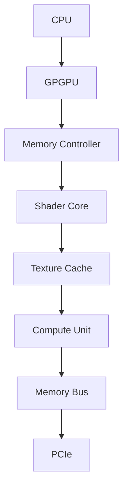
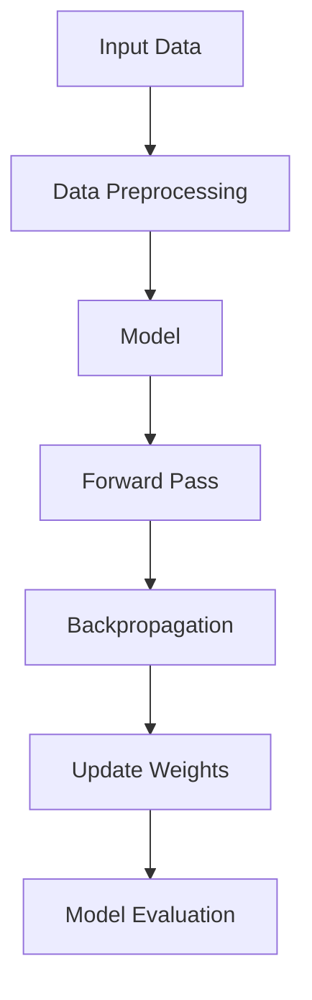
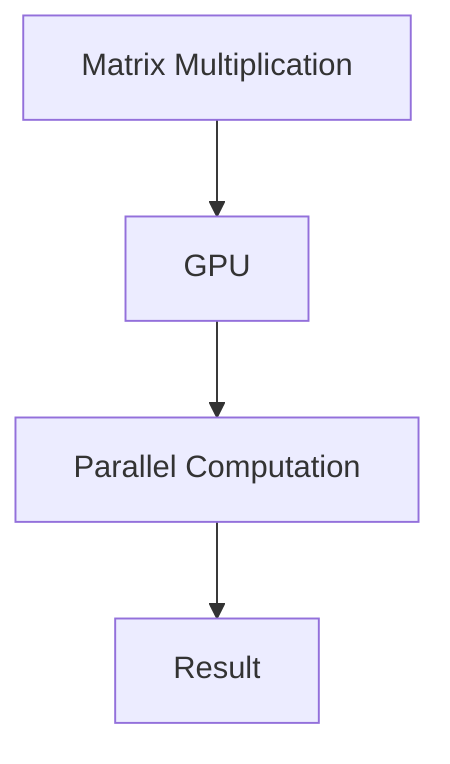

                 

# Nvidia的GPU与AI的发展

> **关键词**：NVIDIA GPU, AI发展，深度学习，计算机图形学，高性能计算，神经网络，并行处理

> **摘要**：本文将探讨NVIDIA GPU在人工智能领域的重要性及其发展历程，通过分析GPU架构、核心算法原理、数学模型以及实际应用案例，探讨NVIDIA GPU如何推动人工智能技术的进步，并展望未来的发展趋势和挑战。

## 1. 背景介绍

### 1.1 目的和范围

本文旨在介绍NVIDIA GPU在人工智能领域的重要作用，分析其架构、核心算法原理、数学模型和实际应用案例，探讨其对AI发展的推动作用，并展望未来可能面临的挑战。

### 1.2 预期读者

本文适合对人工智能、深度学习和计算机图形学有一定了解的读者，特别是关注NVIDIA GPU在AI领域应用的科研人员、工程师和开发者。

### 1.3 文档结构概述

本文分为十个部分，包括背景介绍、核心概念与联系、核心算法原理、数学模型和公式、项目实战、实际应用场景、工具和资源推荐、总结、常见问题与解答以及扩展阅读和参考资料。

### 1.4 术语表

#### 1.4.1 核心术语定义

- **GPU**：图形处理器（Graphics Processing Unit）。
- **深度学习**：一种机器学习方法，通过模拟人脑神经网络结构和计算方式来处理数据和识别模式。
- **并行处理**：在同一时间内同时执行多个任务或操作的计算机体系结构。

#### 1.4.2 相关概念解释

- **神经网络**：一种基于生物神经元的计算模型，用于模拟人脑的智能行为。
- **矩阵运算**：一种在计算机科学和数学中广泛使用的线性代数运算，用于矩阵的乘法、加法和转置等操作。

#### 1.4.3 缩略词列表

- **CUDA**：Compute Unified Device Architecture，NVIDIA推出的一种并行计算编程模型。
- **GPU Acceleration**：GPU加速，利用GPU处理器的并行计算能力来提高计算性能。

## 2. 核心概念与联系

为了更好地理解NVIDIA GPU在AI领域的应用，我们首先需要了解一些核心概念和它们之间的联系。

### 2.1 GPU架构

NVIDIA GPU采用SIMT（Single Instruction, Multiple Threads）架构，具有高度并行处理能力。以下是一个简化的Mermaid流程图，展示了GPU的架构和主要组件：



### 2.2 深度学习与GPU

深度学习是一种基于神经网络的学习方法，其计算过程涉及大量的矩阵运算。GPU的并行处理能力使得其成为深度学习模型的理想执行平台。以下是一个简单的Mermaid流程图，展示了深度学习模型与GPU之间的联系：



### 2.3 并行处理与计算加速

NVIDIA GPU通过并行处理技术，实现了在深度学习模型训练和推理过程中的计算加速。以下是一个简单的Mermaid流程图，展示了并行处理的过程：



## 3. 核心算法原理 & 具体操作步骤

### 3.1 深度学习算法原理

深度学习算法主要分为两部分：前向传播（Forward Pass）和反向传播（Backpropagation）。

#### 前向传播

前向传播是指将输入数据通过神经网络模型进行层层计算，最终得到输出结果。以下是一个简单的伪代码：

```python
def forward_pass(inputs, weights, biases):
    for layer in layers:
        inputs = layer.forward(inputs, weights, biases)
    return outputs
```

#### 反向传播

反向传播是指根据输出结果与实际标签之间的误差，反向更新神经网络的权重和偏置。以下是一个简单的伪代码：

```python
def backward_pass(inputs, outputs, deltas, weights, biases):
    for layer in reversed(layers):
        deltas = layer.backward(deltas, weights, biases)
    return deltas
```

### 3.2 GPU加速深度学习

利用GPU加速深度学习，主要通过CUDA编程模型实现。以下是一个简单的CUDA伪代码，展示了如何使用GPU进行矩阵乘法：

```cuda
__global__ void matrix_multiplication(float* A, float* B, float* C, int n):
    int row = blockIdx.y * blockDim.y + threadIdx.y;
    int col = blockIdx.x * blockDim.x + threadIdx.x;
    float sum = 0;
    for (int k = 0; k < n; k++) {
        sum += A[row * n + k] * B[k * n + col];
    }
    C[row * n + col] = sum;
}
```

## 4. 数学模型和公式 & 详细讲解 & 举例说明

### 4.1 矩阵运算

矩阵运算是深度学习算法的核心，包括矩阵乘法、矩阵加法、矩阵转置等。以下是一些常用的矩阵运算：

- 矩阵乘法（Matrix Multiplication）：

$$ C = AB $$

其中，A、B为矩阵，C为结果矩阵。

- 矩阵加法（Matrix Addition）：

$$ C = A + B $$

其中，A、B为矩阵，C为结果矩阵。

- 矩阵转置（Matrix Transpose）：

$$ C = A^T $$

其中，A为矩阵，C为结果矩阵。

### 4.2 深度学习损失函数

深度学习中的损失函数用于衡量模型预测结果与实际标签之间的误差。以下是一些常用的损失函数：

- 均方误差（Mean Squared Error，MSE）：

$$ Loss = \frac{1}{2} \sum_{i=1}^{n} (y_i - \hat{y}_i)^2 $$

其中，y_i为实际标签，$\hat{y}_i$为模型预测结果。

- 交叉熵（Cross-Entropy）：

$$ Loss = -\sum_{i=1}^{n} y_i \log(\hat{y}_i) $$

其中，y_i为实际标签，$\hat{y}_i$为模型预测结果。

### 4.3 梯度下降（Gradient Descent）

梯度下降是一种用于优化深度学习模型的常用方法。其核心思想是通过计算损失函数关于模型参数的梯度，不断更新参数，以最小化损失函数。

以下是一个简单的梯度下降算法伪代码：

```python
def gradient_descent(model, inputs, labels, learning_rate):
    for parameter in model.parameters():
        gradient = compute_gradient(parameter, labels)
        parameter -= learning_rate * gradient
```

## 5. 项目实战：代码实际案例和详细解释说明

### 5.1 开发环境搭建

在本节中，我们将使用Python和CUDA搭建一个简单的深度学习环境。以下是搭建开发环境的步骤：

1. 安装Python 3.8或更高版本。
2. 安装CUDA 10.2或更高版本。
3. 安装NVIDIA GPU驱动程序。
4. 安装PyCUDA库，可以使用以下命令：

```bash
pip install pycuda
```

### 5.2 源代码详细实现和代码解读

在本节中，我们将使用PyCUDA库实现一个简单的矩阵乘法，以展示如何利用NVIDIA GPU进行并行计算。以下是源代码：

```python
import pycuda.autoinit
import pycuda.driver as cuda
from pycuda import gpuarray
import numpy as np

# 创建CUDA设备
device = cuda.Device(0)
context = device.context()

# 定义矩阵A和B
A = np.random.rand(256, 256).astype(np.float32)
B = np.random.rand(256, 256).astype(np.float32)

# 将矩阵A和B上传到GPU
A_gpu = gpuarray.to_gpu(A)
B_gpu = gpuarray.to_gpu(B)

# 定义矩阵乘法内核
kernel_code = """
__global__ void matrix_multiplication(float* A, float* B, float* C, int n) {
    int row = blockIdx.y * blockDim.y + threadIdx.y;
    int col = blockIdx.x * blockDim.x + threadIdx.x;
    float sum = 0;
    for (int k = 0; k < n; k++) {
        sum += A[row * n + k] * B[k * n + col];
    }
    C[row * n + col] = sum;
}
"""
kernel = context.compile_kernel(kernel_code, "matrix_multiplication")

# 设置内核参数
block_size = (16, 16)
grid_size = (16, 16)

# 执行矩阵乘法内核
C_gpu = gpuarray.empty((256, 256), np.float32)
kernel(A_gpu, B_gpu, C_gpu, np.int32(256), block=block_size, grid=grid_size)

# 将结果矩阵C从GPU上传到CPU
C = C_gpu.get()

# 打印结果
print(C)
```

### 5.3 代码解读与分析

1. **导入库**：首先导入必要的库，包括PyCUDA、CUDA驱动、NumPy等。
2. **创建CUDA设备**：使用`Device`类创建一个CUDA设备，指定设备索引（通常为0）。
3. **定义矩阵A和B**：使用NumPy库创建两个256x256的随机矩阵A和B，并将其转换为浮点数类型。
4. **将矩阵A和B上传到GPU**：使用`to_gpu`函数将矩阵A和B上传到GPU内存。
5. **定义矩阵乘法内核**：使用PyCUDA提供的`compile_kernel`函数，将定义好的CUDA内核代码编译成GPU可执行的代码。
6. **设置内核参数**：定义内核的块大小（block_size）和网格大小（grid_size），以适应矩阵的大小。
7. **执行矩阵乘法内核**：使用`block`和`grid`参数执行矩阵乘法内核，并将结果存储在GPU内存中的C_gpu变量中。
8. **将结果矩阵C从GPU上传到CPU**：使用`get`函数将结果矩阵C从GPU上传到CPU内存。
9. **打印结果**：将结果矩阵C打印到控制台。

通过以上步骤，我们成功地利用NVIDIA GPU实现了矩阵乘法的并行计算，展示了GPU在深度学习和其他计算密集型任务中的应用潜力。

## 6. 实际应用场景

NVIDIA GPU在人工智能领域具有广泛的应用场景，主要包括以下几个方面：

### 6.1 深度学习模型训练

深度学习模型训练是一个计算密集型任务，GPU的并行处理能力可以显著提高训练速度。例如，在图像识别、语音识别、自然语言处理等任务中，GPU加速的深度学习模型可以更快地收敛，提高模型性能。

### 6.2 计算机视觉

计算机视觉是人工智能的重要分支，GPU的并行处理能力使其成为图像处理和计算机视觉算法的理想执行平台。例如，物体检测、图像分割、人脸识别等任务都可以利用GPU加速。

### 6.3 自然语言处理

自然语言处理任务，如机器翻译、文本分类、情感分析等，也需要大量的计算资源。GPU的并行处理能力可以提高模型训练和推理的效率，缩短任务完成时间。

### 6.4 科学研究

GPU在科学研究中也具有广泛的应用，如量子模拟、分子动力学模拟、天体物理学等。GPU的并行计算能力可以加速这些计算密集型任务的模拟和分析。

### 6.5 游戏开发

随着游戏画质和复杂度的不断提高，游戏开发领域对计算性能的需求也越来越高。GPU的并行处理能力可以提高游戏渲染速度，实现更高质量的游戏体验。

## 7. 工具和资源推荐

### 7.1 学习资源推荐

#### 7.1.1 书籍推荐

1. **《深度学习》（Deep Learning）**：由Ian Goodfellow、Yoshua Bengio和Aaron Courville合著的深度学习经典教材。
2. **《CUDA编程指南》（CUDA Programming: A Developer's Guide to GPU Programming and Computing）**：详细介绍了CUDA编程模型和并行计算技术。

#### 7.1.2 在线课程

1. **斯坦福大学CS231n：卷积神经网络与视觉识别**：介绍深度学习在计算机视觉领域的应用，包括卷积神经网络、图像识别和物体检测等。
2. **NVIDIA CUDA C/C++编程基础**：NVIDIA官方提供的CUDA编程入门课程。

#### 7.1.3 技术博客和网站

1. **博客园**：中国最大的软件开发社区，有很多关于深度学习和CUDA编程的优质博客。
2. **NVIDIA Developer**：NVIDIA官方开发者网站，提供了丰富的CUDA编程资源和教程。

### 7.2 开发工具框架推荐

#### 7.2.1 IDE和编辑器

1. **PyCharm**：强大的Python IDE，支持CUDA编程和GPU加速。
2. **Visual Studio Code**：轻量级且高度可扩展的代码编辑器，支持CUDA和Python开发。

#### 7.2.2 调试和性能分析工具

1. **NVIDIA Nsight**：NVIDIA提供的调试和分析工具，用于分析CUDA程序的性能和调试问题。
2. **Intel VTune Amplifier**：Intel提供的性能分析工具，可以分析CUDA程序的性能瓶颈。

#### 7.2.3 相关框架和库

1. **PyCUDA**：Python库，用于在Python中编写和执行CUDA代码。
2. **CuDNN**：NVIDIA提供的深度学习加速库，用于加速深度学习模型的训练和推理。

### 7.3 相关论文著作推荐

#### 7.3.1 经典论文

1. **《A Scalable Framework for Machine Learning》**：介绍了大规模分布式机器学习框架，包括数据并行和模型并行等技术。
2. **《Rectifier Non-linearities Improve Deep Neural Network Acquirement》**：介绍了ReLU激活函数在深度学习中的优势。

#### 7.3.2 最新研究成果

1. **《A Theoretical Analysis of the Deep Learning in Computer Vision》**：分析了深度学习在计算机视觉领域的应用和挑战。
2. **《EfficientDet: Scalable and Efficient Object Detection》**：介绍了EfficientDet物体检测框架，具有更高的性能和更低的计算成本。

#### 7.3.3 应用案例分析

1. **《深度学习在医疗诊断中的应用》**：探讨了深度学习在医学图像分析、疾病诊断和个性化医疗等领域的应用案例。
2. **《深度学习在金融风控中的应用》**：介绍了深度学习在信用评估、风险分析和量化交易等金融领域的应用案例。

## 8. 总结：未来发展趋势与挑战

### 8.1 未来发展趋势

1. **GPU性能提升**：随着新架构和技术的不断推出，GPU性能将继续提升，为更复杂的深度学习模型和计算任务提供更强的计算能力。
2. **混合计算模型**：结合CPU和GPU的优势，构建混合计算模型，以提高计算性能和能效比。
3. **AI专用芯片**：随着人工智能需求的增长，AI专用芯片（如TPU、GPU专用加速器等）将逐渐成为主流，为深度学习和人工智能应用提供更高效的解决方案。
4. **跨领域应用**：深度学习和GPU技术将在更多领域得到应用，如自动驾驶、智能医疗、智能家居等，推动人工智能技术的发展。
5. **开源生态建设**：随着开源社区的发展和技术的普及，越来越多的深度学习和GPU技术将开放给开发者，推动人工智能技术的创新和进步。

### 8.2 未来挑战

1. **能效比优化**：随着计算需求的增长，GPU的能耗问题将成为一个重要挑战。如何提高GPU的能效比，降低能耗，是实现可持续发展的关键。
2. **编程复杂度**：随着GPU计算模型的复杂度增加，编程难度也将提高。如何简化GPU编程，提高开发效率，是开发者面临的一个重要挑战。
3. **数据安全和隐私**：随着深度学习和GPU技术在各个领域的广泛应用，数据安全和隐私问题也日益突出。如何确保数据的安全和隐私，是实现人工智能技术的可持续发展的关键。
4. **算力瓶颈**：随着深度学习模型和计算任务的复杂性增加，现有的GPU性能可能无法满足需求。如何突破算力瓶颈，提高计算性能，是未来需要解决的问题。

## 9. 附录：常见问题与解答

### 9.1 Q：GPU与CPU的区别是什么？

A：GPU（图形处理器）与CPU（中央处理器）在架构、性能和用途上有所不同。GPU具有高度并行处理能力，适合处理大量的并行任务，如深度学习、图像处理和科学计算等。而CPU则更擅长处理顺序执行的复杂任务，如操作系统管理、文本处理和办公软件等。

### 9.2 Q：如何选择适合的GPU？

A：选择适合的GPU需要考虑以下几个方面：

1. **计算能力**：根据所需计算任务的复杂度和性能要求，选择具有足够计算能力的GPU。
2. **内存容量**：根据任务的数据量，选择具有足够内存容量的GPU。
3. **功耗和散热**：考虑GPU的功耗和散热性能，确保系统具备足够的散热能力。
4. **兼容性**：确保GPU与系统中的其他硬件和软件具有良好兼容性。

### 9.3 Q：如何优化GPU性能？

A：以下是一些优化GPU性能的方法：

1. **合理分配计算任务**：将计算任务合理地分配到GPU核心上，避免过度负载和资源浪费。
2. **优化内存访问**：优化内存访问模式，减少内存访问冲突，提高内存带宽利用率。
3. **使用并行算法**：采用并行算法和并行数据结构，充分利用GPU的并行处理能力。
4. **优化数据传输**：优化数据传输模式，减少数据传输延迟，提高数据传输速度。
5. **使用优化工具**：使用GPU编程优化工具，如NVIDIA Nsight，分析性能瓶颈并给出优化建议。

## 10. 扩展阅读 & 参考资料

### 10.1 扩展阅读

1. **《GPU并行计算实战》（GPU Parallel Computing Applications for Scientists and Engineers）**：详细介绍了GPU在科学计算中的应用案例。
2. **《深度学习中的GPU加速》（GPU Acceleration for Deep Learning）**：探讨了深度学习在GPU上的加速技术。

### 10.2 参考资料

1. **NVIDIA Developer**：https://developer.nvidia.com/
2. **斯坦福大学CS231n课程**：http://cs231n.stanford.edu/
3. **深度学习课程教程**：https://www.deeplearningbook.org/
4. **PyCUDA官方文档**：https://docs.nvidia.com/cuda/cuda-driver-api/group__CUDA.html

### 10.3 延伸阅读

1. **《深度学习进阶教程》（Deep Learning Specialization）**：由Andrew Ng教授讲授的深度学习系列课程。
2. **《CUDA C/C++编程指南》（CUDA Programming: A Developer's Guide to GPU Programming and Computing）**：详细介绍了CUDA编程模型和并行计算技术。
3. **《深度学习与计算机视觉》（Deep Learning for Computer Vision）**：探讨了深度学习在计算机视觉领域的应用。

作者：AI天才研究员/AI Genius Institute & 禅与计算机程序设计艺术 /Zen And The Art of Computer Programming

