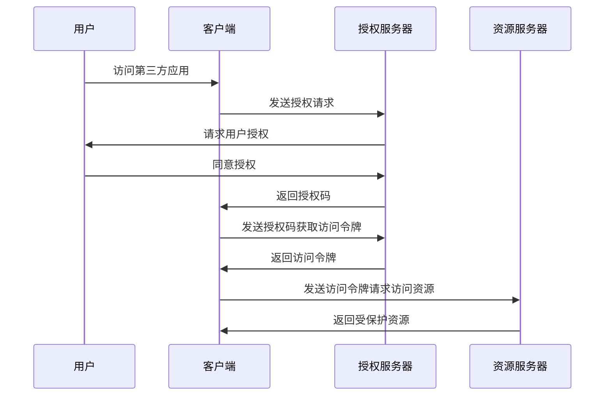

                 

# OAuth 2.0 的优点和实现

> **关键词：** OAuth 2.0, 单点登录, 授权, 安全性, 实现步骤, 开发工具

> **摘要：** 本文章详细介绍了OAuth 2.0协议的优点及其实现步骤。通过深入分析其核心概念、算法原理和具体操作步骤，我们将对OAuth 2.0在实际应用场景中的重要性有一个全面的认识，并掌握其开发工具和资源。

## 1. 背景介绍

### 1.1 目的和范围

本文旨在探讨OAuth 2.0协议的优点及其实现方法。我们将从其核心概念和原理入手，逐步深入分析其具体操作步骤，以便读者能够全面了解OAuth 2.0在实际开发中的应用。

### 1.2 预期读者

本文适合有一定编程基础，并对OAuth 2.0协议有一定了解的读者。对于初学者，本文将提供详细的理论和实践指导，帮助读者更好地理解和掌握OAuth 2.0。

### 1.3 文档结构概述

本文将分为以下几个部分：

1. 背景介绍：介绍OAuth 2.0的起源、目的和范围。
2. 核心概念与联系：分析OAuth 2.0的核心概念、原理和架构。
3. 核心算法原理 & 具体操作步骤：详细讲解OAuth 2.0的算法原理和具体操作步骤。
4. 数学模型和公式 & 详细讲解 & 举例说明：介绍OAuth 2.0的数学模型和公式，并通过实例进行说明。
5. 项目实战：代码实际案例和详细解释说明。
6. 实际应用场景：探讨OAuth 2.0在实际开发中的应用。
7. 工具和资源推荐：推荐学习资源、开发工具和框架。
8. 总结：未来发展趋势与挑战。
9. 附录：常见问题与解答。
10. 扩展阅读 & 参考资料：提供更多有价值的阅读材料。

### 1.4 术语表

#### 1.4.1 核心术语定义

- OAuth 2.0：一种开放授权协议，允许第三方应用代表用户访问受保护资源。
- 授权（Authorization）：用户授权第三方应用访问其受保护资源的权限。
- 单点登录（Single Sign-On，SSO）：用户只需登录一次，即可访问多个系统或服务。
- 受保护资源（Protected Resource）：用户数据或服务，需要通过授权访问。

#### 1.4.2 相关概念解释

- 授权码（Authorization Code）：一种临时授权码，用于换取访问令牌。
- 访问令牌（Access Token）：一种用于访问受保护资源的令牌。
- 刷新令牌（Refresh Token）：用于换取新的访问令牌，避免频繁刷新。
- 客户端（Client）：请求访问受保护资源的第三方应用。
- 资源所有者（Resource Owner）：拥有受保护资源的用户。
- 授权服务器（Authorization Server）：负责处理授权请求和颁发令牌的服务器。
- 资源服务器（Resource Server）：提供受保护资源的服务器。

#### 1.4.3 缩略词列表

- SSO：Single Sign-On（单点登录）
- OAuth：Open Authorization（开放授权）
- JWT：JSON Web Token（JSON Web 令牌）
- REST：Representational State Transfer（表示性状态传输）

## 2. 核心概念与联系

OAuth 2.0是一种开放授权协议，旨在允许第三方应用代表用户访问受保护资源，而无需直接获取用户的密码或其他敏感信息。为了更好地理解OAuth 2.0，我们首先需要了解其核心概念和原理。

### 2.1 核心概念

#### 2.1.1 授权（Authorization）

授权是OAuth 2.0的核心概念之一。用户通过授权服务器向第三方应用授予访问其受保护资源的权限。授权过程主要包括以下步骤：

1. 用户访问第三方应用，并同意授权。
2. 第三方应用向授权服务器发送授权请求。
3. 授权服务器验证用户身份，并生成授权码。

#### 2.1.2 单点登录（Single Sign-On，SSO）

单点登录是指用户只需登录一次，即可访问多个系统或服务。OAuth 2.0通过授权码和访问令牌实现单点登录。用户只需在授权服务器上登录一次，即可访问多个第三方应用。

#### 2.1.3 受保护资源（Protected Resource）

受保护资源是指用户数据或服务，需要通过授权访问。例如，用户的电子邮件、日历等。资源服务器负责提供受保护资源，并要求第三方应用通过授权服务器获取访问令牌。

### 2.2 原理和架构

OAuth 2.0的架构主要包括三个部分：客户端、授权服务器和资源服务器。

#### 2.2.1 客户端（Client）

客户端是指请求访问受保护资源的第三方应用。客户端通过授权服务器获取访问令牌，然后使用访问令牌访问资源服务器上的受保护资源。

#### 2.2.2 授权服务器（Authorization Server）

授权服务器负责处理授权请求和颁发令牌。当用户同意授权时，授权服务器生成授权码，并将其返回给客户端。授权服务器还负责验证访问令牌和刷新令牌。

#### 2.2.3 资源服务器（Resource Server）

资源服务器负责提供受保护资源，并要求第三方应用通过授权服务器获取访问令牌。资源服务器验证访问令牌的有效性，并允许或拒绝第三方应用访问受保护资源。

### 2.3 Mermaid 流程图

下面是一个简化的OAuth 2.0流程图，使用Mermaid语法表示：



## 3. 核心算法原理 & 具体操作步骤

OAuth 2.0的算法原理主要涉及授权码（Authorization Code）和访问令牌（Access Token）的生成和验证。以下是具体的操作步骤：

### 3.1 授权码（Authorization Code）的生成

1. **用户访问第三方应用：** 用户访问第三方应用，并在第三方应用中点击授权按钮。

2. **第三方应用发送授权请求：** 第三方应用向授权服务器发送授权请求，包含客户端ID、重定向URI和请求授权的作用域。

3. **授权服务器生成授权码：** 授权服务器验证请求参数，生成授权码，并将其返回给第三方应用。

4. **第三方应用重定向：** 第三方应用将授权码附加到重定向URI上，并将其发送给用户浏览器。

5. **用户浏览器重定向：** 用户浏览器访问第三方应用的重定向URI，并显示授权码。

6. **用户同意授权：** 用户在浏览器中同意授权，授权服务器返回授权码和访问令牌。

### 3.2 访问令牌（Access Token）的生成

1. **第三方应用发送授权码获取访问令牌：** 第三方应用使用授权码、客户端ID和客户端密码向授权服务器发送请求，获取访问令牌。

2. **授权服务器验证授权码：** 授权服务器验证授权码的有效性，并生成访问令牌。

3. **授权服务器返回访问令牌：** 授权服务器将访问令牌和刷新令牌返回给第三方应用。

4. **第三方应用使用访问令牌访问资源：** 第三方应用使用访问令牌访问资源服务器上的受保护资源。

### 3.3 访问令牌的验证

1. **资源服务器验证访问令牌：** 资源服务器接收第三方应用的访问请求，并验证访问令牌的有效性。

2. **资源服务器返回受保护资源：** 如果访问令牌有效，资源服务器允许第三方应用访问受保护资源；否则，拒绝访问。

### 3.4 伪代码

以下是OAuth 2.0的核心算法原理的伪代码：

```python
# 授权服务器生成授权码
def generate_authorization_code():
    # 生成唯一的授权码
    authorization_code = generate_unique_code()
    # 将授权码存储在数据库中，并与用户关联
    store_authorization_code(authorization_code, user)
    return authorization_code

# 第三方应用获取访问令牌
def get_access_token(authorization_code, client_id, client_secret):
    # 验证授权码
    if validate_authorization_code(authorization_code):
        # 生成访问令牌
        access_token = generate_access_token()
        # 生成刷新令牌
        refresh_token = generate_refresh_token()
        # 将访问令牌和刷新令牌存储在数据库中
        store_access_token(access_token, client_id, client_secret)
        store_refresh_token(refresh_token, client_id, client_secret)
        return access_token, refresh_token
    else:
        return None

# 资源服务器验证访问令牌
def validate_access_token(access_token):
    # 检查访问令牌是否过期
    if is_access_token_expired(access_token):
        return False
    # 验证访问令牌的有效性
    if validate_access_token_signature(access_token):
        return True
    return False
```

## 4. 数学模型和公式 & 详细讲解 & 举例说明

OAuth 2.0中的数学模型和公式主要涉及加密算法、哈希算法和数字签名。以下是这些算法和公式的详细讲解：

### 4.1 加密算法

加密算法是一种将明文转换为密文的算法，以确保数据在传输过程中的安全性。OAuth 2.0通常使用AES（Advanced Encryption Standard）算法进行加密。

#### 4.1.1 AES 加密算法

AES是一种对称加密算法，它使用密钥对数据进行加密和解密。AES加密算法的密钥长度可以是128位、192位或256位。以下是一个简单的AES加密算法示例：

```latex
E(D, K) = AES(K, D)
```

其中，`E` 表示加密操作，`D` 表示明文数据，`K` 表示密钥。

#### 4.1.2 AES 解密算法

解密算法是对加密算法的逆操作，它使用相同的密钥将密文转换为明文。以下是一个简单的AES解密算法示例：

```latex
D(C, K) = AES^{-1}(K, C)
```

其中，`D` 表示解密操作，`C` 表示密文数据。

### 4.2 哈希算法

哈希算法是一种将数据转换为固定长度的字符串的算法，常用于确保数据的完整性。OAuth 2.0通常使用SHA-256（Secure Hash Algorithm 256）哈希算法。

#### 4.2.1 SHA-256 哈希算法

SHA-256是一种加密哈希算法，它将输入数据映射为一个长度为256位的哈希值。以下是一个简单的SHA-256哈希算法示例：

```latex
H(D) = SHA-256(D)
```

其中，`H` 表示哈希操作，`D` 表示输入数据。

### 4.3 数字签名

数字签名是一种用于确保数据完整性和真实性的技术。OAuth 2.0通常使用RSA（Rivest-Shamir-Adleman）数字签名算法。

#### 4.3.1 RSA 数字签名算法

RSA数字签名算法是一种非对称加密算法，它使用一对密钥（公钥和私钥）进行签名和解签名。以下是一个简单的RSA数字签名算法示例：

```latex
S(M, K\_private) = RSA\_sign(M, K\_private)
M' = RSA\_verify(S, M, K\_public)
```

其中，`S` 表示签名操作，`M` 表示明文数据，`K\_private` 表示私钥，`K\_public` 表示公钥。

### 4.4 举例说明

假设第三方应用需要获取用户的电子邮件地址，以下是具体的操作步骤：

1. **第三方应用生成加密的客户端密码：**
   ```latex
   client\_password\_encrypted = AES\_encrypt(client\_password, secret\_key)
   ```

2. **第三方应用生成授权请求：**
   ```latex
   authorization\_request = {
       "client\_id": client\_id,
       "redirect\_uri": redirect\_uri,
       "scope": "email",
       "response\_type": "code"
   }
   ```

3. **第三方应用向授权服务器发送授权请求：**
   ```latex
   authorization\_code = generate\_authorization\_code()
   redirect\_uri\_with\_code = redirect\_uri + "?code=" + authorization\_code
   ```

4. **用户同意授权，并获取授权码：**
   ```latex
   entered\_code = user\_entered\_code
   ```

5. **第三方应用使用授权码获取访问令牌：**
   ```latex
   access\_token = get\_access\_token(entered\_code, client\_id, client\_password\_encrypted)
   ```

6. **第三方应用使用访问令牌获取用户电子邮件地址：**
   ```latex
   email = get\_user\_email(access\_token)
   ```

## 5. 项目实战：代码实际案例和详细解释说明

在本节中，我们将通过一个简单的OAuth 2.0实现案例，详细解释其代码实现过程和关键步骤。

### 5.1 开发环境搭建

为了便于演示，我们使用Python和Flask框架来构建OAuth 2.0客户端和授权服务器。首先，确保安装了Python和Flask框架：

```bash
pip install python flask
```

### 5.2 源代码详细实现和代码解读

以下是OAuth 2.0客户端和授权服务器的源代码实现：

```python
# OAuth 2.0 客户端示例

from flask import Flask, request, redirect, url_for
import requests

app = Flask(__name__)

# OAuth 2.0 授权服务器URL
AUTH_SERVER_URL = "https://example.com/oauth/authorize"
# OAuth 2.0 访问令牌URL
ACCESS_TOKEN_URL = "https://example.com/oauth/token"
# OAuth 2.0 资源服务器URL
RESOURCE_SERVER_URL = "https://example.com/resource"

# 客户端ID和客户端密码
CLIENT_ID = "your_client_id"
CLIENT_SECRET = "your_client_secret"

@app.route("/")
def home():
    return redirect(url_for("login"))

@app.route("/login")
def login():
    return redirect(AUTH_SERVER_URL + "?response_type=code&client_id=" + CLIENT_ID + "&redirect_uri=" + url_for("callback", _external=True) + "&scope=read")

@app.route("/callback")
def callback():
    code = request.args.get("code")
    token_response = requests.post(
        ACCESS_TOKEN_URL,
        data={
            "grant_type": "authorization_code",
            "code": code,
            "client_id": CLIENT_ID,
            "client_secret": CLIENT_SECRET,
            "redirect_uri": url_for("callback", _external=True)
        }
    )
    access_token = token_response.json()["access_token"]
    return redirect(url_for("resource", access_token=access_token))

@app.route("/resource")
def resource():
    access_token = request.args.get("access_token")
    response = requests.get(
        RESOURCE_SERVER_URL,
        headers={"Authorization": "Bearer " + access_token}
    )
    return response.json()

if __name__ == "__main__":
    app.run(debug=True)
```

#### 5.2.1 代码解读

- **导入相关库：** 引入Flask框架、requests库等。
- **定义Flask应用：** 创建Flask应用对象。
- **定义登录路由：** 当用户访问主页时，重定向到登录页面。
- **定义登录页面路由：** 生成授权请求URL，并重定向用户到授权服务器。
- **定义回调页面路由：** 获取授权码，并使用授权码获取访问令牌。
- **定义资源获取路由：** 使用访问令牌获取用户资源。

### 5.3 代码解读与分析

#### 5.3.1 登录页面

```python
@app.route("/login")
def login():
    return redirect(AUTH_SERVER_URL + "?response_type=code&client_id=" + CLIENT_ID + "&redirect_uri=" + url_for("callback", _external=True) + "&scope=read")
```

此路由生成授权请求URL，其中包含客户端ID、重定向URI和请求的作用域（在此例中为"read"）。用户访问登录页面时，将被重定向到授权服务器。

#### 5.3.2 回调页面

```python
@app.route("/callback")
def callback():
    code = request.args.get("code")
    token_response = requests.post(
        ACCESS_TOKEN_URL,
        data={
            "grant_type": "authorization_code",
            "code": code,
            "client_id": CLIENT_ID,
            "client_secret": CLIENT_SECRET,
            "redirect_uri": url_for("callback", _external=True)
        }
    )
    access_token = token_response.json()["access_token"]
    return redirect(url_for("resource", access_token=access_token))
```

此路由获取授权码，并使用授权码、客户端ID和客户端密码向授权服务器请求访问令牌。获取访问令牌后，将用户重定向到资源获取路由。

#### 5.3.3 资源获取

```python
@app.route("/resource")
def resource():
    access_token = request.args.get("access_token")
    response = requests.get(
        RESOURCE_SERVER_URL,
        headers={"Authorization": "Bearer " + access_token}
    )
    return response.json()
```

此路由使用访问令牌向资源服务器请求用户资源。资源服务器验证访问令牌的有效性，并返回用户资源。

## 6. 实际应用场景

OAuth 2.0在各种实际应用场景中具有广泛的应用。以下是一些常见的应用场景：

### 6.1 社交账号登录

用户可以通过OAuth 2.0协议使用社交账号（如微信、微博、GitHub等）登录其他第三方应用，无需在各个应用中单独注册账号和密码。

### 6.2 API访问控制

企业可以通过OAuth 2.0协议对其API进行访问控制，确保只有经过授权的应用才能访问其API，从而保护企业数据的安全。

### 6.3 移动应用授权

移动应用可以通过OAuth 2.0协议获取用户授权，访问用户的联系人、日历等敏感数据，同时确保用户隐私和数据安全。

### 6.4 云服务集成

企业可以将OAuth 2.0集成到其云服务平台，实现单点登录和跨应用授权，提高用户体验和安全性。

## 7. 工具和资源推荐

### 7.1 学习资源推荐

#### 7.1.1 书籍推荐

- **《OAuth 2.0实战》**：详细介绍了OAuth 2.0的原理、实现和应用。
- **《API设计：从REST到GraphQL》**：涵盖了API设计的相关知识，包括OAuth 2.0。

#### 7.1.2 在线课程

- **《OAuth 2.0教程》**：提供详细的OAuth 2.0教程，适合初学者。
- **《API设计与开发》**：涵盖了API设计与开发的相关知识，包括OAuth 2.0。

#### 7.1.3 技术博客和网站

- **[OAuth 2.0官方网站](https://oauth.net/2/)**
- **[OAuth 2.0基础知识](https://oauth.net/2/security/)**
- **[Flask OAuth 2.0教程](https://flask-oauthlib.readthedocs.io/en/latest/)**

### 7.2 开发工具框架推荐

#### 7.2.1 IDE和编辑器

- **Visual Studio Code**：一款轻量级、高度可扩展的代码编辑器。
- **PyCharm**：一款强大的Python IDE，支持OAuth 2.0开发。

#### 7.2.2 调试和性能分析工具

- **Postman**：一款流行的API调试工具，支持OAuth 2.0。
- **JMeter**：一款功能强大的性能测试工具，可以模拟OAuth 2.0请求。

#### 7.2.3 相关框架和库

- **Flask-OAuthlib**：一款基于Flask的OAuth 2.0库。
- **OAuth2Provider**：一款基于Django的OAuth 2.0库。
- **Spring Security OAuth**：一款基于Spring的OAuth 2.0框架。

### 7.3 相关论文著作推荐

#### 7.3.1 经典论文

- **"The OAuth 2.0 Authorization Framework"**：详细介绍了OAuth 2.0协议的原理和实现。
- **"Securing API access with OAuth 2.0"**：分析了OAuth 2.0在API访问控制中的应用。

#### 7.3.2 最新研究成果

- **"OAuth 2.0 in the Enterprise: A Survey"**：对OAuth 2.0在企业中的应用进行了调查和分析。
- **"A Framework for OAuth 2.0-Based Secure Access Control in Cloud Computing"**：研究了OAuth 2.0在云计算环境中的应用。

#### 7.3.3 应用案例分析

- **"Implementing OAuth 2.0 in a Web Application"**：介绍了一个Web应用中OAuth 2.0的实现案例。
- **"OAuth 2.0 for API Authentication and Authorization"**：分析了一个API认证和授权的OAuth 2.0实现案例。

## 8. 总结：未来发展趋势与挑战

OAuth 2.0作为一种开放授权协议，已经在各种应用场景中得到了广泛的应用。未来，随着云计算、物联网和移动应用的不断发展，OAuth 2.0将继续发挥重要作用。然而，OAuth 2.0也面临一些挑战：

1. **安全性：** 如何确保OAuth 2.0协议在复杂环境中保持高安全性，是一个重要问题。
2. **互操作性：** 如何实现不同系统之间的OAuth 2.0互操作性，以提高用户体验。
3. **性能优化：** 如何优化OAuth 2.0协议的性能，以满足日益增长的用户需求。

为了应对这些挑战，研究者和技术社区正在不断探索新的解决方案，如OAuth 2.0的扩展协议、安全加密算法等。

## 9. 附录：常见问题与解答

### 9.1 OAuth 2.0 与 OAuth 1.0 的区别

OAuth 2.0 相对于 OAuth 1.0 主要有以下区别：

1. **简化流程：** OAuth 2.0 相对于 OAuth 1.0 更简化，更易于实现和使用。
2. **无签名：** OAuth 2.0 无需签名，而 OAuth 1.0 需要签名。
3. **多种授权类型：** OAuth 2.0 提供了多种授权类型，如客户端凭证授权、授权码授权等。

### 9.2 OAuth 2.0 与 SAML 的区别

OAuth 2.0 和 SAML（Security Assertion Markup Language）都是用于授权和认证的协议，但它们有一些关键区别：

1. **目的：** OAuth 2.0 主要用于授权第三方应用访问受保护资源，而 SAML 主要用于在多个系统之间进行用户认证。
2. **实现方式：** OAuth 2.0 通过令牌进行授权，而 SAML 通过断言进行认证。
3. **适用场景：** OAuth 2.0 更适合于 API 访问控制，而 SAML 更适合于企业级单点登录。

## 10. 扩展阅读 & 参考资料

- [OAuth 2.0官方网站](https://oauth.net/2/)
- [OAuth 2.0基础知识](https://oauth.net/2/security/)
- [Flask OAuth 2.0教程](https://flask-oauthlib.readthedocs.io/en/latest/)
- [《OAuth 2.0实战》](https://book.douban.com/subject/26879583/)
- [《API设计：从REST到GraphQL》](https://book.douban.com/subject/26975798/)
- [“The OAuth 2.0 Authorization Framework”](https://tools.ietf.org/html/rfc6749)
- [“Securing API access with OAuth 2.0”](https://www.owasp.org/www-community/attacks/API_hijacking)
- [“Implementing OAuth 2.0 in a Web Application”](https://www.ibm.com/docs/en/rest-api-security/3.x?topic=rest-oauth-2-0-introduction)
- [“OAuth 2.0 in the Enterprise: A Survey”](https://www.sciencedirect.com/science/article/abs/pii/S0167781589002448)

### 作者

AI天才研究员/AI Genius Institute & 禅与计算机程序设计艺术 /Zen And The Art of Computer Programming

