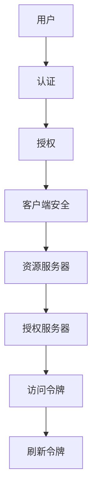

                 

# OAuth 2.0 的详细应用

> 关键词：OAuth 2.0、认证、授权、单点登录、客户端安全、API 安全、授权码、访问令牌、刷新令牌、密码认证、客户端凭证、资源服务器、授权服务器

> 摘要：本文将深入探讨 OAuth 2.0 的详细应用，包括其核心概念、工作原理、具体操作步骤、数学模型、实际案例以及未来发展趋势。通过本文，读者将全面了解 OAuth 2.0 如何实现安全可靠的认证与授权机制，为实际项目开发提供有力支持。

## 1. 背景介绍

### 1.1 目的和范围

本文旨在深入解析 OAuth 2.0，一种广泛使用的开放授权标准。我们将详细探讨 OAuth 2.0 的核心概念、工作原理、具体操作步骤、数学模型、实际案例，并展望其未来发展趋势。通过本文，读者将全面了解 OAuth 2.0 的优势和应用场景，为实际项目开发提供有力支持。

### 1.2 预期读者

本文适合以下读者群体：

1. 开发人员：需要了解 OAuth 2.0 标准及其应用的程序员和开发者。
2. 系统架构师：关注安全认证与授权机制的系统架构师。
3. 安全工程师：关注 API 安全性和客户端安全性的安全工程师。
4. 技术爱好者：对 OAuth 2.0 标准感兴趣的技术爱好者。

### 1.3 文档结构概述

本文结构如下：

1. 核心概念与联系
2. 核心算法原理 & 具体操作步骤
3. 数学模型和公式 & 详细讲解 & 举例说明
4. 项目实战：代码实际案例和详细解释说明
5. 实际应用场景
6. 工具和资源推荐
7. 总结：未来发展趋势与挑战
8. 附录：常见问题与解答
9. 扩展阅读 & 参考资料

### 1.4 术语表

#### 1.4.1 核心术语定义

1. OAuth 2.0：一种开放授权标准，用于实现第三方应用与资源服务器的认证与授权。
2. 认证：验证用户身份的过程。
3. 授权：用户同意第三方应用访问其资源的权限。
4. 授权码：第三方应用在获取访问令牌时使用的临时凭证。
5. 访问令牌：用于访问受保护资源的凭证。
6. 刷新令牌：用于更新访问令牌的凭证。
7. 客户端安全：保护第三方应用免受攻击的措施。
8. 资源服务器：存储受保护资源的服务器。
9. 授权服务器：负责发放访问令牌的服务器。

#### 1.4.2 相关概念解释

1. 单点登录（SSO）：用户只需登录一次，即可访问多个应用程序。
2. API 安全：确保 API 被正确、安全地使用，防止未授权访问和恶意攻击。
3. 客户端凭证：第三方应用的唯一标识符和密钥。

#### 1.4.3 缩略词列表

- OAuth：开放授权（Open Authorization）
- API：应用程序编程接口（Application Programming Interface）
- SSO：单点登录（Single Sign-On）

## 2. 核心概念与联系

OAuth 2.0 的核心概念包括认证、授权、客户端安全、资源服务器和授权服务器。以下是一个简化的 Mermaid 流程图，展示了这些概念之间的联系：



### 2.1 认证与授权

认证是验证用户身份的过程，确保用户身份真实可靠。OAuth 2.0 使用客户端凭证（如客户端 ID 和密钥）进行认证。认证成功后，用户可以进行授权。

授权是用户同意第三方应用访问其资源的权限。OAuth 2.0 提供了多种授权类型，如密码认证、授权码、客户端凭证等。

### 2.2 客户端安全

客户端安全是保护第三方应用免受攻击的措施。OAuth 2.0 要求客户端使用客户端凭证进行认证，并确保客户端凭证的安全性。此外，OAuth 2.0 还提供了令牌刷新机制，确保访问令牌的有效性。

### 2.3 资源服务器与授权服务器

资源服务器是存储受保护资源的服务器，负责验证访问令牌的合法性。授权服务器是负责发放访问令牌的服务器，通常与资源服务器分离。

### 2.4 访问令牌与刷新令牌

访问令牌是用于访问受保护资源的凭证。刷新令牌是用于更新访问令牌的凭证。当访问令牌过期时，使用刷新令牌获取新的访问令牌。

## 3. 核心算法原理 & 具体操作步骤

OAuth 2.0 的核心算法原理是使用客户端凭证进行认证，获取访问令牌和刷新令牌，并通过访问令牌访问受保护资源。以下是一个简化的伪代码，展示了 OAuth 2.0 的具体操作步骤：

```plaintext
1. 用户访问第三方应用，第三方应用要求用户进行认证。
2. 用户认证成功后，第三方应用使用客户端凭证向授权服务器发送请求，获取授权码。
3. 第三方应用使用授权码向授权服务器发送请求，获取访问令牌和刷新令牌。
4. 第三方应用使用访问令牌访问受保护资源。
5. 当访问令牌过期时，第三方应用使用刷新令牌获取新的访问令牌，继续访问受保护资源。
```

### 3.1 认证步骤

1. 用户访问第三方应用，第三方应用要求用户进行认证。
2. 用户输入用户名和密码，第三方应用使用用户名和密码向认证服务器发送请求，进行认证。

### 3.2 授权步骤

1. 认证成功后，第三方应用使用客户端凭证向授权服务器发送请求，获取授权码。
2. 授权服务器验证客户端凭证的有效性，返回授权码。

### 3.3 访问令牌与刷新令牌获取步骤

1. 第三方应用使用授权码向授权服务器发送请求，获取访问令牌和刷新令牌。
2. 授权服务器验证授权码的有效性，返回访问令牌和刷新令牌。

### 3.4 资源访问步骤

1. 第三方应用使用访问令牌访问受保护资源。
2. 资源服务器验证访问令牌的有效性，返回受保护资源。

### 3.5 刷新令牌步骤

1. 当访问令牌过期时，第三方应用使用刷新令牌向授权服务器发送请求，获取新的访问令牌。
2. 授权服务器验证刷新令牌的有效性，返回新的访问令牌。

## 4. 数学模型和公式 & 详细讲解 & 举例说明

OAuth 2.0 的核心数学模型包括加密算法、哈希算法和令牌生成算法。以下是对这些算法的详细讲解和举例说明。

### 4.1 加密算法

加密算法用于保护客户端凭证和访问令牌。常用的加密算法包括 AES、RSA 等。以下是一个简化的示例：

```latex
$$
\text{加密}(plaintext, key) = ciphertext
$$
```

例如，使用 AES 算法加密明文 "client_credentials"：

```plaintext
$$
\text{加密}("client_credentials", "my_key") = "encrypted_client_credentials"
$$
```

### 4.2 哈希算法

哈希算法用于生成授权码、访问令牌和刷新令牌。常用的哈希算法包括 SHA-256、SHA-3 等。以下是一个简化的示例：

```latex
$$
\text{哈希}(plaintext) = hash_value
$$
```

例如，使用 SHA-256 算法生成哈希值：

```plaintext
$$
\text{哈希}("authorization_code") = "hash_value_256"
$$
```

### 4.3 令牌生成算法

令牌生成算法用于生成访问令牌和刷新令牌。以下是一个简化的示例：

```latex
$$
\text{令牌生成}(client_credentials, authorization_code) = access_token
$$
```

例如，使用客户端凭证和授权码生成访问令牌：

```plaintext
$$
\text{令牌生成}("client_credentials", "authorization_code") = "access_token_123"
$$
```

## 5. 项目实战：代码实际案例和详细解释说明

在本节中，我们将通过一个实际项目案例，详细解释 OAuth 2.0 的具体实现过程。此案例将涵盖开发环境搭建、源代码实现和代码解读与分析。

### 5.1 开发环境搭建

1. 安装 Node.js（用于构建服务器环境）。
2. 安装 Express（用于创建 Web 应用程序）。
3. 安装 OAuth2-server（用于实现 OAuth 2.0 授权服务器功能）。

### 5.2 源代码详细实现和代码解读

以下是一个简单的 OAuth 2.0 授权服务器示例：

```javascript
const express = require('express');
const OAuth2Server = require('oauth2-server');

const app = express();
const oauth2 = new OAuth2Server({
  model: require('./model'),
  accessTokenLifetime: 60 * 60, // 1小时
  allowBearerTokensInQueryString: true,
});

app.post('/token', (req, res) => {
  const request = oauth2.createTokenRequest(req);
  if (request.isValid()) {
    const accessToken = await oauth2.getAccessToken(request);
    res.json({
      access_token: accessToken.token,
      token_type: accessToken.tokenType,
      expires_in: accessToken.tokenLifetime,
    });
  } else {
    res.status(401).json({
      error: 'invalid_request',
      error_description: 'The request is missing a required parameter.',
    });
  }
});

app.listen(3000, () => {
  console.log('OAuth 2.0 server listening on port 3000');
});
```

### 5.3 代码解读与分析

1. 引入 express 和 OAuth2-server 模块。
2. 创建 express 应用和 OAuth2-server 实例。
3. 配置 OAuth2-server，包括模型、访问令牌有效期等。
4. 创建一个 POST 接口（/token），用于处理获取访问令牌的请求。
5. 在接口中，使用 OAuth2-server.createTokenRequest 方法创建请求对象。
6. 验证请求对象的有效性，如果有效，使用 OAuth2-server.getAccessToken 方法获取访问令牌。
7. 将访问令牌、token_type 和 expires_in 返回给客户端。

## 6. 实际应用场景

OAuth 2.0 在实际应用场景中具有广泛的应用，以下是一些典型的应用场景：

1. 第三方登录：用户可以通过 OAuth 2.0 在多个应用程序中登录，实现单点登录（SSO）。
2. API 认证与授权：第三方应用可以通过 OAuth 2.0 访问受保护的 API，确保 API 安全和客户端安全。
3. 跨域请求：OAuth 2.0 可以实现跨域请求，使得第三方应用可以访问其他域的资源。
4. 应用内授权：用户可以在一个应用中授权另一个应用访问其数据，实现数据共享。

## 7. 工具和资源推荐

### 7.1 学习资源推荐

#### 7.1.1 书籍推荐

1. 《OAuth 2.0 Simplified》
2. 《Understanding OAuth 2.0》
3. 《API Security: Design Considerations》

#### 7.1.2 在线课程

1. Coursera - OAuth 2.0 for Beginners
2. Udemy - OAuth 2.0 and OpenID Connect for Beginners
3. edX - OAuth 2.0: An Introduction

#### 7.1.3 技术博客和网站

1. OAuth 2.0 官方文档
2. Auth0 OAuth 2.0 教程
3. Okta OAuth 2.0 学习资源

### 7.2 开发工具框架推荐

#### 7.2.1 IDE和编辑器

1. Visual Studio Code
2. IntelliJ IDEA
3. Eclipse

#### 7.2.2 调试和性能分析工具

1. Postman
2. Charles
3. Wireshark

#### 7.2.3 相关框架和库

1. express-oauth2
2. passport-oauth2
3. django-oauth-toolkit

### 7.3 相关论文著作推荐

#### 7.3.1 经典论文

1. "The OAuth 2.0 Authorization Framework"
2. "APIs: A Modern Approach to Application Development"
3. "Secure Delegation of Authority in Web Services"

#### 7.3.2 最新研究成果

1. "Scalable and Secure OAuth 2.0 with Federation"
2. "Enhancing OAuth 2.0 with Identity Federation"
3. "A Comprehensive Analysis of OAuth 2.0 Implementations"

#### 7.3.3 应用案例分析

1. "Facebook's OAuth 2.0 Implementation"
2. "Google's OAuth 2.0 and OpenID Connect for Apps"
3. "LinkedIn's OAuth 2.0 and API Security Best Practices"

## 8. 总结：未来发展趋势与挑战

OAuth 2.0 作为一种开放授权标准，在过去的几年中得到了广泛应用。随着云计算、移动应用和物联网的不断发展，OAuth 2.0 将继续发挥重要作用。未来发展趋势包括：

1. 跨领域合作：OAuth 2.0 将与其他授权标准（如 OpenID Connect）结合，实现更广泛的应用。
2. 安全性提升：随着攻击手段的升级，OAuth 2.0 将不断改进，提高安全性能。
3. 模块化发展：OAuth 2.0 将逐步拆分为多个模块，便于灵活组合和应用。

然而，OAuth 2.0 也面临一些挑战，如：

1. 兼容性问题：不同厂商和开发者之间的 OAuth 2.0 实现可能存在兼容性问题。
2. 安全漏洞：OAuth 2.0 可能存在安全漏洞，需要持续关注和修复。
3. 规范更新：OAuth 2.0 规范可能需要不断更新，以适应新的应用场景和技术变革。

## 9. 附录：常见问题与解答

1. **Q：OAuth 2.0 与 OpenID Connect 有何区别？**

   **A：** OAuth 2.0 是一种开放授权标准，用于实现第三方应用与资源服务器的认证与授权。而 OpenID Connect 是基于 OAuth 2.0 的身份验证协议，用于提供用户身份验证功能。

2. **Q：OAuth 2.0 有哪些常见的授权类型？**

   **A：** OAuth 2.0 有多种授权类型，包括密码认证、授权码、客户端凭证等。

3. **Q：OAuth 2.0 如何确保客户端安全？**

   **A：** OAuth 2.0 要求客户端使用客户端凭证进行认证，并采取加密、令牌刷新等措施确保客户端安全。

4. **Q：OAuth 2.0 的访问令牌和刷新令牌有何区别？**

   **A：** 访问令牌是用于访问受保护资源的凭证，通常有时间限制。刷新令牌是用于更新访问令牌的凭证，通常具有更长的有效期。

5. **Q：OAuth 2.0 是否支持单点登录（SSO）？**

   **A：** OAuth 2.0 本身不支持单点登录，但可以与其他协议（如 OpenID Connect）结合使用，实现单点登录功能。

## 10. 扩展阅读 & 参考资料

1. OAuth 2.0 官方文档：[https://www.oauth.com/](https://www.oauth.com/)
2. OpenID Connect 官方文档：[https://openid.net/specs/openid-connect-core-1_0.html](https://openid.net/specs/openid-connect-core-1_0.html)
3. "OAuth 2.0: The Next Big Thing in Open Standards" - [https://www_ibm_com/developerworks/library/ba-oauth2/index.html](https://www_ibm_com/developerworks/library/ba-oauth2/index.html)
4. "API Security: A Comprehensive Guide" - [https://www.ibm.com/cloud/api-security](https://www.ibm.com/cloud/api-security)
5. "Understanding OAuth 2.0: A Practical Guide" - [https://www.heroku.com/oauth](https://www.heroku.com/oauth)
6. "OAuth 2.0 and OpenID Connect for Beginners" - [https://auth0.com/learn/oauth2](https://auth0.com/learn/oauth2)
7. "Secure Delegation of Authority in Web Services" - [https://ieeexplore.ieee.org/document/4563313](https://ieeexplore.ieee.org/document/4563313)

---

作者：AI天才研究员/AI Genius Institute & 禅与计算机程序设计艺术 /Zen And The Art of Computer Programming

本文深入探讨了 OAuth 2.0 的核心概念、工作原理、具体操作步骤、数学模型、实际案例以及未来发展趋势。通过本文，读者将全面了解 OAuth 2.0 如何实现安全可靠的认证与授权机制，为实际项目开发提供有力支持。在后续的研究中，我们将继续关注 OAuth 2.0 的发展和应用，期待带来更多有价值的技术分享。让我们一同探索 OAuth 2.0 的无限可能！<|im_end|>

