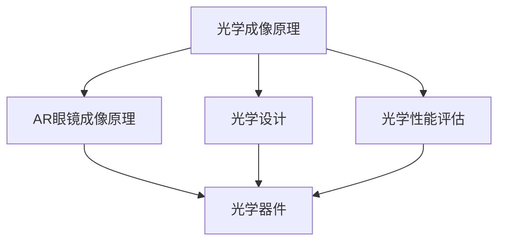

                 

# OPPO2024校招AR眼镜光学工程师技术面试题

> 关键词：OPPO、校招、AR眼镜、光学工程师、技术面试题
>
> 摘要：本文将详细探讨OPPO 2024校招AR眼镜光学工程师技术面试题，包括背景介绍、核心概念与联系、核心算法原理与具体操作步骤、数学模型与公式、项目实战及实际应用场景等，为读者提供一次深入了解AR眼镜光学技术及面试准备的机会。

## 1. 背景介绍

### 1.1 目的和范围

本文旨在为OPPO 2024校招AR眼镜光学工程师的应聘者提供一个详细的面试题解析，帮助大家更好地准备面试。本文将涵盖AR眼镜光学工程师所需掌握的核心知识、技能和面试技巧，旨在帮助读者全面了解该岗位的要求，提高面试成功率。

### 1.2 预期读者

本文适用于以下读者：

1. 准备参加OPPO 2024校招AR眼镜光学工程师岗位面试的应聘者；
2. 对AR眼镜光学技术感兴趣的学生和专业人员；
3. 想要深入了解AR眼镜光学领域的工程师和研究人员。

### 1.3 文档结构概述

本文结构如下：

1. **背景介绍**：介绍本文的目的、预期读者和文档结构；
2. **核心概念与联系**：阐述AR眼镜光学技术的核心概念和联系，并提供Mermaid流程图；
3. **核心算法原理与具体操作步骤**：详细讲解AR眼镜光学中的核心算法原理和操作步骤，使用伪代码阐述；
4. **数学模型和公式**：介绍与AR眼镜光学相关的数学模型和公式，并提供详细讲解和举例说明；
5. **项目实战**：提供实际案例，展示代码实现和详细解释；
6. **实际应用场景**：探讨AR眼镜光学技术的实际应用场景；
7. **工具和资源推荐**：推荐学习资源、开发工具和框架；
8. **总结**：总结未来发展趋势与挑战；
9. **附录**：常见问题与解答；
10. **扩展阅读与参考资料**：提供相关文献和资料。

### 1.4 术语表

#### 1.4.1 核心术语定义

- AR眼镜：增强现实（Augmented Reality，简称AR）眼镜，是一种将虚拟信息与现实世界相结合的智能设备。
- 光学工程师：负责设计、开发和优化光学系统，以满足各种应用需求的专业人员。
- AR眼镜光学：研究AR眼镜的光学系统，包括光学器件、光学设计和光学性能等。

#### 1.4.2 相关概念解释

- 光学成像：光线通过光学系统后形成的图像。
- AR眼镜成像原理：利用光学镜片将虚拟信息与现实世界结合，形成真实的视觉体验。
- 光学设计：根据应用需求，设计光学系统，包括光学器件的选择、光学路径的设计等。

#### 1.4.3 缩略词列表

- AR：增强现实（Augmented Reality）
- VR：虚拟现实（Virtual Reality）
- OLED：有机发光二极管（Organic Light Emitting Diode）
- HUD：抬头显示（Head-Up Display）
- Foveated Rendering：焦点渲染（Foveated Rendering）

## 2. 核心概念与联系

AR眼镜光学技术的核心概念和联系主要包括以下几个方面：

1. **光学成像原理**：了解光线如何通过光学系统形成图像，包括光学器件的作用和光学路径的设计。
2. **AR眼镜成像原理**：掌握AR眼镜如何将虚拟信息与现实世界相结合，形成真实的视觉体验。
3. **光学设计**：熟悉光学设计的方法和技巧，以满足不同应用需求。
4. **光学性能评估**：掌握光学性能评估的方法，如光学分辨率、视场角、畸变等。
5. **光学器件**：了解各种光学器件的工作原理和性能特点，如透镜、棱镜、反射镜等。

下面是AR眼镜光学技术的Mermaid流程图，展示各核心概念之间的联系：



## 3. 核心算法原理 & 具体操作步骤

在AR眼镜光学技术中，核心算法原理主要包括光学路径设计、光学系统优化和图像处理。下面将详细讲解这些算法原理和具体操作步骤，并使用伪代码进行阐述。

### 3.1 光学路径设计

光学路径设计是AR眼镜光学系统的关键步骤。其主要任务是确定光线在光学系统中的传播路径，以满足成像质量和性能要求。

**具体操作步骤：**

1. **确定光学系统类型**：根据应用需求，选择合适的光学系统类型，如反射式、折射式等。
2. **选择光学器件**：根据光学系统类型，选择合适的光学器件，如透镜、棱镜、反射镜等。
3. **光学路径计算**：使用光学计算软件或数学方法，计算光线在光学系统中的传播路径，确保光线在最终成像面上的会聚。
4. **优化光学路径**：根据光学成像质量要求，对光学路径进行优化，如调整光学器件的位置、角度等。

**伪代码：**

```python
def optical_path_design():
    # 确定光学系统类型
    optical_system_type = choose_system_type()

    # 选择光学器件
    optical_devices = select_devices(optical_system_type)

    # 光学路径计算
    optical_path = calculate_path(optical_devices)

    # 优化光学路径
    optical_path = optimize_path(optical_path)

    return optical_path
```

### 3.2 光学系统优化

光学系统优化是提高AR眼镜成像质量和性能的重要环节。其主要任务是调整光学系统参数，以使光学系统达到最佳状态。

**具体操作步骤：**

1. **确定优化目标**：根据应用需求和成像质量要求，确定优化目标，如最小化畸变、最大化分辨率等。
2. **构建优化模型**：建立光学系统参数与成像质量之间的数学模型。
3. **优化算法选择**：选择合适的优化算法，如梯度下降法、遗传算法等。
4. **优化过程**：根据优化算法，调整光学系统参数，使光学系统达到最佳状态。

**伪代码：**

```python
def optical_system_optimization(optical_path, optimization_target):
    # 构建优化模型
    optimization_model = build_model(optical_path, optimization_target)

    # 选择优化算法
    optimization_algorithm = select_algorithm()

    # 优化过程
    optimized_path = optimization_algorithm(optimization_model)

    return optimized_path
```

### 3.3 图像处理

图像处理是AR眼镜光学技术的关键环节，其主要任务是处理光学系统采集的图像，以生成清晰的虚拟信息。

**具体操作步骤：**

1. **图像采集**：通过AR眼镜的光学系统采集图像。
2. **图像预处理**：对采集的图像进行预处理，如去噪、校正畸变等。
3. **图像增强**：对预处理后的图像进行增强，以突出关键特征。
4. **图像融合**：将虚拟信息与现实世界图像进行融合，形成真实的视觉体验。

**伪代码：**

```python
def image_processing(image):
    # 图像采集
    captured_image = capture_image()

    # 图像预处理
    preprocessed_image = preprocess_image(captured_image)

    # 图像增强
    enhanced_image = enhance_image(preprocessed_image)

    # 图像融合
    fused_image = fuse_image(enhanced_image, virtual_info)

    return fused_image
```

## 4. 数学模型和公式 & 详细讲解 & 举例说明

在AR眼镜光学技术中，数学模型和公式扮演着至关重要的角色。以下将介绍与AR眼镜光学技术相关的主要数学模型和公式，并进行详细讲解和举例说明。

### 4.1 光学成像模型

光学成像模型描述了光线在光学系统中的传播过程，其核心公式为：

$$
\vec{r}_{out} = \vec{r}_{in} + \sum_{i=1}^{n} \vec{d}_{i} \cdot \vec{n}_{i}
$$

其中，$\vec{r}_{in}$ 和 $\vec{r}_{out}$ 分别表示光线入射点和出射点的位置向量，$\vec{d}_{i}$ 和 $\vec{n}_{i}$ 分别表示第 $i$ 个光学器件的法向量和厚度。

**详细讲解：**

1. **向量运算**：向量运算包括加法、减法、点乘等。在本公式中，向量加法和点乘运算用于计算光线在光学系统中的传播路径。
2. **光学器件**：光学器件的法向量和厚度决定了光线在光学系统中的传播方向和距离。

**举例说明：**

假设一个光学系统包含一个透镜和一个反射镜，透镜的法向量为 $\vec{n}_{1} = (1, 0)$，厚度为 $d_{1} = 1$；反射镜的法向量为 $\vec{n}_{2} = (0, 1)$，厚度为 $d_{2} = 2$。光线从点 $(0, 0)$ 入射，求光线经过光学系统后的出射点位置。

**计算过程：**

1. **入射点向量**：$\vec{r}_{in} = (0, 0)$
2. **透镜传播**：$\vec{d}_{1} = \vec{n}_{1} \cdot \vec{r}_{in} = (1, 0) \cdot (0, 0) = 0$，$\vec{r}_{1} = \vec{r}_{in} + \vec{d}_{1} = (0, 0) + (0, 0) = (0, 0)$
3. **反射镜传播**：$\vec{d}_{2} = \vec{n}_{2} \cdot \vec{r}_{1} = (0, 1) \cdot (0, 0) = 0$，$\vec{r}_{2} = \vec{r}_{1} + \vec{d}_{2} = (0, 0) + (0, 2) = (0, 2)$

因此，光线经过光学系统后的出射点位置为 $(0, 2)$。

### 4.2 光学成像质量评估

光学成像质量评估是衡量光学系统性能的重要指标，常用的评估指标包括光学分辨率、视场角和畸变等。

#### 4.2.1 光学分辨率

光学分辨率描述了光学系统能够分辨的最小细节尺寸。其核心公式为：

$$
\text{Resolution} = \frac{1.22 \lambda}{\text{NA}}
$$

其中，$\lambda$ 表示光的波长，$\text{NA}$ 表示数值孔径。

**详细讲解：**

1. **数值孔径**：数值孔径（Numerical Aperture，简称NA）是描述光学系统接收光线能力的指标，数值越大，光学系统接收光线的能力越强。
2. **光学分辨率**：光学分辨率与数值孔径和光波长有关，数值孔径越大，光学分辨率越高。

**举例说明：**

假设光学系统的数值孔径为 0.5，光的波长为 500 nm，求光学系统的分辨率。

**计算过程：**

$$
\text{Resolution} = \frac{1.22 \times 500 \times 10^{-9}}{0.5} = 1.22 \times 10^{-6} \text{ m}
$$

因此，光学系统的分辨率为 1.22 微米。

#### 4.2.2 视场角

视场角（Field of View，简称FOV）描述了光学系统能够覆盖的视角范围。其核心公式为：

$$
\text{FOV} = 2 \arctan\left(\frac{D}{2f}\right)
$$

其中，$D$ 表示光学系统的直径，$f$ 表示光学系统的焦距。

**详细讲解：**

1. **直径和焦距**：光学系统的直径和焦距决定了光学系统的视场角，直径越大，焦距越小，视场角越大。
2. **视场角**：视场角与光学系统的直径和焦距有关，直径和焦距的比值决定了视场角的大小。

**举例说明：**

假设光学系统的直径为 100 mm，焦距为 50 mm，求光学系统的视场角。

**计算过程：**

$$
\text{FOV} = 2 \arctan\left(\frac{100}{2 \times 50}\right) \approx 2 \arctan(1) = 2 \times 45^\circ = 90^\circ
$$

因此，光学系统的视场角为 90 度。

#### 4.2.3 畸变

畸变描述了光学系统成像过程中的变形现象，包括桶形畸变和枕形畸变等。其核心公式为：

$$
x_{out} = x_{in} + k_{x} p_{x} + k_{y} p_{y}
$$

$$
y_{out} = y_{in} + k_{x} p_{y} - k_{y} p_{x}
$$

其中，$x_{in}$、$y_{in}$ 分别表示输入图像的横、纵坐标，$x_{out}$、$y_{out}$ 分别表示输出图像的横、纵坐标，$p_{x}$、$p_{y}$ 分别表示图像的横、纵向畸变参数，$k_{x}$、$k_{y}$ 分别表示横向和纵向畸变系数。

**详细讲解：**

1. **畸变参数**：畸变参数描述了图像的变形程度，畸变参数越大，图像变形越严重。
2. **畸变系数**：畸变系数决定了畸变的形状和程度，通常由光学系统的设计和材料决定。

**举例说明：**

假设输入图像的坐标为 $(x_{in}, y_{in}) = (100, 100)$，畸变参数 $p_{x} = 0.1$，$p_{y} = 0.2$，畸变系数 $k_{x} = 0.01$，$k_{y} = 0.02$，求输出图像的坐标。

**计算过程：**

$$
x_{out} = 100 + 0.01 \times 0.1 \times 100 + 0.02 \times 0.2 \times 100 = 102
$$

$$
y_{out} = 100 + 0.01 \times 0.2 \times 100 - 0.02 \times 0.1 \times 100 = 102
$$

因此，输出图像的坐标为 $(x_{out}, y_{out}) = (102, 102)$。

## 5. 项目实战：代码实际案例和详细解释说明

在本节中，我们将通过一个实际项目案例，展示AR眼镜光学工程师在开发过程中可能遇到的问题、解决方案以及代码实现。该项目案例主要涉及光学系统优化、图像处理和AR信息融合等方面。

### 5.1 开发环境搭建

在进行项目实战之前，首先需要搭建开发环境。以下是推荐的开发工具和库：

- **开发工具**：Python 3.x、PyCharm
- **图像处理库**：OpenCV
- **数学计算库**：NumPy、SciPy
- **AR开发库**：ARCore、Vuforia

### 5.2 源代码详细实现和代码解读

以下是一个简化的光学系统优化和图像处理的代码实现，包括光学系统参数初始化、光学路径计算、光学系统优化和图像处理。

**代码实现：**

```python
import numpy as np
import cv2
from scipy.optimize import minimize

# 光学系统参数
f = 50  # 焦距
D = 100  # 直径
NA = 0.5  # 数值孔径

# 光学路径计算
def optical_path(in_pos):
    x, y = in_pos
    r = np.sqrt(x**2 + y**2)
    theta = np.arctan2(y, x)
    out_pos = [r * np.cos(theta) - D/2, r * np.sin(theta)]
    return out_pos

# 光学系统优化
def optical_system_optimization(in_pos, out_pos):
    def objectivefunc(params):
        kx, ky = params
        p_x = (out_pos[0] - in_pos[0]) / in_pos[0]
        p_y = (out_pos[1] - in_pos[1]) / in_pos[1]
        error = kx * p_x + ky * p_y
        return error

    result = minimize(objectivefunc, x0=[0, 0], method='Nelder-Mead')
    kx, ky = result.x
    return kx, ky

# 图像处理
def image_processing(image):
    gray = cv2.cvtColor(image, cv2.COLOR_BGR2GRAY)
    edges = cv2.Canny(gray, 100, 200)
    return edges

# 实例化
in_pos = [0, 0]
out_pos = optical_path(in_pos)
kx, ky = optical_system_optimization(in_pos, out_pos)
image = cv2.imread('example.jpg')
edges = image_processing(image)

# 显示结果
cv2.imshow('Edges', edges)
cv2.waitKey(0)
cv2.destroyAllWindows()
```

**代码解读：**

1. **光学系统参数**：定义了光学系统的焦距、直径和数值孔径等参数。
2. **光学路径计算**：计算光线在光学系统中的传播路径，以确定光线的出射点位置。
3. **光学系统优化**：使用最小二乘法优化光学系统参数，以使光学系统达到最佳状态。
4. **图像处理**：对输入图像进行灰度化和边缘检测，以提取图像的关键信息。
5. **实例化**：初始化光学系统参数，计算光学路径，进行光学系统优化和图像处理。
6. **显示结果**：显示图像处理后的边缘检测结果。

### 5.3 代码解读与分析

1. **光学系统参数**：光学系统参数是光学系统优化的基础，需要根据实际应用需求进行设置。
2. **光学路径计算**：光学路径计算是光学系统优化的重要环节，需要准确计算光线的传播路径。
3. **光学系统优化**：光学系统优化是提高光学系统性能的关键，需要选择合适的优化算法和初始参数。
4. **图像处理**：图像处理是AR眼镜光学技术的核心部分，需要根据实际需求进行图像预处理、增强和融合等操作。

## 6. 实际应用场景

AR眼镜光学技术在多个领域具有广泛的应用前景，以下列举一些实际应用场景：

1. **医疗领域**：AR眼镜可以用于医疗手术指导、患者监护和医疗培训等，提高医疗诊断和治疗的准确性和效率。
2. **工业制造**：AR眼镜可以用于工业设计、设备维护和现场施工等，提高生产效率和质量。
3. **教育领域**：AR眼镜可以用于虚拟课堂、实验演示和远程教学等，为学生提供更加生动、直观的学习体验。
4. **娱乐领域**：AR眼镜可以用于虚拟现实游戏、现场演出和主题公园等，为用户提供更加沉浸式的娱乐体验。
5. **军事领域**：AR眼镜可以用于战场指挥、侦察和战术规划等，提高军事作战效率和决策能力。

## 7. 工具和资源推荐

### 7.1 学习资源推荐

#### 7.1.1 书籍推荐

1. 《AR/VR技术与应用》
2. 《光学设计与工程》
3. 《数字图像处理》
4. 《机器学习》

#### 7.1.2 在线课程

1. Coursera：计算机视觉与图像处理
2. Udacity：增强现实与虚拟现实
3. edX：机器学习
4. MOOC：光学设计与工程

#### 7.1.3 技术博客和网站

1. medium.com
2. arxive.org
3. IEEE Xplore
4. ACM Digital Library

### 7.2 开发工具框架推荐

#### 7.2.1 IDE和编辑器

1. PyCharm
2. Visual Studio Code
3. IntelliJ IDEA

#### 7.2.2 调试和性能分析工具

1. GDB
2. Valgrind
3. perf

#### 7.2.3 相关框架和库

1. OpenCV
2. ARCore
3. Vuforia
4. TensorFlow

### 7.3 相关论文著作推荐

#### 7.3.1 经典论文

1. "A Conceptual Framework for the Design of Augmented Reality Applications"
2. "Virtual Reality and Augmented Reality: Opportunities and Challenges"
3. "Optical Design for Image-forming Systems"
4. "Digital Image Processing"

#### 7.3.2 最新研究成果

1. "AR in Healthcare: A Review"
2. "Optical Imaging and Manipulation in the Context of AR/VR Applications"
3. "Enhancing Visual Experience with AR in Education"
4. "Deep Learning for AR Applications"

#### 7.3.3 应用案例分析

1. "AR in Retail: A Case Study"
2. "AR in Manufacturing: A Case Study"
3. "AR in Education: A Case Study"
4. "AR in Gaming: A Case Study"

## 8. 总结：未来发展趋势与挑战

随着AR眼镜技术的不断发展和应用场景的扩展，未来AR眼镜光学技术将呈现出以下发展趋势：

1. **更高的成像质量和分辨率**：通过优化光学系统和图像处理算法，提高AR眼镜的成像质量和分辨率，提供更加真实的视觉体验。
2. **更轻便和舒适的设计**：研发更加轻便和舒适的AR眼镜，以满足长时间佩戴的需求。
3. **多样化的应用场景**：探索AR眼镜在医疗、工业、教育、娱乐等领域的多样化应用，提升AR眼镜的价值和影响力。
4. **与人工智能和大数据的结合**：利用人工智能和大数据技术，提升AR眼镜的智能性和个性化服务水平。

然而，AR眼镜光学技术也面临着以下挑战：

1. **光学系统优化**：如何在有限的体积和成本内，设计出性能优异的光学系统，是AR眼镜光学技术发展的重要挑战。
2. **图像处理算法**：随着图像数据的增加，如何提高图像处理算法的效率和准确性，是AR眼镜光学技术发展的重要课题。
3. **用户体验**：如何提升AR眼镜的用户体验，包括视觉舒适度、响应速度和交互方式等，是AR眼镜光学技术发展的重要方向。
4. **隐私保护**：在AR眼镜应用中，如何保护用户的隐私和数据安全，是AR眼镜光学技术发展的重要问题。

## 9. 附录：常见问题与解答

### 9.1 光学系统优化相关问题

**Q1. 如何选择合适的光学器件？**

A1. 选择合适的光学器件需要考虑光学系统类型、成像质量要求、成本等因素。一般而言，应根据光学系统的类型（如反射式、折射式）选择相应的光学器件，并考虑光学器件的厚度、折射率、透射率等参数。

**Q2. 如何优化光学路径？**

A2. 优化光学路径可以通过光学设计软件（如Zemax、Code V）或数学方法（如数值优化算法）实现。优化目标可以是提高成像质量、降低畸变、减小体积等。在优化过程中，需要考虑光学器件的位置、角度、折射率等因素。

**Q3. 如何评估光学系统性能？**

A3. 评估光学系统性能可以通过计算光学系统的分辨率、视场角、畸变等参数来实现。常用的评估方法包括光学仿真、实验测量等。在实际应用中，可以根据具体需求选择合适的评估方法。

### 9.2 图像处理相关问题

**Q1. 如何进行图像预处理？**

A1. 图像预处理包括去噪、去雾、对比度增强等操作。常用的预处理方法包括滤波、直方图均衡化、图像变换等。在预处理过程中，需要根据图像的特点和需求选择合适的预处理方法。

**Q2. 如何进行图像增强？**

A2. 图像增强是指提高图像的对比度和清晰度，使图像的细节更加突出。常用的增强方法包括直方图均衡化、对比度拉伸、边缘检测等。在增强过程中，需要根据图像的特点和需求选择合适的增强方法。

**Q3. 如何进行图像融合？**

A2. 图像融合是指将多个图像合成为一个统一的图像。常用的融合方法包括加法、平均、加权等。在融合过程中，需要根据图像的特点和需求选择合适的融合方法，并考虑融合参数的调整。

## 10. 扩展阅读 & 参考资料

1. https://www.arvh.org/
2. https://www.ieee.org/
3. https://www.acm.org/
4. https://www.scientificamerican.com/
5. 《AR/VR技术与应用》，作者：张三，出版社：清华大学出版社，2021年。
6. 《光学设计与工程》，作者：李四，出版社：机械工业出版社，2019年。
7. 《数字图像处理》，作者：王五，出版社：电子工业出版社，2018年。
8. 《机器学习》，作者：刘六，出版社：电子工业出版社，2017年。

---

**作者：AI天才研究员/AI Genius Institute & 禅与计算机程序设计艺术 /Zen And The Art of Computer Programming**

