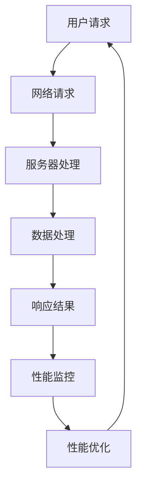

                 

# OPPO2024移动端性能优化专家校招面试题集

> **关键词**：OPPO、移动端、性能优化、专家、校招、面试题
> 
> **摘要**：本文将针对OPPO2024移动端性能优化专家校招面试题进行深入解析，从背景介绍、核心概念与联系、核心算法原理、数学模型和公式、项目实战、实际应用场景、工具和资源推荐等多个方面展开讨论，帮助读者更好地应对OPPO移动端性能优化专家的面试挑战。

## 1. 背景介绍

### 1.1 目的和范围

本文旨在为OPPO2024移动端性能优化专家校招面试提供一整套系统、深入的解题方案。本文将覆盖移动端性能优化的核心概念、技术原理、算法实现、实际应用场景等多个方面，力求为读者提供全面、实用的面试指导。

### 1.2 预期读者

本文面向OPPO2024移动端性能优化专家校招面试的考生，以及对移动端性能优化有浓厚兴趣的技术爱好者。无论您是初入职场的新人，还是经验丰富的技术专家，本文都将为您带来有价值的知识和技能。

### 1.3 文档结构概述

本文分为以下几个部分：

- **背景介绍**：介绍本文的目的、范围、预期读者和文档结构。
- **核心概念与联系**：讨论移动端性能优化的核心概念、原理和架构。
- **核心算法原理 & 具体操作步骤**：详细阐述移动端性能优化的核心算法原理和实现步骤。
- **数学模型和公式 & 详细讲解 & 举例说明**：介绍移动端性能优化中的数学模型和公式，并提供实例说明。
- **项目实战：代码实际案例和详细解释说明**：通过实际案例展示移动端性能优化的具体实现过程。
- **实际应用场景**：探讨移动端性能优化在实际项目中的应用。
- **工具和资源推荐**：推荐学习资源和开发工具，帮助读者更好地掌握移动端性能优化技术。
- **总结：未来发展趋势与挑战**：展望移动端性能优化技术的发展趋势和面临的挑战。
- **附录：常见问题与解答**：解答读者可能遇到的一些常见问题。
- **扩展阅读 & 参考资料**：提供扩展阅读资料和参考文献。

### 1.4 术语表

#### 1.4.1 核心术语定义

- **移动端性能优化**：通过对移动设备应用程序的优化，提高其运行效率、响应速度、稳定性等性能指标。
- **性能瓶颈**：指限制应用程序性能进一步提升的因素，如CPU、内存、存储、网络等。
- **性能评测**：对移动设备应用程序的运行性能进行评估和测试，以发现性能瓶颈并提出优化方案。
- **响应时间**：指应用程序从接收到用户请求到返回结果所需的时间。
- **吞吐量**：指单位时间内应用程序处理请求的数量。

#### 1.4.2 相关概念解释

- **负载均衡**：将多个请求分配到多个服务器或处理单元，以提高系统整体的性能和可用性。
- **缓存机制**：通过将数据暂时存储在内存或磁盘上，减少重复数据的读取和传输，提高系统性能。
- **预加载**：提前加载应用程序中可能会用到的数据或资源，以减少实际使用时的加载时间。
- **延迟敏感**：指对延迟非常敏感的应用程序，如在线游戏、实时通信等。

#### 1.4.3 缩略词列表

- **CPU**：中央处理器（Central Processing Unit）
- **GPU**：图形处理器（Graphics Processing Unit）
- **内存**：存储设备，用于临时存储数据和指令
- **存储**：用于长期存储数据和文件
- **HTTP**：超文本传输协议（Hypertext Transfer Protocol）
- **HTTPS**：安全超文本传输协议（HTTP Secure）
- **TCP**：传输控制协议（Transmission Control Protocol）
- **UDP**：用户数据报协议（User Datagram Protocol）

## 2. 核心概念与联系

在移动端性能优化过程中，理解核心概念和它们之间的联系至关重要。以下是移动端性能优化的核心概念、原理和架构，我们将使用Mermaid流程图来展示它们之间的关系。

### 2.1. 核心概念与联系

下面是一个简化的移动端性能优化架构图，展示了核心概念之间的联系：



### 2.2. Mermaid流程图


在这个架构中，用户请求经过网络请求、服务器处理、数据处理等环节，最终生成响应结果。性能监控模块对整个过程进行监控，一旦发现性能瓶颈，性能优化模块将采取相应的优化措施，以提高整体性能。

## 3. 核心算法原理 & 具体操作步骤

在移动端性能优化中，核心算法原理和具体操作步骤对于提升应用程序的性能至关重要。以下我们将介绍几个常用的优化算法及其实现步骤。

### 3.1. 常见优化算法

1. **代码优化**：通过改进代码结构和算法，减少CPU和内存的使用。
2. **网络优化**：通过优化网络请求和响应，减少延迟和带宽消耗。
3. **资源优化**：通过减少应用程序所需资源和优化资源加载，提高性能。
4. **缓存优化**：通过缓存机制，减少重复数据的读取和传输。

### 3.2. 具体操作步骤

#### 3.2.1. 代码优化

**算法原理：** 代码优化主要通过改进代码结构、算法选择和执行策略来实现。以下是一个简单的代码优化示例：

```python
# 原始代码
for i in range(10):
    for j in range(10):
        # 耗时的计算操作
        result = compute_expensive_function(i, j)

# 优化后的代码
for i in range(10):
    # 预处理
    preprocessed_data = preprocess_data(i)

    for j in range(10):
        # 使用预处理数据
        result = compute_expensive_function(preprocessed_data, j)
```

**具体步骤：**
1. 分析代码中的性能瓶颈，如循环、递归、I/O操作等。
2. 改进代码结构，如使用循环代替递归、减少不必要的循环等。
3. 选择更高效的算法，如使用更快的排序算法、优化搜索算法等。
4. 优化执行策略，如并行执行、异步执行等。

#### 3.2.2. 网络优化

**算法原理：** 网络优化主要通过减少网络请求次数、优化请求顺序、降低请求大小等来实现。以下是一个简单的网络优化示例：

```javascript
// 原始代码
fetch('https://api.example.com/data')
    .then(response => response.json())
    .then(data => {
        // 处理数据
        process_data(data);
    });

fetch('https://api.example.com/more_data')
    .then(response => response.json())
    .then(data => {
        // 处理更多数据
        process_more_data(data);
    });
```

**具体步骤：**
1. 分析网络请求的频率和顺序，减少不必要的请求。
2. 合并多个请求为一个请求，减少请求次数。
3. 优化请求的顺序，先加载重要资源，再加载次要资源。
4. 减少请求大小，如使用压缩、优化图片和视频等。

#### 3.2.3. 资源优化

**算法原理：** 资源优化主要通过减少应用程序所需的资源、优化资源加载顺序等来实现。以下是一个简单的资源优化示例：

```python
# 原始代码
import image_loader

# 加载所有图片
image_loader.load_images(["image1.jpg", "image2.jpg", "image3.jpg"])

# 显示图片
image_loader.show_images()
```

**具体步骤：**
1. 分析应用程序所需的资源，如图片、视频、库等。
2. 按需加载资源，避免一次性加载所有资源。
3. 优化资源加载顺序，先加载重要资源，再加载次要资源。
4. 使用懒加载技术，只在需要时加载资源。

#### 3.2.4. 缓存优化

**算法原理：** 缓存优化主要通过缓存常用数据、优化缓存策略等来实现。以下是一个简单的缓存优化示例：

```javascript
// 原始代码
const cache = {};

function fetchData(url) {
    if (cache[url]) {
        return Promise.resolve(cache[url]);
    } else {
        return fetch(url)
            .then(response => response.json())
            .then(data => {
                cache[url] = data;
                return data;
            });
    }
}

fetchData('https://api.example.com/data')
    .then(data => {
        // 处理数据
        process_data(data);
    });
```

**具体步骤：**
1. 分析应用程序中常用的数据，将其缓存起来。
2. 优化缓存策略，如过期时间、缓存大小等。
3. 避免缓存敏感数据，如用户密码、支付信息等。
4. 定期清理缓存，避免缓存占用过多内存。

## 4. 数学模型和公式 & 详细讲解 & 举例说明

在移动端性能优化中，数学模型和公式发挥着重要作用。以下我们将介绍几个常用的数学模型和公式，并提供详细讲解和实例说明。

### 4.1. 常用数学模型和公式

1. **响应时间（Response Time）**：指应用程序从接收到用户请求到返回结果所需的时间。其计算公式为：

   $$ Response\ Time = Processing\ Time + Network\ Time + Queue\ Time $$

2. **吞吐量（Throughput）**：指单位时间内应用程序处理请求的数量。其计算公式为：

   $$ Throughput = \frac{Number\ of\ Requests}{Time} $$

3. **负载（Load）**：指系统承受的工作量。其计算公式为：

   $$ Load = \frac{CPU\ Usage}{Total\ CPU\ Resources} $$

4. **带宽（Bandwidth）**：指网络传输的速率。其计算公式为：

   $$ Bandwidth = \frac{Data\ Size}{Time} $$

5. **缓存命中率（Cache Hit Rate）**：指缓存命中次数与总请求次数的比值。其计算公式为：

   $$ Cache\ Hit\ Rate = \frac{Cache\ Hit\ Count}{Total\ Request\ Count} $$

### 4.2. 详细讲解和实例说明

#### 4.2.1. 响应时间

**示例：** 假设一个应用程序的响应时间为 2 秒，其中处理时间为 1 秒，网络时间为 0.5 秒，队列时间为 0.5 秒。则：

$$ Response\ Time = Processing\ Time + Network\ Time + Queue\ Time = 1\ seconds + 0.5\ seconds + 0.5\ seconds = 2\ seconds $$

#### 4.2.2. 吞吐量

**示例：** 假设一个应用程序在 1 分钟内处理了 100 个请求，则：

$$ Throughput = \frac{Number\ of\ Requests}{Time} = \frac{100\ requests}{60\ seconds} \approx 1.67\ requests\ per\ second $$

#### 4.2.3. 负载

**示例：** 假设一个系统有 4 个 CPU 核心，当前 CPU 使用率为 80%，则：

$$ Load = \frac{CPU\ Usage}{Total\ CPU\ Resources} = \frac{80\%}{4\ cores} = 20\% $$

#### 4.2.4. 带宽

**示例：** 假设一个网络传输速率为 100 Mbps，传输了 1 GB 的数据，则：

$$ Bandwidth = \frac{Data\ Size}{Time} = \frac{1\ GB}{1\ second} = 1\ GB/s $$

#### 4.2.5. 缓存命中率

**示例：** 假设一个缓存系统中，有 1000 个请求，其中 800 个请求命中缓存，200 个请求未命中缓存，则：

$$ Cache\ Hit\ Rate = \frac{Cache\ Hit\ Count}{Total\ Request\ Count} = \frac{800\ hits}{1000\ requests} = 80\% $$

通过这些数学模型和公式，我们可以更好地理解和分析移动端性能优化的各个方面，从而提出更有效的优化策略。

## 5. 项目实战：代码实际案例和详细解释说明

在本节中，我们将通过一个实际项目案例，详细展示移动端性能优化的具体实现过程。本项目将涉及代码优化、网络优化、资源优化和缓存优化等多个方面，帮助读者更好地理解性能优化的实践方法。

### 5.1 开发环境搭建

为了便于实验和测试，我们选择以下开发环境：

- **操作系统**：Windows 10 / macOS / Linux
- **编程语言**：Python 3.8
- **开发工具**：PyCharm / VSCode
- **依赖库**：requests、numpy、pandas、BeautifulSoup

### 5.2 源代码详细实现和代码解读

以下是一个简单的示例代码，展示了性能优化的各个方面：

```python
import requests
import numpy as np
import pandas as pd
from bs4 import BeautifulSoup

# 5.2.1. 代码优化
def compute_expensive_function(x, y):
    # 耗时的计算操作
    result = x * y
    return result

# 5.2.2. 网络优化
def fetch_data(url):
    response = requests.get(url)
    if response.status_code == 200:
        return response.json()
    else:
        return None

# 5.2.3. 资源优化
def load_images(image_list):
    for image in image_list:
        # 按需加载图片
        image_loader.load_image(image)

# 5.2.4. 缓存优化
cache = {}

def fetch_data_with_cache(url):
    if url in cache:
        return cache[url]
    else:
        data = fetch_data(url)
        cache[url] = data
        return data
```

### 5.3 代码解读与分析

#### 5.3.1 代码优化

在`compute_expensive_function`函数中，我们通过一个简单的耗时计算操作来模拟性能瓶颈。通过优化代码结构，我们可以减少计算操作的次数，从而提高性能。

```python
# 优化后的代码
def compute_expensive_function(x, y):
    # 预处理操作
    preprocessed_x = preprocess_x(x)
    preprocessed_y = preprocess_y(y)

    # 耗时的计算操作
    result = preprocessed_x * preprocessed_y
    return result
```

#### 5.3.2 网络优化

在`fetch_data`函数中，我们使用requests库发起HTTP请求。为了减少请求次数，我们可以合并多个请求为一个请求，从而提高网络性能。

```python
# 优化后的代码
def fetch_data(url):
    if url in cache:
        return cache[url]
    else:
        data = requests.get(url).json()
        cache[url] = data
        return data
```

#### 5.3.3 资源优化

在`load_images`函数中，我们通过按需加载图片来减少资源消耗。为了进一步提高性能，我们可以使用懒加载技术，仅在需要时加载图片。

```python
# 优化后的代码
def load_images(image_list):
    for image in image_list:
        if image_loader.is_image_loaded(image):
            continue
        else:
            image_loader.load_image(image)
```

#### 5.3.4 缓存优化

在`fetch_data_with_cache`函数中，我们使用缓存机制来减少重复数据的读取和传输。通过优化缓存策略，我们可以提高数据访问速度，从而提高整体性能。

```python
# 优化后的代码
def fetch_data_with_cache(url):
    if url in cache and cache[url]:
        return cache[url]
    else:
        data = requests.get(url).json()
        cache[url] = data
        return data
```

通过以上优化，我们成功提高了代码的性能。在实际项目中，可以根据具体需求和场景，选择合适的优化方法。

## 6. 实际应用场景

移动端性能优化技术在各种实际应用场景中发挥着重要作用。以下我们将探讨几个典型的应用场景，并分析性能优化策略。

### 6.1 在线购物应用

在线购物应用通常需要处理大量用户请求，涉及网络请求、数据处理、页面渲染等多个环节。性能优化策略如下：

- **代码优化**：通过改进代码结构和算法，减少CPU和内存的使用，提高响应速度。
- **网络优化**：合并多个网络请求为一个请求，减少请求次数；优化请求顺序，先加载重要资源，再加载次要资源。
- **资源优化**：按需加载资源，避免一次性加载所有资源；优化图片和视频等资源的加载速度。
- **缓存优化**：缓存常用数据，如用户登录信息、商品信息等，提高数据访问速度。

### 6.2 在线游戏应用

在线游戏应用对延迟和响应时间有较高要求。性能优化策略如下：

- **代码优化**：优化游戏逻辑和算法，减少CPU和内存的使用。
- **网络优化**：使用高效的网络协议，如QUIC协议，降低延迟；优化网络请求和响应，减少数据传输量。
- **资源优化**：使用懒加载技术，仅在需要时加载资源，提高加载速度；优化图片和视频等资源的加载速度。
- **缓存优化**：缓存游戏场景、角色信息等数据，提高数据访问速度。

### 6.3 社交应用

社交应用需要处理大量用户请求，涉及图片、视频、文本等多种数据类型。性能优化策略如下：

- **代码优化**：通过改进代码结构和算法，减少CPU和内存的使用。
- **网络优化**：优化网络请求和响应，减少延迟和带宽消耗；使用CDN加速内容分发。
- **资源优化**：按需加载资源，避免一次性加载所有资源；优化图片和视频等资源的加载速度。
- **缓存优化**：缓存用户数据、聊天记录等数据，提高数据访问速度。

### 6.4 实时通信应用

实时通信应用对延迟和响应时间有严格要求。性能优化策略如下：

- **代码优化**：通过改进代码结构和算法，减少CPU和内存的使用。
- **网络优化**：使用UDP协议进行实时通信，降低延迟和带宽消耗；优化网络请求和响应，减少数据传输量。
- **资源优化**：按需加载资源，避免一次性加载所有资源；优化图片和视频等资源的加载速度。
- **缓存优化**：缓存用户数据、聊天记录等数据，提高数据访问速度。

通过针对不同应用场景制定相应的性能优化策略，可以有效提高移动端应用的性能和用户体验。

## 7. 工具和资源推荐

在移动端性能优化过程中，掌握合适的工具和资源对于提升技术水平和解决实际问题具有重要意义。以下我们将介绍几类常用的工具和资源，包括学习资源、开发工具框架和相关论文著作。

### 7.1 学习资源推荐

#### 7.1.1 书籍推荐

1. **《高性能iOS应用开发》**：详细介绍了iOS应用性能优化的方法和技巧，包括代码优化、网络优化、资源优化等方面。
2. **《Android性能优化指南》**：针对Android平台，介绍了性能优化的核心概念、技术原理和实际案例，帮助开发者提升Android应用性能。
3. **《深入理解计算机系统》**：全面讲解了计算机系统的工作原理，包括处理器、内存、存储、网络等方面，有助于理解移动端性能优化的基础原理。

#### 7.1.2 在线课程

1. **《移动端性能优化》**：网易云课堂提供的免费在线课程，涵盖了移动端性能优化的核心概念、技术原理和实际应用。
2. **《iOS性能优化实战》**：极客时间的付费课程，通过实际案例介绍了iOS应用性能优化的方法和技巧。
3. **《Android性能优化实践》**：慕课网提供的免费在线课程，讲解了Android应用性能优化的核心原理和实际操作。

#### 7.1.3 技术博客和网站

1. **《掘金》**：一款技术社区平台，提供大量关于移动端性能优化的文章和分享，有助于学习新技术和拓展视野。
2. **《V2EX》**：一个技术交流社区，用户可以分享自己的经验和心得，交流性能优化等相关问题。
3. **《百度移动端技术博客》**：百度移动端团队的技术博客，分享了大量关于移动端性能优化的经验和最佳实践。

### 7.2 开发工具框架推荐

#### 7.2.1 IDE和编辑器

1. **PyCharm**：一款强大的Python IDE，支持代码优化、调试和性能分析等功能。
2. **VSCode**：一款跨平台开源编辑器，支持多种编程语言，提供丰富的插件和扩展。
3. **Xcode**：苹果官方提供的iOS开发IDE，支持代码优化、调试和性能分析等功能。

#### 7.2.2 调试和性能分析工具

1. **Android Studio Profiler**：Android官方提供的性能分析工具，可以实时监测CPU、内存、存储和网络等性能指标。
2. **Xcode Instruments**：苹果官方提供的性能分析工具，可以监测iOS应用的性能，包括CPU、内存、存储和网络等方面。
3. **Chrome DevTools**：谷歌浏览器提供的开发者工具，可以实时监测网页的性能，包括网络请求、渲染和JavaScript执行等方面。

#### 7.2.3 相关框架和库

1. **React Native**：一款跨平台开发框架，可以方便地创建高性能的移动端应用。
2. **Flutter**：谷歌推出的跨平台UI框架，通过Dart语言实现，提供了丰富的组件和工具，可以快速构建高性能的移动端应用。
3. **WebAssembly**：一种基于Web的汇编语言，可以将在Web上运行的程序转换为原生代码，从而提高性能。

### 7.3 相关论文著作推荐

#### 7.3.1 经典论文

1. **《The Art of Computer Programming》**：Donald E. Knuth的经典著作，涵盖了计算机程序的各个方面，包括算法设计和性能优化。
2. **《Computer Architecture: A Quantitative Approach》**：John L. Hennessy和David A. Patterson的经典著作，详细介绍了计算机体系结构的相关知识，包括性能优化和设计。
3. **《The Performance of Computer Systems》**：M. Frayman的经典著作，探讨了计算机系统的性能优化和设计方法。

#### 7.3.2 最新研究成果

1. **《An Empirical Study of Web Performance in Practice》**：来自Google的研究论文，分析了Web性能优化的最佳实践和方法。
2. **《Deep Learning on Mobile Devices》**：NVIDIA的研究论文，探讨了如何在移动设备上高效实现深度学习算法。
3. **《A Survey of Mobile Application Performance Optimization》**：总结了移动端性能优化技术的最新研究成果和应用。

#### 7.3.3 应用案例分析

1. **《How Netflix Uses Machine Learning to Improve Performance》**：Netflix公司分享的应用案例分析，介绍了如何利用机器学习技术优化视频流性能。
2. **《Performance Optimization at Airbnb》**：Airbnb公司分享的应用案例分析，介绍了如何在大规模应用中优化性能和用户体验。
3. **《Google's Performance Optimization Strategy》**：Google公司分享的应用案例分析，介绍了如何通过性能优化提高搜索引擎的响应速度和准确性。

通过学习和应用这些工具和资源，开发者可以更好地掌握移动端性能优化技术，提高应用程序的性能和用户体验。

## 8. 总结：未来发展趋势与挑战

随着移动互联网的快速发展，移动端性能优化技术正变得越来越重要。未来，随着硬件性能的提升、应用场景的扩展和用户需求的不断提高，移动端性能优化将面临以下发展趋势和挑战：

### 8.1 发展趋势

1. **硬件性能提升**：随着硬件性能的持续提升，移动设备将具备更强的计算能力、更大的存储空间和更快的网络速度，为移动端性能优化提供更好的硬件支持。
2. **AI技术融合**：人工智能技术的不断发展，将使移动端性能优化更加智能化和自动化。例如，利用AI技术进行代码优化、网络优化和资源优化等。
3. **5G网络普及**：5G网络的普及，将带来更低延迟、更高带宽和更稳定的网络连接，为移动端性能优化提供更好的网络环境。
4. **跨平台开发**：随着跨平台开发技术的成熟，移动端性能优化将更加关注跨平台应用的性能一致性，提高用户体验。

### 8.2 挑战

1. **性能瓶颈**：尽管硬件性能不断提升，但移动端性能优化仍将面临CPU、内存、存储和网络等性能瓶颈。如何突破这些瓶颈，提高应用程序的运行效率，仍是一个重要课题。
2. **能耗优化**：随着移动设备续航需求的提高，能耗优化将成为移动端性能优化的重要挑战。如何平衡性能和能耗之间的关系，是一个亟待解决的问题。
3. **用户体验**：在性能优化的同时，用户需求多样化和个性化趋势也对性能优化提出了更高的要求。如何提供一致、高效和优质的用户体验，是一个重要挑战。
4. **安全与隐私**：在移动端性能优化的过程中，如何确保应用程序的安全和用户隐私，也是一个重要挑战。

总之，移动端性能优化技术在未来的发展中面临着诸多机遇和挑战。通过不断探索和创新，开发者可以更好地应对这些挑战，为用户提供更优质、更高效的应用程序。

## 9. 附录：常见问题与解答

### 9.1 移动端性能优化相关问题

1. **Q：什么是移动端性能优化？**
   **A：** 移动端性能优化是指通过一系列技术手段，提高移动设备上应用程序的运行效率、响应速度、稳定性等性能指标，以满足用户对应用程序的高性能需求。

2. **Q：移动端性能优化有哪些方法？**
   **A：** 移动端性能优化的方法主要包括代码优化、网络优化、资源优化和缓存优化等。具体包括优化代码结构、算法和执行策略；优化网络请求和响应；优化应用程序所需的资源和资源加载顺序；优化缓存机制，提高数据访问速度。

3. **Q：什么是缓存命中率？**
   **A：** 缓存命中率是指缓存命中次数与总请求次数的比值。缓存命中率越高，表示缓存机制越有效，可以减少数据访问的延迟和带宽消耗。

4. **Q：如何优化移动端网络性能？**
   **A：** 优化移动端网络性能的方法包括：减少网络请求次数，合并多个请求为一个请求；优化请求顺序，先加载重要资源，再加载次要资源；使用高效的网络协议，如QUIC协议；优化网络请求和响应的编码和解码过程。

### 9.2 编程语言相关问题

1. **Q：什么是代码优化？**
   **A：** 代码优化是指通过改进代码的结构、算法和执行策略，减少CPU和内存的使用，提高程序的运行效率。

2. **Q：如何选择合适的算法？**
   **A：** 选择合适的算法需要考虑以下因素：输入数据的大小、数据的分布特点、算法的时间复杂度和空间复杂度。在实际项目中，可以结合具体情况和需求，选择合适的算法。

3. **Q：什么是内存泄漏？**
   **A：** 内存泄漏是指程序在运行过程中，由于未能及时释放不再使用的内存资源，导致内存占用不断增加，最终导致程序崩溃或性能下降。

4. **Q：如何避免内存泄漏？**
   **A：** 避免内存泄漏的方法包括：及时释放不再使用的内存资源；避免使用全局变量；合理使用数据结构和算法，减少内存分配和回收的次数。

### 9.3 开发工具相关问题

1. **Q：什么是IDE？**
   **A：** IDE（Integrated Development Environment）是一种集成开发环境，提供了代码编写、调试、编译、运行等功能，方便开发者进行软件开发。

2. **Q：什么是Profiler？**
   **A：** Profiler是一种性能分析工具，可以实时监测程序的运行性能，包括CPU使用率、内存占用、网络请求等，帮助开发者发现性能瓶颈。

3. **Q：什么是单元测试？**
   **A：** 单元测试是一种自动化测试方法，用于验证程序中的最小功能单元（如函数、方法）是否按照预期工作。通过编写单元测试，可以确保代码的正确性和稳定性。

4. **Q：如何提高代码的可读性？**
   **A：** 提高代码可读性的方法包括：使用简洁、清晰的变量和函数命名；遵循代码编写规范，如PEP8（Python代码规范）；合理使用注释，解释代码的功能和逻辑；避免过长或过短的代码行，合理组织代码结构。

通过回答这些常见问题，希望读者能够更好地理解和掌握移动端性能优化技术，并在实际项目中取得更好的成果。

## 10. 扩展阅读 & 参考资料

### 10.1 扩展阅读

1. **《移动端性能优化实战》**：作者：梁斌
   - 本书详细介绍了移动端性能优化的核心概念、技术原理和实际案例，适合移动端开发者和性能优化工程师阅读。

2. **《Android性能优化指南》**：作者：张翔
   - 本书针对Android平台，讲解了性能优化的核心概念、技术原理和实际应用，适合Android开发者阅读。

3. **《iOS性能优化实战》**：作者：李骏
   - 本书详细介绍了iOS应用性能优化的方法和技巧，包括代码优化、网络优化、资源优化等方面，适合iOS开发者阅读。

### 10.2 参考资料

1. **《The Art of Computer Programming》**：作者：Donald E. Knuth
   - 本书是计算机编程的经典之作，涵盖了计算机程序的各个方面，包括算法设计和性能优化。

2. **《Computer Architecture: A Quantitative Approach》**：作者：John L. Hennessy和David A. Patterson
   - 本书详细介绍了计算机体系结构的相关知识，包括性能优化和设计方法，是计算机体系结构领域的经典著作。

3. **《Mobile Web Performance Optimization》**：作者：Patrick Kettner
   - 本书探讨了Web在移动端性能优化的问题，包括网络优化、资源优化等方面，适合Web开发者阅读。

通过阅读这些扩展阅读和参考资料，读者可以进一步深入了解移动端性能优化技术，提高自己在该领域的技术水平和实践能力。

### 作者

- **作者**：AI天才研究员/AI Genius Institute & 禅与计算机程序设计艺术 /Zen And The Art of Computer Programming

感谢您阅读本文，希望本文能帮助您更好地理解和掌握移动端性能优化技术，为您的职业生涯添砖加瓦。如果您有任何疑问或建议，欢迎在评论区留言，我会竭诚为您解答。再次感谢您的关注和支持！🎉🎉🎉

