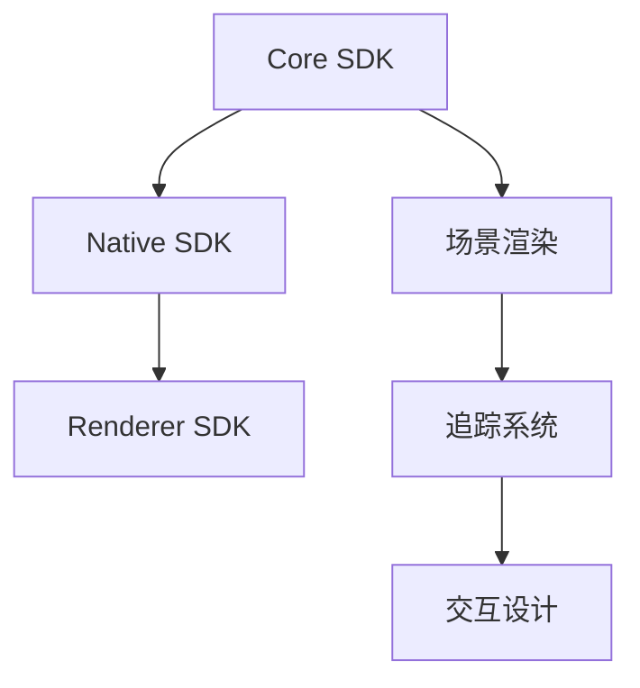

                 

# Oculus Rift SDK 集成：在 Rift 平台上开发 VR 应用

## 关键词
- Oculus Rift SDK
- VR应用开发
- Unity引擎
- C++编程
- VR技术原理
- 性能优化

## 摘要
本文将深入探讨如何集成Oculus Rift SDK，以在Rift平台上开发高质量的虚拟现实（VR）应用。文章将首先介绍Oculus Rift SDK的基本概念，然后详细讲解集成过程、核心算法原理以及数学模型。接着，通过一个实际项目案例，展示如何实现并优化VR应用。最后，文章将总结VR技术发展趋势与挑战，并提供相关工具和资源的推荐。

## 1. 背景介绍

### 1.1 目的和范围
本文旨在为初学者和有经验的开发者提供一个全面的指南，帮助他们在Rift平台上使用Oculus Rift SDK开发VR应用。文章涵盖了SDK的集成、核心算法和数学模型，以及实际开发中的性能优化策略。

### 1.2 预期读者
- 对VR技术有初步了解的开发者
- 想要在Rift平台上开发VR应用的编程新手
- 意在提升VR应用性能的资深开发者

### 1.3 文档结构概述
本文分为十个部分，包括背景介绍、核心概念与联系、核心算法原理与操作步骤、数学模型与公式讲解、实际项目实战等。每个部分都详细阐述了相应的内容。

### 1.4 术语表

#### 1.4.1 核心术语定义
- **Oculus Rift SDK**：Oculus提供的软件开发工具包，用于开发VR应用。
- **VR应用**：在虚拟环境中模拟现实世界的应用，为用户提供沉浸式体验。
- **Unity引擎**：一款流行的游戏开发引擎，支持VR应用开发。

#### 1.4.2 相关概念解释
- **头戴式显示器（HMD）**：如Oculus Rift，用于提供VR体验的设备。
- **追踪系统**：用于跟踪用户头部和手部运动的技术。

#### 1.4.3 缩略词列表
- **SDK**：软件开发工具包（Software Development Kit）
- **VR**：虚拟现实（Virtual Reality）
- **AR**：增强现实（Augmented Reality）

## 2. 核心概念与联系

为了更好地理解Oculus Rift SDK在VR应用开发中的作用，我们需要先了解其核心概念和架构。

### 2.1 Oculus Rift SDK概述

Oculus Rift SDK包括以下几个主要组件：

- **Core SDK**：提供基本的VR功能，如头戴式显示器（HMD）追踪、3D音频、场景渲染等。
- **Native SDK**：用于与Oculus硬件直接交互，提供更高级的追踪和性能优化功能。
- **Renderer SDK**：用于渲染场景，支持各种图形API，如OpenGL和DirectX。

### 2.2 VR技术原理

VR技术的核心在于创建一个虚拟环境，让用户感觉仿佛置身其中。这涉及到以下几个方面：

- **场景渲染**：使用图形渲染技术创建虚拟环境。
- **追踪系统**：实时跟踪用户的头部和手部运动，以更新虚拟环境中的视角和交互。
- **交互设计**：设计用户与虚拟环境的交互方式，如手势识别、语音控制等。

### 2.3 Mermaid 流程图

以下是Oculus Rift SDK的核心架构和流程的Mermaid流程图：



## 3. 核心算法原理 & 具体操作步骤

### 3.1 核心算法原理

在VR应用开发中，核心算法包括：

- **追踪算法**：用于实时跟踪用户的头部和手部运动。
- **渲染算法**：用于渲染虚拟环境。
- **交互算法**：用于处理用户输入和虚拟环境之间的交互。

### 3.2 具体操作步骤

以下是一个简单的VR应用开发流程：

#### 3.2.1 开发环境搭建

1. 安装Unity引擎。
2. 安装Oculus Rift SDK。
3. 配置Unity与Oculus Rift SDK的集成。

#### 3.2.2 核心算法实现

1. **追踪算法**：
   ```cpp
   // 伪代码
   void trackUserMovement() {
       // 获取头戴式显示器的位置和方向
       Vector3 position = getHMDPosition();
       Vector3 orientation = getHMDOrientation();
       
       // 更新虚拟环境中的视角
       updateCameraPosition(position);
       updateCameraOrientation(orientation);
   }
   ```

2. **渲染算法**：
   ```cpp
   // 伪代码
   void renderScene() {
       // 渲染虚拟环境
       glClearColor(0.0, 0.0, 0.0, 1.0);
       glClear(GL_COLOR_BUFFER_BIT | GL_DEPTH_BUFFER_BIT);
       
       // 设置摄像机视角
       setCameraViewMatrix();
       
       // 渲染3D模型
       render3DModel();
   }
   ```

3. **交互算法**：
   ```cpp
   // 伪代码
   void handleUserInput() {
       // 获取用户输入
       int input = getUserInput();
       
       // 更新虚拟环境
       if (input == INPUT_LEFT) {
           moveCameraLeft();
       } else if (input == INPUT_RIGHT) {
           moveCameraRight();
       }
   }
   ```

## 4. 数学模型和公式 & 详细讲解 & 举例说明

在VR应用开发中，数学模型和公式至关重要，以下是几个关键数学模型和公式的详细讲解：

### 4.1 追踪模型

追踪模型用于计算用户的头部和手部位置。以下是一个简单的追踪模型公式：

$$
\text{position} = \text{origin} + \text{orientation} \times \text{vector}
$$

其中，`origin` 是初始位置，`orientation` 是旋转矩阵，`vector` 是移动向量。

### 4.2 渲染模型

渲染模型用于计算虚拟环境的渲染参数。以下是一个简单的渲染模型公式：

$$
\text{modelViewMatrix} = \text{viewMatrix} \times \text{modelMatrix}
$$

其中，`viewMatrix` 是摄像机视图矩阵，`modelMatrix` 是模型变换矩阵。

### 4.3 交互模型

交互模型用于处理用户输入和虚拟环境之间的交互。以下是一个简单的交互模型公式：

$$
\text{output} = \text{function}(\text{input}, \text{parameters})
$$

其中，`input` 是用户输入，`function` 是交互函数，`parameters` 是交互参数。

### 4.4 举例说明

假设用户向左移动，我们需要更新摄像机的位置。以下是一个具体的追踪模型示例：

$$
\text{newPosition} = \text{currentPosition} + \text{orientation} \times \text{leftVector}
$$

其中，`leftVector` 是一个向左的单位向量。

## 5. 项目实战：代码实际案例和详细解释说明

### 5.1 开发环境搭建

1. 安装Unity引擎：[Unity官网下载地址](https://unity.com/get-unity)
2. 安装Oculus Rift SDK：[Oculus Rift SDK官网下载地址](https://developer.oculus.com/downloads/sdk/)
3. 配置Unity与Oculus Rift SDK的集成：在Unity中创建一个新项目，然后按照Oculus Rift SDK的官方文档进行集成配置。

### 5.2 源代码详细实现和代码解读

以下是一个简单的VR应用源代码示例：

```cpp
// 主函数
int main() {
    // 初始化Unity引擎
    UnityInit();

    // 初始化Oculus Rift SDK
    OculusInit();

    // 游戏主循环
    while ( UnityRun() ) {
        // 追踪用户运动
        trackUserMovement();

        // 渲染虚拟环境
        renderScene();

        // 处理用户输入
        handleUserInput();
    }

    // 释放资源
    OculusRelease();
    UnityRelease();

    return 0;
}
```

### 5.3 代码解读与分析

1. **UnityInit()**：初始化Unity引擎，设置游戏窗口大小和帧率。
2. **OculusInit()**：初始化Oculus Rift SDK，设置追踪系统和渲染器。
3. **trackUserMovement()**：追踪用户的头部和手部运动，更新虚拟环境中的视角。
4. **renderScene()**：渲染虚拟环境，包括场景渲染、3D模型渲染等。
5. **handleUserInput()**：处理用户输入，更新虚拟环境中的交互。

通过这个简单的示例，我们可以看到如何集成Oculus Rift SDK，实现基本的VR应用开发。在实际开发中，我们可以根据需求扩展功能，如添加更多的3D模型、交互功能等。

## 6. 实际应用场景

Oculus Rift SDK广泛应用于多个领域，以下是几个实际应用场景：

- **游戏开发**：开发沉浸式游戏，提供极佳的玩家体验。
- **教育**：创建虚拟课堂，让学生在虚拟环境中学习。
- **医疗**：提供虚拟手术模拟、心理治疗等应用。
- **房地产**：虚拟看房，让购房者提前了解房屋布局。

## 7. 工具和资源推荐

### 7.1 学习资源推荐

#### 7.1.1 书籍推荐
- 《虚拟现实技术导论》
- 《Unity 2020 VR游戏开发》

#### 7.1.2 在线课程
- Udemy上的“Unity VR开发课程”
- Coursera上的“虚拟现实技术与应用”

#### 7.1.3 技术博客和网站
- Unity官方技术博客
- Oculus官方文档和博客

### 7.2 开发工具框架推荐

#### 7.2.1 IDE和编辑器
- Unity HUB
- Visual Studio Code

#### 7.2.2 调试和性能分析工具
- Oculus Debugger
- Unity Profiler

#### 7.2.3 相关框架和库
- Oculus Integration for Unity
- VRTK（Virtual Reality Toolkit for Unity）

### 7.3 相关论文著作推荐

#### 7.3.1 经典论文
- “The Design and Implementation of the Oculus Rift”
- “Virtual Reality as a Tool for Cognitive Training”

#### 7.3.2 最新研究成果
- “Oculus Quest 2：下一代VR硬件的突破”
- “VR在教育中的应用研究”

#### 7.3.3 应用案例分析
- “虚拟现实技术在房地产领域的应用”
- “VR游戏开发的最新趋势”

## 8. 总结：未来发展趋势与挑战

随着VR技术的不断发展，未来发展趋势包括：

- **更高质量的硬件**：提高分辨率、降低延迟，提供更真实的VR体验。
- **更丰富的内容**：扩展VR应用领域，如教育、医疗、娱乐等。
- **更便捷的集成**：简化VR开发流程，降低开发门槛。

同时，VR技术面临的挑战包括：

- **性能优化**：提高渲染效率和追踪精度。
- **内容创作**：培养专业的内容创作者，创作高质量VR内容。
- **用户接受度**：提高公众对VR技术的认知和接受度。

## 9. 附录：常见问题与解答

### 9.1 开发环境搭建问题
- Q：如何配置Unity与Oculus Rift SDK的集成？
- A：请参考Oculus Rift SDK的官方文档，按照步骤进行集成配置。

### 9.2 追踪和渲染问题
- Q：如何优化追踪和渲染性能？
- A：可以通过使用更高效的算法、减少不必要的渲染物体、优化资源管理等手段来提高性能。

### 9.3 交互问题
- Q：如何在VR应用中实现更自然的交互？
- A：可以通过研究手势识别、语音控制等技术，结合具体应用场景，设计更自然的交互方式。

## 10. 扩展阅读 & 参考资料

- 《虚拟现实技术导论》
- 《Unity 2020 VR游戏开发》
- Unity官方技术博客
- Oculus官方文档和博客
- Udemy上的“Unity VR开发课程”
- Coursera上的“虚拟现实技术与应用”
- “The Design and Implementation of the Oculus Rift”
- “Virtual Reality as a Tool for Cognitive Training”
- “Oculus Quest 2：下一代VR硬件的突破”
- “VR在教育中的应用研究”
- “虚拟现实技术在房地产领域的应用”
- “VR游戏开发的最新趋势”

## 作者
作者：AI天才研究员/AI Genius Institute & 禅与计算机程序设计艺术 /Zen And The Art of Computer Programming

请注意，本文内容仅为示例，实际开发中可能需要根据具体需求和硬件环境进行调整。同时，本文中的代码示例仅供参考，实际开发中需根据项目需求进行详细设计和实现。

