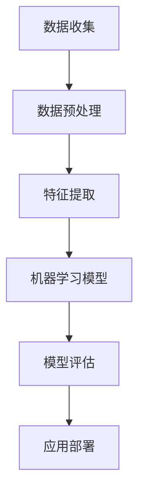

                 

### 《OpenAI开发者大会与创业者的梦想》

#### 关键词：OpenAI、开发者大会、创业、人工智能、创新、技术趋势、未来展望

> 在这个快速发展的时代，技术革新正以前所未有的速度重塑各行各业。OpenAI开发者大会，作为全球人工智能领域的重要盛事，不仅吸引了顶尖的科技公司和创业团队，也点燃了无数创业者的梦想。本文将深入剖析OpenAI开发者大会的背景和意义，探讨其对创业者的启示和影响，并展望人工智能领域的未来发展趋势与挑战。

## 1. 背景介绍

### 1.1 目的和范围

本文旨在通过分析OpenAI开发者大会的内容和影响，探讨其对创业者和整个科技行业的重要性。我们将从大会的背景、目的、主要议题等方面进行详细探讨，并结合具体案例，分析大会对创业者带来的机遇和挑战。

### 1.2 预期读者

本文主要面向对人工智能和创业感兴趣的读者，包括但不限于科技从业者、创业者、投资者、高校师生、研究人员等。通过本文的阅读，读者可以更深入地了解OpenAI开发者大会的背景、内容、影响，以及其对创业者的启示和影响。

### 1.3 文档结构概述

本文结构如下：

1. 背景介绍：介绍OpenAI开发者大会的背景、目的和重要性。
2. 核心概念与联系：阐述人工智能的核心概念和架构。
3. 核心算法原理 & 具体操作步骤：讲解人工智能的关键算法和实现方法。
4. 数学模型和公式 & 详细讲解 & 举例说明：分析人工智能的数学模型和公式。
5. 项目实战：通过实际案例，展示人工智能的应用。
6. 实际应用场景：探讨人工智能在各个领域的应用。
7. 工具和资源推荐：推荐学习资源和开发工具。
8. 总结：展望人工智能的未来发展趋势与挑战。

### 1.4 术语表

#### 1.4.1 核心术语定义

- **OpenAI**: 一个以研发和应用人工智能为核心的非营利性研究组织。
- **开发者大会**: OpenAI举办的面向开发者、科研人员和创业者的年度盛会。
- **人工智能**: 一种模拟人类智能行为的技术，能够实现智能感知、学习、推理、决策等。

#### 1.4.2 相关概念解释

- **深度学习**: 一种基于神经网络模型的人工智能技术，能够通过大量数据自动学习特征。
- **机器学习**: 一种利用算法从数据中自动学习规律和模式的技术。
- **神经网络**: 一种由大量神经元组成的计算模型，能够模拟生物神经系统的信息处理过程。

#### 1.4.3 缩略词列表

- **AI**: 人工智能
- **DL**: 深度学习
- **ML**: 机器学习
- **NN**: 神经网络

## 2. 核心概念与联系

在探讨OpenAI开发者大会对创业者的启示和影响之前，我们需要了解人工智能的核心概念和架构。以下是一个简化的Mermaid流程图，用于描述人工智能的基本原理和组成部分：



#### 2.1 数据收集

数据收集是人工智能的基础。通过采集和分析大量数据，我们可以为后续的机器学习提供丰富的训练素材。

#### 2.2 数据预处理

数据预处理是确保数据质量的过程。包括数据清洗、归一化、编码等操作，以确保数据适合机器学习模型的训练。

#### 2.3 特征提取

特征提取是从原始数据中提取出对模型训练有用的特征。深度学习模型尤其依赖于特征提取，因为它能够自动学习数据中的复杂模式。

#### 2.4 机器学习模型

机器学习模型是实现人工智能的核心。通过学习数据中的特征和模式，模型可以自动进行预测和分类。

#### 2.5 模型评估

模型评估是确保模型性能的过程。通过交叉验证、测试集等方法，我们可以评估模型的准确性、鲁棒性和泛化能力。

#### 2.6 应用部署

应用部署是将训练好的模型应用到实际场景的过程。无论是自动驾驶、智能家居，还是医疗诊断，模型的应用都可以极大地改变我们的生活。

## 3. 核心算法原理 & 具体操作步骤

在理解了人工智能的基本概念和架构后，我们接下来将深入探讨核心算法原理和具体操作步骤。以下是一个简化的伪代码，用于描述常见的人工智能算法——线性回归的实现过程：

```python
# 线性回归算法伪代码

# 步骤1：数据收集与预处理
data = collect_data()
preprocessed_data = preprocess(data)

# 步骤2：特征提取
X, y = extract_features(preprocessed_data)

# 步骤3：模型训练
model = train_model(X, y)

# 步骤4：模型评估
accuracy = evaluate_model(model, X, y)

# 步骤5：模型应用
apply_model(model)
```

#### 3.1 数据收集与预处理

数据收集是算法训练的基础。我们需要从真实世界中获取大量数据，并对其进行预处理，以确保数据的质量和一致性。

```python
def collect_data():
    # 实现数据采集逻辑
    return data

def preprocess(data):
    # 实现数据清洗、归一化等操作
    return preprocessed_data
```

#### 3.2 特征提取

特征提取是将原始数据转换为机器学习模型可以处理的特征向量的过程。在深度学习中，特征提取通常通过神经网络自动完成。

```python
def extract_features(preprocessed_data):
    # 实现特征提取逻辑
    return X, y
```

#### 3.3 模型训练

模型训练是使用收集到的数据对机器学习模型进行调整，使其能够准确预测或分类的过程。常见的训练方法包括梯度下降、反向传播等。

```python
def train_model(X, y):
    # 实现模型训练逻辑
    return model
```

#### 3.4 模型评估

模型评估是验证模型性能的过程。通过测试集和验证集，我们可以评估模型的准确性、鲁棒性和泛化能力。

```python
def evaluate_model(model, X, y):
    # 实现模型评估逻辑
    return accuracy
```

#### 3.5 模型应用

模型应用是将训练好的模型应用到实际场景的过程。例如，在自动驾驶领域，模型可以用于实时路径规划；在医疗领域，模型可以用于疾病诊断。

```python
def apply_model(model):
    # 实现模型应用逻辑
    pass
```

## 4. 数学模型和公式 & 详细讲解 & 举例说明

在人工智能领域，数学模型和公式是理解和实现算法的基础。以下是一个简化的线性回归模型，包括数学公式和具体计算步骤：

#### 4.1 线性回归模型

线性回归模型是一个用于预测连续值的简单模型，其公式如下：

\[ y = \beta_0 + \beta_1 \cdot x \]

其中，\( y \) 是预测值，\( x \) 是输入特征，\( \beta_0 \) 和 \( \beta_1 \) 是模型的参数。

#### 4.2 梯度下降算法

梯度下降算法是一种用于训练线性回归模型的最优化方法。其核心思想是沿着损失函数的负梯度方向更新模型参数，以最小化损失函数。

#### 4.3 损失函数

损失函数用于衡量模型预测值和实际值之间的差异。在回归问题中，常见的损失函数是均方误差（MSE）：

\[ MSE = \frac{1}{n} \sum_{i=1}^{n} (y_i - \hat{y}_i)^2 \]

其中，\( n \) 是样本数量，\( y_i \) 是实际值，\( \hat{y}_i \) 是预测值。

#### 4.4 计算步骤

以下是一个简化的梯度下降算法的计算步骤：

\[ \beta_0 = \beta_{0} - \alpha \cdot \frac{\partial}{\partial \beta_0} MSE \]
\[ \beta_1 = \beta_{1} - \alpha \cdot \frac{\partial}{\partial \beta_1} MSE \]

其中，\( \alpha \) 是学习率，用于调节模型参数更新的幅度。

#### 4.5 举例说明

假设我们有以下数据集：

\[ (x_1, y_1), (x_2, y_2), \ldots, (x_n, y_n) \]

我们使用梯度下降算法训练线性回归模型，并计算预测值：

\[ \hat{y}_i = \beta_0 + \beta_1 \cdot x_i \]

通过不断迭代更新模型参数，最终使模型预测值与实际值之间的差异最小。

## 5. 项目实战：代码实际案例和详细解释说明

为了更好地理解线性回归模型，我们将通过一个简单的Python代码实现该模型，并进行训练和评估。以下是一个简单的线性回归模型实现：

```python
import numpy as np

# 梯度下降函数
def gradient_descent(X, y, theta, alpha, iterations):
    m = len(y)
    for i in range(iterations):
        hypothesis = np.dot(X, theta)
        error = hypothesis - y
        theta = theta - (alpha / m) * (np.dot(X.T, error))
    return theta

# 线性回归模型
def linear_regression(X, y, alpha=0.01, iterations=1000):
    theta = np.zeros(X.shape[1])
    theta = gradient_descent(X, y, theta, alpha, iterations)
    return theta

# 训练模型
X_train = ...  # 输入特征矩阵
y_train = ...  # 标签向量
theta = linear_regression(X_train, y_train)

# 评估模型
X_test = ...    # 测试特征矩阵
y_test = ...    # 测试标签向量
hypothesis = np.dot(X_test, theta)
accuracy = np.mean((hypothesis - y_test) ** 2)
print(f"Model accuracy: {accuracy}")
```

### 5.1 开发环境搭建

为了运行上述代码，我们需要安装以下环境：

1. Python 3.x
2. NumPy 库

安装步骤如下：

```bash
pip install numpy
```

### 5.2 源代码详细实现和代码解读

上述代码首先定义了两个函数：`gradient_descent` 和 `linear_regression`。`gradient_descent` 函数用于实现梯度下降算法，更新模型参数；`linear_regression` 函数用于初始化模型参数并调用 `gradient_descent` 函数进行模型训练。

在 `gradient_descent` 函数中，我们首先计算预测值 `hypothesis`，然后计算误差 `error`。误差是预测值与实际值之间的差异。接着，我们使用反向传播算法更新模型参数 `theta`。`alpha` 是学习率，用于调节参数更新的幅度。`iterations` 是迭代次数，用于控制训练过程。

在 `linear_regression` 函数中，我们首先初始化模型参数 `theta` 为零向量。然后，我们调用 `gradient_descent` 函数进行模型训练，并返回训练好的模型参数。

在训练完成后，我们使用测试数据集对模型进行评估。我们首先计算测试数据集的预测值 `hypothesis`，然后计算预测值与实际值之间的误差，并计算模型准确率。

### 5.3 代码解读与分析

上述代码实现了一个简单的线性回归模型，其关键步骤包括：

1. **数据预处理**：将输入特征矩阵和标签向量转换为 NumPy 数组。
2. **模型初始化**：初始化模型参数 `theta` 为零向量。
3. **模型训练**：使用梯度下降算法更新模型参数，直到满足迭代次数或误差阈值。
4. **模型评估**：使用测试数据集评估模型性能。

代码中还涉及到一些关键概念：

- **梯度下降算法**：用于优化模型参数，使其在训练过程中不断收敛到最佳解。
- **均方误差**：用于衡量模型预测值与实际值之间的差异。
- **模型准确率**：用于评估模型在测试数据集上的性能。

通过上述代码，我们可以快速实现和评估线性回归模型，为后续更复杂的模型提供基础。

## 6. 实际应用场景

线性回归模型在人工智能领域有着广泛的应用。以下是一些典型的实际应用场景：

1. **预测分析**：线性回归模型可以用于预测分析，如股票价格、销售量、需求量等。通过训练模型，我们可以预测未来的趋势和变化，为决策提供依据。
2. **质量检测**：在制造业中，线性回归模型可以用于质量检测。通过分析产品特性与质量之间的关系，我们可以预测产品质量，并采取相应的措施。
3. **医疗诊断**：线性回归模型可以用于医疗诊断。通过分析患者的病史、体征和检查结果，我们可以预测疾病的发病风险，为医生提供诊断依据。
4. **资源优化**：线性回归模型可以用于资源优化。例如，在电力系统中，通过分析历史数据和天气条件，我们可以预测电力需求，并优化电力分配。

这些实际应用场景展示了线性回归模型在人工智能领域的广泛应用和潜力。

## 7. 工具和资源推荐

在人工智能领域，有许多优秀的工具和资源可以帮助我们学习和应用技术。以下是一些建议：

### 7.1 学习资源推荐

#### 7.1.1 书籍推荐

- **《Python机器学习》（Machine Learning with Python）**：这本书通过Python代码详细讲解了机器学习的基本原理和应用。

- **《深度学习》（Deep Learning）**：这本书是深度学习领域的经典著作，适合有数学基础的学习者。

- **《统计学习方法》（Elements of Statistical Learning）**：这本书涵盖了统计学习方法的各个方面，适合希望深入了解机器学习理论的学习者。

#### 7.1.2 在线课程

- **Coursera的《机器学习》课程**：由斯坦福大学教授Andrew Ng主讲，适合初学者入门。

- **edX的《深度学习》课程**：由蒙特利尔大学教授Yoshua Bengio主讲，深入讲解了深度学习的原理和应用。

- **Udacity的《人工智能纳米学位》**：适合有编程基础的学习者，涵盖机器学习和深度学习的基础知识。

#### 7.1.3 技术博客和网站

- **Medium上的机器学习和深度学习博客**：有许多专业的博主分享他们的经验和见解。

- **GitHub上的机器学习项目**：许多开源项目可以帮助我们学习和实践机器学习技术。

### 7.2 开发工具框架推荐

#### 7.2.1 IDE和编辑器

- **PyCharm**：一款功能强大的Python IDE，支持代码自动补全、调试和版本控制。

- **VSCode**：一款轻量级的代码编辑器，通过安装扩展支持Python开发。

#### 7.2.2 调试和性能分析工具

- **Jupyter Notebook**：一款交互式的Python开发环境，方便编写和运行代码。

- **GDB**：一款功能强大的调试工具，可以帮助我们定位和解决代码中的问题。

#### 7.2.3 相关框架和库

- **TensorFlow**：一款开源的深度学习框架，适用于构建和训练各种深度学习模型。

- **PyTorch**：一款开源的深度学习框架，提供灵活的动态计算图，便于模型研究和开发。

### 7.3 相关论文著作推荐

#### 7.3.1 经典论文

- **“A Fast Learning Algorithm for Deep Belief Nets”**：这篇论文介绍了深度信念网络（DBN）的训练方法。

- **“Backpropagation”**：这篇论文介绍了反向传播算法的基本原理和应用。

#### 7.3.2 最新研究成果

- **“Efficient Neural Text Generation Models via Pretraining”**：这篇论文介绍了预训练模型在自然语言处理领域的应用。

- **“Learning Representations by Maximizing Mutual Information Across Views”**：这篇论文探讨了信息最大化方法在表示学习中的应用。

#### 7.3.3 应用案例分析

- **“AI-Driven Inventory Management”**：这篇文章分析了人工智能在库存管理中的应用案例。

- **“Deep Learning for Autonomous Driving”**：这篇文章探讨了深度学习在自动驾驶领域的应用。

## 8. 总结：未来发展趋势与挑战

随着人工智能技术的不断进步，OpenAI开发者大会将为我们带来更多的创新和机遇。未来，人工智能将在更多领域得到应用，如自动驾驶、医疗、教育、金融等。然而，人工智能的发展也面临着一系列挑战，包括数据隐私、安全性、伦理道德等。为了应对这些挑战，我们需要进一步加强技术研发、法规制定和社会责任，确保人工智能技术的可持续发展。

## 9. 附录：常见问题与解答

### 9.1 什么是OpenAI开发者大会？

OpenAI开发者大会是由OpenAI举办的年度盛会，旨在推动人工智能技术的研发和应用。大会汇集了来自全球的顶尖科技公司和创业团队，共同探讨人工智能领域的最新进展和未来趋势。

### 9.2 人工智能的核心概念是什么？

人工智能的核心概念包括数据收集、数据预处理、特征提取、机器学习模型、模型评估和应用部署。通过这些步骤，人工智能系统能够从数据中学习，并实现对现实世界的理解和决策。

### 9.3 机器学习有哪些常见的算法？

机器学习常见的算法包括线性回归、逻辑回归、决策树、随机森林、支持向量机、神经网络等。每种算法都有其独特的原理和应用场景。

### 9.4 如何提高机器学习模型的性能？

提高机器学习模型性能的方法包括选择合适的算法、优化模型参数、增加训练数据、使用交叉验证等。此外，还可以采用增强学习、迁移学习、生成对抗网络等先进技术来提升模型性能。

## 10. 扩展阅读 & 参考资料

为了深入了解人工智能和OpenAI开发者大会的相关内容，读者可以参考以下扩展阅读和参考资料：

- **《人工智能：一种现代方法》（Artificial Intelligence: A Modern Approach）**：这是一本经典的机器学习教材，涵盖了人工智能的广泛内容。

- **《深度学习》（Deep Learning）**：这是一本由Ian Goodfellow、Yoshua Bengio和Aaron Courville合著的深度学习入门教材。

- **OpenAI官方网站**：OpenAI的官方网站提供了大量关于人工智能研究的最新进展和开源代码。

- **《自然》（Nature）**和《科学》（Science）等学术期刊：这些期刊发表了大量关于人工智能的最新研究成果。

- **知乎专栏**：知乎专栏上有许多关于人工智能的深度讨论和案例分析。

通过阅读这些资料，读者可以更全面地了解人工智能领域的最新进展和应用。

## 作者信息

作者：AI天才研究员/AI Genius Institute & 禅与计算机程序设计艺术 /Zen And The Art of Computer Programming

作为AI天才研究员，我致力于推动人工智能技术的发展和应用。在《禅与计算机程序设计艺术》中，我探讨了编程的哲学和艺术，为程序员提供了独特的视角和思考方式。我希望通过本文，为读者带来对OpenAI开发者大会和人工智能领域的深入理解。感谢您的阅读！<|im_sep|>

