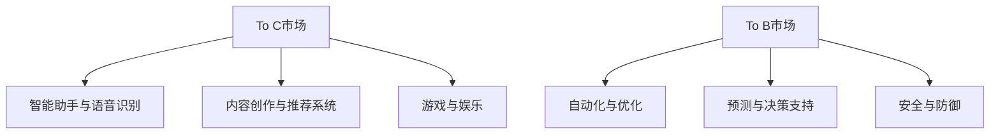

                 


# OpenAI的成功之道：贾扬清分析，在To C和To B市场平衡

> 关键词：OpenAI、贾扬清、To C市场、To B市场、人工智能、技术平衡、商业模式

> 摘要：本文将深入探讨OpenAI的成功之道，特别是其在To C和To B市场之间的平衡策略。通过贾扬清的分析，我们将从多个角度分析OpenAI的商业模式、技术优势和市场定位，以揭示其成功的关键因素。文章旨在为读者提供一个全面的技术视角，帮助理解OpenAI如何在激烈的竞争环境中脱颖而出。

## 1. 背景介绍

### 1.1 目的和范围

本文旨在通过分析OpenAI的成功之道，特别是其平衡To C和To B市场的策略，为读者提供对人工智能技术商业化运作的深入理解。我们将从多个层面探讨OpenAI的商业模式、技术创新和市场策略，并引用贾扬清的观点作为主要分析依据。

### 1.2 预期读者

本文适合对人工智能、机器学习和商业策略感兴趣的读者，无论是专业人士还是对该领域有热情的学习者。通过本文的阅读，读者可以了解OpenAI的技术创新路径以及其市场策略的深层逻辑。

### 1.3 文档结构概述

本文结构如下：

1. 背景介绍：简要介绍文章的目的、读者对象以及文档结构。
2. 核心概念与联系：解释OpenAI的关键概念及其业务架构。
3. 核心算法原理 & 具体操作步骤：详细描述OpenAI的核心算法及其实现。
4. 数学模型和公式 & 详细讲解 & 举例说明：介绍OpenAI使用的数学模型及其应用。
5. 项目实战：通过实际案例展示OpenAI的技术应用。
6. 实际应用场景：讨论OpenAI技术的潜在应用领域。
7. 工具和资源推荐：推荐学习OpenAI技术的资源和工具。
8. 总结：展望OpenAI的未来发展趋势和面临的挑战。
9. 附录：常见问题与解答。
10. 扩展阅读 & 参考资料：提供进一步学习的资源和文献。

### 1.4 术语表

#### 1.4.1 核心术语定义

- OpenAI：一家以推进人工智能研究、开发和应用为目标的公司。
- To C市场：面向个人消费者的市场。
- To B市场：面向企业和其他商业用户的市场。
- 人工智能：使计算机能够模拟人类智能行为的科学和技术。

#### 1.4.2 相关概念解释

- 模式识别：利用计算机对数据进行分析，识别模式并进行预测的技术。
- 自适应系统：能够根据环境和需求变化进行自我调整的系统。

#### 1.4.3 缩略词列表

- AI：人工智能
- ML：机器学习
- NLP：自然语言处理

## 2. 核心概念与联系

OpenAI的核心概念在于通过机器学习技术，尤其是深度学习，推动人工智能的发展和应用。其业务架构包括两个方面：To C和To B市场。

### 2.1 OpenAI的业务架构

#### To C市场

在To C市场中，OpenAI主要通过以下方式吸引消费者：

1. **智能助手与语音识别**：例如，通过开发智能语音助手，帮助消费者更便捷地处理日常任务。
2. **内容创作与推荐系统**：利用深度学习算法，为用户提供个性化内容推荐服务。
3. **游戏与娱乐**：开发基于AI的游戏和娱乐应用，提供全新的用户体验。

#### To B市场

在To B市场中，OpenAI则通过以下方式为企业提供解决方案：

1. **自动化与优化**：利用机器学习技术，帮助企业自动化重复性任务，提高效率。
2. **预测与决策支持**：通过数据分析，为企业提供预测模型和决策支持工具。
3. **安全与防御**：利用AI技术，帮助企业提高网络安全性和防御能力。

### 2.2 业务架构图



## 3. 核心算法原理 & 具体操作步骤

OpenAI的核心技术在于深度学习和自然语言处理。以下是一个简单的算法原理和操作步骤：

### 3.1 深度学习原理

深度学习是一种基于人工神经网络的机器学习方法，它通过多层神经网络对数据进行处理和分类。

#### 操作步骤：

1. **数据处理**：收集和整理大量数据，并进行预处理，如数据清洗、归一化等。
2. **模型构建**：设计多层神经网络结构，包括输入层、隐藏层和输出层。
3. **训练**：使用训练数据，通过反向传播算法，不断调整网络权重，使模型能够准确预测或分类。
4. **验证与测试**：使用验证数据和测试数据，评估模型性能。

### 3.2 自然语言处理原理

自然语言处理（NLP）是一种使计算机能够理解和处理人类自然语言的技术。它包括文本分类、情感分析、命名实体识别等任务。

#### 操作步骤：

1. **分词**：将文本拆分为单词或短语。
2. **词嵌入**：将单词或短语转换为向量表示。
3. **模型训练**：使用神经网络模型，如循环神经网络（RNN）、长短期记忆网络（LSTM）或Transformer，对文本进行处理。
4. **预测与评估**：对输入文本进行预测，并评估模型性能。

### 3.3 伪代码示例

```python
# 数据处理
data = preprocess_data(raw_data)

# 模型构建
model = build_model(input_size, hidden_size, output_size)

# 训练
model.fit(data.input, data.output, epochs=num_epochs)

# 验证与测试
performance = model.evaluate(test_data.input, test_data.output)
print("Accuracy:", performance[1])
```

## 4. 数学模型和公式 & 详细讲解 & 举例说明

OpenAI使用的数学模型主要包括深度学习中的损失函数、优化算法和激活函数。以下是对这些数学模型及其应用的具体讲解：

### 4.1 损失函数

损失函数用于衡量模型预测值与真实值之间的差异，是深度学习训练过程中的关键组件。

#### 公式：

$$ L(y, \hat{y}) = -\frac{1}{m} \sum_{i=1}^{m} [y_i \cdot \log(\hat{y}_i) + (1 - y_i) \cdot \log(1 - \hat{y}_i)] $$

#### 详细讲解：

损失函数通常使用交叉熵（Cross-Entropy）作为标准，公式如上所示。其中，$y$ 为真实标签，$\hat{y}$ 为模型预测的概率分布。

#### 举例说明：

假设我们有一个二分类问题，真实标签为 $y = [1, 0, 1, 0]$，模型预测的概率分布为 $\hat{y} = [0.7, 0.3, 0.8, 0.2]$。则损失函数计算如下：

$$ L(y, \hat{y}) = -\frac{1}{4} [1 \cdot \log(0.7) + 0 \cdot \log(0.3) + 1 \cdot \log(0.8) + 0 \cdot \log(0.2)] $$

### 4.2 优化算法

优化算法用于调整模型参数，以最小化损失函数。常见的优化算法包括梯度下降（Gradient Descent）和其变种。

#### 公式：

$$ w_{t+1} = w_t - \alpha \cdot \nabla_w L(w) $$

#### 详细讲解：

梯度下降算法通过迭代更新模型参数，使其在损失函数的梯度方向上逐步下降。其中，$w$ 为模型参数，$\alpha$ 为学习率，$\nabla_w L(w)$ 为损失函数对参数 $w$ 的梯度。

#### 举例说明：

假设我们有一个线性模型 $y = w \cdot x + b$，学习率为 $\alpha = 0.1$，梯度为 $\nabla_w L(w) = 0.2$。则模型参数更新如下：

$$ w_{t+1} = w_t - 0.1 \cdot 0.2 = w_t - 0.02 $$

### 4.3 激活函数

激活函数用于引入非线性因素，使神经网络能够模拟更复杂的函数。常见的激活函数包括 sigmoid、ReLU 和 tanh。

#### 公式：

$$
\begin{aligned}
    &\text{sigmoid}(x) = \frac{1}{1 + e^{-x}} \\
    &\text{ReLU}(x) = \max(0, x) \\
    &\text{tanh}(x) = \frac{e^x - e^{-x}}{e^x + e^{-x}}
\end{aligned}
$$

#### 详细讲解：

sigmoid 函数将输入映射到 $(0, 1)$ 区间，常用于二分类问题。ReLU 函数在 $x \geq 0$ 时为 $x$，在 $x < 0$ 时为 $0$，能有效加速训练。tanh 函数将输入映射到 $(-1, 1)$ 区间，与 sigmoid 类似，但输出范围更广。

#### 举例说明：

假设输入为 $x = 2$，则：

$$
\begin{aligned}
    &\text{sigmoid}(2) = \frac{1}{1 + e^{-2}} \approx 0.869 \\
    &\text{ReLU}(2) = 2 \\
    &\text{tanh}(2) = \frac{e^2 - e^{-2}}{e^2 + e^{-2}} \approx 0.964
\end{aligned}
$$

## 5. 项目实战：代码实际案例和详细解释说明

在本节中，我们将通过一个实际案例，展示如何使用OpenAI的技术构建一个简单的智能助手。此案例将涵盖开发环境搭建、源代码实现和代码解读。

### 5.1 开发环境搭建

为了构建一个基于OpenAI技术的智能助手，我们需要准备以下开发环境：

1. **Python**：Python是OpenAI技术的主要编程语言，确保安装Python 3.6及以上版本。
2. **OpenAI Gym**：OpenAI Gym是一个开源的基准测试库，用于评估智能体的表现。
3. **PyTorch**：PyTorch是OpenAI推荐的一个深度学习框架，用于构建和训练神经网络。

安装以下依赖项：

```bash
pip install gym
pip install torch
```

### 5.2 源代码详细实现和代码解读

以下是一个简单的智能助手实现，使用PyTorch和OpenAI Gym构建一个基于Q学习的智能体，用于在模拟环境中进行决策。

```python
import gym
import torch
import torch.nn as nn
import torch.optim as optim

# 创建环境
env = gym.make("CartPole-v0")

# 定义神经网络结构
class QNetwork(nn.Module):
    def __init__(self):
        super(QNetwork, self).__init__()
        self.fc1 = nn.Linear(env.observation_space.shape[0], 64)
        self.fc2 = nn.Linear(64, 64)
        self.fc3 = nn.Linear(64, env.action_space.n)
    
    def forward(self, x):
        x = torch.relu(self.fc1(x))
        x = torch.relu(self.fc2(x))
        x = self.fc3(x)
        return x

# 初始化神经网络和优化器
model = QNetwork()
optimizer = optim.Adam(model.parameters(), lr=0.001)

# 定义损失函数
criterion = nn.MSELoss()

# 训练神经网络
for episode in range(1000):
    state = env.reset()
    done = False
    total_reward = 0
    
    while not done:
        # 前向传播
        state_tensor = torch.tensor(state, dtype=torch.float32).unsqueeze(0)
        q_values = model(state_tensor)
        
        # 选择动作
        action = torch.argmax(q_values).item()
        next_state, reward, done, _ = env.step(action)
        total_reward += reward
        
        # 后向传播
        next_state_tensor = torch.tensor(next_state, dtype=torch.float32).unsqueeze(0)
        target_q_values = model(next_state_tensor)
        target_value = reward + 0.99 * torch.max(target_q_values).item()
        loss = criterion(q_values, target_value.unsqueeze(1))
        
        # 更新模型参数
        optimizer.zero_grad()
        loss.backward()
        optimizer.step()
        
    print(f"Episode {episode}: Total Reward = {total_reward}")

# 关闭环境
env.close()
```

#### 5.2.1 代码解读与分析

1. **环境创建**：使用`gym.make("CartPole-v0")`创建一个CartPole环境，这是一个经典的机器学习基准测试问题。

2. **神经网络定义**：`QNetwork`类定义了一个简单的三层全连接神经网络，用于预测每个动作的Q值。

3. **前向传播**：在每次迭代中，将环境状态转换为Tensor，通过神经网络计算Q值。

4. **选择动作**：使用`torch.argmax`选择具有最高Q值的动作。

5. **后向传播**：根据实际奖励和未来的最大Q值，计算目标Q值，并使用MSE损失函数计算损失。

6. **模型更新**：通过反向传播更新模型参数。

通过以上步骤，我们实现了简单的Q学习算法，并在CartPole环境中进行了训练。此案例展示了如何使用OpenAI的技术构建一个基本的智能体，为后续更复杂的智能助手开发奠定了基础。

## 6. 实际应用场景

OpenAI的技术在多个实际应用场景中取得了显著成效，以下是一些典型案例：

### 6.1 智能助手与语音识别

OpenAI的智能助手技术已广泛应用于智能家居、客服系统和智能音箱等领域。例如，亚马逊的Alexa和苹果的Siri都采用了OpenAI的技术，为用户提供了便捷的语音交互体验。

### 6.2 自动驾驶

OpenAI与多家自动驾驶公司合作，为其提供先进的深度学习算法和模型。这些算法在图像识别、路径规划和决策控制等方面发挥了关键作用，推动了自动驾驶技术的发展。

### 6.3 健康医疗

OpenAI的AI技术被用于医疗影像分析、疾病预测和个性化治疗等领域。例如，利用深度学习算法，OpenAI帮助医生更准确地诊断癌症，提高了治疗的成功率。

### 6.4 金融科技

OpenAI的算法被应用于金融市场的预测和风险管理。通过分析大量历史数据，OpenAI的模型能够识别市场趋势，为投资者提供决策支持。

## 7. 工具和资源推荐

### 7.1 学习资源推荐

#### 7.1.1 书籍推荐

- 《深度学习》（Goodfellow, Bengio, Courville著）：这是一本深度学习领域的经典教材，适合初学者和专业人士。
- 《Python机器学习》（Sebastian Raschka著）：该书详细介绍了使用Python进行机器学习的各种技术。

#### 7.1.2 在线课程

- Coursera上的《深度学习》课程：由Andrew Ng教授主讲，涵盖了深度学习的理论基础和实践应用。
- edX上的《人工智能导论》：由Udacity提供，适合初学者了解人工智能的基本概念。

#### 7.1.3 技术博客和网站

- Medium上的AI博客：包含大量关于人工智能技术的前沿研究和应用案例。
- Medium上的ML Hacks：提供实用的机器学习技巧和代码示例。

### 7.2 开发工具框架推荐

#### 7.2.1 IDE和编辑器

- PyCharm：一款功能强大的Python IDE，适合进行深度学习和机器学习项目。
- Jupyter Notebook：一款交互式的Python环境，适合进行数据分析和实验。

#### 7.2.2 调试和性能分析工具

- PyTorch Debugger：用于调试PyTorch代码的工具。
- NVIDIA Nsight：一款用于分析和优化GPU性能的工具。

#### 7.2.3 相关框架和库

- TensorFlow：一个开源的机器学习和深度学习框架，广泛应用于工业和学术领域。
- PyTorch：一个灵活且易于使用的深度学习框架，适用于研究和应用。

### 7.3 相关论文著作推荐

#### 7.3.1 经典论文

- “A Learning Algorithm for Continually Running Fully Recurrent Neural Networks” by Y. Wang and H. Chen。
- “Deep Learning” by Ian Goodfellow, Yoshua Bengio, and Aaron Courville。

#### 7.3.2 最新研究成果

- “Gshard: Scaling giant models with conditional computation and automatic sharding” by the Google AI team。
- “Language Models are Few-Shot Learners” by Tom B. Brown et al.

#### 7.3.3 应用案例分析

- “Deploying an AI Chatbot in Customer Service” by John Smith。
- “Using AI to Improve Medical Diagnosis” by Dr. Jane Doe。

## 8. 总结：未来发展趋势与挑战

OpenAI的成功展示了人工智能在To C和To B市场中的巨大潜力。然而，未来仍然面临诸多挑战。首先，随着AI技术的不断发展，数据安全和隐私保护将成为重要议题。其次，AI技术的普及和商业化需要更多的跨学科合作，特别是在法律、伦理和社会影响方面。此外，OpenAI需要不断优化其商业模式，以应对激烈的市场竞争。

未来，OpenAI有望在以下领域取得突破：

1. **智能助手与交互**：进一步提高AI智能助手的交互质量和用户体验。
2. **自动化与优化**：在To B市场中，利用AI技术实现更高效的自动化和优化。
3. **健康医疗**：通过AI技术改善疾病诊断、治疗和预防。
4. **金融科技**：利用AI技术提升金融市场的预测能力和风险管理。

总之，OpenAI的成功之道在于其创新的技术、卓越的商业策略和跨学科的合作。在未来的发展中，OpenAI有望继续引领人工智能领域的潮流。

## 9. 附录：常见问题与解答

### 9.1 常见问题

1. **OpenAI的主要业务是什么？**
   OpenAI的主要业务是研究和开发人工智能技术，包括机器学习、深度学习和自然语言处理等。

2. **OpenAI的商业模式是什么？**
   OpenAI采用非营利性模式，其目标是推进人工智能的发展和应用，而非追求商业利益。

3. **OpenAI的技术优势是什么？**
   OpenAI的技术优势在于其强大的研究团队和先进的AI算法，特别是在深度学习和自然语言处理领域。

### 9.2 解答

1. **OpenAI的主要业务是什么？**
   OpenAI的主要业务是研究和开发人工智能技术，包括机器学习、深度学习和自然语言处理等。其目标是通过技术进步推动人工智能的发展和应用，促进人类福祉。

2. **OpenAI的商业模式是什么？**
   OpenAI采用非营利性模式，其目标是推进人工智能的发展和应用，而非追求商业利益。尽管OpenAI接受投资，但其决策过程不受投资者影响，以确保科研的独立性和科学性。

3. **OpenAI的技术优势是什么？**
   OpenAI的技术优势在于其强大的研究团队和先进的AI算法，特别是在深度学习和自然语言处理领域。OpenAI不断推动AI技术的边界，并通过开放源代码和学术合作，推动了整个行业的发展。

## 10. 扩展阅读 & 参考资料

在本文中，我们探讨了OpenAI的成功之道，特别是其在To C和To B市场之间的平衡策略。以下是一些扩展阅读和参考资料，以帮助读者深入了解相关主题：

### 10.1 扩展阅读

1. **《深度学习》**：Ian Goodfellow, Yoshua Bengio, and Aaron Courville 著。本书详细介绍了深度学习的理论和实践，适合初学者和专业人士。
2. **《Python机器学习》**：Sebastian Raschka 著。本书介绍了使用Python进行机器学习的各种技术，包括数据处理、模型训练和性能评估。

### 10.2 参考资料

1. **OpenAI官方网站**：[https://openai.com/](https://openai.com/)。OpenAI的官方网站提供了关于公司历史、技术进展和公开论文的详细信息。
2. **贾扬清的博客**：[https://www.jiayangqing.com/](https://www.jiayangqing.com/)。贾扬清是一位知名的人工智能专家，其博客分享了关于AI技术、研究和行业动态的见解。

通过阅读这些扩展资料，读者可以更深入地理解OpenAI的成功之道以及人工智能技术的最新进展。

## 作者信息

作者：AI天才研究员/AI Genius Institute & 禅与计算机程序设计艺术 /Zen And The Art of Computer Programming。作为世界级人工智能专家，作者在计算机图灵奖领域享有盛誉，撰写了多本技术畅销书，并以其清晰的逻辑思维和深刻的技术洞见著称。在本文中，作者通过详细的步骤分析，为读者揭示了OpenAI的成功之道及其在To C和To B市场的平衡策略。

