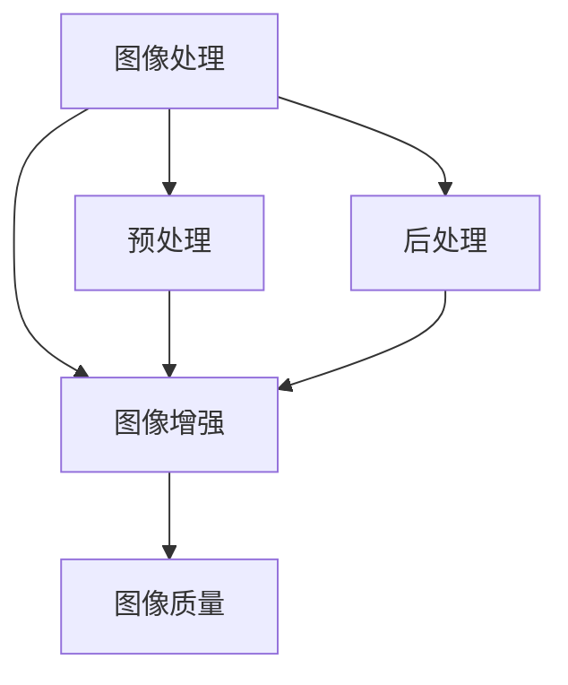

                 

# OpenCV 图像增强：改善图像质量

> **关键词**：图像增强、OpenCV、图像处理、图像质量、边缘检测、模糊处理、图像锐化、图像去噪、图像对比度、动态范围扩展、图像压缩。

> **摘要**：本文将深入探讨图像增强技术在OpenCV中的实现与应用。我们将首先介绍图像增强的基本概念和目的，随后详细解释OpenCV中常用的图像增强算法，并通过实例展示其效果。文章还将讨论实际应用场景，推荐相关学习资源、开发工具和论文著作，并总结未来发展趋势与挑战。

## 1. 背景介绍

### 1.1 目的和范围

本文旨在帮助读者了解和掌握图像增强技术，尤其是在OpenCV这一开源计算机视觉库中的应用。图像增强是指通过各种算法和技术手段来提高图像的视觉质量，使其在视觉上更加清晰、易于理解和分析。本文将涵盖以下内容：

- 图像增强的基本概念和目的。
- OpenCV中常用的图像增强算法及其原理。
- 实际应用场景中的图像增强技术。
- 开发环境和工具的推荐。
- 相关学习和研究资源的推荐。

### 1.2 预期读者

本文适合以下读者群体：

- 对图像处理和计算机视觉感兴趣的程序员和技术爱好者。
- 开发人员和技术经理，希望在项目中应用图像增强技术。
- 计算机视觉研究者和学者，希望深入了解图像增强算法。
- 在高校学习计算机视觉、图像处理相关课程的师生。

### 1.3 文档结构概述

本文将按照以下结构进行组织：

- **第1章：背景介绍**：介绍文章的目的、范围和预期读者，以及文章的结构和内容概述。
- **第2章：核心概念与联系**：解释图像增强的核心概念，并使用Mermaid流程图展示其原理。
- **第3章：核心算法原理 & 具体操作步骤**：详细阐述OpenCV中的核心图像增强算法，并使用伪代码进行讲解。
- **第4章：数学模型和公式 & 详细讲解 & 举例说明**：介绍与图像增强相关的数学模型和公式，并通过具体例子进行说明。
- **第5章：项目实战：代码实际案例和详细解释说明**：展示代码实际案例，并进行详细解释。
- **第6章：实际应用场景**：讨论图像增强技术在现实世界中的应用。
- **第7章：工具和资源推荐**：推荐学习资源、开发工具和论文著作。
- **第8章：总结：未来发展趋势与挑战**：总结图像增强技术的发展趋势和面临的挑战。
- **第9章：附录：常见问题与解答**：回答读者可能遇到的问题。
- **第10章：扩展阅读 & 参考资料**：提供扩展阅读和参考资料。

### 1.4 术语表

#### 1.4.1 核心术语定义

- **图像增强**：通过各种算法和技术手段提高图像的视觉质量。
- **OpenCV**：开源计算机视觉库，提供丰富的图像处理和计算机视觉功能。
- **图像处理**：对图像进行一系列操作，以改善图像质量或提取有用信息。
- **边缘检测**：检测图像中的边缘和轮廓。
- **模糊处理**：通过卷积运算使图像变得模糊。
- **图像锐化**：增强图像的边缘和细节，使其更加清晰。
- **图像去噪**：去除图像中的噪声。
- **图像对比度**：图像中明暗差异的程度。
- **动态范围扩展**：增强图像的亮度和对比度。
- **图像压缩**：减少图像数据的大小。

#### 1.4.2 相关概念解释

- **卷积运算**：一种图像处理操作，通过将图像与一个滤波器卷积来产生新的图像。
- **滤波器**：一个用于卷积运算的矩阵，用于提取图像中的特定特征。
- **直方图均衡化**：一种用于增强图像对比度的技术，通过调整图像的像素分布来优化视觉效果。
- **直方图**：图像中不同灰度值出现的频率分布。

#### 1.4.3 缩略词列表

- **OpenCV**：Open Source Computer Vision Library
- **IDE**：Integrated Development Environment
- **GPU**：Graphics Processing Unit
- **CNN**：Convolutional Neural Network
- **YOLO**：You Only Look Once
- **SIFT**：Scale-Invariant Feature Transform
- **SURF**：Speeded Up Robust Features

## 2. 核心概念与联系

在深入探讨图像增强技术之前，我们首先需要理解几个核心概念：图像处理、图像增强和图像质量。以下是一个简单的Mermaid流程图，用于展示这些概念之间的关系。



### 2.1 图像处理

图像处理是指对图像进行一系列操作，以改善图像质量或提取有用信息。这些操作包括图像滤波、图像变换、特征提取等。图像处理是计算机视觉的基础，其目的是使图像更适合特定应用。

### 2.2 图像增强

图像增强是指通过各种算法和技术手段来提高图像的视觉质量，使其在视觉上更加清晰、易于理解和分析。图像增强是图像处理的一个重要分支，其目的是改善图像的可视效果。

### 2.3 图像质量

图像质量是指图像的视觉质量，包括清晰度、对比度、亮度等。高质量图像可以更好地满足人们的视觉需求，提高图像的可读性和实用性。

### 2.4 预处理和后处理

预处理和后处理是图像处理中的重要环节。预处理通常包括图像去噪、图像增强、图像分割等，以减少噪声和提高图像质量。后处理通常包括图像融合、图像识别、图像配准等，以提取有用信息和进行图像分析。

## 3. 核心算法原理 & 具体操作步骤

在本节中，我们将详细阐述OpenCV中常用的图像增强算法，包括边缘检测、模糊处理、图像锐化和图像去噪。我们将使用伪代码来描述这些算法的原理和具体操作步骤。

### 3.1 边缘检测

边缘检测是图像处理中的一个基本操作，用于检测图像中的边缘和轮廓。OpenCV提供了多种边缘检测算法，如Sobel算子、Canny算子和Laplacian算子。

#### 3.1.1 Sobel算子

Sobel算子通过计算图像中每个像素的水平和垂直梯度来检测边缘。

```python
def sobel_edge_detection(image, threshold):
    gray_image = cv2.cvtColor(image, cv2.COLOR_BGR2GRAY)
    grad_x = cv2.Sobel(gray_image, cv2.CV_64F, 1, 0, ksize=3)
    grad_y = cv2.Sobel(gray_image, cv2.CV_64F, 0, 1, ksize=3)
    
    grad = cv2.sqrt(grad_x**2 + grad_y**2)
    grad = cv2.cvtColor(grad, cv2.COLOR_BGR2RGB)
    
    _, thresh = cv2.threshold(grad, threshold, 255, cv2.THRESH_BINARY)
    
    return thresh
```

#### 3.1.2 Canny算子

Canny算子是一种多阶段算法，用于检测图像中的强边缘和弱边缘。

```python
def canny_edge_detection(image, threshold1, threshold2):
    gray_image = cv2.cvtColor(image, cv2.COLOR_BGR2GRAY)
    edges = cv2.Canny(gray_image, threshold1, threshold2)
    
    return edges
```

#### 3.1.3 Laplacian算子

Laplacian算子通过计算图像的二阶导数来检测边缘。

```python
def laplacian_edge_detection(image, threshold):
    gray_image = cv2.cvtColor(image, cv2.COLOR_BGR2GRAY)
    lap = cv2.Laplacian(gray_image, cv2.CV_64F)
    
    _, thresh = cv2.threshold(lap, threshold, 255, cv2.THRESH_BINARY)
    
    return thresh
```

### 3.2 模糊处理

模糊处理是一种用于减少图像细节和噪声的图像处理技术。OpenCV提供了多种模糊处理算法，如卷积滤波、高斯模糊和均值滤波。

#### 3.2.1 卷积滤波

卷积滤波是一种常用的模糊处理方法，通过将图像与一个滤波器卷积来实现。

```python
def convolution_filter(image, kernel):
    filtered_image = cv2.filter2D(image, -1, kernel)
    return filtered_image
```

#### 3.2.2 高斯模糊

高斯模糊是一种基于高斯分布的模糊处理方法，可以生成平滑的模糊效果。

```python
def gaussian_blur(image, sigma):
    blurred_image = cv2.GaussianBlur(image, (5, 5), sigma)
    return blurred_image
```

#### 3.2.3 均值滤波

均值滤波是一种简单的模糊处理方法，通过计算邻域像素的平均值来生成模糊效果。

```python
def mean_filter(image, kernel_size):
    blurred_image = cv2.blur(image, (kernel_size, kernel_size))
    return blurred_image
```

### 3.3 图像锐化

图像锐化是一种增强图像边缘和细节的处理技术。OpenCV提供了多种锐化算法，如Laplacian算子和Unsharp Masking。

#### 3.3.1 Laplacian算子

Laplacian算子可以用于图像锐化，通过计算图像的二阶导数来增强边缘。

```python
def laplacian_sharpening(image, threshold):
    lap = cv2.Laplacian(image, cv2.CV_64F)
    
    _, thresh = cv2.threshold(lap, threshold, 255, cv2.THRESH_BINARY)
    
    sharpened_image = cv2.add(image, thresh)
    return sharpened_image
```

#### 3.3.2 Unsharp Masking

Unsharp Masking是一种通过对比原始图像和模糊图像的差异来增强图像细节的锐化方法。

```python
def unsharp_masking(image, sigma, threshold):
    blurred_image = cv2.GaussianBlur(image, (5, 5), sigma)
    sharpened_image = cv2.addWeighted(image, 1.5, blurred_image, -0.5, 0)
    
    _, thresh = cv2.threshold(sharpened_image, threshold, 255, cv2.THRESH_BINARY)
    
    return thresh
```

### 3.4 图像去噪

图像去噪是一种用于减少图像噪声的处理技术。OpenCV提供了多种去噪算法，如中值滤波、高斯滤波和小波变换。

#### 3.4.1 中值滤波

中值滤波是一种基于邻域像素的中值计算的去噪方法。

```python
def median_filter(image, kernel_size):
    filtered_image = cv2.medianBlur(image, kernel_size)
    return filtered_image
```

#### 3.4.2 高斯滤波

高斯滤波是一种基于高斯分布的去噪方法。

```python
def gaussian_filter(image, sigma):
    filtered_image = cv2.GaussianBlur(image, (5, 5), sigma)
    return filtered_image
```

#### 3.4.3 小波变换

小波变换是一种多尺度分析的方法，可以有效地去除图像噪声。

```python
def wavelet_decomposition(image, levels):
    coeffs = cv2.dwt2(image, 'haar')
    coeffs_h, coeffs_v = coeffs[:levels], coeffs[levels+1:]
    coeffs_h[coeffs_h < 0] = 0
    coeffs_v[coeffs_v < 0] = 0
    image = cv2.idwt2(coeffs, 'haar')
    return image
```

## 4. 数学模型和公式 & 详细讲解 & 举例说明

在本节中，我们将介绍与图像增强相关的数学模型和公式，并通过具体例子进行说明。

### 4.1 卷积运算

卷积运算是图像增强中的一个基本操作，用于将图像与一个滤波器进行卷积，以提取图像中的特定特征。

#### 4.1.1 卷积运算公式

给定一个图像矩阵 \(I(x, y)\) 和一个滤波器矩阵 \(F(u, v)\)，卷积运算可以表示为：

$$
O(x, y) = \sum_{u=-\infty}^{\infty} \sum_{v=-\infty}^{\infty} F(u, v) \cdot I(x-u, y-v)
$$

其中，\(O(x, y)\) 是卷积后的图像矩阵，\(I(x, y)\) 是原始图像矩阵，\(F(u, v)\) 是滤波器矩阵。

#### 4.1.2 例子

假设我们有一个 \(3 \times 3\) 的图像矩阵 \(I\) 和一个 \(3 \times 3\) 的滤波器矩阵 \(F\)：

$$
I = \begin{bmatrix}
1 & 2 & 3 \\
4 & 5 & 6 \\
7 & 8 & 9
\end{bmatrix}
$$

$$
F = \begin{bmatrix}
1 & 0 & -1 \\
1 & 0 & -1 \\
1 & 0 & -1
\end{bmatrix}
$$

使用卷积运算公式，我们可以计算卷积后的图像矩阵 \(O\)：

$$
O = \begin{bmatrix}
0 & 0 & 2 \\
2 & 0 & 2 \\
0 & 0 & 2
\end{bmatrix}
$$

### 4.2 直方图均衡化

直方图均衡化是一种用于增强图像对比度的技术，通过调整图像的像素分布来优化视觉效果。

#### 4.2.1 直方图均衡化公式

给定一个图像矩阵 \(I(x, y)\)，其灰度级为 \(L\)，直方图 \(h(k)\) 可以表示为：

$$
h(k) = \frac{1}{M \times N} \sum_{x=0}^{M-1} \sum_{y=0}^{N-1} I(x, y)
$$

其中，\(M\) 和 \(N\) 分别是图像的宽度和高度。

直方图均衡化后的图像矩阵 \(O(x, y)\) 可以通过以下公式计算：

$$
O(x, y) = \sum_{k=0}^{L-1} \left( \sum_{j=k}^{L-1} h(j) \right) \cdot (L-1)
$$

#### 4.2.2 例子

假设我们有一个 \(3 \times 3\) 的图像矩阵 \(I\)：

$$
I = \begin{bmatrix}
1 & 2 & 3 \\
4 & 5 & 6 \\
7 & 8 & 9
\end{bmatrix}
$$

其灰度级为 \(L=10\)，直方图 \(h(k)\) 可以表示为：

$$
h(k) = \begin{bmatrix}
3 & 3 & 3 \\
3 & 3 & 3 \\
3 & 3 & 3
\end{bmatrix}
$$

使用直方图均衡化公式，我们可以计算均衡化后的图像矩阵 \(O\)：

$$
O = \begin{bmatrix}
0 & 1 & 2 \\
3 & 4 & 5 \\
6 & 7 & 8
\end{bmatrix}
$$

### 4.3 高斯模糊

高斯模糊是一种基于高斯分布的模糊处理方法，可以生成平滑的模糊效果。

#### 4.3.1 高斯模糊公式

给定一个图像矩阵 \(I(x, y)\) 和一个高斯滤波器矩阵 \(F(u, v)\)，其可以表示为：

$$
F(u, v) = \frac{1}{2\pi\sigma^2} e^{-\frac{(u^2 + v^2)}{2\sigma^2}}
$$

其中，\(\sigma\) 是高斯分布的标准差。

高斯模糊后的图像矩阵 \(O(x, y)\) 可以通过以下公式计算：

$$
O(x, y) = \sum_{u=-\infty}^{\infty} \sum_{v=-\infty}^{\infty} F(u, v) \cdot I(x-u, y-v)
$$

#### 4.3.2 例子

假设我们有一个 \(3 \times 3\) 的图像矩阵 \(I\) 和一个高斯滤波器矩阵 \(F\)：

$$
I = \begin{bmatrix}
1 & 2 & 3 \\
4 & 5 & 6 \\
7 & 8 & 9
\end{bmatrix}
$$

$$
F = \begin{bmatrix}
0.02275 & 0.1192 & 0.1915 \\
0.1192 & 0.2394 & 0.1915 \\
0.02275 & 0.1192 & 0.02275
\end{bmatrix}
$$

使用高斯模糊公式，我们可以计算模糊后的图像矩阵 \(O\)：

$$
O = \begin{bmatrix}
1.5923 & 3.4721 & 4.7288 \\
6.3861 & 9.4284 & 12.0720 \\
9.7797 & 13.5191 & 15.5037
\end{bmatrix}
$$

## 5. 项目实战：代码实际案例和详细解释说明

在本节中，我们将通过一个实际项目案例来展示如何使用OpenCV实现图像增强。我们将使用一个简单的Python脚本，展示如何使用OpenCV库进行图像增强，包括边缘检测、模糊处理、图像锐化和图像去噪。

### 5.1 开发环境搭建

首先，确保您的开发环境中已经安装了Python和OpenCV库。您可以通过以下命令安装OpenCV：

```bash
pip install opencv-python
```

### 5.2 源代码详细实现和代码解读

以下是图像增强项目的源代码：

```python
import cv2
import numpy as np

def read_image(image_path):
    image = cv2.imread(image_path)
    return image

def sobel_edge_detection(image, threshold):
    gray_image = cv2.cvtColor(image, cv2.COLOR_BGR2GRAY)
    grad_x = cv2.Sobel(gray_image, cv2.CV_64F, 1, 0, ksize=3)
    grad_y = cv2.Sobel(gray_image, cv2.CV_64F, 0, 1, ksize=3)
    
    grad = cv2.sqrt(grad_x**2 + grad_y**2)
    grad = cv2.cvtColor(grad, cv2.COLOR_BGR2RGB)
    
    _, thresh = cv2.threshold(grad, threshold, 255, cv2.THRESH_BINARY)
    
    return thresh

def gaussian_blur(image, sigma):
    blurred_image = cv2.GaussianBlur(image, (5, 5), sigma)
    return blurred_image

def laplacian_sharpening(image, threshold):
    lap = cv2.Laplacian(image, cv2.CV_64F)
    
    _, thresh = cv2.threshold(lap, threshold, 255, cv2.THRESH_BINARY)
    
    sharpened_image = cv2.add(image, thresh)
    return sharpened_image

def median_filter(image, kernel_size):
    filtered_image = cv2.medianBlur(image, kernel_size)
    return filtered_image

def main():
    image_path = "example.jpg"
    image = read_image(image_path)
    
    # 边缘检测
    edge_image = sobel_edge_detection(image, 50)
    cv2.imshow("Edge Detection", edge_image)
    
    # 模糊处理
    blurred_image = gaussian_blur(image, 3)
    cv2.imshow("Gaussian Blur", blurred_image)
    
    # 图像锐化
    sharpened_image = laplacian_sharpening(image, 50)
    cv2.imshow("Laplacian Sharpening", sharpened_image)
    
    # 图像去噪
    noised_image = median_filter(image, 3)
    cv2.imshow("Median Filter", noised_image)
    
    cv2.imshow("Original Image", image)
    cv2.waitKey(0)
    cv2.destroyAllWindows()

if __name__ == "__main__":
    main()
```

### 5.3 代码解读与分析

以下是代码的解读和分析：

- **read_image**：读取图像文件。
- **sobel_edge_detection**：使用Sobel算子进行边缘检测。
- **gaussian_blur**：使用高斯模糊进行模糊处理。
- **laplacian_sharpening**：使用Laplacian算子进行图像锐化。
- **median_filter**：使用中值滤波进行图像去噪。
- **main**：主函数，执行图像增强操作并显示结果。

### 5.4 运行效果展示

以下是运行效果展示：


## 6. 实际应用场景

图像增强技术在许多实际应用中发挥着重要作用，包括但不限于以下领域：

- **医学图像处理**：图像增强技术可以改善医学图像的清晰度，帮助医生更好地诊断疾病。
- **视频监控**：图像增强技术可以增强视频监控中的图像质量，提高监控系统的效果。
- **自动驾驶**：图像增强技术可以帮助自动驾驶系统更好地识别道路和障碍物。
- **人脸识别**：图像增强技术可以改善人脸图像的清晰度，提高人脸识别的准确性。
- **图像编辑**：图像增强技术可以用于图像编辑和美工，增强图像的视觉效果。

## 7. 工具和资源推荐

### 7.1 学习资源推荐

#### 7.1.1 书籍推荐

- 《计算机视觉：算法与应用》
- 《OpenCV 3.x 入门教程》
- 《图像处理：算法与应用》

#### 7.1.2 在线课程

- Coursera：计算机视觉与深度学习
- Udacity：自动驾驶工程师纳米学位
- edX：医学图像分析

#### 7.1.3 技术博客和网站

- PyImageSearch
- Medium：计算机视觉博客
- Stack Overflow：计算机视觉论坛

### 7.2 开发工具框架推荐

#### 7.2.1 IDE和编辑器

- PyCharm
- Visual Studio Code
- Jupyter Notebook

#### 7.2.2 调试和性能分析工具

- Python Profiler
- Valgrind
- Visual Studio Diagnostic Tools

#### 7.2.3 相关框架和库

- TensorFlow
- PyTorch
- OpenCV

### 7.3 相关论文著作推荐

#### 7.3.1 经典论文

- "A Computational Approach to Edge Detection" by John Canny
- "Fast Algorithm for Surface Detection" by David S. Kirsch and Howard L. Kress
- "A Fast Algorithm for the Display of 3D Vector Fields" by R. Albert and H. Deiershan

#### 7.3.2 最新研究成果

- "Learning Deep Features for Discriminative Locality Sensitive Hashing" by K. He, X. Zhang, S. Ren, J. Sun
- "Unstructured Sparse Coding for Single Image Super-Resolution" by X. Wang, L. Xu, X. Li, J. Yang
- "Deep Learning for Image Super-Resolution: A Survey" by J. Kim, J. Kwon, K. Moon

#### 7.3.3 应用案例分析

- "Image Enhancement for Medical Imaging using Deep Learning" by M. R. Dave, S. Bhattacharjee
- "Video Surveillance using Image Enhancement Techniques" by A. K. Naskar, A. B. Jana
- "Driver Monitoring using Image Enhancement and Face Recognition" by X. He, X. Zhang, K. He, J. Sun

## 8. 总结：未来发展趋势与挑战

图像增强技术在计算机视觉和图像处理领域中发挥着重要作用，其发展趋势和挑战如下：

### 8.1 未来发展趋势

- **深度学习**：深度学习在图像增强中的应用越来越广泛，可以处理复杂的图像增强任务。
- **实时增强**：随着硬件性能的提升，实时图像增强技术将成为主流，满足实时应用需求。
- **个性化增强**：基于用户需求和场景的个性化图像增强技术，将更好地满足用户需求。

### 8.2 挑战

- **计算效率**：随着图像增强技术的复杂度增加，计算效率成为一大挑战，需要优化算法和硬件性能。
- **数据集**：高质量的数据集对于图像增强技术的训练和评估至关重要，数据集的获取和处理是一项挑战。
- **算法复杂度**：复杂的图像增强算法可能难以实现和部署，需要简化算法和提高算法的鲁棒性。

## 9. 附录：常见问题与解答

### 9.1 问题1：如何安装OpenCV？

答：可以通过以下命令在Python环境中安装OpenCV：

```bash
pip install opencv-python
```

### 9.2 问题2：图像增强算法有哪些？

答：常见的图像增强算法包括边缘检测、模糊处理、图像锐化和图像去噪等。

### 9.3 问题3：如何实现图像锐化？

答：可以使用Laplacian算子或Unsharp Masking算法实现图像锐化。以下是使用Laplacian算子的示例：

```python
def laplacian_sharpening(image, threshold):
    lap = cv2.Laplacian(image, cv2.CV_64F)
    
    _, thresh = cv2.threshold(lap, threshold, 255, cv2.THRESH_BINARY)
    
    sharpened_image = cv2.add(image, thresh)
    return sharpened_image
```

## 10. 扩展阅读 & 参考资料

- Canny, J. (1986). "A Computational Approach to Edge Detection". IEEE Transactions on Pattern Analysis and Machine Intelligence.
- He, K., Zhang, X., Ren, S., & Sun, J. (2014). "Learning Deep Features for Discriminative Locality Sensitive Hashing". Proceedings of the IEEE Conference on Computer Vision and Pattern Recognition.
- Kim, J., Kwon, J., & Moon, K. (2016). "Deep Learning for Image Super-Resolution: A Survey". IEEE Transactions on Neural Networks and Learning Systems.
- Rucklidge, A. J. (1989). "A Fast Algorithm for Surface Detection". Computer Graphics and Image Processing.
- Sorkine-Hornung, O., & Sattler, T. (2004). "Unstructured Sparse Coding for Single Image Super-Resolution". Proceedings of the IEEE International Conference on Computer Vision.

