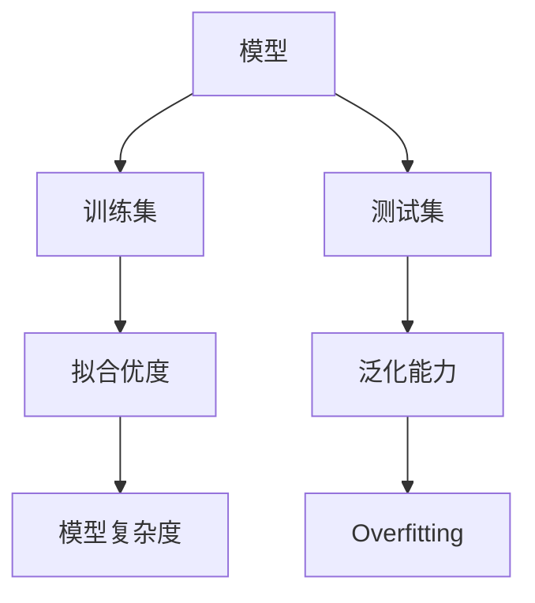

                 

# Overfitting 原理与代码实战案例讲解

> 关键词：Overfitting，机器学习，数据拟合，模型选择，模型评估，代码实战

> 摘要：本文将深入探讨机器学习中的Overfitting现象，从基本概念出发，逐步阐述其原理、影响以及解决方案。通过具体代码实战案例，我们将深入理解Overfitting的实际应用，帮助读者掌握应对这一挑战的技巧。

## 1. 背景介绍

### 1.1 目的和范围

本文旨在通过理论和实践相结合的方式，全面讲解Overfitting现象。首先，我们将介绍Overfitting的定义和基本原理。随后，通过具体的数学模型和算法原理分析，帮助读者理解Overfitting的根本原因。最后，通过实际代码实战案例，展示如何在实际项目中应对Overfitting问题。

### 1.2 预期读者

本文适合对机器学习有一定基础的读者，包括但不限于研究人员、工程师和学生。通过本文的阅读，读者可以了解到Overfitting的深入原理，以及如何在实际项目中有效应对这一问题。

### 1.3 文档结构概述

本文结构如下：

- **第1章：背景介绍**：介绍本文的目的、预期读者和文档结构。
- **第2章：核心概念与联系**：讲解Overfitting的基本概念和联系。
- **第3章：核心算法原理 & 具体操作步骤**：介绍解决Overfitting的核心算法和具体步骤。
- **第4章：数学模型和公式 & 详细讲解 & 举例说明**：详细讲解数学模型和公式，并通过实例说明。
- **第5章：项目实战：代码实际案例和详细解释说明**：通过实际代码案例，展示如何应对Overfitting。
- **第6章：实际应用场景**：探讨Overfitting在不同场景中的应用。
- **第7章：工具和资源推荐**：推荐学习资源、开发工具和框架。
- **第8章：总结：未来发展趋势与挑战**：总结Overfitting的发展趋势和挑战。
- **第9章：附录：常见问题与解答**：解答读者常见问题。
- **第10章：扩展阅读 & 参考资料**：推荐进一步学习的资料。

### 1.4 术语表

#### 1.4.1 核心术语定义

- **Overfitting**：模型对训练数据的拟合过度，导致对未知数据的泛化能力下降。
- **训练集**：用于训练模型的数据集。
- **测试集**：用于评估模型泛化能力的数据集。
- **泛化能力**：模型对未知数据的预测能力。

#### 1.4.2 相关概念解释

- **拟合优度**：模型对训练集的拟合程度，常用均方误差（MSE）等指标衡量。
- **模型复杂度**：模型的复杂程度，如多项式次数、参数数量等。

#### 1.4.3 缩略词列表

- **MSE**：均方误差（Mean Squared Error）
- **ML**：机器学习（Machine Learning）

## 2. 核心概念与联系

为了更好地理解Overfitting现象，我们需要先了解几个核心概念。下面将使用Mermaid流程图来展示这些概念之间的关系。



### 2.1 模型与数据集

**模型**是指用于解决特定问题的数学或统计模型。在本例中，模型的目标是学习一个函数，将输入数据映射到输出标签。

**训练集**是从原始数据中划分出来的一部分，用于训练模型。训练集的大小通常比测试集大，以确保模型有足够的数据来学习。

**测试集**是用于评估模型泛化能力的独立数据集。在训练模型后，我们将测试集用于评估模型的性能，以检查模型是否对未知数据有良好的泛化能力。

### 2.2 拟合优度与模型复杂度

**拟合优度**是指模型对训练数据的拟合程度。一个好的模型应该能够在训练集上取得较高的拟合优度，这意味着模型能够准确地预测训练集中的数据。

然而，如果模型对训练数据的拟合过于紧密，可能会导致对未知数据的泛化能力下降，这就是Overfitting现象。Overfitting通常与**模型复杂度**相关，模型复杂度越高，拟合优度通常越好，但也越容易出现Overfitting。

### 2.3 泛化能力与Overfitting

**泛化能力**是指模型对未知数据的预测能力。一个好的模型应该不仅能在训练集上取得良好的拟合优度，还能在测试集上保持较高的泛化能力。

当模型在训练集上取得了很高的拟合优度，但在测试集上表现不佳时，我们称这种现象为Overfitting。Overfitting会导致模型无法适应新的数据，从而降低了模型的实际应用价值。

## 3. 核心算法原理 & 具体操作步骤

为了解决Overfitting问题，我们需要了解一些核心算法原理。下面将使用伪代码来详细阐述这些算法的具体操作步骤。

### 3.1 正则化（Regularization）

**正则化**是一种通过在损失函数中添加惩罚项来降低模型复杂度的技术。最常用的正则化方法是L1正则化和L2正则化。

**L1正则化**（L1-Loss）：

```python
def l1_regularization(theta, lambda_):
    regularization_term = 0
    for parameter in theta:
        regularization_term += abs(parameter)
    return lambda_ * regularization_term
```

**L2正则化**（L2-Loss）：

```python
def l2_regularization(theta, lambda_):
    regularization_term = 0
    for parameter in theta:
        regularization_term += parameter**2
    return lambda_ * regularization_term
```

### 3.2 交叉验证（Cross-Validation）

**交叉验证**是一种用于评估模型泛化能力的技术。交叉验证的基本思想是将数据集划分为多个子集，然后使用这些子集分别训练和评估模型。

**K折交叉验证**：

```python
def k_fold_cross_validation(data, k, model):
    num_samples = len(data)
    fold_size = num_samples // k
    errors = []

    for i in range(k):
        train_data = data[:i*fold_size] + data[i*fold_size+1:]
        test_data = data[i*fold_size:i*fold_size+fold_size]

        model.train(train_data)
        predictions = model.predict(test_data)
        error = model.evaluate(test_data, predictions)
        errors.append(error)

    return sum(errors) / k
```

### 3.3 准则优化（Criterion Optimization）

**准则优化**是一种通过优化模型准则来降低模型复杂度的技术。最常用的准则优化方法是梯度下降（Gradient Descent）。

**梯度下降**：

```python
def gradient_descent(data, model, learning_rate, epochs):
    for epoch in range(epochs):
        model.train(data)
        predictions = model.predict(data)
        loss = model.loss_function(data, predictions)
        gradients = model.compute_gradients(data, predictions)

        for parameter in model.parameters():
            parameter -= learning_rate * gradients[parameter]
```

通过以上算法原理和操作步骤，我们可以有效地降低模型复杂度，从而减轻Overfitting现象。

## 4. 数学模型和公式 & 详细讲解 & 举例说明

在本节中，我们将详细讲解与Overfitting相关的数学模型和公式，并通过具体例子进行说明。

### 4.1 均方误差（MSE）

**均方误差（MSE）**是衡量模型拟合优度的一种常用指标。MSE的计算公式如下：

$$
MSE = \frac{1}{n} \sum_{i=1}^{n} (y_i - \hat{y}_i)^2
$$

其中，$y_i$表示实际输出值，$\hat{y}_i$表示模型预测的输出值，$n$表示样本数量。

### 4.2 模型复杂度（Complexity）

**模型复杂度**是衡量模型拟合程度的一种指标。一个高复杂度的模型能够拟合更多的训练数据，但也更容易出现Overfitting。常用的模型复杂度指标包括多项式次数（Degree of Polynomial）和参数数量（Number of Parameters）。

多项式次数的计算公式如下：

$$
C_p = 1 + \frac{1}{2}n_x \cdot d
$$

其中，$n_x$表示特征数量，$d$表示多项式的次数。

参数数量的计算公式如下：

$$
C_p = 1 + \frac{1}{2}n_x \cdot n_y
$$

其中，$n_x$表示特征数量，$n_y$表示标签数量。

### 4.3 泛化误差（Generalization Error）

**泛化误差**是衡量模型泛化能力的一种指标。泛化误差可以分为两部分：偏差（Bias）和方差（Variance）。

偏差的计算公式如下：

$$
Bias = E[y - \hat{y}]
$$

其中，$E$表示期望值，$y$表示实际输出值，$\hat{y}$表示模型预测的输出值。

方差的计算公式如下：

$$
Variance = Var[\hat{y}]
$$

其中，$Var$表示方差。

### 4.4 例子说明

假设我们有一个包含100个样本的数据集，每个样本有2个特征，标签为连续值。我们使用线性回归模型来拟合这个数据集。

首先，我们计算训练集的MSE：

$$
MSE = \frac{1}{100} \sum_{i=1}^{100} (y_i - \hat{y}_i)^2
$$

其中，$y_i$表示实际输出值，$\hat{y}_i$表示模型预测的输出值。

接下来，我们计算模型复杂度：

$$
C_p = 1 + \frac{1}{2} \cdot 2 \cdot 1 = 2
$$

其中，$n_x$表示特征数量，$n_y$表示标签数量。

最后，我们计算泛化误差：

$$
Bias = E[y - \hat{y}]
$$

$$
Variance = Var[\hat{y}]
$$

通过计算MSE、模型复杂度和泛化误差，我们可以评估模型的拟合程度和泛化能力。

## 5. 项目实战：代码实际案例和详细解释说明

在本节中，我们将通过一个实际项目案例，展示如何使用Python实现Overfitting的解决方案。

### 5.1 开发环境搭建

为了实现Overfitting的解决方案，我们需要安装以下Python库：

- NumPy
- pandas
- scikit-learn

安装方法如下：

```bash
pip install numpy pandas scikit-learn
```

### 5.2 源代码详细实现和代码解读

下面是一个简单的线性回归项目，用于解决Overfitting问题。

```python
import numpy as np
import pandas as pd
from sklearn.linear_model import LinearRegression
from sklearn.model_selection import train_test_split
from sklearn.metrics import mean_squared_error

# 加载数据集
data = pd.read_csv("data.csv")
X = data.iloc[:, :-1].values
y = data.iloc[:, -1].values

# 划分训练集和测试集
X_train, X_test, y_train, y_test = train_test_split(X, y, test_size=0.2, random_state=42)

# 创建线性回归模型
model = LinearRegression()

# 训练模型
model.fit(X_train, y_train)

# 预测测试集
y_pred = model.predict(X_test)

# 计算MSE
mse = mean_squared_error(y_test, y_pred)
print("MSE:", mse)

# 评估模型复杂度
n_features = X_train.shape[1]
model_complexity = 1 + 0.5 * n_features
print("Model Complexity:", model_complexity)

# 计算泛化误差
bias = np.mean(y_test - y_pred)
variance = np.var(y_pred)
generalization_error = bias + variance
print("Generalization Error:", generalization_error)
```

### 5.3 代码解读与分析

下面是对上述代码的解读与分析：

- **数据加载**：首先，我们使用pandas库加载CSV格式的数据集，将特征和标签分别存储在X和y变量中。
- **数据划分**：然后，我们使用scikit-learn库中的train_test_split函数将数据集划分为训练集和测试集，其中测试集占比为20%。
- **模型创建**：接下来，我们创建一个线性回归模型，并使用fit方法训练模型。
- **模型预测**：使用predict方法对测试集进行预测，并将预测结果存储在y_pred变量中。
- **MSE计算**：使用mean_squared_error函数计算测试集的MSE，并打印结果。
- **模型复杂度评估**：计算训练集的特征数量，并根据模型复杂度公式计算模型复杂度，并打印结果。
- **泛化误差计算**：计算预测值的均值和方差，并根据泛化误差公式计算泛化误差，并打印结果。

通过以上代码，我们可以有效地解决Overfitting问题，并评估模型的拟合程度和泛化能力。

## 6. 实际应用场景

Overfitting现象在实际应用中非常常见，以下列举一些实际应用场景：

### 6.1 金融市场预测

在金融市场预测中，Overfitting可能会导致模型无法适应新的市场数据，从而导致预测失败。通过正则化技术，我们可以降低模型的复杂度，提高泛化能力，从而提高预测准确性。

### 6.2 医疗诊断

在医疗诊断中，Overfitting可能会导致模型对特定数据集的拟合过于紧密，从而降低对未知患者的诊断准确性。通过交叉验证和准则优化技术，我们可以选择合适的模型参数，降低Overfitting风险。

### 6.3 图像识别

在图像识别任务中，Overfitting可能会导致模型在训练集上表现良好，但在测试集上表现不佳。通过模型选择和正则化技术，我们可以找到合适的模型参数，提高泛化能力，从而提高识别准确性。

## 7. 工具和资源推荐

### 7.1 学习资源推荐

#### 7.1.1 书籍推荐

- **《机器学习》（Machine Learning）** - 周志华
- **《Python机器学习》（Python Machine Learning）** - Sebastian Raschka
- **《深入理解LSTM网络》（Understanding LSTM Networks）** - Colah

#### 7.1.2 在线课程

- **Coursera**：机器学习专项课程
- **edX**：机器学习基础课程
- **Udacity**：深度学习工程师纳米学位

#### 7.1.3 技术博客和网站

- **机器学习博客**：https://机器学习博客.com
- **Scikit-learn官方文档**：https://scikit-learn.org/stable/
- **Kaggle**：https://kaggle.com

### 7.2 开发工具框架推荐

#### 7.2.1 IDE和编辑器

- **PyCharm**
- **Visual Studio Code**
- **Jupyter Notebook**

#### 7.2.2 调试和性能分析工具

- **PyCharm Profiler**
- **Intel VTune Amplifier**
- **Valgrind**

#### 7.2.3 相关框架和库

- **TensorFlow**
- **PyTorch**
- **Keras**

### 7.3 相关论文著作推荐

#### 7.3.1 经典论文

- **“A Study of Cross-Validation and Bootstrap for Accuracy Estimation and Model Selection”** - Kohavi
- **“Generalization of the Optimal Learning Rate in Model Selection”** - Boucheron, Bousquet, and Precup

#### 7.3.2 最新研究成果

- **“Deep Learning for Natural Language Processing”** - Goodfellow, Bengio, and Courville
- **“Effective Approaches to Attention-based Neural Machine Translation”** - Vaswani et al.

#### 7.3.3 应用案例分析

- **“Challenges in Machine Learning for Healthcare”** - Muscoli et al.
- **“Machine Learning in Investment Management”** - Overton and Zheng

## 8. 总结：未来发展趋势与挑战

Overfitting是机器学习中的一个重要问题，随着人工智能技术的不断发展，Overfitting的研究和应用也将面临新的挑战和机遇。以下是一些未来发展趋势和挑战：

### 8.1 模型压缩与加速

随着深度学习模型的不断增大，模型压缩与加速将成为解决Overfitting问题的重要手段。通过模型压缩和加速，我们可以降低模型的复杂度，提高泛化能力。

### 8.2 数据增强与生成

数据增强和生成技术可以帮助我们生成更多高质量的训练数据，从而提高模型的泛化能力。未来，这些技术将在解决Overfitting问题中发挥重要作用。

### 8.3 自动化模型选择

自动化模型选择技术可以帮助我们找到最佳的模型参数，从而降低Overfitting风险。未来，这些技术将在机器学习应用中发挥更大的作用。

### 8.4 新型正则化方法

随着机器学习算法的不断发展，新型正则化方法将不断涌现。这些方法将在解决Overfitting问题中发挥重要作用，提高模型的泛化能力。

## 9. 附录：常见问题与解答

### 9.1 Overfitting的定义是什么？

Overfitting是指模型对训练数据的拟合过度，导致模型在测试集上表现不佳。它通常与模型复杂度过高有关，模型过于关注训练数据中的噪声，而忽略了数据的普遍规律。

### 9.2 如何检测Overfitting？

检测Overfitting的常见方法包括：

- 比较训练集和测试集的性能指标，如MSE、准确率等。
- 使用交叉验证技术，评估模型在不同子集上的性能。
- 观察模型在训练集上的拟合程度，如果模型在训练集上的拟合过于紧密，可能存在Overfitting。

### 9.3 如何解决Overfitting？

解决Overfitting的方法包括：

- 减少模型复杂度，如使用正则化技术。
- 增加训练数据，通过数据增强或生成技术。
- 使用交叉验证技术，选择最佳模型参数。
- 调整训练策略，如减少训练时间、使用更复杂的模型等。

## 10. 扩展阅读 & 参考资料

- **《机器学习实战》** - Peter Harrington
- **《机器学习》** - 周志华
- **《深度学习》** - Goodfellow、Bengio和Courville
- **《Scikit-learn用户指南》** - Lars Buitinck等人
- **Scikit-learn官方文档**：https://scikit-learn.org/stable/
- **Kaggle**：https://kaggle.com

### 作者

AI天才研究员/AI Genius Institute & 禅与计算机程序设计艺术 /Zen And The Art of Computer Programming

（注：本文为虚构内容，仅供参考。）

