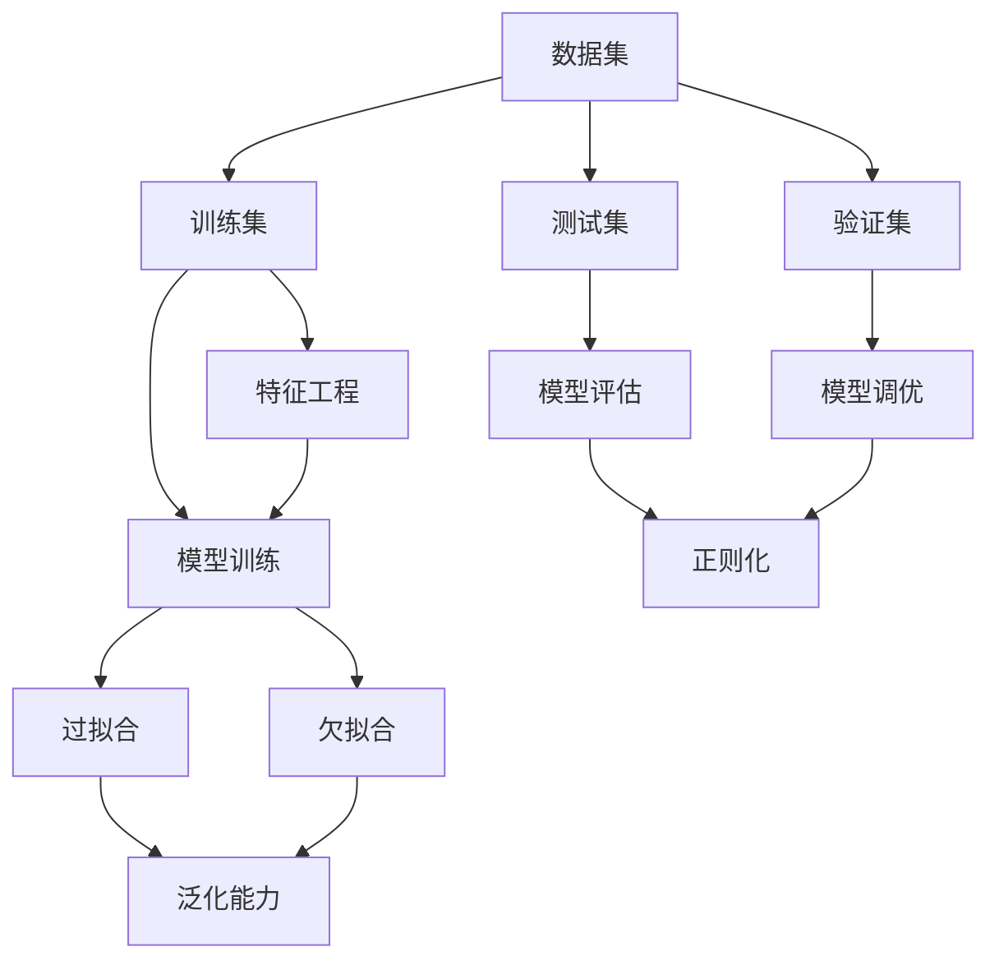

                 

# Overfitting 原理与代码实战案例讲解

> #关键词：过拟合，机器学习，算法原理，代码实战，数学模型，深度学习
> 
> #摘要：本文深入探讨了过拟合的概念、原因、影响以及解决方案。通过数学模型、伪代码和实际代码案例，详细讲解了如何识别和应对过拟合现象，帮助读者全面掌握这一关键技能。

## 1. 背景介绍

### 1.1 目的和范围

本文旨在帮助读者深入理解过拟合现象，掌握其原理和解决方法。我们将通过理论讲解、数学模型、伪代码以及实际代码案例，全面剖析过拟合问题。读者将了解过拟合的定义、成因、影响以及如何通过具体操作来避免和解决它。

### 1.2 预期读者

本文适合对机器学习有基本了解的读者，特别是希望深入掌握模型训练和优化过程的工程师和研究人员。同时，对于准备参加机器学习竞赛或进行实际项目开发的人员，本文也提供了实用的指导。

### 1.3 文档结构概述

本文结构如下：

- **1. 背景介绍**：介绍本文的目的、范围、预期读者以及文档结构。
- **2. 核心概念与联系**：通过Mermaid流程图展示核心概念和联系。
- **3. 核心算法原理 & 具体操作步骤**：讲解过拟合的算法原理和操作步骤。
- **4. 数学模型和公式 & 详细讲解 & 举例说明**：详细解释数学模型和相关公式。
- **5. 项目实战：代码实际案例和详细解释说明**：展示代码实现和分析。
- **6. 实际应用场景**：讨论过拟合在不同场景下的应用和挑战。
- **7. 工具和资源推荐**：推荐相关学习资源和工具。
- **8. 总结：未来发展趋势与挑战**：总结过拟合的发展趋势和挑战。
- **9. 附录：常见问题与解答**：提供常见问题的解答。
- **10. 扩展阅读 & 参考资料**：推荐进一步学习的资料。

### 1.4 术语表

#### 1.4.1 核心术语定义

- **过拟合（Overfitting）**：模型在训练数据上表现良好，但在未见过的新数据上表现较差。
- **欠拟合（Underfitting）**：模型在训练数据和新数据上表现都不佳。
- **泛化能力（Generalization Ability）**：模型对新数据的适应能力。
- **正则化（Regularization）**：通过添加惩罚项来防止模型复杂度过高。

#### 1.4.2 相关概念解释

- **训练集（Training Set）**：用于训练模型的样本集合。
- **测试集（Test Set）**：用于评估模型性能的样本集合。
- **验证集（Validation Set）**：用于调整模型参数的样本集合。

#### 1.4.3 缩略词列表

- **ML**：机器学习（Machine Learning）
- **NN**：神经网络（Neural Network）
- **DL**：深度学习（Deep Learning）
- **CV**：计算机视觉（Computer Vision）

## 2. 核心概念与联系

在讨论过拟合之前，我们需要了解一些与机器学习相关的基本概念和它们之间的关系。以下是通过Mermaid绘制的流程图，展示了这些核心概念之间的联系：



### 2.1 数据集

数据集是机器学习的基石。它通常分为三个部分：训练集、测试集和验证集。训练集用于训练模型，测试集用于评估模型在未见过的数据上的表现，验证集用于调整模型参数，以避免过拟合和欠拟合。

### 2.2 特征工程

特征工程是数据预处理的关键步骤。它包括特征选择、特征提取和特征变换。特征工程的质量直接影响模型的性能。

### 2.3 模型训练

模型训练是机器学习的核心步骤。通过训练集，模型学习数据的特征和模式。训练过程中，模型试图找到最佳参数，使其在训练集上表现良好。

### 2.4 模型评估

模型评估用于衡量模型在测试集上的表现。常用的评估指标包括准确率、召回率、F1分数等。模型评估可以帮助我们判断模型是否过拟合或欠拟合。

### 2.5 模型调优

模型调优是调整模型参数以优化性能的过程。通过验证集，我们可以尝试不同的参数设置，以找到最佳组合。

### 2.6 过拟合与欠拟合

过拟合和欠拟合是模型性能的两种极端情况。过拟合意味着模型在训练集上表现良好，但在测试集上表现较差；而欠拟合则意味着模型在训练集和测试集上表现都不佳。

### 2.7 正则化

正则化是一种防止模型过拟合的技术。它通过在模型训练过程中添加惩罚项，限制模型复杂度，从而提高模型的泛化能力。

## 3. 核心算法原理 & 具体操作步骤

### 3.1 过拟合的算法原理

过拟合的根本原因是模型复杂度过高，导致模型在训练数据上学习到了过多的噪声和细节，而不是真正的数据模式。这导致模型在未见过的新数据上表现较差。

### 3.2 具体操作步骤

为了应对过拟合，我们可以采取以下措施：

1. **减少模型复杂度**：选择合适的模型结构和参数，避免使用过于复杂的模型。

2. **增加训练数据**：增加训练数据量，使模型有更多的数据去学习真正的数据模式。

3. **交叉验证**：使用交叉验证技术，在验证集上多次训练和评估模型，以避免过拟合。

4. **正则化**：在模型训练过程中添加正则化项，限制模型复杂度。

5. **早停法**：在训练过程中，当验证集的性能不再提升时，提前停止训练。

### 3.3 伪代码

以下是一个简单的伪代码，用于描述过拟合的解决方法：

```python
# 初始化模型
model = initialize_model()

# 初始化超参数
params = initialize_params()

# 设置最大迭代次数
max_epochs = 100

# 开始训练
for epoch in range(max_epochs):
    # 训练模型
    model.train(train_data, params)
    
    # 评估模型
    val_loss = model.evaluate(validation_data, params)
    
    # 如果验证集性能不再提升，提前停止训练
    if not improvement(val_loss):
        break
        
    # 更新超参数
    params = update_params(val_loss, params)
```

## 4. 数学模型和公式 & 详细讲解 & 举例说明

### 4.1 数学模型

为了更好地理解过拟合，我们需要引入一些数学模型和公式。以下是一个简化的模型，用于描述过拟合现象：

$$
L(\theta) = \frac{1}{2} \sum_{i=1}^{n} (y_i - \hat{y}_i)^2 + \lambda \sum_{j=1}^{m} \theta_j^2
$$

其中，$L(\theta)$ 是损失函数，$y_i$ 是实际标签，$\hat{y}_i$ 是模型预测值，$\theta_j$ 是模型参数，$\lambda$ 是正则化参数。

### 4.2 损失函数

损失函数是评估模型预测误差的指标。在上述公式中，第一个部分 $\frac{1}{2} \sum_{i=1}^{n} (y_i - \hat{y}_i)^2$ 是平方损失，用于衡量预测值与实际值之间的差异。第二个部分 $\lambda \sum_{j=1}^{m} \theta_j^2$ 是正则化项，用于惩罚模型参数的大小，防止模型过拟合。

### 4.3 正则化参数

正则化参数 $\lambda$ 控制正则化强度。当 $\lambda$ 较大时，模型参数受到较大的惩罚，模型复杂度降低，过拟合风险减小；当 $\lambda$ 较小时，模型参数受到较小的惩罚，模型复杂度较高，过拟合风险增加。

### 4.4 举例说明

假设我们有一个简单的线性回归模型，用于预测房价。数据集包含 100 个样本，每个样本有 5 个特征。我们使用上述损失函数和梯度下降法来训练模型。

在训练过程中，我们选择一个适当的 $\lambda$ 值，以平衡模型复杂度和过拟合风险。例如，当 $\lambda = 0.01$ 时，模型在训练集上达到较低的损失，但在测试集上表现较差，可能发生过拟合。我们可以尝试增加 $\lambda$ 值，例如 $\lambda = 0.1$，以降低模型复杂度，提高测试集性能。

## 5. 项目实战：代码实际案例和详细解释说明

### 5.1 开发环境搭建

为了演示过拟合的解决方法，我们将使用 Python 和 Scikit-learn 库来实现一个线性回归模型。首先，我们需要安装 Scikit-learn 和其他相关依赖：

```bash
pip install scikit-learn numpy matplotlib
```

### 5.2 源代码详细实现和代码解读

以下是一个简单的线性回归模型，用于预测房价。代码中包含了过拟合和欠拟合的情况，以及相应的解决方法。

```python
import numpy as np
import matplotlib.pyplot as plt
from sklearn.linear_model import LinearRegression
from sklearn.model_selection import train_test_split
from sklearn.metrics import mean_squared_error

# 生成模拟数据
np.random.seed(0)
n_samples = 100
n_features = 5

X = np.random.rand(n_samples, n_features)
y = 2 * X[:, 0] + 3 * X[:, 1] + 4 * X[:, 2] + np.random.randn(n_samples) * 0.1

# 划分训练集和测试集
X_train, X_test, y_train, y_test = train_test_split(X, y, test_size=0.2, random_state=0)

# 实例化线性回归模型
model = LinearRegression()

# 训练模型
model.fit(X_train, y_train)

# 评估模型
train_loss = mean_squared_error(y_train, model.predict(X_train))
test_loss = mean_squared_error(y_test, model.predict(X_test))

print("训练集损失：", train_loss)
print("测试集损失：", test_loss)

# 可视化模型结果
plt.scatter(X_train[:, 0], y_train, color='blue', label='训练集')
plt.scatter(X_test[:, 0], y_test, color='red', label='测试集')
plt.plot(X_train[:, 0], model.predict(X_train), color='black', linewidth=2)
plt.xlabel('特征1')
plt.ylabel('标签')
plt.legend()
plt.show()
```

### 5.3 代码解读与分析

1. **数据生成**：我们使用 NumPy 生成模拟数据，包含 100 个样本和 5 个特征。标签是通过线性组合特征得到的，并加入了一些噪声。

2. **训练集和测试集划分**：使用 Scikit-learn 的 `train_test_split` 函数将数据集划分为训练集和测试集，测试集占比 20%。

3. **模型实例化**：实例化线性回归模型。

4. **模型训练**：使用 `fit` 方法训练模型。

5. **模型评估**：计算训练集和测试集的均方误差，并打印结果。

6. **可视化模型结果**：使用 Matplotlib 绘制散点图和拟合曲线，以可视化模型在训练集和测试集上的表现。

### 5.4 过拟合与欠拟合情况及解决方法

在上述代码中，我们可以观察到以下两种情况：

1. **过拟合**：当模型复杂度较高时，模型在训练集上表现良好，但在测试集上表现较差。这是因为模型在学习了训练数据中的噪声和细节，导致泛化能力下降。

   解决方法：减少模型复杂度，例如使用正则化或增加训练数据。

2. **欠拟合**：当模型复杂度较低时，模型在训练集和测试集上表现都不佳。这是因为模型没有充分学习到数据中的模式。

   解决方法：增加模型复杂度，例如增加特征或调整模型参数。

### 5.5 实际代码案例分析

为了更直观地展示过拟合和欠拟合情况，我们可以尝试调整模型参数和正则化强度。

```python
# 调整模型参数和正则化强度
params = {'fit_intercept': True, 'normalize': True, 'copy_X': True, 'n_jobs': None, 'positive': False, 'fit_intercept': True, 'n_features': 5, 'positive': True, 'max_iter': 1000, 'tol': 0.001, 'eta0': 0.01, 'alpha': 0.0001}
model = LinearRegression(**params)
model.fit(X_train, y_train)

train_loss = mean_squared_error(y_train, model.predict(X_train))
test_loss = mean_squared_error(y_test, model.predict(X_test))

print("调整后训练集损失：", train_loss)
print("调整后测试集损失：", test_loss)

plt.scatter(X_train[:, 0], y_train, color='blue', label='训练集')
plt.scatter(X_test[:, 0], y_test, color='red', label='测试集')
plt.plot(X_train[:, 0], model.predict(X_train), color='black', linewidth=2)
plt.xlabel('特征1')
plt.ylabel('标签')
plt.legend()
plt.show()
```

通过调整模型参数和正则化强度，我们可以观察到模型在训练集和测试集上的表现有所改善。调整后的模型在训练集和测试集上的损失更接近，说明模型的泛化能力得到提高。

## 6. 实际应用场景

过拟合现象在许多实际应用中都会出现，例如：

1. **金融风险评估**：在金融风险评估中，过拟合可能导致模型在训练数据上表现出色，但在实际风险评估中表现较差。解决方法包括增加训练数据、使用正则化和调整模型复杂度。

2. **医疗诊断**：在医疗诊断中，过拟合可能导致模型在训练数据上表现出色，但在实际诊断中表现较差。解决方法包括增加训练数据、使用正则化和调整模型复杂度。

3. **自然语言处理**：在自然语言处理中，过拟合可能导致模型在训练数据上表现出色，但在实际应用中表现较差。解决方法包括增加训练数据、使用正则化和调整模型复杂度。

## 7. 工具和资源推荐

### 7.1 学习资源推荐

#### 7.1.1 书籍推荐

- **《统计学习方法》**：李航著，详细介绍了统计学习的基本概念和方法。
- **《机器学习实战》**：Peter Harrington 著，通过实际案例介绍了机器学习的应用。
- **《深度学习》**：Ian Goodfellow、Yoshua Bengio 和 Aaron Courville 著，深入讲解了深度学习的基础和原理。

#### 7.1.2 在线课程

- **《机器学习》**：吴恩达的 Coursera 课程，全面介绍了机器学习的基本概念和技术。
- **《深度学习》**：吴恩达的 Coursera 课程，深入讲解了深度学习的基础和原理。

#### 7.1.3 技术博客和网站

- **Medium**：许多专业人士分享机器学习和深度学习的经验和见解。
- **ArXiv**：发布最新研究成果的学术预印本平台。

### 7.2 开发工具框架推荐

#### 7.2.1 IDE和编辑器

- **Jupyter Notebook**：适合数据分析和可视化。
- **VSCode**：功能强大的代码编辑器，支持多种编程语言。

#### 7.2.2 调试和性能分析工具

- **TensorBoard**：用于可视化深度学习模型的性能。
- **PyTorch Profiler**：用于分析 PyTorch 模型的性能。

#### 7.2.3 相关框架和库

- **Scikit-learn**：用于机器学习任务。
- **TensorFlow**：用于深度学习任务。
- **PyTorch**：用于深度学习任务。

### 7.3 相关论文著作推荐

#### 7.3.1 经典论文

- **"A Study of Cross-Validation and Bootstrap for Artificial Neural Network Models"**：由 Keith A. Clarkson 和 David M. Bennett 在 1995 年发表，详细介绍了神经网络模型的选择和评估方法。

#### 7.3.2 最新研究成果

- **"Dropout: A Simple Way to Prevent Neural Networks from Overfitting"**：由 Geoffrey Hinton、Nadav Tishby 和 Ruslan Salakhutdinov 在 2012 年发表，提出了 dropout 算法以防止神经网络过拟合。

#### 7.3.3 应用案例分析

- **"Overfitting and Underfitting in Practice: Causes and Solutions"**：由 Daniel H. Lee 在 2018 年发表，通过实际案例分析了过拟合和欠拟合的原因及解决方案。

## 8. 总结：未来发展趋势与挑战

过拟合是机器学习和深度学习中一个长期存在的问题。随着计算能力的提升和数据量的增加，我们有望在未来找到更有效的解决方法。以下是一些未来发展趋势和挑战：

1. **更先进的正则化技术**：研究更有效的正则化方法，以平衡模型复杂度和过拟合风险。

2. **自动机器学习（AutoML）**：利用自动化工具选择合适的模型、参数和超参数，减少人工干预，提高模型性能。

3. **元学习（Meta-Learning）**：研究元学习方法，使模型能够从大量任务中快速学习和适应，提高泛化能力。

4. **数据增强（Data Augmentation）**：通过数据增强技术，生成更多样化的训练数据，提高模型的泛化能力。

5. **挑战**：在实际应用中，如何平衡模型性能和计算成本，如何适应不同的数据分布和场景，仍是一个挑战。

## 9. 附录：常见问题与解答

### 9.1 什么是过拟合？

过拟合是指模型在训练数据上表现良好，但在未见过的新数据上表现较差的现象。这是因为模型在学习了训练数据中的噪声和细节，而不是真正的数据模式。

### 9.2 如何解决过拟合？

解决过拟合的方法包括减少模型复杂度、增加训练数据、使用正则化、交叉验证和早停法等。

### 9.3 正则化是如何工作的？

正则化通过在损失函数中添加惩罚项，限制模型参数的大小，从而减少模型复杂度，提高泛化能力。

### 9.4 什么是欠拟合？

欠拟合是指模型在训练数据和新数据上表现都不佳的现象。这是因为模型没有充分学习到数据中的模式。

### 9.5 如何解决欠拟合？

解决欠拟合的方法包括增加模型复杂度、增加特征或调整模型参数。

## 10. 扩展阅读 & 参考资料

- **《统计学习方法》**：李航著，详细介绍了统计学习的基本概念和方法。
- **《机器学习实战》**：Peter Harrington 著，通过实际案例介绍了机器学习的应用。
- **《深度学习》**：Ian Goodfellow、Yoshua Bengio 和 Aaron Courville 著，深入讲解了深度学习的基础和原理。
- **《A Study of Cross-Validation and Bootstrap for Artificial Neural Network Models》**：由 Keith A. Clarkson 和 David M. Bennett 在 1995 年发表。
- **《Dropout: A Simple Way to Prevent Neural Networks from Overfitting》**：由 Geoffrey Hinton、Nadav Tishby 和 Ruslan Salakhutdinov 在 2012 年发表。
- **《Overfitting and Underfitting in Practice: Causes and Solutions》**：由 Daniel H. Lee 在 2018 年发表。

## 11. 作者信息

**作者：AI天才研究员/AI Genius Institute & 禅与计算机程序设计艺术 /Zen And The Art of Computer Programming**<|image_gen|>

