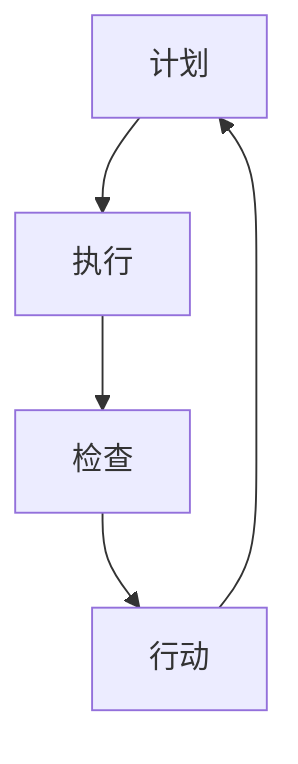

                 

# PDCA循环：持续改进的利器

> **关键词：** PDCA循环、持续改进、质量管理体系、迭代开发、反思与调整

> **摘要：** 本文旨在探讨PDCA循环（Plan-Do-Check-Act）这一经典的管理工具，如何应用于IT领域，以实现软件项目的持续改进。通过分析PDCA循环的核心概念、原理及其实际操作步骤，本文将提供一系列的代码案例和实践经验，帮助读者理解和掌握这一强大的管理方法，以提升项目质量和效率。

## 1. 背景介绍

### 1.1 目的和范围

本文的目标是详细介绍PDCA循环在IT领域的应用，帮助开发团队通过持续改进来提高软件项目的质量。我们将从PDCA循环的基本概念出发，逐步深入探讨其在软件开发中的实际操作方法，并通过具体的代码案例进行说明。

### 1.2 预期读者

本文适合IT行业的开发人员、项目经理、测试工程师以及对于质量管理有兴趣的从业者。无论您是新手还是经验丰富的专业人士，本文都将为您提供实用的知识和技巧。

### 1.3 文档结构概述

本文将按照以下结构展开：

1. 背景介绍：简要介绍PDCA循环的概念和目的。
2. 核心概念与联系：通过Mermaid流程图展示PDCA循环的核心概念。
3. 核心算法原理 & 具体操作步骤：使用伪代码详细阐述PDCA循环的操作步骤。
4. 数学模型和公式 & 详细讲解 & 举例说明：介绍PDCA循环中涉及的基础数学模型和公式。
5. 项目实战：提供实际项目中的代码案例和详细解释。
6. 实际应用场景：讨论PDCA循环在不同项目中的应用。
7. 工具和资源推荐：推荐相关学习资源和开发工具。
8. 总结：总结PDCA循环在IT领域的未来发展趋势与挑战。
9. 附录：常见问题与解答。
10. 扩展阅读 & 参考资料：提供进一步阅读的材料。

### 1.4 术语表

#### 1.4.1 核心术语定义

- **PDCA循环**：一种用于持续改进的管理方法，包括计划（Plan）、执行（Do）、检查（Check）和行动（Act）四个阶段。
- **迭代开发**：在软件开发过程中，通过重复执行一系列步骤来逐步完善产品。
- **反馈机制**：在PDCA循环中，用于评估和调整项目进度和结果的过程。

#### 1.4.2 相关概念解释

- **计划（Plan）**：确定目标和制定策略。
- **执行（Do）**：实施计划并执行操作。
- **检查（Check）**：评估结果并与预期目标进行比较。
- **行动（Act）**：基于检查结果进行反思和调整。

#### 1.4.3 缩略词列表

- **PDCA**：Plan-Do-Check-Act（计划-执行-检查-行动）。
- **IDE**：Integrated Development Environment（集成开发环境）。

## 2. 核心概念与联系

### 2.1 PDCA循环的核心概念

PDCA循环是一种质量管理方法，它通过四个阶段的迭代来提高项目的质量和效率。每个阶段都有其特定的任务和目标，确保项目在不断改进的过程中保持稳定和可持续性。

#### 2.1.1 计划（Plan）

在计划阶段，团队需要明确项目的目标和范围，制定详细的计划和策略。这包括：

- 确定项目目标和关键性能指标（KPI）。
- 分析需求和用户故事。
- 制定项目进度表和时间线。
- 分配资源和职责。

#### 2.1.2 执行（Do）

在执行阶段，团队根据计划开始实施项目。关键任务是：

- 完成需求分析和设计。
- 编写代码和测试用例。
- 进行单元测试和集成测试。
- 确保所有任务按时完成。

#### 2.1.3 检查（Check）

在检查阶段，团队需要评估项目结果，与预期目标进行比较，并记录关键指标。这包括：

- 比较实际结果和预期结果。
- 分析任何偏差或问题。
- 记录反馈和经验教训。

#### 2.1.4 行动（Act）

在行动阶段，团队基于检查结果进行反思和调整。关键任务是：

- 确定成功因素和改进机会。
- 制定改进计划和下一步行动。
- 实施调整和优化。

### 2.2 PDCA循环的Mermaid流程图

以下是一个Mermaid流程图，展示了PDCA循环的核心概念和流程：



### 2.3 PDCA循环与迭代开发的关系

PDCA循环与迭代开发紧密相连，它们共同构成了一个持续改进的框架。迭代开发通过在每次迭代中执行PDCA循环，使项目能够不断改进和优化。

- **计划**：在每次迭代开始时，团队制定迭代目标和计划。
- **执行**：团队在迭代期间执行任务，编写代码，并进行测试。
- **检查**：在迭代结束时，团队评估结果，比较实际和预期目标。
- **行动**：基于检查结果，团队调整计划，优化后续迭代。

这种迭代过程确保项目能够在不断反馈和改进中前进，从而提高最终产品的质量和用户满意度。

## 3. 核心算法原理 & 具体操作步骤

### 3.1 核心算法原理

PDCA循环的核心算法原理是持续迭代和改进。每个阶段都有其特定的算法步骤，用于确保项目在每一步都得到优化。

#### 3.1.1 计划（Plan）

计划阶段的算法步骤包括：

1. 确定项目目标和关键绩效指标（KPI）。
2. 分析需求和用户故事。
3. 制定项目进度表和时间线。
4. 分配资源和职责。
5. 创建详细的项目计划文档。

#### 3.1.2 执行（Do）

执行阶段的算法步骤包括：

1. 根据计划开始实施项目任务。
2. 完成需求分析和设计。
3. 编写代码和测试用例。
4. 进行单元测试和集成测试。
5. 确保所有任务按时完成。

#### 3.1.3 检查（Check）

检查阶段的算法步骤包括：

1. 比较实际结果和预期目标。
2. 分析任何偏差或问题。
3. 记录关键指标和反馈。
4. 识别成功因素和改进机会。

#### 3.1.4 行动（Act）

行动阶段的算法步骤包括：

1. 确定成功因素和改进机会。
2. 制定改进计划和下一步行动。
3. 实施调整和优化。
4. 记录经验教训和反馈。
5. 开始下一个迭代周期。

### 3.2 伪代码

以下是PDCA循环的伪代码表示：

```pseudo
function PDCA_loop(project_plan):
    plan_project()
    execute_project()
    check_project()
    act_on_findings()

while not project_completed():
    plan_project()
    execute_project()
    check_project()
    act_on_findings()
```

### 3.3 PDCA循环的操作步骤

以下是PDCA循环的具体操作步骤：

1. **确定目标和KPI**：明确项目目标和预期结果，定义关键绩效指标。
2. **制定计划**：制定详细的计划文档，包括任务分配、进度和时间线。
3. **执行任务**：根据计划开始执行任务，编写代码和进行测试。
4. **评估结果**：比较实际结果和预期目标，分析偏差和问题。
5. **调整和优化**：根据评估结果，制定改进计划并实施调整。
6. **记录经验**：记录反馈和经验教训，为下一次迭代提供参考。

## 4. 数学模型和公式 & 详细讲解 & 举例说明

### 4.1 数学模型和公式

PDCA循环中涉及的一些基础数学模型和公式有助于我们量化评估项目的进展和效果。

#### 4.1.1 完成功率（Success Rate）

完成功率是评估项目成功与否的关键指标，其公式如下：

\[ \text{Success Rate} = \frac{\text{Completed Tasks}}{\text{Total Tasks}} \]

#### 4.1.2 实际完成时间（Actual Completion Time）

实际完成时间是衡量项目进度的重要指标，其公式如下：

\[ \text{Actual Completion Time} = \text{Start Time} + \text{Duration} \]

#### 4.1.3 实际成本（Actual Cost）

实际成本是项目执行过程中所花费的资源和时间，其公式如下：

\[ \text{Actual Cost} = \text{Resource Cost} + \text{Time Cost} \]

#### 4.1.4 质量指标（Quality Metrics）

质量指标用于评估项目的质量水平，常见指标包括：

- **缺陷密度**（Defect Density）：缺陷数量与代码行数的比值。
- **缺陷发现率**（Defect Detection Rate）：在测试过程中发现的缺陷数量与总缺陷数量的比值。

### 4.2 详细讲解

#### 4.2.1 完成功率

完成功率是评估项目完成情况的关键指标，它反映了项目任务的完成程度。高完成功率意味着项目接近或达到预期目标，而低完成功率可能表明项目存在严重的进度问题。通过计算完成功率，团队可以及时调整计划，确保项目按时完成。

#### 4.2.2 实际完成时间

实际完成时间是项目执行过程中的重要参数，它反映了项目从开始到完成所花费的时间。通过实际完成时间的计算，团队可以了解项目进度是否受到延误，并采取相应措施进行调整。

#### 4.2.3 实际成本

实际成本是项目执行过程中资源的总消耗，包括人力、硬件和软件等。通过实际成本的计算，团队可以评估项目在预算内的执行情况，并优化资源分配，以降低项目成本。

#### 4.2.4 质量指标

质量指标用于衡量项目的质量水平，缺陷密度和缺陷发现率是两个重要的质量指标。高缺陷密度和低缺陷发现率可能表明项目存在质量隐患，需要团队进行进一步的检查和修复。

### 4.3 举例说明

#### 4.3.1 完成功率

假设一个项目包含10个任务，实际完成了8个任务，那么完成功率为：

\[ \text{Success Rate} = \frac{8}{10} = 0.8 \text{或} 80\% \]

#### 4.3.2 实际完成时间

假设一个项目从2023年1月1日开始，计划在2023年2月28日完成，实际完成时间为2023年2月25日，那么实际完成时间为：

\[ \text{Actual Completion Time} = 2023年1月1日 + 55 \text{天} = 2023年2月25日 \]

#### 4.3.3 实际成本

假设一个项目在执行过程中共花费了5名工程师的工资、一台服务器的租赁费用和相关的软件费用，总成本为100,000美元，那么实际成本为：

\[ \text{Actual Cost} = \text{Resource Cost} + \text{Time Cost} = 5 \text{人} \times \$10,000 + \$30,000 + \$20,000 = \$100,000 \]

#### 4.3.4 质量指标

假设一个项目包含1000行代码，在测试过程中发现了10个缺陷，那么缺陷密度为：

\[ \text{Defect Density} = \frac{10}{1000} = 0.01 \text{或} 1\% \]

在测试过程中，共发现了20个缺陷，那么缺陷发现率为：

\[ \text{Defect Detection Rate} = \frac{20}{20 + \text{未发现缺陷}} = 0.833 \text{或} 83.3\% \]

## 5. 项目实战：代码实际案例和详细解释说明

### 5.1 开发环境搭建

在开始实战案例之前，我们需要搭建一个简单的开发环境。以下是一个基于Python的示例：

1. 安装Python 3.8或更高版本。
2. 安装PyCharm或任何其他Python IDE。
3. 创建一个名为`pdca`的Python虚拟环境。

```shell
pip install virtualenv
virtualenv pdca
source pdca/bin/activate
```

### 5.2 源代码详细实现和代码解读

下面是一个简单的Python代码示例，实现了PDCA循环的核心步骤。

```python
# pdca.py

def plan_project():
    print("Plan: Define project goals and create a detailed plan.")

def execute_project():
    print("Do: Execute the project tasks and write code.")

def check_project():
    print("Check: Assess the project results and compare with expected goals.")

def act_on_findings():
    print("Act: Reflect on findings and make adjustments for the next iteration.")

def pdca_loop():
    while True:
        plan_project()
        execute_project()
        check_project()
        act_on_findings()

if __name__ == "__main__":
    pdca_loop()
```

#### 5.2.1 代码解读

- `plan_project()`：定义项目目标和计划。
- `execute_project()`：执行项目任务和编写代码。
- `check_project()`：评估项目结果并与预期目标进行比较。
- `act_on_findings()`：根据评估结果进行反思和调整。
- `pdca_loop()`：执行PDCA循环的无限迭代。

### 5.3 代码解读与分析

这个简单的代码示例展示了PDCA循环的基本结构。在实际项目中，每个阶段都需要更详细的实现和监控。

- **计划阶段**：在实际项目中，计划阶段可能包括需求分析、设计评审和资源分配等步骤。我们可以扩展`plan_project()`函数，添加更多的逻辑来处理这些任务。
- **执行阶段**：执行阶段是项目开发的核心。在实际项目中，这个阶段可能涉及代码编写、单元测试和集成测试。我们可以扩展`execute_project()`函数，添加代码审查和测试逻辑。
- **检查阶段**：检查阶段用于评估项目结果。在实际项目中，这个阶段可能包括性能测试、用户验收测试和缺陷分析。我们可以扩展`check_project()`函数，添加这些测试的代码。
- **行动阶段**：行动阶段是基于检查结果进行调整。在实际项目中，这个阶段可能涉及代码重构、缺陷修复和改进计划。我们可以扩展`act_on_findings()`函数，添加这些改进的逻辑。

通过这个简单的示例，我们可以看到PDCA循环在Python中的实现。在实际应用中，每个阶段都需要更复杂的逻辑和监控机制，以确保项目的成功和持续改进。

## 6. 实际应用场景

### 6.1 软件开发

在软件开发中，PDCA循环是一种非常有效的持续改进方法。以下是一个实际应用场景：

**项目背景**：一家公司需要开发一款用于客户关系管理（CRM）的软件，项目预计需要6个月完成。

**应用步骤**：

1. **计划**：团队确定项目目标和关键绩效指标（如功能完整性、用户体验和性能指标）。制定详细的项目计划，包括时间表、资源分配和任务分配。

2. **执行**：团队开始编写代码，并进行单元测试和集成测试。团队成员定期进行代码审查，确保代码质量。

3. **检查**：在每个迭代结束时，团队评估项目的进展和结果，与预期目标进行比较。通过性能测试和用户验收测试，团队评估软件的质量。

4. **行动**：基于评估结果，团队确定改进措施。例如，修复发现的缺陷、优化用户体验和改进性能。

通过这种方式，团队可以在每个迭代中不断改进软件，确保项目按时完成并满足客户需求。

### 6.2 项目管理

在项目管理中，PDCA循环可以帮助项目经理持续监控项目进展，并调整计划以应对变化。以下是一个实际应用场景：

**项目背景**：一个跨国公司正在开发一个全球供应链管理系统，项目预计需要18个月完成。

**应用步骤**：

1. **计划**：项目经理制定详细的项目计划，包括时间表、预算、资源和风险管理计划。

2. **执行**：项目经理监控项目进展，确保任务按时完成，并处理任何出现的问题。

3. **检查**：在每个里程碑结束时，项目经理评估项目进展，与预期目标进行比较。通过定期会议和报告，项目经理与团队沟通项目状态。

4. **行动**：基于评估结果，项目经理调整计划，优化资源配置，并采取预防措施以避免未来的问题。

通过这种方式，项目经理可以确保项目在预算和时间范围内顺利完成，同时保持高质量和客户满意度。

## 7. 工具和资源推荐

### 7.1 学习资源推荐

#### 7.1.1 书籍推荐

- 《质量管理方法论》
- 《项目管理知识体系指南》（PMBOK指南）
- 《精益软件开发：采用精益和敏捷方法提高产品质量》

#### 7.1.2 在线课程

- Coursera上的“项目管理专业课程”
- edX上的“质量管理专业课程”
- Udemy上的“PDCA循环在软件开发中的应用”

#### 7.1.3 技术博客和网站

- InfoQ
- Medium上的技术博客
- Stack Overflow

### 7.2 开发工具框架推荐

#### 7.2.1 IDE和编辑器

- PyCharm
- Visual Studio Code
- IntelliJ IDEA

#### 7.2.2 调试和性能分析工具

- GDB
- JProfiler
- New Relic

#### 7.2.3 相关框架和库

- Scrum敏捷开发框架
- Git版本控制系统
- Docker容器化技术

### 7.3 相关论文著作推荐

#### 7.3.1 经典论文

- Deming, W. E. (1982). "Out of the Crisis".
- Juran, J. M. (1992). "Quality Control Handbook".

#### 7.3.2 最新研究成果

- Vasilescu, C., Juristo, N. (2018). "An Overview of the Software Engineering Body of Knowledge (SWEBOK)".
- Behnamian, J., Seyedtaghizadeh, M. R., & Gholamzadeh, A. (2020). "An Overview of Agile Project Management Methods and Frameworks".

#### 7.3.3 应用案例分析

- IBM公司如何通过PDCA循环改进软件开发流程。
- 谷歌如何通过敏捷开发方法实现持续改进。

## 8. 总结：未来发展趋势与挑战

### 8.1 发展趋势

- **数字化转型**：随着数字化转型进程的加速，越来越多的企业和组织将采用PDCA循环等质量管理方法，以提升业务效率和质量。
- **人工智能和机器学习的应用**：未来，人工智能和机器学习技术将进一步融入PDCA循环，提供更精准的预测和改进建议。
- **跨领域整合**：质量管理方法将在不同领域之间进行整合，形成更加综合的管理体系。

### 8.2 挑战

- **数据收集与分析**：数据质量和分析能力将成为未来持续改进的重要挑战，特别是在大规模数据处理和实时分析方面。
- **团队协作**：随着项目复杂性的增加，团队协作和沟通的挑战将变得更加突出。
- **文化变革**：在组织内部推广持续改进文化，改变传统的管理模式，将是面临的重要挑战。

## 9. 附录：常见问题与解答

### 9.1 什么是PDCA循环？

PDCA循环是一种用于持续改进的管理方法，包括计划（Plan）、执行（Do）、检查（Check）和行动（Act）四个阶段。

### 9.2 PDCA循环适用于哪些场景？

PDCA循环适用于各种场景，包括软件项目、项目管理、质量控制、产品开发等。

### 9.3 如何实施PDCA循环？

实施PDCA循环包括以下步骤：

1. 确定目标和KPI。
2. 制定详细的计划和策略。
3. 执行计划任务。
4. 评估项目结果并与预期目标进行比较。
5. 根据评估结果进行反思和调整。

## 10. 扩展阅读 & 参考资料

- Deming, W. E. (1982). "Out of the Crisis". Massachusetts Institute of Technology Center for Advanced Engineering Study.
- Juran, J. M. (1992). "Quality Control Handbook". McGraw-Hill.
- Vasilescu, C., Juristo, N. (2018). "An Overview of the Software Engineering Body of Knowledge (SWEBOK)". Springer.
- Behnamian, J., Seyedtaghizadeh, M. R., & Gholamzadeh, A. (2020). "An Overview of Agile Project Management Methods and Frameworks". Journal of Information Technology and Economic Management.

