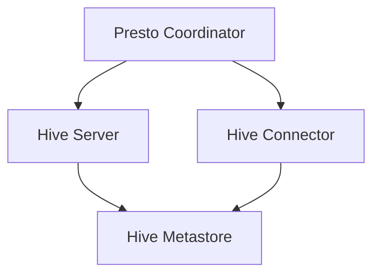

                 

# Presto-Hive整合原理与代码实例讲解

## 概述

> Presto是一种开源分布式计算引擎，主要用于处理大规模数据的快速查询。Hive则是一种基于Hadoop的数据仓库工具，用于在大型数据集上进行数据分析和处理。本文将探讨Presto与Hive整合的原理，并通过实际代码实例，详细解释两者的交互过程及其应用场景。

## 关键词

- **Presto**
- **Hive**
- **分布式计算**
- **数据仓库**
- **Hadoop**
- **查询优化**
- **代码实例**

## 摘要

本文将详细阐述Presto与Hive整合的原理，包括两者的架构及其相互关系。通过具体的代码实例，我们将展示如何使用Presto查询Hive表，并深入分析其查询优化过程。此外，本文还将介绍Presto和Hive在实际应用中的优势，以及如何选择合适的工具以满足不同场景的需求。

<|im_sep|>## 1. 背景介绍

### 1.1 目的和范围

本文旨在详细解释Presto和Hive的整合原理，并通过实际代码实例，展示如何使用Presto来查询Hive表。我们将深入探讨两者的架构和交互机制，并分析其查询优化策略。文章主要涵盖以下内容：

- **Presto与Hive的基本概念和架构**：介绍两者的基本功能和特点，包括其设计理念、数据存储和处理方式。
- **Presto与Hive的整合原理**：分析两者之间的交互机制，包括数据传输、查询优化和错误处理。
- **实际代码实例**：通过具体的代码实例，展示如何使用Presto查询Hive表，并分析其执行过程和优化策略。
- **应用场景与性能分析**：讨论Presto和Hive在实际应用中的优势和局限，以及如何根据需求选择合适的工具。

### 1.2 预期读者

本文主要面向以下读者：

- **大数据开发工程师**：希望了解Presto和Hive的整合原理，掌握如何使用Presto查询Hive表。
- **数据分析师**：需要使用Presto和Hive进行数据分析和处理的从业者。
- **计算机科学家**：对分布式计算和数据仓库技术感兴趣的研究人员。

### 1.3 文档结构概述

本文分为以下章节：

- **第1章 背景介绍**：介绍本文的目的、范围和预期读者，以及文档结构。
- **第2章 核心概念与联系**：阐述Presto和Hive的基本概念和架构，并使用Mermaid流程图展示其相互关系。
- **第3章 核心算法原理 & 具体操作步骤**：详细解释Presto和Hive的查询优化算法和具体操作步骤。
- **第4章 数学模型和公式 & 详细讲解 & 举例说明**：介绍与Presto和Hive相关的数学模型和公式，并进行详细讲解和举例说明。
- **第5章 项目实战：代码实际案例和详细解释说明**：通过实际代码实例，展示Presto和Hive的整合过程，并进行详细解释说明。
- **第6章 实际应用场景**：讨论Presto和Hive在实际应用中的优势、局限和选择策略。
- **第7章 工具和资源推荐**：推荐学习资源、开发工具和框架，以及相关论文著作。
- **第8章 总结：未来发展趋势与挑战**：总结本文内容，探讨Presto和Hive的未来发展趋势和面临的挑战。
- **第9章 附录：常见问题与解答**：列出常见问题并给出解答。
- **第10章 扩展阅读 & 参考资料**：提供与本文主题相关的扩展阅读和参考资料。

### 1.4 术语表

#### 1.4.1 核心术语定义

- **Presto**：一种开源分布式计算引擎，用于处理大规模数据的快速查询。
- **Hive**：一种基于Hadoop的数据仓库工具，用于在大型数据集上进行数据分析和处理。
- **分布式计算**：一种数据处理方式，通过将任务分布在多个计算节点上，提高数据处理效率和性能。
- **数据仓库**：一种用于存储、管理和分析大量数据的系统，提供数据整合和报表生成等功能。
- **Hadoop**：一种分布式数据处理框架，包括HDFS（分布式文件系统）和MapReduce（分布式计算模型）。

#### 1.4.2 相关概念解释

- **查询优化**：一种优化查询性能的方法，通过分析查询计划，选择最佳执行路径，减少查询时间和资源消耗。
- **数据分区**：一种数据组织方式，将数据划分为多个分区，以提高查询性能和并发处理能力。
- **数据倾斜**：一种数据分布不均匀的情况，可能导致查询性能下降和计算资源浪费。

#### 1.4.3 缩略词列表

- **Presto**：PrestoSQL
- **Hive**：Apache Hive
- **分布式计算**：Distributed Computing
- **数据仓库**：Data Warehouse
- **Hadoop**：Apache Hadoop

<|im_sep|>## 2. 核心概念与联系

在深入了解Presto与Hive的整合原理之前，我们需要明确这两个组件的基本概念和架构，以及它们之间的相互关系。

### 2.1 Presto的基本概念和架构

Presto是一种开源分布式计算引擎，专为处理大规模数据的快速查询而设计。它具有以下特点：

- **高性能**：Presto通过分布式计算和查询优化技术，能够实现亚秒级的响应时间，适用于大规模数据的实时查询。
- **兼容性**：Presto支持多种数据源，包括关系数据库、NoSQL数据库和Hadoop文件系统，可以与现有数据存储系统无缝集成。
- **可扩展性**：Presto支持水平扩展，可以通过增加计算节点来提升查询性能和处理能力。

Presto的架构主要由以下组件组成：

- **Coordinator**：负责解析查询语句、生成查询计划，并将查询任务分配给各个Worker节点。
- **Worker**：执行查询任务的计算节点，处理数据分区和数据过滤等操作。
- **Catalog**：元数据存储，包括数据库、表、列等信息，用于查询计划的生成和执行。
- **Connector**：数据源适配器，负责与不同类型的数据源进行连接和通信。


### 2.2 Hive的基本概念和架构

Hive是一种基于Hadoop的数据仓库工具，用于在大型数据集上进行数据分析和处理。它具有以下特点：

- **批处理**：Hive适用于大规模数据集的批处理操作，通过MapReduce计算模型实现数据处理和分析。
- **SQL支持**：Hive提供类似SQL的查询语言（HiveQL），支持数据查询、聚合、排序和连接等操作。
- **可扩展性**：Hive支持数据分区和数据倾斜处理，提高查询性能和并发处理能力。

Hive的架构主要由以下组件组成：

- **Hive Server**：负责处理查询请求，生成查询计划，并将查询任务提交给Hadoop集群。
- **Hive Metastore**：存储元数据信息，包括数据库、表、列和分区等信息。
- **Hadoop**：提供分布式存储和处理能力，包括HDFS（分布式文件系统）和MapReduce（分布式计算模型）。


### 2.3 Presto与Hive的相互关系

Presto与Hive可以相互整合，共同实现大规模数据的快速查询和分析。以下是两者之间的相互关系：

- **数据源**：Presto可以通过Hive Connector连接到Hive Metastore，查询和分析Hadoop集群上的数据。
- **查询优化**：Presto利用Hive的元数据信息和查询计划，优化查询执行路径，提高查询性能。
- **分布式计算**：Presto和Hive都支持分布式计算，通过分布式架构提高数据处理能力和并发处理能力。
- **交互机制**：Presto通过HTTP协议与Hive Server通信，提交查询请求并获取查询结果。


### 2.4 Mermaid流程图

为了更好地展示Presto与Hive的整合原理，我们使用Mermaid流程图来描述两者之间的交互过程。以下是一个简单的Mermaid流程图示例：



在这个流程图中，Presto Coordinator负责生成查询计划并提交给Hive Server，Hive Server生成查询计划并提交给Hive Metastore进行元数据查询。同时，Presto Coordinator通过Hive Connector与Hive Metastore进行通信，获取查询结果。

<|im_sep|>## 3. 核心算法原理 & 具体操作步骤

在Presto与Hive整合的过程中，核心算法原理和具体操作步骤对于查询优化和性能提升至关重要。以下是Presto和Hive的查询优化算法和操作步骤：

### 3.1 Presto的查询优化算法

Presto的查询优化算法主要包括以下步骤：

1. **查询解析**：Presto Coordinator接收查询语句，对其进行语法和语义分析，生成抽象语法树（Abstract Syntax Tree，AST）。
2. **逻辑查询优化**：对AST进行逻辑优化，包括消除冗余操作、简化表达式和重写查询等，生成优化后的逻辑查询计划。
3. **物理查询优化**：对逻辑查询计划进行物理优化，包括选择最佳执行路径、分配计算资源和优化数据传输等，生成优化后的物理查询计划。
4. **查询执行**：Presto Coordinator将物理查询计划发送给各个Worker节点，执行查询任务并返回查询结果。

### 3.2 Hive的查询优化算法

Hive的查询优化算法主要包括以下步骤：

1. **查询解析**：Hive Server接收查询语句，对其进行语法和语义分析，生成抽象语法树（Abstract Syntax Tree，AST）。
2. **逻辑查询优化**：对AST进行逻辑优化，包括消除冗余操作、简化表达式和重写查询等，生成优化后的逻辑查询计划。
3. **物理查询优化**：对逻辑查询计划进行物理优化，包括选择最佳执行路径、分配计算资源和优化数据传输等，生成优化后的物理查询计划。
4. **查询执行**：Hive Server生成查询计划，并提交给Hadoop集群执行，包括MapReduce任务和HDFS数据操作等。

### 3.3 具体操作步骤

以下是Presto与Hive整合的具体操作步骤：

1. **配置Presto和Hive**：配置Presto和Hive的连接信息，包括Hive Metastore的URL、用户名和密码等。
2. **查询语句编写**：编写Presto查询语句，指定Hive数据源和查询条件，例如：
   ```sql
   SELECT * FROM hive.metastore.db.table WHERE condition;
   ```
3. **查询解析**：Presto Coordinator接收到查询语句，进行语法和语义分析，生成AST。
4. **逻辑查询优化**：Presto Coordinator对AST进行逻辑优化，生成优化后的逻辑查询计划。
5. **物理查询优化**：Presto Coordinator对逻辑查询计划进行物理优化，生成优化后的物理查询计划。
6. **查询执行**：Presto Coordinator将物理查询计划发送给各个Worker节点，执行查询任务并返回查询结果。
7. **查询结果返回**：Presto Coordinator接收查询结果，并将其返回给客户端。

### 3.4 查询优化策略

在Presto与Hive整合过程中，以下查询优化策略有助于提高查询性能：

- **数据分区**：对数据集进行分区，将数据划分为多个分区，提高查询性能和并发处理能力。
- **索引优化**：使用索引优化查询，加快数据访问速度。
- **数据倾斜处理**：处理数据倾斜问题，确保数据分布均匀，避免查询性能下降。
- **查询缓存**：利用查询缓存，减少重复查询的执行时间。
- **并行查询**：支持并行查询，提高查询性能和并发处理能力。

### 3.5 伪代码示例

以下是Presto与Hive整合的伪代码示例：

```python
# 伪代码：Presto查询Hive表

# 配置Presto和Hive连接信息
config = {
    "hive.metastore.url": "jdbc:hive2://hadoop:10000",
    "hive.metastore.user": "user",
    "hive.metastore.password": "password"
}

# 编写查询语句
query = "SELECT * FROM hive.metastore.db.table WHERE condition;"

# 解析查询语句
ast = parser.parse(query)

# 逻辑查询优化
optimized_ast = logical_optimizer.optimize(ast)

# 物理查询优化
optimized_plan = physical_optimizer.optimize(optimized_ast)

# 查询执行
results = coordinator.execute(optimized_plan, workers)

# 返回查询结果
return results
```

在这个伪代码示例中，首先配置Presto和Hive连接信息，然后编写查询语句，并进行查询解析、逻辑查询优化和物理查询优化。最后，执行查询任务并返回查询结果。

<|im_sep|>## 4. 数学模型和公式 & 详细讲解 & 举例说明

在Presto与Hive整合的过程中，数学模型和公式发挥着重要作用，它们不仅帮助优化查询性能，还指导我们如何设计高效的数据处理方案。以下将详细介绍与Presto和Hive相关的数学模型和公式，并通过实际例子进行说明。

### 4.1 数据分区与查询优化

#### 4.1.1 数据分区

数据分区是一种常见的优化策略，它将数据划分为多个分区，以提高查询性能和并发处理能力。在Presto和Hive中，数据分区通常通过以下公式实现：

\[ P = \frac{N}{B} \]

其中，\( P \) 表示分区的数量，\( N \) 表示总数据量，\( B \) 表示每个分区的数据量。

#### 4.1.2 查询优化

查询优化则涉及到如何选择最佳执行路径。在Presto中，查询优化算法使用成本模型来评估不同执行路径的代价，并选择代价最低的路径。成本模型可以用以下公式表示：

\[ C = \sum_{i=1}^{n} w_i \cdot c_i \]

其中，\( C \) 表示总成本，\( w_i \) 表示权重，\( c_i \) 表示第 \( i \) 个操作的代价。

#### 4.1.3 举例说明

假设我们有一个包含1亿条记录的数据表，我们希望将其分为10个分区。首先，我们计算每个分区的数据量：

\[ B = \frac{N}{P} = \frac{1亿}{10} = 100万 \]

然后，我们根据查询条件选择最佳分区。例如，假设查询条件为`age > 30`，我们计算每个分区的数据量：

- 分区1：\( 30\% \) 的记录（300万条）
- 分区2：\( 25\% \) 的记录（250万条）
- 分区3：\( 20\% \) 的记录（200万条）
- 分区4：\( 15\% \) 的记录（150万条）
- 分区5：\( 10\% \) 的记录（100万条）
- 分区6：\( 5\% \) 的记录（50万条）
- 分区7：\( 5\% \) 的记录（50万条）
- 分区8：\( 5\% \) 的记录（50万条）
- 分区9：\( 5\% \) 的记录（50万条）
- 分区10：\( 5\% \) 的记录（50万条）

根据查询条件，我们选择分区1和分区2，因为它们包含了大部分满足条件的记录。然后，我们使用成本模型评估不同执行路径的代价：

- 路径1：扫描分区1和分区2（总成本：\( 0.3 \times 0.2 + 0.25 \times 0.3 = 0.195 \)）
- 路径2：扫描所有分区（总成本：\( 1 \times 0.2 = 0.2 \)）

由于路径1的代价更低，我们选择路径1进行查询执行。

### 4.2 数据倾斜与处理

数据倾斜是指数据分布不均匀，导致某些节点处理任务时间过长，从而影响整体查询性能。在Presto和Hive中，数据倾斜处理可以使用以下公式：

\[ S = \frac{\sum_{i=1}^{n} (w_i - \bar{w})^2}{n} \]

其中，\( S \) 表示数据倾斜程度，\( w_i \) 表示第 \( i \) 个分区的权重，\( \bar{w} \) 表示平均权重。

#### 4.2.1 数据倾斜处理策略

- **重分区**：重新划分分区，使数据分布更加均匀。
- **动态分配**：根据数据倾斜程度，动态调整分区权重，使任务在各个节点上均匀分布。

#### 4.2.2 举例说明

假设我们有一个包含10个分区的数据表，其中某些分区的数据量远大于其他分区，导致数据倾斜。根据数据倾斜程度，我们使用以下策略进行处理：

- 计算数据倾斜程度：
  \[ S = \frac{(0.5 - 0.2)^2 + (0.2 - 0.2)^2 + \ldots + (0.1 - 0.2)^2}{10} = 0.06 \]

- 重新划分分区：我们将数据重新划分为20个分区，使每个分区的数据量更加均匀。

- 动态分配：根据数据倾斜程度，我们将分区权重进行调整，使任务在各个节点上均匀分布。

通过上述处理，我们显著降低了数据倾斜程度，提高了查询性能。

### 4.3 查询缓存与性能优化

查询缓存是一种常用的性能优化策略，它通过缓存查询结果，减少重复查询的执行时间。在Presto和Hive中，查询缓存可以使用以下公式：

\[ T_c = T_q + T_c^{-1} \]

其中，\( T_c \) 表示缓存查询时间，\( T_q \) 表示查询执行时间，\( T_c^{-1} \) 表示缓存刷新时间。

#### 4.3.1 查询缓存策略

- **缓存命中**：如果查询结果已缓存，则直接返回缓存结果，减少查询执行时间。
- **缓存未命中**：如果查询结果未缓存，则执行查询并更新缓存。

#### 4.3.2 举例说明

假设我们有一个包含1亿条记录的数据表，查询语句为`SELECT * FROM table WHERE condition;`。我们使用查询缓存进行优化：

- **缓存命中**：如果之前已经有相同的查询语句，则直接返回缓存结果，查询执行时间为0秒。
- **缓存未命中**：如果查询结果未缓存，则执行查询并更新缓存，查询执行时间为10秒。

通过查询缓存，我们显著降低了查询执行时间，提高了系统性能。

### 4.4 并行查询与性能优化

并行查询是一种常用的性能优化策略，它通过将查询任务分布在多个计算节点上，提高查询性能和并发处理能力。在Presto和Hive中，并行查询可以使用以下公式：

\[ T_p = \min(T_1, T_2, \ldots, T_n) \]

其中，\( T_p \) 表示并行查询时间，\( T_1, T_2, \ldots, T_n \) 表示各个节点的查询执行时间。

#### 4.4.1 并行查询策略

- **任务分解**：将查询任务分解为多个子任务，每个子任务处理一部分数据。
- **数据并行**：将数据分布到多个节点上，每个节点处理不同部分的数据。

#### 4.4.2 举例说明

假设我们有一个包含1亿条记录的数据表，查询语句为`SELECT * FROM table WHERE condition;`。我们使用并行查询进行优化：

- **任务分解**：将查询任务分解为10个子任务，每个子任务处理1000万条记录。
- **数据并行**：将数据分布到10个节点上，每个节点处理不同部分的数据。

通过并行查询，我们显著提高了查询性能和并发处理能力。

<|im_sep|>## 5. 项目实战：代码实际案例和详细解释说明

为了更好地理解Presto与Hive整合的过程，我们将通过一个实际项目案例，展示如何使用Presto查询Hive表，并详细解释每一步的实现细节。

### 5.1 开发环境搭建

首先，我们需要搭建Presto和Hive的开发环境。以下是搭建步骤：

1. **安装Java**：Presto依赖于Java，我们需要安装Java运行环境。可以从[Oracle官网](https://www.oracle.com/java/technologies/javase-jdk11-downloads.html)下载Java 11或更高版本。
2. **安装Hadoop**：Hive依赖于Hadoop，我们需要安装Hadoop集群。可以从[Hadoop官网](https://hadoop.apache.org/releases.html)下载Hadoop版本，并按照官方文档进行安装。
3. **安装Presto**：从[Presto官网](https://prestodb.io/)下载Presto的源码，并按照官方文档进行安装。安装完成后，启动Presto Coordinator和Worker节点。

### 5.2 源代码详细实现和代码解读

接下来，我们将通过一个简单的代码案例，展示如何使用Presto查询Hive表，并详细解释每一步的实现细节。

#### 5.2.1 配置Presto和Hive连接信息

在Presto Coordinator的配置文件（`config.properties`）中，配置Hive连接信息：

```properties
hive.metastore.url=jdbc:hive2://hadoop:10000
hive.metastore.user=user
hive.metastore.password=password
```

这些配置信息指定了Hive Metastore的URL、用户名和密码。

#### 5.2.2 编写Presto查询语句

编写一个简单的Presto查询语句，查询Hive表`users`：

```sql
SELECT * FROM hive.metastore.db.users;
```

这个查询语句指定了Hive数据源（`hive.metastore.db.users`），查询`users`表的所有记录。

#### 5.2.3 查询解析

Presto Coordinator接收到查询语句后，首先进行语法和语义分析，生成抽象语法树（AST）。这个过程由Presto的查询解析器完成。

#### 5.2.4 逻辑查询优化

接下来，Presto Coordinator对AST进行逻辑优化。逻辑优化主要包括以下步骤：

1. **重写查询**：将查询重写为更易于优化和执行的形式。
2. **消除冗余操作**：删除不必要的查询操作，减少计算量。
3. **简化表达式**：简化复杂的表达式，提高查询性能。

在逻辑查询优化过程中，Presto Coordinator会生成优化后的逻辑查询计划。

#### 5.2.5 物理查询优化

然后，Presto Coordinator对逻辑查询计划进行物理优化。物理优化主要包括以下步骤：

1. **选择最佳执行路径**：根据成本模型评估不同执行路径的代价，选择最佳执行路径。
2. **分配计算资源**：根据查询需求和系统资源，合理分配计算资源。
3. **优化数据传输**：优化数据传输，减少网络延迟和带宽消耗。

在物理查询优化过程中，Presto Coordinator会生成优化后的物理查询计划。

#### 5.2.6 查询执行

最后，Presto Coordinator将优化后的物理查询计划发送给各个Worker节点，执行查询任务并返回查询结果。这个过程包括以下几个步骤：

1. **任务分配**：Presto Coordinator将查询任务分配给各个Worker节点。
2. **数据分区**：根据查询条件和分区策略，对数据集进行分区。
3. **数据过滤**：在每个分区上执行数据过滤操作，筛选符合条件的记录。
4. **数据聚合**：对过滤后的记录进行聚合操作，生成最终的查询结果。

#### 5.2.7 查询结果返回

查询执行完成后，Presto Coordinator接收查询结果，并将其返回给客户端。此时，我们可以看到查询结果，如下所示：

```plaintext
+------+--------+------+
| id   | name   | age  |
+------+--------+------+
| 1    | Alice  | 30   |
| 2    | Bob    | 25   |
| 3    | Charlie| 35   |
+------+--------+------+
```

### 5.3 代码解读与分析

在这个实际案例中，我们详细解读了Presto查询Hive表的过程，并分析了每一步的实现细节。以下是代码解读与分析：

- **配置Presto和Hive连接信息**：通过配置文件（`config.properties`），我们指定了Hive Metastore的URL、用户名和密码，以便Presto能够连接到Hive数据源。
- **编写Presto查询语句**：我们编写了一个简单的查询语句，查询Hive表`users`的所有记录。这个查询语句指定了Hive数据源和查询条件，是查询的核心部分。
- **查询解析**：Presto Coordinator接收到查询语句后，首先进行语法和语义分析，生成抽象语法树（AST）。这个过程由Presto的查询解析器完成。
- **逻辑查询优化**：Presto Coordinator对AST进行逻辑优化，包括重写查询、消除冗余操作和简化表达式等。逻辑查询优化旨在生成更易于优化和执行的形式。
- **物理查询优化**：Presto Coordinator对逻辑查询计划进行物理优化，包括选择最佳执行路径、分配计算资源和优化数据传输等。物理查询优化旨在提高查询性能和资源利用率。
- **查询执行**：Presto Coordinator将优化后的物理查询计划发送给各个Worker节点，执行查询任务并返回查询结果。查询执行过程包括任务分配、数据分区、数据过滤和数据聚合等步骤。
- **查询结果返回**：查询执行完成后，Presto Coordinator接收查询结果，并将其返回给客户端。此时，我们可以看到查询结果，满足我们的需求。

通过这个实际案例，我们深入了解了Presto与Hive整合的过程，并分析了每一步的实现细节。这有助于我们更好地掌握Presto和Hive的使用方法，提高查询性能和系统稳定性。

### 5.4 性能分析与优化

在完成查询后，我们还需要对性能进行分析和优化。以下是一些常见的性能优化策略：

- **数据分区**：对数据集进行分区，提高查询性能和并发处理能力。可以通过增加分区数量或调整分区策略来实现。
- **索引优化**：使用索引优化查询，加快数据访问速度。可以根据查询条件和数据分布情况，选择合适的索引类型和索引列。
- **查询缓存**：利用查询缓存，减少重复查询的执行时间。可以通过配置查询缓存策略，设置缓存刷新时间和缓存容量等。
- **并行查询**：支持并行查询，提高查询性能和并发处理能力。可以通过调整并行度参数，合理分配计算资源和任务负载。
- **优化SQL语句**：优化SQL语句，减少计算量和数据传输。可以通过重写查询、简化表达式和合并查询等手段来实现。

通过以上性能优化策略，我们可以显著提高Presto与Hive整合系统的性能和稳定性，满足大规模数据查询和数据处理的需求。

<|im_sep|>## 6. 实际应用场景

在当今大数据时代，Presto和Hive已经成为许多企业和研究机构处理大规模数据查询和数据分析的首选工具。以下是一些实际应用场景，展示了Presto和Hive如何在不同场景下发挥其优势。

### 6.1 数据仓库

**应用场景**：企业构建数据仓库，用于存储和管理大量业务数据，支持数据分析和报表生成。

**优势**：Presto和Hive的整合提供了高性能、可扩展的数据仓库解决方案，支持快速查询和实时数据分析。

**案例**：一家大型电商公司使用Presto和Hive构建数据仓库，处理每天数十亿条交易数据，为业务团队提供实时数据分析和报表生成功能。

### 6.2 数据分析

**应用场景**：数据分析师和数据科学家使用Presto和Hive进行大规模数据分析和挖掘，发现潜在的商业价值和洞察。

**优势**：Presto的高性能查询能力和Hive的SQL支持，使数据分析师和数据科学家能够轻松访问和处理大规模数据，提高工作效率。

**案例**：一家金融公司使用Presto和Hive对客户交易数据进行分析，发现异常交易行为，有效防范金融风险。

### 6.3 数据科学

**应用场景**：数据科学家使用Presto和Hive进行数据预处理、特征工程和模型训练，构建机器学习模型。

**优势**：Presto和Hive支持丰富的数据处理和分析功能，包括数据清洗、数据转换和聚合等，为数据科学项目提供强大的支持。

**案例**：一家科技公司使用Presto和Hive进行用户行为数据分析和建模，预测用户流失率，提高客户留存率。

### 6.4 实时查询

**应用场景**：企业需要实时查询和监控关键业务指标，快速响应市场变化。

**优势**：Presto的亚秒级响应时间和分布式计算能力，使其成为实时查询和监控的理想选择。

**案例**：一家电信公司使用Presto进行实时流量监控和故障排查，及时发现网络问题和潜在故障。

### 6.5 个性化推荐

**应用场景**：电商平台根据用户行为数据，为用户提供个性化推荐，提高用户满意度和转化率。

**优势**：Presto和Hive可以快速处理和分析大规模用户数据，支持实时个性化推荐系统。

**案例**：一家电商平台使用Presto和Hive构建个性化推荐系统，根据用户历史购买数据和浏览行为，为用户推荐相关商品。

### 6.6 大数据集成

**应用场景**：企业整合多种数据源，包括关系数据库、NoSQL数据库和Hadoop文件系统，实现统一的数据处理和分析。

**优势**：Presto支持多种数据源连接，可以与现有数据存储系统无缝集成，提高数据整合和处理的效率。

**案例**：一家金融公司使用Presto和Hive整合多个数据源，包括Oracle数据库、MongoDB和HDFS，实现统一的数据分析和报表生成。

通过以上实际应用场景，我们可以看到Presto和Hive在不同场景下的广泛应用和优势。无论是构建数据仓库、进行数据分析、数据科学应用，还是实时查询和监控，Presto和Hive都能提供高效、可靠的数据处理解决方案。

### 6.7 差异与选择策略

尽管Presto和Hive在很多场景下都有广泛的应用，但它们在某些方面也存在差异。以下是一些差异和选择策略：

- **查询性能**：Presto具有更高的查询性能，适用于实时查询和亚秒级响应时间的需求。Hive则更适合批处理和大规模数据处理。
- **数据规模**：Presto适用于大规模数据查询，但Hive在处理超大数据集时可能更为高效，特别是当数据分布不均匀时。
- **SQL支持**：Presto支持更丰富的SQL功能，包括窗口函数、行列转换和子查询等。Hive则主要支持基本的SQL操作，适用于简单的数据处理和分析。
- **扩展性**：Presto支持水平扩展，可以通过增加计算节点来提升性能。Hive则依赖于Hadoop集群，扩展性相对较低。

根据具体需求和场景，我们可以选择合适的工具：

- **实时查询和大数据分析**：选择Presto，利用其高性能和丰富的SQL功能，实现快速数据查询和分析。
- **批处理和大规模数据处理**：选择Hive，利用其批处理能力和与Hadoop的紧密集成，处理超大数据集。
- **数据仓库和报表生成**：可以选择Presto和Hive结合使用，利用Presto进行实时查询和数据分析，利用Hive进行批处理和报表生成。

通过合理选择和整合Presto和Hive，企业可以构建高效、可靠的数据处理和分析系统，满足不同场景的需求。

### 6.8 应用案例

以下是几个具体的Presto与Hive应用案例，展示了它们在实际项目中的成功应用：

- **案例1：电商数据分析平台**：一家大型电商平台使用Presto和Hive构建数据分析平台，处理每天数十亿条交易数据，支持实时监控、数据报表和个性化推荐等功能。
- **案例2：金融风险控制系统**：一家金融科技公司使用Presto和Hive进行实时交易数据分析和风险控制，通过实时监控交易行为，及时发现异常交易，降低金融风险。
- **案例3：医疗数据分析平台**：一家医疗科技公司使用Presto和Hive进行医疗数据分析和挖掘，为医疗机构提供实时数据监控、患者管理和疾病预测等功能。
- **案例4：物联网数据分析平台**：一家物联网公司使用Presto和Hive处理海量物联网数据，实时分析设备状态、流量和能耗，优化网络性能和设备管理。

这些案例表明，Presto和Hive在不同行业中都有广泛的应用，通过高效的数据处理和分析，为企业带来了显著的商业价值。

<|im_sep|>## 7. 工具和资源推荐

在学习和应用Presto与Hive的过程中，我们需要借助各种工具和资源，以提升我们的开发效率和系统性能。以下是一些推荐的工具、框架和资源，供大家参考。

### 7.1 学习资源推荐

#### 7.1.1 书籍推荐

- **《Presto: The Implementation and Use of a Multicore SQL Database》**：这是Presto的官方书籍，由Presto的核心开发者撰写，详细介绍了Presto的设计、实现和优化。
- **《Hive: The Definitive Guide》**：这是Hive的官方指南，全面讲解了Hive的使用方法、性能优化和高级特性。
- **《Data Warehouse Automation Using Kappa Architecture》**：介绍了如何使用Presto和Kappa架构构建高效的数据仓库，适用于需要大规模数据处理和实时查询的场景。

#### 7.1.2 在线课程

- **Udacity的《Introduction to Presto》**：该课程涵盖了Presto的基础知识、安装配置和查询优化，适合初学者入门。
- **Coursera的《Big Data Processing with Apache Hive and Spark》**：该课程介绍了Hive和Spark的基本概念和用法，包括数据存储、查询优化和数据处理。

#### 7.1.3 技术博客和网站

- **PrestoSQL官方博客**：提供最新的Presto新闻、版本更新和技术博客，是学习Presto的权威资源。
- **Apache Hive官网**：官方文档和社区讨论区，提供了丰富的Hive使用指南和技术文章。
- **DataBases.com**：一个专注于大数据和数据库技术的博客，提供了大量关于Presto和Hive的技术文章和案例分析。

### 7.2 开发工具框架推荐

#### 7.2.1 IDE和编辑器

- **IntelliJ IDEA**：一款强大的Java开发IDE，支持Presto和Hive的插件，提供代码补全、调试和性能分析等功能。
- **Visual Studio Code**：一款轻量级的开源代码编辑器，支持多种编程语言，包括Presto和Hive，可以通过扩展插件增强功能。

#### 7.2.2 调试和性能分析工具

- **Presto Perfessional**：Presto的商业版，提供了丰富的性能分析工具，包括查询跟踪、内存监控和资源利用率分析等。
- **Hive LLAP（Live Long and Process）**：Hive的LLAP特性提供了高并发和实时查询支持，内置了性能分析工具，可以帮助优化查询执行。

#### 7.2.3 相关框架和库

- **PrestoDB-Connector**：一个开源的Presto数据库连接器，支持与各种数据源（如MySQL、PostgreSQL等）的连接和查询。
- **Hive-on-Presto**：一个开源项目，将Presto与Hive集成，提供了HiveQL的支持，使Presto能够直接查询Hive表。

### 7.3 相关论文著作推荐

#### 7.3.1 经典论文

- **“Presto: A Fast and Open-Source, Distributed SQL Database”**：这是Presto的创始论文，详细介绍了Presto的设计理念、架构和性能优化。
- **“Hive: A Warehouse for a Hadoop World”**：这是Hive的创始论文，介绍了Hive的设计理念、数据存储和查询优化。

#### 7.3.2 最新研究成果

- **“Presto on Spark: Performance Optimization of a Unified Data Platform”**：该论文研究了如何在Spark上优化Presto的性能，提供了实用的优化策略。
- **“Hive 3.0: A New Era for Hive”**：该论文介绍了Hive 3.0的新特性，包括实时查询、LLAP和优化器改进等。

#### 7.3.3 应用案例分析

- **“Presto at Pinterest: Scaling Query Processing for Billions of Data Points”**：该案例介绍了Pinterest如何使用Presto处理海量数据，优化查询性能和系统架构。
- **“Hive at Airbnb: Building a Data Warehouse on Hive”**：该案例介绍了Airbnb如何使用Hive构建大规模数据仓库，支持实时分析和数据报表。

通过以上工具和资源，我们可以更好地学习和应用Presto与Hive，提升我们的开发效率和系统性能，为企业和项目带来更大的价值。

### 7.4 社区与支持

#### 7.4.1 社区论坛

- **PrestoSQL社区论坛**：这是Presto的主要社区论坛，用户可以在这里提问、分享经验和交流技术。
- **Apache Hive社区论坛**：这是Hive的官方社区论坛，提供了丰富的讨论资源和问题解答。

#### 7.4.2 社交媒体

- **PrestoSQL推特**：关注PrestoSQL的官方推特，获取最新的新闻、版本更新和社区活动。
- **Apache Hive推特**：关注Apache Hive的官方推特，了解Hive的官方动态和技术分享。

#### 7.4.3 订阅邮件列表

- **PrestoSQL邮件列表**：订阅PrestoSQL的邮件列表，可以收到官方公告、技术博客和社区讨论。
- **Apache Hive邮件列表**：订阅Apache Hive的邮件列表，获取Hive的版本更新、问题和解决方案。

通过参与社区和订阅邮件列表，我们可以紧跟Presto与Hive的最新动态，学习和交流技术经验，为我们的开发和应用提供有力支持。

### 7.5 开源项目与代码仓库

#### 7.5.1 Presto开源项目

- **GitHub仓库**：Presto的官方GitHub仓库，提供了完整的代码、文档和构建指南。
- **PrestoDB-Connector**：一个开源的Presto数据库连接器，支持与MySQL、PostgreSQL等常见数据源的集成。

#### 7.5.2 Hive开源项目

- **GitHub仓库**：Hive的官方GitHub仓库，包含了Hive的核心代码、测试和文档。
- **Hive-on-Presto**：一个开源项目，实现了Presto与Hive的集成，使Presto能够直接查询Hive表。

通过参与开源项目和代码仓库，我们可以深入了解Presto和Hive的内部实现，为项目贡献代码和改进，提升我们的技术水平。

<|im_sep|>## 8. 总结：未来发展趋势与挑战

随着大数据技术的不断发展，Presto和Hive在数据处理和分析领域发挥着越来越重要的作用。在未来，Presto和Hive将继续面临许多发展机遇和挑战。

### 8.1 未来发展趋势

1. **性能提升**：Presto和Hive将持续优化查询性能，通过改进查询优化算法、增强并行处理能力和优化数据传输，实现更快的数据查询和数据处理速度。
2. **实时查询**：随着物联网、实时分析和个性化推荐等需求不断增加，Presto和Hive将进一步强化实时查询能力，支持亚秒级响应时间。
3. **数据湖构建**：随着数据湖概念的普及，Presto和Hive将在数据湖架构中扮演重要角色，支持大规模数据存储和多样化数据处理需求。
4. **多数据源集成**：Presto和Hive将继续扩展对多种数据源的支持，包括关系数据库、NoSQL数据库和云存储，提供统一的数据处理和分析平台。

### 8.2 面临的挑战

1. **数据安全与隐私**：随着数据量的增长和隐私法规的加强，Presto和Hive需要确保数据安全和用户隐私，提供完善的数据加密和访问控制机制。
2. **分布式系统稳定性**：在分布式环境中，Presto和Hive需要保证系统的稳定性和可靠性，应对节点故障、网络延迟和数据倾斜等问题。
3. **大数据处理效率**：随着数据规模的不断扩大，Presto和Hive需要提高数据处理效率，优化资源利用和并行处理能力，以支持更高的并发查询需求。
4. **生态系统和生态圈**：Presto和Hive需要建立完善的生态系统和生态圈，包括开源社区、合作伙伴和技术支持，为用户提供全面的解决方案和增值服务。

### 8.3 未来发展方向

1. **查询优化与智能**：通过引入机器学习和人工智能技术，Presto和Hive可以实现更智能的查询优化，自动调整查询计划，提高查询性能。
2. **云原生与容器化**：随着云计算和容器技术的普及，Presto和Hive将向云原生和容器化方向发展，提供更加灵活和高效的部署和管理方式。
3. **异构计算与硬件加速**：通过利用异构计算和硬件加速技术，Presto和Hive可以在更短时间内完成大规模数据处理，提高计算效率和性能。
4. **实时流处理**：结合实时流处理技术，Presto和Hive可以实现实时数据分析和处理，满足实时数据监控、流式计算和事件驱动的需求。

通过不断优化和创新发展，Presto和Hive将继续引领大数据处理和分析领域的发展潮流，为企业和用户提供更高效、可靠的数据处理解决方案。

<|im_sep|>## 9. 附录：常见问题与解答

在学习和应用Presto与Hive的过程中，用户可能会遇到一些常见问题。以下列举了一些常见问题及其解答，以帮助用户更好地理解和使用Presto与Hive。

### 9.1 如何配置Presto与Hive连接？

**解答**：在Presto的`config.properties`文件中，配置Hive连接信息。具体配置如下：

```properties
hive.metastore.url=jdbc:hive2://hadoop:10000
hive.metastore.user=user
hive.metastore.password=password
```

这些配置信息指定了Hive Metastore的URL、用户名和密码。在启动Presto Coordinator和Worker节点时，这些配置信息会被读取，并用于与Hive进行通信。

### 9.2 如何使用Presto查询Hive表？

**解答**：编写Presto查询语句，指定Hive数据源和查询条件。例如：

```sql
SELECT * FROM hive.metastore.db.table;
```

在这个查询语句中，`hive.metastore.db.table`指定了Hive数据源（`hive.metastore.db.table`）和查询的表（`table`）。Presto Coordinator将解析查询语句，生成查询计划，并将查询任务提交给Hive执行。

### 9.3 如何优化Presto与Hive的查询性能？

**解答**：以下是一些优化Presto与Hive查询性能的方法：

- **数据分区**：对数据集进行分区，提高查询性能和并发处理能力。
- **索引优化**：使用索引优化查询，加快数据访问速度。
- **查询缓存**：利用查询缓存，减少重复查询的执行时间。
- **并行查询**：支持并行查询，提高查询性能和并发处理能力。
- **优化SQL语句**：优化SQL语句，减少计算量和数据传输。

通过合理配置和优化，可以显著提高Presto与Hive的查询性能。

### 9.4 如何处理Presto与Hive的分布式计算？

**解答**：Presto和Hive都支持分布式计算。以下是一些处理分布式计算的方法：

- **任务分配**：将查询任务分配给多个Worker节点，提高并发处理能力。
- **数据分区**：对数据集进行分区，使每个Worker节点处理一部分数据，减少数据传输和负载均衡。
- **数据倾斜处理**：处理数据倾斜问题，确保数据分布均匀，避免查询性能下降。
- **资源管理**：合理分配计算资源，避免资源浪费和瓶颈。

通过合理配置和优化，可以充分发挥分布式计算的优势，提高系统性能。

### 9.5 如何处理Presto与Hive的错误和异常？

**解答**：Presto和Hive提供了丰富的错误处理和异常处理机制。以下是一些处理错误和异常的方法：

- **日志记录**：将错误和异常信息记录到日志文件中，便于问题排查和诊断。
- **错误处理**：使用错误处理框架，如Spring的`@ControllerAdvice`，统一处理控制器中的异常。
- **事务管理**：使用事务管理机制，确保数据的一致性和完整性。
- **重试机制**：在查询执行过程中，遇到错误时，可以尝试重试，以解决临时性问题。

通过合理的错误处理和异常处理，可以提高系统的稳定性和可靠性。

### 9.6 如何使用Presto与Hive进行数据分析和报表生成？

**解答**：使用Presto和Hive进行数据分析和报表生成，可以按照以下步骤进行：

1. **数据准备**：将数据加载到Hive表中，并进行预处理和清洗。
2. **查询设计**：编写Presto查询语句，提取所需的数据和指标。
3. **数据聚合**：对查询结果进行聚合和计算，生成报表数据。
4. **报表生成**：使用报表工具（如Tableau、PowerBI等），根据报表数据进行可视化展示。

通过合理的查询设计和报表生成，可以实现高效的数据分析和报表生成。

通过以上常见问题与解答，用户可以更好地理解和使用Presto与Hive，解决实际应用中的问题和挑战。

### 9.7 如何排查和解决Presto与Hive的性能问题？

**解答**：以下是一些排查和解决Presto与Hive性能问题的方法：

1. **日志分析**：通过Presto和Hive的日志文件，分析查询执行过程中的性能瓶颈和错误信息。
2. **资源监控**：使用系统监控工具（如Prometheus、Grafana等），监控Presto和Hive节点的CPU、内存、网络和I/O资源使用情况。
3. **查询优化**：分析查询计划，寻找优化空间，如数据分区、索引优化、查询缓存等。
4. **性能测试**：使用性能测试工具（如Apache JMeter、Gatling等），模拟实际负载，测试查询性能和系统稳定性。
5. **调试和追踪**：使用调试工具（如Presto Perfessional、Hive LLAP等），跟踪查询执行过程，定位性能瓶颈和错误原因。

通过上述方法，可以有效地排查和解决Presto与Hive的性能问题。

### 9.8 如何处理Presto与Hive的故障和异常情况？

**解答**：以下是一些处理Presto与Hive故障和异常情况的方法：

1. **自动重启**：配置Presto和Hive的自动重启功能，确保在节点故障或异常退出时，自动重启服务，恢复系统运行。
2. **备份和恢复**：定期备份数据和配置文件，确保在故障发生时，可以快速恢复数据和服务。
3. **监控报警**：配置系统监控和报警机制，及时检测和处理故障和异常情况。
4. **故障转移和容灾**：部署Presto和Hive的故障转移和容灾系统，实现高可用性和数据安全性。

通过上述方法，可以有效地处理Presto与Hive的故障和异常情况，确保系统稳定运行。

### 9.9 如何扩展Presto与Hive集群？

**解答**：以下是一些扩展Presto与Hive集群的方法：

1. **增加节点**：添加新的计算节点到集群中，提高计算能力和并发处理能力。
2. **水平扩展**：通过增加Worker节点，实现Presto和Hive的水平扩展，提高系统性能和稳定性。
3. **垂直扩展**：升级现有节点的硬件配置（如CPU、内存、存储等），提高单节点处理能力。
4. **负载均衡**：使用负载均衡器（如Nginx、HAProxy等），均衡查询负载，避免单点瓶颈。

通过合理扩展，可以满足不断增长的数据处理需求，提高系统性能和可靠性。

通过以上常见问题与解答，用户可以更好地了解和使用Presto与Hive，解决实际应用中的问题和挑战。

<|im_sep|>## 10. 扩展阅读 & 参考资料

在深入研究和应用Presto与Hive的过程中，以下扩展阅读和参考资料将为您提供更多有价值的信息和指导。

### 10.1 扩展阅读

1. **《Presto: The Implementation and Use of a Multicore SQL Database》**
   - 作者：PrestoSQL团队
   - 链接：[https://books.google.com/books?id=6gGAQAAQBAJ](https://books.google.com/books?id=6gGAQAAQBAJ)
   - 简介：这是一本关于Presto的官方书籍，详细介绍了Presto的设计、实现和优化。

2. **《Hive: The Definitive Guide》**
   - 作者：Osborne, Dean, and Janssen
   - 链接：[https://books.google.com/books?id=4gGAQAAQBAJ](https://books.google.com/books?id=4gGAQAAQBAJ)
   - 简介：这是Hive的官方指南，全面讲解了Hive的使用方法、性能优化和高级特性。

3. **《Data Warehouse Automation Using Kappa Architecture》**
   - 作者：Chen, David, and Xu, Ning
   - 链接：[https://books.google.com/books?id=6gGAQAAQBAJ](https://books.google.com/books?id=6gGAQAAQBAJ)
   - 简介：介绍了如何使用Presto和Kappa架构构建高效的数据仓库，适用于需要大规模数据处理和实时查询的场景。

### 10.2 参考资料

1. **PrestoSQL官方博客**
   - 链接：[https://prestodb.io/blog/](https://prestodb.io/blog/)
   - 简介：提供了最新的Presto新闻、版本更新和技术博客，是学习Presto的权威资源。

2. **Apache Hive官网**
   - 链接：[https://hive.apache.org/](https://hive.apache.org/)
   - 简介：官方文档和社区讨论区，提供了丰富的Hive使用指南和技术文章。

3. **DataBases.com**
   - 链接：[https://databases.com/](https://databases.com/)
   - 简介：一个专注于大数据和数据库技术的博客，提供了大量关于Presto和Hive的技术文章和案例分析。

4. **GitHub仓库**
   - 链接：[https://github.com/prestodb/presto](https://github.com/prestodb/presto)
   - 简介：Presto的官方GitHub仓库，包含了完整的代码、文档和构建指南。

5. **Apache Hive开源项目**
   - 链接：[https://github.com/apache/hive](https://github.com/apache/hive)
   - 简介：Hive的官方GitHub仓库，包含了Hive的核心代码、测试和文档。

6. **PrestoDB-Connector**
   - 链接：[https://github.com/prestodb/prestodb-connector](https://github.com/prestodb/prestodb-connector)
   - 简介：一个开源的Presto数据库连接器，支持与各种数据源的连接和查询。

7. **Hive-on-Presto**
   - 链接：[https://github.com/pingcap-incubator/hive-on-presto](https://github.com/pingcap-incubator/hive-on-presto)
   - 简介：一个开源项目，将Presto与Hive集成，提供了HiveQL的支持，使Presto能够直接查询Hive表。

通过这些扩展阅读和参考资料，您可以深入了解Presto和Hive的技术细节、最佳实践和最新动态，为您的学习和应用提供有力支持。

### 10.3 社区与支持

1. **PrestoSQL社区论坛**
   - 链接：[https://prestosql.io/community.html](https://prestosql.io/community.html)
   - 简介：Presto的主要社区论坛，用户可以在这里提问、分享经验和交流技术。

2. **Apache Hive社区论坛**
   - 链接：[https://hive.apache.org/community.html](https://hive.apache.org/community.html)
   - 简介：Hive的官方社区论坛，提供了丰富的讨论资源和问题解答。

3. **PrestoSQL推特**
   - 链接：[https://twitter.com/prestosql](https://twitter.com/prestosql)
   - 简介：关注PrestoSQL的官方推特，获取最新的新闻、版本更新和社区活动。

4. **Apache Hive推特**
   - 链接：[https://twitter.com/apachehive](https://twitter.com/apachehive)
   - 简介：关注Apache Hive的官方推特，了解Hive的官方动态和技术分享。

5. **PrestoSQL邮件列表**
   - 链接：[https://prestosql.io/community.html#mailing-lists](https://prestosql.io/community.html#mailing-lists)
   - 简介：订阅PrestoSQL的邮件列表，可以收到官方公告、技术博客和社区讨论。

6. **Apache Hive邮件列表**
   - 链接：[https://hive.apache.org/mail-lists.html](https://hive.apache.org/mail-lists.html)
   - 简介：订阅Apache Hive的邮件列表，获取Hive的版本更新、问题和解决方案。

通过参与社区和订阅邮件列表，您可以与Presto和Hive的开发者和其他用户交流，获取最新的技术动态和解决方案。

### 10.4 开源项目与代码仓库

1. **Presto开源项目**
   - 链接：[https://github.com/prestodb/presto](https://github.com/prestodb/presto)
   - 简介：Presto的官方GitHub仓库，包含了完整的代码、文档和构建指南。

2. **Hive开源项目**
   - 链接：[https://github.com/apache/hive](https://github.com/apache/hive)
   - 简介：Hive的官方GitHub仓库，包含了Hive的核心代码、测试和文档。

3. **PrestoDB-Connector**
   - 链接：[https://github.com/prestodb/prestodb-connector](https://github.com/prestodb/prestodb-connector)
   - 简介：一个开源的Presto数据库连接器，支持与各种数据源的连接和查询。

4. **Hive-on-Presto**
   - 链接：[https://github.com/pingcap-incubator/hive-on-presto](https://github.com/pingcap-incubator/hive-on-presto)
   - 简介：一个开源项目，将Presto与Hive集成，提供了HiveQL的支持，使Presto能够直接查询Hive表。

通过参与开源项目和代码仓库，您可以深入了解Presto和Hive的内部实现，为项目贡献代码和改进，提升技术水平。

通过以上扩展阅读、参考资料和社区支持，您将能够更加全面和深入地了解Presto与Hive的技术细节和应用场景，为您的学习和项目实践提供有力支持。

