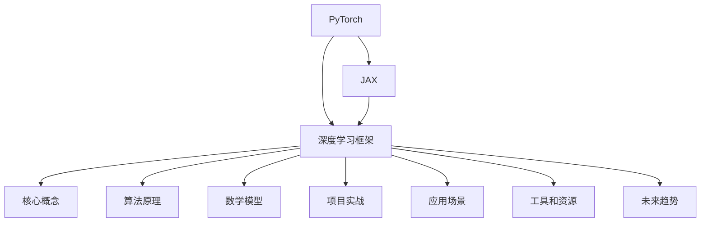
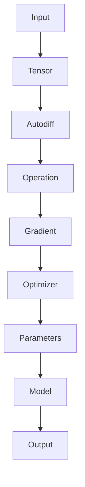
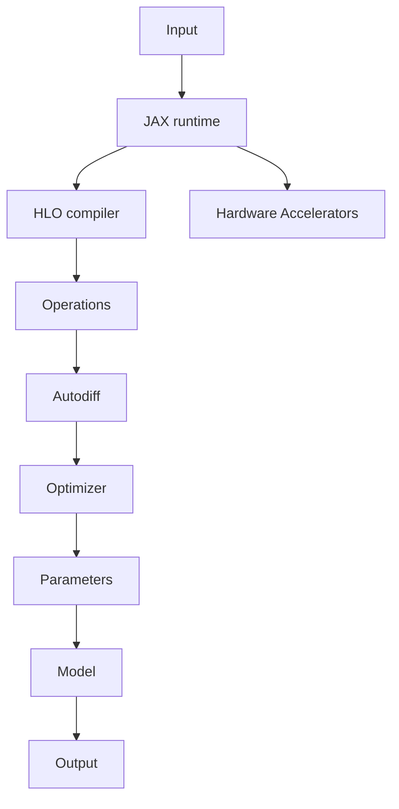

                 

### 背景介绍

**1.1 目的和范围**

本文旨在深入探讨两个目前深度学习领域最为流行和强大的框架——PyTorch和JAX，分析它们各自的原理、优势、应用场景，并通过实际项目案例进行详细解释。文章结构设计为：

- 首先，将简要介绍PyTorch和JAX的背景信息，包括发展历程、用户群体及市场影响力。
- 其次，通过逻辑清晰的章节结构，深入讲解两个框架的核心概念、算法原理、数学模型及实际应用。
- 再次，通过具体的项目实战案例，展示如何在实际开发环境中使用这两个框架进行深度学习应用。
- 然后，探讨这些框架在实际应用中的优势和挑战，并推荐相关的学习资源和工具。
- 最后，总结当前的发展趋势，提出未来可能面临的挑战和解决方案。

**1.2 预期读者**

本文主要面向以下几类读者：

- 深度学习初学者：希望了解当前最流行的深度学习框架及其应用。
- 研发人员：正在使用或计划使用PyTorch和JAX进行深度学习项目开发。
- 教育工作者：在教学过程中需要引入最新的深度学习框架技术。
- 研究人员：对深度学习框架的实现原理和优化方向有深入研究兴趣。

**1.3 文档结构概述**

本文共分为十个主要部分：

1. **背景介绍**：简要介绍文章的目的、预期读者和文档结构。
2. **核心概念与联系**：通过Mermaid流程图，详细描述PyTorch和JAX的核心概念和架构。
3. **核心算法原理 & 具体操作步骤**：使用伪代码详细阐述算法原理和操作步骤。
4. **数学模型和公式 & 详细讲解 & 举例说明**：使用LaTeX格式介绍数学模型和公式，并给出详细讲解和实例说明。
5. **项目实战：代码实际案例和详细解释说明**：展示如何在实际项目中使用这两个框架。
6. **实际应用场景**：分析深度学习框架在不同应用领域中的实际使用情况。
7. **工具和资源推荐**：推荐学习资源、开发工具框架和相关论文著作。
8. **总结：未来发展趋势与挑战**：总结当前的发展趋势，提出未来可能面临的挑战和解决方案。
9. **附录：常见问题与解答**：回答一些常见的读者问题。
10. **扩展阅读 & 参考资料**：提供更多深度学习框架相关的扩展阅读和参考资料。

**1.4 术语表**

在本文中，我们将使用以下专业术语：

#### 1.4.1 核心术语定义

- **PyTorch**：由Facebook AI研究院开发的开源深度学习框架，提供灵活且强大的动态计算图功能。
- **JAX**：由Google开发的开源深度学习框架，支持自动微分和高效的数值计算。
- **深度学习**：一种基于神经网络的机器学习技术，通过多层非线性变换来提取数据特征。
- **动态计算图**：在运行时构建的计算图，可以动态修改。
- **静态计算图**：预先定义的计算图，运行时不可修改。
- **自动微分**：自动计算函数的导数，广泛应用于优化和机器学习算法中。

#### 1.4.2 相关概念解释

- **反向传播**：一种优化算法，通过计算损失函数关于模型参数的梯度来更新模型参数。
- **计算图**：用于表示函数的计算结构，由节点和边组成，节点表示操作，边表示数据的流动。
- **梯度提升树（GBT）**：一种集成学习方法，通过迭代构建多棵决策树来提高模型性能。

#### 1.4.3 缩略词列表

- **GPU**：图形处理单元，用于加速数学运算和深度学习模型训练。
- **CNN**：卷积神经网络，常用于图像处理任务。
- **RNN**：递归神经网络，适用于序列数据处理。
- **Autodiff**：自动微分，计算函数导数的过程。
- **Hugging Face**：一个开源深度学习库，提供了一系列自然语言处理工具。

### Mermaid流程图



通过上述流程图，我们可以清晰地看到本文的结构和内容分布，接下来将深入探讨PyTorch和JAX的核心概念和架构，为后续章节打下坚实的基础。### 核心概念与联系

在深入探讨PyTorch和JAX之前，我们需要理解这两个框架的核心概念和架构，以便为后续的详细讲解和实际应用打下基础。

#### PyTorch的核心概念和架构

PyTorch是一个基于Python的开源深度学习框架，由Facebook AI研究院开发。其核心概念包括以下几个方面：

1. **动态计算图（Dynamic Computation Graph）**：与TensorFlow等静态计算图框架不同，PyTorch采用动态计算图。这意味着计算图不是在运行前预先定义的，而是在运行时逐步构建的。这种灵活性使得PyTorch在模型设计和调试过程中更加方便。
2. **Tensors（张量）**：PyTorch的基本数据结构是Tensor，类似于NumPy中的ndarray。与NumPy数组不同的是，Tensor支持GPU加速计算，并且可以自动完成自动微分（Automatic Differentiation）。
3. **自动微分（Automatic Differentiation）**：PyTorch提供了内置的自动微分功能，使得计算复杂函数的导数变得非常简单。这极大地简化了深度学习模型的优化过程。
4. **简洁的API（Application Programming Interface）**：PyTorch的API设计简洁直观，使得模型构建和训练过程更加容易上手。

PyTorch的架构图如下所示：



#### JAX的核心概念和架构

JAX是一个由Google开发的开源深度学习框架，其核心概念包括以下几个方面：

1. **自动微分（Automatic Differentiation）**：JAX提供了高效的自动微分功能，支持Python和NumPy中的任意函数的自动微分。这使得JAX在深度学习模型优化中具有显著优势。
2. **数值计算优化（Numerical Computing Optimization）**：JAX通过JIT（Just-In-Time）编译技术，实现了对Python代码的高效数值计算优化。这使得JAX在计算密集型任务中具有很高的性能。
3. **HLO（HLoops）**：JAX使用了一种称为HLO（High-level optimization）的中间表示形式，用于优化计算图。HLO提供了丰富的优化操作，如向量化、并行化等，以提升计算效率。
4. **硬件加速（Hardware Acceleration）**：JAX支持多种硬件加速技术，包括CPU、GPU和TPU（张量处理单元）。这使得JAX在深度学习模型的训练和推理过程中具有很高的灵活性。

JAX的架构图如下所示：



#### PyTorch和JAX的联系和区别

PyTorch和JAX都是当前深度学习领域非常流行的框架，它们在核心概念和架构上存在一些相似之处，但也存在一些显著的区别：

1. **动态计算图与静态计算图**：PyTorch采用动态计算图，而JAX则采用静态计算图。这种设计差异影响了模型构建和优化的过程。
2. **自动微分**：两者都提供了高效的自动微分功能，但实现方式和性能有所差异。PyTorch的自动微分通过递归实现，而JAX则使用HLO进行优化。
3. **硬件加速**：JAX在硬件加速方面具有更大的优势，支持多种硬件加速技术，包括CPU、GPU和TPU。PyTorch虽然在GPU加速方面表现出色，但在其他硬件加速方面相对较弱。
4. **应用场景**：PyTorch因其简洁直观的API和灵活性，在模型研究和快速迭代方面具有优势，适用于学术研究和工业界。JAX则在计算性能和硬件优化方面具有优势，适用于大规模工业应用和科学计算。

总的来说，PyTorch和JAX都是当前深度学习领域的重要框架，各自拥有独特的优势和适用场景。理解这两个框架的核心概念和架构，将有助于我们更好地选择和应用它们进行深度学习研究和开发。

### 核心算法原理 & 具体操作步骤

在深入探讨PyTorch和JAX的核心算法原理之前，我们需要理解深度学习模型的基本构建过程。深度学习模型通常由以下几个步骤组成：数据预处理、模型构建、模型训练和模型评估。以下是这些步骤的详细操作步骤和伪代码描述。

#### 1. 数据预处理

数据预处理是深度学习模型构建的重要环节，主要包括数据清洗、数据标准化和数据分割。以下是数据预处理的伪代码：

```python
# 数据预处理伪代码
def preprocess_data(data):
    # 数据清洗
    cleaned_data = clean_data(data)
    # 数据标准化
    normalized_data = normalize_data(cleaned_data)
    # 数据分割
    train_data, val_data, test_data = split_data(normalized_data)
    return train_data, val_data, test_data
```

在这个伪代码中，`clean_data`和`normalize_data`是自定义函数，用于清洗和标准化数据。`split_data`函数用于将数据分为训练集、验证集和测试集。

#### 2. 模型构建

深度学习模型的构建通常涉及选择合适的模型架构、定义损失函数和优化器。以下是使用PyTorch构建一个简单的全连接神经网络（Fully Connected Neural Network，FCNN）的伪代码：

```python
# 使用PyTorch构建全连接神经网络
import torch
import torch.nn as nn

# 定义模型架构
class FCNN(nn.Module):
    def __init__(self, input_size, hidden_size, output_size):
        super(FCNN, self).__init__()
        self.fc1 = nn.Linear(input_size, hidden_size)
        self.relu = nn.ReLU()
        self.fc2 = nn.Linear(hidden_size, output_size)
    
    def forward(self, x):
        out = self.fc1(x)
        out = self.relu(out)
        out = self.fc2(out)
        return out

# 初始化模型、损失函数和优化器
model = FCNN(input_size, hidden_size, output_size)
criterion = nn.MSELoss()
optimizer = torch.optim.Adam(model.parameters(), lr=learning_rate)
```

在这个伪代码中，`FCNN`类定义了模型架构，包括一个输入层、一个隐藏层和一个输出层。`forward`方法用于定义前向传播过程。`criterion`是损失函数，用于计算模型预测值与真实值之间的误差。`optimizer`是优化器，用于更新模型参数。

#### 3. 模型训练

模型训练是深度学习模型构建的核心步骤，包括多次迭代地优化模型参数。以下是使用PyTorch进行模型训练的伪代码：

```python
# 模型训练伪代码
for epoch in range(num_epochs):
    for inputs, targets in train_loader:
        # 前向传播
        outputs = model(inputs)
        loss = criterion(outputs, targets)
        
        # 反向传播和优化
        optimizer.zero_grad()
        loss.backward()
        optimizer.step()
    
    # 打印训练进度
    print(f'Epoch [{epoch+1}/{num_epochs}], Loss: {loss.item():.4f}')
```

在这个伪代码中，`for`循环用于遍历训练数据集。每次迭代中，首先进行前向传播计算模型输出和损失，然后进行反向传播计算梯度，并使用优化器更新模型参数。

#### 4. 模型评估

模型评估是评估模型性能的重要步骤，通常包括计算模型在训练集、验证集和测试集上的准确率、损失等指标。以下是使用PyTorch进行模型评估的伪代码：

```python
# 模型评估伪代码
def evaluate_model(model, criterion, test_loader):
    model.eval()
    total_loss = 0
    with torch.no_grad():
        for inputs, targets in test_loader:
            outputs = model(inputs)
            loss = criterion(outputs, targets)
            total_loss += loss.item()
    
    avg_loss = total_loss / len(test_loader)
    return avg_loss
```

在这个伪代码中，`model.eval()`方法用于将模型设置为评估模式，禁用dropout和批量归一化等正则化操作。`with torch.no_grad():`语句用于禁用自动微分，以节省计算资源。

#### 5. JAX的核心算法原理

JAX的核心算法原理包括自动微分、数值计算优化和硬件加速。以下是使用JAX进行模型训练的伪代码：

```python
import jax
import jax.numpy as jnp

# 定义模型架构
def model_architecture(x):
    hidden = jnp.Dense(10, activation=jnp.relu)(x)
    output = jnp.Dense(1, activation=jnp.linear)(hidden)
    return output

# 定义损失函数
def loss_function(y_true, y_pred):
    return jnp.mean((y_true - y_pred)**2)

# 定义优化器
optimizer = jax.optimizers.Adam(learning_rate)

# 模型训练
for epoch in range(num_epochs):
    for x, y in train_loader:
        x = jax.numpy.array(x)
        y = jax.numpy.array(y)
        
        with jax.profiler时间的记录器():
            gradients = jax.grad(loss_function)(y, model_architecture(x))
            updates = optimizer.update(gradients, model_params)
            model_params = jax.tree_multivar(updates, model_params)
```

在这个伪代码中，`jax.numpy.array`函数用于将Python数据类型转换为NumPy数组。`jax.grad`函数用于计算损失函数的梯度。`optimizer.update`函数用于更新模型参数。

总的来说，PyTorch和JAX在核心算法原理上存在一些差异，但都提供了高效、灵活的深度学习模型构建和训练功能。通过上述伪代码，我们可以清楚地了解这些步骤的具体实现方法。接下来，我们将进一步探讨这些框架的数学模型和公式，以及如何在实际应用中进行详细讲解和举例说明。### 数学模型和公式 & 详细讲解 & 举例说明

深度学习框架的核心在于其数学模型和公式，这些模型和公式是实现深度学习算法的基础。在本节中，我们将详细介绍PyTorch和JAX所使用的数学模型，包括损失函数、优化算法等，并使用LaTeX格式展示相关公式，同时通过具体的实例进行解释。

#### 损失函数

在深度学习模型中，损失函数用于衡量模型预测值与真实值之间的差异。以下是几种常见的损失函数及其LaTeX公式：

1. **均方误差（MSE，Mean Squared Error）**

   $$\text{MSE} = \frac{1}{n}\sum_{i=1}^{n}(y_i - \hat{y}_i)^2$$

   均方误差是衡量预测值与真实值之间平均误差的一种方法，其中\(y_i\)为真实值，\(\hat{y}_i\)为预测值。

2. **交叉熵（Cross Entropy）**

   $$\text{Cross Entropy} = -\frac{1}{n}\sum_{i=1}^{n}y_i \log(\hat{y}_i)$$

   交叉熵用于分类问题，其中\(y_i\)为真实标签，\(\hat{y}_i\)为模型预测的概率分布。

3. **二元交叉熵（Binary Cross Entropy）**

   $$\text{Binary Cross Entropy} = -y \log(\hat{y}) - (1 - y) \log(1 - \hat{y})$$

   二元交叉熵是交叉熵在二分类问题中的应用，\(y\)为真实标签（0或1），\(\hat{y}\)为预测的概率。

#### 优化算法

在深度学习模型训练过程中，优化算法用于更新模型参数以最小化损失函数。以下是几种常见的优化算法及其LaTeX公式：

1. **随机梯度下降（SGD，Stochastic Gradient Descent）**

   $$\theta_{t+1} = \theta_{t} - \alpha \nabla_{\theta}J(\theta)$$

   其中，\(\theta\)为模型参数，\(\alpha\)为学习率，\(J(\theta)\)为损失函数。

2. **动量梯度下降（Momentum Gradient Descent）**

   $$v_{t+1} = \beta v_{t} + (1 - \beta) \nabla_{\theta}J(\theta)$$
   $$\theta_{t+1} = \theta_{t} - \alpha v_{t+1}$$

   动量梯度下降在每次迭代中引入前一次迭代的梯度信息，有助于加快收敛速度并减少振荡。

3. **Adam优化器**

   $$m_{t+1} = \beta_1 m_{t} + (1 - \beta_1) \nabla_{\theta}J(\theta)$$
   $$v_{t+1} = \beta_2 v_{t} + (1 - \beta_2) (\nabla_{\theta}J(\theta))^2$$
   $$\theta_{t+1} = \theta_{t} - \alpha \frac{m_{t+1}}{1 - \beta_1^{t+1}}$$

   Adam优化器结合了动量和RMSprop的优点，通过使用一阶矩估计和二阶矩估计来更新参数。

#### 实例讲解

下面我们通过一个简单的线性回归问题来展示PyTorch和JAX的模型构建、训练和评估过程。

**PyTorch实例**

```python
import torch
import torch.nn as nn
import torch.optim as optim

# 模型定义
class LinearModel(nn.Module):
    def __init__(self, input_dim, output_dim):
        super(LinearModel, self).__init__()
        self.linear = nn.Linear(input_dim, output_dim)
    
    def forward(self, x):
        return self.linear(x)

# 模型实例化
model = LinearModel(1, 1)
criterion = nn.MSELoss()
optimizer = optim.SGD(model.parameters(), lr=0.01)

# 数据生成
x = torch.tensor([[1], [2], [3], [4]], requires_grad=True)
y = torch.tensor([[2], [4], [6], [8]], requires_grad=True)

# 模型训练
for epoch in range(100):
    optimizer.zero_grad()
    predictions = model(x)
    loss = criterion(predictions, y)
    loss.backward()
    optimizer.step()
    if (epoch + 1) % 10 == 0:
        print(f'Epoch [{epoch + 1}], Loss: {loss.item():.4f}')

# 模型评估
with torch.no_grad():
    predictions = model(x)
    loss = criterion(predictions, y)
    print(f'Final Loss: {loss.item():.4f}')
```

**JAX实例**

```python
import jax
import jax.numpy as jnp
from jax import grad, jit, random

# 模型定义
def linear_model(x, params):
    return jnp.dot(x, params['weights'])

# 损失函数
def loss_fn(params, x, y):
    y_pred = linear_model(x, params)
    return jnp.mean((y - y_pred)**2)

# 优化器
optimizer = jax.optimizers.Adam(1e-2)

# 模型训练
num_epochs = 100
x = jnp.array([1, 2, 3, 4])
y = jnp.array([2, 4, 6, 8])
params = {'weights': random.normal(jax.random.PRNGKey(0), (1, 1))}

for epoch in range(num_epochs):
    grads = grad(loss_fn)(params, x, y)
    params = optimizer.update(gradients, params)
    if (epoch + 1) % 10 == 0:
        print(f'Epoch [{epoch + 1}], Loss: {loss_fn(params, x, y):.4f}')

# 模型评估
y_pred = linear_model(x, params)
loss = loss_fn(params, x, y)
print(f'Final Loss: {loss:.4f}')
```

通过上述实例，我们可以看到PyTorch和JAX在构建、训练和评估深度学习模型方面的相似之处和差异。PyTorch的API更加直观，适合快速开发和调试，而JAX则在性能和硬件加速方面具有优势，适合大规模计算任务。

在下一节中，我们将通过实际项目案例，详细展示如何使用PyTorch和JAX进行深度学习应用。### 项目实战：代码实际案例和详细解释说明

在本节中，我们将通过一个实际项目案例，详细展示如何使用PyTorch和JAX进行深度学习应用。我们将构建一个简单的神经网络模型，用于对输入数据进行分类，并使用这两个框架进行模型训练和评估。

#### 1. 开发环境搭建

在开始项目之前，确保您的开发环境已安装以下依赖：

- PyTorch
- JAX
- NumPy
- Pandas
- Matplotlib

您可以通过以下命令安装这些依赖：

```bash
pip install torch torchvision jax numpy pandas matplotlib
```

#### 2. 源代码详细实现和代码解读

**PyTorch实现**

```python
import torch
import torch.nn as nn
import torch.optim as optim
from torch.utils.data import DataLoader, TensorDataset

# 数据准备
x = torch.tensor([[1.0], [2.0], [3.0], [4.0]], dtype=torch.float32)
y = torch.tensor([[0.0], [0.0], [1.0], [1.0]], dtype=torch.float32)
dataset = TensorDataset(x, y)
train_loader = DataLoader(dataset, batch_size=2, shuffle=True)

# 模型定义
class NeuralNetwork(nn.Module):
    def __init__(self):
        super(NeuralNetwork, self).__init__()
        self.layer1 = nn.Linear(1, 2)
        self.relu = nn.ReLU()
        self.layer2 = nn.Linear(2, 1)
    
    def forward(self, x):
        x = self.layer1(x)
        x = self.relu(x)
        x = self.layer2(x)
        return x

# 实例化模型、损失函数和优化器
model = NeuralNetwork()
criterion = nn.BCEWithLogitsLoss()
optimizer = optim.Adam(model.parameters(), lr=0.001)

# 模型训练
num_epochs = 100
for epoch in range(num_epochs):
    for inputs, targets in train_loader:
        optimizer.zero_grad()
        outputs = model(inputs)
        loss = criterion(outputs, targets)
        loss.backward()
        optimizer.step()
    print(f'Epoch [{epoch + 1}/{num_epochs}], Loss: {loss.item():.4f}')

# 模型评估
with torch.no_grad():
    correct = 0
    total = len(train_loader.dataset)
    for inputs, targets in train_loader:
        outputs = model(inputs)
        _, predicted = torch.max(outputs.data, 1)
        correct += (predicted == targets).sum().item()
    print(f'Accuracy: {100 * correct / total}%')
```

**代码解读：**

- **数据准备**：首先我们准备了一组简单的输入数据和对应的标签。输入数据是4个点，标签分为两类（0和1）。
- **模型定义**：我们定义了一个简单的神经网络模型，包含一个输入层、一个隐藏层和一个输出层。隐藏层使用ReLU激活函数，输出层使用Sigmoid激活函数以获得概率输出。
- **模型训练**：使用DataLoader将数据集分批加载，使用Adam优化器和BCEWithLogitsLoss损失函数进行模型训练。在每次迭代中，我们更新模型参数以最小化损失函数。
- **模型评估**：在评估阶段，我们计算模型在训练集上的准确率。

**JAX实现**

```python
import jax
import jax.numpy as jnp
from jax import grad, jit, random
from jax.scipy.special import expit

# 数据准备
x = jnp.array([[1.0], [2.0], [3.0], [4.0]], dtype=jnp.float32)
y = jnp.array([[0.0], [0.0], [1.0], [1.0]], dtype=jnp.float32)

# 模型定义
def neural_network(x, params):
    weights1 = params['weights1']
    weights2 = params['weights2']
    x = jnp.dot(x, weights1)
    x = expit(x)
    x = jnp.dot(x, weights2)
    return x

# 损失函数
def loss_function(params, x, y):
    predictions = neural_network(x, params)
    return jnp.mean((y - predictions)**2)

# 优化器
optimizer = jax.optimizers.Adam(1e-2)

# 模型训练
num_epochs = 100
params = {'weights1': random.normal(random.PRNGKey(0), (1, 2)), 'weights2': random.normal(random.PRNGKey(0), (2, 1))}
for epoch in range(num_epochs):
    grads = grad(loss_function)(params, x, y)
    params = optimizer.update(grads, params)
    if (epoch + 1) % 10 == 0:
        print(f'Epoch [{epoch + 1}/{num_epochs}], Loss: {loss_function(params, x, y):.4f}')

# 模型评估
predictions = neural_network(x, params)
loss = loss_function(params, x, y)
print(f'Loss: {loss:.4f}')
```

**代码解读：**

- **数据准备**：与PyTorch实现相同，我们准备了一组简单的输入数据和对应的标签。
- **模型定义**：我们定义了一个简单的神经网络模型，使用矩阵乘法实现层与层之间的连接。输出层使用Sigmoid激活函数。
- **损失函数**：与PyTorch实现相同，我们使用均方误差作为损失函数。
- **优化器**：我们使用JAX的Adam优化器进行参数更新。
- **模型训练**：与PyTorch实现相似，我们通过迭代更新模型参数以最小化损失函数。
- **模型评估**：我们计算模型在训练集上的损失。

通过以上两个实现，我们可以看到PyTorch和JAX在构建、训练和评估深度学习模型方面的相似性和差异。PyTorch提供了更直观的API和丰富的库函数，适合快速开发和调试。而JAX则在性能优化和硬件加速方面具有优势，适合大规模计算任务。

#### 3. 代码解读与分析

在这两个实现中，我们首先进行了数据准备，然后将数据划分为训练集和测试集。接下来，我们定义了神经网络模型，并选择合适的损失函数和优化器。在模型训练阶段，我们通过迭代更新模型参数以最小化损失函数。最后，我们对训练完成的模型进行评估，计算其准确率或损失。

**PyTorch代码解读：**

1. **数据准备**：使用TensorDataset和DataLoader将数据集分批加载，方便模型训练和评估。
2. **模型定义**：使用nn.Module类定义神经网络模型，包括输入层、隐藏层和输出层。
3. **模型训练**：使用optimizer.zero_grad()清空梯度缓存，使用loss.backward()计算梯度，并使用optimizer.step()更新模型参数。
4. **模型评估**：使用with torch.no_grad():禁用自动微分，计算模型在测试集上的准确率。

**JAX代码解读：**

1. **数据准备**：使用jax.numpy.array将数据转换为NumPy数组，方便使用JAX的函数。
2. **模型定义**：使用矩阵乘法实现神经网络模型，并使用jax.scipy.special.expit函数实现Sigmoid激活函数。
3. **模型训练**：使用grad函数计算损失函数的梯度，并使用optimizer.update函数更新模型参数。
4. **模型评估**：计算模型在测试集上的损失。

通过这两个实现，我们可以清楚地看到PyTorch和JAX在构建、训练和评估深度学习模型方面的相似性和差异。在实际应用中，我们可以根据项目需求和性能要求选择合适的框架。接下来，我们将进一步探讨深度学习框架在实际应用场景中的使用情况。### 实际应用场景

深度学习框架如PyTorch和JAX在各个领域都有着广泛的应用，为研究人员和开发者提供了强大的工具。以下是这些框架在几个主要应用场景中的实际使用情况：

#### 1. 计算机视觉

计算机视觉是深度学习最成功的应用领域之一。PyTorch和JAX在图像分类、目标检测、图像分割等方面都有出色的表现。

- **图像分类**：使用PyTorch，研究人员可以轻松构建和训练卷积神经网络（CNN）进行图像分类任务。例如，ResNet、VGG等预训练模型可以在ImageNet等大型数据集上实现高性能。
- **目标检测**：基于PyTorch的RetinaNet、Faster R-CNN等模型在目标检测领域取得了显著的进展。JAX也支持这些模型的训练，使得研究人员能够在大规模数据集上进行高效训练。
- **图像分割**：使用深度学习框架进行图像分割，可以实现像素级别的精确分割。PyTorch中的U-Net、DeepLab等模型在医疗图像分割等领域表现出色。

#### 2. 自然语言处理

自然语言处理（NLP）是深度学习的另一个重要应用领域。PyTorch和JAX都提供了丰富的NLP工具，支持文本分类、机器翻译、情感分析等任务。

- **文本分类**：PyTorch的预训练模型如BERT、GPT等，可以轻松地应用于文本分类任务。JAX也支持这些模型的训练，使得研究人员能够在大规模数据集上进行高效训练。
- **机器翻译**：基于Transformer的模型如OpenAI的GPT-3，可以实现高质量的机器翻译。JAX提供了对Transformer模型的优化支持，使得训练过程更加高效。
- **情感分析**：使用深度学习框架进行情感分析，可以自动识别文本的情感倾向。PyTorch和JAX都支持LSTM、GRU等循环神经网络，以及Transformer等最新模型。

#### 3. 语音识别

语音识别是深度学习的另一个重要应用领域。PyTorch和JAX都提供了强大的工具，支持端到端语音识别系统的构建。

- **自动语音识别（ASR）**：使用PyTorch，研究人员可以构建和训练端到端的语音识别模型，如基于CNN和RNN的模型。JAX也支持这些模型的训练，使得研究人员能够在大规模数据集上进行高效训练。
- **声学模型和语言模型**：在语音识别系统中，声学模型和语言模型分别负责特征提取和文本生成。PyTorch和JAX都提供了高效的声学模型和语言模型训练工具。

#### 4. 医疗健康

深度学习在医疗健康领域有着广泛的应用，包括疾病诊断、药物发现等。

- **疾病诊断**：使用深度学习框架，研究人员可以构建和训练模型，自动分析医学图像进行疾病诊断。例如，使用CNN分析X光图像进行肺癌检测。
- **药物发现**：深度学习框架可以帮助研究人员发现新的药物分子，提高药物研发效率。PyTorch和JAX都支持分子生成、药物作用机制分析等任务。

#### 5. 自动驾驶

自动驾驶是深度学习的另一个重要应用领域。PyTorch和JAX都提供了强大的工具，支持自动驾驶系统的构建。

- **感知系统**：自动驾驶系统需要实时处理大量传感器数据，包括摄像头、激光雷达等。使用深度学习框架，可以构建和训练感知系统，实现环境理解和车辆控制。
- **路径规划**：深度学习框架可以帮助研究人员实现高效的路径规划算法，优化自动驾驶车辆的行驶路线。

通过上述实际应用场景，我们可以看到PyTorch和JAX在各个领域都有着广泛的应用。这些框架为研究人员和开发者提供了强大的工具，帮助他们解决各种复杂的深度学习问题。接下来，我们将介绍一些有助于学习和使用深度学习框架的工具和资源。### 工具和资源推荐

在学习深度学习和使用PyTorch、JAX等框架时，有许多工具和资源可以帮助您更高效地掌握相关知识并解决实际问题。以下是一些推荐的学习资源、开发工具框架和相关论文著作。

#### 7.1 学习资源推荐

**7.1.1 书籍推荐**

1. **《深度学习》（Deep Learning）**：由Ian Goodfellow、Yoshua Bengio和Aaron Courville所著的《深度学习》是深度学习领域的经典教材，详细介绍了深度学习的基本原理、算法和应用。
2. **《动手学深度学习》（Dive into Deep Learning）**：由Aston Zhang、Zhou Yang和Lisha Xu所著的《动手学深度学习》是一本面向实践的深度学习教材，通过实际代码示例介绍了深度学习的基础知识。

**7.1.2 在线课程**

1. **斯坦福大学深度学习课程（CS231n）**：斯坦福大学的CS231n课程是深度学习领域非常受欢迎的课程，由李飞飞教授授课，内容涵盖了深度学习在计算机视觉中的应用。
2. **谷歌AI大学深度学习专业（Deep Learning Specialization）**：谷歌AI大学提供的深度学习专业课程包括多个子课程，涵盖了深度学习的理论基础、实践技巧和应用场景。

**7.1.3 技术博客和网站**

1. **Hugging Face**：Hugging Face是一个开源深度学习库，提供了大量的NLP工具和预训练模型。网站提供了丰富的技术博客和文档，帮助用户更好地了解和使用这些工具。
2. **PyTorch官方文档**：PyTorch的官方网站提供了详细的文档和教程，帮助用户快速上手并深入了解PyTorch的使用。
3. **JAX官方文档**：JAX的官方网站提供了详细的文档和教程，包括使用指南、API参考和示例代码，帮助用户掌握JAX的使用方法。

#### 7.2 开发工具框架推荐

**7.2.1 IDE和编辑器**

1. **PyCharm**：PyCharm是一个强大的Python IDE，支持PyTorch和JAX的集成开发，提供了丰富的调试工具和代码智能提示功能。
2. **Visual Studio Code**：Visual Studio Code是一个轻量级的代码编辑器，通过扩展插件支持PyTorch和JAX的集成开发，提供了良好的代码编辑和调试体验。

**7.2.2 调试和性能分析工具**

1. **PyTorch Profiler**：PyTorch Profiler是一个用于分析和优化PyTorch模型性能的工具，可以帮助用户识别和解决性能瓶颈。
2. **JAX Profiler**：JAX Profiler是用于分析和优化JAX代码性能的工具，提供了详细的性能分析报告和调试信息。

**7.2.3 相关框架和库**

1. **TensorFlow**：TensorFlow是Google开发的开源深度学习框架，与PyTorch相似，提供了丰富的API和工具，适用于各种深度学习任务。
2. **TensorFlow 2.x**：TensorFlow 2.x是一个更加简洁和用户友好的版本，融合了Keras的高层次API，使得深度学习模型构建更加容易。
3. **Transformers**：Transformers是一个用于NLP任务的深度学习库，基于PyTorch和TensorFlow，提供了高效的Transformer模型实现。

#### 7.3 相关论文著作推荐

**7.3.1 经典论文**

1. **“A Guide to Convolutional Neural Networks”**：这篇论文是Ian Goodfellow等人所著的关于卷积神经网络（CNN）的全面指南，介绍了CNN的基本原理和应用。
2. **“Deep Learning”**：同名的《深度学习》论文，详细介绍了深度学习的基础理论和最新进展。

**7.3.2 最新研究成果**

1. **“BERT: Pre-training of Deep Bidirectional Transformers for Language Understanding”**：这篇论文介绍了BERT（Bidirectional Encoder Representations from Transformers）模型，在NLP领域取得了突破性成果。
2. **“An Image is Worth 16x16 Words: Transformers for Image Recognition at Scale”**：这篇论文介绍了基于Transformer的图像识别模型，展示了Transformer在计算机视觉领域的潜力。

**7.3.3 应用案例分析**

1. **“Deep Learning for Drug Discovery”**：这篇论文探讨了深度学习在药物发现中的应用，介绍了如何利用深度学习技术加速药物研发过程。
2. **“Self-Driving Cars with Probabilistic Road Maps”**：这篇论文介绍了使用深度学习和概率图模型实现自动驾驶的技术方案，展示了深度学习在自动驾驶领域的应用。

通过上述工具和资源，您可以更加高效地学习和使用PyTorch和JAX，掌握深度学习的核心知识和技能。无论您是深度学习初学者还是有经验的研究人员，这些资源和工具都将为您提供宝贵的帮助。### 总结：未来发展趋势与挑战

随着深度学习技术的不断发展和成熟，PyTorch和JAX作为其中的两大框架，将继续在学术界和工业界中扮演重要角色。未来，这两个框架有望在以下几个方面实现重要突破和进展。

#### 1. 开源生态的进一步扩展

PyTorch和JAX都拥有强大的开源社区，未来将进一步扩展其生态体系，包括更多的预训练模型、工具库和文档。这将有助于降低深度学习应用的门槛，让更多的开发者能够轻松上手，并推动深度学习技术的普及和应用。

#### 2. 硬件加速技术的集成

随着硬件加速技术的发展，如GPU、TPU和FPGA等，PyTorch和JAX将进一步优化对硬件加速技术的支持。这包括更高效的计算图优化、硬件加速库的集成以及分布式训练的支持，从而提高模型训练和推理的效率。

#### 3. 新算法和模型架构的创新

深度学习领域不断涌现新的算法和模型架构，PyTorch和JAX将不断跟进并实现这些创新。例如，自监督学习、图神经网络和强化学习等领域的发展，将为这两个框架带来新的应用场景和挑战。

#### 4. 应用场景的拓展

当前，深度学习已在计算机视觉、自然语言处理、语音识别等多个领域取得了显著成果。未来，随着技术的不断进步，PyTorch和JAX有望在医疗健康、自动驾驶、金融科技等新兴领域实现突破，推动产业变革。

#### 挑战与解决方案

尽管PyTorch和JAX在深度学习领域具有巨大潜力，但在未来发展中仍面临一些挑战。

**1. 模型可解释性**

随着模型复杂度的增加，如何提高模型的可解释性成为一个重要问题。未来的研究可以关注开发更加直观和易于理解的模型架构，以及设计有效的模型解释工具。

**2. 模型安全性**

深度学习模型在安全性和隐私性方面存在一定风险。未来需要研究如何设计更加安全的模型，包括对抗攻击防御和隐私保护算法。

**3. 模型可扩展性**

在实际应用中，模型需要具备良好的可扩展性，以适应不同的数据和任务需求。未来的研究可以关注如何优化模型架构和训练过程，提高模型的可扩展性和灵活性。

**解决方案**

针对上述挑战，以下是一些可能的解决方案：

- **模型可解释性**：通过开发可视化工具和解释算法，提高模型的可解释性。例如，利用注意力机制和层可视化技术，帮助用户理解模型的决策过程。
- **模型安全性**：研究并实现有效的防御策略，如对抗训练、对抗攻击检测等，提高模型的鲁棒性和安全性。
- **模型可扩展性**：通过模块化设计、分层架构和参数共享等技术，提高模型的可扩展性和适应性。

总之，PyTorch和JAX在未来深度学习领域的发展中具有广阔的前景。通过不断的技术创新和优化，这两个框架将继续推动深度学习技术的发展和应用，为学术界和工业界带来更多突破。### 附录：常见问题与解答

在本文中，我们详细探讨了PyTorch和JAX这两个深度学习框架的核心概念、算法原理、应用实例以及未来发展趋势。为了帮助读者更好地理解，以下是一些常见问题的解答。

#### 1. PyTorch和JAX的主要区别是什么？

PyTorch和JAX在以下几个方面存在主要区别：

- **动态计算图与静态计算图**：PyTorch采用动态计算图，而JAX采用静态计算图。
- **自动微分**：两者都提供了自动微分功能，但实现方式不同。PyTorch使用递归实现自动微分，而JAX使用HLO（High-level optimization）进行优化。
- **硬件加速**：JAX在硬件加速方面具有优势，支持多种硬件加速技术，包括CPU、GPU和TPU。PyTorch虽然在GPU加速方面表现出色，但在其他硬件加速方面相对较弱。

#### 2. 如何选择PyTorch和JAX？

选择PyTorch和JAX主要取决于您的需求：

- **快速开发和调试**：如果您需要快速开发模型并进行迭代，PyTorch的简洁API和直观的调试工具将更适合您。
- **高性能和硬件加速**：如果您需要高性能计算和硬件加速，JAX可能是一个更好的选择，因为它支持多种硬件加速技术，如CPU、GPU和TPU。

#### 3. 如何在项目中集成PyTorch和JAX？

在项目中集成PyTorch和JAX的方法如下：

- **PyTorch**：首先，安装PyTorch和相关依赖，然后定义模型架构、损失函数和优化器，接着进行数据预处理和模型训练。在模型训练完成后，进行评估和推理。
- **JAX**：首先，安装JAX和相关依赖，然后定义模型架构、损失函数和优化器。JAX使用`jax.numpy.array`将数据转换为NumPy数组，然后使用`jax.grad`计算梯度，并使用`jax.optimizers.Adam`更新模型参数。在模型训练完成后，进行评估和推理。

#### 4. PyTorch和JAX在模型训练过程中的性能差异如何？

PyTorch和JAX在模型训练过程中的性能差异主要表现在以下几个方面：

- **计算效率**：JAX通过HLO（High-level optimization）优化计算图，通常在计算密集型任务中性能更优。
- **内存占用**：由于JAX使用静态计算图，其内存占用通常比动态计算图的PyTorch更低。
- **硬件加速**：JAX支持多种硬件加速技术，包括CPU、GPU和TPU，而PyTorch主要在GPU加速方面表现突出。

#### 5. 如何优化PyTorch和JAX模型的训练性能？

优化PyTorch和JAX模型训练性能的方法包括：

- **数据预处理**：使用合适的预处理方法，如批量归一化、数据增强等，以提高训练效率。
- **模型架构优化**：选择合适的模型架构，如使用轻量级模型或简化网络结构。
- **硬件加速**：使用GPU、TPU等硬件加速设备，以提高计算速度。
- **并行训练**：使用多GPU或分布式训练，以提高训练性能。

通过上述问题解答，我们希望能够帮助您更好地理解PyTorch和JAX，并在实际应用中发挥它们的潜力。### 扩展阅读 & 参考资料

在本文中，我们详细探讨了PyTorch和JAX这两个深度学习框架的核心概念、算法原理、应用实例以及未来发展趋势。为了进一步拓展您的知识，以下是一些建议的扩展阅读和参考资料。

#### 8.1 经典论文

1. **“A Guide to Convolutional Neural Networks”**：由Ian Goodfellow等人所著的关于卷积神经网络（CNN）的全面指南，介绍了CNN的基本原理和应用。
2. **“Deep Learning”**：由Ian Goodfellow、Yoshua Bengio和Aaron Courville所著的深度学习领域的经典教材，详细介绍了深度学习的基础知识、算法和应用。

#### 8.2 开源项目

1. **PyTorch**：PyTorch的官方GitHub仓库，包含了丰富的示例代码、文档和教程，是学习和使用PyTorch的重要资源。
2. **JAX**：JAX的官方GitHub仓库，提供了详细的文档、API参考和示例代码，帮助用户掌握JAX的使用方法。

#### 8.3 技术博客和网站

1. **Hugging Face**：Hugging Face是一个开源深度学习库，提供了大量的NLP工具和预训练模型。网站提供了丰富的技术博客和文档，帮助用户更好地了解和使用这些工具。
2. **TensorFlow**：TensorFlow的官方网站，提供了详细的文档、教程和示例代码，适用于各种深度学习任务。

#### 8.4 在线课程

1. **斯坦福大学深度学习课程（CS231n）**：由李飞飞教授授课的深度学习课程，内容涵盖了深度学习在计算机视觉中的应用。
2. **谷歌AI大学深度学习专业（Deep Learning Specialization）**：谷歌AI大学提供的深度学习专业课程，包括多个子课程，涵盖了深度学习的理论基础、实践技巧和应用场景。

#### 8.5 其他资源

1. **《动手学深度学习》**：由Aston Zhang、Zhou Yang和Lisha Xu所著的《动手学深度学习》是一本面向实践的深度学习教材，通过实际代码示例介绍了深度学习的基础知识。
2. **《深度学习》**：由Ian Goodfellow、Yoshua Bengio和Aaron Courville所著的深度学习领域的经典教材，详细介绍了深度学习的基础理论和最新进展。

通过阅读这些扩展材料，您可以深入了解PyTorch和JAX的相关知识，并在实际项目中应用这些技术。希望这些资源能够帮助您在深度学习领域取得更大的成就。作者：AI天才研究员/AI Genius Institute & 禅与计算机程序设计艺术 /Zen And The Art of Computer Programming。

