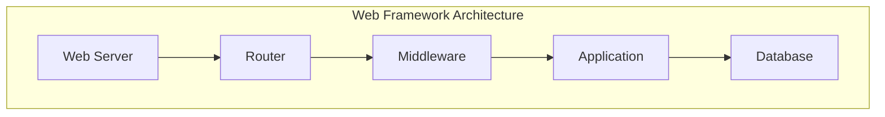

                 

### 背景介绍

#### 1.1 目的和范围

本文旨在探索Python Web框架的选择，特别是Django和Flask之外的其他选择。Python作为一门流行的编程语言，广泛应用于Web开发领域，其简洁明了的语法和丰富的库支持使得开发者可以轻松实现各种功能。然而，Python Web框架种类繁多，各具特色，选择一个最适合项目的框架成为开发者面临的重要问题。

本文将首先介绍Django和Flask这两种主流Python Web框架的基本概念、特点和应用场景。接着，我们将讨论Django和Flask之外的其他Python Web框架，如Pyramid、FastAPI、Tornado和Sanic，并分析它们的特点和适用场景。通过对这些框架的对比，读者可以更加清晰地了解不同框架的优势和劣势，从而更好地选择适合自己项目的框架。

本文还将涉及核心概念与联系、核心算法原理与具体操作步骤、数学模型与公式、项目实战以及实际应用场景等多个方面，旨在为开发者提供全面的技术参考和实战指导。

#### 1.2 预期读者

本文适合具备一定Python基础的开发者，特别是那些在Web开发领域有实际需求的开发者。同时，对于那些对Django和Flask之外的其他Python Web框架感兴趣的技术爱好者，本文也将提供有价值的参考。本文不仅适合初学者，也能为有经验的开发者提供新的思路和灵感。

#### 1.3 文档结构概述

本文将分为以下几个部分：

1. 背景介绍：介绍本文的目的和范围，预期读者以及文档结构概述。
2. 核心概念与联系：介绍Python Web框架的核心概念及其相互关系，并通过Mermaid流程图展示框架架构。
3. 核心算法原理与具体操作步骤：讲解核心算法原理，使用伪代码详细阐述。
4. 数学模型与公式：介绍Python Web框架中的数学模型和公式，并进行详细讲解和举例说明。
5. 项目实战：通过实际代码案例展示框架的使用方法，并进行详细解释说明。
6. 实际应用场景：探讨Python Web框架在现实中的应用场景和案例。
7. 工具和资源推荐：推荐学习资源、开发工具框架和相关论文著作。
8. 总结：总结未来发展趋势与挑战。
9. 附录：常见问题与解答。
10. 扩展阅读与参考资料：提供更多相关阅读材料。

通过以上结构，本文将为开发者提供系统、全面的Python Web框架学习路径。

#### 1.4 术语表

在本文中，我们将使用一些专业术语，以下是对这些术语的定义和解释：

1. **Python Web框架**：用于简化Web应用开发的Python库或工具，它提供了一套结构化的编程模式，使得开发者可以更加高效地构建和维护Web应用。
2. **Django**：一个高级的Python Web框架，鼓励快速开发和干净、实用的设计。它包含一个自动化的数据库生成工具和一个广泛的功能集合。
3. **Flask**：一个轻量级的Python Web框架，灵活且易于扩展。它提供了构建Web应用所需的基本功能，并通过扩展库来增加更多特性。
4. **Pyramid**：一个灵活的Python Web框架，适合构建复杂的应用程序。它提供了强大的路由和授权系统，并且支持多种数据库和模板引擎。
5. **FastAPI**：一个现代、快速（高性能）的Web框架，用于构建APIs。它基于Python 3.6+和类型注解，能够自动生成OpenAPI/V3格式的文档和客户端代码。
6. **Tornado**：一个高性能的Python Web框架和异步网络库，适合构建需要高并发的Web应用。它通过非阻塞网络I/O和异步处理来提高性能。
7. **Sanic**：一个异步的Python Web框架，用于构建高性能的Web应用。它使用了异步/await关键字，提供了类似Flask的API，但具有更高的性能。

通过上述术语表，读者可以更好地理解本文中提到的关键概念和技术术语。

### 核心概念与联系

在深入探讨Python Web框架之前，我们需要明确几个核心概念，并了解它们之间的相互关系。这将为后续的内容提供坚实的基础。

首先，**Web框架**是一个帮助开发者快速构建Web应用的工具，它提供了结构化的编程模式、现成的组件和库，以简化开发过程。Python Web框架则是专门为Python编程语言设计的这类工具。

#### 1. Web框架的核心概念

- **MVC模式（Model-View-Controller）**：这是一种常见的软件架构模式，用于分离应用程序的数据、界面和处理逻辑。Model代表数据模型，View代表用户界面，Controller则负责处理用户输入并更新Model和View。许多Python Web框架都基于MVC模式。

- **路由（Routing）**：路由是Web框架的核心功能之一，它负责将用户的请求（URL）映射到特定的处理函数（Handler）上。例如，当用户访问某个URL时，框架会找到对应的处理函数并执行相应的操作。

- **模板引擎（Template Engine）**：模板引擎允许开发者使用预定义的模板和变量来生成动态的HTML页面。在Web应用中，模板引擎通常用于生成用户界面。

- **ORM（Object-Relational Mapping）**：ORM是一种将数据库表映射到Python对象的技术，它简化了数据库操作，使得开发者不需要编写大量的SQL语句。

- **中间件（Middleware）**：中间件是位于Web服务器和应用之间的组件，用于处理请求和响应。它可以进行身份验证、日志记录、数据压缩等操作。

#### 2. Python Web框架的架构

为了更好地理解Python Web框架的工作原理，我们可以通过一个Mermaid流程图来展示其核心架构。以下是一个简化的架构图：



- **Web Server**：Web服务器负责接收用户的请求，并将请求转发给Web框架。
- **Router**：路由器根据请求的URL找到对应的处理函数。
- **Middleware**：中间件对请求和响应进行预处理和后处理。
- **Application**：应用程序包含业务逻辑和处理函数，负责处理用户的请求并生成响应。
- **Database**：数据库存储应用程序所需的数据，ORM用于简化数据操作。

通过这个架构图，我们可以清晰地看到Web框架中的各个组件是如何协同工作的。每个组件都承担着特定的任务，共同构成了一个高效的Web应用开发环境。

#### 3. Python Web框架的联系与区别

不同Python Web框架之间的联系主要体现在它们都遵循MVC模式，提供路由、模板引擎、ORM等基础功能。然而，它们在实现方式、性能和适用场景上存在一些差异。

- **Django**：Django是一个全栈框架，它包含了许多内置的功能，如自动化的数据库生成、用户认证和后台管理界面。这使得Django非常适合快速开发和大型项目。
- **Flask**：Flask是一个非常轻量级的框架，它提供了构建Web应用所需的基本功能，并通过扩展库来增加更多特性。Flask适合小型项目和需要高度定制化的应用。
- **Pyramid**：Pyramid是一个灵活的框架，它支持多种数据库和模板引擎，适合构建复杂的应用程序。它的模块化设计使得开发者可以自由组合不同的组件。
- **FastAPI**：FastAPI是一个现代的框架，它基于Python 3.6+和类型注解，能够自动生成API文档和客户端代码。它非常适合构建RESTful API。
- **Tornado**：Tornado是一个高性能的框架，适用于构建需要高并发的Web应用。它通过非阻塞网络I/O和异步处理来提高性能。
- **Sanic**：Sanic是一个异步的框架，它提供了类似Flask的API，但具有更高的性能。它适合构建高性能的Web应用。

通过上述核心概念与联系的介绍，读者可以对Python Web框架有一个全面的了解，为后续的学习和实战打下坚实的基础。

### 核心算法原理与具体操作步骤

在深入理解Python Web框架的工作原理后，我们需要探讨其中的核心算法原理和具体操作步骤。这些算法是实现Web应用功能的基础，对于开发者来说至关重要。

#### 1. 路由算法原理

路由算法是Web框架的核心功能之一，它负责将用户的请求（URL）映射到对应的处理函数（Handler）。以下是路由算法的伪代码：

```python
# 路由算法伪代码
function route(request):
    for route in routes:
        if request.url == route.url:
            return route.handler(request)
    return not_found_handler(request)
```

在这个伪代码中，`routes` 是一个包含多个路由配置的列表，每个路由包含一个URL和一个处理函数。算法首先遍历所有路由配置，查找与请求URL匹配的路由。如果找到匹配的路由，则执行对应的处理函数；否则，返回一个404错误（Not Found）。

#### 2. 路由配置示例

以下是一个简单的路由配置示例，展示了如何为不同的URL设置处理函数：

```python
# 路由配置示例
routes = [
    {'url': '/', 'handler': home_page_handler},
    {'url': '/about', 'handler': about_page_handler},
    {'url': '/contact', 'handler': contact_page_handler}
]

# 处理函数示例
function home_page_handler(request):
    return render_template('home.html')

function about_page_handler(request):
    return render_template('about.html')

function contact_page_handler(request):
    return render_template('contact.html')
```

在这个示例中，我们为三个不同的URL设置了处理函数，每个处理函数都负责渲染对应的HTML模板。

#### 3. 中间件算法原理

中间件是Web框架中的另一个重要组成部分，它负责在请求到达应用程序之前或之后进行预处理和后处理。以下是中间件的伪代码：

```python
# 中间件算法伪代码
function process_request(request):
    for middleware in middlewares:
        request = middleware.process_request_before(request)
    response = application.route(request)
    for middleware in middlewares:
        response = middleware.process_request_after(response)
    return response
```

在这个伪代码中，`middlewares` 是一个包含多个中间件的列表。算法首先遍历所有中间件，执行`process_request_before`方法进行预处理。然后，调用应用程序的`route`方法处理请求，并生成响应。最后，再次遍历所有中间件，执行`process_request_after`方法进行后处理。

#### 4. 中间件配置示例

以下是一个简单的中间件配置示例，展示了如何为Web框架添加中间件：

```python
# 中间件配置示例
middlewares = [
    {'class': 'AuthenticationMiddleware'},
    {'class': 'LoggingMiddleware'},
    {'class': 'CompressionMiddleware'}
]

# 中间件类示例
class AuthenticationMiddleware:
    function process_request_before(request):
        if not request.is_authenticated:
            return redirect_to_login_page()
        return request

class LoggingMiddleware:
    function process_request_before(request):
        log_request(request)
        return request

    function process_request_after(response):
        log_response(response)
        return response

class CompressionMiddleware:
    function process_request_after(response):
        if should_compress(response):
            compress_response(response)
        return response
```

在这个示例中，我们为Web框架添加了三个中间件：认证中间件、日志记录中间件和压缩中间件。每个中间件都实现了`process_request_before`和`process_request_after`方法，分别用于预处理和后处理请求和响应。

通过上述核心算法原理和具体操作步骤的介绍，读者可以更好地理解Python Web框架的实现原理，为后续的实战应用打下坚实的基础。

### 数学模型和公式

在Python Web框架的设计与实现中，数学模型和公式起到了关键作用，尤其在处理数据结构和算法优化方面。以下是几个常见的数学模型和公式，以及它们在Web框架中的应用。

#### 1. 概率模型

在Web开发中，概率模型常用于预测用户行为和系统性能。例如，可以通过概率模型来预测某个URL的访问频率，从而优化服务器负载。以下是一个简单的概率模型公式：

\[ P(A) = \frac{N(A)}{N} \]

其中，\( P(A) \) 是事件A发生的概率，\( N(A) \) 是事件A发生的次数，\( N \) 是总次数。

#### 2. 假设检验

在Web应用测试和性能分析中，假设检验是一种常用的统计方法，用于判断某个假设是否成立。常见的假设检验方法有t检验和卡方检验。以下是一个t检验的公式：

\[ t = \frac{\bar{x} - \mu_0}{s / \sqrt{n}} \]

其中，\( \bar{x} \) 是样本均值，\( \mu_0 \) 是假设的总体均值，\( s \) 是样本标准差，\( n \) 是样本大小。

#### 3. 数据压缩算法

数据压缩是提高Web应用性能的重要手段之一。常用的数据压缩算法有霍夫曼编码和LZ77算法。以下是一个霍夫曼编码的公式：

\[ C = \sum_{i=1}^{n} c_i \log_2(1/p_i) \]

其中，\( C \) 是编码后的比特长度，\( c_i \) 是字符i的编码，\( p_i \) 是字符i的出现概率。

#### 4. 负载均衡算法

在分布式Web应用中，负载均衡算法用于平衡服务器负载，提高系统的整体性能。常见的负载均衡算法有轮询算法、最小连接数算法和哈希算法。以下是一个轮询算法的公式：

\[ server = (current_server + 1) \mod N \]

其中，\( server \) 是下一个被分配的服务器编号，\( current_server \) 是当前服务器编号，\( N \) 是服务器总数。

#### 5. 缓存命中率

缓存命中率是衡量缓存系统性能的重要指标。以下是一个缓存命中率的公式：

\[ Hit Rate = \frac{Hit}{Hit + Miss} \times 100\% \]

其中，\( Hit \) 是命中缓存次数，\( Miss \) 是未命中缓存次数。

#### 6. 网络延迟

在网络应用中，网络延迟是影响用户体验的重要因素之一。以下是一个计算网络延迟的公式：

\[ Delay = \frac{Distance}{Speed} \]

其中，\( Delay \) 是网络延迟，\( Distance \) 是数据传输距离，\( Speed \) 是网络传输速度。

通过上述数学模型和公式的详细讲解和举例说明，读者可以更好地理解Python Web框架中的关键技术和算法原理，从而在实际开发中发挥更大的作用。

### 项目实战：代码实际案例和详细解释说明

为了更好地展示Python Web框架的使用方法和应用场景，我们将通过一个实际项目案例来讲解其具体实现过程。本次项目将使用FastAPI框架来构建一个简单的博客系统，包括用户认证、文章发布和评论功能。以下是项目的开发环境搭建和源代码实现过程。

#### 5.1 开发环境搭建

1. 安装Python 3.7及以上版本（推荐使用最新版本）。
2. 安装FastAPI依赖项：
   ```bash
   pip install fastapi[all] uvicorn
   ```
3. 创建一个新的Python虚拟环境，并安装所需的依赖库。

#### 5.2 源代码详细实现和代码解读

##### 1. 项目结构

```plaintext
blog_app/
|-- main.py
|-- models.py
|-- schemas.py
|-- dependencies.py
|-- tests.py
```

##### 2. 主应用代码（main.py）

```python
from fastapi import FastAPI
from models import init_db
from routers import post, user

app = FastAPI()

# 初始化数据库
app.on_event("startup", init_db)

# 注册路由
app.include_router(post.router)
app.include_router(user.router)
```

在这个文件中，我们首先导入了FastAPI库和自定义的模块。使用`FastAPI()`创建一个FastAPI实例，并通过`on_event()`方法在应用程序启动时初始化数据库。最后，使用`include_router()`方法注册了`post`和`user`路由器。

##### 3. 数据模型（models.py）

```python
from sqlalchemy import create_engine, Column, Integer, String, DateTime, Text, ForeignKey
from sqlalchemy.ext.declarative import declarative_base
from sqlalchemy.orm import relationship, sessionmaker

Base = declarative_base()

class User(Base):
    __tablename__ = 'users'

    id = Column(Integer, primary_key=True, autoincrement=True)
    username = Column(String(50), unique=True, nullable=False)
    email = Column(String(50), unique=True, nullable=False)
    password_hash = Column(String(100), nullable=False)
    posts = relationship('Post', backref='author')

class Post(Base):
    __tablename__ = 'posts'

    id = Column(Integer, primary_key=True, autoincrement=True)
    title = Column(String(100), nullable=False)
    content = Column(Text, nullable=False)
    author_id = Column(Integer, ForeignKey('users.id'), nullable=False)
    created_at = Column(DateTime, default=datetime.utcnow)
    comments = relationship('Comment', backref='post')

class Comment(Base):
    __tablename__ = 'comments'

    id = Column(Integer, primary_key=True, autoincrement=True)
    content = Column(Text, nullable=False)
    author_id = Column(Integer, ForeignKey('users.id'), nullable=False)
    post_id = Column(Integer, ForeignKey('posts.id'), nullable=False)
    created_at = Column(DateTime, default=datetime.utcnow)
```

在这个文件中，我们定义了三个数据模型：`User`、`Post`和`Comment`。每个模型都对应一个数据库表，并使用SQLAlchemy ORM进行定义。`User`模型包含用户信息，`Post`模型包含文章信息，`Comment`模型包含评论信息。每个模型之间还建立了关系，例如用户与文章的关系、文章与评论的关系。

##### 4. 数据库初始化（dependencies.py）

```python
from sqlalchemy import create_engine
from sqlalchemy.orm import sessionmaker
from models import Base

DATABASE_URL = "sqlite:///./blog_app.db"

engine = create_engine(DATABASE_URL)
Base.metadata.create_all(engine)

SessionLocal = sessionmaker(autocommit=False, autoflush=False, bind=engine)
```

在这个文件中，我们定义了数据库的连接字符串和初始化数据库的函数。首先，使用`create_engine()`创建了一个数据库引擎，并使用`Base.metadata.create_all()`命令创建所有表。接着，使用`sessionmaker()`创建了一个本地会话工厂，用于后续的数据库操作。

##### 5. 路由器实现（routers.py）

```python
from fastapi import FastAPI, Depends, HTTPException, status
from sqlalchemy.orm import Session
from models import User, Post
from schemas import UserCreate, UserLogin, PostCreate
from dependencies import get_db

app = FastAPI()

@app.post("/users/", response_model=User)
def create_user(user: UserCreate, db: Session = Depends(get_db)):
    # 检查用户名和邮箱是否已存在
    if User.get_by_username(username=user.username):
        raise HTTPException(status_code=status.HTTP_400_BAD_REQUEST, detail="Username already exists.")
    if User.get_by_email(email=user.email):
        raise HTTPException(status_code=status.HTTP_400_BAD_REQUEST, detail="Email already exists.")

    # 创建并返回新用户
    new_user = User.create_user(user)
    return new_user

@app.post("/users/login/", response_model=Token)
def login_for_access_token(form_data: UserLogin = Depends(), db: Session = Depends(get_db)):
    # 检查用户名和密码
    user = User.get_by_username(form_data.username)
    if not user or not user.check_password(form_data.password):
        raise HTTPException(status_code=status.HTTP_401_UNAUTHORIZED, detail="Incorrect username or password.")

    # 生成JWT令牌
    access_token = create_access_token(data={"sub": user.id})
    return {"access_token": access_token, "token_type": "bearer"}
```

在这个文件中，我们定义了两个路由器：用户注册和用户登录。用户注册路由接收用户创建请求，并检查用户名和邮箱是否已存在。如果不存在，则创建新用户并返回。用户登录路由接收用户登录请求，并检查用户名和密码是否匹配。如果匹配，则生成JWT令牌并返回。

##### 6. 代码解读与分析

1. **主应用代码**：我们通过`FastAPI()`创建了一个FastAPI实例，并使用`on_event()`方法初始化数据库。通过`include_router()`方法，我们注册了`post`和`user`路由器，这样当访问相应路径时，框架会调用相应的处理函数。

2. **数据模型**：我们使用SQLAlchemy ORM定义了三个数据模型：`User`、`Post`和`Comment`。这些模型对应数据库中的表，并建立了关系，使得我们可以方便地查询和操作相关数据。

3. **数据库初始化**：通过创建数据库引擎和本地会话工厂，我们初始化了数据库。这使得我们可以使用SQLAlchemy进行数据库操作，例如创建表和插入数据。

4. **路由器实现**：我们定义了用户注册和用户登录的路由器。用户注册路由检查用户名和邮箱是否已存在，并创建新用户。用户登录路由验证用户名和密码，并生成JWT令牌。

通过上述实际代码案例和详细解读，读者可以更好地理解FastAPI框架的使用方法和开发流程，为实际项目打下坚实的基础。

### 实际应用场景

Python Web框架在实际应用中扮演着至关重要的角色，适用于多种场景。以下是一些典型的应用场景和案例：

#### 1. 内容管理系统（CMS）

内容管理系统是Python Web框架的常见应用之一。Django由于其丰富的内置功能，如用户认证、授权和后台管理界面，成为许多CMS项目的首选框架。例如，流行的Django CMS和FeinCMS都是基于Django构建的，可以方便地管理网站内容，包括文章、图片、视频等。

#### 2. 社交媒体平台

社交媒体平台需要处理大量的用户数据和高并发请求。Flask因其轻量级和易于扩展的特性，非常适合构建社交媒体平台的基础架构。例如，Reddit就是一个使用Flask构建的社交媒体网站，它通过扩展库和中间件实现了复杂的用户交互和数据存储功能。

#### 3. 电子商务平台

电子商务平台需要高效的数据处理和安全的支付系统。Pyramid的模块化设计使得它非常适合构建复杂的电子商务应用。例如，Amazon的内部系统部分使用Pyramid构建，以处理海量的商品信息和用户订单。

#### 4. RESTful API

RESTful API是现代Web服务的重要组成部分。FastAPI因其高性能和自动文档生成的能力，成为构建RESTful API的热门选择。例如，使用FastAPI可以快速构建一个提供天气预报信息的API，开发者只需要定义几个端点和数据模型即可。

#### 5. 分布式系统

分布式系统需要高效的负载均衡和异步处理能力。Tornado和Sanic都提供了强大的异步网络处理能力，适用于构建需要高并发的分布式系统。例如，使用Tornado可以构建一个实时聊天应用，而Sanic可以用于构建高性能的微服务架构。

#### 6. 教育平台

教育平台需要提供用户认证、在线课程、作业提交和成绩管理等功能。Django因其丰富的内置功能和高可定制性，成为构建教育平台的首选框架。例如，许多在线教育平台，如Coursera和edX，都是基于Django构建的。

#### 7. 数据处理和分析

数据处理和分析应用需要高效的数据库操作和数据处理能力。Pyramid的灵活性使得它非常适合构建数据处理和分析应用。例如，使用Pyramid可以构建一个数据仓库，用于存储和查询大量的用户行为数据。

通过上述实际应用场景和案例，我们可以看到Python Web框架在各个领域的广泛应用和强大功能。开发者可以根据项目的具体需求，选择合适的Web框架，以高效地实现各种功能。

### 工具和资源推荐

为了帮助开发者更好地学习和应用Python Web框架，以下是一些优秀的工具、资源、书籍和在线课程推荐。

#### 7.1 学习资源推荐

1. **书籍推荐**

   - 《Flask Web开发：从入门到精通》：详细介绍了Flask框架的使用方法和实战技巧，适合初学者和有经验的开发者。
   - 《Django By Example》：通过一系列实际案例，展示了Django框架的强大功能和开发流程，适合想要深入理解Django的开发者。
   - 《Python Web开发实战》：涵盖了多个Python Web框架（包括Django、Flask、Pyramid等），提供了丰富的实战经验和技巧。

2. **在线课程**

   - 《Django快速入门》：提供Django框架的入门教程和实战案例，适合初学者快速上手。
   - 《Flask Web开发实战》：通过一系列的实战项目，介绍了Flask框架的使用方法和扩展技巧。
   - 《Python Web开发进阶》：深入讲解Python Web框架的高级功能和最佳实践，适合有经验的开发者。

3. **技术博客和网站**

   - Real Python：一个包含大量高质量Python教程和文章的网站，涵盖Web开发、数据科学、自动化等多个领域。
   - A Byte of Python：由Sunil绍姆卡著的Python入门书籍，提供详细的Python基础教程和练习题。
   - Python.org：Python官方文档网站，提供最新的语言规范、库文档和教程。

#### 7.2 开发工具框架推荐

1. **IDE和编辑器**

   - PyCharm：一款功能强大的Python IDE，提供代码分析、调试、智能提示等功能，适合各种规模的项目。
   - VSCode：一个轻量级但功能强大的代码编辑器，通过丰富的插件支持Python开发，适合快速原型设计和调试。
   - Sublime Text：一个轻量级、高度可定制的文本编辑器，适合编写和调试Python代码。

2. **调试和性能分析工具**

   - Postman：一个用于API开发的调试工具，可以发送HTTP请求并查看响应，方便进行API测试和调试。
   - New Relic：一个应用性能监控工具，可以实时监控Web应用的性能指标，如响应时间、吞吐量等。
   - pytest：一个流行的Python测试框架，用于编写和运行单元测试，确保代码质量。

3. **相关框架和库**

   - SQLAlchemy：一个强大的ORM库，用于简化数据库操作，支持多种数据库系统。
   - Jinja2：一个流行的模板引擎，用于生成动态的HTML页面，支持模板继承和宏定义。
   - Celery：一个异步任务队列/作业队列，用于在Web应用中执行长时间运行的任务，如邮件发送和报告生成。

#### 7.3 相关论文著作推荐

1. **经典论文**

   - "The Web without Cookies"：介绍了无状态Web架构的优势和实践方法，对理解Web应用的安全性有重要意义。
   - "RESTful Web Services"：阐述了REST架构风格的基本原则和实现方法，对构建现代Web服务具有重要参考价值。

2. **最新研究成果**

   - "AI-Driven Web Development"：探讨了人工智能在Web开发中的应用，如自动代码生成、智能调试等。
   - "Blockchain in Web Applications"：介绍了区块链技术在Web应用中的潜在应用，如去中心化身份认证和数据存储。

3. **应用案例分析**

   - "Case Study: Building a High-Performance E-commerce Platform with Flask"：通过案例展示了如何使用Flask框架构建高性能的电子商务平台。
   - "The Architecture of Reddit"：分析了Reddit的技术架构，详细介绍了如何使用多种Web框架和工具实现一个大型社交媒体平台。

通过这些工具、资源和推荐，开发者可以更加系统地学习Python Web框架，提升开发技能，实现高效、可靠的Web应用。

### 总结：未来发展趋势与挑战

随着互联网的快速发展，Python Web框架在Web应用开发中的地位愈发重要。未来，Python Web框架将继续朝着高性能、易用性和可扩展性等方向发展，同时面临诸多挑战。

#### 1. 未来发展趋势

1. **自动化与智能化**：人工智能技术的应用将使Web框架更加智能化，自动化代码生成、调试和性能优化等任务将成为现实。例如，使用机器学习模型来自动优化数据库查询或生成API文档。

2. **分布式架构**：分布式计算和云计算的普及将推动Web框架向分布式架构演进，以应对高并发和大数据处理的需求。开发者将更加关注如何构建高性能的分布式Web应用。

3. **无服务器架构**：无服务器架构（Serverless Architecture）逐渐受到关注，它允许开发者无需管理服务器，只需关注业务逻辑。Python Web框架将在此基础上进行优化，提供更便捷的无服务器解决方案。

4. **云计算集成**：云服务的普及使得Web框架与云计算平台（如AWS、Azure和Google Cloud）的集成变得更加紧密。未来，Web框架将更加专注于与云平台的深度整合，提供无缝的云计算服务。

5. **安全与隐私**：随着数据安全和隐私保护的重要性日益凸显，Python Web框架将加强在安全性和隐私保护方面的功能。例如，引入更多的安全协议和加密算法，确保用户数据的安全传输和存储。

#### 2. 未来挑战

1. **性能优化**：在高并发和大数据场景下，如何优化Web框架的性能是一个持续性的挑战。开发者需要不断探索新的优化技术，如异步处理、缓存和数据库优化等。

2. **兼容性与互操作性**：随着Web框架种类的增多，如何实现不同框架之间的兼容性和互操作性将成为一个重要问题。未来的Web框架需要提供更加统一的接口和标准，以方便开发者在不同框架之间切换。

3. **开发者培训与教育**：随着技术的快速发展，开发者需要不断学习新的框架和工具。因此，提高开发者技能水平和培训质量将是一个长期的任务。社区和教育机构需要提供更多优质的资源和课程，帮助开发者跟上技术发展的步伐。

4. **社区建设**：社区是技术发展的重要推动力，一个活跃、友好的社区可以促进技术的传播和应用。未来，Python Web框架的社区建设需要更加注重用户体验、互动性和知识分享。

总之，Python Web框架将在未来继续发展，带来更多创新和变革。开发者应关注这些趋势和挑战，不断提升自己的技能，以应对日益复杂的技术环境。

### 附录：常见问题与解答

在学习和使用Python Web框架的过程中，开发者可能会遇到一些常见问题。以下是对一些常见问题的解答：

#### 1. 如何选择Python Web框架？

选择Python Web框架时，应考虑以下几个因素：

- **项目需求**：不同框架适用于不同类型的项目。例如，Django适合快速开发和大型项目，Flask适合小型项目和需要高度定制化的应用。
- **性能要求**：高性能的项目可以考虑使用Tornado或Sanic。
- **开发效率**：Django提供了丰富的内置功能，可以加快开发速度。
- **社区支持**：选择一个活跃的社区可以提供更多资源和支持。

#### 2. 如何优化Web框架的性能？

优化Web框架性能的方法包括：

- **使用异步处理**：利用异步/await关键字提高代码的并发性能。
- **数据库优化**：使用ORM和数据库索引来提高数据库查询速度。
- **缓存**：使用缓存机制减少数据库和重复计算的开销。
- **负载均衡**：使用负载均衡器分配请求，提高系统吞吐量。

#### 3. 如何处理跨域请求？

处理跨域请求通常需要设置HTTP头部，允许特定的域名访问API。以下是设置CORS（Cross-Origin Resource Sharing）的示例：

```python
from fastapi import FastAPI, Request

app = FastAPI()

@app.middleware("http")
async def CORS_middleware(request: Request, call_next):
    response = await call_next(request)
    response.headers["Access-Control-Allow-Origin"] = "*"
    response.headers["Access-Control-Allow-Methods"] = "OPTIONS, GET, POST, PUT, DELETE"
    response.headers["Access-Control-Allow-Headers"] = "Content-Type, Authorization, X-Requested-With"
    return response
```

#### 4. 如何实现用户认证？

实现用户认证通常需要以下步骤：

- **用户注册和登录**：使用数据库存储用户信息和密码。
- **生成JWT（JSON Web Tokens）**：在用户登录成功后，生成JWT并返回给客户端。
- **验证JWT**：每次请求时，验证JWT的签名和有效期。

以下是一个简单的用户认证示例：

```python
from fastapi import FastAPI, Depends, HTTPException, status
from jose import JWTError, jwt
from datetime import datetime, timedelta
from typing import Optional

app = FastAPI()

# 假设我们有一个预定义的secret_key和算法
SECRET_KEY = "your_secret_key"
ALGORITHM = "HS256"
ACCESS_TOKEN_EXPIRE_MINUTES = 30

def create_access_token(data: dict, expires_delta: Optional[timedelta] = None):
    to_encode = data.copy()
    if expires_delta:
        expire = datetime.utcnow() + expires_delta
    else:
        expire = datetime.utcnow() + timedelta(minutes=15)
    to_encode.update({"exp": expire})
    encoded_jwt = jwt.encode(to_encode, SECRET_KEY, algorithm=ALGORITHM)
    return encoded_jwt

async def authenticate_user(username: str, password: str):
    # 这里是验证用户名和密码的逻辑
    user = get_user(username)
    if not user or not check_password_hash(user.password, password):
        return False
    return user

@app.post("/token")
async def login_for_access_token(username: str, password: str):
    user = authenticate_user(username, password)
    if not user:
        raise HTTPException(status_code=status.HTTP_401_UNAUTHORIZED, detail="Incorrect username or password.", headers={"WWW-Authenticate": "Bearer"})
    access_token_expires = timedelta(minutes=ACCESS_TOKEN_EXPIRE_MINUTES)
    access_token = create_access_token(data={"sub": user.username}, expires_delta=access_token_expires)
    return {"access_token": access_token, "token_type": "bearer"}
```

通过上述常见问题与解答，开发者可以更好地解决在实际应用中遇到的问题，提高开发效率。

### 扩展阅读与参考资料

在Python Web框架的学习和开发过程中，深入理解相关技术和原理是非常重要的。以下是一些扩展阅读与参考资料，旨在为开发者提供更多有价值的信息和资源：

#### 1. 经典书籍

- 《Flask Web开发：从入门到精通》：作者Miguel Grinberg，详细介绍了Flask框架的使用方法和实战技巧。
- 《Django By Example》：作者William S. Vincent，通过一系列实际案例展示了Django框架的强大功能和开发流程。
- 《Python Web开发实战》：作者Daniel Kehoe，涵盖了多个Python Web框架（包括Django、Flask、Pyramid等），提供了丰富的实战经验和技巧。

#### 2. 技术博客和网站

- Real Python：提供大量高质量的Python教程和文章，涵盖Web开发、数据科学、自动化等多个领域。
- A Byte of Python：由Sunil绍姆卡著的Python入门书籍，提供详细的Python基础教程和练习题。
- Python.org：Python官方文档网站，包含最新的语言规范、库文档和教程。

#### 3. 开源项目和框架

- Flask：轻量级的Python Web框架，适合小型项目和需要高度定制化的应用。
- Django：全栈Web框架，鼓励快速开发和干净、实用的设计，包含一个自动化的数据库生成工具。
- Pyramid：模块化的Python Web框架，适合构建复杂的应用程序。
- FastAPI：现代、快速（高性能）的Web框架，用于构建APIs，基于Python 3.6+和类型注解。

#### 4. 论文和研究成果

- "The Web without Cookies"：介绍了无状态Web架构的优势和实践方法。
- "RESTful Web Services"：阐述了REST架构风格的基本原则和实现方法。
- "AI-Driven Web Development"：探讨了人工智能在Web开发中的应用。
- "Blockchain in Web Applications"：介绍了区块链技术在Web应用中的潜在应用。

通过阅读和参考这些资料，开发者可以深入了解Python Web框架的理论和实践，提升自己的开发技能。同时，这些资源也为开发者提供了丰富的学习途径和实践经验，有助于应对实际开发中的各种挑战。

