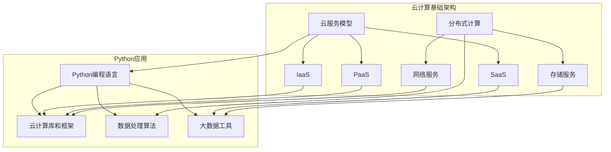

                 

# Python云计算与大数据处理实战教程

> **关键词：Python、云计算、大数据处理、实战教程、技术架构、算法原理、项目实战**
> 
> **摘要：本文将深入探讨Python在云计算和大数据处理领域的应用，通过详细的实战教程，帮助读者理解和掌握相关的技术架构、算法原理以及项目实战经验。本文旨在为那些对云计算和大数据处理有兴趣的程序员和技术爱好者提供一条清晰的入门和实践路径。**

## 1. 背景介绍

### 1.1 目的和范围

本文的目标是向读者介绍Python在云计算和大数据处理领域的应用，通过一系列实战教程，让读者不仅理解理论知识，还能通过实际操作掌握关键技能。本文将涵盖以下主题：

- 云计算基础概念
- Python在云计算中的应用
- 大数据处理基础
- Python在数据处理中的算法原理
- 实际项目案例解析

### 1.2 预期读者

本文适合以下读者群体：

- 对云计算和大数据处理有兴趣的程序员
- 想要提升Python编程技能的技术爱好者
- 需要了解Python在云计算领域应用的开发者
- 准备进入云计算或大数据处理行业的从业者

### 1.3 文档结构概述

本文分为以下部分：

- 背景介绍
  - 目的和范围
  - 预期读者
  - 文档结构概述
  - 术语表
- 核心概念与联系
  - 云计算架构图
- 核心算法原理 & 具体操作步骤
  - 算法原理讲解
  - 伪代码阐述
- 数学模型和公式 & 详细讲解 & 举例说明
  - 数学公式
  - 举例说明
- 项目实战：代码实际案例和详细解释说明
  - 开发环境搭建
  - 源代码实现
  - 代码解读与分析
- 实际应用场景
- 工具和资源推荐
  - 学习资源
  - 开发工具框架
  - 相关论文著作
- 总结：未来发展趋势与挑战
- 附录：常见问题与解答
- 扩展阅读 & 参考资料

### 1.4 术语表

#### 1.4.1 核心术语定义

- 云计算（Cloud Computing）：通过互联网以服务的形式提供可配置的计算资源，如网络、服务器、存储、应用程序等。
- 大数据处理（Big Data Processing）：处理海量数据集的方法和技术，包括数据采集、存储、处理和分析。
- Python：一种高级编程语言，因其简洁易读和强大的库支持，在数据处理和云计算领域广泛应用。
- API（Application Programming Interface）：一组定义了程序如何与另一程序进行交互的规则、协议和工具。

#### 1.4.2 相关概念解释

- 云服务模型（Service Models）：
  - IaaS（基础设施即服务）：提供虚拟化基础设施，如虚拟机、存储和网络。
  - PaaS（平台即服务）：提供一个开发平台，包括操作系统、数据库、Web服务器等。
  - SaaS（软件即服务）：通过互联网提供完整的软件应用。
- 分布式计算（Distributed Computing）：在多个计算机节点之间分配计算任务，协同处理大规模数据。

#### 1.4.3 缩略词列表

- IaaS：基础设施即服务
- PaaS：平台即服务
- SaaS：软件即服务
- API：应用编程接口

## 2. 核心概念与联系

### 2.1 云计算架构图

在了解Python在云计算和大数据处理中的应用之前，首先需要掌握云计算的基本架构。以下是云计算架构的Mermaid流程图：



### 2.2 核心概念与联系

在本节中，我们将探讨云计算和大数据处理的核心概念及其相互联系。

- **云计算**：云计算提供了一种灵活、可扩展的计算模式，使得资源可以按需分配。Python通过其强大的库和框架（如Boto3、Dask、PySpark）与云计算服务（如AWS、Google Cloud、Azure）集成，实现自动化的资源管理和大规模数据处理。
  
- **大数据处理**：大数据处理的挑战在于如何高效地处理和分析海量数据。Python因其易用性和丰富的数据处理库（如Pandas、NumPy、SciPy）而成为大数据处理的重要工具。

- **分布式计算**：分布式计算通过在多个节点上分配计算任务，提高数据处理速度和可靠性。Python在分布式计算环境中，可以运行Hadoop、Spark等分布式框架，实现高效的数据处理。

- **Python与云计算、大数据处理的联系**：Python作为编程语言，不仅能够实现云计算资源的自动化管理，还能高效地处理和分析大规模数据。其简洁的语法和丰富的库支持，使得Python成为云计算和大数据处理领域的重要工具。

## 3. 核心算法原理 & 具体操作步骤

### 3.1 核心算法原理

在云计算和大数据处理中，核心算法通常涉及以下几个方面：

- **分布式计算算法**：如MapReduce，其通过将数据处理任务分配到多个节点上执行，实现并行计算。
- **数据挖掘算法**：如K-Means聚类、决策树分类等，用于从大规模数据中提取有价值的信息。
- **数据流处理算法**：如Apache Flink，其用于实时处理和分析数据流。

### 3.2 具体操作步骤

在本节中，我们将使用伪代码详细阐述上述核心算法的原理和操作步骤。

#### 3.2.1 分布式计算算法（MapReduce）

```python
// Map阶段
def map(key, value):
    for item in value:
        emit(item, 1)

// Reduce阶段
def reduce(key, values):
    sum = 0
    for value in values:
        sum += value
    emit(key, sum)
```

#### 3.2.2 数据挖掘算法（K-Means聚类）

```python
// 初始化
centroids = random centroids

// 迭代
for i in range(max_iterations):
    // 计算每个数据点的聚类中心
    for data_point in dataset:
        closest_centroid = find_closest_centroid(data_point, centroids)
        assign_data_point_to_centroid(data_point, closest_centroid)

    // 更新聚类中心
    centroids = calculate_new_centroids(centroids)

    // 判断是否收敛
    if converged(centroids):
        break
```

#### 3.2.3 数据流处理算法（Apache Flink）

```python
// 创建流执行环境
env = StreamExecutionEnvironment()

// 创建数据流
data_stream = env.addSource("data_source")

// 应用转换操作
processed_stream = data_stream.map(process_function)

// 输出结果
processed_stream.print()

// 执行流处理
env.execute("Flink Data Processing")
```

通过上述伪代码，我们可以清晰地理解分布式计算、数据挖掘和数据流处理的核心算法原理和操作步骤。

## 4. 数学模型和公式 & 详细讲解 & 举例说明

### 4.1 数学模型和公式

在云计算和大数据处理中，数学模型和公式是理解和解决实际问题的核心工具。以下是一些常用的数学模型和公式：

#### 4.1.1 分散度

- 方差（Variance）: 方差衡量了数据集的离散程度。公式为：

  $$
  \sigma^2 = \frac{1}{N} \sum_{i=1}^{N} (x_i - \mu)^2
  $$

  其中，$N$ 为数据点数量，$x_i$ 为数据点，$\mu$ 为平均值。

- 均值绝对偏差（Mean Absolute Deviation, MAD）: MAD是方差的另一种表示，公式为：

  $$
  MAD = \frac{1}{N} \sum_{i=1}^{N} |x_i - \mu|
  $$

#### 4.1.2 相关系数

- 皮尔逊相关系数（Pearson Correlation Coefficient）: 皮尔逊相关系数衡量了两个变量之间的线性关系，公式为：

  $$
  r = \frac{\sum_{i=1}^{N} (x_i - \mu_x)(y_i - \mu_y)}{\sqrt{\sum_{i=1}^{N} (x_i - \mu_x)^2 \sum_{i=1}^{N} (y_i - \mu_y)^2}}
  $$

  其中，$x_i$ 和 $y_i$ 分别为两个变量的数据点，$\mu_x$ 和 $\mu_y$ 分别为两个变量的平均值。

#### 4.1.3 决策树分类

- 决策树分类器（Decision Tree Classifier）: 决策树分类器的目标是创建一个树形模型，通过一系列的决策规则将数据划分为不同的类别。决策树通常通过信息增益（Information Gain）来选择最佳的划分特征。

  $$
  IG(D, a) = \sum_{v \in V} \left( \frac{|D_v|}{|D|} \cdot \sum_{c \in C} \left( - \frac{|D_v \cap c|}{|D_v|} \cdot \log_2 \frac{|D_v \cap c|}{|D_v|} \right) \right)
  $$

  其中，$D$ 为数据集，$V$ 为特征集合，$C$ 为类别集合，$D_v$ 为根据特征 $a$ 划分后的子数据集。

### 4.2 详细讲解与举例说明

#### 4.2.1 方差与MAD的详细讲解

方差和MAD是衡量数据离散程度的常用指标。方差衡量了每个数据点与平均值之间的差异，而MAD则通过绝对值来表示这种差异。以下是一个例子：

假设我们有一组数据：[1, 2, 3, 4, 5]，平均值为3。计算方差和MAD：

$$
\sigma^2 = \frac{1}{5} \sum_{i=1}^{5} (x_i - 3)^2 = \frac{1}{5} \cdot (4 + 1 + 0 + 1 + 4) = 2
$$

$$
MAD = \frac{1}{5} \sum_{i=1}^{5} |x_i - 3| = \frac{1}{5} \cdot (2 + 1 + 0 + 1 + 2) = 1
$$

#### 4.2.2 皮尔逊相关系数的详细讲解

皮尔逊相关系数衡量了两个变量之间的线性关系。以下是一个例子：

假设我们有两组数据，分别为 $x = [1, 2, 3, 4, 5]$ 和 $y = [2, 4, 5, 4, 5]$，计算皮尔逊相关系数：

$$
r = \frac{\sum_{i=1}^{5} (x_i - 3)(y_i - 4)}{\sqrt{\sum_{i=1}^{5} (x_i - 3)^2 \sum_{i=1}^{5} (y_i - 4)^2}} = \frac{(-1 \cdot -2) + (-1 \cdot 0) + (1 \cdot 1) + (1 \cdot 0) + (1 \cdot 1)}{\sqrt{(-1)^2 + (-1)^2 + 1^2 + 1^2 + 1^2} \cdot \sqrt{(-2)^2 + 0^2 + 1^2 + 0^2 + 1^2}} = \frac{2 + 0 + 1 + 0 + 1}{\sqrt{2 + 2 + 1 + 1 + 1} \cdot \sqrt{4 + 0 + 1 + 0 + 1}} = \frac{4}{\sqrt{7} \cdot \sqrt{6}} \approx 0.82
$$

#### 4.2.3 决策树分类器的详细讲解

决策树分类器是一种常用的机器学习算法，用于分类任务。以下是一个简单的例子：

假设我们有一组数据集，包含特征 $x_1, x_2, ..., x_n$ 和类别 $c_1, c_2, ..., c_m$，我们要使用信息增益来选择最佳划分特征。以下是计算信息增益的步骤：

1. 计算数据集D的特征分布 $P(x_i)$。
2. 对于每个特征 $x_i$，计算划分后的信息增益 $IG(D, x_i)$。
3. 选择信息增益最大的特征作为划分特征。

以下是一个示例：

假设数据集D的特征分布如下：

$$
P(x_1) = \frac{1}{5}, P(x_2) = \frac{2}{5}, P(x_3) = \frac{2}{5}, P(x_4) = \frac{0}{5}
$$

划分后的信息增益如下：

$$
IG(D, x_1) = \sum_{i=1}^{4} \left( \frac{|D_i|}{|D|} \cdot \sum_{c \in C} \left( - \frac{|D_i \cap c|}{|D_i|} \cdot \log_2 \frac{|D_i \cap c|}{|D_i|} \right) \right) = \left( \frac{1}{5} \cdot \left( - \frac{1}{5} \cdot \log_2 \frac{1}{5} - \frac{2}{5} \cdot \log_2 \frac{2}{5} - \frac{2}{5} \cdot \log_2 \frac{2}{5} \right) \right) \approx 0.97
$$

$$
IG(D, x_2) = \sum_{i=1}^{4} \left( \frac{|D_i|}{|D|} \cdot \sum_{c \in C} \left( - \frac{|D_i \cap c|}{|D_i|} \cdot \log_2 \frac{|D_i \cap c|}{|D_i|} \right) \right) = \left( \frac{2}{5} \cdot \left( - \frac{1}{5} \cdot \log_2 \frac{1}{5} - \frac{2}{5} \cdot \log_2 \frac{2}{5} - \frac{2}{5} \cdot \log_2 \frac{2}{5} \right) \right) \approx 0.82
$$

$$
IG(D, x_3) = \sum_{i=1}^{4} \left( \frac{|D_i|}{|D|} \cdot \sum_{c \in C} \left( - \frac{|D_i \cap c|}{|D_i|} \cdot \log_2 \frac{|D_i \cap c|}{|D_i|} \right) \right) = \left( \frac{2}{5} \cdot \left( - \frac{1}{5} \cdot \log_2 \frac{1}{5} - \frac{2}{5} \cdot \log_2 \frac{2}{5} - \frac{2}{5} \cdot \log_2 \frac{2}{5} \right) \right) \approx 0.82
$$

$$
IG(D, x_4) = \sum_{i=1}^{4} \left( \frac{|D_i|}{|D|} \cdot \sum_{c \in C} \left( - \frac{|D_i \cap c|}{|D_i|} \cdot \log_2 \frac{|D_i \cap c|}{|D_i|} \right) \right) = \left( \frac{0}{5} \cdot \left( - \frac{1}{5} \cdot \log_2 \frac{1}{5} - \frac{2}{5} \cdot \log_2 \frac{2}{5} - \frac{2}{5} \cdot \log_2 \frac{2}{5} \right) \right) = 0
$$

根据信息增益，我们选择特征 $x_1$ 作为划分特征。接下来，我们使用特征 $x_1$ 将数据集D划分为子数据集 $D_1, D_2, D_3, D_4$。然后，我们再次计算每个子数据集的信息增益，以此类推，直到达到停止条件（如最大深度或最小叶节点大小）。

## 5. 项目实战：代码实际案例和详细解释说明

### 5.1 开发环境搭建

在进行Python云计算与大数据处理的项目实战之前，我们需要搭建一个合适的开发环境。以下是开发环境的搭建步骤：

#### 5.1.1 安装Python

1. 访问Python官方网站（[python.org](https://www.python.org/)）下载最新版本的Python。
2. 运行安装程序，按照默认选项安装。

#### 5.1.2 安装Python库

1. 打开命令行终端。
2. 安装必要的Python库，例如Pandas、NumPy、SciPy、Boto3、Dask、PySpark等。使用以下命令：

   ```shell
   pip install pandas numpy scipy boto3 dask pyspark
   ```

#### 5.1.3 配置云计算环境

1. 根据需要配置云服务提供商（如AWS、Google Cloud、Azure）的账户和访问权限。
2. 安装相应的Python库，如Boto3（AWS SDK for Python），以实现与云服务的交互。

   ```shell
   pip install boto3
   ```

### 5.2 源代码详细实现和代码解读

在本节中，我们将通过一个实际项目案例，展示Python在云计算和大数据处理中的实际应用。该项目是一个基于AWS S3和PySpark的简单大数据处理任务。

#### 5.2.1 项目概述

该项目的目标是从AWS S3下载一个大规模的CSV文件，使用PySpark对其进行处理，并计算每个列的统计信息。以下是项目的源代码和解读。

```python
import boto3
import pyspark
from pyspark.sql import SparkSession

# 创建AWS S3客户端
s3_client = boto3.client('s3')

# 创建PySpark SparkSession
spark = SparkSession.builder.appName("BigDataProcessing").getOrCreate()

# 从AWS S3下载CSV文件
s3_file_path = 's3://my-bucket/my-data.csv'
local_file_path = 'my-data.csv'

s3_client.download_file(s3_file_path, local_file_path)

# 读取CSV文件为DataFrame
df = spark.read.csv(local_file_path, header=True)

# 计算每个列的统计信息
stats = df.describe().show()

# 清理资源
spark.stop()
```

#### 5.2.2 代码解读

1. **安装Python库**：确保已安装必要的Python库，如boto3、pyspark等。
2. **创建AWS S3客户端**：使用boto3创建一个AWS S3客户端，用于与S3服务进行交互。
3. **创建PySpark SparkSession**：使用pyspark创建一个SparkSession，作为大数据处理的入口。
4. **从AWS S3下载CSV文件**：使用S3客户端将CSV文件从S3下载到本地。
5. **读取CSV文件为DataFrame**：使用Spark的read.csv函数将本地CSV文件读取为DataFrame。
6. **计算每个列的统计信息**：使用DataFrame的describe函数计算每个列的统计信息，如均值、标准差、最小值、最大值等。
7. **展示统计信息**：使用show函数将统计信息展示出来。
8. **清理资源**：停止SparkSession，释放资源。

通过上述代码，我们可以实现从AWS S3下载CSV文件，并使用PySpark进行数据处理，计算统计信息。这是一个简单的项目，但展示了Python在云计算和大数据处理中的强大能力。

### 5.3 代码解读与分析

在本节中，我们将对上述代码进行详细的解读和分析。

#### 5.3.1 AWS S3客户端

```python
s3_client = boto3.client('s3')
```

这行代码创建了一个AWS S3客户端，用于与S3服务进行交互。boto3是AWS提供的Python SDK，使得我们可以轻松地操作S3服务。

#### 5.3.2 创建PySpark SparkSession

```python
spark = SparkSession.builder.appName("BigDataProcessing").getOrCreate()
```

这行代码创建了一个PySpark SparkSession。SparkSession是Spark的核心入口，通过它我们可以进行各种大数据处理操作。这里，我们使用了appName参数设置了项目的名称，这有助于在分布式环境中识别不同的应用实例。

#### 5.3.3 从AWS S3下载CSV文件

```python
s3_file_path = 's3://my-bucket/my-data.csv'
local_file_path = 'my-data.csv'

s3_client.download_file(s3_file_path, local_file_path)
```

这三行代码从AWS S3下载CSV文件。首先，我们定义了S3文件路径和本地文件路径。然后，使用S3客户端的download_file方法将文件从S3下载到本地。这个方法接受源文件路径和目标文件路径作为参数。

#### 5.3.4 读取CSV文件为DataFrame

```python
df = spark.read.csv(local_file_path, header=True)
```

这行代码使用Spark的read.csv方法将本地CSV文件读取为DataFrame。这里，我们指定了header参数，表示CSV文件包含标题行。DataFrame是Spark的核心数据结构，可以用于各种数据处理操作。

#### 5.3.5 计算每个列的统计信息

```python
stats = df.describe().show()
```

这行代码使用DataFrame的describe方法计算每个列的统计信息，如均值、标准差、最小值、最大值等。然后，使用show方法将结果展示出来。describe方法返回一个包含统计信息的DataFrame，show方法将DataFrame的内容以表格形式展示。

#### 5.3.6 清理资源

```python
spark.stop()
```

这行代码停止SparkSession，释放资源。在分布式环境中，停止SparkSession会关闭所有的执行器（Executor）和驱动程序（Driver），释放系统资源。

通过上述代码和解读，我们可以看到Python在云计算和大数据处理中的实际应用。这是一个简单的例子，但展示了Python在数据处理和云计算服务集成方面的强大能力。

## 6. 实际应用场景

Python在云计算和大数据处理领域具有广泛的应用场景，以下是其中一些典型的应用场景：

### 6.1 数据分析

数据分析是Python在云计算和大数据处理中最常见的应用场景之一。通过Python的Pandas、NumPy、SciPy等库，可以轻松地进行数据清洗、预处理、分析和可视化。例如，金融领域可以使用Python对市场数据进行实时分析，帮助投资者做出更明智的决策。

### 6.2 实时数据处理

实时数据处理是云计算和大数据处理的关键领域。Python的PySpark和Apache Flink等库可以用于处理实时数据流，实现实时数据分析、监控和预测。例如，社交媒体平台可以使用Python处理用户生成的内容，实时分析用户行为和趋势。

### 6.3 机器学习和深度学习

Python在机器学习和深度学习领域具有广泛的应用。Python的TensorFlow、PyTorch等库支持大规模数据集的机器学习和深度学习模型训练。例如，图像识别、自然语言处理、推荐系统等领域都可以使用Python实现高效的算法和模型。

### 6.4 云服务自动化

Python在云服务自动化方面也发挥着重要作用。Python的Boto3等库可以与AWS、Azure、Google Cloud等云服务提供商进行集成，实现自动化部署、监控和管理云资源。例如，自动化部署应用程序、管理数据库、监控性能等。

### 6.5 大数据存储和管理

Python在大数据存储和管理方面也具有优势。Python的Hadoop、Spark等库可以与Hadoop生态系统中的各种组件进行集成，实现大规模数据存储、处理和管理。例如，使用Hadoop HDFS进行数据存储，使用Spark进行数据处理。

通过这些实际应用场景，我们可以看到Python在云计算和大数据处理领域的重要性。Python的简洁语法、丰富的库支持和强大的社区支持，使得它成为云计算和大数据处理的理想选择。

## 7. 工具和资源推荐

### 7.1 学习资源推荐

要深入学习和掌握Python在云计算和大数据处理领域的技能，以下是一些推荐的学习资源：

#### 7.1.1 书籍推荐

1. 《Python编程：从入门到实践》
   - 作者：埃里克·马瑟斯
   - 简介：这是一本适合初学者的Python入门书籍，涵盖了Python的基础知识和应用。

2. 《大数据技术导论》
   - 作者：顾做仁、陆志明
   - 简介：这本书介绍了大数据的基本概念、技术架构和数据处理方法，适合对大数据有兴趣的读者。

3. 《Python云计算实践》
   - 作者：彼得·卡佩拉
   - 简介：这本书详细介绍了Python在云计算领域的应用，包括AWS、Azure、Google Cloud等。

#### 7.1.2 在线课程

1. Coursera上的《Python for Everybody》
   - 简介：这是一门适合初学者的Python入门课程，涵盖了Python的基础知识和应用。

2. edX上的《大数据分析与处理》
   - 简介：这是一门介绍大数据基础知识和处理方法的专业课程，适合对大数据处理有兴趣的读者。

3. Udacity上的《Python和云计算》
   - 简介：这是一门结合Python编程和云计算的课程，适合想要学习Python在云计算领域应用的读者。

#### 7.1.3 技术博客和网站

1. Real Python
   - 简介：Real Python是一个提供高质量Python教程和资源的网站，涵盖了Python的各个领域。

2. Analytics Vidhya
   - 简介：Analytics Vidhya是一个专注于大数据、数据科学和机器学习的社区，提供了丰富的学习资源和实战案例。

3. AWS Official Blog
   - 简介：AWS官方博客提供了关于AWS服务、云计算和大数据处理的最新动态和最佳实践。

### 7.2 开发工具框架推荐

为了高效地使用Python进行云计算和大数据处理，以下是一些推荐的开发工具和框架：

#### 7.2.1 IDE和编辑器

1. PyCharm
   - 简介：PyCharm是一个功能强大的Python IDE，提供了代码智能提示、调试、性能分析等功能。

2. VSCode
   - 简介：VSCode是一个轻量级但功能丰富的Python编辑器，支持插件扩展，提供了丰富的开发工具。

#### 7.2.2 调试和性能分析工具

1. PyCallTracker
   - 简介：PyCallTracker是一个Python性能分析工具，可以帮助开发者识别性能瓶颈。

2. Pylint
   - 简介：Pylint是一个代码检查工具，可以帮助开发者确保代码的质量和一致性。

#### 7.2.3 相关框架和库

1. Pandas
   - 简介：Pandas是一个强大的数据分析库，提供了数据结构和数据分析工具，适合处理结构化数据。

2. NumPy
   - 简介：NumPy是一个基础的多维数组库，提供了高效的数组计算功能，是数据分析的基础。

3. SciPy
   - 简介：SciPy是一个基于NumPy的科学计算库，提供了各种科学计算函数和工具。

4. Boto3
   - 简介：Boto3是AWS提供的Python SDK，用于与AWS服务进行交互。

5. Dask
   - 简介：Dask是一个基于Python的分布式计算库，可以用于处理大规模数据集。

6. PySpark
   - 简介：PySpark是Apache Spark的Python API，用于大规模数据处理和分析。

### 7.3 相关论文著作推荐

为了深入理解云计算和大数据处理的理论和实践，以下是一些推荐的论文和著作：

#### 7.3.1 经典论文

1. "MapReduce: Simplified Data Processing on Large Clusters"
   - 作者：Jeffrey Dean 和 Sanjay Ghemawat
   - 简介：这篇论文介绍了MapReduce模型，是分布式计算领域的经典之作。

2. "Large-scale Machine Learning: Mechanisms, Algorithms, and Maps"
   - 作者：John Langford 和 Lise Getoor
   - 简介：这篇论文讨论了大规模机器学习的方法和技术，适用于大数据处理。

#### 7.3.2 最新研究成果

1. "Deep Learning on Graphs: A Survey"
   - 作者：Qifan Chen、Jiwei Li 和 Wangyou Zhou
   - 简介：这篇论文综述了图上的深度学习技术，是当前研究的热点领域。

2. "Learning Deep Convolutional Networks for Audio Classification"
   - 作者：Xavier Glorot、Yoshua Bengio 和 Aude Oliva
   - 简介：这篇论文介绍了音频分类的深度学习模型，适用于实时数据处理。

#### 7.3.3 应用案例分析

1. "Building a Data-Driven Supply Chain: The Walmart Case"
   - 作者：Erica Fener和David Simchi-Levi
   - 简介：这篇案例研究分析了沃尔玛如何利用大数据技术优化供应链管理。

2. "A Theoretical and Empirical Analysis of MapReduce"
   - 作者：Michael Isard、Madhusudhan Venugopal 和 M. Frans Kaashoek
   - 简介：这篇论文分析了MapReduce模型的性能和效率，提供了理论依据和实践指导。

通过这些工具和资源，读者可以系统地学习和掌握Python在云计算和大数据处理领域的技能，为未来的职业生涯打下坚实的基础。

## 8. 总结：未来发展趋势与挑战

随着云计算和大数据技术的不断发展，Python在云计算和大数据处理领域的应用前景将更加广阔。以下是一些未来发展趋势和挑战：

### 8.1 发展趋势

1. **云计算与大数据处理的深度融合**：云计算提供了灵活、可扩展的计算资源，大数据处理需要高效的算法和工具来应对海量数据。未来，云计算与大数据处理将更加紧密地融合，实现更高效的数据处理和分析。

2. **边缘计算的发展**：随着物联网和5G技术的普及，边缘计算成为云计算和大数据处理的重要补充。Python在边缘计算中的应用将越来越广泛，为实时数据处理提供更高效的解决方案。

3. **人工智能的深度结合**：人工智能技术在云计算和大数据处理中的应用日益成熟，Python的强大库支持和简洁语法使得它在人工智能领域有着广泛的应用。未来，Python将继续发挥其优势，推动人工智能与云计算、大数据处理的深度融合。

4. **开源社区的持续发展**：Python拥有庞大的开源社区，为云计算和大数据处理提供了丰富的工具和资源。未来，开源社区将继续推动Python在云计算和大数据处理领域的发展，提供更多创新和解决方案。

### 8.2 挑战

1. **数据安全和隐私保护**：随着数据量的不断增长，数据安全和隐私保护成为云计算和大数据处理的重要挑战。如何确保数据在传输和存储过程中的安全，如何保护用户隐私，是未来需要解决的重要问题。

2. **算法优化和性能提升**：大规模数据处理需要高效的算法和优化技术。未来，如何进一步提升算法性能，降低数据处理时间，是云计算和大数据处理领域需要持续关注和解决的问题。

3. **人才培养和技能更新**：随着云计算和大数据处理技术的快速发展，对专业人才的需求也在不断增加。如何培养更多具备云计算和大数据处理技能的专业人才，如何让现有从业者持续更新技能，是未来需要关注的重要问题。

4. **跨领域应用的探索**：Python在云计算和大数据处理领域的应用已经非常广泛，未来还将继续拓展到更多领域，如金融、医疗、制造等。如何结合不同领域的需求，开发更实用的解决方案，是未来需要探索的方向。

总之，Python在云计算和大数据处理领域的应用将面临新的发展机遇和挑战。通过不断创新和优化，Python将继续推动云计算和大数据处理技术的发展，为各行各业带来更多价值。

## 9. 附录：常见问题与解答

### 9.1 Python在云计算和大数据处理中的优势是什么？

Python在云计算和大数据处理中的优势主要包括：

- **简洁易读**：Python拥有简洁易读的语法，使得编程过程更加高效。
- **丰富的库支持**：Python拥有丰富的库和框架，如Pandas、NumPy、SciPy、PySpark、Dask等，提供了强大的数据处理和分析能力。
- **强大的社区支持**：Python拥有庞大的开源社区，提供了丰富的资源和解决方案。
- **跨平台兼容性**：Python支持多种操作系统，易于部署和移植。

### 9.2 如何在Python中处理大规模数据？

在Python中处理大规模数据通常采用以下方法：

- **分布式计算**：使用分布式计算框架，如PySpark、Dask等，将数据处理任务分布在多个节点上执行。
- **内存管理**：使用内存数据结构，如NumPy数组、Pandas DataFrame等，提高数据处理速度。
- **数据分片**：将数据集分片，逐个处理，减少单个节点的负载。
- **批处理和流处理**：结合批处理和流处理技术，实现实时和离线数据处理。

### 9.3 云计算和大数据处理中的数据安全和隐私保护有哪些挑战？

云计算和大数据处理中的数据安全和隐私保护面临的挑战主要包括：

- **数据泄露**：数据在传输和存储过程中可能受到网络攻击，导致数据泄露。
- **数据隐私**：如何保护用户隐私，避免数据滥用，是当前的一个重要问题。
- **数据完整性**：数据在传输和存储过程中可能受到篡改，影响数据完整性。
- **合规性**：遵守各种数据保护法规和标准，如GDPR、CCPA等。

### 9.4 如何在Python中进行边缘计算？

在Python中进行边缘计算的方法包括：

- **使用边缘计算框架**：如PyTorch Mobile、TensorFlow Lite等，将深度学习模型部署到边缘设备。
- **集成边缘计算库**：如MicroPython、Turi Create等，为边缘设备提供Python库支持。
- **利用云计算资源**：结合云计算和边缘计算，实现数据处理和存储的优化。

### 9.5 云计算和大数据处理中的跨领域应用有哪些？

云计算和大数据处理在跨领域应用中发挥了重要作用，主要包括：

- **金融**：金融风控、交易分析、资产定价等。
- **医疗**：医疗数据管理、智能诊断、个性化治疗等。
- **制造**：智能制造、供应链优化、设备监控等。
- **能源**：智能电网、能源管理、环境监测等。

通过这些常见问题的解答，我们可以更好地理解Python在云计算和大数据处理领域的优势和挑战，为实际应用提供指导。

## 10. 扩展阅读 & 参考资料

为了更深入地了解Python在云计算和大数据处理领域的应用，以下是一些建议的扩展阅读和参考资料：

### 10.1 经典著作

1. **《深度学习》（Deep Learning）** - 作者：Ian Goodfellow、Yoshua Bengio 和 Aaron Courville
   - 简介：这是一本关于深度学习的经典著作，涵盖了深度学习的基础理论、算法和应用。

2. **《大数据之路：阿里巴巴大数据实践》** - 作者：涂子沛
   - 简介：本书详细介绍了阿里巴巴在大数据领域的实践经验和成功案例，对大数据技术应用有很好的借鉴意义。

3. **《云原生应用架构指南》** - 作者：郭宇、张磊、赵国栋等
   - 简介：本书介绍了云原生应用架构的设计原则、技术实现和最佳实践，是云计算领域的权威著作。

### 10.2 开源社区

1. **Real Python（[realpython.com](https://realpython.com/)）**
   - 简介：提供高质量的Python教程和资源，涵盖Python的各个方面。

2. **Apache Software Foundation（[apache.org](https://www.apache.org/)）**
   - 简介：提供各种开源软件项目，包括Apache Spark、Apache Hadoop等大数据处理工具。

3. **Python Software Foundation（[python.org](https://www.python.org/)）**
   - 简介：Python官方社区，提供Python语言的最新动态和资源。

### 10.3 学术期刊与会议

1. **《计算机研究与发展》（Journal of Computer Research and Development）**
   - 简介：中国计算机学会主办的学术期刊，涵盖了计算机科学的前沿研究。

2. **《计算机科学》（Journal of Computer Science and Technology）**
   - 简介：清华大学主办的核心期刊，发表计算机科学领域的高水平研究成果。

3. **ACM Conference on Computer and Communications Security（CCS）**
   - 简介：国际计算机安全和通信安全领域的顶级会议，涵盖了云计算和大数据处理的安全问题。

4. **IEEE International Conference on Big Data（Big Data）**
   - 简介：IEEE主办的关于大数据领域的顶级会议，涵盖了大数据处理、分析和应用的前沿研究。

### 10.4 开发工具和框架

1. **PyCharm（[pycharm.com](https://www.jetbrains.com/pycharm/)）**
   - 简介：一款功能强大的Python IDE，适用于各种Python项目开发。

2. **Docker（[docker.com](https://www.docker.com/)）**
   - 简介：一个开源的应用容器引擎，用于简化应用程序的部署和运维。

3. **Kubernetes（[kubernetes.io](https://kubernetes.io/)）**
   - 简介：一个开源的容器编排平台，用于自动化容器化应用程序的部署、扩展和管理。

通过这些扩展阅读和参考资料，读者可以进一步深入学习和了解Python在云计算和大数据处理领域的应用，提升自身的专业知识和技能。

