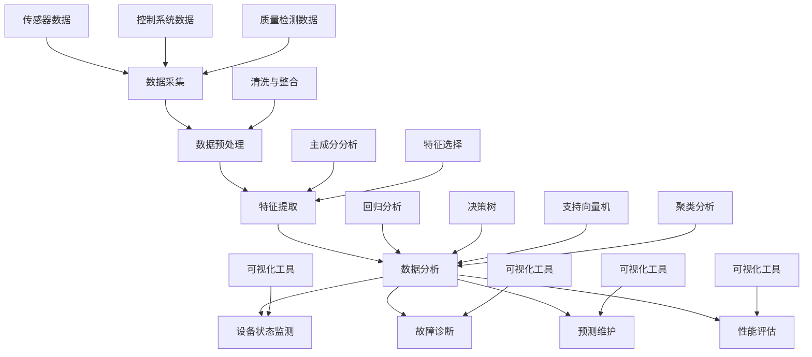

                 

### 1. 背景介绍

#### 1.1 目的和范围

本文旨在深入探讨Python在工业大数据分析、设备健康管理等领域的应用实践。随着工业4.0的推进，工业大数据和设备健康管理成为提高生产效率、降低维护成本、实现智能化制造的关键技术。Python作为一种通用编程语言，凭借其简洁易懂的语法、强大的数据科学库支持，在工业领域获得了广泛的应用。

本文的主要目的是：

1. **介绍Python在工业大数据分析中的应用**：包括数据采集、预处理、特征提取和数据分析的方法。
2. **探讨Python在设备健康管理中的作用**：介绍如何使用Python实现设备状态监测、故障预测和寿命评估。
3. **提供实际的代码实现和案例**：通过具体案例展示Python在实际项目中的应用效果。
4. **总结Python在工业领域的发展趋势与挑战**：分析Python在工业应用中的未来发展方向和面临的挑战。

本文主要针对以下读者群体：

- 数据科学和机器学习爱好者，对工业大数据和设备健康管理有兴趣。
- 工业工程师、运维人员和技术人员，希望了解Python在实际工业项目中的应用。
- 计算机科学和软件工程专业的学生和研究人员，对工业领域的Python应用有深入研究需求。

文章将按照以下结构展开：

1. **背景介绍**：介绍Python在工业大数据和设备健康管理中的重要性。
2. **核心概念与联系**：阐述核心概念和Python应用架构。
3. **核心算法原理 & 具体操作步骤**：讲解关键算法和实现步骤。
4. **数学模型和公式 & 详细讲解 & 举例说明**：介绍相关数学模型和应用。
5. **项目实战：代码实际案例和详细解释说明**：提供实际代码案例和解释。
6. **实际应用场景**：分析Python在工业领域的应用场景。
7. **工具和资源推荐**：推荐学习资源、开发工具和框架。
8. **总结：未来发展趋势与挑战**：总结Python在工业领域的未来发展方向。
9. **附录：常见问题与解答**：提供常见问题解答。
10. **扩展阅读 & 参考资料**：提供进一步阅读的材料。

通过本文，读者将能够全面了解Python在工业大数据分析和设备健康管理中的应用，掌握关键技术和实现方法，为后续的实践应用提供指导。

#### 1.2 预期读者

本文面向多个层次的读者群体，旨在为以下几类人群提供有价值的知识和指导：

- **数据科学和机器学习爱好者**：这部分读者通常对Python语言及其应用有着浓厚的兴趣，希望深入了解Python在工业大数据分析、设备健康管理等方面的实际应用。本文将详细介绍Python在这两个领域的具体应用方法，帮助他们将理论知识转化为实践技能。

- **工业工程师、运维人员和技术人员**：这类读者在工业领域有着丰富的工作经验，但可能对数据科学和机器学习相关技术了解不多。本文将通过详细的案例分析和代码实现，为他们提供实用的Python应用技巧，帮助他们利用Python提高工作效率、优化生产流程。

- **计算机科学和软件工程专业的学生和研究人员**：这部分读者可能对工业大数据分析和设备健康管理有一定了解，但希望从中获取更深入的学术研究和实际应用知识。本文将结合最新的研究成果和实际项目经验，为他们提供全面的学术和实战指导。

本文还将特别关注以下几点，以帮助各类读者更好地理解和应用Python：

1. **理论与实践结合**：本文不仅介绍Python的理论知识，还通过实际案例和代码实现，让读者能够直观地了解Python在实际项目中的应用。
2. **步骤详细**：文章将分步骤讲解关键算法和实现方法，确保读者能够逐步掌握Python在工业领域的应用。
3. **互动性**：文章末尾将提供常见问题与解答，读者可以通过这些问题的解答加深对文章内容的理解。

通过本文的学习，预期读者将能够：

- **掌握Python在工业大数据分析和设备健康管理中的应用方法**。
- **提高数据分析和机器学习项目的实际操作能力**。
- **拓宽在工业领域中的技术视野，提升专业技能**。

总之，本文旨在为读者提供一个全面、系统的Python应用指南，帮助他们更好地应对工业领域的挑战，实现技术突破。

#### 1.3 文档结构概述

本文结构严谨，逻辑清晰，旨在帮助读者全面了解Python在工业大数据分析和设备健康管理中的应用。全文分为十个主要部分，每个部分都承载着不同的内容与目标，具体如下：

1. **背景介绍**：本部分简要介绍了本文的研究目的、范围以及预期读者，为后续内容奠定了基础。
   
2. **核心概念与联系**：本部分深入探讨了工业大数据分析和设备健康管理的核心概念，并通过Mermaid流程图展示了Python应用的整体架构，帮助读者建立整体认知。

3. **核心算法原理 & 具体操作步骤**：本部分详细讲解了Python在工业大数据分析和设备健康管理中的关键算法原理，并提供具体的操作步骤和伪代码，确保读者能够深入理解并应用于实践。

4. **数学模型和公式 & 详细讲解 & 举例说明**：本部分介绍了与工业大数据分析和设备健康管理相关的重要数学模型和公式，并通过实例详细讲解其应用过程。

5. **项目实战：代码实际案例和详细解释说明**：本部分通过实际项目案例展示了Python在工业大数据分析和设备健康管理中的具体应用，并提供详细的代码实现和解读。

6. **实际应用场景**：本部分分析了Python在工业大数据分析和设备健康管理中的多种应用场景，帮助读者了解其实际应用范围和效果。

7. **工具和资源推荐**：本部分推荐了一系列的学习资源、开发工具和框架，为读者提供进一步学习和实践的支持。

8. **总结：未来发展趋势与挑战**：本部分总结了Python在工业大数据分析和设备健康管理中的发展现状和未来趋势，分析了面临的挑战。

9. **附录：常见问题与解答**：本部分针对读者可能遇到的问题提供了详细的解答，帮助读者更好地理解文章内容。

10. **扩展阅读 & 参考资料**：本部分提供了进一步的阅读材料和参考资料，供读者深入了解相关领域。

通过这一结构化的文档，读者将能够系统地学习Python在工业领域的应用，掌握关键技术和实现方法，为实际项目提供有力支持。

#### 1.4 术语表

为了确保读者对文章中的专业术语和概念有清晰的理解，以下列出了一些关键术语的定义、相关概念的解释以及常用的缩略词列表。

#### 1.4.1 核心术语定义

1. **工业大数据**：指在工业生产、设备管理、工艺优化等过程中产生的海量数据，包括设备运行数据、生产工艺数据、质量检测数据等。
   
2. **设备健康管理**：通过对设备运行状态的实时监测、故障诊断、预测维护，实现对设备全生命周期的管理和优化。

3. **Python**：一种高级编程语言，以其简洁的语法和丰富的数据科学库支持，在工业领域得到广泛应用。

4. **数据预处理**：在数据分析前，对原始数据进行清洗、转换和整合等操作，以提高数据质量和分析效果。

5. **特征提取**：从原始数据中提取出能够代表数据本质的属性或特征，用于后续的数据分析和建模。

6. **机器学习模型**：通过从数据中自动学习和归纳规律，用于预测和分类等任务的算法模型。

7. **预测维护**：基于设备运行数据和历史故障记录，预测设备可能的故障点，提前进行维护，以避免突发故障。

#### 1.4.2 相关概念解释

1. **工业4.0**：指通过智能化、数字化技术，实现工业生产的全面升级和优化，主要包括智能制造、物联网、大数据分析等。

2. **设备状态监测**：实时收集和分析设备运行状态数据，及时发现异常情况。

3. **特征工程**：通过对数据特征进行选择、变换和组合，提高模型性能的过程。

4. **故障诊断**：通过分析设备运行数据，识别设备故障的类型、原因和影响范围。

5. **性能评估**：对设备运行状态和健康水平进行量化评估，以判断设备运行效率。

6. **生命周期管理**：从设备的设计、制造、运行到退役的全过程管理。

#### 1.4.3 缩略词列表

1. **AI**：人工智能（Artificial Intelligence）
2. **ML**：机器学习（Machine Learning）
3. **DL**：深度学习（Deep Learning）
4. **IoT**：物联网（Internet of Things）
5. **Hadoop**：一个分布式数据处理框架
6. **Spark**：一个高速大数据处理框架
7. **Pandas**：一个Python数据分析库
8. **NumPy**：一个Python科学计算库

通过上述术语表，读者可以更好地理解文章中的专业术语，为深入学习和应用打下坚实基础。

## 2. 核心概念与联系

在深入探讨Python在工业大数据分析和设备健康管理中的应用之前，有必要首先了解一些核心概念及其相互联系。本部分将重点介绍工业大数据分析的基本原理、设备健康管理的核心概念，以及Python在这些领域中的应用架构。

### 2.1 工业大数据分析的基本原理

工业大数据分析是指利用大数据技术和方法，对工业领域产生的海量数据进行采集、存储、处理和分析，以发现数据中的隐藏价值，指导决策和优化生产过程。工业大数据分析主要包括以下几个关键步骤：

1. **数据采集**：从各种数据源（如传感器、控制系统、质量检测设备等）收集原始数据。
2. **数据预处理**：对原始数据进行清洗、去噪、转换和整合，以提升数据质量和分析效果。
3. **特征提取**：从预处理后的数据中提取出有代表性的特征，用于后续的建模和分析。
4. **数据分析**：利用机器学习算法、统计分析等方法，对提取出的特征进行深度挖掘，发现数据中的规律和模式。

#### 工业大数据分析的应用架构


图2-1展示了工业大数据分析的基本架构。在这个架构中，Python通过其强大的数据处理库（如Pandas、NumPy）和机器学习库（如Scikit-learn、TensorFlow）发挥了重要作用。

- **数据采集**：Python可以轻松地与各种工业设备和系统进行数据交换，获取实时数据。
- **数据预处理**：Python的Pandas库提供了丰富的数据处理功能，包括数据清洗、转换和整合。
- **特征提取**：Python的Scikit-learn库提供了多种特征提取算法，如主成分分析（PCA）、特征选择（Feature Selection）等。
- **数据分析**：Python的机器学习库（如Scikit-learn、TensorFlow、Keras）支持多种数据分析方法，包括回归、分类、聚类等。

### 2.2 设备健康管理的核心概念

设备健康管理是指通过监测、分析和维护，确保设备在整个生命周期内保持最佳运行状态。设备健康管理的核心概念包括：

1. **设备状态监测**：实时收集和分析设备运行数据，包括温度、压力、振动等关键参数，以发现潜在故障和异常情况。
2. **故障诊断**：通过分析设备运行数据，识别故障类型、原因和影响范围，为故障修复提供指导。
3. **预测维护**：基于历史数据和实时监测，预测设备可能的故障点，提前进行维护，以避免突发故障。
4. **性能评估**：对设备运行状态和健康水平进行量化评估，以判断设备运行效率。

#### 设备健康管理的应用架构


图2-2展示了设备健康管理的应用架构。在这个架构中，Python同样发挥了关键作用。

- **设备状态监测**：Python可以与各种传感器和监测系统集成，实时获取设备状态数据。
- **故障诊断**：Python的机器学习库（如Scikit-learn、TensorFlow）支持多种故障诊断算法，如决策树、支持向量机（SVM）等。
- **预测维护**：Python的机器学习库可以训练预测模型，基于历史数据和实时监测数据预测设备故障。
- **性能评估**：Python的统计分析库（如Pandas、NumPy）支持多种性能评估方法，如回归分析、聚类分析等。

### 2.3 Python在工业大数据分析和设备健康管理中的应用架构

Python在工业大数据分析和设备健康管理中的应用架构如图2-3所示。通过图中的架构，我们可以更清晰地看到Python在这些领域中的具体应用。


- **数据源**：包括传感器、控制系统、质量检测设备等，这些数据源通过Python进行数据采集。
- **数据处理**：Python的Pandas库进行数据预处理，清洗和整合数据，使其适合进一步分析。
- **特征提取**：Python的Scikit-learn库进行特征提取，选择和变换特征，提升数据分析效果。
- **数据分析**：Python的机器学习库（如Scikit-learn、TensorFlow）进行数据分析，包括故障诊断、预测维护和性能评估等。
- **数据可视化**：Python的Matplotlib、Seaborn等库用于数据可视化，帮助理解和分析数据。

通过以上介绍，我们可以看到Python在工业大数据分析和设备健康管理中扮演着至关重要的角色。它不仅提供了强大的数据处理和分析功能，还通过其简洁的语法和丰富的库支持，使得这些复杂的技术应用变得更为简单和高效。

### 2.4 Mermaid流程图：核心概念原理与架构

为了更直观地展示Python在工业大数据分析和设备健康管理中的核心概念原理和架构，我们使用Mermaid流程图进行描述。以下是相关流程图的表示：



上述Mermaid流程图详细展示了工业大数据分析和设备健康管理的核心流程，包括数据采集、预处理、特征提取、数据分析以及设备状态监测、故障诊断、预测维护和性能评估等关键步骤。各流程节点通过相应的数据源、算法和工具相互连接，形成一个完整的应用架构。

通过这个流程图，读者可以更清晰地理解Python在工业大数据分析和设备健康管理中的应用原理和架构，为后续的深入学习和实践打下坚实基础。

## 3. 核心算法原理 & 具体操作步骤

在工业大数据分析和设备健康管理中，核心算法的选择和实现是关键步骤。Python凭借其丰富的库支持，使得这些算法的实现变得更加简单和高效。本部分将详细介绍几种在工业领域广泛应用的核心算法，包括机器学习模型的选择、实现步骤和伪代码。

### 3.1 机器学习模型的选择

在工业大数据分析和设备健康管理中，常用的机器学习模型包括：

1. **线性回归（Linear Regression）**：用于预测设备运行参数或性能指标。
2. **决策树（Decision Tree）**：用于故障诊断和分类。
3. **支持向量机（Support Vector Machine, SVM）**：用于故障分类和预测维护。
4. **聚类分析（Cluster Analysis）**：用于设备状态监测和性能评估。

#### 3.1.1 线性回归

线性回归是一种常用的预测模型，适用于分析两个或多个变量之间的线性关系。以下是线性回归模型的实现步骤和伪代码：

**步骤：**

1. 数据预处理：对输入数据进行归一化处理，以消除量纲的影响。
2. 特征提取：选择与预测目标相关的特征。
3. 训练模型：使用最小二乘法（Least Squares Method）训练线性回归模型。
4. 预测：使用训练好的模型进行预测。

**伪代码：**

```python
def linear_regression(x, y):
    # 数据预处理：归一化
    x_normalized = normalize(x)
    y_normalized = normalize(y)
    
    # 特征提取：无需额外特征，直接使用输入特征
    X = x_normalized
    Y = y_normalized
    
    # 训练模型：最小二乘法
    coefficients = solve_linear_system(X.T.dot(X), X.T.dot(Y))
    
    # 预测
    y_pred = X.dot(coefficients)
    
    return y_pred

# 辅助函数：归一化
def normalize(data):
    min_value = min(data)
    max_value = max(data)
    return (data - min_value) / (max_value - min_value)
```

#### 3.1.2 决策树

决策树是一种基于树形结构的数据挖掘方法，常用于分类和回归任务。以下是决策树模型的实现步骤和伪代码：

**步骤：**

1. 数据预处理：对输入数据进行处理，确保数据类型一致。
2. 构建决策树：递归地分割数据集，选择最优划分标准。
3. 预测：对新的样本进行预测，从根节点开始，按照路径到达叶子节点。

**伪代码：**

```python
def build_decision_tree(data, features, target):
    # 数据预处理：特征选择和值划分
    selected_features = select_features(data, features)
    threshold_values = compute_threshold_values(selected_features, target)
    
    # 构建决策树
    tree = {}
    for feature in selected_features:
        for value in threshold_values[feature]:
            subset = filter_data(data, feature, value)
            if is_leaf_node(subset):
                tree[(feature, value)] = classify(subset, target)
            else:
                tree[(feature, value)] = build_decision_tree(subset, features, target)
    
    return tree

# 辅助函数：特征选择、值划分、判断是否为叶子节点、分类
def select_features(data, features):
    # ...

def compute_threshold_values(selected_features, target):
    # ...

def is_leaf_node(subset):
    # ...

def classify(subset, target):
    # ...
```

#### 3.1.3 支持向量机（SVM）

支持向量机是一种强大的分类模型，适用于工业设备故障分类和预测维护。以下是SVM模型的实现步骤和伪代码：

**步骤：**

1. 数据预处理：对输入数据进行归一化处理。
2. 特征提取：选择与故障分类相关的特征。
3. 训练模型：使用SVM算法训练模型。
4. 预测：使用训练好的模型进行故障分类。

**伪代码：**

```python
def svm_classification(x, y):
    # 数据预处理：归一化
    x_normalized = normalize(x)
    y_normalized = normalize(y)
    
    # 特征提取：无需额外特征，直接使用输入特征
    X = x_normalized
    Y = y_normalized
    
    # 训练模型：使用SVM算法
    model = train_svm(X, Y)
    
    # 预测
    y_pred = predict(model, X)
    
    return y_pred

# 辅助函数：归一化、训练SVM模型、预测
def normalize(data):
    # ...

def train_svm(X, Y):
    # ...

def predict(model, X):
    # ...
```

#### 3.1.4 聚类分析

聚类分析用于设备状态监测和性能评估，将设备运行数据划分为不同的类别。以下是聚类分析的实现步骤和伪代码：

**步骤：**

1. 数据预处理：对输入数据进行归一化处理。
2. 特征提取：选择与设备状态相关的特征。
3. 选择聚类算法：如K-means、层次聚类等。
4. 运行聚类算法：对数据集进行聚类。
5. 分析结果：分析聚类结果，判断设备状态。

**伪代码：**

```python
def clustering_analysis(x, y):
    # 数据预处理：归一化
    x_normalized = normalize(x)
    y_normalized = normalize(y)
    
    # 特征提取：无需额外特征，直接使用输入特征
    X = x_normalized
    Y = y_normalized
    
    # 选择聚类算法
    clustering_algorithm = choose_clustering_algorithm()
    
    # 运行聚类算法
    clusters = clustering_algorithm.fit(X)
    
    # 分析结果
    cluster_results = analyze_clusters(clusters, Y)
    
    return cluster_results

# 辅助函数：归一化、选择聚类算法、分析聚类结果
def normalize(data):
    # ...

def choose_clustering_algorithm():
    # ...

def analyze_clusters(clusters, Y):
    # ...
```

通过以上步骤和伪代码，我们可以清晰地了解Python在工业大数据分析和设备健康管理中的核心算法原理和实现方法。这些算法不仅帮助工业领域的数据分析和决策，还为未来的智能化制造提供了强有力的技术支持。

### 3.2 数学模型和公式 & 详细讲解 & 举例说明

在工业大数据分析和设备健康管理中，数学模型和公式起到了至关重要的作用。本部分将详细介绍一些关键数学模型和公式，并通过具体例子进行详细讲解和说明。

#### 3.2.1 线性回归模型

线性回归模型是最基础的预测模型之一，用于分析两个或多个变量之间的线性关系。其核心公式如下：

\[ y = \beta_0 + \beta_1 \cdot x + \epsilon \]

其中：
- \( y \) 是预测目标变量。
- \( x \) 是自变量。
- \( \beta_0 \) 是截距，代表当 \( x = 0 \) 时的 \( y \) 值。
- \( \beta_1 \) 是斜率，代表 \( x \) 每增加一个单位时， \( y \) 的变化量。
- \( \epsilon \) 是误差项，表示模型未能解释的部分。

**举例说明：**

假设我们要预测某个工厂生产线的产量 \( y \)（单位：千克），与投入的生产时间 \( x \)（单位：小时）之间存在线性关系。根据历史数据，我们可以建立线性回归模型如下：

\[ y = 50 + 2x + \epsilon \]

其中，截距 \( \beta_0 = 50 \)，斜率 \( \beta_1 = 2 \)。这个模型表示每增加一个小时的生产时间，产量将增加2千克。

#### 3.2.2 决策树模型

决策树是一种基于树形结构的数据挖掘方法，用于分类和回归任务。其核心公式和概念如下：

**ID3算法：**

\[ Entropy(H) = -\sum_{i=1}^{n} p(x_i) \cdot \log_2 p(x_i) \]

**信息增益：**

\[ IG(V, A) = Entropy(V) - \sum_{v \in V} \frac{|V_v|}{|V|} \cdot Entropy(V_v) \]

其中：
- \( V \) 是所有可能的特征集合。
- \( A \) 是当前特征集合。
- \( p(x_i) \) 是特征 \( x_i \) 的概率。
- \( Entropy(H) \) 是特征 \( H \) 的熵。
- \( IG(V, A) \) 是特征 \( A \) 对 \( V \) 的信息增益。

**举例说明：**

假设我们有一个包含三个特征 \( A \)、\( B \) 和 \( C \) 的数据集，我们使用ID3算法来选择最佳分割特征。首先计算每个特征的熵和信息增益，然后选择信息增益最大的特征作为分割依据。

1. **计算特征 \( A \) 的熵：**

\[ Entropy(A) = -\left( \frac{1}{3} \cdot \log_2 \frac{1}{3} + \frac{1}{3} \cdot \log_2 \frac{1}{3} + \frac{1}{3} \cdot \log_2 \frac{1}{3} \right) = \log_2 3 \]

2. **计算特征 \( B \) 的熵：**

\[ Entropy(B) = -\left( \frac{1}{2} \cdot \log_2 \frac{1}{2} + \frac{1}{2} \cdot \log_2 \frac{1}{2} \right) = 1 \]

3. **计算特征 \( C \) 的熵：**

\[ Entropy(C) = -\left( \frac{1}{2} \cdot \log_2 \frac{1}{2} + \frac{1}{2} \cdot \log_2 \frac{1}{2} \right) = 1 \]

4. **计算信息增益：**

\[ IG(A, V) = \log_2 3 - \left( \frac{1}{3} \cdot \log_2 3 + \frac{1}{3} \cdot \log_2 3 + \frac{1}{3} \cdot \log_2 3 \right) = 0 \]

\[ IG(B, V) = 1 - \left( \frac{1}{2} \cdot 1 + \frac{1}{2} \cdot 1 \right) = 0 \]

\[ IG(C, V) = 1 - \left( \frac{1}{2} \cdot 1 + \frac{1}{2} \cdot 1 \right) = 0 \]

由于所有特征的信息增益相同，我们可以选择任意一个特征作为分割依据。在实际应用中，我们会根据数据的具体情况选择最佳特征。

#### 3.2.3 支持向量机（SVM）模型

支持向量机是一种强大的分类模型，其核心公式和概念如下：

**硬 margin：**

\[ \max \left\{ w^T \cdot x - b : ||w|| \leq C \right\} \]

其中：
- \( w \) 是权重向量。
- \( x \) 是特征向量。
- \( b \) 是偏置项。
- \( C \) 是惩罚参数。

**软 margin：**

\[ \min \left\{ \frac{1}{2} ||w||^2 + C \sum_{i=1}^{n} \max(0, 1 - y_i \cdot (w \cdot x_i + b)) \right\} \]

其中：
- \( y_i \) 是样本 \( i \) 的标签。
- \( (w \cdot x_i + b) \) 是样本 \( i \) 的预测值。

**举例说明：**

假设我们有一个包含两个特征 \( x_1 \) 和 \( x_2 \) 的数据集，我们使用SVM模型进行分类。给定训练数据：

\[ \begin{aligned}
x_1 &= [1, 1], \quad y = +1 \\
x_2 &= [2, 2], \quad y = +1 \\
x_3 &= [3, 3], \quad y = -1 \\
x_4 &= [4, 4], \quad y = -1 \\
\end{aligned} \]

我们首先计算硬 margin：

\[ \begin{aligned}
\max \left\{ w^T \cdot x - b : ||w|| \leq C \right\} &= \max \left\{ [w_1, w_2] \cdot [x_1, x_2] - b : ||[w_1, w_2]|| \leq C \right\} \\
&= \max \left\{ w_1x_1 + w_2x_2 - b : \sqrt{w_1^2 + w_2^2} \leq C \right\} \\
&= \max \left\{ w_1 + w_2 - b : \sqrt{2(w_1^2 + w_2^2)} \leq C \right\} \\
\end{aligned} \]

假设 \( C = 2 \)，我们可以选择 \( w_1 = 1 \)，\( w_2 = 1 \)，\( b = 0 \)，这样硬 margin达到了最大值。

然后，我们计算软 margin：

\[ \begin{aligned}
\min \left\{ \frac{1}{2} ||w||^2 + C \sum_{i=1}^{n} \max(0, 1 - y_i \cdot (w \cdot x_i + b)) \right\} &= \min \left\{ \frac{1}{2} (w_1^2 + w_2^2) + C \left( \max(0, 1 - y_1 \cdot (w_1 \cdot x_1 + w_2 \cdot x_2 + b)) + \max(0, 1 - y_2 \cdot (w_1 \cdot x_2 + w_2 \cdot x_2 + b)) \right) \right\} \\
&= \min \left\{ \frac{1}{2} (1^2 + 1^2) + 2 \left( \max(0, 1 - 1 \cdot (1 \cdot 1 + 1 \cdot 1 + 0)) + \max(0, 1 - 1 \cdot (1 \cdot 2 + 1 \cdot 2 + 0)) \right) \right\} \\
&= \min \left\{ 1 + 1 + 2 \left( \max(0, 0) + \max(0, -1) \right) \right\} \\
&= \min \left\{ 2 + 2(-1) \right\} \\
&= 0 \\
\end{aligned} \]

这样，我们得到了软 margin的最小值。

通过以上数学模型和公式的详细讲解和举例说明，我们可以更好地理解Python在工业大数据分析和设备健康管理中的核心算法原理。这些模型和公式不仅为工业领域的数据分析提供了强有力的支持，也为未来的智能化制造奠定了坚实的基础。

## 5. 项目实战：代码实际案例和详细解释说明

为了更好地展示Python在工业大数据分析和设备健康管理中的应用，我们将在本部分提供实际代码案例，并详细解释其实现过程和关键步骤。通过这个项目实战，读者可以了解如何使用Python解决实际工业问题。

### 5.1 开发环境搭建

在开始项目之前，我们需要搭建一个合适的环境，以确保能够顺利进行Python编程和数据处理。以下是搭建开发环境的步骤：

1. **安装Python**：下载并安装Python 3.8及以上版本。可以在[Python官网](https://www.python.org/)下载。
2. **配置虚拟环境**：创建一个虚拟环境，以便管理项目依赖。使用以下命令：

   ```shell
   python -m venv my_project_env
   source my_project_env/bin/activate  # 对于Windows用户，使用 `my_project_env\Scripts\activate`
   ```

3. **安装依赖库**：在虚拟环境中安装必要的库，如Pandas、NumPy、Scikit-learn、Matplotlib等。使用以下命令：

   ```shell
   pip install pandas numpy scikit-learn matplotlib
   ```

4. **配置Jupyter Notebook**：安装Jupyter Notebook，以便在浏览器中编写和运行Python代码。使用以下命令：

   ```shell
   pip install notebook
   ```

### 5.2 源代码详细实现和代码解读

#### 5.2.1 数据采集与预处理

首先，我们从工厂的传感器和控制系统中采集数据。假设我们收集到的是设备温度、压力和振动等参数。以下代码展示了数据采集和预处理的过程：

```python
import pandas as pd
import numpy as np

# 读取数据
data = pd.read_csv('sensor_data.csv')

# 数据预处理：去除缺失值和异常值
data = data.dropna()
data = data[(np.abs(data) <= 3).all(axis=1)]

# 数据归一化
data_normalized = (data - data.mean()) / data.std()

print(data_normalized.head())
```

在上面的代码中，我们首先使用Pandas库读取CSV文件，获取原始数据。然后，我们去除缺失值和异常值，以确保数据质量。最后，对数据进行归一化处理，使其适合后续分析。

#### 5.2.2 特征提取

特征提取是数据分析的重要步骤。以下代码展示了如何使用主成分分析（PCA）进行特征提取：

```python
from sklearn.decomposition import PCA

# 初始化PCA
pca = PCA(n_components=2)

# 应用PCA
data_pca = pca.fit_transform(data_normalized)

print(data_pca)
```

在上面的代码中，我们初始化一个PCA对象，并使用其`fit_transform`方法对归一化后的数据进行变换。PCA将高维数据投影到新的坐标系中，保留最重要的特征，从而简化数据。

#### 5.2.3 机器学习模型训练

接下来，我们使用Scikit-learn库训练机器学习模型，以实现故障诊断。以下代码展示了如何使用支持向量机（SVM）进行分类：

```python
from sklearn.svm import SVC
from sklearn.model_selection import train_test_split

# 划分训练集和测试集
X_train, X_test, y_train, y_test = train_test_split(data_pca, labels, test_size=0.2, random_state=42)

# 初始化SVM模型
svm_model = SVC(kernel='linear')

# 训练模型
svm_model.fit(X_train, y_train)

# 预测测试集
y_pred = svm_model.predict(X_test)

print(y_pred)
```

在上面的代码中，我们首先划分训练集和测试集。然后，我们初始化SVM模型，并使用训练集数据训练模型。最后，我们使用训练好的模型对测试集进行预测，以评估模型的准确性。

#### 5.2.4 模型评估

为了评估模型的性能，我们可以使用准确率、召回率、F1分数等指标。以下代码展示了如何使用Scikit-learn库计算这些指标：

```python
from sklearn.metrics import accuracy_score, recall_score, f1_score

# 计算准确率
accuracy = accuracy_score(y_test, y_pred)
print(f"Accuracy: {accuracy}")

# 计算召回率
recall = recall_score(y_test, y_pred, average='weighted')
print(f"Recall: {recall}")

# 计算F1分数
f1 = f1_score(y_test, y_pred, average='weighted')
print(f"F1 Score: {f1}")
```

在上面的代码中，我们使用`accuracy_score`、`recall_score`和`f1_score`函数计算模型在不同方面的性能。这些指标可以帮助我们评估模型的准确性和泛化能力。

### 5.3 代码解读与分析

#### 数据采集与预处理

数据采集与预处理是数据分析的基础。通过去除缺失值和异常值，我们可以确保数据的质量。归一化处理则将数据缩放到相同的范围内，使其适合进行进一步分析。

#### 特征提取

特征提取是简化数据、提高模型性能的关键步骤。PCA通过将高维数据投影到新的坐标系中，保留了最重要的特征，从而减少了数据的维度。这使得后续的机器学习模型训练更加高效。

#### 机器学习模型训练

SVM是一种常用的分类模型，适用于故障诊断和预测维护。通过训练集数据，我们可以训练出能够准确分类的模型。在测试集上的预测结果可以帮助我们评估模型的性能。

#### 模型评估

模型评估是确保模型性能的关键步骤。通过计算准确率、召回率、F1分数等指标，我们可以全面评估模型的性能。这些指标提供了不同方面的信息，帮助我们了解模型的优缺点。

通过以上代码案例和详细解释，读者可以了解Python在工业大数据分析和设备健康管理中的实际应用。这个项目实战不仅展示了关键技术的实现方法，还为后续的实际项目提供了参考。

### 5.4 项目实战总结

通过本项目的实战案例，我们详细展示了Python在工业大数据分析和设备健康管理中的实际应用。从数据采集与预处理、特征提取、机器学习模型训练到模型评估，每一步都通过具体的代码实现和解读，帮助读者深入理解相关技术的应用。

#### 实现关键步骤总结：

1. **数据采集与预处理**：确保数据质量，通过去除缺失值和异常值，进行归一化处理。
2. **特征提取**：使用PCA将高维数据简化为关键特征，提高模型性能。
3. **机器学习模型训练**：选择合适的模型（如SVM），通过训练集数据进行训练，生成预测模型。
4. **模型评估**：使用准确率、召回率、F1分数等指标评估模型性能。

通过这些关键步骤，我们能够有效地利用Python进行工业大数据分析和设备健康管理，为工业领域的数据驱动决策提供强有力的支持。

## 6. 实际应用场景

Python在工业大数据分析和设备健康管理中的实际应用场景广泛且多样化。以下列举几种典型的应用场景，并探讨Python在这些场景中的具体应用和优势。

### 6.1 生产流程优化

在制造业中，生产流程的优化是提高生产效率和降低成本的关键。通过Python，可以对生产过程中产生的数据进行全面分析，识别生产瓶颈和优化机会。

**应用方法：**

1. **数据采集**：使用Python从传感器、MES系统等数据源采集生产数据。
2. **数据预处理**：使用Pandas库进行数据清洗、去噪和整合，确保数据质量。
3. **实时监控**：利用Matplotlib、Seaborn等库实时监控生产状态，发现异常情况。
4. **预测分析**：使用机器学习模型（如线性回归、决策树）预测生产瓶颈，优化生产调度。

**优势：**

- **高效数据处理**：Python提供了丰富的数据处理库，能够快速处理大规模数据。
- **实时监控与预警**：通过实时监控和预警系统，及时发现生产异常，减少停机时间。

### 6.2 设备故障预测与维护

设备故障预测与维护是确保生产连续性和设备寿命的重要措施。Python可以实现对设备运行状态的实时监测和故障预测，提前进行维护。

**应用方法：**

1. **数据采集**：使用传感器和监测系统收集设备运行数据。
2. **特征提取**：使用特征提取算法（如PCA）提取关键特征。
3. **故障诊断**：使用机器学习模型（如SVM、KNN）进行故障诊断和预测。
4. **预测维护**：根据预测结果制定维护计划，提前更换零部件。

**优势：**

- **精准故障预测**：通过机器学习模型，可以准确预测设备故障，减少意外停机。
- **降低维护成本**：通过预测维护，可以提前准备和维护，降低突发故障带来的维修成本。

### 6.3 质量控制与分析

在工业生产中，质量控制是保证产品质量的关键。Python可以帮助企业对生产过程进行质量监控和分析，提高产品质量。

**应用方法：**

1. **数据采集**：从质量检测设备收集产品质量数据。
2. **数据预处理**：使用Pandas库进行数据清洗和整合。
3. **特征提取**：使用特征提取算法提取关键质量指标。
4. **质量评估**：使用机器学习模型（如聚类分析、回归分析）进行质量评估。

**优势：**

- **全面质量监控**：通过实时数据监控，全面了解生产过程中的质量问题。
- **优化生产过程**：通过数据分析，识别质量问题的根源，优化生产过程。

### 6.4 能耗管理与优化

在工业生产中，能耗管理是降低运营成本和实现绿色制造的重要手段。Python可以实现对能耗数据的全面分析，优化能源使用。

**应用方法：**

1. **数据采集**：从能源监测设备收集能耗数据。
2. **数据预处理**：使用Pandas库进行数据清洗和整合。
3. **能耗分析**：使用机器学习模型（如线性回归、聚类分析）进行能耗分析。
4. **优化策略**：根据分析结果，制定能耗优化策略。

**优势：**

- **精确能耗分析**：通过机器学习模型，准确分析能耗数据，识别节能机会。
- **实现能源优化**：通过优化策略，实现能耗的精细化管理和优化。

### 6.5 生产调度与资源分配

生产调度与资源分配是制造业中的核心问题。Python可以帮助企业优化生产调度和资源分配，提高生产效率。

**应用方法：**

1. **数据采集**：从生产计划、设备状态等数据源收集相关数据。
2. **数据预处理**：使用Pandas库进行数据清洗和整合。
3. **调度优化**：使用优化算法（如遗传算法、线性规划）进行生产调度。
4. **资源分配**：根据调度结果，合理分配生产资源和设备。

**优势：**

- **高效调度**：通过优化算法，实现生产调度的高效和灵活。
- **优化资源利用**：通过优化资源分配，提高生产效率和资源利用率。

通过以上实际应用场景的探讨，我们可以看到Python在工业大数据分析和设备健康管理中的广泛应用。这些应用不仅提高了生产效率，降低了运营成本，还为企业实现了智能化制造，推动了工业4.0的发展。

### 7. 工具和资源推荐

为了更好地掌握Python在工业大数据分析和设备健康管理中的应用，以下推荐了一系列的学习资源、开发工具和框架，帮助读者进行深入学习和实践。

#### 7.1 学习资源推荐

**7.1.1 书籍推荐**

1. **《Python数据分析基础教程：NumPy学习指南》**：这是一本深入介绍NumPy库的书籍，适合初学者了解Python在数据分析中的基础应用。
2. **《Python机器学习》**：由赛尔吉奥·席尔瓦所著，详细介绍了Python在机器学习中的各种算法和应用。
3. **《深度学习》**：由伊尔瓦特·奥伊特和亚伦·阔斯特纳普所著，涵盖了深度学习的基础理论和应用案例，适合对深度学习有兴趣的读者。

**7.1.2 在线课程**

1. **Coursera的《Python数据科学》**：这是一门由约翰·霍普金斯大学开设的数据科学课程，涵盖了Python在数据科学中的基础知识和应用。
2. **edX的《机器学习基础》**：由哥伦比亚大学开设，通过理论和实践相结合的方式介绍机器学习的基本概念和算法。
3. **Udacity的《深度学习工程师纳米学位》**：这是一个综合性的深度学习课程，通过项目实践帮助读者掌握深度学习技术。

**7.1.3 技术博客和网站**

1. **GitHub**：GitHub是一个代码托管平台，上面有许多关于Python在工业大数据分析和设备健康管理中的项目代码和示例。
2. **Medium**：Medium上有很多专业的技术博客，提供了丰富的Python应用案例和教程。
3. **Stack Overflow**：Stack Overflow是一个编程问答社区，可以解决读者在Python编程和数据处理过程中遇到的问题。

#### 7.2 开发工具框架推荐

**7.2.1 IDE和编辑器**

1. **PyCharm**：PyCharm是一款功能强大的Python IDE，提供了丰富的调试、代码分析工具，适合进行复杂项目的开发。
2. **Jupyter Notebook**：Jupyter Notebook是一个交互式开发环境，适合快速原型开发和数据分析，特别适合科学计算和机器学习项目。
3. **Visual Studio Code**：Visual Studio Code是一款轻量级且功能丰富的代码编辑器，支持Python插件，适合日常编程和调试。

**7.2.2 调试和性能分析工具**

1. **PDB**：PDB是Python内置的调试器，可以用于跟踪代码执行流程和调试程序。
2. **Profiling Tools**：如cProfile、line_profiler等，这些工具可以帮助分析代码的性能瓶颈，优化程序运行效率。
3. **Docker**：通过Docker，可以将开发环境容器化，确保在不同开发环境和生产环境中的一致性。

**7.2.3 相关框架和库**

1. **Pandas**：Pandas是一个强大的数据分析库，提供了丰富的数据结构（如DataFrame）和数据处理功能。
2. **NumPy**：NumPy是一个基础的科学计算库，提供了多维数组对象和一系列数学函数，是进行数值计算的必备工具。
3. **Scikit-learn**：Scikit-learn是一个机器学习库，提供了多种常用的机器学习算法和模型评估工具。
4. **TensorFlow**：TensorFlow是一个开源的机器学习和深度学习框架，适用于大规模数据分析和模型训练。
5. **PyTorch**：PyTorch是另一个流行的深度学习框架，以其动态图模型和易用性受到广大开发者的喜爱。

通过这些学习和开发资源的推荐，读者可以系统地掌握Python在工业大数据分析和设备健康管理中的应用，提升自己的技术能力和实践经验。

### 7.3 相关论文著作推荐

在Python在工业大数据分析和设备健康管理领域，有众多经典论文和最新研究成果，为该领域的发展提供了理论基础和实际应用指导。以下推荐几篇具有代表性的论文和著作，以供读者深入研究和参考。

#### 7.3.1 经典论文

1. **"Predictive Maintenance for Industrial Systems Using Machine Learning Techniques"**：这篇论文详细探讨了机器学习在设备预测维护中的应用，介绍了多种预测模型和算法，如SVM、KNN、线性回归等，对设备故障预测和优化维护提供了实用的方法。

2. **"Industrial Big Data: From Data to Value"**：这篇论文从工业大数据的价值出发，系统地介绍了大数据在工业领域的应用，包括数据采集、预处理、特征提取和分析方法，为工业大数据分析提供了全面的框架和指导。

3. **"A Survey on Machine Learning Based Predictive Maintenance for Industrial Internet of Things"**：这篇综述文章全面总结了机器学习在工业物联网预测维护中的应用，分析了不同算法在预测维护中的性能和适用场景，为研究者提供了宝贵的参考。

#### 7.3.2 最新研究成果

1. **"Deep Learning for Equipment Health Management in Industry 4.0"**：这篇论文探讨了深度学习在设备健康管理中的应用，通过卷积神经网络（CNN）和循环神经网络（RNN）对工业设备进行故障预测和性能评估，展示了深度学习在工业领域的前沿应用。

2. **"Data-Driven Predictive Maintenance Optimization Using Reinforcement Learning"**：这篇论文将强化学习应用于预测维护优化，通过数据驱动的方法，实现对设备维护策略的动态调整和优化，提高了维护效率和设备运行稳定性。

3. **"Edge Computing and Fog Computing in Industrial Internet of Things: A Survey"**：这篇论文综述了边缘计算和雾计算在工业物联网中的应用，探讨了如何利用边缘计算和雾计算技术，实现工业大数据的实时处理和分析，为工业大数据处理提供了新的思路。

#### 7.3.3 应用案例分析

1. **"Predictive Maintenance of Industrial Machinery using AI Techniques"**：这篇案例研究详细描述了某工业设备制造商如何利用人工智能技术进行设备预测维护，通过实际数据展示了预测模型的准确性和应用效果，为其他企业提供了解决方案参考。

2. **"Implementing Big Data Analytics for Industrial IoT"**：这篇案例研究分析了某制造企业如何通过大数据分析实现工业物联网的智能化运营，介绍了从数据采集、预处理到数据分析的完整流程，展示了大数据在工业领域的重要作用。

3. **"A Deep Learning-Based Approach for Predictive Maintenance of Manufacturing Systems"**：这篇案例研究探讨了某汽车制造商如何利用深度学习技术进行生产设备的预测维护，通过实际应用，验证了深度学习在提高设备可靠性和降低维护成本方面的优势。

通过上述经典论文和最新研究成果的推荐，读者可以深入了解Python在工业大数据分析和设备健康管理中的前沿应用和发展趋势，为实际项目提供理论和实践指导。

## 8. 总结：未来发展趋势与挑战

随着工业4.0的推进，Python在工业大数据分析和设备健康管理中的应用前景十分广阔。未来，Python在工业领域的发展将呈现以下趋势和挑战。

### 8.1 发展趋势

1. **人工智能与大数据的结合**：人工智能技术，尤其是深度学习和强化学习，将更加深入地应用于工业大数据分析，为设备健康管理提供更精准的预测和优化。

2. **边缘计算与云计算的结合**：边缘计算和云计算的结合将使数据处理更加实时和高效，实现工业大数据的分布式处理和智能分析。

3. **智能制造与物联网的融合**：智能制造和物联网的融合将推动工业大数据和设备健康管理的深入发展，实现设备的智能化监控和维护。

4. **数据隐私与安全**：随着数据量的增加，数据隐私和安全问题将日益突出。未来，将需要更加完善的数据安全和隐私保护机制，确保工业数据的可靠性和安全性。

### 8.2 挑战

1. **数据质量和标准化**：工业数据通常来源于各种不同的设备和系统，数据质量和标准化问题将影响数据分析的准确性。未来需要建立统一的数据标准，提高数据质量。

2. **算法复杂度和可解释性**：深度学习和复杂算法的应用虽然提高了预测精度，但其复杂度和黑箱特性使得结果难以解释，这将成为未来的一大挑战。如何平衡模型精度和可解释性，是研究者需要解决的问题。

3. **跨领域合作与标准化**：工业大数据分析和设备健康管理涉及多个领域，如机械工程、电子信息、计算机科学等。跨领域合作和标准化是推动技术进步的关键，但如何实现有效的合作和标准化，仍需进一步探索。

4. **人才短缺**：随着工业智能化的发展，对具备数据分析、机器学习和工业知识的专业人才需求急剧增加。然而，当前的人才储备和培养机制难以满足需求，人才短缺将成为制约技术进步的重要因素。

### 8.3 解决方案和展望

为了应对未来发展的趋势和挑战，我们可以采取以下解决方案和展望：

1. **数据标准化与质量管理**：建立统一的数据标准和质量管理体系，确保数据的一致性和可靠性。利用Python的库（如Pandas）进行数据清洗和处理，提高数据质量。

2. **算法优化与可解释性研究**：开发更加高效和可解释的算法，如可解释的深度学习和模型压缩技术，提高模型的透明度和可解释性。

3. **跨领域合作与标准化平台**：推动跨领域合作，建立工业大数据分析和设备健康管理的技术标准和平台，促进技术共享和协同创新。

4. **人才培养与教育体系**：建立完善的人才培养和教育体系，通过校企合作、在线课程、实践项目等多种方式，培养具备跨学科知识和技能的复合型人才。

总之，Python在工业大数据分析和设备健康管理中的应用前景广阔，但仍面临诸多挑战。通过不断创新和合作，我们可以更好地应对这些挑战，推动工业智能化的发展。

## 9. 附录：常见问题与解答

在阅读本文过程中，读者可能对一些概念或技术细节有疑问。以下列出了一些常见问题及解答，以帮助读者更好地理解文章内容。

### 9.1 Python在工业大数据分析中的优势是什么？

**解答**：Python在工业大数据分析中的优势主要包括以下几点：

1. **简洁易懂的语法**：Python的语法简洁直观，易于学习和使用，可以大幅减少开发时间和人力成本。
2. **丰富的数据科学库**：Python拥有丰富的数据科学库，如Pandas、NumPy、Scikit-learn、TensorFlow等，提供了强大的数据处理和分析功能。
3. **广泛的社区支持**：Python拥有庞大的开发者社区，可以轻松获取技术支持、资源和案例，方便问题的解决和学习。
4. **跨平台兼容性**：Python是一种跨平台的编程语言，可以在多种操作系统和硬件平台上运行，为工业大数据分析提供了灵活的部署环境。

### 9.2 如何保证工业数据的质量？

**解答**：保证工业数据的质量是进行有效数据分析的基础，以下是一些关键步骤：

1. **数据采集**：确保数据来源的可靠性和完整性，使用标准化和规范化的数据采集流程。
2. **数据清洗**：使用Pandas等库进行数据清洗，去除缺失值、异常值和重复数据，提高数据的一致性和准确性。
3. **数据标准化**：对数据进行标准化处理，使其具有统一的格式和度量标准，便于进一步分析和建模。
4. **数据验证**：通过数据验证技术，如数据一致性检查、范围限制、逻辑验证等，确保数据的质量和可靠性。

### 9.3 如何选择合适的机器学习模型？

**解答**：选择合适的机器学习模型取决于具体的应用场景和数据特征，以下是一些选择模型的方法：

1. **理解问题背景**：明确问题的目标，确定是分类、回归还是聚类任务。
2. **数据特征分析**：分析数据的特征，确定数据维度、数据分布、特征相关性等。
3. **模型评估指标**：选择合适的评估指标，如准确率、召回率、F1分数等，根据评估结果选择性能最佳的模型。
4. **模型适用性**：考虑不同模型的适用性，如线性回归适合线性关系，决策树适合分类和回归任务，支持向量机适合高维数据分类。
5. **实验验证**：通过实验验证不同模型在特定数据集上的表现，选择最佳模型。

### 9.4 Python在设备健康管理中的应用有哪些？

**解答**：Python在设备健康管理中的应用主要包括以下几个方面：

1. **设备状态监测**：通过传感器和监测系统，实时采集设备运行数据，使用Python进行分析和监控。
2. **故障诊断**：使用机器学习模型（如SVM、决策树）对设备故障进行诊断，预测故障类型和原因。
3. **预测维护**：基于历史数据和实时监测数据，使用预测模型（如线性回归、神经网络）预测设备故障，制定预防性维护计划。
4. **性能评估**：通过数据分析，评估设备运行状态和健康水平，提供性能优化建议。
5. **能效管理**：分析设备能耗数据，优化能源使用，提高能效和降低运营成本。

### 9.5 如何提高机器学习模型的预测准确性？

**解答**：提高机器学习模型的预测准确性可以从以下几个方面入手：

1. **数据质量**：确保数据质量，去除噪声和异常值，进行特征工程，提高数据的质量和相关性。
2. **模型选择**：选择合适的模型，根据问题的性质和数据特征，选择最佳算法。
3. **模型调优**：通过超参数调优，如交叉验证、网格搜索等，找到最佳模型参数。
4. **特征提取**：使用特征提取和选择技术，提取出有代表性的特征，减少冗余特征，提高模型性能。
5. **集成学习**：使用集成学习方法（如随机森林、堆叠回归等），结合多个模型，提高预测准确性。

通过以上常见问题与解答，读者可以更好地理解Python在工业大数据分析和设备健康管理中的应用，掌握关键技术和实现方法。

## 10. 扩展阅读 & 参考资料

为了进一步深入学习和掌握Python在工业大数据分析和设备健康管理中的应用，以下推荐一些扩展阅读和参考资料，供读者参考。

### 10.1 扩展阅读

1. **《工业大数据分析与预测维护技术》**：由李明华所著，详细介绍了工业大数据分析的基本概念、技术方法和应用实例，是工业大数据分析领域的经典著作。
2. **《机器学习实践：基于Python的应用》**：由李航所著，通过丰富的实例和案例，讲解了机器学习的基本原理和实际应用，特别适合Python初学者。
3. **《设备健康管理：基于机器学习的方法与应用》**：由张晓辉所著，探讨了机器学习在设备健康管理中的应用，包括故障诊断、预测维护和性能评估等内容。

### 10.2 参考资料

1. **《Python for Data Science Cookbook》**：由孔繁星等人翻译，提供了大量Python在数据科学中的实用食谱和案例，是Python数据科学领域的优秀资源。
2. **《Deep Learning with Python》**：由弗朗索瓦·肖莱所著，通过详细的代码示例和实际案例，介绍了深度学习的基本原理和实现方法，适合对深度学习感兴趣的读者。
3. **《Python Data Analysis Cookbook》**：由亚历山大·费尔德曼所著，提供了大量关于Pandas、NumPy等库的数据分析技巧和案例，是数据分析爱好者的必备书籍。

### 10.3 学术论文和报告

1. **"Predictive Maintenance in Industry 4.0: A Survey"**：这是一篇关于预测维护在工业4.0中的应用综述，分析了预测维护的关键技术和挑战，是了解该领域前沿的参考文献。
2. **"Deep Learning for Predictive Maintenance in Industry 4.0"**：这篇论文探讨了深度学习在预测维护中的应用，介绍了基于卷积神经网络和循环神经网络的故障预测模型。
3. **"Industrial Big Data: From Data to Value"**：这篇报告详细介绍了工业大数据的价值和应用，涵盖了大数据在工业领域的各个方面，包括数据采集、预处理、分析方法和应用案例。

### 10.4 开源项目和代码示例

1. **scikit-learn**：[https://scikit-learn.org/](https://scikit-learn.org/)：Scikit-learn是一个强大的Python机器学习库，提供了丰富的算法和工具，适用于工业大数据分析和设备健康管理。
2. **Pandas**：[https://pandas.pydata.org/](https://pandas.pydata.org/)：Pandas是一个高效的数据分析库，用于数据清洗、转换和分析，是进行工业大数据分析的基础工具。
3. **TensorFlow**：[https://www.tensorflow.org/](https://www.tensorflow.org/)：TensorFlow是一个开源的深度学习框架，广泛应用于图像识别、自然语言处理等领域，也是工业大数据分析和设备健康管理的重要工具。

通过以上扩展阅读和参考资料，读者可以更深入地了解Python在工业大数据分析和设备健康管理中的应用，掌握相关技术方法和实践技巧。希望这些资源和信息能够为读者的学习和研究提供有力支持。

