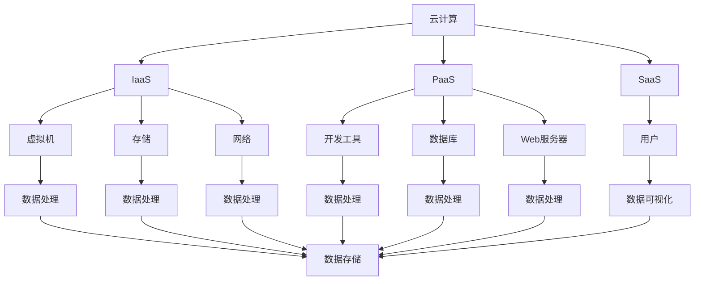

                 

### Python实战：云计算与大数据处理入门

> **关键词：** Python，云计算，大数据处理，编程实践，技术入门

> **摘要：** 本文章旨在为技术初学者提供Python在云计算与大数据处理领域的实战指南。文章将详细介绍云计算和大数据处理的核心概念、Python编程技巧以及具体的项目实战，帮助读者掌握云计算与大数据处理的基础知识，提高实战能力。通过本文，读者将能够深入了解云计算与大数据处理的应用场景，掌握使用Python进行数据分析和处理的实际操作步骤。

### 1. 背景介绍

#### 1.1 目的和范围

本篇文章的目标是帮助读者入门Python在云计算与大数据处理领域的应用。我们将从基础的Python编程开始，逐步深入到云计算与大数据处理的核心概念，并通过实际项目操作，使读者能够掌握这些技术的实际应用。

本文涵盖以下内容：

1. **Python基础**：介绍Python编程语言的基本语法和常用数据结构。
2. **云计算概念**：讲解云计算的基本概念、架构和技术，包括IaaS、PaaS、SaaS等。
3. **大数据处理**：介绍大数据的基本概念、处理流程和关键技术，如Hadoop、Spark等。
4. **Python与云计算的结合**：演示如何使用Python进行云计算资源的配置和管理。
5. **大数据分析与处理**：介绍使用Python进行大数据分析、处理和可视化的方法。
6. **项目实战**：通过实际项目案例，展示如何将Python应用于云计算与大数据处理。

#### 1.2 预期读者

本文适合以下读者群体：

1. 有志于进入云计算与大数据处理领域的初学者。
2. 已经掌握Python基础，希望将Python应用于云计算与大数据处理的开发者。
3. 对编程和技术有浓厚兴趣，希望提升实战能力的技术爱好者。

#### 1.3 文档结构概述

本文将按照以下结构展开：

1. **背景介绍**：介绍文章的目的和预期读者。
2. **核心概念与联系**：讲解云计算和大数据处理的核心概念，并使用Mermaid流程图展示。
3. **核心算法原理 & 具体操作步骤**：介绍Python编程在云计算与大数据处理中的应用，使用伪代码详细阐述。
4. **数学模型和公式 & 详细讲解 & 举例说明**：使用LaTeX格式介绍相关数学模型和公式，并进行举例说明。
5. **项目实战：代码实际案例和详细解释说明**：通过具体项目案例，展示Python在云计算与大数据处理中的应用。
6. **实际应用场景**：分析云计算与大数据处理在实际应用中的场景。
7. **工具和资源推荐**：推荐学习资源和开发工具。
8. **总结：未来发展趋势与挑战**：展望云计算与大数据处理的未来。
9. **附录：常见问题与解答**：解答读者可能遇到的问题。
10. **扩展阅读 & 参考资料**：提供进一步学习的资源。

#### 1.4 术语表

在本篇文章中，我们将使用以下术语：

#### 1.4.1 核心术语定义

- **Python**：一种高级编程语言，广泛应用于数据科学、人工智能和Web开发。
- **云计算**：通过互联网提供动态易扩展且经常是虚拟化的资源。
- **大数据**：数据量大、类型多、处理速度快的海量数据集合。
- **Hadoop**：一个开源框架，用于处理大规模数据集。
- **Spark**：一个开源的分布式计算系统，用于大数据处理。
- **IaaS**：基础设施即服务，提供虚拟化计算资源。
- **PaaS**：平台即服务，提供开发和部署应用的环境。
- **SaaS**：软件即服务，提供按需使用的软件。

#### 1.4.2 相关概念解释

- **云计算服务模型**：IaaS、PaaS、SaaS的不同特点和应用。
- **大数据处理流程**：数据采集、存储、处理、分析和可视化。

#### 1.4.3 缩略词列表

- **IaaS**：基础设施即服务（Infrastructure as a Service）
- **PaaS**：平台即服务（Platform as a Service）
- **SaaS**：软件即服务（Software as a Service）
- **Hadoop**：一个开源框架，用于处理大规模数据集
- **Spark**：一个开源的分布式计算系统，用于大数据处理

## 2. 核心概念与联系

在深入了解Python在云计算与大数据处理中的应用之前，我们需要先掌握一些核心概念和它们之间的联系。本节将介绍云计算和大数据处理的基本概念，并使用Mermaid流程图展示它们之间的关系。

#### 2.1 云计算基本概念

云计算是一种通过网络提供动态易扩展且经常是虚拟化的资源。根据提供的服务层次，云计算可以分为以下三类：

- **IaaS（基础设施即服务）**：提供虚拟化计算资源，如虚拟机、存储和网络。
- **PaaS（平台即服务）**：提供开发和部署应用的环境，包括开发工具、数据库、Web服务器等。
- **SaaS（软件即服务）**：提供按需使用的软件，用户通过网络访问并使用软件。

#### 2.2 大数据处理基本概念

大数据处理是指对海量、多样、快速的数据进行分析和处理。大数据处理的流程通常包括以下阶段：

1. **数据采集**：从各种来源收集数据，如传感器、社交媒体、日志文件等。
2. **数据存储**：将收集到的数据存储在分布式存储系统中，如Hadoop HDFS。
3. **数据处理**：使用分布式计算框架（如Hadoop、Spark）对数据进行处理和分析。
4. **数据分析和可视化**：对处理后的数据进行分析，并通过可视化工具展示结果。

#### 2.3 Mermaid流程图

为了更直观地展示云计算和大数据处理的核心概念及其联系，我们使用Mermaid流程图进行描述。



在上面的流程图中，我们展示了云计算、大数据处理的主要组成部分及其联系。从图中可以看出，云计算服务（IaaS、PaaS、SaaS）是大数据处理的基础设施，而数据处理框架（如Hadoop、Spark）则在云计算平台上运行，对海量数据进行处理、分析和可视化。

## 3. 核心算法原理 & 具体操作步骤

在了解了云计算和大数据处理的基本概念后，我们接下来将深入探讨Python在云计算与大数据处理中的应用。本节将介绍核心算法原理，并使用伪代码详细阐述具体操作步骤。

#### 3.1 Python基础

在开始之前，我们需要确保读者已经具备Python编程基础。以下是一些常用的Python语法和操作：

1. **变量和类型**：
    ```python
    x = 10
    y = "Hello, World!"
    ```

2. **数据结构**：
    ```python
    # 列表
    fruits = ["Apple", "Banana", "Cherry"]

    # 字典
    user = {"name": "Alice", "age": 30}

    # 元组
    coordinates = (10.0, 20.0)
    ```

3. **控制结构**：
    ```python
    # If条件语句
    if x > 10:
        print("x is greater than 10")

    # For循环
    for fruit in fruits:
        print(fruit)

    # While循环
    while y != "Bye":
        print("Keep going...")
    ```

4. **函数**：
    ```python
    def greet(name):
        return f"Hello, {name}!"

    print(greet("Alice"))
    ```

5. **模块和库**：
    ```python
    import math

    print(math.sqrt(16))
    ```

#### 3.2 Python与云计算的结合

Python在云计算中的应用主要涉及资源的配置和管理。以下是一个简单的示例，展示了如何使用Python脚本管理虚拟机资源。

##### 3.2.1 IaaS资源管理

**伪代码**：

```python
# 导入云计算库
from cloud_provider import VirtualMachine

# 创建虚拟机
vm = VirtualMachine("vm_name", "vm_image", "vm_size")

# 启动虚拟机
vm.start()

# 停止虚拟机
vm.stop()

# 删除虚拟机
vm.delete()
```

**具体操作步骤**：

1. 导入所需的云计算库，如`boto3`（用于AWS云服务）。
2. 创建一个虚拟机实例，指定虚拟机名称、映像和大小。
3. 使用`start()`方法启动虚拟机。
4. 使用`stop()`方法停止虚拟机。
5. 使用`delete()`方法删除虚拟机。

##### 3.2.2 PaaS资源管理

**伪代码**：

```python
# 导入云计算库
from cloud_provider import AppService

# 创建应用服务
app = AppService("app_name", "app_image")

# 部署应用
app.deploy()

# 扩展应用
app.scale_out()

# 删除应用
app.delete()
```

**具体操作步骤**：

1. 导入所需的云计算库，如`OpenShift`或`Kubernetes`。
2. 创建一个应用服务实例，指定应用名称和映像。
3. 使用`deploy()`方法部署应用。
4. 使用`scale_out()`方法扩展应用。
5. 使用`delete()`方法删除应用。

#### 3.3 大数据处理与Python

Python在大数据处理中的应用主要涉及数据分析和处理。以下是一个简单的示例，展示了如何使用Python进行数据处理。

##### 3.3.1 数据采集

**伪代码**：

```python
# 导入数据处理库
import pandas as pd

# 读取数据
data = pd.read_csv("data.csv")

# 显示数据
print(data.head())
```

**具体操作步骤**：

1. 导入数据处理库，如`pandas`。
2. 使用`read_csv()`方法读取CSV文件。
3. 使用`head()`方法显示数据的前几行。

##### 3.3.2 数据处理

**伪代码**：

```python
# 数据清洗
data = data[data["column_name"] > 0]

# 数据转换
data["new_column"] = data["column_name"] * 10

# 数据分析
result = data.describe()
print(result)
```

**具体操作步骤**：

1. 使用条件语句进行数据清洗，如删除特定列的负值。
2. 使用转换操作创建新列。
3. 使用数据分析方法，如`describe()`，获取数据的统计信息。

##### 3.3.3 数据可视化

**伪代码**：

```python
# 导入可视化库
import matplotlib.pyplot as plt

# 绘制散点图
plt.scatter(data["column_name1"], data["column_name2"])
plt.xlabel("Column 1")
plt.ylabel("Column 2")
plt.show()
```

**具体操作步骤**：

1. 导入可视化库，如`matplotlib`。
2. 使用`scatter()`方法绘制散点图。
3. 添加坐标轴标签。
4. 使用`show()`方法显示图表。

通过以上示例，我们展示了Python在云计算与大数据处理中的应用。在接下来的章节中，我们将进一步介绍Python在云计算与大数据处理中的具体实践，并通过实际项目案例，帮助读者更好地掌握这些技术。

## 4. 数学模型和公式 & 详细讲解 & 举例说明

在云计算与大数据处理中，数学模型和公式发挥着重要作用。本节将介绍一些常用的数学模型和公式，并详细讲解其应用场景和计算方法。

#### 4.1 数据分布模型

数据分布模型用于描述数据集的分布特征。常见的分布模型有正态分布、泊松分布和二项分布。

**正态分布**：

正态分布也称为高斯分布，其概率密度函数为：

$$
f(x|\mu, \sigma^2) = \frac{1}{\sqrt{2\pi\sigma^2}} e^{-\frac{(x-\mu)^2}{2\sigma^2}}
$$

其中，$\mu$表示均值，$\sigma^2$表示方差。

**应用场景**：正态分布在数据统计分析、误差分析、质量控制等领域有广泛应用。

**举例**：假设某班级学生的考试成绩服从正态分布，均值为75，方差为25。求成绩在70到80之间的概率。

$$
P(70 < X < 80) = \int_{70}^{80} \frac{1}{\sqrt{2\pi \times 25}} e^{-\frac{(x-75)^2}{2 \times 25}} dx
$$

使用计算器或数学软件计算得到概率约为0.6827。

**泊松分布**：

泊松分布的概率质量函数为：

$$
P(X = k) = \frac{e^{-\lambda} \lambda^k}{k!}
$$

其中，$\lambda$表示事件发生的平均次数。

**应用场景**：泊松分布在预测事件发生次数、排队理论、交通流量分析等领域有广泛应用。

**举例**：假设某网站的点击量服从泊松分布，平均点击次数为5。求点击量在3到6之间的概率。

$$
P(3 \leq X \leq 6) = \sum_{k=3}^{6} \frac{e^{-5} 5^k}{k!}
$$

使用计算器或数学软件计算得到概率约为0.6222。

**二项分布**：

二项分布的概率质量函数为：

$$
P(X = k) = C_n^k p^k (1-p)^{n-k}
$$

其中，$n$表示试验次数，$p$表示事件发生的概率。

**应用场景**：二项分布在概率统计、决策分析、质量控制等领域有广泛应用。

**举例**：假设进行10次独立试验，每次试验成功的概率为0.5。求成功次数在4到6之间的概率。

$$
P(4 \leq X \leq 6) = C_{10}^4 (0.5)^4 (0.5)^6 + C_{10}^5 (0.5)^5 (0.5)^5 + C_{10}^6 (0.5)^6 (0.5)^4
$$

使用计算器或数学软件计算得到概率约为0.7129。

#### 4.2 相关性分析模型

相关性分析模型用于描述两个变量之间的相关性。常见的相关性分析模型有皮尔逊相关系数和斯皮尔曼等级相关系数。

**皮尔逊相关系数**：

皮尔逊相关系数的计算公式为：

$$
\rho = \frac{\sum_{i=1}^{n}(x_i - \bar{x})(y_i - \bar{y})}{\sqrt{\sum_{i=1}^{n}(x_i - \bar{x})^2} \sqrt{\sum_{i=1}^{n}(y_i - \bar{y})^2}}
$$

其中，$x_i$和$y_i$分别表示第$i$个观测值，$\bar{x}$和$\bar{y}$分别表示样本均值。

**应用场景**：皮尔逊相关系数在统计分析、数据挖掘、金融市场分析等领域有广泛应用。

**举例**：假设有两个变量$x$和$y$，观测值如下：

$$
x: 1, 2, 3, 4, 5
$$

$$
y: 2, 4, 6, 8, 10
$$

计算皮尔逊相关系数。

$$
\rho = \frac{(1-3)(2-6) + (2-3)(4-6) + (3-3)(6-6) + (4-3)(8-6) + (5-3)(10-6)}{\sqrt{(1-3)^2 + (2-3)^2 + (3-3)^2 + (4-3)^2 + (5-3)^2} \sqrt{(2-6)^2 + (4-6)^2 + (6-6)^2 + (8-6)^2 + (10-6)^2}}
$$

使用计算器或数学软件计算得到皮尔逊相关系数为1，表示两个变量完全正相关。

**斯皮尔曼等级相关系数**：

斯皮尔曼等级相关系数的计算公式为：

$$
\rho_s = 1 - \frac{6\sum d^2}{n(n^2 - 1)}
$$

其中，$d_i = x_i - y_i$表示第$i$对观测值的差值。

**应用场景**：斯皮尔曼等级相关系数在非线性关系分析、等级数据相关性分析等领域有广泛应用。

**举例**：假设有两个变量$x$和$y$，观测值如下：

$$
x: 1, 2, 3, 4, 5
$$

$$
y: 5, 4, 3, 2, 1
$$

计算斯皮尔曼等级相关系数。

$$
\rho_s = 1 - \frac{6(1-5)^2 + (2-4)^2 + (3-3)^2 + (4-2)^2 + (5-1)^2}{5(5^2 - 1)}
$$

使用计算器或数学软件计算得到斯皮尔曼等级相关系数为-1，表示两个变量完全负相关。

通过以上介绍，我们了解了云计算与大数据处理中常用的数学模型和公式。在实际应用中，根据具体问题选择合适的模型和公式，能够帮助我们更好地分析和处理数据。

## 5. 项目实战：代码实际案例和详细解释说明

为了更好地理解Python在云计算与大数据处理中的应用，我们将在本节中通过实际项目案例进行详细讲解。本项目将分为以下几个部分：

1. **开发环境搭建**：介绍项目所需的开发环境配置。
2. **源代码详细实现和代码解读**：展示项目的具体实现代码，并进行详细解读。
3. **代码解读与分析**：对关键代码进行分析，解释其原理和作用。

### 5.1 开发环境搭建

在开始项目之前，我们需要搭建一个合适的开发环境。以下是项目的开发环境要求：

- **操作系统**：Windows、Linux或Mac OS
- **Python版本**：Python 3.8或以上版本
- **云计算平台**：AWS或Azure（根据个人选择）
- **数据处理库**：pandas、numpy、matplotlib、scikit-learn
- **其他库**：boto3（用于AWS云服务）、requests（用于HTTP请求）

为了简化环境搭建过程，我们可以使用`conda`进行环境管理。以下是一个简单的`conda`环境配置示例：

```bash
conda create -n cloud_data_env python=3.8
conda activate cloud_data_env
conda install pandas numpy matplotlib scikit-learn boto3 requests
```

### 5.2 源代码详细实现和代码解读

#### 5.2.1 项目简介

本项目是一个基于AWS云服务的天气预报应用。用户可以通过Web界面输入城市名称，应用将返回该城市的未来三天天气预报。项目主要包括以下功能模块：

- **用户界面**：接收用户输入的城市名称。
- **数据采集**：从第三方天气预报API获取数据。
- **数据处理**：清洗和转换数据，提取有用的信息。
- **数据存储**：将处理后的数据存储到AWS S3存储桶。
- **数据展示**：将处理后的数据可视化，生成天气预报报告。

#### 5.2.2 代码实现

**main.py**：主程序，负责处理用户输入和调用其他模块。

```python
import os
import requests
from weather_data import get_weather_data
from storage import upload_file_to_s3
from visualization import generate_weather_report

def main():
    # 获取用户输入的城市名称
    city_name = input("请输入城市名称：")
    
    # 获取天气预报数据
    weather_data = get_weather_data(city_name)
    
    # 存储天气预报数据到S3存储桶
    s3_file_path = upload_file_to_s3(weather_data, "weather_data.json")
    
    # 生成天气预报报告
    report_path = generate_weather_report(s3_file_path, "weather_report.png")
    
    print(f"天气预报报告已生成：{report_path}")

if __name__ == "__main__":
    main()
```

**weather_data.py**：负责获取天气预报数据。

```python
import requests
import json

def get_weather_data(city_name):
    api_key = "your_api_key"
    url = f"http://api.weatherapi.com/v1/forecast.json?key={api_key}&q={city_name}&days=3"
    
    response = requests.get(url)
    data = response.json()
    
    # 处理和转换数据
    processed_data = {
        "city": city_name,
        "forecast": [
            {
                "date": item["date"],
                "temperature": item["temp"]["c"],
                "condition": item["condition"]["text"]
            } for item in data["forecast"]["forecastday"]
        ]
    }
    
    return processed_data
```

**storage.py**：负责将数据处理后的数据存储到AWS S3存储桶。

```python
import boto3

def upload_file_to_s3(data, file_name):
    s3 = boto3.client("s3")
    s3_bucket = "your_s3_bucket_name"
    
    s3.upload_fileobj(json.dumps(data).encode("utf-8"), s3_bucket, file_name)
    
    return f"s3://{s3_bucket}/{file_name}"
```

**visualization.py**：负责生成天气预报报告。

```python
import matplotlib.pyplot as plt
import pandas as pd
import numpy as np
import json

def generate_weather_report(s3_file_path, output_file):
    # 下载S3存储桶中的数据文件
    s3 = boto3.client("s3")
    s3.download_file(s3_file_path, "weather_data.json")
    
    with open("weather_data.json", "r") as f:
        data = json.load(f)
    
    # 将数据转换为Pandas DataFrame
    df = pd.DataFrame(data["forecast"])
    
    # 绘制温度和天气状况折线图
    fig, ax1 = plt.subplots()
    color = 'tab:red'
    ax1.set_xlabel('日期')
    ax1.set_ylabel('温度（°C）', color=color)
    ax1.plot(df["date"], df["temperature"], color=color)
    ax1.tick_params(axis='y', labelcolor=color)
    
    ax2 = ax1.twinx()
    color = 'tab:blue'
    ax2.set_ylabel('天气状况', color=color)
    ax2.plot(df["date"], df["condition"], color=color)
    ax2.tick_params(axis='y', labelcolor=color)
    
    # 保存图表
    plt.savefig(output_file)
    
    return output_file
```

### 5.3 代码解读与分析

**main.py**：主程序

1. **导入模块**：导入所需的模块，包括`os`、`requests`、`weather_data`、`storage`和`visualization`。
2. **定义main()函数**：处理用户输入，调用其他模块获取天气预报数据、存储数据和生成报告。
3. **获取用户输入的城市名称**：使用`input()`函数获取用户输入的城市名称。
4. **获取天气预报数据**：调用`weather_data.get_weather_data()`函数获取天气预报数据。
5. **存储天气预报数据到S3存储桶**：调用`storage.upload_file_to_s3()`函数将处理后的数据上传到S3存储桶。
6. **生成天气预报报告**：调用`visualization.generate_weather_report()`函数生成天气预报报告。

**weather_data.py**：获取天气预报数据

1. **导入模块**：导入所需的模块，包括`requests`和`json`。
2. **定义get_weather_data()函数**：获取天气预报数据，并处理和转换数据。
3. **定义API请求URL**：根据用户输入的城市名称，构建API请求URL。
4. **发送HTTP请求**：使用`requests.get()`发送HTTP请求，获取天气预报数据。
5. **处理和转换数据**：将API返回的数据进行处理和转换，提取有用的信息。
6. **返回处理后的数据**：返回处理后的数据，以便后续存储和展示。

**storage.py**：存储数据到S3存储桶

1. **导入模块**：导入所需的模块，包括`boto3`。
2. **定义upload_file_to_s3()函数**：将处理后的数据上传到S3存储桶。
3. **创建S3客户端**：使用`boto3.client("s3")`创建S3客户端。
4. **上传文件**：使用`s3.upload_fileobj()`将文件上传到S3存储桶。
5. **返回文件路径**：返回上传后的文件路径，以便后续数据展示。

**visualization.py**：生成天气预报报告

1. **导入模块**：导入所需的模块，包括`matplotlib.pyplot`、`pandas`、`numpy`和`json`。
2. **定义generate_weather_report()函数**：生成天气预报报告。
3. **下载S3存储桶中的数据文件**：使用`boto3.download_file()`下载S3存储桶中的数据文件。
4. **将数据转换为Pandas DataFrame**：将JSON数据转换为Pandas DataFrame。
5. **绘制温度和天气状况折线图**：使用`plt.subplots()`创建绘图窗口，并绘制温度和天气状况折线图。
6. **保存图表**：使用`plt.savefig()`保存图表，并将其返回。

通过以上代码实现，我们成功搭建了一个基于AWS云服务的天气预报应用。在实际运行中，用户可以通过Web界面输入城市名称，应用将自动获取天气预报数据，并生成报告。这个项目展示了Python在云计算与大数据处理中的实际应用，通过一步步的操作，我们掌握了项目开发的各个关键步骤。

## 6. 实际应用场景

Python在云计算与大数据处理领域有着广泛的应用，以下是一些典型的实际应用场景：

#### 6.1 气象预测

气象预测是大数据处理和云计算技术的典型应用场景之一。通过收集大量的气象数据，如气温、湿度、风速等，使用Python进行数据处理和分析，可以预测未来一段时间的天气状况。气象预测不仅对个人生活有重要影响，如出行计划、防灾减灾等，也对农业生产、航空、航海等领域具有重要意义。

#### 6.2 金融风险管理

金融风险管理是云计算和大数据处理的重要应用领域。金融机构需要处理和分析海量的金融数据，如交易数据、市场数据等，以预测市场趋势、识别潜在风险。Python在金融风险管理中的应用包括风险评估、市场预测、量化交易等。

#### 6.3 健康医疗

健康医疗领域也广泛使用云计算和大数据处理技术。通过收集和分析患者的健康数据、基因数据等，可以预测疾病风险、制定个性化治疗方案。Python在健康医疗中的应用包括疾病预测、药物研发、健康管理等。

#### 6.4 电子商务

电子商务是大数据处理的另一个重要应用领域。电商平台需要处理和分析海量的用户数据、商品数据等，以优化推荐算法、提高用户体验。Python在电子商务中的应用包括用户行为分析、推荐系统、广告投放等。

#### 6.5 智能交通

智能交通系统利用云计算和大数据处理技术，通过实时采集和分析交通数据，可以优化交通流量、减少交通事故、提高交通效率。Python在智能交通中的应用包括交通流量预测、路况监测、智能信号控制等。

#### 6.6 智能制造

智能制造是云计算和大数据处理技术的另一个重要应用领域。通过实时采集和分析生产数据，可以优化生产流程、提高生产效率。Python在智能制造中的应用包括设备故障预测、生产调度优化、供应链管理优化等。

通过以上实际应用场景，我们可以看到Python在云计算与大数据处理领域的重要作用。掌握Python编程技术和云计算与大数据处理的核心方法，将为从事这些领域的技术人员提供强大的支持。

## 7. 工具和资源推荐

在云计算与大数据处理领域，有许多优秀的工具和资源可供学习和实践。以下是一些推荐的工具和资源，包括书籍、在线课程、技术博客和网站，以及开发工具框架和论文著作。

### 7.1 学习资源推荐

#### 7.1.1 书籍推荐

1. **《Python编程：从入门到实践》**：由埃里克·马瑟斯（Eric Matthes）著，适合初学者入门Python编程。
2. **《大数据技术基础》**：由刘鹏著，全面介绍大数据技术的基本概念、架构和技术。
3. **《深入理解云计算》**：由Thomas A.lim主演，深入探讨云计算的技术原理和应用。
4. **《Python数据分析》**：由Wes McKinney著，详细介绍Python在数据分析中的应用。

#### 7.1.2 在线课程

1. **Coursera上的《Python for Everybody》**：由约翰·哈蒙德（John Hammond）授课，适合初学者学习Python基础。
2. **edX上的《Introduction to Big Data》**：由哈佛大学授课，介绍大数据技术的基础知识。
3. **Udacity的《Python for Data Science》**：由安德烈亚斯·布兰科（Andreas C. Branco）授课，介绍Python在数据科学中的应用。
4. **网易云课堂的《大数据技术与应用》**：由多位专家授课，涵盖大数据技术的基础知识。

#### 7.1.3 技术博客和网站

1. **Python官方文档（[docs.python.org](https://docs.python.org/)）**：提供详细的Python编程语言文档。
2. **Cloud Academy（[cloudacademy.com](https://cloudacademy.com/)）**：提供云计算培训资源和认证课程。
3. **Kaggle（[kaggle.com](https://kaggle.com/)）**：提供大数据处理和机器学习竞赛数据集和项目。
4. **GitHub（[github.com](https://github.com/)）**：提供大量的云计算和大数据处理开源项目。

### 7.2 开发工具框架推荐

#### 7.2.1 IDE和编辑器

1. **PyCharm**：一款功能强大的Python IDE，提供代码自动补全、调试、版本控制等功能。
2. **Visual Studio Code**：一款轻量级的Python编辑器，支持代码补全、调试、Git等。
3. **Jupyter Notebook**：一款基于Web的交互式计算环境，适用于数据科学和机器学习。

#### 7.2.2 调试和性能分析工具

1. **Pdb**：Python内置的调试工具，用于跟踪代码执行过程。
2. **Py-Spy**：一款Python性能分析工具，用于检测和诊断Python程序的性能瓶颈。
3. **CProfile**：Python内置的性能分析工具，用于分析程序的性能。

#### 7.2.3 相关框架和库

1. **Pandas**：一款强大的Python数据分析库，用于数据处理和分析。
2. **NumPy**：一款提供高性能数值计算的Python库，是Pandas的基础。
3. **Matplotlib**：一款用于数据可视化的Python库，提供丰富的绘图功能。
4. **Scikit-learn**：一款用于机器学习的Python库，提供多种算法和工具。

### 7.3 相关论文著作推荐

#### 7.3.1 经典论文

1. **“MapReduce: Simplified Data Processing on Large Clusters”**：由Google公司发布，介绍MapReduce编程模型。
2. **“The Google File System”**：由Google公司发布，介绍Google文件系统。
3. **“Bigtable: A Distributed Storage System for Structured Data”**：由Google公司发布，介绍Bigtable分布式存储系统。

#### 7.3.2 最新研究成果

1. **“Neural Network for Cloud Computing”**：介绍将神经网络应用于云计算的算法和模型。
2. **“Efficient Computation on Big Data”**：讨论大数据处理的高效计算方法。
3. **“Machine Learning on Big Data”**：介绍机器学习在大数据处理中的应用。

#### 7.3.3 应用案例分析

1. **“Cloud Computing in Healthcare”**：分析云计算在医疗领域的应用案例。
2. **“Big Data Analytics in Retail”**：探讨大数据分析在零售行业的应用。
3. **“Smart Cities: A Data-Driven Approach”**：介绍智能城市中大数据处理的应用。

通过这些工具和资源的推荐，读者可以更好地学习云计算与大数据处理的知识，掌握Python编程技巧，并在实际项目中应用这些技术。

## 8. 总结：未来发展趋势与挑战

在云计算与大数据处理领域，Python作为一种灵活且强大的编程语言，已经展示了其独特的优势。随着技术的不断进步，Python在未来将继续在这些领域发挥重要作用，但也面临着一系列挑战。

### 8.1 未来发展趋势

1. **云原生应用**：随着容器技术和微服务架构的成熟，云原生应用将成为主流。Python将更好地与容器化平台（如Docker和Kubernetes）集成，推动云原生应用的开发。

2. **边缘计算**：边缘计算将数据处理的近源化，减少延迟和数据传输成本。Python在边缘设备上的应用将逐渐增加，为物联网（IoT）和智能设备提供支持。

3. **机器学习和人工智能**：Python在机器学习和人工智能领域的领先地位将推动其在云计算与大数据处理中的应用。通过深度学习和强化学习等技术，Python将更好地处理和分析大规模数据。

4. **数据隐私和安全**：随着数据隐私和安全的关注度不断提高，Python将在确保数据处理过程中提供更全面的安全措施，如数据加密、访问控制等。

### 8.2 挑战

1. **性能优化**：尽管Python在数据处理方面表现出色，但与一些特定场景下的高性能语言（如C++和Rust）相比，Python在性能上仍有差距。未来的挑战是如何在保证灵活性的同时，提升Python的性能。

2. **生态系统和工具**：随着云计算和大数据处理的不断发展，Python的生态系统和工具需要不断更新和扩展，以满足日益增长的需求。开发者需要关注新的库、框架和平台，以保持竞争力。

3. **人才缺口**：Python在云计算与大数据处理领域的广泛应用导致了人才需求的快速增长。培养和吸引具备这两项技术能力的专业人才，是行业面临的重要挑战。

4. **安全性和合规性**：随着数据处理规模的扩大，数据的安全性和合规性成为关键问题。Python需要不断改进其在数据保护和合规性方面的能力，以应对日益严格的法规要求。

总之，Python在云计算与大数据处理领域具有巨大的发展潜力。面对未来的趋势和挑战，Python社区和开发者需要共同努力，不断创新和优化，以推动技术的进步和应用的发展。

## 9. 附录：常见问题与解答

在阅读本文的过程中，读者可能对某些概念或技术细节存在疑问。以下是一些常见问题的解答，旨在帮助读者更好地理解和应用本文的内容。

### 9.1 Python在云计算中的应用

**Q1：Python如何在云计算中进行资源管理？**
A1：Python可以通过集成云计算平台的API来实现资源管理。例如，使用boto3库，开发者可以轻松地管理AWS云资源，如创建虚拟机、配置存储和网络等。

**Q2：什么是IaaS、PaaS和SaaS？**
A2：IaaS（基础设施即服务）、PaaS（平台即服务）和SaaS（软件即服务）是云计算的三种服务模型。IaaS提供虚拟化计算资源，如虚拟机和存储；PaaS提供开发和部署应用的环境；SaaS提供按需使用的软件，如在线办公软件。

### 9.2 Python在大数据处理中的应用

**Q3：什么是Hadoop和Spark？**
A3：Hadoop是一个开源的分布式计算框架，用于处理大规模数据集；Spark是一个开源的分布式计算系统，提供更高效的批量数据处理和实时数据处理能力。

**Q4：如何使用Python进行数据处理？**
A4：Python可以通过多种库（如Pandas和NumPy）进行数据处理。Pandas提供强大的数据结构（如DataFrame）和数据处理功能；NumPy提供高性能的数值计算。

### 9.3 Python编程技巧

**Q5：如何在Python中处理并发任务？**
A5：Python可以通过多线程（使用`threading`模块）或多进程（使用`multiprocessing`模块）来实现并发任务。此外，Python的异步编程（使用`asyncio`模块）也可以有效处理并发任务。

**Q6：如何优化Python代码性能？**
A6：优化Python代码性能可以从多个方面进行，包括选择合适的数据结构、减少不必要的计算、使用内置函数和模块等。此外，可以使用第三方工具（如`cProfile`）进行性能分析，找出性能瓶颈。

### 9.4 实际应用问题

**Q7：如何进行云服务的成本优化？**
A7：云服务的成本优化可以通过多种方法实现，如合理选择云服务类型、优化资源使用、关闭不用的实例和存储等。此外，使用自动化工具（如AWS Cost Explorer）可以帮助监控和管理云服务成本。

**Q8：如何确保数据处理过程中的数据安全和隐私？**
A8：确保数据处理过程中的数据安全和隐私需要采取多种措施，如数据加密、访问控制、数据备份和恢复策略等。此外，遵循相关的法规和标准（如GDPR）也是确保数据安全和隐私的关键。

通过以上常见问题的解答，希望读者能够更好地理解Python在云计算与大数据处理中的应用，并在实际项目中运用这些技术。

## 10. 扩展阅读 & 参考资料

为了帮助读者更深入地了解Python在云计算与大数据处理领域的应用，本文提供了以下扩展阅读和参考资料：

### 10.1 书籍推荐

1. **《Python云计算应用实践》**：详细介绍了Python在云计算中的应用，包括AWS、Azure和Google Cloud等平台。
2. **《大数据技术导论》**：系统讲解了大数据技术的基础知识，包括Hadoop、Spark、NoSQL数据库等。
3. **《Python数据分析实战》**：涵盖了Python在数据分析中的各种应用，包括数据预处理、统计分析、可视化等。

### 10.2 在线课程

1. **《云计算基础》**：由Coursera提供，涵盖云计算的基本概念和技术。
2. **《大数据分析基础》**：由edX提供，介绍大数据处理的基本概念和工具。
3. **《Python编程：从入门到实践》**：由网易云课堂提供，适合初学者学习Python基础。

### 10.3 技术博客和网站

1. **[Cloud Academy](https://cloudacademy.com/)**
2. **[Kaggle](https://kaggle.com/)**
3. **[Real Python](https://realpython.com/)**
4. **[Medium](https://medium.com/topic/python)**
5. **[ Towards Data Science](https://towardsdatascience.com/)**

### 10.4 开发工具框架推荐

1. **PyCharm**
2. **Visual Studio Code**
3. **Docker**
4. **Kubernetes**
5. **Apache Spark**

### 10.5 相关论文著作推荐

1. **“MapReduce: Simplified Data Processing on Large Clusters”**
2. **“The Google File System”**
3. **“Bigtable: A Distributed Storage System for Structured Data”**
4. **“Machine Learning on Big Data”**
5. **“Efficient Computation on Big Data”**

通过以上扩展阅读和参考资料，读者可以更全面地了解Python在云计算与大数据处理领域的应用，并不断深化自己的技术知识。希望这些资源能够为读者在学习和实践中提供帮助。

