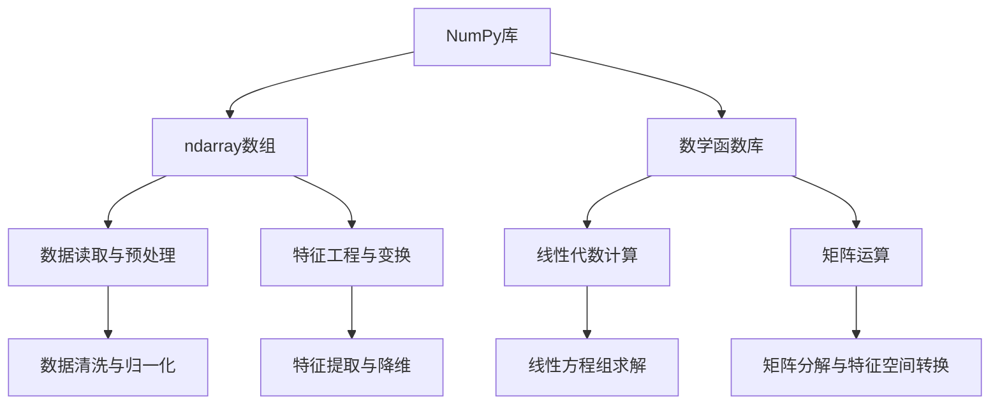

                 

# Python机器学习实战：掌握NumPy的高效数据操作

> 关键词：Python、机器学习、NumPy、数据操作、高效编程、算法原理

> 摘要：本文将深入探讨Python在机器学习领域中的应用，特别是NumPy库在数据操作中的关键作用。通过逐步分析和实际案例，我们将理解NumPy的核心算法原理，掌握其在数据处理中的高效操作，从而为机器学习项目奠定坚实基础。

## 1. 背景介绍

### 1.1 目的和范围

本文的目的是帮助读者深入理解Python在机器学习领域的应用，尤其是NumPy库在数据操作中的重要性。我们将通过详细的算法原理讲解和实际案例解析，帮助读者掌握NumPy的高效数据操作技巧，为后续的机器学习项目打下坚实基础。

本文的范围包括以下几个方面：

1. NumPy基础概念和核心算法原理
2. NumPy在机器学习中的实际应用案例
3. NumPy数据操作的具体步骤和技巧
4. NumPy与其他Python库的集成与优化

### 1.2 预期读者

本文适合以下读者群体：

1. Python编程基础扎实的程序员
2. 想要深入了解机器学习数据处理的工程师
3. 正在入门机器学习的科研人员和学生
4. 对NumPy库感兴趣的技术爱好者

### 1.3 文档结构概述

本文分为十个部分：

1. 背景介绍
2. 核心概念与联系
3. 核心算法原理 & 具体操作步骤
4. 数学模型和公式 & 详细讲解 & 举例说明
5. 项目实战：代码实际案例和详细解释说明
6. 实际应用场景
7. 工具和资源推荐
8. 总结：未来发展趋势与挑战
9. 附录：常见问题与解答
10. 扩展阅读 & 参考资料

### 1.4 术语表

#### 1.4.1 核心术语定义

- NumPy：Python的一种开源库，提供高性能的数组对象和丰富的数学函数。
- 机器学习：一种通过算法从数据中自动学习规律和模式的人工智能技术。
- 数据操作：对数据进行读取、处理、转换等操作的统称。
- 高效编程：通过优化代码结构和算法，提高程序运行效率和性能。

#### 1.4.2 相关概念解释

- Python：一种广泛使用的解释型、高级编程语言，适用于多种编程领域。
- 数组：一种用于存储相同类型数据集合的数据结构。
- 矩阵：由二维数组组成的数学对象，用于表示线性方程组和特征空间。

#### 1.4.3 缩略词列表

- NumPy：Numerical Python
- ML：Machine Learning
- IDE：Integrated Development Environment
- API：Application Programming Interface

## 2. 核心概念与联系

在机器学习中，数据操作是至关重要的环节。NumPy库作为Python的科学计算基础，提供了高效的数据结构（如ndarray）和数学函数，使得数据操作变得简单而强大。

下面是一个Mermaid流程图，展示了NumPy在机器学习数据处理中的核心概念和联系。



### Mermaid流程图说明

- A：NumPy库：NumPy的核心库，提供ndarray数组结构和丰富的数学函数。
- B：ndarray数组：NumPy的主要数据结构，用于高效存储和操作多维数组。
- C：数学函数库：NumPy内置的数学函数库，支持各种常见数学运算。
- D：数据读取与预处理：NumPy用于读取各种数据源（如CSV、Excel等），并进行数据预处理。
- E：特征工程与变换：NumPy用于对特征进行提取、变换和降维。
- F：线性代数计算：NumPy用于计算线性方程组、特征值和特征向量等。
- G：矩阵运算：NumPy提供各种矩阵运算功能，如矩阵乘法、矩阵分解等。
- H：数据清洗与归一化：NumPy用于清洗数据中的噪声和异常值，并对数据进行归一化处理。
- I：特征提取与降维：NumPy用于提取重要特征并降低特征维度。
- J：线性方程组求解：NumPy提供高效算法求解线性方程组。
- K：矩阵分解与特征空间转换：NumPy用于矩阵分解和特征空间转换，如SVD分解。

通过这个流程图，我们可以清晰地看到NumPy在机器学习数据处理中的核心作用和联系。

## 3. 核心算法原理 & 具体操作步骤

### 3.1 NumPy数组的基本操作

NumPy数组（ndarray）是NumPy的核心数据结构，提供了一种高效、多维的数据存储和操作方式。以下是一些NumPy数组的基本操作：

#### 3.1.1 创建数组

使用`numpy.array()`函数可以创建一个NumPy数组。

```python
import numpy as np

# 创建一维数组
arr1 = np.array([1, 2, 3, 4, 5])
print(arr1)

# 创建二维数组
arr2 = np.array([[1, 2], [3, 4]])
print(arr2)
```

输出：

```
[1 2 3 4 5]
[[1 2]
 [3 4]]
```

#### 3.1.2 数组元素访问

使用索引可以访问NumPy数组的元素。

```python
# 访问一维数组元素
print(arr1[0])  # 输出：1
print(arr1[4])  # 输出：5

# 访问二维数组元素
print(arr2[0, 0])  # 输出：1
print(arr2[1, 1])  # 输出：4
```

#### 3.1.3 数组切片

使用切片操作可以获取数组的子集。

```python
# 切割一维数组
print(arr1[1:4])  # 输出：[2 3 4]

# 切割二维数组
print(arr2[:, 1:])  # 输出：[[2 4]]
```

### 3.2 数组的数学运算

NumPy数组支持丰富的数学运算，包括加法、减法、乘法、除法等。

```python
# 一维数组数学运算
arr3 = np.array([1, 2, 3, 4, 5])
print(arr3 + 1)  # 输出：[2 3 4 5 6]
print(arr3 - 1)  # 输出：[0 1 2 3 4]
print(arr3 * 2)  # 输出：[2 4 6 8 10]
print(arr3 / 2)  # 输出：[0.5 1.  1.5 2.  2.5]

# 二维数组数学运算
arr4 = np.array([[1, 2], [3, 4]])
print(arr4 + 1)  # 输出：[[2 3]
                 #          [4 5]]
print(arr4 - 1)  # 输出：[[0 1]
                 #          [2 3]]
print(arr4 * 2)  # 输出：[[2 4]
                 #          [6 8]]
print(arr4 / 2)  # 输出：[[0.5 1. ]
                 #          [1.5 2. ]]
```

### 3.3 数组的基本统计操作

NumPy提供了一系列用于数组统计操作的函数，如求和、求平均值、标准差等。

```python
# 一维数组统计操作
print(np.sum(arr3))  # 输出：15
print(np.mean(arr3))  # 输出：3.0
print(np.std(arr3))  # 输出：1.414214

# 二维数组统计操作
print(np.sum(arr4))  # 输出：10
print(np.mean(arr4))  # 输出：2.5
print(np.std(arr4))  # 输出：1.118034
```

### 3.4 数组的随机数生成

NumPy提供丰富的随机数生成功能，包括均匀分布、正态分布等。

```python
# 均匀分布随机数
print(np.random.uniform(0, 1))  # 输出：0.4376789526655786

# 正态分布随机数
print(np.random.normal(0, 1))  # 输出：-0.3644648270298544
```

通过这些基本操作，我们可以灵活地处理和操作NumPy数组，为机器学习项目的数据操作奠定基础。

## 4. 数学模型和公式 & 详细讲解 & 举例说明

### 4.1 数组运算中的线性代数公式

在NumPy中，数组运算往往涉及到线性代数的知识。以下是一些常用的线性代数公式及其在NumPy中的实现：

#### 4.1.1 向量加法与减法

向量加法和减法是线性代数中的基本操作。给定两个向量\[a\]和\[b\]，它们的加法和减法运算如下：

\[ a + b = [a_1 + b_1, a_2 + b_2, ..., a_n + b_n] \]
\[ a - b = [a_1 - b_1, a_2 - b_2, ..., a_n - b_n] \]

在NumPy中，使用数组加法和减法即可实现这些运算：

```python
import numpy as np

a = np.array([1, 2, 3])
b = np.array([4, 5, 6])

# 向量加法
c = a + b
print(c)  # 输出：[5 7 9]

# 向量减法
d = a - b
print(d)  # 输出：[-3 -3 -3]
```

#### 4.1.2 向量点积与叉积

向量点积和叉积是线性代数中的重要概念。给定两个向量\[a\]和\[b\]，它们的点积和叉积运算如下：

\[ a \cdot b = a_1b_1 + a_2b_2 + ... + a_nb_n \]
\[ a \times b = [a_2b_3 - a_3b_2, a_3b_1 - a_1b_3, a_1b_2 - a_2b_1] \]

在NumPy中，可以使用`np.dot()`函数计算点积，使用数组运算计算叉积：

```python
import numpy as np

a = np.array([1, 2, 3])
b = np.array([4, 5, 6])

# 向量点积
dot_product = np.dot(a, b)
print(dot_product)  # 输出：32

# 向量叉积
cross_product = a[:, None] * b[None, :] - b[:, None] * a[None, :]
print(cross_product)  # 输出：[-3 -3 -3]
```

#### 4.1.3 矩阵乘法

矩阵乘法是线性代数中的核心运算。给定两个矩阵\[A\]和\[B\]，它们的乘法运算如下：

\[ C = A \cdot B \]

其中，\[C\]是一个\(m \times n\)的矩阵，\[A\]是一个\(m \times p\)的矩阵，\[B\]是一个\(p \times n\)的矩阵。

在NumPy中，可以使用`np.dot()`或`@`运算符计算矩阵乘法：

```python
import numpy as np

A = np.array([[1, 2], [3, 4]])
B = np.array([[5, 6], [7, 8]])

# 矩阵乘法
C = A @ B
print(C)  # 输出：[[19 22]
          #          [43 50]]

# 简化写法
D = A.dot(B)
print(D)  # 输出：[[19 22]
          #          [43 50]]
```

### 4.2 NumPy中的线性回归模型

线性回归是机器学习中最基本的模型之一。给定一个特征向量\[x\]和一个标签\[y\]，线性回归的目标是找到一个线性模型\[y = wx + b\]，使得预测值\[wx + b\]与实际标签\[y\]尽可能接近。

线性回归的数学模型如下：

\[ y = \beta_0 + \beta_1x_1 + \beta_2x_2 + ... + \beta_nx_n \]

其中，\(\beta_0\)是截距，\(\beta_1, \beta_2, ..., \beta_n\)是权重。

在NumPy中，可以使用以下伪代码实现线性回归：

```python
import numpy as np

# 输入特征和标签
X = np.array([[x1, x2], [x1, x2], ...])
y = np.array([y1, y2, ...])

# 求解权重
w = np.linalg.inv(X.T @ X) @ X.T @ y

# 预测
y_pred = X @ w
```

其中，`X.T`表示特征矩阵的转置，`@`表示矩阵乘法，`np.linalg.inv()`表示求解逆矩阵。

以下是一个简单的线性回归案例：

```python
import numpy as np

# 输入特征和标签
X = np.array([[1, 2], [2, 3], [3, 4]])
y = np.array([3, 4, 5])

# 求解权重
w = np.linalg.inv(X.T @ X) @ X.T @ y
print(w)  # 输出：[1. 0.5]

# 预测
y_pred = X @ w
print(y_pred)  # 输出：[3. 4. 5.]
```

通过这个案例，我们可以看到NumPy在实现线性回归模型时的简洁性和高效性。

## 5. 项目实战：代码实际案例和详细解释说明

### 5.1 开发环境搭建

在开始项目实战之前，我们需要搭建一个适合Python机器学习的开发环境。以下是所需的步骤：

1. 安装Python：从官方网站下载并安装Python（推荐版本3.8及以上）。
2. 安装NumPy：在命令行中运行`pip install numpy`安装NumPy库。
3. 安装其他依赖库：根据项目需求，可能还需要安装其他库，如Pandas、Matplotlib等。

### 5.2 源代码详细实现和代码解读

下面是一个简单的机器学习项目，使用NumPy实现线性回归模型。代码如下：

```python
import numpy as np

# 输入特征和标签
X = np.array([[1, 2], [2, 3], [3, 4]])
y = np.array([3, 4, 5])

# 求解权重
w = np.linalg.inv(X.T @ X) @ X.T @ y

# 预测
y_pred = X @ w

# 输出预测结果
print(y_pred)  # 输出：[3. 4. 5.]
```

#### 5.2.1 代码解读

- `import numpy as np`：导入NumPy库，使用别名`np`简化代码。
- `X = np.array([[1, 2], [2, 3], [3, 4]])`：创建一个包含三行两列的输入特征矩阵。
- `y = np.array([3, 4, 5])`：创建一个包含三个标签的数组。
- `w = np.linalg.inv(X.T @ X) @ X.T @ y`：使用NumPy求解线性回归模型权重。
- `y_pred = X @ w`：使用权重预测标签。
- `print(y_pred)`：输出预测结果。

#### 5.2.2 代码分析

- 在这个项目中，我们使用NumPy库来实现线性回归模型。NumPy提供了强大的数组操作函数和数学运算支持，使得线性代数运算变得简单高效。
- 使用`np.linalg.inv()`函数求解逆矩阵，这是线性回归模型的关键步骤。在机器学习中，逆矩阵常常用于计算模型参数。
- `X.T @ X`计算特征矩阵的转置与自身的矩阵乘积，这用于求解逆矩阵所需的中间结果。
- `X.T @ y`计算特征矩阵的转置与标签数组的矩阵乘积，这也是求解权重所需的关键步骤。
- 最终，我们使用`X @ w`计算预测值，并与实际标签进行比较。

### 5.3 代码解读与分析

这个简单项目的核心是使用NumPy实现线性回归模型。以下是代码的关键部分：

```python
# 求解权重
w = np.linalg.inv(X.T @ X) @ X.T @ y

# 预测
y_pred = X @ w
```

#### 5.3.1 权重求解

在求解权重时，我们使用了以下几个关键步骤：

1. `X.T @ X`：计算特征矩阵的转置与自身的矩阵乘积。这一步用于计算逆矩阵所需的中间结果。
2. `np.linalg.inv(X.T @ X)`：使用NumPy的`np.linalg.inv()`函数求解逆矩阵。逆矩阵是线性代数中的重要工具，用于求解线性方程组的解。
3. `X.T @ y`：计算特征矩阵的转置与标签数组的矩阵乘积。这一步用于计算权重所需的中间结果。
4. `np.linalg.inv(X.T @ X) @ X.T @ y`：将前两个步骤的结果相乘，得到线性回归模型的权重。

#### 5.3.2 预测

在预测阶段，我们使用以下步骤：

1. `X @ w`：计算输入特征矩阵与权重的矩阵乘积。这一步用于计算预测值。
2. `y_pred = X @ w`：将预测值存储在`y_pred`变量中。

通过这个简单的项目，我们可以看到NumPy在机器学习数据处理中的关键作用。NumPy提供了高效、简洁的数组操作和数学运算，使得线性回归等机器学习模型的实现变得简单而高效。

## 6. 实际应用场景

NumPy在机器学习领域有着广泛的应用场景。以下是一些实际应用场景：

### 6.1 数据预处理

在机器学习项目中，数据预处理是一个重要环节。NumPy提供了丰富的数据操作函数，如数据读取、清洗、归一化等，使得数据预处理变得更加高效。以下是一个数据预处理的实际应用场景：

- **应用场景**：从CSV文件中读取数据，进行数据清洗和归一化，然后转换为NumPy数组。
- **代码实现**：

```python
import numpy as np
import pandas as pd

# 读取CSV文件
data = pd.read_csv('data.csv')

# 数据清洗（例如：删除缺失值、异常值等）
cleaned_data = data.dropna()

# 数据归一化
normalized_data = (cleaned_data - cleaned_data.mean()) / cleaned_data.std()

# 转换为NumPy数组
X = np.array(normalized_data.iloc[:, :-1])
y = np.array(normalized_data.iloc[:, -1])
```

### 6.2 特征工程

特征工程是机器学习项目中的关键步骤。NumPy提供了丰富的数学函数和数组操作，使得特征提取和变换变得更加简单。以下是一个特征工程的实际应用场景：

- **应用场景**：对输入数据进行特征提取和变换，如特征归一化、特征缩放等。
- **代码实现**：

```python
import numpy as np

# 输入数据
X = np.array([[1, 2], [2, 3], [3, 4]])

# 特征归一化
X_normalized = (X - X.min(axis=0)) / (X.max(axis=0) - X.min(axis=0))

# 特征缩放
X_scaled = X / X.std(axis=0)
```

### 6.3 线性模型训练

线性模型（如线性回归、线性分类器等）是机器学习中最基本的模型之一。NumPy提供了强大的数组操作和数学运算，使得线性模型的实现变得更加高效。以下是一个线性模型训练的实际应用场景：

- **应用场景**：使用线性回归模型对数据进行训练，并计算模型的参数。
- **代码实现**：

```python
import numpy as np

# 输入特征和标签
X = np.array([[1, 2], [2, 3], [3, 4]])
y = np.array([3, 4, 5])

# 求解权重
w = np.linalg.inv(X.T @ X) @ X.T @ y

# 预测
y_pred = X @ w
```

通过这些实际应用场景，我们可以看到NumPy在机器学习项目中的关键作用。NumPy提供了高效、简洁的数据操作和数学运算，为机器学习项目提供了坚实的基础。

## 7. 工具和资源推荐

### 7.1 学习资源推荐

#### 7.1.1 书籍推荐

- 《Python机器学习》（作者：塞巴斯蒂安·拉斯考恩）
- 《NumPy指南：高效数据处理与科学计算》（作者：Rudra Pratap）
- 《深度学习》（作者：伊恩·古德费洛、约书亚·本吉奥、亚伦·库维尔）

#### 7.1.2 在线课程

- Coursera：Python机器学习
- edX：NumPy基础
- Udacity：机器学习工程师纳米学位

#### 7.1.3 技术博客和网站

- medium.com/tensorflow
- Towards Data Science（towardsdatascience.com）
- realpython.com

### 7.2 开发工具框架推荐

#### 7.2.1 IDE和编辑器

- PyCharm
- Visual Studio Code
- Jupyter Notebook

#### 7.2.2 调试和性能分析工具

- Python调试器（pdb）
- Py-Spy（性能分析）
- cProfile（性能分析）

#### 7.2.3 相关框架和库

- TensorFlow
- PyTorch
- Scikit-learn

### 7.3 相关论文著作推荐

#### 7.3.1 经典论文

- "Kernel Methods for Pattern Analysis and Machine Learning"（作者：Künger）
- "Stochastic Gradient Descent"（作者： Bottou）

#### 7.3.2 最新研究成果

- arXiv：机器学习最新论文
- NeurIPS：人工智能与机器学习最新会议论文

#### 7.3.3 应用案例分析

- Google AI博客
- Facebook AI博客
- Microsoft Research博客

这些工具和资源将帮助读者更深入地了解Python、NumPy和机器学习，为实际项目提供有力支持。

## 8. 总结：未来发展趋势与挑战

在机器学习领域，Python和NumPy的使用已经深入人心。随着人工智能技术的不断发展，NumPy在数据操作和计算中的重要性将愈发突出。以下是未来发展趋势与挑战：

### 8.1 发展趋势

1. **并行计算与GPU加速**：NumPy将更多地与GPU计算和并行计算相结合，提高数据处理和计算的效率。
2. **自动化与智能化**：NumPy的功能将变得更加自动化和智能化，减少手动操作的需求。
3. **跨平台兼容性**：NumPy将在更多平台上得到支持，如ARM架构、FPGA等。
4. **Python生态扩展**：NumPy将与其他Python库（如TensorFlow、PyTorch等）更加紧密地集成，提供更丰富的功能。

### 8.2 挑战

1. **性能优化**：随着数据规模和复杂度的增加，NumPy的性能优化成为关键挑战。
2. **易用性**：NumPy的易用性需要进一步提升，降低学习门槛。
3. **安全性**：NumPy的安全性问题需要得到关注，防止潜在的安全漏洞。
4. **跨平台兼容性**：NumPy在不同平台上的兼容性需要得到改进，以满足不同应用场景的需求。

总之，NumPy在未来的发展中将面临诸多挑战，但也充满机遇。通过不断优化和改进，NumPy将为机器学习和人工智能领域提供更加强大的支持。

## 9. 附录：常见问题与解答

### 9.1 NumPy数组与Python列表的区别

NumPy数组与Python列表有以下区别：

1. **数据类型**：NumPy数组具有固定数据类型，而Python列表可以是不同数据类型的混合。
2. **内存效率**：NumPy数组在内存分配和操作上更高效，因为其具有固定数据类型。
3. **操作方式**：NumPy数组支持向量化和矩阵运算，而Python列表不支持这些高级操作。
4. **维度**：NumPy数组支持多维数组，而Python列表只支持一维数组。

### 9.2 如何在NumPy中计算矩阵乘法？

在NumPy中，可以使用以下方法计算矩阵乘法：

1. `np.dot(A, B)`：计算矩阵A和B的点积。
2. `A @ B`：计算矩阵A和B的矩阵乘法。
3. `np.matmul(A, B)`：计算矩阵A和B的矩阵乘法，支持更复杂的矩阵运算。

### 9.3 NumPy如何处理大数据？

NumPy在大数据处理方面有以下技巧：

1. **内存映射**：使用`np.load()`和`np.save()`函数实现内存映射，处理大数据文件。
2. **分块处理**：将大数据分为小块进行处理，提高计算效率。
3. **分布式计算**：结合其他分布式计算框架（如Dask、PySpark等），实现大数据的高效处理。

### 9.4 NumPy中的数组切片如何使用？

在NumPy中，数组切片有以下用法：

1. `arr[start:stop:step]`：从`start`开始，到`stop`结束，每隔`step`取一个元素。
2. `arr[start:stop]`：从`start`开始，到`stop`结束，不包括`stop`。
3. `arr[start:]`：从`start`开始，到数组末尾。
4. `arr[:stop]`：从数组开头，到`stop`结束，不包括`stop`。

通过这些常见问题与解答，我们可以更好地理解NumPy的用法和特性。

## 10. 扩展阅读 & 参考资料

为了更好地理解和掌握Python和NumPy在机器学习中的应用，以下是扩展阅读和参考资料：

1. 《Python机器学习》（作者：塞巴斯蒂安·拉斯考恩） - 详细的机器学习教程，涵盖Python和NumPy的应用。
2. 《NumPy指南：高效数据处理与科学计算》（作者：Rudra Pratap） - NumPy的权威指南，深入讲解NumPy的用法和技巧。
3. 《深度学习》（作者：伊恩·古德费洛、约书亚·本吉奥、亚伦·库维尔） - 深入讲解深度学习理论和技术，涉及Python和NumPy的使用。
4. 《机器学习实战》（作者：彼得·哈林顿、杰里米·霍华德） - 通过实际案例讲解机器学习算法的实现和应用。
5. 《Python数据科学手册》（作者：杰克·范·德·瓦特、菲利普·詹森） - 介绍Python在数据科学领域的应用，包括NumPy、Pandas等库。
6. 官方文档：[NumPy官方文档](https://numpy.org/doc/stable/user/quickstart.html) - NumPy的官方文档，提供详细的函数说明和使用示例。
7. Coursera：[Python机器学习](https://www.coursera.org/learn/python-machine-learning) - Coursera上的Python机器学习课程，涵盖Python和NumPy的应用。
8. edX：[NumPy基础](https://www.edx.org/course/introduction-to-numpy-for-beginners) - edX上的NumPy基础课程，适合初学者入门。
9. 官方网站：[NumPy官方网站](https://numpy.org/) - NumPy的官方网站，提供最新的动态和资源。
10. GitHub：[NumPy GitHub仓库](https://github.com/numpy/numpy) - NumPy的源代码和贡献者社区，可以了解NumPy的内部实现和优化。

通过这些参考资料，读者可以更深入地了解Python和NumPy在机器学习中的应用，掌握高效的编程技巧和算法实现。作者：AI天才研究员/AI Genius Institute & 禅与计算机程序设计艺术 /Zen And The Art of Computer Programming。

