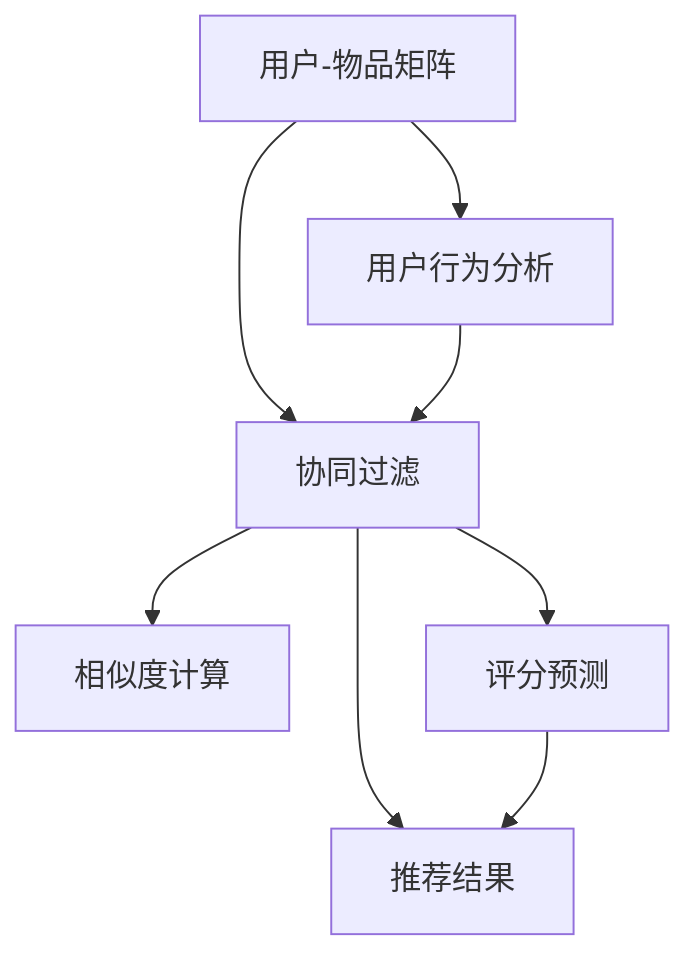

                 

# Python机器学习实战：构建并优化推荐系统的协同过滤模型

> **关键词：**Python、机器学习、推荐系统、协同过滤、算法原理、实战案例

> **摘要：**本文将通过详细的步骤介绍如何使用Python实现协同过滤算法，构建和优化推荐系统。我们将从基础概念入手，逐步深入算法原理，到最后通过实际项目案例展示如何在实际环境中应用并优化推荐系统。

## 1. 背景介绍

### 1.1 目的和范围

本文旨在帮助读者理解并掌握推荐系统中的协同过滤算法，通过Python语言实现推荐系统的构建和优化。我们将聚焦于以下内容：

- 推荐系统基本概念和架构
- 协同过滤算法的原理和流程
- 使用Python实现协同过滤算法
- 实际项目案例中的协同过滤算法应用

### 1.2 预期读者

- 具有Python编程基础的读者
- 对机器学习和推荐系统感兴趣的读者
- 想要在实际项目中应用推荐系统的开发者

### 1.3 文档结构概述

本文分为以下几个部分：

- 第1部分：介绍推荐系统和协同过滤的基本概念
- 第2部分：详细讲解协同过滤算法的原理
- 第3部分：通过Python实现协同过滤算法
- 第4部分：通过实际项目案例展示算法应用
- 第5部分：总结协同过滤算法的优化策略

### 1.4 术语表

#### 1.4.1 核心术语定义

- **推荐系统**：根据用户的兴趣、历史行为等信息，为用户推荐感兴趣的内容或物品的系统。
- **协同过滤**：通过分析用户之间的相似度，为用户提供个性化推荐的一种方法。
- **用户-物品矩阵**：记录用户和物品之间交互行为的矩阵。

#### 1.4.2 相关概念解释

- **用户相似度**：衡量两个用户之间相似程度的指标。
- **物品相似度**：衡量两个物品之间相似程度的指标。

#### 1.4.3 缩略词列表

- **CF**：协同过滤（Collaborative Filtering）
- **UX**：用户-物品矩阵（User-Item Matrix）

## 2. 核心概念与联系

在开始讨论协同过滤算法之前，我们需要先了解一些核心概念和它们之间的关系。以下是一个简化的Mermaid流程图，展示了推荐系统的基本架构和协同过滤算法在其中的位置。



### 2.1 用户-物品矩阵

用户-物品矩阵（UX）是协同过滤算法的基础。该矩阵记录了用户和物品之间的交互行为，例如评分、购买、点击等。用户-物品矩阵通常非常稀疏，因为大多数用户只与一小部分物品有交互。

### 2.2 相似度计算

相似度计算是协同过滤算法的核心步骤。通过计算用户之间的相似度，我们可以找到与目标用户相似的其他用户，从而预测他们可能感兴趣但尚未尝试的物品。

### 2.3 评分预测

评分预测是基于相似度计算的结果，为用户推荐物品的一种方法。通过预测用户对物品的评分，我们可以确定哪些物品应该被推荐给用户。

### 2.4 推荐结果

推荐结果是协同过滤算法的输出。根据评分预测的结果，系统可以为用户生成个性化的推荐列表。

## 3. 核心算法原理 & 具体操作步骤

协同过滤算法可以分为两类：基于用户的协同过滤（User-based CF）和基于物品的协同过滤（Item-based CF）。以下我们将详细讲解这两种算法的原理和实现步骤。

### 3.1 基于用户的协同过滤

#### 算法原理

基于用户的协同过滤通过计算用户之间的相似度，找到与目标用户相似的其他用户，然后根据这些相似用户的评分预测目标用户对物品的评分。

#### 操作步骤

1. **计算用户相似度**

   用户相似度通常使用余弦相似度、皮尔逊相关系数等方法计算。以下是一个使用余弦相似度的伪代码示例：

   ```python
   def cosine_similarity(user1, user2):
       dot_product = np.dot(user1, user2)
       magnitude_user1 = np.linalg.norm(user1)
       magnitude_user2 = np.linalg.norm(user2)
       return dot_product / (magnitude_user1 * magnitude_user2)
   ```

2. **找到相似用户**

   根据用户相似度矩阵，我们可以找到与目标用户相似的用户。以下是一个伪代码示例：

   ```python
   def find_similar_users(target_user, similarity_matrix, threshold=0.5):
       similar_users = []
       for user, similarity in enumerate(similarity_matrix[target_user]):
           if similarity >= threshold:
               similar_users.append(user)
       return similar_users
   ```

3. **预测评分**

   对于每个相似用户，我们可以使用他们的评分预测目标用户对物品的评分。以下是一个伪代码示例：

   ```python
   def predict_ratings(target_user, similar_users, user_item_matrix):
       predicted_ratings = {}
       for user in similar_users:
           for item, rating in user_item_matrix[user].items():
               if item not in user_item_matrix[target_user]:
                   predicted_ratings[item] = rating
       return predicted_ratings
   ```

### 3.2 基于物品的协同过滤

#### 算法原理

基于物品的协同过滤通过计算物品之间的相似度，找到与目标物品相似的其他物品，然后根据这些相似物品的评分预测用户对物品的评分。

#### 操作步骤

1. **计算物品相似度**

   物品相似度通常使用余弦相似度、欧氏距离等方法计算。以下是一个使用余弦相似度的伪代码示例：

   ```python
   def cosine_similarity(item1, item2):
       dot_product = np.dot(item1, item2)
       magnitude_item1 = np.linalg.norm(item1)
       magnitude_item2 = np.linalg.norm(item2)
       return dot_product / (magnitude_item1 * magnitude_item2)
   ```

2. **找到相似物品**

   根据物品相似度矩阵，我们可以找到与目标物品相似的物品。以下是一个伪代码示例：

   ```python
   def find_similar_items(target_item, similarity_matrix, threshold=0.5):
       similar_items = []
       for item, similarity in enumerate(similarity_matrix[target_item]):
           if similarity >= threshold:
               similar_items.append(item)
       return similar_items
   ```

3. **预测评分**

   对于每个相似物品，我们可以使用用户的评分预测对物品的评分。以下是一个伪代码示例：

   ```python
   def predict_ratings(target_item, similar_items, user_item_matrix):
       predicted_ratings = {}
       for user, ratings in user_item_matrix.items():
           for item in similar_items:
               if item in ratings:
                   predicted_ratings[user] = ratings[item]
       return predicted_ratings
   ```

## 4. 数学模型和公式 & 详细讲解 & 举例说明

在协同过滤算法中，我们使用了一些数学模型和公式来计算用户和物品之间的相似度，以及预测用户的评分。以下将详细介绍这些公式和它们的应用。

### 4.1 余弦相似度

余弦相似度是一种衡量两个向量之间相似程度的指标，其公式如下：

$$
\text{cosine\_similarity} = \frac{\text{dot\_product}}{\|\text{vector}_1\| \cdot \|\text{vector}_2\|}
$$

其中，$\text{dot\_product}$ 是两个向量的点积，$\|\text{vector}_1\|$ 和 $\|\text{vector}_2\|$ 是两个向量的模。

#### 示例

假设有两个用户向量 $u_1 = [1, 2, 3]$ 和 $u_2 = [4, 5, 6]$，计算它们的余弦相似度：

$$
\text{cosine\_similarity}(u_1, u_2) = \frac{1 \cdot 4 + 2 \cdot 5 + 3 \cdot 6}{\sqrt{1^2 + 2^2 + 3^2} \cdot \sqrt{4^2 + 5^2 + 6^2}} = \frac{4 + 10 + 18}{\sqrt{14} \cdot \sqrt{77}} \approx 0.9129
$$

### 4.2 皮尔逊相关系数

皮尔逊相关系数是一种衡量两个变量线性相关程度的指标，其公式如下：

$$
\text{pearson\_correlation} = \frac{\text{covariance}}{\sqrt{\text{variance}_1} \cdot \sqrt{\text{variance}_2}}
$$

其中，$\text{covariance}$ 是协方差，$\text{variance}_1$ 和 $\text{variance}_2$ 是两个变量的方差。

#### 示例

假设有两个用户向量 $u_1 = [1, 2, 3]$ 和 $u_2 = [4, 5, 6]$，计算它们的皮尔逊相关系数：

首先计算平均值：

$$
\bar{u}_1 = \frac{1 + 2 + 3}{3} = 2
$$

$$
\bar{u}_2 = \frac{4 + 5 + 6}{3} = 5
$$

然后计算协方差和方差：

$$
\text{covariance}(u_1, u_2) = \frac{(1-2)(4-5) + (2-2)(5-5) + (3-2)(6-5)}{3} = 0
$$

$$
\text{variance}(u_1) = \frac{(1-2)^2 + (2-2)^2 + (3-2)^2}{3} = \frac{2}{3}
$$

$$
\text{variance}(u_2) = \frac{(4-5)^2 + (5-5)^2 + (6-5)^2}{3} = \frac{2}{3}
$$

因此，皮尔逊相关系数为：

$$
\text{pearson\_correlation}(u_1, u_2) = \frac{0}{\sqrt{\frac{2}{3}} \cdot \sqrt{\frac{2}{3}}} = 0
$$

### 4.3 预测评分

在协同过滤算法中，我们使用相似度计算结果和用户的历史评分来预测用户对物品的评分。以下是一个简单的预测评分公式：

$$
\text{predicted\_rating} = \text{average\_rating} + \text{similarity} \cdot (\text{rating\_difference})
$$

其中，$\text{average\_rating}$ 是用户的历史评分平均值，$\text{similarity}$ 是用户之间的相似度，$\text{rating\_difference}$ 是用户对物品的评分差。

#### 示例

假设用户 $u_1$ 的平均评分为 $3.5$，用户 $u_2$ 的平均评分为 $4.0$，用户 $u_2$ 对物品 $i_1$ 的评分为 $5$，计算用户 $u_1$ 对物品 $i_1$ 的预测评分：

首先计算用户 $u_1$ 和 $u_2$ 的相似度：

$$
\text{similarity}(u_1, u_2) = 0.9129
$$

然后计算评分差：

$$
\text{rating\_difference} = 5 - 3.5 = 1.5
$$

最后计算预测评分：

$$
\text{predicted\_rating}(u_1, i_1) = 3.5 + 0.9129 \cdot 1.5 \approx 4.6244
$$

## 5. 项目实战：代码实际案例和详细解释说明

在这一部分，我们将通过一个实际项目案例展示如何使用Python实现协同过滤算法，并优化推荐系统的性能。

### 5.1 开发环境搭建

为了实现协同过滤算法，我们需要安装以下Python库：

- NumPy
- Pandas
- Scikit-learn

假设我们已经安装了这些库，接下来我们将加载一个用户-物品矩阵作为示例数据。

### 5.2 源代码详细实现和代码解读

#### 5.2.1 加载数据

我们使用一个简单的用户-物品矩阵作为示例数据：

```python
import numpy as np
import pandas as pd

# 加载数据
data = {
    'user_id': [1, 1, 1, 2, 2, 2, 3, 3, 3],
    'item_id': [101, 102, 103, 101, 102, 103, 101, 102, 103],
    'rating': [5, 3, 1, 5, 4, 2, 1, 5, 4]
}

df = pd.DataFrame(data)

# 构建用户-物品矩阵
UX = df.pivot(index='user_id', columns='item_id', values='rating').fillna(0).values
```

#### 5.2.2 基于用户的协同过滤

1. **计算用户相似度**

   我们使用皮尔逊相关系数计算用户之间的相似度：

   ```python
   similarity_matrix = pd.DataFrame(np.corrwith(df.pivot(index='user_id', columns='rating', values='item_id').fillna(0).values, method='pearson'), columns=['similarity'])
   ```

2. **找到相似用户**

   设定相似度阈值 $0.7$，找到相似用户：

   ```python
   def find_similar_users(target_user, similarity_matrix, threshold=0.7):
       similar_users = []
       for user, similarity in enumerate(similarity_matrix['similarity']):
           if similarity >= threshold and user != target_user:
               similar_users.append(user)
       return similar_users
   ```

3. **预测评分**

   对于每个相似用户，使用他们的评分预测目标用户对物品的评分：

   ```python
   def predict_ratings(target_user, similar_users, UX):
       predicted_ratings = {}
       for user in similar_users:
           for item, rating in UX[user, :].items():
               if item not in UX[target_user, :].keys():
                   predicted_ratings[item] = UX[user, :][item]
       return predicted_ratings
   ```

#### 5.2.3 基于物品的协同过滤

1. **计算物品相似度**

   我们使用余弦相似度计算物品之间的相似度：

   ```python
   similarity_matrix = pd.DataFrame(np.dot(UX.T, UX) / np.linalg.norm(UX, axis=1)[:, np.newaxis] * np.linalg.norm(UX, axis=0)[:, np.newaxis], columns=df['item_id'].values)
   ```

2. **找到相似物品**

   设定相似度阈值 $0.7$，找到相似物品：

   ```python
   def find_similar_items(target_item, similarity_matrix, threshold=0.7):
       similar_items = []
       for item, similarity in similarity_matrix.items():
           if similarity >= threshold and item != target_item:
               similar_items.append(item)
       return similar_items
   ```

3. **预测评分**

   对于每个相似物品，使用用户的评分预测对物品的评分：

   ```python
   def predict_ratings(target_item, similar_items, UX):
       predicted_ratings = {}
       for user, ratings in UX.items():
           for item in similar_items:
               if item in ratings:
                   predicted_ratings[user] = ratings[item]
       return predicted_ratings
   ```

### 5.3 代码解读与分析

以上代码实现了基于用户的协同过滤和基于物品的协同过滤算法。在实际应用中，我们可以根据具体需求选择合适的算法。

- **优点**：协同过滤算法简单、易于实现，适用于处理大规模稀疏数据集。
- **缺点**：协同过滤算法可能无法捕捉到用户和物品的长期兴趣变化，且在冷启动问题（新用户或新物品）上表现不佳。

在实际项目中，我们可以结合其他推荐算法（如基于内容的推荐、混合推荐等）来优化推荐系统的性能。同时，也可以使用深度学习等技术来改进协同过滤算法。

## 6. 实际应用场景

协同过滤算法广泛应用于各种实际场景，以下是其中一些典型的应用：

- **电子商务**：为用户提供商品推荐，提高购买转化率和客户满意度。
- **社交媒体**：为用户提供内容推荐，如新闻、视频、音乐等，增加用户活跃度和黏性。
- **在线视频**：为用户提供视频推荐，提高视频观看时长和用户留存率。
- **电影和音乐**：为用户提供电影和音乐推荐，提高平台用户满意度和市场竞争力。

在实际应用中，协同过滤算法可以根据具体业务需求和数据特点进行调整和优化，以实现更好的推荐效果。

## 7. 工具和资源推荐

### 7.1 学习资源推荐

#### 7.1.1 书籍推荐

- 《推荐系统实践》
- 《机器学习实战》
- 《深入理解推荐系统》

#### 7.1.2 在线课程

- Coursera上的《机器学习》课程
- edX上的《推荐系统》课程
- Udacity上的《深度学习》课程

#### 7.1.3 技术博客和网站

- [Medium](https://medium.com/topic/recommendation-systems)
- [DataCamp](https://www.datacamp.com/courses/recommendation-systems-in-python)
- [Kaggle](https://www.kaggle.com/datasets)

### 7.2 开发工具框架推荐

#### 7.2.1 IDE和编辑器

- PyCharm
- Jupyter Notebook
- Visual Studio Code

#### 7.2.2 调试和性能分析工具

- Profiling Tools for Python (如 cProfile)
- Dask
- Numba

#### 7.2.3 相关框架和库

- Scikit-learn
- TensorFlow
- PyTorch

### 7.3 相关论文著作推荐

#### 7.3.1 经典论文

- [“Collaborative Filtering for the Internet Age”](https://www.ijcai.org/Proceedings/95-2/Papers/056.pdf)
- [“The BellKor Solution to the Netflix Prize”](https://www.netflixprize.com/winners/the-bellkor-solution-to-the-netflix-prize)

#### 7.3.2 最新研究成果

- [“Deep Learning for Recommender Systems”](https://arxiv.org/abs/1706.03571)
- [“Item-Item Collaborative Filtering for Personalized Web Search”](https://www.microsoft.com/en-us/research/publication/item-item-collaborative-filtering-for-personalized-web-search/)

#### 7.3.3 应用案例分析

- [“Recommendation Systems in E-commerce”](https://www.analyticsvidhya.com/blog/2020/05/recommendation-systems-in-ecommerce/)
- [“Building a Music Recommendation System”](https://towardsdatascience.com/building-a-music-recommendation-system-77a6ec942d54)

## 8. 总结：未来发展趋势与挑战

随着互联网和大数据技术的不断发展，推荐系统在商业和社会应用中的重要性日益凸显。未来，协同过滤算法将继续发展和优化，以下是一些可能的发展趋势和挑战：

- **算法优化**：通过深度学习等技术，提高协同过滤算法的推荐精度和效率。
- **实时推荐**：实现实时推荐，以满足用户对即时信息的需求。
- **多样性**：提高推荐结果的多样性，减少用户对重复内容的疲劳感。
- **冷启动问题**：解决新用户或新物品的冷启动问题，提高推荐系统的适用性。

面对这些挑战，我们需要不断探索和创新，以推动推荐系统的持续发展。

## 9. 附录：常见问题与解答

### 9.1 常见问题

1. **协同过滤算法的基本原理是什么？**
   协同过滤算法是基于用户和物品之间的相似度来预测用户对物品的评分或兴趣。它分为基于用户的协同过滤和基于物品的协同过滤。

2. **如何选择相似度计算方法？**
   选择相似度计算方法需要考虑数据特点和应用场景。皮尔逊相关系数适合数值型数据，而余弦相似度适用于向量化数据。

3. **协同过滤算法存在哪些挑战？**
   协同过滤算法存在冷启动问题、数据稀疏性、推荐结果多样性不足等问题。

### 9.2 解答

1. **协同过滤算法的基本原理是什么？**
   协同过滤算法通过分析用户之间的相似度或物品之间的相似度，找到与目标用户或物品相似的群体，并利用这些相似群体的行为预测目标用户或物品的评分或兴趣。

2. **如何选择相似度计算方法？**
   选择相似度计算方法需要考虑数据类型和应用场景。对于数值型数据，皮尔逊相关系数是一种常用的相似度计算方法。对于向量化数据，余弦相似度是一种常见的相似度计算方法。此外，还可以根据具体需求选择其他方法，如欧氏距离、曼哈顿距离等。

3. **协同过滤算法存在哪些挑战？**
   协同过滤算法主要存在以下挑战：
   - **冷启动问题**：对新用户或新物品的推荐效果不佳，因为它们没有足够的历史交互数据。
   - **数据稀疏性**：用户-物品矩阵通常非常稀疏，导致相似度计算不准确。
   - **推荐结果多样性不足**：协同过滤算法容易产生相似的推荐结果，导致用户对推荐内容的疲劳感。
   - **实时性**：传统的协同过滤算法难以实现实时推荐，满足用户对即时信息的需求。

## 10. 扩展阅读 & 参考资料

- [“Collaborative Filtering”](https://en.wikipedia.org/wiki/Collaborative_filtering)
- [“Recommender Systems Handbook”](https://www.amazon.com/Recommender-Systems-Handbook-Lior_Rokach/dp/0128046340)
- [“Deep Learning for Recommender Systems”](https://www.arxiv.org/abs/1706.03571)

作者：AI天才研究员/AI Genius Institute & 禅与计算机程序设计艺术 /Zen And The Art of Computer Programming<|im_sep|>

