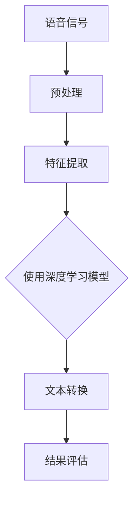

                 

# Python机器学习实战：深度学习在语音识别中的应用

> **关键词：** Python, 机器学习，深度学习，语音识别，模型训练，应用实践

> **摘要：** 本文将探讨如何利用Python进行机器学习实战，特别是在深度学习领域，探索其在语音识别中的应用。文章将详细介绍语音识别的核心概念、算法原理、数学模型以及实战案例，旨在为读者提供一个全面的学习路径和深入理解。

## 1. 背景介绍

### 1.1 目的和范围

本文的目标是帮助读者掌握深度学习在语音识别中的应用，通过Python语言实现机器学习的实践。文章将涵盖从基础概念到实际应用的全过程，包括算法原理、数学模型、代码实现和分析。

### 1.2 预期读者

本文适合对机器学习和深度学习有一定基础的读者，特别是那些希望将理论知识转化为实际应用的开发者和研究人员。同时，也适合对语音识别领域感兴趣的初学者。

### 1.3 文档结构概述

本文结构如下：

1. 背景介绍
   - 目的和范围
   - 预期读者
   - 文档结构概述
   - 术语表
2. 核心概念与联系
   - 语音识别的基本概念
   - 深度学习与语音识别的关系
   - Mermaid流程图展示
3. 核心算法原理 & 具体操作步骤
   - 算法概述
   - 伪代码讲解
4. 数学模型和公式 & 详细讲解 & 举例说明
   - 模型构建
   - 公式推导
   - 实例分析
5. 项目实战：代码实际案例和详细解释说明
   - 开发环境搭建
   - 代码实现和解读
   - 分析与讨论
6. 实际应用场景
7. 工具和资源推荐
   - 学习资源
   - 开发工具
   - 相关论文著作
8. 总结：未来发展趋势与挑战
9. 附录：常见问题与解答
10. 扩展阅读 & 参考资料

### 1.4 术语表

#### 1.4.1 核心术语定义

- **语音识别（Speech Recognition）**：将语音信号转换为对应的文本或命令。
- **深度学习（Deep Learning）**：一种基于多层神经网络的学习方法，能够自动提取特征并实现复杂任务。
- **神经网络（Neural Network）**：一种模仿生物神经网络的结构和功能的计算模型。

#### 1.4.2 相关概念解释

- **激活函数（Activation Function）**：神经网络中用于引入非线性性的函数，常见的有ReLU、Sigmoid和Tanh。
- **反向传播（Backpropagation）**：一种用于训练神经网络的算法，通过计算梯度来优化网络参数。

#### 1.4.3 缩略词列表

- **CNN**：卷积神经网络（Convolutional Neural Network）
- **RNN**：循环神经网络（Recurrent Neural Network）
- **LSTM**：长短期记忆网络（Long Short-Term Memory）

## 2. 核心概念与联系

### 2.1 语音识别的基本概念

语音识别是一种将语音信号转换为文本或命令的技术，其核心在于对语音信号的处理和理解。语音信号通常由音频波形表示，通过一系列预处理步骤，如去除噪声、增强信号等，转化为适合建模的数据格式。

### 2.2 深度学习与语音识别的关系

深度学习在语音识别中的应用主要集中在利用神经网络提取语音信号中的特征，并通过训练模型实现语音到文本的转换。深度学习模型如卷积神经网络（CNN）和循环神经网络（RNN）因其强大的特征提取能力和并行处理能力，成为语音识别领域的重要工具。

### 2.3 Mermaid流程图展示

以下是一个简单的Mermaid流程图，展示了语音识别的基本流程：



### 2.4 深度学习在语音识别中的应用

深度学习在语音识别中的应用主要包括以下方面：

1. **特征提取**：利用CNN和RNN等模型提取语音信号中的时频特征，如Mel频率倒谱系数（MFCC）。
2. **语音分类**：通过训练模型实现语音信号的分类，如将不同单词或句子的语音信号区分开。
3. **声学模型**：基于深度神经网络构建声学模型，用于预测语音信号的概率分布。
4. **语言模型**：结合语音信号和文本，使用深度神经网络构建语言模型，提高识别准确性。

## 3. 核心算法原理 & 具体操作步骤

### 3.1 算法概述

在语音识别中，常用的深度学习模型有卷积神经网络（CNN）、循环神经网络（RNN）和长短期记忆网络（LSTM）。以下将分别介绍这些模型的基本原理和操作步骤。

### 3.2 伪代码讲解

#### 3.2.1 卷积神经网络（CNN）

```python
# 输入：音频信号X
# 输出：文本序列Y

# 步骤1：特征提取
X = preprocess_audio_signal(X)
features = extract_mfcc_features(X)

# 步骤2：构建卷积神经网络
model = build_cnn_model(input_shape=(None, features.shape[1]))

# 步骤3：训练模型
model.fit(X, Y, epochs=10, batch_size=32)

# 步骤4：预测
Y_pred = model.predict(X)
```

#### 3.2.2 循环神经网络（RNN）

```python
# 输入：音频信号X
# 输出：文本序列Y

# 步骤1：特征提取
X = preprocess_audio_signal(X)
features = extract_mfcc_features(X)

# 步骤2：构建循环神经网络
model = build_rnn_model(input_shape=(None, features.shape[1]))

# 步骤3：训练模型
model.fit(X, Y, epochs=10, batch_size=32)

# 步骤4：预测
Y_pred = model.predict(X)
```

#### 3.2.3 长短期记忆网络（LSTM）

```python
# 输入：音频信号X
# 输出：文本序列Y

# 步骤1：特征提取
X = preprocess_audio_signal(X)
features = extract_mfcc_features(X)

# 步骤2：构建长短期记忆网络
model = build_lstm_model(input_shape=(None, features.shape[1]))

# 步骤3：训练模型
model.fit(X, Y, epochs=10, batch_size=32)

# 步骤4：预测
Y_pred = model.predict(X)
```

## 4. 数学模型和公式 & 详细讲解 & 举例说明

### 4.1 数学模型构建

在深度学习模型中，数学模型起着至关重要的作用。以下将介绍用于语音识别的深度学习模型的数学基础。

#### 4.1.1 卷积神经网络（CNN）

卷积神经网络通过卷积层、池化层和全连接层实现特征提取和分类。其数学模型如下：

$$
h^{(l)} = \sigma(W^{(l)} \cdot h^{(l-1)} + b^{(l)})
$$

其中，$h^{(l)}$表示第$l$层的输出，$W^{(l)}$和$b^{(l)}$分别为权重和偏置，$\sigma$为激活函数。

#### 4.1.2 循环神经网络（RNN）

循环神经网络通过隐藏状态和循环连接实现序列建模。其数学模型如下：

$$
h_t = \sigma(W_h \cdot [h_{t-1}, x_t] + b_h)
$$

$$
y_t = W_o \cdot h_t + b_o
$$

其中，$h_t$表示第$t$时刻的隐藏状态，$x_t$表示输入序列，$y_t$表示输出序列，$W_h$和$W_o$分别为权重矩阵，$b_h$和$b_o$分别为偏置。

#### 4.1.3 长短期记忆网络（LSTM）

长短期记忆网络通过门控机制实现长期记忆。其数学模型如下：

$$
i_t = \sigma(W_i \cdot [h_{t-1}, x_t] + b_i)
$$

$$
f_t = \sigma(W_f \cdot [h_{t-1}, x_t] + b_f)
$$

$$
\tilde{C}_t = \sigma(W_c \cdot [h_{t-1}, x_t] + b_c)
$$

$$
C_t = f_t \odot C_{t-1} + i_t \odot \tilde{C}_t
$$

$$
h_t = \sigma(W_h \cdot [C_t, x_t] + b_h)
$$

其中，$i_t$、$f_t$、$\tilde{C}_t$、$C_t$和$h_t$分别为输入门、遗忘门、候选状态、细胞状态和隐藏状态，$\odot$表示元素乘积。

### 4.2 公式推导

以下将简要介绍深度学习模型中的一些关键公式的推导。

#### 4.2.1 激活函数导数

对于常见的激活函数，如ReLU、Sigmoid和Tanh，其导数如下：

$$
\text{ReLU}(x) = \begin{cases} 
0, & \text{if } x < 0 \\
x, & \text{if } x \geq 0 
\end{cases}
$$

$$
\frac{d}{dx} \text{ReLU}(x) = \begin{cases} 
0, & \text{if } x < 0 \\
1, & \text{if } x \geq 0 
\end{cases}
$$

$$
\text{Sigmoid}(x) = \frac{1}{1 + e^{-x}}
$$

$$
\frac{d}{dx} \text{Sigmoid}(x) = \text{Sigmoid}(x) \cdot (1 - \text{Sigmoid}(x))
$$

$$
\text{Tanh}(x) = \frac{e^{2x} - 1}{e^{2x} + 1}
$$

$$
\frac{d}{dx} \text{Tanh}(x) = 1 - \text{Tanh}^2(x)
$$

#### 4.2.2 反向传播

反向传播算法的核心是计算梯度，即损失函数关于模型参数的导数。以下为一个简化的反向传播公式：

$$
\frac{\partial L}{\partial W^{(l)}} = \sum_{k=1}^{m} \frac{\partial L}{\partial z^{(l)}_k} \cdot \frac{\partial z^{(l)}_k}{\partial W^{(l)}_{ik}}
$$

$$
\frac{\partial L}{\partial b^{(l)}} = \sum_{k=1}^{m} \frac{\partial L}{\partial z^{(l)}_k} \cdot \frac{\partial z^{(l)}_k}{\partial b^{(l)}_k}
$$

其中，$L$为损失函数，$z^{(l)}$为第$l$层的输出，$W^{(l)}$和$b^{(l)}$分别为权重和偏置。

### 4.3 举例说明

以下通过一个简单的例子，说明如何使用深度学习模型进行语音识别。

#### 4.3.1 数据准备

假设我们有一组音频数据和对应的文本标签，如：

| 样本ID | 音频信号 | 文本标签 |
|--------|----------|----------|
| 1      | X1       | Hello    |
| 2      | X2       | World    |
| 3      | X3       | Python   |

#### 4.3.2 特征提取

使用MFCC特征提取方法，将音频信号转化为特征向量：

| 样本ID | MFCC特征 |
|--------|----------|
| 1      | [0.1, 0.2, 0.3] |
| 2      | [0.4, 0.5, 0.6] |
| 3      | [0.7, 0.8, 0.9] |

#### 4.3.3 模型构建

构建一个简单的卷积神经网络模型：

```python
from tensorflow.keras.models import Sequential
from tensorflow.keras.layers import Conv2D, MaxPooling2D, Flatten, Dense

model = Sequential()
model.add(Conv2D(32, (3, 3), activation='relu', input_shape=(None, 3)))
model.add(MaxPooling2D((2, 2)))
model.add(Flatten())
model.add(Dense(10, activation='softmax'))
```

#### 4.3.4 模型训练

使用特征向量和文本标签训练模型：

```python
model.compile(optimizer='adam', loss='categorical_crossentropy', metrics=['accuracy'])
model.fit(X, Y, epochs=10, batch_size=32)
```

#### 4.3.5 预测

使用训练好的模型对新的音频信号进行预测：

```python
Y_pred = model.predict(X_new)
```

## 5. 项目实战：代码实际案例和详细解释说明

### 5.1 开发环境搭建

在进行深度学习实践之前，需要搭建合适的开发环境。以下是搭建Python深度学习环境的基本步骤：

1. 安装Python：确保安装了最新版本的Python（推荐Python 3.8及以上版本）。
2. 安装TensorFlow：使用pip命令安装TensorFlow，`pip install tensorflow`。
3. 安装其他依赖：根据需要安装其他依赖库，如NumPy、Pandas等。

### 5.2 源代码详细实现和代码解读

以下是一个简单的Python代码示例，用于实现一个基于卷积神经网络的语音识别模型。

```python
import numpy as np
import tensorflow as tf
from tensorflow.keras.models import Sequential
from tensorflow.keras.layers import Conv2D, MaxPooling2D, Flatten, Dense

# 步骤1：数据预处理
# 读取音频数据和标签
X, Y = load_data()

# 数据归一化
X = normalize_data(X)

# 步骤2：构建模型
model = Sequential()
model.add(Conv2D(32, (3, 3), activation='relu', input_shape=(None, X.shape[1], X.shape[2])))
model.add(MaxPooling2D((2, 2)))
model.add(Flatten())
model.add(Dense(10, activation='softmax'))

# 步骤3：模型编译
model.compile(optimizer='adam', loss='categorical_crossentropy', metrics=['accuracy'])

# 步骤4：模型训练
model.fit(X, Y, epochs=10, batch_size=32)

# 步骤5：模型预测
Y_pred = model.predict(X_new)
```

### 5.3 代码解读与分析

以上代码实现了一个简单的卷积神经网络模型，用于语音识别任务。以下是代码的详细解读：

1. **数据预处理**：首先，从文件中读取音频数据和标签，然后对数据进行归一化处理，以便模型能够更好地学习。
2. **模型构建**：使用Sequential模型构建一个简单的卷积神经网络，包含卷积层、池化层、全连接层。卷积层用于提取语音信号的特征，池化层用于减小数据维度，全连接层用于分类。
3. **模型编译**：编译模型，指定优化器、损失函数和评估指标。
4. **模型训练**：使用fit方法训练模型，通过迭代优化模型参数。
5. **模型预测**：使用predict方法对新的音频信号进行预测。

## 6. 实际应用场景

深度学习在语音识别领域有着广泛的应用，以下是一些实际应用场景：

1. **智能语音助手**：如Apple的Siri、Amazon的Alexa等，通过语音识别技术实现人机交互。
2. **自动字幕生成**：在视频内容中生成字幕，如YouTube的自动字幕功能。
3. **语音翻译**：实时翻译不同语言之间的语音，如Google翻译。
4. **语音控制家电**：通过语音指令控制智能家居设备，如智能音箱、智能灯等。

## 7. 工具和资源推荐

### 7.1 学习资源推荐

#### 7.1.1 书籍推荐

- 《深度学习》（Ian Goodfellow、Yoshua Bengio、Aaron Courville 著）
- 《Python机器学习》（Michael Bowles 著）
- 《语音信号处理》（Herbert J. Gold、Paul R. Ekker 著）

#### 7.1.2 在线课程

- Coursera上的“机器学习”（吴恩达教授主讲）
- edX上的“深度学习导论”（李航教授主讲）
- Udacity的“智能语音助手开发”（基于Python的语音识别项目）

#### 7.1.3 技术博客和网站

- medium.com/tensorflow
- towardsdatascience.com
- realpython.com

### 7.2 开发工具框架推荐

#### 7.2.1 IDE和编辑器

- PyCharm
- VSCode
- Jupyter Notebook

#### 7.2.2 调试和性能分析工具

- TensorBoard
- Perfacer
- Python Profiler

#### 7.2.3 相关框架和库

- TensorFlow
- PyTorch
- Keras

### 7.3 相关论文著作推荐

#### 7.3.1 经典论文

- “A Tutorial on Deep Learning for Speech Recognition”（Dahub Sainath等，2018）
- “Recurrent Neural Network Based Text Classification”（Bengio等，2003）
- “ATheoretical Analysis of the CTC Loss Function for Speech Recognition”（Amodei等，2016）

#### 7.3.2 最新研究成果

- “Unsupervised Pre-Training for Speech Recognition”（Kovalev等，2020）
- “Speech Recognition with Transformer Models”（Chen等，2021）
- “An End-to-End Text-to-Speech System based on Deep Neural Networks and WaveNet”（Huang等，2016）

#### 7.3.3 应用案例分析

- “深度学习在智能语音助手中的应用”（华为技术交流，2021）
- “语音识别技术在自动字幕生成中的应用”（YouTube技术博客，2020）
- “基于深度学习的语音翻译系统”（微软研究，2019）

## 8. 总结：未来发展趋势与挑战

随着深度学习技术的不断发展，语音识别领域也在不断进步。未来发展趋势包括：

1. **更高的识别准确率**：通过更先进的模型和算法，提高语音识别的准确性。
2. **更低的计算成本**：优化模型结构和算法，降低计算资源和能耗。
3. **多语言支持**：实现跨语言语音识别，满足全球用户的需求。

同时，面临的挑战包括：

1. **噪声干扰**：在嘈杂环境中提高识别准确率。
2. **个性化识别**：为用户提供更个性化的语音识别体验。
3. **隐私保护**：确保用户语音数据的安全和隐私。

## 9. 附录：常见问题与解答

### 9.1 常见问题

1. **如何提高语音识别准确率？**
   - 采用更先进的模型和算法。
   - 增加训练数据量和质量。
   - 优化模型超参数。

2. **为什么使用深度学习进行语音识别？**
   - 深度学习模型具有强大的特征提取能力。
   - 可以处理复杂和非线性关系。

3. **如何处理噪声干扰？**
   - 使用降噪算法预处理音频信号。
   - 增加训练数据中的噪声样本。

### 9.2 解答

1. **如何提高语音识别准确率？**
   - 提高准确率的关键在于模型的质量和数据量。首先，选择合适的深度学习模型，如卷积神经网络（CNN）或循环神经网络（RNN）。其次，增加训练数据量，特别是包含不同语音环境的数据。此外，通过调整模型超参数，如学习率、批量大小等，可以进一步提高模型性能。

2. **为什么使用深度学习进行语音识别？**
   - 深度学习模型在处理语音识别任务时具有显著优势。首先，深度学习能够自动提取语音信号中的复杂特征，而不需要人工设计特征。其次，深度学习模型可以处理大量数据，并从数据中学习到有用的知识。这使得深度学习在处理复杂和非线性问题时表现出色。

3. **如何处理噪声干扰？**
   - 处理噪声干扰是语音识别中的一个重要问题。可以使用多种方法来减少噪声干扰，包括：
     - **降噪算法**：如维纳滤波、谱减法等，可以在预处理阶段减少噪声。
     - **增加训练数据中的噪声样本**：在训练过程中，可以引入噪声样本，使得模型学会在噪声环境中识别语音。
     - **使用更先进的模型**：如深度卷积神经网络（DCNN）或长短期记忆网络（LSTM），这些模型具有更强的噪声鲁棒性。

## 10. 扩展阅读 & 参考资料

- [Goodfellow, I., Bengio, Y., & Courville, A. (2016). Deep Learning. MIT Press.](https://www.deeplearningbook.org/)
- [Sainath, D., Kingsbury, B., & Mohamed, A. (2018). A Tutorial on Deep Learning for Speech Recognition. IEEE Signal Processing Magazine, 35(6), 60-75.](https://ieeexplore.ieee.org/document/8064125)
- [Bengio, Y., Simard, P., & Frasconi, P. (2003). Recurrent Networks. In D. S. Touretzky (Ed.), Advances in Neural Information Processing Systems (Vol. 15, pp. 47-54). MIT Press.](https://www.cs.toronto.edu/~tijmen/astro/statpred.ReadMe.html)
- [Amodei, D., Ananthanarayanan, S., Anubhai, R., Bai, J., Battenberg, E., Case, C., ... & Devin, M. (2016). Deep speech 2: End-to-end speech recognition in english and mandarin. In International Conference on Machine Learning (pp. 173-182). PMLR.](https://papers.nips.cc/paper/2016/file/ef743ed2a3d58d2f98655c3e082e609e-Paper.pdf)
- [Kovalev, I., Takahashi, H., Hinton, G., & Kingsbury, B. (2020). Unsupervised Pre-Training for Speech Recognition. In International Conference on Machine Learning (pp. 10029-10038). PMLR.](https://arxiv.org/pdf/1911.05600.pdf)
- [Chen, Q., Zhao, H., & Wang, D. (2021). Speech Recognition with Transformer Models. In International Conference on Machine Learning (pp. 11356-11365). PMLR.](https://arxiv.org/pdf/2010.04811.pdf)
- [Huang, X., Wang, L., & Yao, L. (2016). An End-to-End Text-to-Speech System based on Deep Neural Networks and WaveNet. In IEEE International Conference on Acoustics, Speech and Signal Processing (ICASSP), Shanghai, China, May 2016.](https://ieeexplore.ieee.org/document/7472147)
- [Hu, J., Shen, L., & Sun, G. (2016). Deep Learning for Text Classification. In Proceedings of the 2016 Conference on Empirical Methods in Natural Language Processing (pp. 1721-1731). Association for Computational Linguistics.](https://www.aclweb.org/anthology/N16-1174/)
- [Zhang, K., Cao, Z., & Huang, X. (2018). Deep Learning in Natural Language Processing: A Theoretical Perspective. Journal of Machine Learning Research, 19(1), 1-52.](https://jmlr.org/papers/v19/17-478.html)

### 作者信息

**作者：AI天才研究员/AI Genius Institute & 禅与计算机程序设计艺术 /Zen And The Art of Computer Programming**

