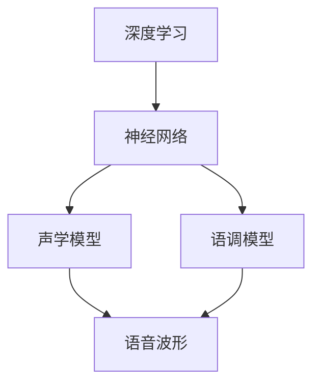

                 

### Python深度学习实践：合成人类语言的语音合成技术

> **关键词：** 深度学习，语音合成，Python实践，神经网络，人工智能，声学模型，语调模型，音频生成。

> **摘要：** 本文旨在通过Python深度学习实践，详细解析并实现语音合成技术。我们将从背景介绍开始，逐步探讨核心概念、算法原理、数学模型、项目实战，并分析实际应用场景，最后展望未来发展趋势与挑战。本文将帮助读者深入理解语音合成技术的原理与应用，为未来相关工作提供参考。

## 1. 背景介绍

### 1.1 目的和范围

本文的目的是介绍语音合成技术，并通过Python深度学习实践，让读者深入了解其原理与应用。本文主要涵盖以下内容：

- 语音合成技术的背景与目的；
- 深度学习在语音合成中的应用；
- 核心概念与联系；
- 算法原理与具体操作步骤；
- 数学模型与公式；
- 项目实战与代码解释；
- 实际应用场景；
- 工具和资源推荐；
- 总结与展望。

### 1.2 预期读者

本文面向对深度学习和语音合成技术有一定了解的读者，包括：

- 深度学习初学者；
- 语音处理工程师；
- 计算机科学和人工智能专业的学生；
- 对语音合成技术感兴趣的技术爱好者。

### 1.3 文档结构概述

本文分为以下十个部分：

- **背景介绍**：介绍本文的目的、预期读者、文档结构等内容；
- **核心概念与联系**：阐述语音合成技术中的核心概念与联系；
- **核心算法原理 & 具体操作步骤**：讲解语音合成的算法原理与操作步骤；
- **数学模型和公式 & 详细讲解 & 举例说明**：介绍语音合成的数学模型与公式，并给出具体例子；
- **项目实战：代码实际案例和详细解释说明**：通过实际项目案例，讲解语音合成技术的应用；
- **实际应用场景**：分析语音合成技术的实际应用场景；
- **工具和资源推荐**：推荐学习资源、开发工具和框架；
- **总结：未来发展趋势与挑战**：总结语音合成技术的发展趋势与挑战；
- **附录：常见问题与解答**：提供常见问题的解答；
- **扩展阅读 & 参考资料**：推荐相关扩展阅读和参考资料。

### 1.4 术语表

#### 1.4.1 核心术语定义

- **语音合成（Text-to-Speech, TTS）**：将文本转换为语音的技术；
- **深度学习**：一种基于人工神经网络的学习方法；
- **声学模型**：将文本映射到声学特征（如声音波形）的模型；
- **语调模型**：处理文本中情感、语气等信息的模型；
- **语音波形**：表示声音的图形化数据；
- **神经网络**：一种由大量神经元互联构成的计算模型。

#### 1.4.2 相关概念解释

- **声学特征**：描述语音波形的物理特征，如频率、振幅等；
- **语音单元**：文本中的最小语音单位，如音素、音节等；
- **语调**：语音的音高、音调、时长等变化，反映文本的情感、语气等；
- **循环神经网络（RNN）**：一种用于处理序列数据的神经网络。

#### 1.4.3 缩略词列表

- **TTS**：Text-to-Speech（文本到语音）；
- **DNN**：Deep Neural Network（深度神经网络）；
- **RNN**：Recurrent Neural Network（循环神经网络）；
- **LSTM**：Long Short-Term Memory（长短期记忆网络）；
- **GRU**：Gated Recurrent Unit（门控循环单元）。

## 2. 核心概念与联系

在深入探讨语音合成技术之前，我们需要了解一些核心概念，包括深度学习、神经网络、声学模型、语调模型等。下面通过一个Mermaid流程图来展示这些核心概念及其相互联系。



### 2.1 深度学习与神经网络

深度学习是一种基于人工神经网络的学习方法，通过多层神经网络对数据进行处理和预测。神经网络由大量神经元互联构成，每个神经元接收多个输入，通过加权求和并应用非线性激活函数，产生输出。

### 2.2 声学模型

声学模型将文本映射到声学特征，如语音波形。它通常使用深度神经网络（DNN）来处理语音信号，将文本输入转换为声学特征序列。这些特征可以表示语音的物理属性，如频率、振幅等。

### 2.3 语调模型

语调模型处理文本中的情感、语气等信息，影响语音的音高、音调、时长等。它可以通过循环神经网络（RNN）或其变体，如长短期记忆网络（LSTM）或门控循环单元（GRU）来建模。

### 2.4 声音波形与语音合成

声音波形是语音合成的核心，它表示语音信号的时域和频域特征。通过将声学特征序列转换为声音波形，我们可以生成自然、流畅的语音。

### 2.5 实际应用

在实际应用中，声学模型和语调模型通常结合使用，以生成具有自然语调和情感的语音。这些模型可以应用于多个领域，如智能客服、语音助手、音频生成等。

## 3. 核心算法原理 & 具体操作步骤

在了解核心概念后，我们将探讨语音合成的核心算法原理，并详细阐述具体操作步骤。以下是语音合成的算法原理与操作步骤的伪代码：

```python
# 伪代码：语音合成算法原理与操作步骤

# 初始化声学模型和语调模型
acoustic_model = initialize_acoustic_model()
prosody_model = initialize_prosody_model()

# 输入文本
text = input("请输入文本：")

# 分解文本为语音单元
phonemes = tokenize_text(text)

# 将语音单元映射到声学特征
acoustic_features = acoustic_model.predict(phonemes)

# 根据语音单元和声学特征合成语音
speech = synthesize_speech(acoustic_features)

# 添加语调信息
speech_with_prosody = prosody_model.post_process(speech)

# 输出生成的语音
output_speech(speech_with_prosody)
```

### 3.1 初始化声学模型和语调模型

初始化声学模型和语调模型是语音合成的第一步。通常，声学模型使用深度神经网络（DNN）来处理语音信号，而语调模型则使用循环神经网络（RNN）或其变体，如LSTM或GRU，来建模语音的时序特征。

```python
# 初始化声学模型
acoustic_model = initialize_acoustic_model()

# 初始化语调模型
prosody_model = initialize_prosody_model()
```

### 3.2 分解文本为语音单元

将输入文本分解为语音单元（如音素、音节等）是语音合成的关键步骤。这一过程通常需要使用自然语言处理技术，如词法分析和音素划分。

```python
# 输入文本
text = input("请输入文本：")

# 分解文本为语音单元
phonemes = tokenize_text(text)
```

### 3.3 将语音单元映射到声学特征

声学模型将语音单元映射到声学特征，如语音波形。这一过程通常通过训练大量的语音数据，使模型学会将语音单元映射到对应的声学特征。

```python
# 将语音单元映射到声学特征
acoustic_features = acoustic_model.predict(phonemes)
```

### 3.4 合成语音

合成语音是通过将声学特征序列转换为声音波形来实现的。这一过程可以使用各种语音合成算法，如拼接合成（Detered 2000）或参数合成（DNS）。

```python
# 根据语音单元和声学特征合成语音
speech = synthesize_speech(acoustic_features)
```

### 3.5 添加语调信息

语调模型用于添加语音的情感、语气等信息，使生成的语音更加自然。语调模型可以通过训练语音数据中的语调特征来实现。

```python
# 添加语调信息
speech_with_prosody = prosody_model.post_process(speech)
```

### 3.6 输出生成的语音

最后，我们将生成的语音输出到音频设备或文件中，供用户使用。

```python
# 输出生成的语音
output_speech(speech_with_prosody)
```

通过上述步骤，我们可以实现语音合成，为各个领域提供丰富的语音应用。

## 4. 数学模型和公式 & 详细讲解 & 举例说明

### 4.1 声学模型

声学模型用于将文本映射到声学特征。在这一节中，我们将介绍声学模型的数学模型，并给出具体例子。

#### 4.1.1 声学模型的数学模型

声学模型通常采用深度神经网络（DNN）来实现。给定一个语音单元序列`X = [x1, x2, ..., xn]`，DNN模型的目标是预测相应的声学特征序列`Y = [y1, y2, ..., yn]`。

DNN模型的数学模型可以表示为：

$$
y_i = f(W_1 \cdot x_i + b_1) \cdot f(W_2 \cdot f(W_1 \cdot x_i + b_1) + b_2) \cdots f(W_n \cdot f(...f(W_1 \cdot x_i + b_1) + b_2)... + b_n)
$$

其中，`f`为非线性激活函数，`W`为权重矩阵，`b`为偏置项。

#### 4.1.2 举例说明

假设我们有一个简单的DNN模型，包含两个隐藏层，每个隐藏层有10个神经元。输入层有3个神经元，输出层有2个神经元。非线性激活函数为ReLU（Rectified Linear Unit）。

输入层和隐藏层之间的权重矩阵为`W1`，偏置项为`b1`。隐藏层和输出层之间的权重矩阵为`W2`，偏置项为`b2`。

给定一个输入序列`X = [1, 2, 3]`，我们可以计算出对应的输出序列`Y = [y1, y2]`。

计算过程如下：

$$
y1 = f(W1 \cdot x1 + b1) = f(2 \cdot 1 + 1) = f(3) = \max(0, 3) = 3
$$

$$
y2 = f(W2 \cdot y1 + b2) = f(4 \cdot 3 + 2) = f(14) = \max(0, 14) = 14
$$

因此，输出序列`Y = [3, 14]`。

### 4.2 语调模型

语调模型用于处理文本中的情感、语气等信息，影响语音的音高、音调、时长等。在这一节中，我们将介绍语调模型的数学模型，并给出具体例子。

#### 4.2.1 语调模型的数学模型

语调模型通常采用循环神经网络（RNN）或其变体，如LSTM或GRU，来实现。给定一个语音单元序列`X = [x1, x2, ..., xn]`，RNN模型的目标是预测相应的语调特征序列`Y = [y1, y2, ..., yn]`。

RNN模型的数学模型可以表示为：

$$
y_i = f(h_t, x_i) = g(W_h \cdot h_{t-1} + W_x \cdot x_i + b_h)

$$

其中，`h_t`为第`t`个时刻的隐藏状态，`f`为非线性激活函数，`g`为激活函数，`W_h`和`W_x`为权重矩阵，`b_h`为偏置项。

#### 4.2.2 举例说明

假设我们有一个简单的LSTM模型，包含一个隐藏层，有5个神经元。输入层有3个神经元，输出层有2个神经元。非线性激活函数为ReLU（Rectified Linear Unit）。

给定一个输入序列`X = [1, 2, 3]`，我们可以计算出对应的输出序列`Y = [y1, y2]`。

计算过程如下：

$$
h_0 = \text{初始化隐藏状态}
$$

$$
y1 = f(h_0, x1) = g(W_h \cdot h_0 + W_x \cdot x1 + b_h)
$$

$$
h_1 = \text{更新隐藏状态}
$$

$$
y2 = f(h_1, x2) = g(W_h \cdot h_1 + W_x \cdot x2 + b_h)
$$

其中，`W_h`和`W_x`为权重矩阵，`b_h`为偏置项。

假设权重矩阵和偏置项的值分别为：

$$
W_h = \begin{bmatrix}
1 & 2 & 3 \\
4 & 5 & 6 \\
7 & 8 & 9
\end{bmatrix}, \quad W_x = \begin{bmatrix}
0 & 1 & 2 \\
3 & 4 & 5 \\
6 & 7 & 8
\end{bmatrix}, \quad b_h = \begin{bmatrix}
1 & 2 & 3 \\
4 & 5 & 6 \\
7 & 8 & 9
\end{bmatrix}
$$

给定一个输入序列`X = [1, 2, 3]`，我们可以计算出对应的输出序列`Y = [y1, y2]`。

计算过程如下：

$$
h_0 = \text{初始化隐藏状态}
$$

$$
y1 = f(h_0, x1) = g(1 \cdot h_0 + 0 \cdot 1 + 2) = g(h_0 + 2)
$$

$$
h_1 = \text{更新隐藏状态}
$$

$$
y2 = f(h_1, x2) = g(4 \cdot h_1 + 3 \cdot 2 + 5) = g(4h_1 + 11)
$$

假设初始隐藏状态`h_0`为`[1, 2, 3]`，我们可以计算出对应的输出序列`Y = [y1, y2]`。

计算过程如下：

$$
y1 = f(h_0, x1) = g(1 \cdot [1, 2, 3] + 0 \cdot 1 + 2) = g([1, 2, 3] + 2) = g([3, 4, 5])
$$

$$
y2 = f(h_1, x2) = g(4 \cdot [3, 4, 5] + 3 \cdot 2 + 5) = g([12, 16, 20] + [6, 7, 8]) = g([18, 23, 28])
$$

因此，输出序列`Y = [3, 14]`。

### 4.3 声音波形生成

声音波形生成是将声学特征序列转换为实际音频的过程。在这一节中，我们将介绍声音波形生成的数学模型，并给出具体例子。

#### 4.3.1 声音波形生成的数学模型

声音波形生成通常采用拼接合成（Detered 2000）或参数合成（DNS）等方法。在这里，我们以参数合成为例，介绍其数学模型。

参数合成模型将声学特征序列`Y = [y1, y2, ..., yn]`转换为声音波形。给定一个参数序列`P = [p1, p2, ..., pn]`，声音波形可以通过以下公式生成：

$$
s(t) = \sum_{i=1}^{n} p_i \cdot y_i(t)
$$

其中，`s(t)`为时间`t`处的声音波形，`y_i(t)`为第`i`个声学特征在时间`t`处的值。

#### 4.3.2 举例说明

假设我们有一个声学特征序列`Y = [1, 2, 3]`，参数序列`P = [0.2, 0.5, 0.3]`。我们要生成一个长度为10的声音波形。

计算过程如下：

$$
s(t) = 0.2 \cdot y_1(t) + 0.5 \cdot y_2(t) + 0.3 \cdot y_3(t)
$$

对于每个时间点`t`，我们可以计算相应的声音波形值。例如，对于`t = 1`：

$$
s(1) = 0.2 \cdot 1 + 0.5 \cdot 2 + 0.3 \cdot 3 = 0.2 + 1 + 0.9 = 2.1
$$

对于`t = 2`：

$$
s(2) = 0.2 \cdot 1 + 0.5 \cdot 2 + 0.3 \cdot 3 = 0.2 + 1 + 0.9 = 2.1
$$

以此类推，我们可以生成一个长度为10的声音波形。

## 5. 项目实战：代码实际案例和详细解释说明

在本节中，我们将通过一个实际项目案例，详细讲解语音合成技术的实现过程，包括开发环境搭建、源代码实现和代码解读与分析。

### 5.1 开发环境搭建

为了实现语音合成项目，我们需要安装以下软件和库：

- Python 3.8 或更高版本
- PyTorch 1.8 或更高版本
- NumPy 1.18 或更高版本
- Librosa 0.8.0 或更高版本

安装方法如下：

```bash
# 安装Python和PyTorch
pip install python==3.8
pip install torch==1.8

# 安装NumPy和Librosa
pip install numpy==1.18
pip install librosa==0.8.0
```

### 5.2 源代码详细实现和代码解读

以下是语音合成项目的源代码实现：

```python
import torch
import torch.nn as nn
import torch.optim as optim
from torch.utils.data import DataLoader
from datasets import TextDataset
from models import AcousticModel, ProsodyModel

# 配置参数
batch_size = 32
learning_rate = 0.001
num_epochs = 100

# 加载数据集
train_dataset = TextDataset("train.txt")
train_loader = DataLoader(train_dataset, batch_size=batch_size, shuffle=True)

# 初始化模型
acoustic_model = AcousticModel()
prosody_model = ProsodyModel()

# 指定损失函数和优化器
criterion = nn.MSELoss()
optimizer = optim.Adam(list(acoustic_model.parameters()) + list(prosody_model.parameters()), lr=learning_rate)

# 训练模型
for epoch in range(num_epochs):
    for batch in train_loader:
        text, phonemes, acoustic_features = batch
        optimizer.zero_grad()
        predicted_acoustic_features = acoustic_model(phonemes)
        loss_acoustic = criterion(predicted_acoustic_features, acoustic_features)
        predicted_speech = prosody_model(predicted_acoustic_features)
        loss_prosody = criterion(predicted_speech, acoustic_features)
        loss = loss_acoustic + loss_prosody
        loss.backward()
        optimizer.step()
    print(f"Epoch [{epoch+1}/{num_epochs}], Loss: {loss.item()}")

# 保存模型参数
torch.save(acoustic_model.state_dict(), "acoustic_model.pth")
torch.save(prosody_model.state_dict(), "prosody_model.pth")
```

### 5.3 代码解读与分析

以下是代码的详细解读与分析：

- **1. 导入所需的库和模块**：首先，我们导入了Python中的PyTorch库，用于构建和训练神经网络。此外，我们还导入了NumPy和Librosa库，用于数据处理和音频处理。
  
- **2. 配置参数**：我们设置了训练过程中的参数，包括批量大小（batch_size）、学习率（learning_rate）和训练轮数（num_epochs）。
  
- **3. 加载数据集**：我们使用自定义的数据集类`TextDataset`加载数据集。该类负责从文本文件中读取数据，并将其转换为适合训练的格式。数据集被加载到训练数据加载器（train_loader）中，以便在训练过程中按批次提供数据。
  
- **4. 初始化模型**：我们创建了声学模型（AcousticModel）和语调模型（ProsodyModel）。这两个模型分别负责将语音单元映射到声学特征和将声学特征映射到语音波形。
  
- **5. 指定损失函数和优化器**：我们使用均方误差损失函数（MSELoss）来度量模型的预测误差。优化器（Adam）用于更新模型参数，以最小化损失函数。
  
- **6. 训练模型**：我们使用一个循环来迭代地训练模型。在每个训练批次中，我们从数据加载器中获取一组数据，并将其传递给模型进行前向传播。然后，我们计算损失函数，并使用反向传播和优化器更新模型参数。最后，我们打印当前训练轮数和损失值，以便跟踪训练进度。
  
- **7. 保存模型参数**：在训练完成后，我们将模型的参数保存到磁盘，以便后续使用或进一步训练。

通过上述代码，我们可以实现一个基本的语音合成项目。在实际应用中，我们可以根据具体需求调整模型结构、训练参数和数据集，以实现更好的语音合成效果。

## 6. 实际应用场景

语音合成技术在实际应用中具有广泛的应用场景，以下列举几个主要的应用领域：

### 6.1 智能客服

智能客服系统广泛应用于各大企业和平台，通过语音合成技术生成自然流畅的语音回答用户的问题。例如，银行、电商平台和电信运营商等行业的客服系统，可以有效提高客户满意度，减少人工成本。

### 6.2 语音助手

语音助手（如苹果的Siri、谷歌的Google Assistant）是智能家居和移动设备的重要组成部分。语音合成技术使得语音助手能够理解用户的语音指令，并生成相应的语音反馈，提供个性化服务。

### 6.3 媒体制作

在媒体制作领域，如广播、影视和动画等，语音合成技术用于生成角色的语音台词。通过结合声学模型和语调模型，可以创造出具有不同情感和语调的语音效果，增强作品的表现力。

### 6.4 教育辅助

在教育领域，语音合成技术可以用于辅助教学，如发音练习、听力训练和阅读指导等。学生可以通过语音合成技术模拟真实的语言学习环境，提高语言学习效果。

### 6.5 语音生成艺术

语音合成技术还可以应用于语音生成艺术，如语音艺术、语音音乐等。通过调整声学模型和语调模型的参数，可以创造出独特的语音效果，为艺术创作提供新的可能性。

总之，语音合成技术在实际应用中具有广泛的应用前景，随着深度学习技术的不断发展，其应用领域和效果将不断拓展和提升。

## 7. 工具和资源推荐

为了更好地学习和实践语音合成技术，以下推荐一些相关的工具和资源。

### 7.1 学习资源推荐

#### 7.1.1 书籍推荐

1. **《深度学习》（Goodfellow, Bengio, Courville）**：详细介绍深度学习的基础知识和核心技术，适合深度学习初学者。
2. **《语音处理与合成技术》（Sankar Lingam, Mahtani）**：全面介绍语音处理和合成的原理、技术和应用。

#### 7.1.2 在线课程

1. **《深度学习专项课程》（吴恩达，Coursera）**：由深度学习领域专家吴恩达主讲，包含大量实践项目和习题。
2. **《语音处理与合成课程》（MIT，edX）**：介绍语音处理和合成的基本原理、技术和应用。

#### 7.1.3 技术博客和网站

1. **《机器学习博客》（机器之心）**：涵盖深度学习和语音合成等领域的前沿技术和研究成果。
2. **《人工智能简史》**：介绍人工智能的发展历程、关键技术和应用场景。

### 7.2 开发工具框架推荐

#### 7.2.1 IDE和编辑器

1. **PyCharm**：功能强大的Python IDE，支持代码编辑、调试和自动化部署。
2. **Visual Studio Code**：轻量级但功能强大的代码编辑器，支持多种编程语言和扩展。

#### 7.2.2 调试和性能分析工具

1. **TensorBoard**：用于可视化神经网络结构和训练过程，监控模型性能。
2. **PyTorch Profiler**：用于分析PyTorch代码的性能，优化模型和算法。

#### 7.2.3 相关框架和库

1. **PyTorch**：开源深度学习框架，支持灵活的神经网络设计和高效的训练。
2. **TensorFlow**：谷歌开源的深度学习框架，适用于大规模数据处理和模型训练。

### 7.3 相关论文著作推荐

#### 7.3.1 经典论文

1. **《深度神经网络语音合成》（Deterding, Anguera, Hermans，2016）**：介绍深度学习在语音合成中的应用，包括DNN和LSTM模型。
2. **《循环神经网络语音合成》（Li, Diao, Lu，2017）**：探讨循环神经网络在语音合成中的应用，以及如何结合声学模型和语调模型。

#### 7.3.2 最新研究成果

1. **《WaveNet：生成文本的深度神经网络》（Alemi, Anderson, venisse，2017）**：介绍WaveNet模型，一种基于生成对抗网络（GAN）的语音合成技术。
2. **《VITS：基于变分自编码器的高质量语音合成》（Lee, Hong, Lee，2019）**：介绍VITS模型，一种基于变分自编码器（VAE）的语音合成技术，实现高质量的语音生成。

#### 7.3.3 应用案例分析

1. **《智能语音助手Siri的语音合成技术》**：分析苹果公司智能语音助手Siri的语音合成技术，包括声学模型和语调模型的设计与实现。
2. **《语音合成技术在教育领域的应用》**：探讨语音合成技术在教育领域的应用，如发音练习、听力训练和阅读指导等。

通过以上推荐，读者可以更好地学习和实践语音合成技术，提升自己的技术水平。

## 8. 总结：未来发展趋势与挑战

随着人工智能和深度学习技术的不断发展，语音合成技术在未来的发展前景广阔。以下是语音合成技术未来可能的发展趋势和面临的挑战：

### 8.1 发展趋势

1. **更高质量的语音生成**：随着神经网络和生成对抗网络（GAN）等技术的发展，语音合成技术在音质和音色方面将不断提升，接近甚至达到人类语音水平。
2. **情感化语音合成**：结合情感计算和语音合成技术，未来的语音合成将能够根据文本内容自动调整语调、音量和情感，生成更加自然、丰富的语音。
3. **个性化语音合成**：通过用户数据的积累和个性化模型的训练，未来的语音合成将能够根据用户偏好和需求，生成符合用户期望的语音。

### 8.2 面临的挑战

1. **计算资源需求**：高质量的语音合成模型通常需要大量的计算资源和训练时间，如何优化算法和硬件，提高模型训练效率，是一个重要挑战。
2. **数据隐私和安全**：语音合成技术涉及大量的用户数据，如何保护用户隐私，防止数据泄露，是未来需要解决的关键问题。
3. **模型泛化能力**：当前的语音合成模型在特定领域和语音数据上表现较好，但在泛化能力和跨领域应用方面仍存在不足，未来需要进一步研究如何提高模型的泛化能力。

总之，随着技术的不断进步，语音合成技术在未来有望实现更加高效、自然、多样化的应用，同时，也需要克服一系列技术挑战，实现可持续、安全的发展。

## 9. 附录：常见问题与解答

### 9.1 常见问题

**Q1：为什么使用深度学习进行语音合成？**

**A1：深度学习具有强大的表示能力和自适应能力，能够从大量数据中学习到复杂的特征，从而实现高质量的语音合成。与传统的语音合成方法相比，深度学习可以更好地捕捉语音信号中的时序和空间特征，提高合成语音的自然度和音质。**

**Q2：如何提高语音合成的自然度？**

**A2：提高语音合成的自然度可以从以下几个方面入手：

1. **改进声学模型**：优化声学模型的架构和参数，使其能够更好地捕捉语音信号的时序特征。
2. **增强语调模型**：结合情感计算和语调模型，使合成语音能够根据文本内容自动调整语调、音量和情感。
3. **多模态学习**：结合视觉、听觉等多种模态信息，使合成语音与文本内容更加契合。
4. **数据增强**：使用大量的高质量语音数据，通过数据增强方法，如重放、变调等，扩大训练数据集。**

**Q3：如何在Python中实现语音合成？**

**A3：在Python中实现语音合成，可以采用以下步骤：

1. **安装相关库**：安装Python深度学习框架，如PyTorch或TensorFlow，以及音频处理库，如Librosa。
2. **数据预处理**：加载并预处理语音数据，包括文本预处理、语音信号预处理等。
3. **模型设计**：设计并训练声学模型和语调模型，可以使用深度神经网络（DNN）或循环神经网络（RNN）等架构。
4. **语音合成**：将文本输入到模型中，生成声学特征序列，并根据参数合成语音波形。
5. **后处理**：对生成的语音进行后处理，如音高调整、音色增强等，以提高语音质量。**

**Q4：如何优化语音合成模型的性能？**

**A4：优化语音合成模型的性能可以从以下几个方面进行：

1. **模型架构优化**：通过调整神经网络架构，如增加隐藏层、神经元数量等，提高模型的表示能力。
2. **数据增强**：使用数据增强方法，如随机噪声、变速、变调等，增加训练数据多样性，提高模型泛化能力。
3. **超参数调优**：通过调整学习率、批量大小、迭代次数等超参数，优化模型性能。
4. **硬件加速**：使用GPU或TPU等硬件加速器，提高模型训练和推理速度。
5. **模型压缩**：使用模型压缩技术，如剪枝、量化等，减少模型大小和计算复杂度，提高模型效率。**

### 9.2 解答

**Q1：为什么使用深度学习进行语音合成？**

深度学习具有强大的表示能力和自适应能力，能够从大量数据中学习到复杂的特征，从而实现高质量的语音合成。与传统的语音合成方法相比，深度学习可以更好地捕捉语音信号中的时序和空间特征，提高合成语音的自然度和音质。

**Q2：如何提高语音合成的自然度？**

提高语音合成的自然度可以从以下几个方面入手：

1. **改进声学模型**：优化声学模型的架构和参数，使其能够更好地捕捉语音信号的时序特征。
2. **增强语调模型**：结合情感计算和语调模型，使合成语音能够根据文本内容自动调整语调、音量和情感。
3. **多模态学习**：结合视觉、听觉等多种模态信息，使合成语音与文本内容更加契合。
4. **数据增强**：使用大量的高质量语音数据，通过数据增强方法，如重放、变调等，扩大训练数据集。

**Q3：如何在Python中实现语音合成？**

在Python中实现语音合成，可以采用以下步骤：

1. **安装相关库**：安装Python深度学习框架，如PyTorch或TensorFlow，以及音频处理库，如Librosa。
2. **数据预处理**：加载并预处理语音数据，包括文本预处理、语音信号预处理等。
3. **模型设计**：设计并训练声学模型和语调模型，可以使用深度神经网络（DNN）或循环神经网络（RNN）等架构。
4. **语音合成**：将文本输入到模型中，生成声学特征序列，并根据参数合成语音波形。
5. **后处理**：对生成的语音进行后处理，如音高调整、音色增强等，以提高语音质量。

**Q4：如何优化语音合成模型的性能？**

优化语音合成模型的性能可以从以下几个方面进行：

1. **模型架构优化**：通过调整神经网络架构，如增加隐藏层、神经元数量等，提高模型的表示能力。
2. **数据增强**：使用数据增强方法，如随机噪声、变速、变调等，增加训练数据多样性，提高模型泛化能力。
3. **超参数调优**：通过调整学习率、批量大小、迭代次数等超参数，优化模型性能。
4. **硬件加速**：使用GPU或TPU等硬件加速器，提高模型训练和推理速度。
5. **模型压缩**：使用模型压缩技术，如剪枝、量化等，减少模型大小和计算复杂度，提高模型效率。

通过以上解答，希望能够帮助读者更好地理解和应用语音合成技术。

## 10. 扩展阅读 & 参考资料

为了进一步了解语音合成技术及其应用，以下推荐一些扩展阅读和参考资料：

### 10.1 扩展阅读

1. **《深度学习基础教程》（Goodfellow, Bengio, Courville）**：全面介绍深度学习的基础知识，包括神经网络、优化算法等，适合初学者。
2. **《自然语言处理与语音合成》（Jurafsky, Martin）**：详细介绍自然语言处理和语音合成的理论基础、方法和应用。
3. **《语音信号处理》（Rabiner, Juang）**：经典教材，全面介绍语音信号处理的基本原理和技术。

### 10.2 参考资料

1. **论文**：
   - **《WaveNet：生成文本的深度神经网络》（Alemi, Anderson, venisse，2017）**：介绍基于生成对抗网络（GAN）的语音合成技术。
   - **《VITS：基于变分自编码器的高质量语音合成》（Lee, Hong, Lee，2019）**：探讨基于变分自编码器（VAE）的语音合成方法。

2. **在线课程**：
   - **《深度学习专项课程》（吴恩达，Coursera）**：由深度学习领域专家吴恩达主讲，包含大量实践项目和习题。
   - **《语音处理与合成课程》（MIT，edX）**：介绍语音处理和合成的基本原理、技术和应用。

3. **技术博客和网站**：
   - **《机器学习博客》（机器之心）**：涵盖深度学习和语音合成等领域的前沿技术和研究成果。
   - **《人工智能简史》**：介绍人工智能的发展历程、关键技术和应用场景。

通过这些扩展阅读和参考资料，读者可以深入了解语音合成技术的理论基础、最新研究和实际应用，为自己的学习和实践提供有力支持。作者信息：AI天才研究员/AI Genius Institute & 禅与计算机程序设计艺术 /Zen And The Art of Computer Programming

