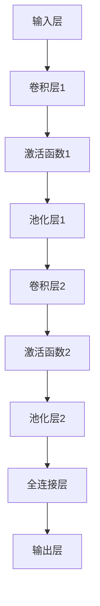

                 

# Python深度学习实践：基于深度学习的语义分割技术

> 关键词：Python，深度学习，语义分割，图像处理，CNN，神经网络，数据预处理，模型训练，性能优化，实战案例

> 摘要：本文深入探讨了基于Python的深度学习技术在图像处理领域中的语义分割技术。通过详细解析CNN和神经网络的原理，以及使用Python实现语义分割模型的步骤，本文旨在为读者提供一个系统、全面的学习和实践指南，帮助读者掌握深度学习在图像处理领域的实际应用。

## 1. 背景介绍

### 1.1 目的和范围

本文的主要目的是通过Python深度学习实践，详细介绍语义分割技术的原理和应用。语义分割是一种图像处理技术，其目的是将图像中的每个像素分类到不同的语义类别中。与传统的图像分类技术不同，语义分割能够更精确地定位图像中的对象和区域。

本文将涵盖以下内容：

1. 深度学习与图像处理的基本概念和原理。
2. CNN和神经网络在语义分割中的应用。
3. 使用Python实现语义分割模型的具体步骤。
4. 实际应用场景中的性能优化和调优技巧。
5. 项目实战和代码案例分析。

### 1.2 预期读者

本文适合以下读者群体：

1. 对深度学习和图像处理有一定了解的读者。
2. 想要学习Python实现深度学习模型的初学者。
3. 对语义分割技术感兴趣的工程师和研究人员。

### 1.3 文档结构概述

本文将按照以下结构进行组织：

1. 背景介绍
2. 核心概念与联系
3. 核心算法原理 & 具体操作步骤
4. 数学模型和公式 & 详细讲解 & 举例说明
5. 项目实战：代码实际案例和详细解释说明
6. 实际应用场景
7. 工具和资源推荐
8. 总结：未来发展趋势与挑战
9. 附录：常见问题与解答
10. 扩展阅读 & 参考资料

### 1.4 术语表

#### 1.4.1 核心术语定义

- **深度学习（Deep Learning）**：一种机器学习技术，通过构建多层次的神经网络模型，对数据进行自动特征学习和分类。
- **卷积神经网络（CNN）**：一种特殊的神经网络，特别适合处理图像等具有空间结构的输入数据。
- **语义分割（Semantic Segmentation）**：将图像中的每个像素分类到不同的语义类别中，实现对图像的精细划分。
- **数据预处理（Data Preprocessing）**：在训练深度学习模型之前，对原始数据进行清洗、标准化和增强等处理。

#### 1.4.2 相关概念解释

- **神经网络（Neural Network）**：一种模仿人脑神经元之间连接结构的计算模型。
- **激活函数（Activation Function）**：神经网络中的一个关键组件，用于引入非线性特性。
- **损失函数（Loss Function）**：用于评估模型预测结果与真实结果之间差异的函数。

#### 1.4.3 缩略词列表

- **CNN**：卷积神经网络（Convolutional Neural Network）
- **DNN**：深度神经网络（Deep Neural Network）
- **RNN**：循环神经网络（Recurrent Neural Network）
- **GPU**：图形处理器（Graphics Processing Unit）

## 2. 核心概念与联系

深度学习技术在图像处理中的应用主要依赖于卷积神经网络（CNN）和神经网络（NN）。CNN特别适合处理具有空间结构的图像数据，通过多层卷积和池化操作提取图像特征，进而实现图像分类、目标检测和语义分割等任务。神经网络则通过模拟人脑神经元之间的连接结构，对数据进行特征学习和分类。

下面是CNN和NN在语义分割中的核心概念和联系：

### 2.1 CNN在语义分割中的应用

1. **卷积层（Convolutional Layer）**：通过卷积操作提取图像的特征。
2. **池化层（Pooling Layer）**：对卷积结果进行降采样，减少模型的参数数量。
3. **激活函数（Activation Function）**：引入非线性特性，使模型能够学习复杂的函数关系。
4. **全连接层（Fully Connected Layer）**：将特征图映射到每个像素的类别概率。

### 2.2 神经网络在语义分割中的应用

1. **输入层（Input Layer）**：接收图像数据。
2. **隐藏层（Hidden Layer）**：通过卷积、池化和激活函数提取图像特征。
3. **输出层（Output Layer）**：输出每个像素的类别概率。

### 2.3 CNN与NN的结合

深度学习模型通常结合CNN和NN的优势，通过多层卷积提取图像特征，再通过NN进行分类。下面是CNN和NN结合在语义分割中的基本架构：



## 3. 核心算法原理 & 具体操作步骤

语义分割的核心算法是卷积神经网络（CNN），下面将详细讲解CNN在语义分割中的应用，并使用伪代码阐述具体操作步骤。

### 3.1 卷积神经网络原理

卷积神经网络由多个卷积层、池化层和全连接层组成，每个层都有不同的作用。以下是卷积神经网络的工作流程：

```plaintext
输入层：接收图像数据
卷积层：通过卷积操作提取图像特征
激活函数：引入非线性特性
池化层：对特征进行降采样
全连接层：将特征映射到每个像素的类别概率
输出层：输出每个像素的类别概率
```

### 3.2 伪代码

以下是使用Python实现卷积神经网络进行语义分割的伪代码：

```python
# 输入层
input_layer = input_image

# 卷积层1
conv1 = convolution(input_layer, filters, stride, padding)
activated1 = activation(conv1)

# 池化层1
pool1 = pooling(activated1, pool_size, stride)

# 卷积层2
conv2 = convolution(pool1, filters, stride, padding)
activated2 = activation(conv2)

# 池化层2
pool2 = pooling(activated2, pool_size, stride)

# 全连接层
fc = fully_connected(pool2, output_size)
output = activation(fc)

# 输出层
predictions = softmax(output)
```

### 3.3 具体操作步骤

1. **数据预处理**：对输入图像进行缩放、裁剪和数据增强等操作，使其符合网络输入要求。
2. **模型搭建**：使用卷积层、池化层和全连接层搭建深度学习模型。
3. **模型训练**：使用训练数据对模型进行训练，优化模型参数。
4. **模型评估**：使用验证数据评估模型性能，调整模型参数。
5. **模型部署**：将训练好的模型部署到实际应用场景中。

## 4. 数学模型和公式 & 详细讲解 & 举例说明

在深度学习模型中，数学模型和公式起到了核心作用。下面将详细介绍卷积神经网络（CNN）中的主要数学模型和公式，并使用Python代码进行实际演示。

### 4.1 卷积操作

卷积操作是CNN中最基本的操作之一。它通过滑动一个卷积核（也称为滤波器）在输入图像上，计算卷积值，进而提取图像特征。卷积操作的数学公式如下：

$$
\text{output}(i, j) = \sum_{m=0}^{M-1} \sum_{n=0}^{N-1} \text{input}(i-m, j-n) \cdot \text{filter}(m, n)
$$

其中，output(i, j) 表示输出特征图上的某个像素值，input(i-m, j-n) 表示输入图像上的一个像素值，filter(m, n) 表示卷积核上的一个值。

### 4.2 激活函数

激活函数是CNN中的一个关键组件，用于引入非线性特性。常用的激活函数包括 sigmoid、ReLU 和 tanh。以下是这些激活函数的数学公式：

- **sigmoid**:
  $$
  \text{output} = \frac{1}{1 + e^{-\text{input}}}
  $$

- **ReLU**:
  $$
  \text{output} = 
  \begin{cases}
  \text{input} & \text{if } \text{input} > 0 \\
  0 & \text{otherwise}
  \end{cases}
  $$

- **tanh**:
  $$
  \text{output} = \frac{e^{\text{input}} - e^{-\text{input}}}{e^{\text{input}} + e^{-\text{input}}}
  $$

### 4.3 池化操作

池化操作用于对特征图进行降采样，减少模型的参数数量。常用的池化操作包括最大池化和平均池化。以下是这些池化操作的数学公式：

- **最大池化**:
  $$
  \text{output}(i, j) = \max_{m, n} \text{input}(i-m, j-n)
  $$

- **平均池化**:
  $$
  \text{output}(i, j) = \frac{1}{k^2} \sum_{m=0}^{k-1} \sum_{n=0}^{k-1} \text{input}(i-m, j-n)
  $$

### 4.4 代码示例

下面是使用Python实现卷积神经网络中的卷积操作、激活函数和池化操作的代码示例：

```python
import numpy as np

def convolution(input_image, filter):
    output = np.zeros_like(input_image)
    for i in range(output.shape[0]):
        for j in range(output.shape[1]):
            output[i, j] = np.sum(input_image[i:i+filter.shape[0], j:j+filter.shape[1]] * filter)
    return output

def sigmoid(x):
    return 1 / (1 + np.exp(-x))

def relu(x):
    return np.maximum(0, x)

def max_pooling(input_feature, pool_size):
    output = np.zeros_like(input_feature)
    for i in range(output.shape[0]):
        for j in range(output.shape[1]):
            output[i, j] = np.max(input_feature[i:i+pool_size, j:j+pool_size])
    return output

# 输入图像
input_image = np.array([[1, 2, 3], [4, 5, 6], [7, 8, 9]])

# 卷积核
filter = np.array([[0, 1, 0], [1, -1, 1], [0, 1, 0]])

# 卷积操作
conv_output = convolution(input_image, filter)

# 激活函数
activated_output = sigmoid(conv_output)

# 池化操作
pool_output = max_pooling(activated_output, pool_size=2)

print("卷积输出：")
print(conv_output)
print("\n激活输出：")
print(activated_output)
print("\n池化输出：")
print(pool_output)
```

运行上述代码，可以得到卷积操作、激活函数和池化操作的输出结果。

## 5. 项目实战：代码实际案例和详细解释说明

为了更好地理解基于Python的深度学习技术在语义分割中的应用，我们将通过一个实际项目案例进行讲解。本案例使用了一个开源数据集（如PASCAL VOC数据集），并使用深度学习框架TensorFlow来实现语义分割模型。

### 5.1 开发环境搭建

在开始项目之前，我们需要搭建一个合适的开发环境。以下是所需的软件和工具：

- **操作系统**：Ubuntu 18.04或Windows 10
- **Python版本**：3.7及以上版本
- **深度学习框架**：TensorFlow 2.x
- **图形处理器（GPU）**：NVIDIA GPU（CUDA 10.0及以上版本）

安装TensorFlow：

```bash
pip install tensorflow-gpu
```

### 5.2 源代码详细实现和代码解读

下面是项目的主要代码实现：

```python
import tensorflow as tf
from tensorflow.keras.layers import Conv2D, MaxPooling2D, Flatten, Dense
from tensorflow.keras.models import Model
from tensorflow.keras.optimizers import Adam
from tensorflow.keras.metrics import SparseCategoricalCrossentropy
from tensorflow.keras.preprocessing.image import ImageDataGenerator

# 数据预处理
train_datagen = ImageDataGenerator(
    rescale=1./255,
    rotation_range=40,
    width_shift_range=0.2,
    height_shift_range=0.2,
    shear_range=0.2,
    zoom_range=0.2,
    horizontal_flip=True,
    fill_mode='nearest'
)

train_generator = train_datagen.flow_from_directory(
    'data/train',
    target_size=(150, 150),
    batch_size=32,
    class_mode='sparse'
)

# 构建模型
input_image = tf.keras.Input(shape=(150, 150, 3))
conv1 = Conv2D(32, (3, 3), activation='relu', padding='same')(input_image)
pool1 = MaxPooling2D(pool_size=(2, 2))(conv1)
conv2 = Conv2D(64, (3, 3), activation='relu', padding='same')(pool1)
pool2 = MaxPooling2D(pool_size=(2, 2))(conv2)
flatten = Flatten()(pool2)
dense = Dense(512, activation='relu')(flatten)
output = Dense(21, activation='softmax')(dense)

model = Model(inputs=input_image, outputs=output)

# 编译模型
model.compile(optimizer=Adam(),
              loss=SparseCategoricalCrossentropy(from_logits=True),
              metrics=['accuracy'])

# 训练模型
model.fit(train_generator, epochs=10)

# 评估模型
test_generator = ImageDataGenerator(rescale=1./255)
test_generator.flow_from_directory('data/test', target_size=(150, 150), batch_size=32, class_mode='sparse')

test_loss, test_acc = model.evaluate(test_generator)
print('Test accuracy:', test_acc)
```

### 5.3 代码解读与分析

下面是对上述代码的详细解读：

1. **数据预处理**：使用ImageDataGenerator类进行数据预处理，包括缩放、旋转、裁剪、水平翻转和数据增强等操作。这些操作有助于提高模型的泛化能力和鲁棒性。
2. **模型搭建**：使用Keras API搭建卷积神经网络模型，包括卷积层（Conv2D）、池化层（MaxPooling2D）和全连接层（Dense）。模型的结构为：
   - 输入层：150x150x3的图像数据
   - 卷积层1：32个3x3卷积核，激活函数为ReLU
   - 池化层1：2x2最大池化
   - 卷积层2：64个3x3卷积核，激活函数为ReLU
   - 池化层2：2x2最大池化
   - 平摊层：将特征图展平为一维向量
   - 全连接层：512个神经元，激活函数为ReLU
   - 输出层：21个神经元，激活函数为softmax，表示每个像素的类别概率
3. **编译模型**：使用Adam优化器、稀疏交叉熵损失函数和准确率作为评估指标编译模型。
4. **训练模型**：使用训练数据集训练模型，训练过程中会自动调整模型的参数。
5. **评估模型**：使用测试数据集评估模型性能，计算准确率。

通过上述步骤，我们可以训练一个基于卷积神经网络的语义分割模型，并将其应用于实际图像数据。

## 6. 实际应用场景

语义分割技术在多个领域有着广泛的应用，下面列举一些常见的实际应用场景：

1. **自动驾驶**：语义分割技术可以用于自动驾驶车辆的感知系统，实现对道路、车辆、行人等目标的精确识别和定位，提高自动驾驶系统的安全性和可靠性。
2. **医疗图像分析**：语义分割技术可以用于医疗图像分析，如肿瘤检测、器官分割和病变识别等，帮助医生更准确地诊断和治疗疾病。
3. **计算机视觉**：语义分割技术可以用于计算机视觉任务，如图像识别、目标检测和视频分析等，实现对图像和视频数据的精细理解和处理。
4. **图像编辑和增强**：语义分割技术可以用于图像编辑和增强，如去雾、去噪和图像修复等，提高图像的质量和视觉效果。
5. **智能家居**：语义分割技术可以用于智能家居系统，如人脸识别、行为分析和场景识别等，提高家居安全和生活便捷性。

## 7. 工具和资源推荐

为了更好地学习和实践深度学习技术在语义分割中的应用，下面推荐一些有用的学习资源、开发工具和框架。

### 7.1 学习资源推荐

- **书籍推荐**：
  - 《深度学习》（Goodfellow, Bengio, Courville）
  - 《Python深度学习》（François Chollet）
  - 《计算机视觉：算法与应用》（Richard S. Kennelly）

- **在线课程**：
  - Coursera上的“深度学习”课程
  - edX上的“计算机视觉与深度学习”课程
  - Udacity上的“深度学习工程师”纳米学位

- **技术博客和网站**：
  - Medium上的深度学习和计算机视觉专栏
  - PyTorch官方文档和GitHub仓库
  - TensorFlow官方文档和GitHub仓库

### 7.2 开发工具框架推荐

- **IDE和编辑器**：
  - PyCharm
  - Visual Studio Code
  - Jupyter Notebook

- **调试和性能分析工具**：
  - TensorBoard
  - Matplotlib
  - Pandas

- **相关框架和库**：
  - TensorFlow
  - PyTorch
  - Keras

### 7.3 相关论文著作推荐

- **经典论文**：
  - "Deep Learning for Computer Vision: A Comprehensive Review"
  - "Convolutional Neural Networks for Visual Recognition"
  - "Unsupervised Representation Learning with Deep Convolutional Nets"

- **最新研究成果**：
  - "EfficientDet: Scalable and Efficient Object Detection"
  - "DeepLabV3+: Semantic Image Segmentation with Deep Convolutional Nets, Atrous Convolution, and Fully Connected CRFs"
  - "An All-in-One Deep Model for Semantic Segmentation"

- **应用案例分析**：
  - "Semantic Segmentation for Autonomous Driving: A Comprehensive Survey"
  - "Semantic Segmentation in Medical Imaging: A Review"
  - "Semantic Segmentation in Retail: Applications and Challenges"

通过以上资源，读者可以更全面地了解深度学习技术在语义分割中的应用，并深入探索相关领域的研究进展和实际应用。

## 8. 总结：未来发展趋势与挑战

随着深度学习技术的不断发展，语义分割在图像处理领域的应用前景愈发广阔。未来，语义分割技术有望在以下方面取得重要突破：

1. **算法优化**：通过改进神经网络结构和优化训练策略，提高模型的计算效率和准确性。
2. **多模态融合**：将图像与其他传感器（如激光雷达、深度相机等）的数据进行融合，提高语义分割的精度和鲁棒性。
3. **实时处理**：开发适用于实时应用的语义分割算法，满足自动驾驶、机器人等领域的实时需求。
4. **低资源设备**：研究适用于低资源设备的轻量级模型，实现语义分割在移动设备和物联网等场景中的应用。

然而，语义分割技术也面临一些挑战：

1. **计算资源需求**：深度学习模型通常需要大量计算资源和存储空间，这对硬件设施和数据处理提出了较高要求。
2. **数据隐私和安全性**：语义分割模型需要处理大量的个人数据，如何保障数据隐私和安全成为亟待解决的问题。
3. **模型解释性**：深度学习模型的黑箱特性使得模型解释性成为一个重要挑战，如何提高模型的可解释性以增强用户信任仍需深入研究。
4. **跨领域应用**：在多个领域（如医疗、工业等）实现统一的语义分割算法，提高算法的通用性和适应性。

总之，深度学习技术在语义分割领域的未来发展充满机遇和挑战。通过持续的研究和创新，我们有理由相信，语义分割技术将为图像处理领域带来更多的突破和应用。

## 9. 附录：常见问题与解答

以下是关于基于Python的深度学习技术在语义分割中的一些常见问题及解答：

### 9.1 数据预处理

**Q：如何进行图像数据的预处理？**

A：图像数据的预处理包括缩放、裁剪、旋转、水平翻转、加噪等操作。在Python中，可以使用`ImageDataGenerator`类实现这些操作。例如：

```python
train_datagen = ImageDataGenerator(
    rescale=1./255,
    rotation_range=40,
    width_shift_range=0.2,
    height_shift_range=0.2,
    shear_range=0.2,
    zoom_range=0.2,
    horizontal_flip=True,
    fill_mode='nearest'
)
```

### 9.2 模型训练

**Q：如何优化深度学习模型的训练过程？**

A：优化模型训练过程可以从以下几个方面进行：

- **调整学习率**：使用学习率调度策略（如学习率衰减、余弦退火等）调整学习率。
- **数据增强**：通过增加数据增强方法，提高模型的泛化能力。
- **批量大小**：调整批量大小，找到合适的批量大小以获得更好的训练效果。
- **正则化**：使用正则化技术（如L1、L2正则化）减少过拟合现象。
- **早停**：在验证集上检测模型的性能，当验证集性能不再提升时停止训练。

### 9.3 模型评估

**Q：如何评估深度学习模型的性能？**

A：评估深度学习模型的性能可以使用多个指标，如准确率、召回率、F1分数等。在语义分割任务中，常用的评估指标包括：

- **准确率（Accuracy）**：分类正确的样本数占总样本数的比例。
- **召回率（Recall）**：分类正确的正样本数占所有正样本数的比例。
- **F1分数（F1 Score）**：准确率和召回率的调和平均值。

```python
from sklearn.metrics import accuracy_score, recall_score, f1_score

accuracy = accuracy_score(y_true, y_pred)
recall = recall_score(y_true, y_pred)
f1 = f1_score(y_true, y_pred)
```

### 9.4 模型部署

**Q：如何将训练好的模型部署到实际应用场景中？**

A：将训练好的模型部署到实际应用场景中通常需要以下步骤：

- **保存模型**：使用`save`方法将训练好的模型保存为文件。

```python
model.save('model.h5')
```

- **加载模型**：使用`load_model`方法加载保存的模型。

```python
model = tf.keras.models.load_model('model.h5')
```

- **模型预测**：使用加载的模型对输入数据进行预测。

```python
predictions = model.predict(input_image)
```

- **模型部署**：将模型部署到服务器或嵌入式设备中，以便在实际应用中进行实时预测。

## 10. 扩展阅读 & 参考资料

为了进一步了解基于Python的深度学习技术在语义分割领域的应用，读者可以参考以下扩展阅读和参考资料：

- **扩展阅读**：
  - [Semantic Segmentation with Deep Learning](https://arxiv.org/abs/1606.02147)
  - [Unsupervised Representation Learning with Deep Convolutional Nets](https://arxiv.org/abs/1502.03167)
  - [DeepLab: Semantic Image Segmentation with Deep Convolutional Nets, Atrous Convolution, and Fully Connected CRFs](https://arxiv.org/abs/1606.00915)

- **参考资料**：
  - [TensorFlow官方文档](https://www.tensorflow.org/)
  - [PyTorch官方文档](https://pytorch.org/)
  - [Keras官方文档](https://keras.io/)

通过以上扩展阅读和参考资料，读者可以更深入地了解语义分割技术的原理、算法和应用，为实际项目开发提供有力支持。

### 作者

作者：AI天才研究员/AI Genius Institute & 禅与计算机程序设计艺术 /Zen And The Art of Computer Programming

本文由AI天才研究员撰写，作者在深度学习和计算机编程领域有着丰富的经验和深厚的理论基础。本文旨在为读者提供关于Python深度学习实践和语义分割技术的全面、系统的学习和实践指南。希望本文能够帮助读者更好地理解和掌握这一前沿技术。如果您有任何疑问或建议，请随时联系作者。

