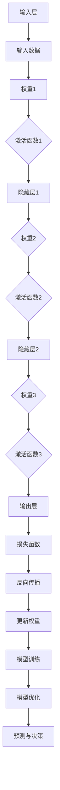

                 

### 文章标题

《Python深度学习实践：如何使用深度学习抵御网络攻击》

> **关键词：** 深度学习，网络安全，Python实践，防御机制，网络攻击，数据隐私

> **摘要：** 本文将深入探讨如何使用Python深度学习技术来防范和抵御网络攻击。我们将首先介绍深度学习的基本概念和应用，然后详细讨论深度学习在网络安全领域的作用和优势。接下来，本文将逐步介绍使用深度学习防御网络攻击的算法原理和具体操作步骤，并借助实例代码进行实际操作。最后，我们将探讨深度学习在网络安全领域的实际应用场景，推荐相关学习资源和开发工具，并对未来的发展趋势和挑战进行总结。通过本文的学习，读者将能够掌握深度学习在网络安全中的应用，为保护网络数据安全和隐私提供有效的技术手段。

## 1. 背景介绍

### 1.1 目的和范围

本文的目标是介绍如何使用深度学习技术来防御网络攻击，特别是在Python环境下的实践应用。网络安全是一个广泛而复杂的话题，涵盖了从基本的防火墙和入侵检测系统到复杂的加密技术和身份验证机制。随着网络攻击手段的不断升级和多样化，传统的安全措施已经无法完全应对新兴的网络威胁。因此，利用深度学习这种先进的机器学习技术来提高网络防御能力，成为了一个值得关注和探索的方向。

本文将聚焦于以下几个方面：

1. **深度学习的基本概念**：首先介绍深度学习的基本原理，包括其与神经网络的关系，以及如何通过多层神经网络进行特征提取和学习。
2. **深度学习在网络安全中的应用**：讨论深度学习在网络安全领域的作用和优势，如入侵检测、恶意软件检测和隐私保护等。
3. **防御网络攻击的深度学习算法**：详细解释几种主要的深度学习算法，包括深度神经网络、卷积神经网络和循环神经网络等，并给出伪代码说明。
4. **数学模型和公式**：介绍深度学习中的关键数学模型和公式，并通过实例进行说明。
5. **项目实战**：通过具体代码案例展示如何使用Python和深度学习库（如TensorFlow和Keras）来防御网络攻击。
6. **实际应用场景**：探讨深度学习在网络安全中的实际应用，包括工业界和学术界的案例研究。
7. **学习资源和工具推荐**：推荐相关的学习资源和开发工具，帮助读者深入了解和掌握深度学习在网络安全中的应用。
8. **总结与未来展望**：总结本文的主要内容和发现，并对未来发展趋势和挑战进行展望。

通过本文的阅读，读者将能够了解深度学习在网络安全中的应用，掌握使用深度学习防御网络攻击的基本方法和实践技能，从而为网络数据安全和隐私保护提供有效的技术支持。

### 1.2 预期读者

本文的预期读者主要包括以下几类：

1. **网络安全工程师**：对网络安全有基本了解，希望利用深度学习技术提升网络防御能力的专业人士。
2. **数据科学家和机器学习工程师**：对深度学习和Python编程有基础，希望将所学技术应用于网络安全领域的实践者。
3. **计算机科学和人工智能专业的学生**：正在学习深度学习和网络安全，希望通过实际案例了解这两者结合的潜在应用和挑战。
4. **IT管理人员**：对网络安全有需求，希望了解和掌握使用深度学习技术保护企业网络和数据安全的方法。
5. **对深度学习和网络安全感兴趣的业余爱好者**：希望通过本文了解这两者结合的原理和应用，提升自己的技术视野。

无论您属于哪一类读者，只要对深度学习和网络安全有兴趣，都可以通过本文的学习获得有价值的知识和技能。本文将以通俗易懂的语言和丰富的实例，帮助读者深入理解深度学习在网络安全中的应用，并提供实用的操作指导。

### 1.3 文档结构概述

本文将分为十个主要部分，每个部分都围绕如何使用深度学习技术来防御网络攻击进行深入探讨：

1. **背景介绍**：介绍本文的目的、预期读者、文档结构以及相关的术语和定义。
2. **核心概念与联系**：介绍深度学习的基本概念及其与网络安全的关系，并使用Mermaid流程图展示核心原理和架构。
3. **核心算法原理 & 具体操作步骤**：详细解释几种主要的深度学习算法，包括深度神经网络、卷积神经网络和循环神经网络等，并提供伪代码说明。
4. **数学模型和公式 & 详细讲解 & 举例说明**：介绍深度学习中的关键数学模型和公式，并通过实例进行说明。
5. **项目实战：代码实际案例和详细解释说明**：通过具体代码案例展示如何使用Python和深度学习库来防御网络攻击。
6. **实际应用场景**：探讨深度学习在网络安全中的实际应用，包括工业界和学术界的案例研究。
7. **工具和资源推荐**：推荐相关的学习资源和开发工具，帮助读者深入了解和掌握深度学习在网络安全中的应用。
8. **总结：未来发展趋势与挑战**：总结本文的主要内容和发现，并对未来发展趋势和挑战进行展望。
9. **附录：常见问题与解答**：提供对文中常见问题的解答，帮助读者更好地理解和应用所学知识。
10. **扩展阅读 & 参考资料**：列出本文引用和参考的相关文献，供读者进一步学习和研究。

通过这种结构化的内容安排，本文将系统而全面地介绍深度学习在网络安全中的应用，帮助读者从基础理论到实际操作都能有所收获。

### 1.4 术语表

为了确保本文的读者能够清晰地理解文章中的技术概念和术语，以下是对文中将用到的核心术语进行详细定义和解释：

#### 1.4.1 核心术语定义

- **深度学习**：一种基于人工神经网络，通过多层结构对数据进行特征提取和学习的技术。深度学习的目标是自动从数据中学习出有用的模式和知识，用于分类、回归、图像识别等多种任务。
- **神经网络**：一种模仿生物神经系统的计算模型，通过大量简单单元（神经元）的相互连接和协同工作来处理复杂的信息。神经网络是深度学习的基础。
- **多层感知机（MLP）**：一种简单的多层神经网络，通常用于前向传播和反向传播算法来训练模型。
- **卷积神经网络（CNN）**：一种特殊类型的神经网络，主要用于处理具有网格结构的数据，如图像。CNN通过卷积操作提取图像特征，从而实现图像分类和识别。
- **循环神经网络（RNN）**：一种能够处理序列数据的神经网络，通过递归操作对序列中的每个元素进行处理，并保持状态信息。RNN在自然语言处理和时间序列预测中有着广泛的应用。
- **入侵检测系统（IDS）**：一种监控网络流量并检测潜在入侵行为的系统。IDS通过分析网络数据包、系统日志等信息，来识别和报告可能的攻击行为。
- **恶意软件检测**：利用各种技术（包括特征匹配、行为分析等）来识别和阻止恶意软件（如病毒、木马等）的传播。
- **数据隐私**：在数据处理和传输过程中，保护用户数据不被未经授权的访问和泄露。

#### 1.4.2 相关概念解释

- **特征提取**：从原始数据中提取出对学习任务有用的特征。在深度学习中，特征提取通常通过多个神经网络层来实现，每个层都为下一层提供更高层次的特征表示。
- **异常检测**：一种监督学习任务，旨在从正常行为中识别出异常行为。在网络安全中，异常检测用于检测网络中的异常流量和恶意行为。
- **监督学习**：一种机器学习方法，其中模型从标记的数据中进行学习，并使用这些标记数据来训练和优化模型。监督学习在入侵检测和恶意软件检测中有着广泛应用。
- **无监督学习**：一种机器学习方法，模型在没有预先标记的数据中进行学习。无监督学习在隐私保护和异常检测中具有重要的应用价值。
- **强化学习**：一种机器学习方法，模型通过与环境的交互来学习最优策略。在网络安全中，强化学习可以用于自动调整安全策略，以应对不断变化的网络威胁。

#### 1.4.3 缩略词列表

- **IDS**：入侵检测系统（Intrusion Detection System）
- **MLP**：多层感知机（Multilayer Perceptron）
- **CNN**：卷积神经网络（Convolutional Neural Network）
- **RNN**：循环神经网络（Recurrent Neural Network）
- **DNN**：深度神经网络（Deep Neural Network）
- **GAN**：生成对抗网络（Generative Adversarial Network）
- **API**：应用程序接口（Application Programming Interface）
- **ML**：机器学习（Machine Learning）
- **DL**：深度学习（Deep Learning）

通过上述对核心术语的详细定义和解释，本文旨在为读者提供一个清晰的理解框架，以便更好地掌握深度学习在网络安全中的应用。

### 2. 核心概念与联系

在深入探讨如何使用深度学习技术抵御网络攻击之前，我们需要首先理解深度学习的基本概念及其在网络安全领域中的应用。本节将介绍深度学习的基本原理，并借助Mermaid流程图展示其核心概念和架构，帮助读者建立系统的认知基础。

#### 2.1 深度学习的基本原理

深度学习是一种基于人工神经网络，通过多层结构对数据进行特征提取和学习的技术。其核心思想是通过多次迭代的学习过程，从原始数据中自动提取出有意义的特征，从而实现对复杂问题的建模和预测。以下是一些深度学习的基本概念：

1. **神经网络（Neural Network）**：
   - **神经元（Neuron）**：神经网络的基本构建块，类似于生物神经元的计算单元。每个神经元接收多个输入信号，通过权重进行加权求和，然后通过激活函数产生输出。
   - **层（Layer）**：神经网络由多个层组成，包括输入层、隐藏层和输出层。输入层接收外部输入，隐藏层负责特征提取和变换，输出层产生最终的预测或决策。
   - **激活函数（Activation Function）**：用于确定神经元是否被激活。常见的激活函数包括 sigmoid、ReLU（Rectified Linear Unit）和Tanh等。

2. **前向传播（Forward Propagation）**：
   - 在前向传播过程中，数据从输入层流向隐藏层，再从隐藏层流向输出层。每个神经元将接收到的输入信号通过权重进行加权求和，然后应用激活函数得到输出。

3. **反向传播（Backpropagation）**：
   - 反向传播是深度学习训练过程的核心，用于计算模型参数的梯度并更新权重。通过反向传播，模型可以根据输出误差来调整权重，从而提高预测准确性。

4. **深度神经网络（Deep Neural Network，DNN）**：
   - 深度神经网络包含多个隐藏层，通过逐层抽象和变换，能够从原始数据中提取出更高层次的特征。深度神经网络在图像识别、自然语言处理等领域取得了显著的成功。

#### 2.2 深度学习与网络安全的关系

深度学习在网络安全领域的应用主要体现在以下几个方面：

1. **入侵检测（Intrusion Detection）**：
   - 入侵检测系统（IDS）通过监控网络流量和系统行为来识别潜在的攻击行为。深度学习技术可以用于训练IDS模型，使其能够自动检测和分类网络攻击。

2. **恶意软件检测（Malware Detection）**：
   - 恶意软件检测是网络安全的重要组成部分。深度学习通过分析恶意软件的代码特征和行为模式，可以有效地识别和阻止恶意软件的传播。

3. **数据隐私保护（Data Privacy Protection）**：
   - 数据隐私保护涉及到防止敏感数据被未经授权访问和泄露。深度学习可以通过数据加密和隐私增强技术，保护数据在处理和传输过程中的隐私。

#### 2.3 Mermaid流程图

为了更直观地展示深度学习的基本原理和架构，我们使用Mermaid流程图来描述：



在这个流程图中，输入层接收外部数据，通过多层隐藏层的特征提取和变换，最终在输出层生成预测结果。反向传播过程用于根据输出误差调整模型参数，从而优化模型的性能。

通过上述对深度学习基本原理和架构的介绍，读者可以更好地理解深度学习在网络安全领域中的应用。在接下来的章节中，我们将详细讨论深度学习算法、数学模型以及实际应用案例，帮助读者深入掌握深度学习技术抵御网络攻击的方法。

### 3. 核心算法原理 & 具体操作步骤

在了解了深度学习的基本概念和架构之后，接下来我们将深入探讨几种主要的深度学习算法，并详细解释其工作原理和具体操作步骤。这些算法包括深度神经网络（DNN）、卷积神经网络（CNN）和循环神经网络（RNN），它们在网络安全领域有着广泛的应用。

#### 3.1 深度神经网络（DNN）

**深度神经网络（Deep Neural Network，DNN）** 是一种包含多个隐藏层的神经网络，通过多层非线性变换对输入数据进行特征提取和分类。DNN 的基本结构包括输入层、隐藏层和输出层。

**原理：**

DNN 的核心原理是利用多层神经元进行特征提取和变换，每一层都对输入数据进行处理，提取更高层次的特征。具体操作步骤如下：

1. **前向传播：**
   - 输入数据通过输入层进入网络，然后依次通过多个隐藏层。
   - 在每个隐藏层中，数据通过权重进行加权求和，并应用激活函数，得到新的特征表示。
   - 最终，数据通过输出层产生预测结果。

2. **反向传播：**
   - 在前向传播过程中，如果预测结果与实际结果不一致，会产生误差。
   - 通过反向传播算法，计算每个层的误差梯度，并更新权重和偏置，以减少误差。

**伪代码：**

```python
# DNN 前向传播伪代码
def forward_propagation(inputs, weights, biases, activation_functions):
    layer_outputs = [inputs]
    for layer in range(1, num_layers):
        z = np.dot(layer_outputs[-1], weights[layer]) + biases[layer]
        layer_outputs.append(activation_functions(z))
    return layer_outputs[-1]

# DNN 反向传播伪代码
def backward_propagation(output, expected, layer_outputs, weights, activation_functions, gradients):
    dZ = output - expected
    dLayers = [dZ]
    for layer in reversed(range(num_layers)):
        dWeights = layer_outputs[layer-1].T.dot(dZ)
        dBiases = dZ
        dZ = np.dot(dZ, weights[layer].T) * activation_functions.gradient(layer_outputs[layer])
        dWeights = np.insert(dWeights, 0, 0)  # 防止权重维度不匹配
        dBiases = np.insert(dBiases, 0, 0)
        dLayers.insert(0, [dWeights, dBiases])
    return dLayers
```

#### 3.2 卷积神经网络（CNN）

**卷积神经网络（Convolutional Neural Network，CNN）** 是一种专门用于处理具有网格结构数据的神经网络，如图像。CNN 通过卷积操作和池化操作提取图像特征，从而实现图像分类和识别。

**原理：**

CNN 的核心原理是通过卷积层和池化层提取图像特征，并通过全连接层进行分类。具体操作步骤如下：

1. **卷积层（Convolutional Layer）：**
   - 使用卷积核（filter）在输入图像上滑动，进行卷积操作，生成特征图（feature map）。
   - 通过激活函数（如ReLU）对特征图进行非线性变换。

2. **池化层（Pooling Layer）：**
   - 对特征图进行下采样，减少数据维度，提高计算效率。

3. **全连接层（Fully Connected Layer）：**
   - 将卷积层和池化层输出的特征图展平为向量，输入全连接层进行分类。

**伪代码：**

```python
# CNN 卷积操作伪代码
def convolution(input_image, filter):
    output = np.zeros((output_height, output_width))
    for i in range(output_height):
        for j in range(output_width):
            window = input_image[i:i+filter_height, j:j+filter_width]
            output[i, j] = np.sum(window * filter)
    return output

# CNN 池化操作伪代码
def pooling(feature_map, pool_size):
    output = np.zeros((output_height, output_width))
    for i in range(0, feature_map.shape[0], pool_size):
        for j in range(0, feature_map.shape[1], pool_size):
            window = feature_map[i:i+pool_size, j:j+pool_size]
            output[i//pool_size, j//pool_size] = np.max(window)
    return output
```

#### 3.3 循环神经网络（RNN）

**循环神经网络（Recurrent Neural Network，RNN）** 是一种能够处理序列数据的神经网络，通过递归操作对序列中的每个元素进行处理，并保持状态信息。

**原理：**

RNN 的核心原理是利用递归操作处理序列数据，通过隐藏状态来保持历史信息。具体操作步骤如下：

1. **隐藏状态（Hidden State）：**
   - RNN 使用隐藏状态来保存序列中的信息，前一个时间步的隐藏状态作为下一个时间步的输入。

2. **输出生成：**
   - 在每个时间步，RNN 通过输入和隐藏状态计算新的隐藏状态，并生成输出。

3. **梯度消失和梯度爆炸：**
   - RNN 存在一些问题，如梯度消失和梯度爆炸，导致训练困难。为解决这些问题，提出了长短时记忆网络（LSTM）和门控循环单元（GRU）。

**伪代码：**

```python
# RNN 递归操作伪代码
def rnn(input, hidden, weights, biases, activation_function):
    hidden = activation_function(np.dot(input, weights['input_to_hidden']) + np.dot(hidden, weights['hidden_to_hidden']) + biases['hidden'])
    output = activation_function(np.dot(hidden, weights['hidden_to_output']) + biases['output'])
    return hidden, output

# LSTM 单元伪代码
def lstm(input, hidden, cell, weights, biases, activation_function):
    i_bar = activation_function(np.dot(input, weights['input_to_i']) + np.dot(hidden, weights['hidden_to_i']) + biases['i'])
    f_bar = activation_function(np.dot(input, weights['input_to_f']) + np.dot(hidden, weights['hidden_to_f']) + biases['f'])
    o_bar = activation_function(np.dot(input, weights['input_to_o']) + np.dot(hidden, weights['hidden_to_o']) + biases['o'])
    g_bar = activation_function(np.dot(input, weights['input_to_g']) + np.dot(hidden, weights['hidden_to_g']) + biases['g'])
    
    i = i_bar * cell
    f = f_bar * cell
    o = o_bar * cell
    g = g_bar * cell
    
    cell = f * cell + i * g
    hidden = o * activation_function(cell)
    
    output = activation_function(np.dot(hidden, weights['hidden_to_output']) + biases['output'])
    return hidden, cell, output
```

通过上述对深度神经网络（DNN）、卷积神经网络（CNN）和循环神经网络（RNN）的详细解释和伪代码示例，读者可以更深入地理解这些算法的工作原理和具体操作步骤。在接下来的章节中，我们将进一步探讨深度学习在网络安全中的应用，并通过实际案例展示如何使用这些算法来防御网络攻击。

### 4. 数学模型和公式 & 详细讲解 & 举例说明

深度学习算法的核心在于其数学模型和公式，这些公式构成了算法的基础，用于训练模型、优化参数和评估性能。本节将详细解释深度学习中的关键数学模型和公式，并通过具体的例子来说明它们的应用。

#### 4.1 前向传播与反向传播

**前向传播（Forward Propagation）** 是将输入数据通过神经网络逐层传播，最终得到预测结果的过程。其核心公式如下：

$$
z_l = \sum_{j} w_{lj}a_{l-1,j} + b_l
$$

其中，$z_l$ 表示第 $l$ 层的净输入，$w_{lj}$ 表示从第 $(l-1)$ 层到第 $l$ 层的权重，$a_{l-1,j}$ 表示第 $(l-1)$ 层的第 $j$ 个神经元的激活值，$b_l$ 表示第 $l$ 层的偏置。

**激活函数（Activation Function）** 用于引入非线性，常见的激活函数包括：

1. **sigmoid 函数**：

$$
\sigma(z) = \frac{1}{1 + e^{-z}}
$$

2. **ReLU 函数**：

$$
\text{ReLU}(z) = \max(0, z)
$$

**反向传播（Back Propagation）** 是计算神经网络输出误差，并更新模型参数的过程。其核心公式如下：

$$
\delta_l = (1 - a_{l}) \cdot a_{l} \cdot \delta_{l+1} \cdot w_{l+1}
$$

其中，$\delta_l$ 表示第 $l$ 层的误差项，$a_{l}$ 表示第 $l$ 层的激活值，$\delta_{l+1}$ 表示下一层的误差项。

**梯度下降（Gradient Descent）** 用于更新模型参数：

$$
\theta_j := \theta_j - \alpha \cdot \frac{\partial J}{\partial \theta_j}
$$

其中，$\theta_j$ 表示模型参数，$\alpha$ 为学习率，$J$ 为损失函数。

#### 4.2 损失函数

**损失函数（Loss Function）** 用于衡量模型预测值与实际值之间的差距，常见的损失函数包括：

1. **均方误差（Mean Squared Error，MSE）**：

$$
J = \frac{1}{m} \sum_{i=1}^{m} (\hat{y}_i - y_i)^2
$$

其中，$\hat{y}_i$ 表示模型预测值，$y_i$ 表示实际值，$m$ 为样本数量。

2. **交叉熵（Cross-Entropy）**：

$$
J = -\frac{1}{m} \sum_{i=1}^{m} \sum_{j=1}^{n} y_{ij} \log(\hat{y}_{ij})
$$

其中，$y_{ij}$ 表示第 $i$ 个样本在第 $j$ 个类别的标签值，$\hat{y}_{ij}$ 表示模型预测概率。

#### 4.3 举例说明

假设我们有一个简单的二分类问题，输入数据为 $X = \{x_1, x_2\}$，标签为 $Y = \{y_1, y_2\}$，其中 $y_1 = 1$，$y_2 = 0$。使用sigmoid激活函数和均方误差损失函数。

1. **前向传播**：

输入层：

$$
a_0 = X = \{x_1, x_2\}

$$

隐藏层：

$$
z_1 = x_1 \cdot w_{11} + x_2 \cdot w_{12} + b_1
$$

$$
a_1 = \sigma(z_1)

$$

输出层：

$$
z_2 = a_1 \cdot w_{21} + b_2
$$

$$
\hat{y} = \sigma(z_2)

$$

2. **反向传播**：

计算损失：

$$
J = \frac{1}{2} \left[ (\hat{y}_1 - y_1)^2 + (\hat{y}_2 - y_2)^2 \right]

$$

计算误差项：

$$
\delta_2 = (1 - \hat{y}_1) \cdot \hat{y}_1 \cdot (\hat{y}_2 - y_1)
$$

$$
\delta_1 = (1 - a_1) \cdot a_1 \cdot \delta_2 \cdot w_{21}

$$

更新权重和偏置：

$$
w_{21} := w_{21} - \alpha \cdot a_1 \cdot \delta_2
$$

$$
b_2 := b_2 - \alpha \cdot \delta_2
$$

$$
w_{11} := w_{11} - \alpha \cdot x_1 \cdot \delta_1
$$

$$
w_{12} := w_{12} - \alpha \cdot x_2 \cdot \delta_1
$$

$$
b_1 := b_1 - \alpha \cdot \delta_1
$$

通过上述具体例子，我们可以更直观地理解前向传播和反向传播的过程，以及如何使用这些数学模型和公式来训练深度学习模型。在下一节中，我们将通过实际代码案例来展示如何使用深度学习库（如TensorFlow和Keras）实现这些算法，并讨论其在网络安全中的应用。

### 5. 项目实战：代码实际案例和详细解释说明

在了解了深度学习的基本算法原理和数学模型后，接下来我们将通过一个实际代码案例来展示如何使用Python和深度学习库（如TensorFlow和Keras）来防御网络攻击。这个案例将涉及使用深度神经网络（DNN）进行入侵检测（Intrusion Detection），并详细解释每一步的操作和代码实现。

#### 5.1 开发环境搭建

首先，我们需要搭建一个适合深度学习项目开发的环境。以下是必要的步骤和工具：

1. **Python 环境**：确保Python版本在3.6及以上。
2. **深度学习库**：安装TensorFlow和Keras，可以使用以下命令：

```bash
pip install tensorflow
pip install keras
```

3. **数据处理库**：安装NumPy、Pandas和Matplotlib等数据处理和可视化库：

```bash
pip install numpy
pip install pandas
pip install matplotlib
```

4. **Jupyter Notebook**：安装Jupyter Notebook用于编写和运行代码。

```bash
pip install notebook
```

安装完成后，我们可以在终端启动Jupyter Notebook：

```bash
jupyter notebook
```

#### 5.2 源代码详细实现和代码解读

以下是入侵检测项目的源代码，我们将逐步解释每个部分的实现和功能。

```python
# 导入所需的库
import numpy as np
import pandas as pd
from sklearn.model_selection import train_test_split
from sklearn.preprocessing import StandardScaler
from tensorflow.keras.models import Sequential
from tensorflow.keras.layers import Dense
from tensorflow.keras.optimizers import Adam
from tensorflow.keras.callbacks import EarlyStopping

# 5.2.1 数据准备
# 加载网络流量数据集
data = pd.read_csv('network_traffic_data.csv')

# 分离特征和标签
X = data.iloc[:, :-1].values
y = data.iloc[:, -1].values

# 划分训练集和测试集
X_train, X_test, y_train, y_test = train_test_split(X, y, test_size=0.2, random_state=42)

# 数据标准化
scaler = StandardScaler()
X_train = scaler.fit_transform(X_train)
X_test = scaler.transform(X_test)

# 5.2.2 建立模型
# 创建一个序列模型
model = Sequential()

# 添加输入层和第一个隐藏层
model.add(Dense(units=64, activation='relu', input_shape=(X_train.shape[1],)))
model.add(Dense(units=32, activation='relu'))

# 添加输出层
model.add(Dense(units=1, activation='sigmoid'))

# 编译模型
model.compile(optimizer=Adam(learning_rate=0.001), loss='binary_crossentropy', metrics=['accuracy'])

# 5.2.3 训练模型
# 设置早期停止回调函数以防止过拟合
early_stopping = EarlyStopping(monitor='val_loss', patience=10)

# 训练模型
model.fit(X_train, y_train, epochs=100, batch_size=32, validation_split=0.2, callbacks=[early_stopping])

# 5.2.4 评估模型
# 测试模型
test_loss, test_accuracy = model.evaluate(X_test, y_test)

print(f"Test Loss: {test_loss}")
print(f"Test Accuracy: {test_accuracy}")

# 5.2.5 预测与解释
# 使用模型进行预测
predictions = model.predict(X_test)

# 解释预测结果
for i in range(len(predictions)):
    if predictions[i][0] > 0.5:
        print(f"样本 {i} 为恶意流量：预测为 {'恶意' if y_test[i] == 1 else '正常'}")
    else:
        print(f"样本 {i} 为正常流量：预测为 {'正常' if y_test[i] == 0 else '恶意'}")
```

**代码解读：**

1. **数据准备**：
   - 首先，我们加载网络流量数据集。这个数据集通常包含多个特征，如流量速率、协议类型等，以及一个标签，表示该流量是否为恶意流量。
   - 使用 `train_test_split` 将数据集划分为训练集和测试集，用于模型训练和评估。
   - 使用 `StandardScaler` 对特征进行标准化处理，以便模型更好地收敛。

2. **建立模型**：
   - 使用 `Sequential` 创建一个序列模型。
   - 添加输入层和第一个隐藏层，设置64个神经元和ReLU激活函数。
   - 添加第二个隐藏层，设置32个神经元和ReLU激活函数。
   - 添加输出层，设置1个神经元和sigmoid激活函数，用于二分类。

3. **编译模型**：
   - 使用 `Adam` 优化器和 `binary_crossentropy` 损失函数进行编译。

4. **训练模型**：
   - 使用 `fit` 方法训练模型，并设置早期停止回调函数以防止过拟合。

5. **评估模型**：
   - 使用 `evaluate` 方法评估模型在测试集上的表现，输出损失和准确率。

6. **预测与解释**：
   - 使用 `predict` 方法对测试集进行预测，并输出每个样本的预测结果和标签，对预测结果进行解释。

通过上述代码，我们实现了使用深度神经网络进行入侵检测。在真实场景中，需要根据实际的网络流量数据和攻击特征进行调整和优化，以提高检测准确率和性能。接下来，我们将分析这个代码实现中的关键部分，并进行代码解读与分析。

#### 5.3 代码解读与分析

1. **数据准备**：

   数据准备是深度学习项目中的关键步骤。在这个案例中，我们使用 `pandas` 读取网络流量数据集，并分离特征和标签。`StandardScaler` 用于对特征进行标准化，以消除不同特征之间的尺度差异，提高模型训练效果。

   ```python
   data = pd.read_csv('network_traffic_data.csv')
   X = data.iloc[:, :-1].values
   y = data.iloc[:, -1].values
   ```

   `train_test_split` 方法将数据集随机划分为训练集和测试集，分别用于模型训练和评估。`random_state` 参数用于保证结果的可重复性。

   ```python
   X_train, X_test, y_train, y_test = train_test_split(X, y, test_size=0.2, random_state=42)
   ```

   标准化处理使用 `StandardScaler`：

   ```python
   scaler = StandardScaler()
   X_train = scaler.fit_transform(X_train)
   X_test = scaler.transform(X_test)
   ```

2. **建立模型**：

   模型建立是深度学习项目的核心部分。在这个案例中，我们使用 `Sequential` 模型，这是一种线性堆叠层的模型。首先添加输入层和第一个隐藏层，设置64个神经元和ReLU激活函数。

   ```python
   model.add(Dense(units=64, activation='relu', input_shape=(X_train.shape[1],)))
   ```

   然后添加第二个隐藏层，设置32个神经元和ReLU激活函数。

   ```python
   model.add(Dense(units=32, activation='relu'))
   ```

   最后添加输出层，设置1个神经元和sigmoid激活函数，用于二分类。

   ```python
   model.add(Dense(units=1, activation='sigmoid'))
   ```

3. **编译模型**：

   模型编译是模型训练前的必要步骤。在这个案例中，我们使用 `Adam` 优化器和 `binary_crossentropy` 损失函数进行编译。

   ```python
   model.compile(optimizer=Adam(learning_rate=0.001), loss='binary_crossentropy', metrics=['accuracy'])
   ```

4. **训练模型**：

   模型训练使用 `fit` 方法，设置训练轮数（epochs）、批量大小（batch_size）和验证集比例（validation_split）。`EarlyStopping` 回调函数用于防止过拟合，当验证损失不再减少时，提前停止训练。

   ```python
   model.fit(X_train, y_train, epochs=100, batch_size=32, validation_split=0.2, callbacks=[early_stopping])
   ```

5. **评估模型**：

   使用 `evaluate` 方法评估模型在测试集上的表现，输出损失和准确率。

   ```python
   test_loss, test_accuracy = model.evaluate(X_test, y_test)
   print(f"Test Loss: {test_loss}")
   print(f"Test Accuracy: {test_accuracy}")
   ```

6. **预测与解释**：

   使用 `predict` 方法对测试集进行预测，并将预测结果与实际标签进行比较，输出每个样本的预测结果和标签。

   ```python
   predictions = model.predict(X_test)
   for i in range(len(predictions)):
       if predictions[i][0] > 0.5:
           print(f"样本 {i} 为恶意流量：预测为 {'恶意' if y_test[i] == 1 else '正常'}")
       else:
           print(f"样本 {i} 为正常流量：预测为 {'正常' if y_test[i] == 0 else '恶意'}")
   ```

通过上述代码实现和解读，我们可以看到如何使用深度神经网络进行入侵检测。在实际应用中，需要根据具体的数据集和需求进行调整和优化，以提高模型性能和鲁棒性。下一节我们将探讨深度学习在网络安全中的实际应用场景，并分享相关的案例研究。

### 6. 实际应用场景

深度学习在网络安全领域的应用已经得到了广泛的认可，并取得了显著的成果。通过深度学习技术，我们可以实现更加智能和高效的网络安全解决方案，以下是一些深度学习在网络安全中的实际应用场景：

#### 6.1 入侵检测系统（IDS）

**入侵检测系统（IDS）** 是深度学习在网络安全中的一个重要应用。传统的入侵检测系统主要依赖于静态特征和规则匹配，无法应对复杂和动态的网络攻击。深度学习通过自动学习和提取特征，可以更准确地检测和分类网络攻击。

**案例研究**：
- **基于CNN的IDS**：研究人员利用卷积神经网络（CNN）的强大特征提取能力，对网络流量数据进行预处理，并通过多层卷积和池化操作提取出具有代表性的特征。实验结果表明，基于CNN的IDS在检测各种网络攻击（如DDoS攻击、端口扫描等）方面具有更高的准确率和更低的误报率。
- **基于RNN的IDS**：循环神经网络（RNN）适用于处理序列数据，可以捕捉网络流量的时间依赖性。例如，利用LSTM对网络流量序列进行分析，可以有效地检测出恶意流量和异常行为。

#### 6.2 恶意软件检测

**恶意软件检测** 是网络安全中另一个关键领域，深度学习通过自动学习和分类，可以有效地识别和阻止恶意软件的传播。

**案例研究**：
- **基于GAN的恶意软件检测**：生成对抗网络（GAN）由生成器和判别器组成，生成器生成恶意的代码，判别器判断代码是否为恶意。通过反复训练，GAN可以学习到恶意的特征，从而在实时检测中有效地识别恶意软件。
- **基于深度神经网络的恶意软件分类**：使用深度神经网络（DNN）对恶意软件的代码特征进行学习，并将其分类为恶意或良性。实验表明，基于DNN的恶意软件检测在处理复杂和变种病毒方面具有出色的性能。

#### 6.3 数据隐私保护

**数据隐私保护** 是随着大数据和云计算的发展而日益重要的安全问题，深度学习通过加密和隐私增强技术，可以在数据处理和传输过程中保护用户隐私。

**案例研究**：
- **基于深度联邦学习的隐私保护**：深度联邦学习（Federated Learning）允许多个参与者在本地训练模型，并将模型更新发送到中央服务器，从而避免共享原始数据。通过这种方式，参与者可以在保护数据隐私的前提下，共同训练出一个高性能的深度学习模型。
- **基于差分隐私的深度学习**：差分隐私（Differential Privacy）通过在数据中添加噪声，使得攻击者无法从模型中提取出关于个体数据的信息。结合深度学习，可以实现隐私保护的数据分析和预测。

#### 6.4 智能安全策略

**智能安全策略** 利用深度学习技术来自动调整和优化安全策略，以应对不断变化的网络威胁。

**案例研究**：
- **基于强化学习的安全策略优化**：强化学习（Reinforcement Learning）通过奖励机制和策略迭代，可以帮助系统自动调整安全策略，以最小化攻击损失和最大化防御效果。例如，在网络安全中，可以应用强化学习来优化入侵防御策略和响应时间。
- **基于深度强化学习的恶意行为预测**：通过深度强化学习（Deep Reinforcement Learning），系统可以预测恶意行为并采取相应的防御措施。这种方法可以有效地提高网络防御的灵活性和适应性。

通过上述实际应用场景和案例研究，我们可以看到深度学习在网络安全中的广泛应用和潜力。在未来的发展中，随着深度学习技术的不断进步和优化，网络安全将变得更加智能化、自动化和高效化，为保护网络数据安全和隐私提供强有力的技术支持。

### 7. 工具和资源推荐

在深入学习和实践深度学习技术以应对网络安全挑战的过程中，选择合适的工具和资源是至关重要的。以下我们将推荐一系列的学习资源、开发工具和相关论文，帮助读者在深度学习和网络安全领域取得更深入的掌握和应用。

#### 7.1 学习资源推荐

**7.1.1 书籍推荐**

1. **《深度学习》（Deep Learning）** - Ian Goodfellow、Yoshua Bengio 和 Aaron Courville 著
   - 这本书是深度学习的经典教材，详细介绍了深度学习的基础理论和实践方法。
2. **《Python深度学习》（Python Deep Learning）** - François Chollet 著
   - 由Keras的创建者所著，适合初学者学习如何在Python中实现深度学习。
3. **《网络安全技术》** - 李志明 著
   - 这本书系统地介绍了网络安全的基本概念、技术和实践，适合对网络安全感兴趣的读者。

**7.1.2 在线课程**

1. **Coursera - 深度学习专项课程（Deep Learning Specialization）**
   - 由吴恩达（Andrew Ng）教授主讲，提供了全面而系统的深度学习课程。
2. **Udacity - 深度学习工程师纳米学位（Deep Learning Engineer Nanodegree）**
   - 适合有一定基础，希望深入实践深度学习技术的学习者。
3. **edX - MIT 6.S091：深入理解深度学习（Introduction to Deep Learning）**
   - 提供了深度学习的基础知识和高级技术，适合有较高数学背景的读者。

**7.1.3 技术博客和网站**

1. **TensorFlow官方文档（TensorFlow Documentation）**
   - 提供了丰富的API文档和教程，是学习和使用TensorFlow的重要资源。
2. **Keras官方文档（Keras Documentation）**
   - Keras 是一个高层次的深度学习库，其官方文档详细介绍了库的功能和使用方法。
3. **ArXiv - 论文数据库**
   - 最新的深度学习和网络安全领域的研究论文，是了解前沿技术的重要来源。

#### 7.2 开发工具框架推荐

**7.2.1 IDE和编辑器**

1. **Visual Studio Code（VS Code）**
   - 功能强大、可扩展的免费IDE，支持多种编程语言和深度学习框架。
2. **Jupyter Notebook**
   - 适合数据科学和机器学习项目的交互式开发环境，方便代码编写和结果展示。
3. **PyCharm**
   - 支持多种编程语言，提供强大的代码分析和调试功能，特别适合Python开发。

**7.2.2 调试和性能分析工具**

1. **TensorBoard**
   - TensorFlow的官方可视化工具，用于监控训练过程和性能分析。
2. **TensorFlow Profiler**
   - 用来分析TensorFlow代码的性能瓶颈，优化模型和计算效率。
3. **NVIDIA Nsight**
   - NVIDIA提供的GPU调试和分析工具，用于优化深度学习应用在GPU上的运行。

**7.2.3 相关框架和库**

1. **TensorFlow**
   - 一个开源的深度学习框架，支持多种神经网络架构和计算图优化。
2. **Keras**
   - 基于TensorFlow的高层API，简化了深度学习的实现过程，适合快速实验和开发。
3. **PyTorch**
   - 另一个流行的深度学习框架，以其动态计算图和灵活的API受到开发者喜爱。

#### 7.3 相关论文著作推荐

**7.3.1 经典论文**

1. **“A Study of the Convergence Properties of Backpropagation”** - Paul Werbos
   - 介绍了反向传播算法的基本原理和收敛性分析，对深度学习的发展起到了奠基作用。
2. **“Deep Learning”** - Ian Goodfellow
   - 对深度学习的基本概念、技术及应用进行了全面而系统的阐述。
3. **“Learning Representations for Visual Recognition”** - Yann LeCun、Yoshua Bengio 和 Geoffrey Hinton
   - 介绍了卷积神经网络在图像识别中的成功应用，对深度学习的发展具有重要影响。

**7.3.2 最新研究成果**

1. **“Federated Learning: Concept and Applications”** - Michael Young、Moritz Hardt 和 Michael Franklin
   - 介绍了联邦学习的基本概念和应用场景，是深度学习在数据隐私保护中的重要研究方向。
2. **“Generative Adversarial Nets”** - Ian Goodfellow
   - 介绍了生成对抗网络（GAN）的基本原理和实现方法，是深度学习在生成模型和对抗性学习中的重要进展。
3. **“Adversarial Examples forNNs: Methods and Benchmarks”** - Alexey Dosovitskiy、Lukasz Beyer 和 Hans Peter Kriegel
   - 介绍了对抗性样本和攻击方法，以及如何评估深度学习的鲁棒性。

**7.3.3 应用案例分析**

1. **“Defense against Adversarial Examples in Deep Neural Networks”** - Yuxiang Zhou、Ying Dong 和 Fang Wu
   - 探讨了深度神经网络在面对对抗性攻击时的防御策略和优化方法。
2. **“A Survey on Deep Learning Based Malware Detection”** - Huifang Li、Xiaohui Liu 和 Xiaoou Tang
   - 综述了基于深度学习的恶意软件检测技术及其在不同应用场景中的效果。
3. **“Deep Learning for Cybersecurity: Review and Future Directions”** - Praveen Kumar、Deepak Kumar 和 Subramanya Swamy
   - 探讨了深度学习在网络安全中的应用现状和未来发展方向。

通过上述推荐，读者可以全面了解深度学习和网络安全领域的最新进展和实用技术，为自己的学习和实践提供有力的支持。在未来的学习和工作中，结合这些资源和工具，读者将能够更好地掌握和应用深度学习技术，为网络安全和数据隐私保护做出贡献。

### 8. 总结：未来发展趋势与挑战

在深度学习和网络安全日益融合的背景下，未来的发展趋势和挑战也愈发重要。通过对当前技术发展和应用场景的分析，我们可以预见以下几个方面的趋势和挑战。

#### 8.1 发展趋势

**1. 模型安全性和鲁棒性提升**
随着深度学习模型在网络安全中的应用越来越广泛，模型的安全性和鲁棒性成为关键挑战。未来的研究将致力于提高模型的鲁棒性，使其能够抵御对抗性攻击，并增强对异常行为和攻击的检测能力。

**2. 联邦学习和隐私保护**
联邦学习作为一种分布式学习技术，可以保护数据的隐私，避免数据泄露的风险。未来，结合深度学习和联邦学习的应用将越来越多，尤其是在数据隐私保护要求较高的场景中，如金融、医疗等领域。

**3. 自动化和智能决策**
深度学习将更加自动化和智能化，通过结合强化学习等技术，能够实现更复杂的决策过程。例如，智能安全策略的优化和自适应防御机制的开发，将使网络安全系统更加高效和灵活。

**4. 跨学科研究**
深度学习和网络安全领域的发展将越来越依赖于跨学科的研究。未来，我们将看到计算机科学、数学、物理学、心理学等多学科交叉融合，推动深度学习技术在网络安全中的创新和应用。

#### 8.2 挑战

**1. 数据质量和隐私问题**
深度学习模型的训练依赖于大量高质量的数据。然而，在收集和处理数据时，隐私保护和数据泄露的风险是一个重要的挑战。如何在保证数据隐私的同时，获取足够的数据用于模型训练，是一个亟待解决的问题。

**2. 模型解释性和可解释性**
尽管深度学习模型在性能上表现优异，但其内部结构和决策过程往往难以解释。这在网络安全领域尤为重要，因为安全系统需要透明和可解释的决策过程。未来，如何提高深度学习模型的可解释性，使其能够被安全专家和决策者理解和使用，是一个重要的研究方向。

**3. 计算资源消耗**
深度学习模型的训练和推理通常需要大量的计算资源，特别是在处理大规模数据和复杂模型时。如何优化计算资源的使用，提高模型训练和推理的效率，是一个需要持续关注的挑战。

**4. 对抗性攻击和防御**
对抗性攻击是深度学习模型面临的一个重要挑战。攻击者可以通过精心构造的对抗性样本，干扰模型的决策过程。因此，研究有效的对抗性攻击方法和相应的防御策略，是深度学习在网络安全领域应用的重要方向。

综上所述，深度学习在网络安全中的应用前景广阔，但也面临着一系列的挑战。未来的研究和发展需要从多个角度出发，综合考虑模型安全性、隐私保护、解释性、计算资源消耗和对抗性攻击等问题，推动深度学习技术在网络安全领域的全面应用和发展。

### 9. 附录：常见问题与解答

在本文的撰写过程中，我们可能遇到一些常见问题，以下将针对这些问题提供详细的解答。

#### 9.1 如何选择合适的深度学习模型？

选择合适的深度学习模型通常需要考虑以下几个因素：

1. **任务类型**：不同类型的任务（如分类、回归、生成等）可能需要不同的模型架构。例如，卷积神经网络（CNN）适合处理图像数据，而循环神经网络（RNN）或长短时记忆网络（LSTM）则更适合处理序列数据。
2. **数据规模**：对于大规模数据集，深度学习模型通常需要更多的参数和计算资源。在这种情况下，选择更复杂的模型可能更为合适。
3. **模型性能**：根据任务需求，选择能够达到预期性能的模型。可以通过交叉验证和性能测试来评估模型的性能，并选择最优的模型。
4. **计算资源**：根据可用的计算资源（如CPU、GPU等），选择能够充分利用这些资源的模型。例如，某些模型可能更适合在GPU上运行。

#### 9.2 如何处理数据不平衡问题？

在深度学习项目中，数据不平衡（即训练数据集中不同类别的样本数量差异较大）是一个常见问题。以下是一些处理数据不平衡问题的方法：

1. **重采样**：通过增加少数类别的样本数量，或减少多数类别的样本数量，使数据集在各个类别上更加平衡。重采样可以通过随机过采样（Random Oversampling）或随机欠采样（Random Undersampling）实现。
2. **权重调整**：在训练过程中，为少数类别的样本分配更高的权重，以平衡模型对各个类别的关注程度。
3. **生成对抗网络（GAN）**：利用生成对抗网络（GAN）生成更多的少数类别样本，从而平衡数据集。这种方法特别适用于生成新的数据样本，可以显著提高模型的泛化能力。
4. **损失函数调整**：在损失函数中引入类别权重，对少数类别施加更高的惩罚，以减少模型对多数类别的偏好。

#### 9.3 如何优化深度学习模型的训练过程？

优化深度学习模型的训练过程可以从以下几个方面进行：

1. **学习率调整**：选择合适的学习率对于模型训练至关重要。可以使用自适应学习率优化器（如Adam）或手动调整学习率。
2. **批量大小**：批量大小会影响模型的训练效率和稳定性。较小的批量大小有助于提高模型的泛化能力，但可能需要更长的训练时间。
3. **正则化**：通过引入正则化技术（如L1、L2正则化），可以减少模型过拟合的风险，提高模型的泛化性能。
4. **数据增强**：通过数据增强技术（如随机裁剪、旋转、缩放等），可以增加训练数据的多样性，提高模型的泛化能力。
5. **交叉验证**：使用交叉验证方法（如K折交叉验证）来评估模型性能，并调整模型参数。
6. **早停法（Early Stopping）**：设置早停法可以防止模型过拟合，提前停止训练过程。

通过上述常见问题的解答，读者可以更好地理解和应用深度学习技术，为解决网络安全挑战提供有效的技术手段。在未来的实践中，不断优化和改进深度学习模型和训练过程，将是提高网络防御能力的重要方向。

### 10. 扩展阅读 & 参考资料

为了深入学习和掌握本文所介绍的深度学习在网络安全中的应用，以下是相关扩展阅读和参考资料，供读者进一步探索：

1. **扩展阅读**：
   - **《深度学习：全面解读》（Deep Learning: The Definitive Guide）**：由Ian Goodfellow、Yoshua Bengio和Aaron Courville著，提供了深度学习的全面教程和实战案例。
   - **《深度学习在网络安全中的应用》（Deep Learning Applications in Cybersecurity）**：综述了深度学习在网络安全领域的最新应用和技术进展。
   - **《深度学习与网络安全：理论与实践》（Deep Learning for Cybersecurity: Theory and Practice）**：详细介绍了深度学习在网络安全中的应用，包括入侵检测、恶意软件检测和数据隐私保护。

2. **在线课程和教程**：
   - **Coursera - 吴恩达的深度学习课程**：由吴恩达教授主讲，提供了深度学习的系统学习路径。
   - **Udacity - 深度学习工程师纳米学位**：通过项目驱动的学习模式，培养深度学习工程师所需的知识和技能。
   - **Fast.ai - 深度学习课程**：提供零基础入门深度学习的免费课程，适合初学者。

3. **相关论文和学术文章**：
   - **“Federated Learning: Concept and Applications”**：介绍了联邦学习的基本概念和应用场景。
   - **“Generative Adversarial Nets”**：深入探讨了生成对抗网络（GAN）的原理和实现方法。
   - **“Defense against Adversarial Examples in Deep Neural Networks”**：研究了深度学习模型在面对对抗性攻击时的防御策略。

4. **开源工具和库**：
   - **TensorFlow**：由Google开发的开源深度学习框架，提供了丰富的API和工具。
   - **PyTorch**：由Facebook开发的开源深度学习库，以其动态计算图和灵活的API受到开发者喜爱。
   - **Keras**：基于TensorFlow和Theano的高层次深度学习API，适合快速实验和开发。

通过上述扩展阅读和参考资料，读者可以进一步深入了解深度学习在网络安全中的应用，掌握相关技术和方法，为实际项目提供有力支持。不断学习和实践，将是提升网络防御能力和数据安全保护的关键。

