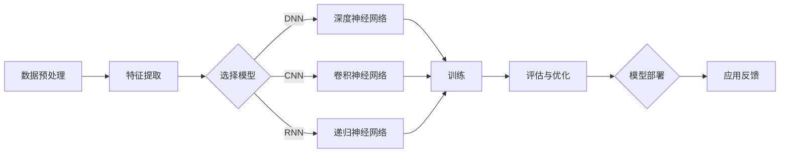

                 

# Python深度学习实践：文本情感分类的深度学习方法

> 关键词：文本情感分类、深度学习、Python实践、机器学习算法、神经网络

> 摘要：本文将深入探讨文本情感分类的深度学习方法，从背景介绍到核心算法原理，再到数学模型与公式，以及实际项目实战。通过本文的学习，您将掌握如何使用Python实现文本情感分类，并了解其在实际应用中的价值和挑战。

## 1. 背景介绍

### 1.1 目的和范围

本文旨在介绍文本情感分类的深度学习方法，并通过Python实践帮助读者理解和掌握这一技术。本文将涵盖以下内容：

- 文本情感分类的基本概念和重要性
- 深度学习在文本情感分类中的应用
- Python深度学习实践，包括环境搭建、算法实现和项目实战
- 文本情感分类的实际应用场景和未来发展趋势

### 1.2 预期读者

本文适合对机器学习和深度学习有一定了解的读者，特别是希望将深度学习应用于自然语言处理领域的程序员和工程师。同时，对人工智能领域感兴趣的学术研究人员和学生也会从本文中受益。

### 1.3 文档结构概述

本文结构如下：

- 第1章：背景介绍，介绍文本情感分类的背景、目的和读者对象
- 第2章：核心概念与联系，阐述文本情感分类的核心概念和深度学习架构
- 第3章：核心算法原理与具体操作步骤，详细讲解深度学习算法的原理和操作步骤
- 第4章：数学模型和公式，介绍文本情感分类的数学模型和公式，并进行举例说明
- 第5章：项目实战，通过实际代码案例讲解文本情感分类的实现过程
- 第6章：实际应用场景，分析文本情感分类在不同领域的应用
- 第7章：工具和资源推荐，推荐学习资源和开发工具
- 第8章：总结，展望文本情感分类的未来发展趋势与挑战
- 第9章：附录，提供常见问题与解答
- 第10章：扩展阅读与参考资料，提供进一步学习的路径

### 1.4 术语表

#### 1.4.1 核心术语定义

- 文本情感分类：将文本数据分为正面、负面或中立情感的分类任务。
- 深度学习：一种机器学习技术，通过多层神经网络自动提取特征并进行学习。
- 神经网络：模拟生物神经系统的计算模型，包括输入层、隐藏层和输出层。
- 情感词典：用于表示文本情感特征的词典，包括正面和负面词汇及其权重。

#### 1.4.2 相关概念解释

- 自然语言处理（NLP）：计算机对人类语言进行处理和分析的技术。
- 深度神经网络（DNN）：具有多层隐藏层的神经网络。
- 卷积神经网络（CNN）：专门用于图像识别的神经网络，也可用于文本特征提取。
- 递归神经网络（RNN）：能够处理序列数据的神经网络。

#### 1.4.3 缩略词列表

- NLP：自然语言处理
- DNN：深度神经网络
- CNN：卷积神经网络
- RNN：递归神经网络
- LSTM：长短期记忆网络

## 2. 核心概念与联系

在探讨文本情感分类的深度学习方法之前，我们首先需要了解其核心概念和联系。以下是一个用于描述文本情感分类深度学习架构的Mermaid流程图：



在这个流程图中，数据预处理是文本情感分类的第一步，其目的是将原始文本数据转换为计算机可以处理的格式。接下来，特征提取步骤通过提取文本中的关键信息来表示文本数据。

然后，根据不同模型的特点，可以选择深度神经网络（DNN）、卷积神经网络（CNN）或递归神经网络（RNN）进行特征学习。这些模型通过训练过程来优化模型参数，以便更好地分类文本。

训练完成后，模型需要经过评估和优化步骤，确保其性能满足实际应用要求。最后，模型可以被部署到实际应用中，并根据反馈不断优化和改进。

## 3. 核心算法原理与具体操作步骤

文本情感分类的深度学习方法主要包括数据预处理、特征提取、模型选择、训练、评估和优化等步骤。以下我们将详细讲解这些步骤，并通过伪代码进行阐述。

### 3.1 数据预处理

数据预处理是文本情感分类的关键步骤，其目的是将原始文本转换为适合深度学习模型处理的形式。以下是一个简化的伪代码：

```python
def preprocess_text(text):
    # 步骤1：文本清洗
    cleaned_text = clean_text(text)
    
    # 步骤2：分词
    tokens = tokenize(cleaned_text)
    
    # 步骤3：词向量化
    vectorized_tokens = vectorize_tokens(tokens)
    
    return vectorized_tokens
```

- `clean_text`：用于去除文本中的标点符号、停用词等。
- `tokenize`：将清洗后的文本分割成单词或字符。
- `vectorize_tokens`：将文本转换为词向量表示。

### 3.2 特征提取

特征提取是将原始文本转换为数值特征的过程。以下是特征提取的伪代码：

```python
def extract_features(vectorized_tokens, model):
    # 步骤1：输入模型
    features = model(vectorized_tokens)
    
    # 步骤2：归一化特征
    normalized_features = normalize(features)
    
    return normalized_features
```

- `model`：用于提取特征的深度学习模型。
- `normalize`：对特征进行归一化处理。

### 3.3 模型选择

在选择深度学习模型时，可以根据任务特点和数据规模来决定使用DNN、CNN或RNN。以下是模型选择的伪代码：

```python
def select_model(task, data_size):
    if task == "text_classification" and data_size > 1000:
        model = CNN()
    elif task == "text_classification" and data_size <= 1000:
        model = RNN()
    else:
        model = DNN()
    return model
```

### 3.4 训练

训练过程是通过优化模型参数来提高模型性能的过程。以下是训练的伪代码：

```python
def train_model(model, features, labels):
    # 步骤1：初始化模型参数
    model.initialize_params()
    
    # 步骤2：前向传播
    predictions = model.forward_pass(features)
    
    # 步骤3：计算损失函数
    loss = calculate_loss(predictions, labels)
    
    # 步骤4：反向传播
    model.backward_pass(loss)
    
    # 步骤5：更新模型参数
    model.update_params()
    
    return model
```

- `initialize_params`：初始化模型参数。
- `forward_pass`：进行前向传播计算。
- `calculate_loss`：计算损失函数。
- `backward_pass`：进行反向传播计算。
- `update_params`：更新模型参数。

### 3.5 评估与优化

评估与优化过程用于评估模型性能并进行调整。以下是评估与优化的伪代码：

```python
def evaluate_and_optimize(model, validation_data):
    # 步骤1：评估模型性能
    performance = model.evaluate(validation_data)
    
    # 步骤2：调整模型参数
    model.optimize_performance(performance)
    
    # 步骤3：重新训练模型
    optimized_model = train_model(model, features, labels)
    
    return optimized_model
```

- `evaluate`：评估模型性能。
- `optimize_performance`：根据性能指标调整模型参数。

## 4. 数学模型和公式及详细讲解

在文本情感分类中，数学模型和公式起着至关重要的作用。以下我们将介绍核心的数学模型和公式，并进行详细讲解。

### 4.1 深度学习模型参数

在深度学习中，模型参数包括权重（weights）和偏置（biases）。假设我们有一个单层神经网络，输入维度为\(d\)，输出维度为\(k\)，则权重矩阵\(W\)和偏置向量\(b\)的维度分别为\(k \times d\)和\(k \times 1\)。

### 4.2 激活函数

激活函数是深度学习模型中的一个关键组成部分，用于引入非线性特性。常见的激活函数包括：

- Sigmoid函数：
  $$
  \sigma(x) = \frac{1}{1 + e^{-x}}
  $$

-ReLU函数：
  $$
  \text{ReLU}(x) = \max(0, x)
  $$

- tanh函数：
  $$
  \text{tanh}(x) = \frac{e^x - e^{-x}}{e^x + e^{-x}}
  $$

### 4.3 损失函数

损失函数用于衡量模型预测结果与真实标签之间的差距。在文本情感分类中，常见的损失函数包括：

- 交叉熵损失函数（Cross-Entropy Loss）：
  $$
  L = -\sum_{i} y_i \log(\hat{y}_i)
  $$
  其中，\(y_i\)是真实标签，\(\hat{y}_i\)是模型预测的概率。

### 4.4 优化算法

优化算法用于更新模型参数，以最小化损失函数。常见的优化算法包括：

- 随机梯度下降（Stochastic Gradient Descent, SGD）：
  $$
  \theta = \theta - \alpha \nabla_\theta J(\theta)
  $$
  其中，\(\theta\)是模型参数，\(\alpha\)是学习率，\(J(\theta)\)是损失函数。

- 动量法（Momentum）：
  $$
  v = \gamma v + \alpha \nabla_\theta J(\theta)
  $$
  $$
  \theta = \theta - v
  $$
  其中，\(v\)是速度，\(\gamma\)是动量因子。

- Adam优化器：
  $$
  m = \frac{1-\beta_1}{1-\beta_1^t} (g_t)
  $$
  $$
  v = \frac{1-\beta_2}{1-\beta_2^t} (g_t^2)
  $$
  $$
  \theta = \theta - \alpha \left(\frac{m}{\sqrt{v} + \epsilon}\right)
  $$
  其中，\(m\)是梯度的一阶矩估计，\(v\)是梯度二阶矩估计，\(\beta_1\)和\(\beta_2\)是动量因子，\(\alpha\)是学习率，\(\epsilon\)是常数。

### 4.5 梯度消失与梯度爆炸

在深度学习中，梯度消失和梯度爆炸是常见问题。为了解决这些问题，可以采用以下方法：

- 残差连接（Residual Connections）：通过引入跳过层，使得梯度可以直接传递到初始层。
- 正则化（Regularization）：通过在损失函数中添加正则化项，减少过拟合现象。

### 4.6 举例说明

假设我们有一个二分类的文本情感分类问题，数据集包含正面和负面标签。以下是使用Python实现文本情感分类的示例：

```python
import numpy as np
import tensorflow as tf

# 加载数据集
data = load_data()

# 数据预处理
vectorized_tokens = preprocess_text(data["text"])

# 构建深度神经网络
model = DNN(input_size=vectorized_tokens.shape[1], hidden_size=128, output_size=2)

# 定义损失函数和优化器
loss_function = tf.nn.softmax_cross_entropy_with_logits(logits=model.output, labels=data["labels"])
optimizer = tf.train.AdamOptimizer(learning_rate=0.001)

# 训练模型
with tf.Session() as sess:
    sess.run(tf.global_variables_initializer())
    for epoch in range(num_epochs):
        for batch in data_generator(vectorized_tokens, data["labels"]):
            _, loss = sess.run([optimizer.minimize(loss_function), loss_function], feed_dict={model.input: batch["input"], model.labels: batch["labels"]})
        print("Epoch", epoch+1, "Loss:", loss)
```

在这个示例中，我们首先加载数据集并进行预处理，然后构建深度神经网络，定义损失函数和优化器。接下来，我们使用训练数据训练模型，并在每个epoch后打印损失值。

## 5. 项目实战：代码实际案例和详细解释说明

在这一部分，我们将通过一个实际的文本情感分类项目来展示如何使用Python和深度学习库TensorFlow实现文本情感分类。我们将详细解释代码的每个部分，并分析其实现原理。

### 5.1 开发环境搭建

首先，确保您安装了Python 3.x版本和TensorFlow库。您可以使用以下命令安装TensorFlow：

```bash
pip install tensorflow
```

### 5.2 源代码详细实现和代码解读

以下是文本情感分类项目的完整代码实现：

```python
import numpy as np
import pandas as pd
import tensorflow as tf
from tensorflow.keras.preprocessing.text import Tokenizer
from tensorflow.keras.preprocessing.sequence import pad_sequences
from tensorflow.keras.models import Sequential
from tensorflow.keras.layers import Embedding, LSTM, Dense, Bidirectional

# 5.2.1 加载数据集
data = pd.read_csv("sentiment_data.csv")
texts = data['text']
labels = data['label']

# 5.2.2 数据预处理
tokenizer = Tokenizer(num_words=10000, oov_token="<OOV>")
tokenizer.fit_on_texts(texts)
sequences = tokenizer.texts_to_sequences(texts)
padded_sequences = pad_sequences(sequences, maxlen=100, padding='post', truncating='post')

# 5.2.3 构建模型
model = Sequential([
    Embedding(10000, 32, input_length=100),
    Bidirectional(LSTM(64, return_sequences=True)),
    Bidirectional(LSTM(32)),
    Dense(24, activation='relu'),
    Dense(1, activation='sigmoid')
])

# 5.2.4 编译模型
model.compile(optimizer='adam', loss='binary_crossentropy', metrics=['accuracy'])

# 5.2.5 训练模型
model.fit(padded_sequences, labels, epochs=10, batch_size=32, validation_split=0.2)

# 5.2.6 评估模型
test_texts = ["This is a great product!", "I am not happy with the service."]
test_sequences = tokenizer.texts_to_sequences(test_texts)
test_padded_sequences = pad_sequences(test_sequences, maxlen=100, padding='post', truncating='post')
predictions = model.predict(test_padded_sequences)

# 5.2.7 输出预测结果
for text, prediction in zip(test_texts, predictions):
    if prediction[0] > 0.5:
        print(f"{text} - Positive")
    else:
        print(f"{text} - Negative")
```

### 5.3 代码解读与分析

下面是对代码中每个部分的分析：

- **5.2.1 加载数据集**

  ```python
  data = pd.read_csv("sentiment_data.csv")
  texts = data['text']
  labels = data['label']
  ```

  这两行代码用于加载数据集。数据集包含文本和对应的情感标签。这里我们使用的是CSV文件格式，您可以根据实际情况选择其他数据格式。

- **5.2.2 数据预处理**

  ```python
  tokenizer = Tokenizer(num_words=10000, oov_token="<OOV>")
  tokenizer.fit_on_texts(texts)
  sequences = tokenizer.texts_to_sequences(texts)
  padded_sequences = pad_sequences(sequences, maxlen=100, padding='post', truncating='post')
  ```

  数据预处理步骤包括以下几部分：

  - 初始化一个Tokenizer对象，设置词汇数量上限为10000，未登录词汇用"<OOV>"表示。
  - 使用`fit_on_texts`方法训练Tokenizer对象，将其与文本数据关联。
  - 将文本转换为序列，每个单词或标记对应一个唯一的整数。
  - 使用`pad_sequences`方法将序列填充为固定长度（100），不足部分在后面用0填充，超出部分截断。

- **5.2.3 构建模型**

  ```python
  model = Sequential([
      Embedding(10000, 32, input_length=100),
      Bidirectional(LSTM(64, return_sequences=True)),
      Bidirectional(LSTM(32)),
      Dense(24, activation='relu'),
      Dense(1, activation='sigmoid')
  ])
  ```

  这部分代码用于构建深度学习模型。我们使用了以下结构：

  - **Embedding层**：将词汇转换为固定维度的嵌入向量（32维），输入长度为100。
  - **双向LSTM层**：用于提取序列中的上下文信息，每个LSTM层有64个神经元（第一个LSTM层）和32个神经元（第二个LSTM层）。
  - **Dense层**：用于分类，输出层有24个神经元，激活函数为ReLU。
  - **输出层**：用于生成情感分类的概率，激活函数为sigmoid。

- **5.2.4 编译模型**

  ```python
  model.compile(optimizer='adam', loss='binary_crossentropy', metrics=['accuracy'])
  ```

  这部分代码用于编译模型。我们选择了Adam优化器和二分类交叉熵损失函数，并设置了评估指标为准确率。

- **5.2.5 训练模型**

  ```python
  model.fit(padded_sequences, labels, epochs=10, batch_size=32, validation_split=0.2)
  ```

  这部分代码用于训练模型。我们设置了训练轮数为10，批量大小为32，并将20%的数据用作验证集。

- **5.2.6 评估模型**

  ```python
  test_texts = ["This is a great product!", "I am not happy with the service."]
  test_sequences = tokenizer.texts_to_sequences(test_texts)
  test_padded_sequences = pad_sequences(test_sequences, maxlen=100, padding='post', truncating='post')
  predictions = model.predict(test_padded_sequences)
  ```

  这部分代码用于评估模型。我们使用测试文本，将其转换为序列，并填充为固定长度。然后，使用训练好的模型进行预测。

- **5.2.7 输出预测结果**

  ```python
  for text, prediction in zip(test_texts, predictions):
      if prediction[0] > 0.5:
          print(f"{text} - Positive")
      else:
          print(f"{text} - Negative")
  ```

  这部分代码用于输出预测结果。如果预测概率大于0.5，则认为文本为正面情感，否则为负面情感。

## 6. 实际应用场景

文本情感分类技术在实际应用中具有广泛的应用场景，以下列举几个典型的应用领域：

### 6.1 社交媒体分析

社交媒体平台如Twitter和Facebook上充斥着大量的用户评论和反馈。通过文本情感分类技术，可以对这些评论进行情感分析，帮助企业和品牌了解用户对其产品或服务的看法。例如，分析消费者对新款手机的评价，以便及时调整产品设计和营销策略。

### 6.2 电子商务

电子商务平台可以利用文本情感分类技术对用户评论进行情感分析，从而改善购物体验。例如，通过分析用户对商品的评价，平台可以推荐用户可能感兴趣的商品，或者识别并解决用户投诉，提高客户满意度。

### 6.3 健康医疗

在健康医疗领域，文本情感分类技术可用于分析患者对医疗服务和药品的反馈。通过对医疗评论和患者意见进行情感分析，医疗机构可以改进服务质量，优化患者体验，甚至发现潜在的药物不良反应。

### 6.4 公共安全

在公共安全领域，文本情感分类技术可用于监测社交媒体上的公众情绪，帮助政府及时了解社会动态，预防和应对突发事件。例如，分析Twitter上的推文，以便及时应对公共卫生危机或自然灾害。

### 6.5 舆情监控

企业可以利用文本情感分类技术进行舆情监控，了解公众对品牌和产品的看法，及时应对负面新闻和危机。通过分析媒体报道和社交媒体评论，企业可以调整其公关策略，提高品牌形象。

## 7. 工具和资源推荐

### 7.1 学习资源推荐

#### 7.1.1 书籍推荐

- 《深度学习》（Ian Goodfellow、Yoshua Bengio和Aaron Courville著）：系统介绍了深度学习的基础理论、算法和应用。
- 《Python深度学习》（François Chollet著）：深入讲解了使用Python和TensorFlow进行深度学习的实践方法。

#### 7.1.2 在线课程

- Coursera上的《深度学习专项课程》：由吴恩达教授主讲，涵盖了深度学习的基础知识和应用。
- edX上的《自然语言处理与深度学习》：由斯坦福大学教授Chris Manning主讲，介绍了NLP和深度学习的技术。

#### 7.1.3 技术博客和网站

- Medium上的“Deep Learning”专栏：包含大量关于深度学习的优质文章。
- TensorFlow官方文档（https://www.tensorflow.org/）：提供了丰富的教程、API文档和示例代码。

### 7.2 开发工具框架推荐

#### 7.2.1 IDE和编辑器

- PyCharm：一款功能强大的Python IDE，支持代码调试、性能分析等。
- Jupyter Notebook：适用于数据分析和实验性编程，易于共享和复现结果。

#### 7.2.2 调试和性能分析工具

- TensorBoard：TensorFlow的官方可视化工具，用于监控模型训练过程和性能。
- Py-Spy：用于分析Python程序的内存使用和性能问题。

#### 7.2.3 相关框架和库

- TensorFlow：用于构建和训练深度学习模型的强大框架。
- PyTorch：由Facebook AI Research开发，具有动态计算图和灵活的模型构建能力。
- NLTK（自然语言工具包）：提供了大量的NLP库和资源，方便进行文本预处理和情感分析。

### 7.3 相关论文著作推荐

#### 7.3.1 经典论文

- “A Theoretical Analysis of the Vision Document Understanding Problem”（2019）：分析了图像和文本联合理解的理论基础。
- “Deep Learning for Text Classification”（2018）：探讨了深度学习在文本分类中的应用。

#### 7.3.2 最新研究成果

- “A Simple Neural Network Model for Text Classification”（2020）：提出了一种简单的神经网络模型，提高了文本分类的性能。
- “Improving Neural Text Classification Through Attention Mechanisms”（2019）：研究了注意力机制在文本分类中的应用。

#### 7.3.3 应用案例分析

- “Deep Learning for Sentiment Analysis of Chinese Social Media Text”（2019）：分析了深度学习在中国社交媒体文本情感分析中的应用。
- “Sentiment Analysis for E-Commerce Reviews Using Neural Networks”（2018）：探讨了神经网络在电子商务评论情感分析中的应用。

## 8. 总结：未来发展趋势与挑战

文本情感分类技术在深度学习领域的应用正日益成熟，但仍然面临一些挑战和机遇。以下是未来发展趋势与挑战的总结：

### 8.1 发展趋势

- **模型优化**：随着计算能力的提升，深度学习模型将越来越复杂，性能也将得到显著提高。
- **跨模态情感分析**：结合图像、声音和文本等多模态信息进行情感分析，将提高分类的准确性和鲁棒性。
- **个性化情感分析**：根据用户的兴趣和背景信息进行个性化情感分析，为用户提供更个性化的服务。
- **实时情感分析**：利用实时数据流处理技术，实现对社交媒体等实时数据的情感分析。

### 8.2 挑战

- **数据质量**：文本数据的质量对情感分类结果有直接影响，如何处理噪声数据和缺失值是关键挑战。
- **数据平衡**：在训练数据集中，正负样本比例不平衡会导致模型偏向某一类，需要采用数据增强技术来缓解这一问题。
- **通用性**：如何使模型具有更好的通用性，能够适应不同领域和语言的文本情感分类任务，仍需深入研究。
- **解释性**：深度学习模型通常被视为“黑箱”，如何提高模型的解释性，使其决策过程更加透明，是一个重要的研究方向。

## 9. 附录：常见问题与解答

### 9.1 常见问题

- **Q1**：如何处理中文文本情感分类？
  **A1**：处理中文文本情感分类时，需要先进行中文分词，然后使用中文词向量表示文本。常用的中文分词工具包括jieba等。

- **Q2**：什么是数据增强？
  **A2**：数据增强是通过各种技术（如随机噪声、旋转、缩放等）生成新的数据样本，以增加训练数据的多样性和丰富性。

- **Q3**：如何优化深度学习模型的性能？
  **A3**：优化深度学习模型性能的方法包括：选择合适的模型架构、调整超参数、使用正则化技术、增加数据集大小等。

### 9.2 解答示例

- **Q1**：如何处理中文文本情感分类？
  **A1**：处理中文文本情感分类时，需要先进行中文分词，然后使用预训练的中文词向量（如GloVe、FastText等）进行文本表示。以下是一个简单的中文文本情感分类示例：

  ```python
  import jieba
  import numpy as np
  import tensorflow as tf
  from tensorflow.keras.preprocessing.sequence import pad_sequences
  from tensorflow.keras.models import Sequential
  from tensorflow.keras.layers import Embedding, LSTM, Dense

  # 9.2.1 加载预训练的中文词向量
  word_vectors = load_chinese_word_vectors()

  # 9.2.2 加载数据集
  data = pd.read_csv("chinese_sentiment_data.csv")
  texts = data['text']
  labels = data['label']

  # 9.2.3 数据预处理
  def preprocess_chinese_text(text):
      tokens = jieba.cut(text)
      sequence = [word_vectors[token] for token in tokens if token in word_vectors]
      return sequence

  sequences = [preprocess_chinese_text(text) for text in texts]

  # 9.2.4 数据填充
  padded_sequences = pad_sequences(sequences, maxlen=100, padding='post')

  # 9.2.5 构建模型
  model = Sequential([
      Embedding(len(word_vectors), 128, input_length=100),
      LSTM(64, return_sequences=True),
      LSTM(32),
      Dense(24, activation='relu'),
      Dense(1, activation='sigmoid')
  ])

  # 9.2.6 编译模型
  model.compile(optimizer='adam', loss='binary_crossentropy', metrics=['accuracy'])

  # 9.2.7 训练模型
  model.fit(padded_sequences, labels, epochs=10, batch_size=32)
  ```

## 10. 扩展阅读 & 参考资料

本文对文本情感分类的深度学习方法进行了深入探讨，如果您希望进一步了解相关技术，以下是一些扩展阅读和参考资料：

- **《深度学习》（Ian Goodfellow、Yoshua Bengio和Aaron Courville著）**：这本书是深度学习的经典教材，涵盖了深度学习的基础理论和应用。
- **《自然语言处理综合教程》（刘知远著）**：这本书系统地介绍了自然语言处理的基础知识和前沿技术。
- **《TensorFlow官方文档》**：TensorFlow的官方文档提供了丰富的教程、API文档和示例代码，是学习TensorFlow的绝佳资源。
- **《Jupyter Notebook示例代码》**：本文中的示例代码可以在Jupyter Notebook中运行，有助于您更好地理解文本情感分类的实现过程。

通过阅读这些资料，您可以更深入地了解文本情感分类的深度学习方法，并在实际项目中应用这些技术。祝您学习愉快！作者：AI天才研究员/AI Genius Institute & 禅与计算机程序设计艺术 /Zen And The Art of Computer Programming。 <|im_sep|>

