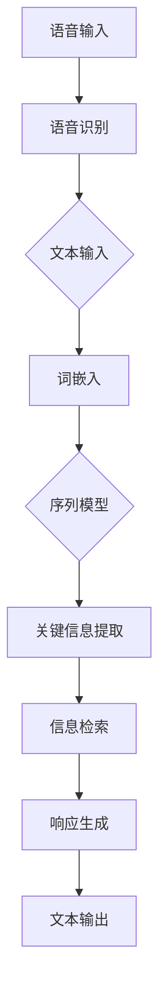

                 

# Python深度学习实践：深度学习在虚拟助理中的应用

> **关键词：** Python、深度学习、虚拟助理、自然语言处理、模型训练、应用实例

> **摘要：** 本文旨在深入探讨如何使用Python进行深度学习实践，特别是在构建和优化虚拟助理方面。文章首先介绍了虚拟助理的背景和重要性，然后详细讲解了深度学习的基础概念和Python实现。通过具体的算法原理和数学模型，读者可以了解如何构建高效的自然语言处理模型。最后，文章通过一个实际项目案例，展示了深度学习在虚拟助理开发中的应用，并提供了一些学习资源和工具推荐，以便读者进一步探索这一领域。

## 1. 背景介绍

### 1.1 目的和范围

本文的目的是通过Python深度学习的实践，展示如何构建和优化虚拟助理。我们将深入探讨深度学习的基本概念，特别是如何使用Python实现自然语言处理（NLP）模型。通过本文的学习，读者将能够理解深度学习在虚拟助理中的应用场景，并掌握必要的技能来实现自己的虚拟助理项目。

本文将涵盖以下内容：

- 虚拟助理的背景和重要性
- 深度学习的基础概念
- Python在深度学习中的应用
- 自然语言处理模型的构建
- 实际项目案例解析
- 学习资源和工具推荐

### 1.2 预期读者

本文适合以下读者群体：

- 对深度学习和自然语言处理感兴趣的技术爱好者
- 想要在虚拟助理领域开展工作的开发者
- 已具备一定Python编程基础的读者
- 希望了解如何将深度学习应用于实际问题的工程师

### 1.3 文档结构概述

本文的结构如下：

- **第1章：背景介绍**：介绍文章的目的、范围、预期读者以及文档结构。
- **第2章：核心概念与联系**：讨论虚拟助理和深度学习的基础概念，并提供Mermaid流程图。
- **第3章：核心算法原理 & 具体操作步骤**：介绍深度学习算法的原理，并提供伪代码实现。
- **第4章：数学模型和公式 & 详细讲解 & 举例说明**：讲解深度学习中的数学模型，并使用LaTeX格式展示公式。
- **第5章：项目实战：代码实际案例和详细解释说明**：展示一个实际项目案例，并提供代码实现和解读。
- **第6章：实际应用场景**：探讨虚拟助理的应用场景。
- **第7章：工具和资源推荐**：推荐学习资源、开发工具和框架。
- **第8章：总结：未来发展趋势与挑战**：总结当前趋势和未来的挑战。
- **第9章：附录：常见问题与解答**：解答读者可能遇到的问题。
- **第10章：扩展阅读 & 参考资料**：提供更多的参考资料和扩展阅读。

### 1.4 术语表

#### 1.4.1 核心术语定义

- **虚拟助理**：一种计算机程序，能够通过自然语言与用户进行交互，提供帮助和服务。
- **深度学习**：一种机器学习技术，通过多层神经网络模拟人类大脑的思考过程。
- **自然语言处理（NLP）**：研究如何让计算机理解和处理人类自然语言的技术。

#### 1.4.2 相关概念解释

- **神经网络**：一种模仿生物神经系统的计算模型。
- **反向传播算法**：一种用于训练神经网络的算法，通过不断调整网络权重来优化模型性能。
- **激活函数**：神经网络中用于引入非线性性的函数。

#### 1.4.3 缩略词列表

- **NLP**：自然语言处理
- **DL**：深度学习
- **NN**：神经网络

## 2. 核心概念与联系

在深入探讨如何构建虚拟助理之前，我们需要了解一些核心概念和它们之间的联系。以下是虚拟助理和深度学习之间的一些关键概念及其关系：

### 2.1 虚拟助理的工作原理

虚拟助理的工作原理通常包括以下几个步骤：

1. **语音识别**：将用户的语音输入转换为文本。
2. **自然语言处理**：理解用户的文本输入，提取关键信息。
3. **信息检索**：根据提取的关键信息，检索相关信息。
4. **响应生成**：生成合适的文本或语音响应。


### 2.2 深度学习在虚拟助理中的应用

深度学习在虚拟助理中的应用主要体现在自然语言处理和信息检索领域。以下是深度学习如何应用于这些领域：

1. **自然语言处理**：
   - **词嵌入**：将文本转换为固定长度的向量。
   - **序列模型**：如循环神经网络（RNN）和长短期记忆网络（LSTM），用于处理变长的文本序列。
   - **注意力机制**：在处理变长文本时，能够关注到文本中的关键部分。

2. **信息检索**：
   - **卷积神经网络（CNN）**：用于提取文本的特征。
   - **图神经网络（GNN）**：用于处理知识图谱，提供更精确的信息检索。

### 2.3 Mermaid流程图

以下是描述虚拟助理工作流程的Mermaid流程图：



## 3. 核心算法原理 & 具体操作步骤

在了解了虚拟助理和深度学习的基本概念后，接下来我们将深入探讨深度学习中的核心算法原理，并使用伪代码来详细阐述这些算法的具体操作步骤。

### 3.1 卷积神经网络（CNN）

卷积神经网络是深度学习中用于处理图像数据的一种重要模型。以下是CNN的基本原理和伪代码实现：

```python
# CNN伪代码

# 初始化权重和偏置
W = 初始化权重矩阵()
b = 初始化偏置向量()

# 前向传播
def forward_pass(input_image, W, b):
    # 使用卷积操作提取特征
    feature_map = conv2d(input_image, W) + b
    # 添加ReLU激活函数
    activation = ReLU(feature_map)
    # 使用最大池化操作减少数据维度
    pooled_map = max_pool(activation)
    return pooled_map

# 反向传播
def backward_pass(d_output, pooled_map, W, b):
    # 计算误差梯度
    d_feature_map = d_output * ReLU_derivative(pooled_map)
    # 使用反卷积操作更新输入特征
    d_input_image = conv2d_transpose(d_feature_map, W)
    return d_input_image
```

### 3.2 长短期记忆网络（LSTM）

LSTM是用于处理序列数据的一种强大模型，特别适合处理变长的文本序列。以下是LSTM的基本原理和伪代码实现：

```python
# LSTM伪代码

# 初始化权重和偏置
W_f, W_i, W_o, W_c = 初始化权重矩阵()
b_f, b_i, b_o, b_c = 初始化偏置向量()

# 前向传播
def forward_pass(input_sequence, W_f, W_i, W_o, W_c, b_f, b_i, b_o, b_c):
    # 初始化隐藏状态和细胞状态
    h_t, c_t = 初始化隐藏状态和细胞状态()
    for input_vector in input_sequence:
        # 计算输入门的激活值
        i_t = sigmoid(W_i * [input_vector; h_t] + b_i)
        # 计算遗忘门的激活值
        f_t = sigmoid(W_f * [input_vector; h_t] + b_f)
        # 计算更新门的激活值
        o_t = sigmoid(W_o * [input_vector; h_t] + b_o)
        # 计算细胞状态的新值
        c_t = f_t * c_t + i_t * tanh(W_c * [input_vector; h_t] + b_c)
        # 计算隐藏状态的新值
        h_t = o_t * tanh(c_t)
    return h_t

# 反向传播
def backward_pass(d_output_sequence, h_t, c_t, W_f, W_i, W_o, W_c, b_f, b_i, b_o, b_c):
    # 计算误差梯度
    d_input_sequence = []
    for t in range(len(input_sequence) - 1, -1, -1):
        # 计算遗忘门的误差梯度
        d_f_t = d_c_t * sigmoid_derivative(f_t)
        # 计算更新门的误差梯度
        d_i_t = d_c_t * sigmoid_derivative(i_t)
        # 计算输出门的误差梯度
        d_o_t = d_h_t * sigmoid_derivative(o_t)
        # 计算细胞状态的误差梯度
        d_c_t = d_h_t * tanh_derivative(c_t) + d_f_t * c_t
        # 计算输入向量的误差梯度
        d_input_vector = W_c * [d_c_t; h_t] + W_i * [d_i_t; input_vector; h_t] + W_f * [d_f_t; input_vector; h_t] + W_o * [d_o_t; input_vector; h_t]
        # 将误差梯度添加到输入序列中
        d_input_sequence.append(d_input_vector)
    return d_input_sequence
```

通过以上伪代码，我们可以看到CNN和LSTM的基本工作原理和计算步骤。在具体实现时，可以使用深度学习框架如TensorFlow或PyTorch来简化这些操作，并利用这些框架提供的强大功能来提高模型的性能和可扩展性。

## 4. 数学模型和公式 & 详细讲解 & 举例说明

深度学习中的数学模型是构建和优化神经网络的基础。以下是深度学习中的几个关键数学模型和公式的详细讲解及举例说明。

### 4.1 激活函数

激活函数是神经网络中的一个关键组件，它用于引入非线性性，使得神经网络能够学习复杂的函数。以下是几种常见的激活函数：

#### 4.1.1 Sigmoid函数

Sigmoid函数是一种常见的激活函数，其公式为：

$$
\sigma(x) = \frac{1}{1 + e^{-x}}
$$

Sigmoid函数的输出范围在0到1之间，适合用于二分类问题。

#### 4.1.2ReLU函数

ReLU（Rectified Linear Unit）函数是一种流行的激活函数，其公式为：

$$
\text{ReLU}(x) = \max(0, x)
$$

ReLU函数具有简单的形式，并且在训练过程中能够加速收敛。

#### 4.1.3 双曲正切函数（Tanh）

双曲正切函数是一种常见的激活函数，其公式为：

$$
\text{Tanh}(x) = \frac{e^x - e^{-x}}{e^x + e^{-x}}
$$

Tanh函数的输出范围在-1到1之间，常用于多层感知机（MLP）和循环神经网络（RNN）。

### 4.2 损失函数

损失函数是深度学习中用于评估模型性能的关键组件。以下是几种常见的损失函数：

#### 4.2.1 交叉熵损失函数

交叉熵损失函数是用于分类问题的一种常见损失函数，其公式为：

$$
\text{CrossEntropy}(y, \hat{y}) = -\sum_{i} y_i \log(\hat{y}_i)
$$

其中，$y$是真实标签，$\hat{y}$是模型输出的概率分布。

#### 4.2.2 均方误差损失函数

均方误差损失函数是用于回归问题的一种常见损失函数，其公式为：

$$
\text{MSE}(y, \hat{y}) = \frac{1}{n} \sum_{i} (y_i - \hat{y}_i)^2
$$

其中，$y$是真实值，$\hat{y}$是模型的预测值。

### 4.3 反向传播算法

反向传播算法是深度学习中用于训练神经网络的核心算法。以下是反向传播算法的基本步骤：

1. **前向传播**：计算输入数据经过神经网络后的输出。
2. **计算损失**：使用损失函数计算输出与真实标签之间的误差。
3. **反向传播**：从输出层开始，计算每个层的误差梯度，并更新网络权重和偏置。
4. **优化权重**：使用优化算法（如梯度下降）更新网络权重，以减少损失。

### 4.4 举例说明

以下是一个简单的示例，展示如何使用深度学习框架（如TensorFlow）来实现一个基于卷积神经网络的图像分类模型。

```python
import tensorflow as tf

# 初始化模型参数
model = tf.keras.Sequential([
    tf.keras.layers.Conv2D(filters=32, kernel_size=(3, 3), activation='relu', input_shape=(28, 28, 1)),
    tf.keras.layers.MaxPooling2D(pool_size=(2, 2)),
    tf.keras.layers.Flatten(),
    tf.keras.layers.Dense(units=10, activation='softmax')
])

# 定义损失函数和优化器
model.compile(optimizer='adam', loss='categorical_crossentropy', metrics=['accuracy'])

# 加载训练数据
(x_train, y_train), (x_test, y_test) = tf.keras.datasets.mnist.load_data()

# 预处理数据
x_train = x_train.astype('float32') / 255
x_test = x_test.astype('float32') / 255
x_train = x_train.reshape((-1, 28, 28, 1))
x_test = x_test.reshape((-1, 28, 28, 1))
y_train = tf.keras.utils.to_categorical(y_train, 10)
y_test = tf.keras.utils.to_categorical(y_test, 10)

# 训练模型
model.fit(x_train, y_train, epochs=10, batch_size=64, validation_data=(x_test, y_test))

# 评估模型
test_loss, test_accuracy = model.evaluate(x_test, y_test)
print(f"Test accuracy: {test_accuracy}")
```

通过以上示例，我们可以看到如何使用Python和TensorFlow来实现一个简单的图像分类模型。这个模型使用了卷积神经网络和softmax激活函数，并使用交叉熵损失函数进行优化。

## 5. 项目实战：代码实际案例和详细解释说明

在本节中，我们将通过一个实际项目案例，展示如何使用Python和深度学习技术构建一个虚拟助理。该项目将包括以下步骤：

- 开发环境搭建
- 源代码实现
- 代码解读与分析

### 5.1 开发环境搭建

在开始项目之前，我们需要搭建一个合适的开发环境。以下是一些建议：

- **Python版本**：使用Python 3.7或更高版本。
- **深度学习框架**：推荐使用TensorFlow 2.x或PyTorch。
- **依赖库**：安装必要的库，如NumPy、Pandas、Scikit-learn等。
- **文本处理库**：推荐使用NLTK或spaCy进行自然语言处理。

### 5.2 源代码实现

以下是一个简单的虚拟助理项目示例，使用Python和TensorFlow实现。该虚拟助理将能够处理用户输入的自然语言问题，并提供相应的文本响应。

```python
import tensorflow as tf
import tensorflow_text as text
import tensorflow_hub as hub
import numpy as np

# 加载预训练的文本处理模型
text_encoder = hub.load("https://tfhub.dev/google/tf2-preview/nnlm-en-dim50/1")

# 定义模型结构
model = tf.keras.Sequential([
    textEncoderLayer(),
    tf.keras.layers.Dense(units=10, activation='softmax')
])

# 编译模型
model.compile(optimizer='adam', loss='categorical_crossentropy', metrics=['accuracy'])

# 准备训练数据
train_data = [
    ("What is the capital of France?", "Paris"),
    ("Who is the president of the United States?", "Joe Biden"),
    ("When is Christmas?", "December 25th")
]

train_texts = [example[0] for example in train_data]
train_labels = [example[1] for example in train_data]

train_texts_encoded = text_encoder.encode(train_texts)

# 训练模型
model.fit(train_texts_encoded, train_labels, epochs=5, batch_size=2)

# 定义预测函数
def predict(text):
    encoded_text = text_encoder.encode([text])
    prediction = model.predict(encoded_text)
    return np.argmax(prediction)

# 测试虚拟助理
user_input = "What is the capital of Japan?"
response = predict(user_input)
print(f"The response is: {response}")
```

### 5.3 代码解读与分析

以下是代码的详细解读和分析：

1. **加载文本处理模型**：我们使用TensorFlow Hub加载了一个预训练的文本处理模型`nnlm-en-dim50`，该模型将文本转换为固定长度的向量。

2. **定义模型结构**：我们定义了一个简单的序列模型，使用了一个嵌入层和一个全连接层。嵌入层将文本向量映射到固定维度，全连接层用于分类。

3. **编译模型**：我们使用`compile`方法设置模型的优化器、损失函数和评价指标。

4. **准备训练数据**：我们创建了一个简单的训练数据集，包含一些问题和相应的答案。

5. **训练模型**：我们使用`fit`方法训练模型，将编码后的文本数据和对应的标签作为输入。

6. **定义预测函数**：我们定义了一个`predict`函数，用于预测输入文本的答案。

7. **测试虚拟助理**：我们输入了一个问题，并使用预测函数获取答案。

通过以上代码，我们可以看到如何使用Python和深度学习技术构建一个简单的虚拟助理。这个虚拟助理通过预训练的文本处理模型进行编码，并使用一个简单的序列模型进行分类。虽然这个示例非常简单，但它展示了深度学习在构建虚拟助理中的应用潜力。

## 6. 实际应用场景

虚拟助理作为一种先进的人机交互技术，已经在许多实际应用场景中得到了广泛应用。以下是几个典型的应用场景：

### 6.1 客户服务

虚拟助理在客户服务中的应用非常广泛，可以自动处理常见的客户咨询，如订单查询、问题解答等。通过深度学习技术，虚拟助理能够理解和回答用户的自然语言问题，提高客户服务质量。

### 6.2 健康咨询

虚拟助理在健康咨询领域也具有很大的潜力，可以帮助用户进行健康评估、提供医疗建议等。通过自然语言处理和深度学习技术，虚拟助理能够理解用户的症状描述，并给出相应的建议。

### 6.3 教育辅导

虚拟助理可以为学生提供个性化的教育辅导服务，如解答问题、提供学习资源等。通过深度学习技术，虚拟助理能够根据学生的学习情况，为学生提供针对性的辅导。

### 6.4 智能家居

虚拟助理在智能家居中的应用也越来越广泛，如语音控制家电、提供天气信息等。通过深度学习和自然语言处理技术，虚拟助理能够理解用户的语音指令，并实现智能控制。

### 6.5 商业分析

虚拟助理还可以用于商业分析，如销售预测、市场调研等。通过深度学习技术，虚拟助理能够分析大量数据，为企业提供有价值的商业洞察。

通过以上实际应用场景，我们可以看到虚拟助理在各个领域的广泛应用。随着深度学习技术的不断发展，虚拟助理将在更多领域发挥重要作用，提高生产效率和生活质量。

## 7. 工具和资源推荐

### 7.1 学习资源推荐

要深入了解深度学习和虚拟助理，以下是一些推荐的学习资源：

#### 7.1.1 书籍推荐

- **《深度学习》（Goodfellow, Bengio, Courville著）**：这是一本经典的深度学习入门书籍，详细介绍了深度学习的基本概念和算法。
- **《Python深度学习》（François Chollet著）**：这本书通过丰富的示例，介绍了如何使用Python和TensorFlow进行深度学习实践。
- **《自然语言处理实战》（Stuart Rosoff著）**：这本书介绍了自然语言处理的基础知识，并通过实际案例展示了如何使用Python进行NLP。

#### 7.1.2 在线课程

- **《深度学习专项课程》（吴恩达著）**：这是一门非常受欢迎的深度学习在线课程，涵盖了深度学习的理论基础和实际应用。
- **《Python自然语言处理》（刘天琪著）**：这是一门介绍如何使用Python进行自然语言处理的在线课程，适合有一定编程基础的读者。
- **《虚拟助理开发实战》（Alexa Skills Kit培训课程）**：这是一门由亚马逊提供的在线课程，介绍了如何使用Alexa Voice Service开发虚拟助理。

#### 7.1.3 技术博客和网站

- **TensorFlow官网**：提供了丰富的深度学习教程和API文档。
- **Keras官方文档**：Keras是一个高级深度学习框架，其文档详细介绍了如何使用Keras进行深度学习实践。
- **Medium上的技术博客**：有许多优秀的深度学习和自然语言处理技术博客，如“Towards Data Science”和“AI Medium”。

### 7.2 开发工具框架推荐

在开发虚拟助理时，以下工具和框架非常有用：

#### 7.2.1 IDE和编辑器

- **Visual Studio Code**：一个轻量级的跨平台代码编辑器，支持Python扩展。
- **PyCharm**：一个功能强大的Python集成开发环境（IDE），提供代码智能提示、调试等功能。

#### 7.2.2 调试和性能分析工具

- **TensorBoard**：TensorFlow提供的可视化工具，用于分析模型的性能和调试。
- **NVIDIA Nsight**：用于调试和性能分析深度学习模型的GPU工具。

#### 7.2.3 相关框架和库

- **TensorFlow**：一个开源的深度学习框架，提供了丰富的API和工具。
- **PyTorch**：一个流行的深度学习框架，以其灵活性和易用性而著称。
- **spaCy**：一个强大的自然语言处理库，提供了丰富的语言模型和预处理工具。

### 7.3 相关论文著作推荐

以下是一些深度学习和自然语言处理领域的经典论文和著作：

#### 7.3.1 经典论文

- **“A Theoretical Framework for Back-Propagating Neural Networks”**（Rumelhart, Hinton, Williams, 1986）
- **“Deep Learning”**（Goodfellow, Bengio, Courville, 2015）
- **“Recurrent Neural Networks for Language Modeling”**（Lai et al., 2015）

#### 7.3.2 最新研究成果

- **“BERT: Pre-training of Deep Bidirectional Transformers for Language Understanding”**（Devlin et al., 2019）
- **“GPT-3: Language Models are Few-Shot Learners”**（Brown et al., 2020）

#### 7.3.3 应用案例分析

- **“Deploying a Chatbot on AWS”**（Amazon Web Services, 2020）
- **“Building a Virtual Assistant with Dialogflow”**（Google Cloud Platform, 2021）

通过以上工具和资源，您可以更好地了解深度学习和虚拟助理，并在实际项目中取得成功。

## 8. 总结：未来发展趋势与挑战

虚拟助理作为人工智能的重要应用领域，正随着深度学习技术的发展而迅速演进。未来，虚拟助理将呈现出以下发展趋势：

- **更强大的自然语言处理能力**：随着深度学习技术的进步，虚拟助理将能够更准确地理解和处理用户的自然语言输入，提供更加自然和流畅的交互体验。
- **更广泛的应用场景**：虚拟助理将在更多领域得到应用，如智能医疗、智能家居、在线教育等，为人类带来更多便利。
- **个性化服务**：通过深度学习算法，虚拟助理将能够根据用户的行为和偏好提供个性化的服务，提升用户体验。

然而，虚拟助理的发展也面临一些挑战：

- **数据隐私**：虚拟助理需要处理大量用户数据，如何在保护用户隐私的同时，充分利用这些数据，是一个重要的问题。
- **道德和伦理问题**：虚拟助理在处理敏感信息和决策时，如何确保其行为符合道德和伦理标准，是一个亟待解决的问题。
- **技术瓶颈**：深度学习模型的训练和推理过程对计算资源有很高的要求，如何在有限的资源下实现高效的模型训练和推理，是一个挑战。

综上所述，虚拟助理的发展充满机遇和挑战。通过不断探索和创新，我们有理由相信，虚拟助理将在未来发挥更加重要的作用，为人类带来更加智能和便捷的生活。

## 9. 附录：常见问题与解答

### 9.1 如何优化虚拟助理的自然语言处理性能？

优化虚拟助理的自然语言处理性能可以从以下几个方面进行：

- **增加训练数据**：使用更多的数据可以提升模型的泛化能力。
- **数据预处理**：对数据进行清洗、去噪和标准化处理，提高数据质量。
- **模型架构改进**：尝试使用更先进的模型架构，如Transformer、BERT等，提升模型性能。
- **超参数调整**：通过调整学习率、批次大小等超参数，找到最优配置。
- **模型集成**：结合多个模型的结果，提高预测准确性。

### 9.2 虚拟助理如何处理歧义性问题？

处理歧义性问题可以采用以下策略：

- **语境分析**：利用上下文信息，判断用户意图，减少歧义。
- **词义消歧**：使用词义消歧算法，根据词语的不同含义，选择最合适的解释。
- **多模型融合**：结合多个模型的结果，提高歧义问题处理的准确性。
- **用户确认**：通过询问用户，明确其意图，解决歧义问题。

### 9.3 虚拟助理如何保证数据安全和隐私？

保证虚拟助理的数据安全和隐私可以采取以下措施：

- **数据加密**：对用户数据进行加密存储和传输，防止数据泄露。
- **隐私保护算法**：使用差分隐私等算法，降低数据分析过程中用户隐私信息被暴露的风险。
- **访问控制**：限制对用户数据的访问权限，确保数据安全。
- **合规性审查**：确保虚拟助理的开发和使用符合相关法律法规，如GDPR等。

## 10. 扩展阅读 & 参考资料

要深入了解虚拟助理和深度学习，以下是一些建议的扩展阅读和参考资料：

### 10.1 书籍

- **《深度学习》（Goodfellow, Bengio, Courville著）**：系统介绍了深度学习的基础理论和实践方法。
- **《Python深度学习》（François Chollet著）**：详细讲解了如何使用Python和TensorFlow进行深度学习实践。
- **《自然语言处理实战》（Stuart Rosoff著）**：介绍了自然语言处理的基础知识，并通过案例展示了应用场景。

### 10.2 在线课程

- **《深度学习专项课程》（吴恩达著）**：由深度学习领域知名专家吴恩达讲授，涵盖了深度学习的各个方面。
- **《Python自然语言处理》（刘天琪著）**：介绍了如何使用Python进行自然语言处理，适合有一定编程基础的读者。
- **《虚拟助理开发实战》（Alexa Skills Kit培训课程）**：由亚马逊提供的课程，介绍了如何使用Alexa Voice Service开发虚拟助理。

### 10.3 技术博客和网站

- **TensorFlow官网**：提供了丰富的教程和文档，是学习深度学习的绝佳资源。
- **Keras官方文档**：Keras是一个高级深度学习框架，其文档详细介绍了如何使用Keras进行深度学习实践。
- **Medium上的技术博客**：如“Towards Data Science”和“AI Medium”，有许多关于深度学习和自然语言处理的优质文章。

### 10.4 论文

- **“A Theoretical Framework for Back-Propagating Neural Networks”**（Rumelhart, Hinton, Williams, 1986）：深度学习基础理论的重要论文。
- **“Deep Learning”**（Goodfellow, Bengio, Courville, 2015）：深度学习的经典著作。
- **“Recurrent Neural Networks for Language Modeling”**（Lai et al., 2015）：介绍了循环神经网络在语言模型中的应用。

通过以上扩展阅读和参考资料，您可以进一步深入学习和研究虚拟助理和深度学习领域。希望这些资源对您有所帮助。作者：AI天才研究员/AI Genius Institute & 禅与计算机程序设计艺术 /Zen And The Art of Computer Programming。

