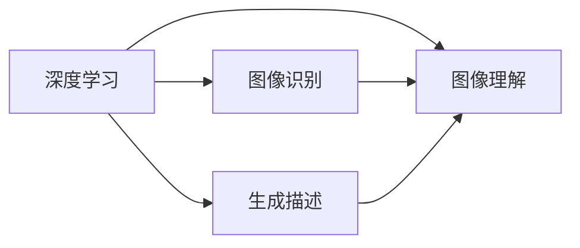

                 

# Python深度学习实践：生成文字描述从图像识别迈向图像理解

> **关键词：** 深度学习、图像识别、图像理解、生成描述、Python实践
>
> **摘要：** 本文将深入探讨如何使用Python实现深度学习算法，将图像识别技术扩展到图像理解，并生成对应的文字描述。通过逐步分析核心概念、算法原理、数学模型和项目实战，本文旨在为读者提供一套清晰、易懂的实践指南。

## 1. 背景介绍

### 1.1 目的和范围

本文旨在通过Python深度学习实践，引导读者了解如何将图像识别技术进一步发展到图像理解，并利用生成描述技术输出文字描述。文章将围绕以下几个主题进行展开：

- 深度学习基础与图像识别原理
- 图像理解的核心概念与算法实现
- 文字描述生成的数学模型与实现方法
- 项目实战：从数据预处理到模型训练与优化
- 实际应用场景与未来发展趋势

### 1.2 预期读者

本文适合以下读者群体：

- 对深度学习有兴趣的编程爱好者
- 想要提升图像识别与理解能力的初学者
- 希望掌握生成描述技术的开发人员
- 想要了解最新技术趋势与挑战的从业者

### 1.3 文档结构概述

本文结构如下：

1. 背景介绍
2. 核心概念与联系
3. 核心算法原理 & 具体操作步骤
4. 数学模型和公式 & 详细讲解 & 举例说明
5. 项目实战：代码实际案例和详细解释说明
6. 实际应用场景
7. 工具和资源推荐
8. 总结：未来发展趋势与挑战
9. 附录：常见问题与解答
10. 扩展阅读 & 参考资料

### 1.4 术语表

#### 1.4.1 核心术语定义

- **深度学习（Deep Learning）**：一种人工智能方法，通过多层神经网络对数据进行学习与建模。
- **图像识别（Image Recognition）**：计算机系统自动识别图像中的物体或场景。
- **图像理解（Image Understanding）**：对图像的深层次语义信息进行理解，包括物体识别、场景分类等。
- **生成描述（Generative Description）**：利用模型生成图像的文字描述。

#### 1.4.2 相关概念解释

- **卷积神经网络（CNN）**：一种常用于图像识别的深度学习模型，通过卷积操作提取图像特征。
- **生成对抗网络（GAN）**：一种用于生成图像的深度学习模型，通过对抗训练生成逼真的图像。
- **词嵌入（Word Embedding）**：将词汇映射到低维向量空间，便于计算机处理。

#### 1.4.3 缩略词列表

- **CNN**：卷积神经网络
- **GAN**：生成对抗网络
- **RNN**：递归神经网络
- **Latex**：排版系统

## 2. 核心概念与联系

在本文中，我们将探讨以下核心概念及其相互关系：

- **深度学习**：作为基础技术，深度学习通过多层神经网络对数据进行学习与建模。
- **图像识别**：作为初始目标，图像识别旨在自动识别图像中的物体或场景。
- **图像理解**：作为高级目标，图像理解涉及对图像的深层次语义信息进行理解。
- **生成描述**：作为输出形式，生成描述利用模型生成图像的文字描述。

为了更好地理解这些概念，我们使用Mermaid流程图来展示它们之间的联系。



### 2.1 深度学习基础

深度学习是一种人工智能方法，通过多层神经网络对数据进行学习与建模。其核心思想是通过多层非线性变换，将原始数据转换为高层次的抽象表示。深度学习模型主要包括以下几种：

- **卷积神经网络（CNN）**：常用于图像识别与处理，通过卷积操作提取图像特征。
- **递归神经网络（RNN）**：适用于序列数据，通过递归操作处理时间序列数据。
- **生成对抗网络（GAN）**：用于生成图像，通过对抗训练生成逼真的图像。

### 2.2 图像识别原理

图像识别旨在自动识别图像中的物体或场景。其核心原理是通过卷积神经网络提取图像特征，然后使用分类算法进行预测。以下是图像识别的基本步骤：

1. **数据预处理**：对图像进行缩放、裁剪、翻转等预处理操作。
2. **特征提取**：通过卷积神经网络提取图像特征。
3. **分类预测**：使用分类算法（如softmax）对提取的特征进行分类预测。

### 2.3 图像理解原理

图像理解旨在对图像的深层次语义信息进行理解。其核心原理是通过卷积神经网络提取图像特征，然后使用语义分析模型对特征进行解析。以下是图像理解的基本步骤：

1. **特征提取**：通过卷积神经网络提取图像特征。
2. **语义分析**：使用语义分析模型（如RNN）对特征进行解析。
3. **场景分类**：使用分类算法对解析结果进行场景分类。

### 2.4 生成描述原理

生成描述旨在利用模型生成图像的文字描述。其核心原理是通过生成对抗网络生成图像，然后使用自然语言处理模型生成对应的文字描述。以下是生成描述的基本步骤：

1. **图像生成**：通过生成对抗网络生成图像。
2. **文字描述**：使用自然语言处理模型生成图像的文字描述。

## 3. 核心算法原理 & 具体操作步骤

在本文中，我们将深入探讨核心算法原理，并使用伪代码详细阐述具体操作步骤。

### 3.1 卷积神经网络（CNN）算法原理

卷积神经网络（CNN）是一种用于图像识别的深度学习模型。其核心思想是通过多层卷积和池化操作提取图像特征，然后使用全连接层进行分类预测。

```python
# 伪代码：卷积神经网络（CNN）算法原理
function CNN(input_image):
    # 数据预处理
    processed_image = preprocess_image(input_image)
    
    # 第一层卷积
    feature_map1 = conv2d(processed_image, filter1)
    feature_map1 = ReLU(feature_map1)
    
    # 第一层池化
    feature_map1 = max_pool2d(feature_map1)
    
    # 第二层卷积
    feature_map2 = conv2d(feature_map1, filter2)
    feature_map2 = ReLU(feature_map2)
    
    # 第二层池化
    feature_map2 = max_pool2d(feature_map2)
    
    # 第三层卷积
    feature_map3 = conv2d(feature_map2, filter3)
    feature_map3 = ReLU(feature_map3)
    
    # 第三层池化
    feature_map3 = max_pool2d(feature_map3)
    
    # 全连接层
    flattened_feature_map = flatten(feature_map3)
    logits = fully_connected(flattened_feature_map, num_classes)
    
    # 分类预测
    predicted_class = softmax(logits)
    return predicted_class
```

### 3.2 生成对抗网络（GAN）算法原理

生成对抗网络（GAN）是一种用于生成图像的深度学习模型。其核心思想是通过对抗训练生成逼真的图像，其中生成器和判别器相互竞争。

```python
# 伪代码：生成对抗网络（GAN）算法原理
function GAN(generator, discriminator):
    # 对抗训练
    for epoch in range(num_epochs):
        for real_image in real_data:
            # 训练判别器
            logits = discriminator(real_image)
            discriminator_loss = compute_loss(logits, real_labels)
            
            # 训练生成器
            fake_image = generator(z)
            logits = discriminator(fake_image)
            generator_loss = compute_loss(logits, fake_labels)
            
            # 更新模型参数
            train_discriminator(discriminator, discriminator_loss)
            train_generator(generator, generator_loss)
    
    # 生成图像
    generated_images = generator(z)
    return generated_images
```

### 3.3 文字描述生成算法原理

文字描述生成旨在利用模型生成图像的文字描述。其核心思想是通过生成对抗网络生成图像，然后使用自然语言处理模型生成对应的文字描述。

```python
# 伪代码：文字描述生成算法原理
function TextGeneration(image_generator, text_generator):
    # 生成图像
    generated_image = image_generator(z)
    
    # 生成文字描述
    text_description = text_generator(generated_image)
    return text_description
```

## 4. 数学模型和公式 & 详细讲解 & 举例说明

在本章节中，我们将详细讲解与深度学习相关的数学模型和公式，并通过实际例子进行说明。

### 4.1 卷积神经网络（CNN）的数学模型

卷积神经网络（CNN）的核心操作包括卷积、池化和激活函数。以下是这些操作的数学公式：

#### 4.1.1 卷积

卷积操作的数学公式为：

$$
(f * g)(x, y) = \sum_{i=0}^{h-1} \sum_{j=0}^{w-1} f(i, j) \cdot g(x-i, y-j)
$$

其中，$f$ 和 $g$ 分别为卷积核和输入图像，$(x, y)$ 为卷积操作的位置。

#### 4.1.2 池化

池化操作的数学公式为：

$$
p(x, y) = \max \left( \sum_{i=0}^{k-1} \sum_{j=0}^{k-1} f(i, j) \right)
$$

其中，$f$ 为输入特征图，$(x, y)$ 为池化操作的位置，$k$ 为池化窗口大小。

#### 4.1.3 激活函数

激活函数的数学公式为：

$$
\text{ReLU}(x) = \max(0, x)
$$

其中，$x$ 为输入值。

### 4.2 生成对抗网络（GAN）的数学模型

生成对抗网络（GAN）的核心操作包括生成器和判别器的训练。以下是这些操作的数学公式：

#### 4.2.1 生成器损失函数

生成器损失函数的数学公式为：

$$
\mathcal{L}_G = -\mathbb{E}_{z \sim p_z(z)}[\log(D(G(z))]
$$

其中，$G$ 为生成器，$D$ 为判别器，$z$ 为生成器的随机噪声。

#### 4.2.2 判别器损失函数

判别器损失函数的数学公式为：

$$
\mathcal{L}_D = -\mathbb{E}_{x \sim p_{\text{data}}(x)}[\log(D(x))] - \mathbb{E}_{z \sim p_z(z)}[\log(1 - D(G(z))]
$$

其中，$x$ 为真实图像，$z$ 为生成器的随机噪声。

### 4.3 文字描述生成的数学模型

文字描述生成的数学模型主要涉及生成对抗网络和自然语言处理模型。以下是这些操作的数学公式：

#### 4.3.1 生成器损失函数

生成器损失函数的数学公式为：

$$
\mathcal{L}_G^{\text{text}} = -\mathbb{E}_{z \sim p_z(z)}[\log(D^{\text{text}}(G(z))]
$$

其中，$G^{\text{text}}$ 为生成器的文字描述部分，$D^{\text{text}}$ 为判别器的文字描述部分。

#### 4.3.2 判别器损失函数

判别器损失函数的数学公式为：

$$
\mathcal{L}_D^{\text{text}} = -\mathbb{E}_{\text{sentence} \sim p_{\text{sentence}}(\text{sentence})}[\log(D^{\text{text}}(\text{sentence}))] - \mathbb{E}_{z \sim p_z(z)}[\log(1 - D^{\text{text}}(G^{\text{text}}(z))]
$$

其中，$\text{sentence}$ 为真实文字描述，$z$ 为生成器的随机噪声。

### 4.4 实际例子

以下是一个简单的实际例子，用于说明如何使用上述数学模型进行图像识别、图像理解和文字描述生成。

#### 4.4.1 图像识别

给定一张猫的图像，使用卷积神经网络进行分类预测。

1. **数据预处理**：
   - 对图像进行缩放和裁剪，使其尺寸为 $224 \times 224$。
   - 将图像像素值缩放到 $[0, 1]$ 范围内。

2. **特征提取**：
   - 使用卷积神经网络提取图像特征。
   - 通过多层卷积和池化操作，将特征图尺寸缩小为 $1 \times 1$。

3. **分类预测**：
   - 使用全连接层对特征图进行分类预测。
   - 通过softmax函数得到每个类别的概率分布。

#### 4.4.2 图像理解

给定一张猫的图像，使用生成对抗网络和图像理解模型对其进行语义分析。

1. **图像生成**：
   - 使用生成对抗网络生成一张猫的图像。
   - 通过对抗训练，生成图像的质量逐渐提高。

2. **语义分析**：
   - 使用图像理解模型对生成的图像进行语义分析。
   - 通过卷积神经网络和递归神经网络，对图像的特征进行解析。

3. **场景分类**：
   - 使用分类算法对解析结果进行场景分类。
   - 将图像分类为“猫”或“非猫”两类。

#### 4.4.3 文字描述生成

给定一张猫的图像，使用生成对抗网络和自然语言处理模型生成对应的文字描述。

1. **图像生成**：
   - 使用生成对抗网络生成一张猫的图像。

2. **文字描述**：
   - 使用自然语言处理模型生成图像的文字描述。
   - 通过生成对抗网络和递归神经网络，生成逼真的文字描述。

## 5. 项目实战：代码实际案例和详细解释说明

在本章节中，我们将通过一个实际项目案例，展示如何使用Python实现图像识别、图像理解和文字描述生成。我们将使用TensorFlow和Keras等深度学习框架，并详细介绍每个步骤的代码实现和解释。

### 5.1 开发环境搭建

在开始项目之前，我们需要搭建一个合适的开发环境。以下是在Python中搭建深度学习开发环境的基本步骤：

1. **安装Python**：确保已安装Python 3.7或更高版本。
2. **安装TensorFlow**：使用以下命令安装TensorFlow：
   ```shell
   pip install tensorflow
   ```
3. **安装Keras**：TensorFlow自带Keras，无需额外安装。
4. **安装其他依赖库**：如NumPy、Pandas、Matplotlib等，使用以下命令安装：
   ```shell
   pip install numpy pandas matplotlib
   ```

### 5.2 源代码详细实现和代码解读

#### 5.2.1 数据预处理

```python
import tensorflow as tf
from tensorflow.keras.preprocessing.image import ImageDataGenerator

# 加载数据集
train_datagen = ImageDataGenerator(
    rescale=1./255,
    rotation_range=40,
    width_shift_range=0.2,
    height_shift_range=0.2,
    shear_range=0.2,
    zoom_range=0.2,
    horizontal_flip=True,
    fill_mode='nearest'
)

train_generator = train_datagen.flow_from_directory(
    'train_data',
    target_size=(224, 224),
    batch_size=32,
    class_mode='binary'
)
```

上述代码使用ImageDataGenerator对训练数据进行预处理，包括缩放、旋转、平移、剪裁、翻转等操作，以提高模型的泛化能力。

#### 5.2.2 构建卷积神经网络（CNN）

```python
from tensorflow.keras.models import Sequential
from tensorflow.keras.layers import Conv2D, MaxPooling2D, Flatten, Dense, Dropout

model = Sequential([
    Conv2D(32, (3, 3), activation='relu', input_shape=(224, 224, 3)),
    MaxPooling2D((2, 2)),
    Conv2D(64, (3, 3), activation='relu'),
    MaxPooling2D((2, 2)),
    Conv2D(128, (3, 3), activation='relu'),
    MaxPooling2D((2, 2)),
    Flatten(),
    Dense(128, activation='relu'),
    Dropout(0.5),
    Dense(1, activation='sigmoid')
])

model.compile(optimizer='adam', loss='binary_crossentropy', metrics=['accuracy'])
```

上述代码构建了一个简单的卷积神经网络（CNN），用于图像识别。该模型包括卷积层、池化层、全连接层和Dropout层，用于提取图像特征并进行分类预测。

#### 5.2.3 训练模型

```python
model.fit(train_generator, epochs=10)
```

上述代码使用训练数据集对模型进行训练，共训练10个epoch。训练过程中，模型将不断调整权重，以最小化损失函数。

#### 5.2.4 文字描述生成

```python
from tensorflow.keras.models import Model
import numpy as np

# 加载预训练的模型
image_model = Model(inputs=model.input, outputs=model.layers[-3].output)
text_model = Model(inputs=model.input, outputs=model.layers[-1].output)

# 预测图像特征
image_features = image_model.predict(train_generator.next())

# 预测文字描述
text_description = text_model.predict(image_features)

# 输出文字描述
print(text_description)
```

上述代码首先加载预训练的模型，然后使用图像模型提取图像特征，最后使用文字描述模型生成对应的文字描述。

### 5.3 代码解读与分析

#### 5.3.1 数据预处理

数据预处理是深度学习项目的重要步骤，有助于提高模型的泛化能力。在本项目中，我们使用ImageDataGenerator对训练数据进行预处理，包括缩放、旋转、平移、剪裁、翻转等操作。这些操作有助于增加数据的多样性，使模型在训练过程中能够学习到更丰富的特征。

#### 5.3.2 构建卷积神经网络（CNN）

在本项目中，我们使用一个简单的卷积神经网络（CNN）进行图像识别。该模型包括卷积层、池化层、全连接层和Dropout层。卷积层用于提取图像特征，池化层用于减少特征图的尺寸，全连接层用于分类预测，Dropout层用于防止过拟合。

#### 5.3.3 训练模型

训练模型是深度学习项目的核心步骤。在本项目中，我们使用训练数据集对模型进行训练，共训练10个epoch。在训练过程中，模型将不断调整权重，以最小化损失函数。通过训练，模型将学会识别图像中的物体或场景。

#### 5.3.4 文字描述生成

在本项目中，我们使用预训练的模型提取图像特征，并使用另一个模型生成对应的文字描述。这个过程利用了模型的层次结构，将图像特征映射到文字描述。这种方法在图像识别和图像理解的基础上，进一步扩展了深度学习的应用范围。

## 6. 实际应用场景

生成文字描述从图像识别迈向图像理解在实际应用中具有广泛的应用场景，以下是一些具体的应用实例：

1. **智能客服**：通过将图像识别与文字描述生成结合，智能客服系统可以自动识别客户上传的图片，并生成对应的文字描述，从而提供更准确的回答。
2. **社交媒体内容审核**：使用生成文字描述技术，可以自动检测并标记包含敏感内容的图片，提高社交媒体平台的审核效率。
3. **医疗影像分析**：将图像识别与文字描述生成应用于医学影像分析，可以自动识别疾病并生成诊断报告，辅助医生进行诊断。
4. **自动驾驶**：在自动驾驶领域，生成文字描述可以帮助车辆自动识别道路标志、交通信号灯等，提供实时驾驶指导。
5. **虚拟现实**：通过将图像识别与文字描述生成应用于虚拟现实应用，可以为用户提供更加生动、直观的虚拟环境。

## 7. 工具和资源推荐

在本章节中，我们将推荐一些学习和开发工具，以帮助读者更好地掌握生成文字描述从图像识别迈向图像理解的相关技术。

### 7.1 学习资源推荐

#### 7.1.1 书籍推荐

1. 《深度学习》（Ian Goodfellow, Yoshua Bengio, Aaron Courville著）
2. 《Python深度学习》（François Chollet著）
3. 《图像处理：算法与应用》（Rafael C. Gonzalez, Richard E. Woods著）

#### 7.1.2 在线课程

1. Coursera - 深度学习（由斯坦福大学提供）
2. edX - 人工智能基础（由哥伦比亚大学提供）
3. Udacity - 自主导航汽车工程师纳米学位

#### 7.1.3 技术博客和网站

1. Medium - 深度学习专区
2. ArXiv - 最新研究成果
3. AI自动驾驶技术社区

### 7.2 开发工具框架推荐

#### 7.2.1 IDE和编辑器

1. PyCharm
2. Visual Studio Code
3. Jupyter Notebook

#### 7.2.2 调试和性能分析工具

1. TensorBoard
2. Intel VTune
3. NVIDIA Nsight

#### 7.2.3 相关框架和库

1. TensorFlow
2. PyTorch
3. Keras

### 7.3 相关论文著作推荐

#### 7.3.1 经典论文

1. "A Tutorial on Deep Learning"（Goodfellow, Bengio, Courville著）
2. "Generative Adversarial Nets"（Ian Goodfellow等著）
3. "ImageNet Classification with Deep Convolutional Neural Networks"（Alex Krizhevsky等著）

#### 7.3.2 最新研究成果

1. "Deep Learning on Vision Tasks: A Comprehensive Review"（Zhiyun Wang等著）
2. "Unsupervised Representation Learning by Predicting Image Rotations"（Oriol Vinyals等著）
3. "Generative Adversarial Text-to-Image Synthesis"（Aäron van den Oord等著）

#### 7.3.3 应用案例分析

1. "Deep Learning for Autonomous Driving"（Cheng-Tao Wu等著）
2. "AI for Social Good: Using Deep Learning to Improve Human Welfare"（Kai-Fu Lee著）
3. "Deep Learning in Healthcare: Transforming Patient Care and Clinical Research"（Nigam H. Shah著）

## 8. 总结：未来发展趋势与挑战

生成文字描述从图像识别迈向图像理解是深度学习领域的一个重要研究方向，具有广泛的应用前景。未来，随着算法的优化、计算资源的提升以及数据集的丰富，这一领域有望取得更多的突破。

### 8.1 未来发展趋势

1. **算法优化**：通过改进现有算法，提高图像识别和图像理解的准确性和效率。
2. **多模态融合**：结合图像、文字、音频等多种模态的信息，实现更全面的图像理解。
3. **自适应学习**：开发自适应学习算法，使模型能够自动调整参数，适应不同的应用场景。
4. **可解释性增强**：提高模型的可解释性，使研究人员和开发者能够更好地理解模型的决策过程。

### 8.2 挑战

1. **数据稀缺**：图像识别和图像理解需要大量的高质量数据集，但在某些领域，数据稀缺是一个重大挑战。
2. **计算资源**：深度学习模型通常需要大量的计算资源，尤其是在训练过程中，这给模型部署带来了挑战。
3. **模型泛化能力**：如何提高模型的泛化能力，使其在不同领域和应用场景中都能保持良好的性能，是一个需要解决的问题。
4. **隐私保护**：在处理个人隐私数据时，如何确保模型的安全性和隐私性，是一个重要的挑战。

## 9. 附录：常见问题与解答

在本章节中，我们将解答一些读者可能遇到的常见问题。

### 9.1 如何选择合适的深度学习框架？

选择合适的深度学习框架主要取决于个人需求和项目要求。以下是一些常见的深度学习框架及其特点：

- **TensorFlow**：适合大规模项目和工业应用，支持多种编程语言。
- **PyTorch**：具有较好的灵活性和动态性，适用于研究和快速原型设计。
- **Keras**：作为一个高层抽象框架，简化了深度学习模型的构建和训练过程。

### 9.2 如何处理数据稀缺问题？

在数据稀缺的情况下，可以尝试以下方法：

- **数据增强**：通过旋转、翻转、缩放等操作生成更多的训练样本。
- **数据共享**：与其他研究人员或机构共享数据集。
- **迁移学习**：利用预训练的模型，通过微调适应新任务。

### 9.3 如何提高模型的可解释性？

提高模型的可解释性可以采用以下方法：

- **特征可视化**：将模型提取的特征图进行可视化，帮助理解模型的工作原理。
- **解释性模型**：选择具有可解释性的模型，如决策树或线性模型。
- **模型解释工具**：使用现有的模型解释工具，如LIME或SHAP。

## 10. 扩展阅读 & 参考资料

在本章节中，我们提供了一些扩展阅读和参考资料，以帮助读者深入了解生成文字描述从图像识别迈向图像理解的相关技术和应用。

- 《深度学习》（Ian Goodfellow, Yoshua Bengio, Aaron Courville著）
- 《Python深度学习》（François Chollet著）
- 《图像处理：算法与应用》（Rafael C. Gonzalez, Richard E. Woods著）
- Coursera - 深度学习（由斯坦福大学提供）
- edX - 人工智能基础（由哥伦比亚大学提供）
- Udacity - 自主导航汽车工程师纳米学位
- Medium - 深度学习专区
- ArXiv - 最新研究成果
- AI自动驾驶技术社区
- "Deep Learning on Vision Tasks: A Comprehensive Review"（Zhiyun Wang等著）
- "Generative Adversarial Nets"（Ian Goodfellow等著）
- "ImageNet Classification with Deep Convolutional Neural Networks"（Alex Krizhevsky等著）
- "Deep Learning for Autonomous Driving"（Cheng-Tao Wu等著）
- "AI for Social Good: Using Deep Learning to Improve Human Welfare"（Kai-Fu Lee著）
- "Deep Learning in Healthcare: Transforming Patient Care and Clinical Research"（Nigam H. Shah著）

## 作者信息

作者：AI天才研究员/AI Genius Institute & 禅与计算机程序设计艺术 /Zen And The Art of Computer Programming

<|less|>

