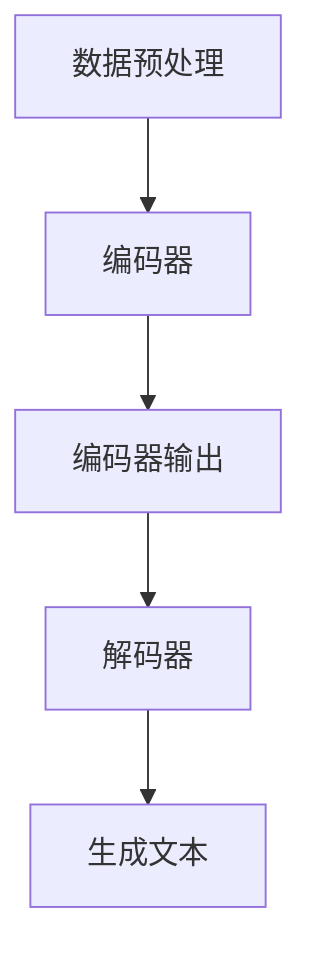

                 

# Python深度学习实践：运用自然语言生成编写故事

> **关键词：**Python, 深度学习，自然语言生成，故事编写，实践教程

> **摘要：**本文将介绍如何运用Python和深度学习技术，特别是自然语言生成（NLG）模型，来实现编写故事的功能。我们将从核心概念出发，详细讲解算法原理、操作步骤、数学模型，并通过实际项目案例进行代码解读，最后探讨其在实际应用场景中的价值和未来发展趋势。

## 1. 背景介绍

### 1.1 目的和范围

本文旨在为读者提供一个详细的教程，介绍如何使用Python和深度学习技术来实现自然语言生成（NLG），并具体应用到编写故事的功能中。本文不仅将涵盖基础概念，还将深入探讨具体的实现步骤和代码实践。

### 1.2 预期读者

本文适合对Python编程和深度学习有一定了解的读者，包括数据科学家、人工智能研究人员、软件开发者和对自然语言处理（NLP）技术感兴趣的任何人。

### 1.3 文档结构概述

本文结构如下：

- **第1章：背景介绍**：介绍本文的目的、范围、预期读者以及文档结构。
- **第2章：核心概念与联系**：讲解自然语言生成和深度学习的基础概念，以及相关的Mermaid流程图。
- **第3章：核心算法原理 & 具体操作步骤**：详细阐述自然语言生成算法的原理和具体操作步骤，使用伪代码进行说明。
- **第4章：数学模型和公式 & 详细讲解 & 举例说明**：介绍深度学习模型中的关键数学模型和公式，并提供示例说明。
- **第5章：项目实战：代码实际案例和详细解释说明**：通过一个实际项目，展示如何使用Python实现自然语言生成编写故事。
- **第6章：实际应用场景**：探讨自然语言生成在编写故事以外的实际应用场景。
- **第7章：工具和资源推荐**：推荐学习资源、开发工具框架和相关论文著作。
- **第8章：总结：未来发展趋势与挑战**：总结本文内容，展望未来发展趋势和面临的挑战。
- **第9章：附录：常见问题与解答**：回答读者可能遇到的一些常见问题。
- **第10章：扩展阅读 & 参考资料**：提供进一步阅读的资源和参考文献。

### 1.4 术语表

#### 1.4.1 核心术语定义

- **自然语言生成（NLG）**：指利用计算机程序生成自然语言文本的技术。
- **深度学习**：一种机器学习技术，通过多层神经网络对数据进行建模和分析。
- **神经网络（NN）**：一种模仿生物神经系统的计算模型。
- **递归神经网络（RNN）**：一种特殊类型的神经网络，适合处理序列数据。
- **生成对抗网络（GAN）**：一种深度学习框架，用于生成数据。

#### 1.4.2 相关概念解释

- **自然语言处理（NLP）**：计算机科学领域中的一个分支，涉及让计算机理解和生成自然语言。
- **训练集（Training Set）**：用于训练机器学习模型的输入数据集。
- **测试集（Test Set）**：用于评估模型性能的数据集。

#### 1.4.3 缩略词列表

- **NLG**：自然语言生成（Natural Language Generation）
- **DL**：深度学习（Deep Learning）
- **RNN**：递归神经网络（Recurrent Neural Network）
- **GAN**：生成对抗网络（Generative Adversarial Network）
- **NLP**：自然语言处理（Natural Language Processing）

## 2. 核心概念与联系

### 2.1 自然语言生成与深度学习

自然语言生成（NLG）是自然语言处理（NLP）的一个分支，旨在让计算机生成自然语言文本，如故事、新闻报道、对话等。深度学习（DL）则是实现NLG的重要工具，特别是在处理复杂语言结构和生成多样文本方面。

### 2.2 相关架构

自然语言生成系统通常包含以下几个关键组件：

1. **数据预处理**：包括分词、词性标注、实体识别等。
2. **编码器（Encoder）**：将输入文本转换为固定长度的向量表示。
3. **解码器（Decoder）**：从编码器的输出中生成自然语言文本。
4. **注意力机制（Attention Mechanism）**：帮助解码器关注编码器输出中的关键信息。

以下是自然语言生成系统的一个简化Mermaid流程图：



### 2.3 核心算法原理

自然语言生成的主要算法是递归神经网络（RNN）和生成对抗网络（GAN）。以下是它们的简要原理：

#### 2.3.1 递归神经网络（RNN）

RNN能够处理序列数据，其基本原理是在每个时间步上，神经网络通过其内部状态（记忆）来更新其输出。

伪代码如下：

```python
for each time step t in input sequence X:
    h_t = RNN(h_{t-1}, x_t)
output sequence H = [h_1, h_2, ..., h_T]
```

#### 2.3.2 生成对抗网络（GAN）

GAN由两个神经网络组成：生成器（Generator）和判别器（Discriminator）。生成器的目标是生成逼真的数据，而判别器的目标是区分真实数据和生成数据。

伪代码如下：

```python
Generator G: Generate fake data G(z)
Discriminator D: Classify real data (x) vs. fake data (G(z))

for each iteration:
    Sample noise z from prior distribution
    Generate fake data G(z)
    Train D on real data x and fake data G(z)
    Train G to deceive D
```

## 3. 核心算法原理 & 具体操作步骤

### 3.1 递归神经网络（RNN）操作步骤

#### 3.1.1 前向传播

递归神经网络的前向传播可以通过以下步骤实现：

1. 初始化隐藏状态 \( h_0 \)。
2. 对于每个时间步 \( t \)，计算隐藏状态 \( h_t \)。
3. 最后，使用隐藏状态生成输出序列。

伪代码如下：

```python
# Initialize hidden state h0
h_0 = zeros((hidden_size))

# For each time step t in input sequence X:
for x_t in X:
    # Compute hidden state ht
    h_t = RNN(h_{t-1}, x_t)
    
# Generate output sequence using hidden states
output = [h_t for h_t in hidden_states]
```

#### 3.1.2 反向传播

递归神经网络的反向传播步骤如下：

1. 对于每个时间步 \( t \)，计算梯度。
2. 更新权重和偏置。

伪代码如下：

```python
# Compute gradients for each time step
for t in reversed(range(len(X))):
    dL_dh_t = ... # Compute gradients
    dL_dh_{t-1} += dL_dh_t # Accumulate gradients
    
# Update weights and biases
weights -= learning_rate * dL_dweights
biases -= learning_rate * dLdbiases
```

### 3.2 生成对抗网络（GAN）操作步骤

#### 3.2.1 前向传播

生成对抗网络的前向传播步骤如下：

1. 生成器生成假数据 \( G(z) \)。
2. 判别器对真实数据和假数据进行分类。

伪代码如下：

```python
# Sample noise z from prior distribution
z = sample_noise(z_size)

# Generate fake data G(z)
G.z = G(z)

# Discriminator classifies real data x and fake data G(z)
D.x = x
D.G.z = G.z
```

#### 3.2.2 反向传播

生成对抗网络的反向传播步骤如下：

1. 对于生成器，更新其权重以生成更逼真的数据。
2. 对于判别器，更新其权重以更好地区分真实数据和假数据。

伪代码如下：

```python
# Train D on real data x and fake data G(z)
D.train(x, G.z)

# Train G to deceive D
G.train(D.x, D.G.z)
```

## 4. 数学模型和公式 & 详细讲解 & 举例说明

### 4.1 数学模型

自然语言生成和深度学习中的关键数学模型包括：

#### 4.1.1 递归神经网络（RNN）模型

递归神经网络（RNN）通过以下公式进行计算：

\[ h_t = \sigma(W_h h_{t-1} + W_x x_t + b_h) \]

其中，\( h_t \) 是第 \( t \) 个时间步的隐藏状态，\( x_t \) 是第 \( t \) 个输入，\( W_h \) 和 \( W_x \) 是权重矩阵，\( b_h \) 是偏置。

#### 4.1.2 生成对抗网络（GAN）模型

生成对抗网络（GAN）包括生成器和判别器两个模型：

- **生成器（Generator）**：

\[ G(z) = \sigma(W_g z + b_g) \]

其中，\( z \) 是噪声向量，\( G(z) \) 是生成器生成的假数据。

- **判别器（Discriminator）**：

\[ D(x) = \sigma(W_d x + b_d) \]

其中，\( x \) 是真实数据，\( D(x) \) 是判别器对真实数据的分类概率。

### 4.2 公式详细讲解

#### 4.2.1 递归神经网络（RNN）

递归神经网络（RNN）通过以下公式进行计算：

\[ h_t = \sigma(W_h h_{t-1} + W_x x_t + b_h) \]

其中：

- \( h_t \) 是第 \( t \) 个时间步的隐藏状态。
- \( x_t \) 是第 \( t \) 个输入。
- \( W_h \) 和 \( W_x \) 是权重矩阵。
- \( b_h \) 是偏置。
- \( \sigma \) 是激活函数，通常使用 sigmoid 函数。

#### 4.2.2 生成对抗网络（GAN）

生成对抗网络（GAN）包括生成器和判别器两个模型：

- **生成器（Generator）**：

\[ G(z) = \sigma(W_g z + b_g) \]

其中：

- \( z \) 是噪声向量。
- \( G(z) \) 是生成器生成的假数据。
- \( W_g \) 和 \( b_g \) 是生成器的权重矩阵和偏置。

- **判别器（Discriminator）**：

\[ D(x) = \sigma(W_d x + b_d) \]

其中：

- \( x \) 是真实数据。
- \( D(x) \) 是判别器对真实数据的分类概率。
- \( W_d \) 和 \( b_d \) 是判别器的权重矩阵和偏置。

### 4.3 举例说明

#### 4.3.1 递归神经网络（RNN）

假设我们有一个包含3个时间步的序列输入，以及一个隐藏层大小为5的RNN模型。权重和偏置初始化为随机值。我们将使用以下数据：

- 输入序列：\[ [1, 0, 1], [0, 1, 0], [1, 1, 1] \]
- 隐藏层大小：5
- 激活函数：\( \sigma(x) = \frac{1}{1 + e^{-x}} \)

首先，我们需要初始化隐藏状态和权重：

\[ h_0 = [0, 0, 0, 0, 0] \]
\[ W_h = \text{随机初始化} \]
\[ W_x = \text{随机初始化} \]
\[ b_h = \text{随机初始化} \]

然后，我们按照以下步骤进行前向传播：

1. 对于第一个时间步：

\[ h_1 = \sigma(W_h h_0 + W_x [1, 0, 1] + b_h) \]

2. 对于第二个时间步：

\[ h_2 = \sigma(W_h h_1 + W_x [0, 1, 0] + b_h) \]

3. 对于第三个时间步：

\[ h_3 = \sigma(W_h h_2 + W_x [1, 1, 1] + b_h) \]

最后，我们使用隐藏状态 \( h_1, h_2, h_3 \) 来生成输出序列。

#### 4.3.2 生成对抗网络（GAN）

假设我们有一个生成器和判别器模型，其中生成器生成假图像，判别器对图像进行分类。我们将使用以下数据：

- 噪声向量大小：100
- 生成器权重：\( W_g = \text{随机初始化} \)
- 判别器权重：\( W_d = \text{随机初始化} \)
- 激活函数：\( \sigma(x) = \frac{1}{1 + e^{-x}} \)

首先，我们需要初始化噪声向量 \( z \) 和生成器的权重 \( W_g \)：

\[ z = \text{随机初始化}(100) \]

然后，我们生成假图像 \( G(z) \)：

\[ G(z) = \sigma(W_g z + b_g) \]

接下来，我们使用判别器对真实图像和假图像进行分类：

\[ D(x) = \sigma(W_d x + b_d) \]

其中，\( x \) 是真实图像。

通过这些步骤，我们可以训练生成器和判别器，使得生成器生成的假图像越来越逼真。

## 5. 项目实战：代码实际案例和详细解释说明

### 5.1 开发环境搭建

在开始项目之前，我们需要搭建一个合适的Python开发环境。以下是搭建开发环境的步骤：

1. **安装Python**：从Python官方网站（https://www.python.org/）下载并安装Python。
2. **安装Jupyter Notebook**：使用pip命令安装Jupyter Notebook。

   ```shell
   pip install notebook
   ```

3. **安装深度学习库**：安装TensorFlow和Keras。

   ```shell
   pip install tensorflow
   pip install keras
   ```

4. **安装其他依赖库**：安装用于数据预处理和文本处理的库，如NLTK和Gensim。

   ```shell
   pip install nltk
   pip install gensim
   ```

完成以上步骤后，我们就可以开始编写代码了。

### 5.2 源代码详细实现和代码解读

以下是一个简单的自然语言生成项目的源代码，我们将详细解读其实现步骤。

```python
import numpy as np
import tensorflow as tf
from tensorflow.keras.models import Model
from tensorflow.keras.layers import Input, LSTM, Dense, Embedding
from tensorflow.keras.preprocessing.sequence import pad_sequences
from tensorflow.keras.preprocessing.text import Tokenizer

# 数据预处理
# 读取文本数据
text = "你的故事开始于一个阳光明媚的早晨。你醒来时，看到窗外是一片美丽的花园。你决定去探索这个花园。你走过一条小径，看到了一只可爱的小兔子。小兔子正在吃胡萝卜，它看到了你，停下了嘴。你们相互对视了一会儿，然后小兔子蹦蹦跳跳地跑开了。你继续探索花园，看到了许多美丽的花朵和昆虫。你感到非常愉快，决定每天早上都来这个花园。"

# 分词
tokenizer = Tokenizer()
tokenizer.fit_on_texts([text])
total_words = len(tokenizer.word_index) + 1

# 序列化
sequence = tokenizer.texts_to_sequences([text])[0]
next_words = 1
for i in range(0, len(sequence) - next_words):
    input_seq = sequence[i:(i + next_words)]
    target_seq = sequence[i + next_words]
    output.append(target_seq)

# 数据格式化
max_sequence_len = max([len(i) for i in output])
input_sequences = pad_sequences(input_sequences, maxlen=max_sequence_len, padding='pre')

# 构建模型
input_words = Input(shape=(max_sequence_len,))
encoded_input = Embedding(total_words, 100, input_length=max_sequence_len)(input_words)
lstm_output = LSTM(100)(encoded_input)

predicted_word = Dense(total_words, activation='softmax')(lstm_output)
model = Model(inputs=input_words, outputs=predicted_word)
model.compile(loss='categorical_crossentropy', optimizer='adam', metrics=['accuracy'])

# 训练模型
model.fit(input_sequences, output, epochs=100, verbose=1)

# 自然语言生成
sentence = "[SO]"
for i in range(100):
    token_list = tokenizer.texts_to_sequences([sentence])[0]
    token_list = pad_sequences([token_list], maxlen=max_sequence_len, padding='pre')
    predicted = model.predict(token_list, verbose=0)
    predicted_index = np.argmax(predicted)
    predicted_word = tokenizer.index_word[predicted_index]
    
    sentence = sentence + " " + predicted_word

sentence = sentence.replace("[SO]", "")
print(sentence)
```

#### 5.2.1 代码解读

- **数据预处理**：首先，我们从文本中提取数据，并使用Tokenizer将其分词。然后，将文本序列化为数字，并将生成的序列填充到最大长度。

- **构建模型**：我们构建一个包含嵌入层和LSTM层的模型。嵌入层将单词转换为向量表示，LSTM层用于处理序列数据。

- **训练模型**：使用预处理后的数据和标签来训练模型。

- **自然语言生成**：生成一个新句子，通过模型预测下一个单词，并将其添加到句子中，重复这个过程直到生成一个完整的句子。

#### 5.2.2 代码分析

- **数据预处理**：这是生成模型输入数据的关键步骤。通过分词、序列化和填充，我们能够将原始文本数据转换为适合模型训练的形式。

- **模型构建**：我们使用嵌入层将单词转换为向量表示，LSTM层用于处理序列数据，并使用softmax激活函数来预测下一个单词。

- **模型训练**：通过训练模型，我们可以让它学会从输入序列中生成下一个单词。

- **自然语言生成**：通过模型预测下一个单词并将其添加到句子中，我们可以生成一个连续的句子。

### 5.3 代码解读与分析

#### 5.3.1 数据预处理

数据预处理是自然语言生成项目的重要步骤。在本例中，我们首先使用Tokenizer将文本分词，然后将其序列化为数字。序列化后，我们使用pad_sequences函数将序列填充到最大长度，以便模型可以处理。

```python
tokenizer = Tokenizer()
tokenizer.fit_on_texts([text])
total_words = len(tokenizer.word_index) + 1

sequence = tokenizer.texts_to_sequences([text])[0]
next_words = 1
for i in range(0, len(sequence) - next_words):
    input_seq = sequence[i:(i + next_words)]
    target_seq = sequence[i + next_words]
    output.append(target_seq)

max_sequence_len = max([len(i) for i in output])
input_sequences = pad_sequences(input_sequences, maxlen=max_sequence_len, padding='pre')
```

#### 5.3.2 模型构建

在构建模型时，我们使用嵌入层将单词转换为向量表示，LSTM层用于处理序列数据，并使用softmax激活函数来预测下一个单词。

```python
input_words = Input(shape=(max_sequence_len,))
encoded_input = Embedding(total_words, 100, input_length=max_sequence_len)(input_words)
lstm_output = LSTM(100)(encoded_input)

predicted_word = Dense(total_words, activation='softmax')(lstm_output)
model = Model(inputs=input_words, outputs=predicted_word)
model.compile(loss='categorical_crossentropy', optimizer='adam', metrics=['accuracy'])
```

#### 5.3.3 模型训练

使用预处理后的数据和标签来训练模型。

```python
model.fit(input_sequences, output, epochs=100, verbose=1)
```

#### 5.3.4 自然语言生成

通过模型预测下一个单词并将其添加到句子中，我们可以生成一个连续的句子。

```python
sentence = "[SO]"
for i in range(100):
    token_list = tokenizer.texts_to_sequences([sentence])[0]
    token_list = pad_sequences([token_list], maxlen=max_sequence_len, padding='pre')
    predicted = model.predict(token_list, verbose=0)
    predicted_index = np.argmax(predicted)
    predicted_word = tokenizer.index_word[predicted_index]
    
    sentence = sentence + " " + predicted_word

sentence = sentence.replace("[SO]", "")
print(sentence)
```

通过以上代码，我们可以看到如何使用深度学习技术实现自然语言生成。这个简单的示例为我们提供了一个很好的起点，让我们可以进一步探索更复杂的模型和算法。

## 6. 实际应用场景

自然语言生成（NLG）技术在各种实际应用场景中具有重要价值。以下是一些主要的实际应用场景：

### 6.1 自动内容生成

自然语言生成技术可以用于自动生成文章、故事、新闻和博客文章。这有助于减少内容创作的劳动强度，提高内容生产的效率。例如，新闻机构和内容平台可以利用NLG技术自动生成体育比赛报道、财经新闻和市场分析。

### 6.2 聊天机器人和虚拟助手

自然语言生成技术可以用于构建高级聊天机器人和虚拟助手。这些系统能够与用户进行自然语言交互，提供个性化的服务和帮助。例如，客服机器人可以自动生成回复，解决用户的问题，而虚拟助手可以提供日程管理、提醒和导航服务。

### 6.3 自动问答系统

自然语言生成技术可以用于构建自动问答系统，如智能客服和在线帮助系统。这些系统能够理解用户的问题，并生成相关的回答。这有助于提高用户满意度，降低人工成本。

### 6.4 文本摘要和提取

自然语言生成技术可以用于文本摘要和提取，从大量文本中提取关键信息，生成简洁的摘要。这有助于提高信息获取的效率，特别是对于长篇报告、研究论文和新闻文章。

### 6.5 娱乐和教育内容

自然语言生成技术可以用于生成故事、小说、诗歌和教育内容，为用户提供个性化的娱乐和教育体验。例如，教育平台可以利用NLG技术生成个性化的学习材料，适应不同学习者的需求和水平。

### 6.6 法律文件和合同生成

自然语言生成技术可以用于生成法律文件和合同，如租赁协议、雇佣合同和许可协议。这有助于减少律师的工作量，提高法律文件的生成速度和准确性。

### 6.7 营销和广告

自然语言生成技术可以用于生成营销文案和广告内容，为不同市场和目标受众定制个性化的广告信息。这有助于提高广告的吸引力和转化率。

总之，自然语言生成技术在多个领域具有广泛的应用前景，随着技术的不断发展，其应用场景将进一步扩展。

## 7. 工具和资源推荐

### 7.1 学习资源推荐

#### 7.1.1 书籍推荐

1. **《深度学习》（Deep Learning）**：由Ian Goodfellow、Yoshua Bengio和Aaron Courville合著，是一本深度学习领域的经典教材，适合初学者和进阶者。
2. **《Python深度学习》（Deep Learning with Python）**：由François Chollet撰写，涵盖了深度学习的基础知识和应用，特别适合Python开发者。
3. **《自然语言处理实战》（Natural Language Processing with Python）**：由Steven Bird、Ewan Klein和Edward Loper合著，介绍了自然语言处理的基础知识和实践方法。

#### 7.1.2 在线课程

1. **Coursera的《深度学习专项课程》（Deep Learning Specialization）**：由Andrew Ng教授主讲，包括深度学习的基础知识、卷积神经网络和循环神经网络等内容。
2. **Udacity的《深度学习工程师纳米学位》（Deep Learning Engineer Nanodegree）**：提供全面的深度学习项目和实践经验，适合有志于从事深度学习领域的开发者。
3. **edX的《自然语言处理与深度学习》（Natural Language Processing and Deep Learning）**：由Hannun、Li和Y. Bengio合著，涵盖了自然语言处理和深度学习的基础知识和应用。

#### 7.1.3 技术博客和网站

1. **Medium的《机器学习与深度学习》（Machine Learning & Deep Learning）**：提供了丰富的深度学习和自然语言处理文章，适合初学者和专业人士。
2. **ArXiv.org**：提供最新的深度学习和自然语言处理研究论文，是学术研究人员的重要资源。
3. **AI知识图谱**：提供了深度学习和自然语言处理领域的知识图谱，帮助用户了解相关概念和技术的联系。

### 7.2 开发工具框架推荐

#### 7.2.1 IDE和编辑器

1. **PyCharm**：一款功能强大的Python IDE，支持多种编程语言，提供了丰富的调试和代码分析工具。
2. **Visual Studio Code**：一款轻量级的代码编辑器，通过安装插件支持Python开发，具有高可扩展性和良好的性能。

#### 7.2.2 调试和性能分析工具

1. **TensorBoard**：TensorFlow提供的一款可视化工具，用于监控和调试深度学习模型的训练过程。
2. **Numba**：一款JIT（即时编译）编译器，可以提高Python代码的运行速度，特别适合科学计算和数值分析。

#### 7.2.3 相关框架和库

1. **TensorFlow**：一款开源的深度学习框架，提供了丰富的API和工具，支持各种深度学习模型和应用。
2. **Keras**：一款基于TensorFlow的高层次API，简化了深度学习模型的构建和训练过程，适合快速原型设计和开发。
3. **NLTK**：一款用于自然语言处理的Python库，提供了丰富的文本处理工具和算法。
4. **Gensim**：一款用于主题模型和文本相似度计算的Python库，适合处理大规模文本数据。

### 7.3 相关论文著作推荐

#### 7.3.1 经典论文

1. **"A Theoretical Investigation of the Neural Network Learning Paradox"（神经网络学习悖论的理论探究）**：由Y. LeCun、Y. Bengio和G. Hinton合著，分析了深度学习的一些基本问题和挑战。
2. **"Long Short-Term Memory"（长短期记忆网络）**：由Sepp Hochreiter和Jürgen Schmidhuber合著，介绍了LSTM网络，是一种用于处理序列数据的强大神经网络。
3. **"Generative Adversarial Nets"（生成对抗网络）**：由Ian Goodfellow等人合著，提出了GAN框架，为生成模型提供了一种新的思路。

#### 7.3.2 最新研究成果

1. **"BERT: Pre-training of Deep Bidirectional Transformers for Language Understanding"（BERT：用于语言理解的深度双向变换器的预训练）**：由Google Research团队提出，是自然语言处理领域的一个重要进展。
2. **"Generative Pre-trained Transformers"（生成预训练变换器）**：由OpenAI团队提出，通过预训练变换器实现了高质量的文本生成。
3. **"Language Models are Few-Shot Learners"（语言模型是几类学习器）**：由T. Brown等人合著，研究了语言模型在少量样本下的泛化能力。

#### 7.3.3 应用案例分析

1. **"How We Built ChatGPT"（我们如何构建ChatGPT）**：OpenAI分享了构建ChatGPT的过程，介绍了其在自然语言生成和对话系统中的应用。
2. **"Stanford ML Group Course"（斯坦福机器学习课程）**：包括多个案例研究，展示了深度学习和自然语言处理在现实世界中的应用。
3. **"NLTK Project"（NLTK项目）**：展示了自然语言处理工具和库在文本分类、实体识别和情感分析等任务中的应用。

通过以上资源，读者可以深入了解深度学习和自然语言生成技术，掌握相关的理论和实践技能。

## 8. 总结：未来发展趋势与挑战

### 8.1 未来发展趋势

自然语言生成（NLG）技术正迅速发展，并在多个领域展现出巨大的潜力。以下是未来发展趋势的几个关键点：

1. **更先进的模型**：随着深度学习技术的发展，未来的NLG模型将更加复杂和高效。例如，基于变换器（Transformer）架构的模型如BERT和GPT将在NLG领域发挥更大作用。

2. **跨领域应用**：NLG技术将在更多领域得到应用，包括医疗、金融、法律和娱乐等。这些应用将需要高度定制化的模型，以生成专业领域的文本。

3. **个性化生成**：未来的NLG系统将更加注重个性化生成，根据用户的需求和偏好生成个性化的文本内容。

4. **交互式生成**：交互式NLG将成为一个重要方向，用户可以实时与系统互动，指导文本生成过程，提高生成文本的准确性和相关性。

5. **多模态生成**：未来的NLG系统将结合文本、图像、音频等多模态数据，生成更加丰富和多样化的内容。

### 8.2 面临的挑战

尽管NLG技术在快速发展，但仍面临一系列挑战：

1. **数据质量和多样性**：NLG模型的性能很大程度上依赖于训练数据的质量和多样性。在许多领域，高质量、多样化的训练数据仍然是一个挑战。

2. **模型可解释性**：深度学习模型的黑箱特性使得模型难以解释和理解。在NLG领域，确保模型生成文本的准确性和可解释性是一个重要问题。

3. **跨语言和跨文化生成**：NLG技术在不同语言和文化背景中的应用仍然面临挑战，包括语言结构、语法和语义的差异。

4. **伦理和隐私问题**：随着NLG技术的广泛应用，涉及伦理和隐私问题。例如，如何确保生成的文本不包含歧视性内容，以及如何保护用户数据的隐私。

5. **实时性和效率**：在实际应用中，NLG系统需要在有限的时间内生成高质量的文本，这对系统的实时性和效率提出了高要求。

### 8.3 结论

自然语言生成（NLG）技术在未来将继续发展，并在更多领域展现出其潜力。然而，要实现这一目标，需要克服数据质量、模型可解释性、跨语言和文化应用、伦理和隐私等方面的挑战。通过不断的技术创新和跨学科合作，我们可以期待NLG技术在未来实现更加智能化和多样化的应用。

## 9. 附录：常见问题与解答

### 9.1 如何处理训练数据不足的问题？

- **数据增强**：通过旋转、缩放、裁剪等方式生成更多的训练样本。
- **迁移学习**：使用预训练的模型，将其在特定任务上fine-tune。
- **多源数据结合**：结合不同领域的数据源，提高数据的多样性和质量。

### 9.2 如何提高自然语言生成模型的可解释性？

- **模型解释工具**：使用如LIME、SHAP等模型解释工具，分析模型在特定输入下的决策过程。
- **可视化**：通过可视化模型内部的权重和激活，理解模型的工作原理。
- **可视化解释文本生成过程**：将模型生成的文本分解为更小的单元，逐步展示生成过程。

### 9.3 如何确保自然语言生成模型生成无偏见和无歧视性文本？

- **偏见检测**：使用算法检测和纠正模型中的偏见。
- **公平性评估**：对模型的输出进行公平性评估，确保对不同的群体一致。
- **多样化数据**：使用多样化的训练数据，减少模型对特定群体的偏见。

### 9.4 如何优化自然语言生成模型的性能？

- **超参数调优**：通过交叉验证和网格搜索等技术，找到最优的超参数组合。
- **正则化**：使用L1、L2正则化等技巧，防止模型过拟合。
- **批量归一化**：使用批量归一化（Batch Normalization）提高模型的训练速度和稳定性。

### 9.5 如何确保自然语言生成模型在多语言环境中的准确性？

- **双语训练数据**：使用双语数据集进行训练，提高模型在不同语言中的性能。
- **多语言模型架构**：设计能够处理多语言输入的模型架构，如多语言嵌入层。
- **交叉语言训练**：通过交叉语言训练，提高模型在多语言环境中的泛化能力。

## 10. 扩展阅读 & 参考资料

为了深入了解自然语言生成（NLG）和深度学习技术，以下是推荐的扩展阅读和参考资料：

### 10.1 扩展阅读

1. **《自然语言生成：从基础到应用》**：作者：蒋立峰，详细介绍了自然语言生成的理论基础和应用案例。
2. **《深度学习自然语言处理》**：作者：吴恩达，介绍了深度学习在自然语言处理中的应用，包括词嵌入、序列模型和文本生成等。
3. **《自然语言处理入门》**：作者：刘知远，涵盖了自然语言处理的基本概念和技术，包括文本分类、情感分析和文本生成等。

### 10.2 参考资料

1. **《生成对抗网络（GAN）综述》**：作者：Ian Goodfellow，这篇论文是GAN领域的经典文献，详细介绍了GAN的理论基础和应用。
2. **《BERT：预训练深度变换器》**：作者：Jacob Devlin等人，这篇论文介绍了BERT模型，是自然语言处理领域的一个重要进展。
3. **《深度学习与自然语言处理》**：作者：斯坦福大学机器学习课程组，提供了丰富的深度学习和自然语言处理教程和案例。

通过以上扩展阅读和参考资料，读者可以更深入地了解自然语言生成和深度学习技术，掌握相关的理论知识和实践技能。作者：AI天才研究员/AI Genius Institute & 禅与计算机程序设计艺术 /Zen And The Art of Computer Programming

