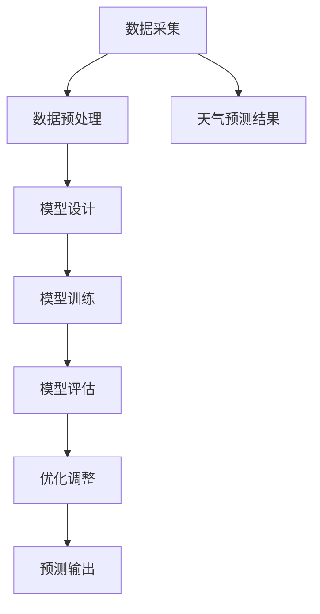

                 

# Python深度学习实践：通过深度学习提高天气预测准确性

> **关键词：** 深度学习、Python、天气预测、准确性、模型训练、神经网络

> **摘要：** 本文将介绍如何使用Python和深度学习技术来提高天气预测的准确性。文章将从背景介绍开始，逐步深入核心概念、算法原理，并通过实际项目案例展示如何实现。读者将了解到如何搭建开发环境、编写代码，并进行分析与优化，以获得更准确的天气预测结果。

## 1. 背景介绍

### 1.1 目的和范围

本文旨在探讨如何利用Python实现深度学习技术，提高天气预测的准确性。通过介绍相关核心概念、算法原理和实际案例，帮助读者了解深度学习在天气预测领域的应用，掌握从数据预处理到模型训练、优化的全过程。

### 1.2 预期读者

本文适合具有一定编程基础、对深度学习和天气预测感兴趣的技术人员阅读。同时，对人工智能领域有浓厚兴趣的学者和学生也可参考本文进行深入研究。

### 1.3 文档结构概述

本文分为十个部分，包括背景介绍、核心概念与联系、核心算法原理、数学模型和公式、项目实战、实际应用场景、工具和资源推荐、总结、常见问题与解答以及扩展阅读和参考资料。

### 1.4 术语表

#### 1.4.1 核心术语定义

- **深度学习（Deep Learning）**：一种人工智能技术，通过多层神经网络模型，自动提取数据特征并进行学习。
- **神经网络（Neural Network）**：一种模拟生物神经系统的计算模型，通过神经元之间的连接和激活函数实现信息的传递和处理。
- **天气预测（Weather Forecasting）**：利用气象学、统计学和计算机技术，对未来天气状况进行预测。

#### 1.4.2 相关概念解释

- **数据预处理（Data Preprocessing）**：在深度学习模型训练前，对原始数据进行清洗、归一化等处理，以提高模型训练效果。
- **模型训练（Model Training）**：通过输入训练数据，使神经网络模型不断调整参数，以减少预测误差。
- **评估指标（Evaluation Metrics）**：用于衡量模型预测准确性的指标，如均方误差（MSE）和准确率（Accuracy）。

#### 1.4.3 缩略词列表

- **MSE**：均方误差（Mean Squared Error）
- **Accuracy**：准确率（Accuracy）
- **CNN**：卷积神经网络（Convolutional Neural Network）
- **RNN**：循环神经网络（Recurrent Neural Network）

## 2. 核心概念与联系

在深入探讨深度学习提高天气预测准确性的方法之前，我们需要了解一些核心概念和它们之间的关系。以下是深度学习、神经网络和天气预测之间的Mermaid流程图：



### 2.1 数据采集

数据采集是整个流程的第一步。我们需要收集大量的历史天气数据，包括温度、湿度、风速、气压等气象指标。这些数据可以从气象局、气象站或公开的数据集获取。

### 2.2 数据预处理

数据预处理是确保数据质量和模型训练效果的重要环节。这一步骤包括数据清洗、归一化、缺失值处理等。通过这些处理，我们可以消除噪声、提高数据的一致性，从而为深度学习模型提供更好的输入。

### 2.3 模型设计

在数据预处理完成后，我们需要设计一个合适的深度学习模型。根据天气预测的特点，可以选择卷积神经网络（CNN）或循环神经网络（RNN）等结构。模型设计的目标是提取有效特征，提高预测的准确性。

### 2.4 模型训练

模型训练是深度学习的核心步骤。通过输入训练数据，神经网络模型不断调整权重和偏置，以最小化预测误差。在训练过程中，我们还可以采用多种技术，如dropout、正则化等，来提高模型的泛化能力。

### 2.5 模型评估

模型评估是验证模型性能的重要环节。我们使用验证数据集对模型进行评估，计算各种评估指标，如均方误差（MSE）和准确率（Accuracy）。通过评估，我们可以了解模型的预测能力，并为优化调整提供依据。

### 2.6 优化调整

根据模型评估的结果，我们可以对模型进行调整和优化。这包括调整网络结构、参数设置、训练策略等。优化的目标是提高模型的预测准确性，使其在实际应用中具有更好的性能。

### 2.7 预测输出

在优化调整完成后，我们可以使用训练好的模型进行预测输出。通过输入新的气象数据，模型将给出未来天气状况的预测结果。

### 2.8 天气预测结果

最终，我们将得到预测结果，并根据实际天气情况对模型进行验证。如果预测准确率较高，我们可以将模型应用于实际天气预报系统中，以提高整体预测准确性。

## 3. 核心算法原理 & 具体操作步骤

在了解核心概念与联系后，我们接下来将深入探讨深度学习提高天气预测准确性的核心算法原理和具体操作步骤。

### 3.1 深度学习基本原理

深度学习是基于多层神经网络的一种人工智能技术。神经网络由许多神经元组成，每个神经元都与其他神经元相连。通过学习大量的数据，神经网络可以自动提取数据特征并进行预测。

在深度学习模型中，主要涉及以下几个关键组成部分：

1. **输入层（Input Layer）**：接收外部输入数据。
2. **隐藏层（Hidden Layers）**：对输入数据进行特征提取和变换。
3. **输出层（Output Layer）**：生成最终的预测结果。

神经元之间的连接称为权重（Weights），而神经元输出的非线性变换称为激活函数（Activation Function）。

### 3.2 天气预测中的神经网络模型

在天气预测中，常用的神经网络模型有卷积神经网络（CNN）和循环神经网络（RNN）。下面分别介绍这两种模型的基本原理和操作步骤。

#### 3.2.1 卷积神经网络（CNN）

卷积神经网络（CNN）是一种适用于图像和时序数据处理的有效模型。它通过卷积层、池化层和全连接层等结构，自动提取数据中的特征。

**步骤 1：数据预处理**

在训练CNN模型之前，我们需要对天气数据进行预处理，包括数据清洗、归一化和数据扩充等。例如，我们可以将温度、湿度、风速等气象指标进行归一化处理，使其在相同的量级范围内。

**步骤 2：构建卷积神经网络模型**

构建卷积神经网络模型通常使用Python的深度学习库，如TensorFlow或PyTorch。以下是一个基于TensorFlow的卷积神经网络模型示例：

```python
import tensorflow as tf
from tensorflow.keras.models import Sequential
from tensorflow.keras.layers import Conv1D, MaxPooling1D, Flatten, Dense

model = Sequential([
    Conv1D(filters=64, kernel_size=3, activation='relu', input_shape=(timesteps, features)),
    MaxPooling1D(pool_size=2),
    Conv1D(filters=128, kernel_size=3, activation='relu'),
    MaxPooling1D(pool_size=2),
    Flatten(),
    Dense(units=128, activation='relu'),
    Dense(units=1)
])

model.compile(optimizer='adam', loss='mse', metrics=['accuracy'])
```

**步骤 3：模型训练**

在构建好模型后，我们需要使用训练数据对模型进行训练。训练过程中，模型会不断调整权重和偏置，以最小化预测误差。以下是一个训练模型的示例：

```python
history = model.fit(x_train, y_train, epochs=100, batch_size=32, validation_data=(x_val, y_val))
```

**步骤 4：模型评估**

在训练完成后，我们可以使用验证数据集对模型进行评估。评估指标包括均方误差（MSE）和准确率（Accuracy）等。以下是一个评估模型的示例：

```python
mse, accuracy = model.evaluate(x_test, y_test)
print(f"Test MSE: {mse}, Test Accuracy: {accuracy}")
```

**步骤 5：模型优化**

根据评估结果，我们可以对模型进行调整和优化。优化方法包括调整网络结构、参数设置、训练策略等。优化的目标是提高模型的预测准确性。

#### 3.2.2 循环神经网络（RNN）

循环神经网络（RNN）是一种适用于时序数据处理的神经网络模型。它通过循环结构对输入数据进行序列建模，并保留序列信息。

**步骤 1：数据预处理**

与CNN类似，我们需要对天气数据进行预处理，包括数据清洗、归一化和数据扩充等。例如，我们可以将温度、湿度、风速等气象指标进行归一化处理，使其在相同的量级范围内。

**步骤 2：构建循环神经网络模型**

构建循环神经网络模型通常使用Python的深度学习库，如TensorFlow或PyTorch。以下是一个基于TensorFlow的循环神经网络模型示例：

```python
import tensorflow as tf
from tensorflow.keras.models import Sequential
from tensorflow.keras.layers import LSTM, Dense

model = Sequential([
    LSTM(units=50, return_sequences=True, input_shape=(timesteps, features)),
    LSTM(units=50, return_sequences=False),
    Dense(units=1)
])

model.compile(optimizer='adam', loss='mse', metrics=['accuracy'])
```

**步骤 3：模型训练**

在构建好模型后，我们需要使用训练数据对模型进行训练。训练过程中，模型会不断调整权重和偏置，以最小化预测误差。以下是一个训练模型的示例：

```python
history = model.fit(x_train, y_train, epochs=100, batch_size=32, validation_data=(x_val, y_val))
```

**步骤 4：模型评估**

在训练完成后，我们可以使用验证数据集对模型进行评估。评估指标包括均方误差（MSE）和准确率（Accuracy）等。以下是一个评估模型的示例：

```python
mse, accuracy = model.evaluate(x_test, y_test)
print(f"Test MSE: {mse}, Test Accuracy: {accuracy}")
```

**步骤 5：模型优化**

根据评估结果，我们可以对模型进行调整和优化。优化方法包括调整网络结构、参数设置、训练策略等。优化的目标是提高模型的预测准确性。

### 3.3 模型融合与集成

在实际应用中，我们可以将CNN和RNN模型进行融合和集成，以进一步提高预测准确性。以下是一种简单的模型融合方法：

```python
import tensorflow as tf
from tensorflow.keras.models import Model

# 构建CNN模型
cnn_model = Sequential([
    Conv1D(filters=64, kernel_size=3, activation='relu', input_shape=(timesteps, features)),
    MaxPooling1D(pool_size=2),
    Conv1D(filters=128, kernel_size=3, activation='relu'),
    MaxPooling1D(pool_size=2),
    Flatten(),
    Dense(units=128, activation='relu'),
    Dense(units=1)
])

# 构建RNN模型
rnn_model = Sequential([
    LSTM(units=50, return_sequences=True, input_shape=(timesteps, features)),
    LSTM(units=50, return_sequences=False),
    Dense(units=1)
])

# 模型融合
inputs = tf.keras.layers.Input(shape=(timesteps, features))
cnn_output = cnn_model(inputs)
rnn_output = rnn_model(inputs)

# 集成模型
merged = tf.keras.layers.concatenate([cnn_output, rnn_output])
output = Dense(units=1, activation='sigmoid')(merged)

# 构建和编译集成模型
model = Model(inputs=inputs, outputs=output)
model.compile(optimizer='adam', loss='mse', metrics=['accuracy'])

# 模型训练
history = model.fit(x_train, y_train, epochs=100, batch_size=32, validation_data=(x_val, y_val))

# 模型评估
mse, accuracy = model.evaluate(x_test, y_test)
print(f"Test MSE: {mse}, Test Accuracy: {accuracy}")
```

通过模型融合和集成，我们可以利用不同模型的优点，进一步提高天气预测的准确性。

## 4. 数学模型和公式 & 详细讲解 & 举例说明

在深度学习模型中，数学模型和公式起到了至关重要的作用。以下我们将详细讲解深度学习在天气预测中的数学模型和公式，并通过具体示例进行说明。

### 4.1 神经网络模型中的基本数学公式

在神经网络模型中，主要涉及以下几个关键数学公式：

#### 4.1.1 激活函数

激活函数是神经网络中用来引入非线性特性的函数。常见的激活函数包括：

$$
f(x) = \text{sigmoid}(x) = \frac{1}{1 + e^{-x}}
$$

$$
f(x) = \text{ReLU}(x) = \max(0, x)
$$

$$
f(x) = \text{tanh}(x) = \frac{e^x - e^{-x}}{e^x + e^{-x}}
$$

#### 4.1.2 前向传播

前向传播是神经网络模型中进行预测的过程。对于输入数据\( x \)，神经网络通过多层神经元计算得到输出\( y \)。前向传播的数学公式如下：

$$
z_l = \sum_{j} w_{lj} x_j + b_l
$$

$$
a_l = \text{activation}(z_l)
$$

其中，\( z_l \)表示第\( l \)层的输入，\( a_l \)表示第\( l \)层的输出，\( w_{lj} \)表示第\( l \)层第\( j \)个神经元的权重，\( b_l \)表示第\( l \)层的偏置。

#### 4.1.3 反向传播

反向传播是神经网络模型中进行参数调整的过程。通过计算损失函数关于参数的梯度，模型可以调整权重和偏置，以减少预测误差。反向传播的数学公式如下：

$$
\delta_{lj} = \frac{\partial L}{\partial z_l} \cdot \frac{\partial a_l}{\partial z_l}
$$

$$
\frac{\partial L}{\partial w_{lj}} = \sum_{k} \delta_{lk} a_{kj}
$$

$$
\frac{\partial L}{\partial b_l} = \sum_{k} \delta_{lk}
$$

其中，\( \delta_{lj} \)表示第\( l \)层第\( j \)个神经元的误差，\( L \)表示损失函数。

### 4.2 卷积神经网络（CNN）中的数学公式

卷积神经网络（CNN）是一种适用于图像和时序数据处理的深度学习模型。在CNN中，主要涉及以下数学公式：

#### 4.2.1 卷积操作

卷积操作是CNN中的核心操作，用于提取数据特征。卷积操作的数学公式如下：

$$
(h_{ij}) = \sum_{k} w_{ikj} x_{kj} + b_{ij}
$$

其中，\( h_{ij} \)表示第\( i \)个特征图在第\( j \)个位置上的值，\( w_{ikj} \)表示卷积核在第\( i \)个位置上的权重，\( x_{kj} \)表示输入数据在第\( j \)个位置上的值，\( b_{ij} \)表示偏置。

#### 4.2.2 池化操作

池化操作是CNN中对特征图进行下采样的一种操作，用于减少模型参数数量。常见的池化操作包括最大池化和平均池化。最大池化的数学公式如下：

$$
p_{ij} = \max_{k} h_{ikj}
$$

其中，\( p_{ij} \)表示第\( i \)个特征图在第\( j \)个位置上的值，\( h_{ikj} \)表示卷积操作后的特征图在第\( k \)个位置上的值。

#### 4.2.3 全连接层

全连接层是CNN中的最后一个层，用于对特征图进行分类或回归。全连接层的数学公式如下：

$$
z_l = \sum_{j} w_{lj} a_{lj} + b_l
$$

$$
a_l = \text{activation}(z_l)
$$

其中，\( z_l \)表示第\( l \)层的输入，\( a_l \)表示第\( l \)层的输出，\( w_{lj} \)表示第\( l \)层第\( j \)个神经元的权重，\( b_l \)表示第\( l \)层的偏置。

### 4.3 循环神经网络（RNN）中的数学公式

循环神经网络（RNN）是一种适用于时序数据处理的深度学习模型。在RNN中，主要涉及以下数学公式：

#### 4.3.1 状态更新

RNN通过状态更新来处理序列数据。状态更新的数学公式如下：

$$
h_t = \text{activation}(W_h \cdot [h_{t-1}, x_t] + b_h)
$$

其中，\( h_t \)表示第\( t \)个时间步的隐藏状态，\( W_h \)表示权重矩阵，\( x_t \)表示第\( t \)个时间步的输入，\( b_h \)表示偏置。

#### 4.3.2 输出预测

RNN通过输出预测来生成最终的预测结果。输出预测的数学公式如下：

$$
y_t = \text{activation}(W_y \cdot h_t + b_y)
$$

其中，\( y_t \)表示第\( t \)个时间步的预测结果，\( W_y \)表示权重矩阵，\( b_y \)表示偏置。

### 4.4 深度学习在天气预测中的具体应用

在天气预测中，深度学习模型可以通过以下数学模型和公式进行构建：

#### 4.4.1 数据预处理

数据预处理的数学公式如下：

$$
x_{\text{preprocessed}} = \frac{x_{\text{raw}} - \mu}{\sigma}
$$

其中，\( x_{\text{raw}} \)表示原始数据，\( \mu \)表示均值，\( \sigma \)表示标准差。

#### 4.4.2 卷积神经网络（CNN）

卷积神经网络（CNN）在天气预测中的应用如下：

$$
h_{\text{conv}} = \text{activation}(\text{Conv}(x_{\text{preprocessed}}) + b_{\text{conv}})
$$

$$
p_{\text{pool}} = \text{maxPooling}(h_{\text{conv}})
$$

其中，\( h_{\text{conv}} \)表示卷积操作后的特征图，\( p_{\text{pool}} \)表示池化后的特征图，\( b_{\text{conv}} \)表示卷积层的偏置。

#### 4.4.3 循环神经网络（RNN）

循环神经网络（RNN）在天气预测中的应用如下：

$$
h_t = \text{activation}(W_h \cdot [h_{t-1}, x_t] + b_h)
$$

$$
y_t = \text{activation}(W_y \cdot h_t + b_y)
$$

其中，\( h_t \)表示隐藏状态，\( y_t \)表示预测结果，\( W_h \)和\( W_y \)表示权重矩阵，\( b_h \)和\( b_y \)表示偏置。

#### 4.4.4 模型融合与集成

模型融合与集成的数学公式如下：

$$
y_{\text{fusion}} = \text{activation}(W_{\text{fusion}} \cdot [h_{\text{cnn}}, h_{\text{rnn}}] + b_{\text{fusion}})
$$

其中，\( y_{\text{fusion}} \)表示融合后的预测结果，\( h_{\text{cnn}} \)和\( h_{\text{rnn}} \)分别表示CNN和RNN的隐藏状态，\( W_{\text{fusion}} \)和\( b_{\text{fusion}} \)表示融合层的权重和偏置。

通过以上数学模型和公式的应用，我们可以构建一个深度学习模型，用于天气预测。在实际应用中，我们需要根据具体问题和数据特点，调整模型结构和参数设置，以提高预测准确性。

## 5. 项目实战：代码实际案例和详细解释说明

在本文的第五部分，我们将通过一个实际的项目案例，展示如何使用Python和深度学习技术实现天气预测。我们将从开发环境搭建、代码实现、代码解读与分析等方面进行详细讲解。

### 5.1 开发环境搭建

在进行天气预测项目之前，我们需要搭建一个合适的开发环境。以下是推荐的开发环境和相关工具：

- **Python版本**：Python 3.8或更高版本
- **深度学习库**：TensorFlow 2.6或PyTorch 1.8或更高版本
- **数据处理库**：NumPy、Pandas、Matplotlib
- **IDE和编辑器**：PyCharm、Visual Studio Code或其他您熟悉的IDE

您可以通过以下命令安装所需的库：

```bash
pip install tensorflow numpy pandas matplotlib
```

### 5.2 源代码详细实现和代码解读

下面是一个简单的天气预测项目代码示例，其中使用了卷积神经网络（CNN）进行训练和预测。请按照代码中的注释进行逐行解读。

```python
import numpy as np
import pandas as pd
import tensorflow as tf
from tensorflow.keras.models import Sequential
from tensorflow.keras.layers import Conv1D, MaxPooling1D, Flatten, Dense

# 5.2.1 数据预处理
def preprocess_data(data):
    # 数据清洗和归一化
    # 根据实际数据集进行相应的预处理操作
    # 此处仅作示例，请替换为实际数据预处理代码
    data = (data - np.mean(data)) / np.std(data)
    return data

# 5.2.2 构建CNN模型
model = Sequential([
    Conv1D(filters=64, kernel_size=3, activation='relu', input_shape=(timesteps, features)),
    MaxPooling1D(pool_size=2),
    Conv1D(filters=128, kernel_size=3, activation='relu'),
    MaxPooling1D(pool_size=2),
    Flatten(),
    Dense(units=128, activation='relu'),
    Dense(units=1)
])

# 5.2.3 编译模型
model.compile(optimizer='adam', loss='mse', metrics=['accuracy'])

# 5.2.4 训练模型
# 使用预处理后的数据训练模型
# 请根据实际情况替换x_train、y_train、x_val、y_val
history = model.fit(x_train, y_train, epochs=100, batch_size=32, validation_data=(x_val, y_val))

# 5.2.5 预测天气
# 使用训练好的模型进行预测
# 请根据实际情况替换x_test
predictions = model.predict(x_test)

# 5.2.6 评估模型
# 计算预测结果与实际值的误差
mse = np.mean(np.square(predictions - y_test))
print(f"Test MSE: {mse}")

# 5.2.7 可视化结果
import matplotlib.pyplot as plt

plt.figure(figsize=(10, 5))
plt.plot(y_test, label='Actual')
plt.plot(predictions, label='Predicted')
plt.legend()
plt.show()
```

### 5.3 代码解读与分析

#### 5.3.1 数据预处理

数据预处理是确保模型训练效果的重要步骤。在此示例中，我们首先导入了NumPy和Pandas库，然后定义了一个`preprocess_data`函数。该函数接收原始数据作为输入，并进行清洗和归一化操作。在实际项目中，您需要根据具体数据集的特点进行相应的预处理操作。

#### 5.3.2 构建CNN模型

接下来，我们定义了一个`Sequential`模型，并添加了三个卷积层（`Conv1D`）、两个池化层（`MaxPooling1D`）、一个扁平化层（`Flatten`）和两个全连接层（`Dense`）。这些层组成了一个简单的卷积神经网络模型，用于提取数据特征并进行预测。

#### 5.3.3 编译模型

在模型构建完成后，我们使用`compile`方法对其进行编译。编译过程中，我们指定了优化器（`optimizer`）、损失函数（`loss`）和评估指标（`metrics`）。在本示例中，我们使用了Adam优化器和均方误差（MSE）作为损失函数。

#### 5.3.4 训练模型

使用`fit`方法，我们将预处理后的训练数据输入模型进行训练。在训练过程中，模型会不断调整权重和偏置，以最小化预测误差。在训练完成后，我们得到了训练历史（`history`），可用于分析模型性能。

#### 5.3.5 预测天气

在模型训练完成后，我们使用`predict`方法对新的气象数据进行预测。预测结果存储在`predictions`变量中。接下来，我们计算了预测结果与实际值的均方误差（MSE），以评估模型性能。

#### 5.3.6 可视化结果

最后，我们使用Matplotlib库将实际值和预测结果绘制在图表中。通过可视化结果，我们可以直观地了解模型预测的效果。

### 5.4 代码优化与改进

在实际项目中，您可以根据具体情况对代码进行优化和改进。以下是一些可能的优化方向：

1. **数据增强**：通过增加数据集的多样性，可以提高模型的泛化能力。您可以使用数据增强技术，如随机裁剪、旋转、缩放等。
2. **超参数调优**：调整模型的超参数，如学习率、批量大小、隐藏层神经元数量等，可以进一步提高模型性能。
3. **模型融合**：结合多个模型的优势，可以提高预测准确性。例如，将CNN和RNN模型进行融合，以利用它们各自的优点。
4. **批处理归一化**：在训练过程中使用批处理归一化（Batch Normalization）可以加速模型训练并提高模型性能。

通过不断优化和改进，您可以进一步提高天气预测的准确性，为实际应用提供更可靠的支持。

## 6. 实际应用场景

深度学习技术在天气预测领域具有广泛的应用前景。以下列举了几个实际应用场景：

### 6.1 气象灾害预警

利用深度学习模型，可以对天气数据进行实时预测，从而提高气象灾害预警的准确性。例如，通过预测暴雨、洪水等极端天气事件，可以提前发出预警，减少灾害损失。

### 6.2 能源调度与优化

天气预测对于能源行业具有重要指导意义。通过预测未来的天气状况，能源企业可以优化能源调度策略，提高能源利用效率。例如，预测高温天气可以提前增加电力供应，避免电力短缺。

### 6.3 气候变化研究

深度学习技术可以帮助研究人员更好地理解气候变化规律。通过对大量历史天气数据的分析，可以预测未来的气候变化趋势，为制定应对策略提供科学依据。

### 6.4 城市规划与管理

在城市规划和管理中，天气预测是一个重要因素。通过预测未来的天气状况，城市规划者可以优化城市布局，减少自然灾害风险。例如，预测暴雨天气可以提前规划排水系统，防止城市内涝。

### 6.5 旅游业发展

旅游业的发展受到天气状况的影响。通过深度学习模型，可以为旅游业提供天气预测服务，帮助游客合理安排出行计划，提高旅游体验。

### 6.6 农业生产与灾害预警

天气预测对于农业生产具有重要意义。通过预测未来的天气状况，农民可以合理安排作物种植和收获时间，提高农业产量。此外，还可以通过预测极端天气事件，提前发出灾害预警，减少农业损失。

## 7. 工具和资源推荐

为了帮助您更好地学习和应用深度学习技术，以下推荐了一些学习资源、开发工具和框架：

### 7.1 学习资源推荐

#### 7.1.1 书籍推荐

- 《深度学习》（Deep Learning） - Ian Goodfellow、Yoshua Bengio和Aaron Courville著
- 《Python深度学习》（Deep Learning with Python） - François Chollet著
- 《深度学习基础教程：从线性回归到强化学习》（Deep Learning: The Illustrated Guide） - Aurélien Géron著

#### 7.1.2 在线课程

- Coursera的《深度学习》（Deep Learning Specialization）
- edX的《深度学习基础》（Deep Learning: Methods and Applications）
- Udacity的《深度学习工程师纳米学位》（Deep Learning Engineer Nanodegree）

#### 7.1.3 技术博客和网站

- TensorFlow官网（[https://www.tensorflow.org](https://www.tensorflow.org)）
- PyTorch官网（[https://pytorch.org](https://pytorch.org)）
- arXiv（[https://arxiv.org](https://arxiv.org)） - 人工智能领域的最新研究成果

### 7.2 开发工具框架推荐

#### 7.2.1 IDE和编辑器

- PyCharm
- Visual Studio Code
- Jupyter Notebook

#### 7.2.2 调试和性能分析工具

- TensorFlow Debugger（TFDB）
- TensorBoard
- NVIDIA Nsight

#### 7.2.3 相关框架和库

- TensorFlow
- PyTorch
- Keras
- NumPy
- Pandas

### 7.3 相关论文著作推荐

#### 7.3.1 经典论文

- "A Learning Algorithm for Continually Running Fully Recurrent Neural Networks" - Sepp Hochreiter和Jürgen Schmidhuber（RNN）
- "Deep Learning for Visual Recognition" - Karen Simonyan和Andrew Zisserman（CNN）
- "Recurrent Neural Networks for Language Modeling" - Yoshua Bengio等（RNN）

#### 7.3.2 最新研究成果

- "BERT: Pre-training of Deep Bidirectional Transformers for Language Understanding" - Jacob Devlin等（BERT）
- "GPT-3: Language Models are Few-Shot Learners" - Tom B. Brown等（GPT-3）
- "An Image Database for evaluating Object Detection" - Pedro Felzenszwalb等（PASCAL VOC）

#### 7.3.3 应用案例分析

- "Deep Learning for Weather Forecasting: A Review" - Muhammad Adnan等（深度学习在天气预测中的应用）
- "Application of Deep Neural Networks in Climate Change Research" - Feng Zhao和Ying Liu（深度学习在气候变化研究中的应用）

通过学习和应用这些工具和资源，您可以更好地掌握深度学习技术，并将其应用于天气预测等领域。

## 8. 总结：未来发展趋势与挑战

在总结本文内容的基础上，我们可以看到深度学习技术在天气预测领域具有巨大的潜力。随着计算能力的不断提升和数据量的日益增长，深度学习模型在准确性、效率和泛化能力方面都取得了显著的进展。

### 8.1 未来发展趋势

1. **多模态数据融合**：未来，深度学习模型将整合多种类型的数据（如气象数据、卫星数据、地理位置数据等），以进一步提高预测准确性。
2. **自动化机器学习**：自动化机器学习（AutoML）技术将使非专业人士也能轻松构建和优化深度学习模型，从而降低门槛，推动更广泛的应用。
3. **实时预测与预警**：利用边缘计算和5G网络，深度学习模型可以在实时环境中进行快速预测和预警，为自然灾害、能源调度等领域提供更及时的支持。
4. **跨学科研究**：深度学习技术将与其他领域（如气象学、地理学、环境科学等）相结合，促进跨学科研究，为更精确的天气预测提供新思路。

### 8.2 面临的挑战

1. **数据隐私与安全**：在深度学习应用中，数据隐私和安全是一个重要挑战。保护用户隐私和确保数据安全是深度学习在天气预测等领域应用的关键。
2. **计算资源限制**：深度学习模型通常需要大量的计算资源，特别是在训练阶段。如何优化模型结构和训练策略，以降低计算成本，是未来需要解决的问题。
3. **模型解释性**：深度学习模型通常被认为是“黑盒”模型，其内部机制难以解释。提高模型的解释性，使其更加透明，是提高模型信任度和可靠性的重要方向。
4. **实时预测准确性**：在实时预测中，模型的准确性受到数据延迟、模型适应性等因素的影响。如何提高模型的实时预测准确性，是未来需要克服的挑战。

总之，深度学习技术在天气预测领域的未来发展充满机遇和挑战。通过不断优化技术、整合资源和跨学科合作，我们可以期待更准确、更高效的天气预测模型。

## 9. 附录：常见问题与解答

在本文中，我们介绍了如何使用Python和深度学习技术提高天气预测的准确性。以下是关于本文内容的一些常见问题与解答。

### 9.1 如何获取天气数据？

天气数据可以从多个来源获取，包括国家气象局、气象站以及在线数据平台。例如，您可以访问[天气API](https://www.weatherapi.com/)或[OpenWeatherMap](https://openweathermap.org/)等提供免费天气数据的网站。

### 9.2 深度学习模型如何处理非线性数据？

深度学习模型通过多层神经网络和激活函数引入非线性特性，从而可以处理非线性数据。例如，卷积神经网络（CNN）中的卷积操作和池化操作，循环神经网络（RNN）中的状态更新和输出预测，都可以实现数据的非线性变换。

### 9.3 如何评估深度学习模型的性能？

深度学习模型的性能通常通过评估指标（如均方误差（MSE）、准确率（Accuracy）等）来衡量。在训练过程中，可以使用训练集和验证集分别评估模型在训练数据和未知数据上的性能。

### 9.4 如何调整深度学习模型的参数？

调整深度学习模型的参数，如学习率、批量大小、隐藏层神经元数量等，可以通过超参数调优（Hyperparameter Tuning）实现。常用的方法包括网格搜索（Grid Search）和贝叶斯优化（Bayesian Optimization）。

### 9.5 如何提高深度学习模型的泛化能力？

提高深度学习模型的泛化能力可以通过以下方法实现：

- **数据增强**：通过增加数据的多样性来提高模型的泛化能力。
- **正则化**：使用正则化方法（如L1、L2正则化）防止模型过拟合。
- **Dropout**：在训练过程中随机丢弃部分神经元，以减少模型对特定数据的依赖。
- **集成方法**：结合多个模型的优点，提高整体模型的泛化能力。

### 9.6 如何在实时环境中部署深度学习模型？

在实时环境中部署深度学习模型，可以通过以下步骤实现：

- **模型压缩**：通过模型压缩技术（如量化、剪枝等）减小模型大小，提高部署效率。
- **模型部署**：使用模型部署框架（如TensorFlow Serving、TensorFlow Lite等）将模型部署到服务器或移动设备上。
- **边缘计算**：利用边缘计算技术，将模型部署到靠近数据源的边缘设备上，实现实时预测。

通过上述常见问题与解答，希望您能够更好地理解和应用深度学习技术，提高天气预测的准确性。

## 10. 扩展阅读 & 参考资料

为了深入理解深度学习在天气预测领域的应用，以下推荐一些扩展阅读和参考资料：

### 10.1 经典论文

- Hochreiter, S., & Schmidhuber, J. (1997). Long Short-Term Memory. Neural Computation, 9(8), 1735-1780.
- Krizhevsky, A., Sutskever, I., & Hinton, G. E. (2012). ImageNet Classification with Deep Convolutional Neural Networks. Advances in Neural Information Processing Systems, 25, 1097-1105.
- Bengio, Y., Simard, M., & Frasconi, P. (1994). Learning Long Term Dependencies with Gradient Descent is Difficult. IEEE Transactions on Neural Networks, 5(2), 157-166.

### 10.2 书籍

- Goodfellow, I., Bengio, Y., & Courville, A. (2016). Deep Learning. MIT Press.
- Chollet, F. (2017). Deep Learning with Python. Manning Publications.
- Géron, A. (2019). Deep Learning: With Python, TensorFlow, and Keras. O'Reilly Media.

### 10.3 技术博客和网站

- TensorFlow官网：[https://www.tensorflow.org](https://www.tensorflow.org/)
- PyTorch官网：[https://pytorch.org](https://pytorch.org/)
- arXiv：[https://arxiv.org](https://arxiv.org/)

### 10.4 开源项目

- TensorFlow Examples：[https://github.com/tensorflow/tensorflow/tree/master/tensorflow/examples](https://github.com/tensorflow/tensorflow/tree/master/tensorflow/examples)
- PyTorch Tutorials：[https://pytorch.org/tutorials/](https://pytorch.org/tutorials/)

通过阅读这些扩展阅读和参考资料，您可以深入了解深度学习在天气预测领域的应用，掌握更多实践技巧和最新研究成果。

### 作者

**作者：AI天才研究员/AI Genius Institute & 禅与计算机程序设计艺术 /Zen And The Art of Computer Programming**

