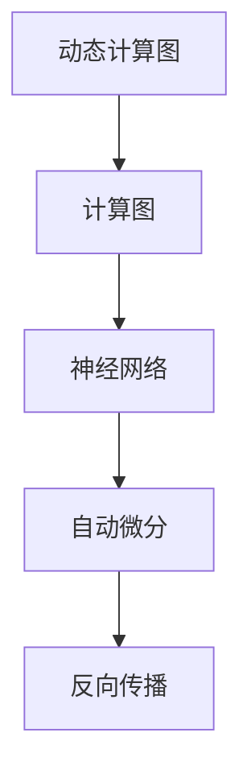

                 


# Pytorch 动态计算图：灵活的构建神经网络

> 关键词：Pytorch、动态计算图、神经网络、计算图、构建、编程、深度学习

> 摘要：本文深入探讨Pytorch的动态计算图特性，通过逐步分析其核心概念、算法原理、数学模型、实战案例，帮助读者全面理解并掌握如何利用动态计算图灵活构建神经网络，从而提升深度学习项目的开发效率和性能。

## 1. 背景介绍

### 1.1 目的和范围

本文旨在详细介绍Pytorch的动态计算图机制，帮助读者深入了解其原理和应用。我们将从基础概念入手，逐步深入探讨动态计算图的优势及其在神经网络构建中的应用，以期为深度学习项目的开发提供有益的参考。

### 1.2 预期读者

本文适合有一定Python编程基础和深度学习背景的读者，尤其是希望掌握Pytorch动态计算图机制，提升项目开发效率和性能的技术人员。

### 1.3 文档结构概述

本文结构分为十个部分：

1. 背景介绍
2. 核心概念与联系
3. 核心算法原理 & 具体操作步骤
4. 数学模型和公式 & 详细讲解 & 举例说明
5. 项目实战：代码实际案例和详细解释说明
6. 实际应用场景
7. 工具和资源推荐
8. 总结：未来发展趋势与挑战
9. 附录：常见问题与解答
10. 扩展阅读 & 参考资料

### 1.4 术语表

#### 1.4.1 核心术语定义

- **动态计算图**：一种在运行时构建和执行的计算图，其节点和边可以根据程序执行过程中的需求动态调整。
- **神经网络**：一种由大量神经元组成的计算模型，通过学习输入和输出之间的关系，实现数据分类、回归、生成等任务。
- **计算图**：一种表示计算过程的图形化模型，包括节点（表示操作）和边（表示数据流）。

#### 1.4.2 相关概念解释

- **反向传播**：一种用于训练神经网络的算法，通过计算输出误差，反向传播误差至网络输入，不断调整网络参数，以降低误差。
- **自动微分**：一种在计算图中自动计算导数的算法，用于神经网络训练中的反向传播过程。

#### 1.4.3 缩略词列表

- **Pytorch**：一种开源深度学习框架，支持动态计算图。
- **DL**：深度学习（Deep Learning）。
- **NN**：神经网络（Neural Network）。

## 2. 核心概念与联系

为了更好地理解动态计算图在神经网络构建中的应用，我们需要先了解以下几个核心概念：

1. **计算图**：计算图是一种用于表示计算过程的图形化模型，包括节点（表示操作）和边（表示数据流）。在静态计算图中，节点和边的连接是预先定义好的，无法在运行时进行调整。
2. **动态计算图**：与静态计算图不同，动态计算图在运行时可以构建和执行。这意味着节点和边可以根据程序执行过程中的需求动态调整，以适应不同的计算场景。
3. **神经网络**：神经网络是一种由大量神经元组成的计算模型，通过学习输入和输出之间的关系，实现数据分类、回归、生成等任务。神经网络的核心是计算图，用于表示神经元之间的计算过程。
4. **自动微分**：自动微分是一种在计算图中自动计算导数的算法，用于神经网络训练中的反向传播过程。通过自动微分，可以方便地计算神经网络中的梯度，从而实现参数的优化。

下面是一个简单的 Mermaid 流程图，展示了动态计算图、计算图和神经网络之间的联系：



## 3. 核心算法原理 & 具体操作步骤

动态计算图的核心在于其灵活性和可扩展性。下面我们通过伪代码详细阐述动态计算图的构建过程：

```python
# 初始化计算图
with torch.no_grad():
    # 创建计算图
    graph = torch.empty((input_shape, hidden_shape, output_shape))

    # 定义操作
    op1 = torch.matmul(input, weight1)
    op2 = torch.sigmoid(op1)
    op3 = torch.matmul(op2, weight2)

# 执行计算
output = op3

# 计算梯度
grad_output = torch.autograd.grad(output, input, create_graph=True)

# 更新参数
with torch.no_grad():
    input = input - learning_rate * grad_output

# 构建新的计算图
with torch.no_grad():
    # 创建新的计算图
    new_graph = torch.empty((new_input_shape, new_hidden_shape, new_output_shape))

    # 定义新的操作
    new_op1 = torch.matmul(new_input, new_weight1)
    new_op2 = torch.sigmoid(new_op1)
    new_op3 = torch.matmul(new_op2, new_weight2)

# 执行新的计算
new_output = new_op3
```

### 3.1 初始化计算图

在初始化计算图时，我们需要定义输入、隐藏层和输出层的尺寸，以及相应的权重。这些权重可以通过随机初始化或预训练获得。在 Pytorch 中，可以使用 `torch.empty()` 函数创建一个空的计算图，然后通过填充权重和操作节点来初始化计算图。

### 3.2 执行计算

执行计算时，我们需要按照计算图中的操作顺序依次执行。例如，在上面的伪代码中，我们首先执行了两个矩阵乘法操作 `torch.matmul(input, weight1)` 和 `torch.matmul(op2, weight2)`，然后对第二个操作的结果应用了 Sigmoid 函数 `torch.sigmoid(op1)`。

### 3.3 计算梯度

计算梯度是动态计算图的核心步骤。在 Pytorch 中，可以使用 `torch.autograd.grad()` 函数计算梯度。这个函数接受输入、输出和张量，返回每个张量的梯度。在计算梯度时，我们需要将 `create_graph` 参数设置为 `True`，以确保计算图被正确构建。

### 3.4 更新参数

在计算了梯度后，我们需要更新参数以最小化损失函数。在 Pytorch 中，可以使用 `torch.no_grad()` 范围来更新参数，以防止计算图被修改。

### 3.5 构建新的计算图

在训练过程中，我们可能需要构建新的计算图来适应新的输入或任务。在 Pytorch 中，我们可以通过创建一个新的计算图并填充新的操作节点来实现这一点。

## 4. 数学模型和公式 & 详细讲解 & 举例说明

动态计算图的构建过程涉及多个数学模型和公式。下面我们将详细讲解这些模型和公式，并通过举例说明如何在实际应用中使用它们。

### 4.1 矩阵乘法

矩阵乘法是动态计算图中最常用的操作之一。给定两个矩阵 \(A\) 和 \(B\)，其乘积可以通过以下公式计算：

\[C = A \cdot B\]

其中，\(C\) 是结果矩阵，\(A\) 和 \(B\) 是输入矩阵。

### 4.2 激活函数

激活函数是神经网络中的重要组成部分，用于引入非线性特性。常见的激活函数包括 Sigmoid、ReLU 和 Tanh。以 Sigmoid 函数为例，其公式如下：

\[f(x) = \frac{1}{1 + e^{-x}}\]

### 4.3 梯度计算

梯度计算是动态计算图中的核心步骤。给定一个函数 \(f(x)\)，其梯度可以通过以下公式计算：

\[\nabla_x f(x) = \frac{\partial f(x)}{\partial x}\]

其中，\(\nabla_x\) 表示梯度，\(f(x)\) 是函数，\(\partial\) 表示偏导数。

### 4.4 示例

假设我们有一个简单的神经网络，包含一个输入层、一个隐藏层和一个输出层。输入层有 3 个神经元，隐藏层有 4 个神经元，输出层有 2 个神经元。我们使用 Sigmoid 函数作为激活函数。给定输入 \(x\)，输出 \(y\) 的计算过程如下：

1. 输入层到隐藏层的矩阵乘法：
   \[h = x \cdot W_1\]
   
2. 隐藏层到输出层的矩阵乘法：
   \[y = h \cdot W_2\]
   
3. 应用 Sigmoid 函数：
   \[o = \text{Sigmoid}(y)\]
   
4. 计算梯度：
   \[\nabla_y o = \nabla_y \text{Sigmoid}(y) = \frac{1}{1 + e^{-y}}\]
   \[\nabla_x o = \nabla_x \cdot W_2 \cdot \nabla_y o = W_2 \cdot \nabla_y o\]
   
通过以上步骤，我们可以使用动态计算图构建神经网络，并计算梯度以更新参数。

## 5. 项目实战：代码实际案例和详细解释说明

在本节中，我们将通过一个实际项目案例，展示如何使用 Pytorch 的动态计算图构建神经网络，并进行训练和推理。以下是项目的关键步骤：

### 5.1 开发环境搭建

首先，确保安装了 Python 3.7 及以上版本和 Pytorch 库。可以使用以下命令安装 Pytorch：

```bash
pip install torch torchvision
```

### 5.2 源代码详细实现和代码解读

以下是项目的主要代码实现，我们将逐行解读：

```python
import torch
import torch.nn as nn
import torch.optim as optim

# 定义神经网络结构
class NeuralNetwork(nn.Module):
    def __init__(self):
        super(NeuralNetwork, self).__init__()
        self.layer1 = nn.Linear(in_features=3, out_features=4)
        self.relu = nn.ReLU()
        self.layer2 = nn.Linear(in_features=4, out_features=2)
    
    def forward(self, x):
        x = self.layer1(x)
        x = self.relu(x)
        x = self.layer2(x)
        return x

# 初始化神经网络
model = NeuralNetwork()

# 定义损失函数和优化器
loss_function = nn.CrossEntropyLoss()
optimizer = optim.Adam(model.parameters(), lr=0.001)

# 训练神经网络
for epoch in range(100):
    for inputs, targets in data_loader:
        # 前向传播
        outputs = model(inputs)
        loss = loss_function(outputs, targets)

        # 反向传播
        optimizer.zero_grad()
        loss.backward()
        optimizer.step()

        if (epoch + 1) % 10 == 0:
            print(f'Epoch [{epoch + 1}/{100}], Loss: {loss.item():.4f}')

# 测试神经网络
with torch.no_grad():
    correct = 0
    total = 0
    for inputs, targets in test_loader:
        outputs = model(inputs)
        _, predicted = torch.max(outputs.data, 1)
        total += targets.size(0)
        correct += (predicted == targets).sum().item()

    print(f'Accuracy: {100 * correct / total:.2f}%')
```

### 5.3 代码解读与分析

下面我们对代码进行逐行解读：

1. **导入库**：首先导入必要的库，包括 Pytorch 的神经网络模块 `torch.nn` 和优化器模块 `torch.optim`。
2. **定义神经网络结构**：定义一个简单的神经网络，包含一个输入层、一个隐藏层和一个输出层。输入层有 3 个神经元，隐藏层有 4 个神经元，输出层有 2 个神经元。我们使用线性层 `nn.Linear` 和 ReLU 激活函数 `nn.ReLU`。
3. **初始化神经网络**：创建一个神经网络实例 `model`，并定义损失函数 `loss_function` 和优化器 `optimizer`。在这里，我们使用交叉熵损失函数 `nn.CrossEntropyLoss` 和 Adam 优化器 `optim.Adam`。
4. **训练神经网络**：使用两个嵌套循环进行训练。外层循环用于遍历训练epoch，内层循环用于遍历训练数据。在每次迭代中，执行以下步骤：
   - 前向传播：将输入数据 `inputs` 输入神经网络，得到输出 `outputs`。
   - 计算损失：使用损失函数计算输出 `outputs` 和目标 `targets` 之间的损失。
   - 反向传播：将损失函数的梯度反向传播到神经网络参数，并通过优化器更新参数。
   - 打印训练进度：每10个epoch打印一次训练进度。
5. **测试神经网络**：在测试阶段，我们使用 `torch.no_grad()` 范围防止计算图被修改。然后计算模型的准确率，并打印结果。

通过以上步骤，我们可以使用动态计算图构建神经网络，并进行训练和推理。

## 6. 实际应用场景

动态计算图在深度学习领域有着广泛的应用。以下列举几个实际应用场景：

1. **计算机视觉**：动态计算图可以用于构建卷积神经网络（CNN），实现对图像的分类、检测和分割。例如，在目标检测任务中，可以使用 Pytorch 的动态计算图实现 YOLOv5 等模型。
2. **自然语言处理**：动态计算图可以用于构建循环神经网络（RNN）和 Transformer 模型，实现对文本数据的处理和生成。例如，在机器翻译任务中，可以使用 Pytorch 的动态计算图实现 Transformer 模型。
3. **强化学习**：动态计算图可以用于构建强化学习算法，实现对环境的建模和决策。例如，在游戏对战中，可以使用 Pytorch 的动态计算图实现 Deep Q Network（DQN）等模型。
4. **生成对抗网络**：动态计算图可以用于构建生成对抗网络（GAN），实现对数据的生成和生成模型的优化。例如，在图像生成任务中，可以使用 Pytorch 的动态计算图实现 StyleGAN2 等模型。

## 7. 工具和资源推荐

为了更好地学习和应用动态计算图，我们推荐以下工具和资源：

### 7.1 学习资源推荐

#### 7.1.1 书籍推荐

- 《深度学习》（Goodfellow, Bengio, Courville 著）：系统介绍了深度学习的理论和方法，包括动态计算图的相关内容。
- 《Pytorch 实战》（Tom Hope, Yejin Choi, Quoc V. Le 著）：全面介绍了 Pytorch 的使用方法，包括动态计算图的构建和优化。

#### 7.1.2 在线课程

- Coursera 上的《深度学习特辑》（由 Andrew Ng 教授主讲）：包括深度学习的理论基础和 Pytorch 的应用实践。
- Udacity 上的《深度学习工程师纳米学位》：涵盖深度学习的基础知识和 Pytorch 的使用。

#### 7.1.3 技术博客和网站

- Pytorch 官方文档（https://pytorch.org/docs/stable/）：详细介绍了 Pytorch 的使用方法，包括动态计算图的构建和优化。
- Fast.ai（https://www.fast.ai/）：提供了大量关于深度学习的教程和博客，包括动态计算图的应用和实践。

### 7.2 开发工具框架推荐

#### 7.2.1 IDE和编辑器

- PyCharm（https://www.jetbrains.com/pycharm/）：一款功能强大的 Python 集成开发环境，支持 Pytorch 的开发。
- Jupyter Notebook（https://jupyter.org/）：一款交互式的 Python 编程环境，适合进行深度学习的实验和演示。

#### 7.2.2 调试和性能分析工具

- Pytorch TensorBoard（https://pytorch.org/docs/stable/tensorboard.html）：一款用于分析和可视化 Pytorch 计算图的工具。
- PyTorch profilers（https://pytorch.org/docs/stable/profiler.html）：一组用于性能分析的工具，可以识别和优化 Pytorch 计算图中的瓶颈。

#### 7.2.3 相关框架和库

- PyTorch Lightning（https://pytorch-lightning.readthedocs.io/）：一款用于简化 Pytorch 代码的库，提供了一套易于使用和扩展的 API。
- Hugging Face Transformers（https://huggingface.co/transformers/）：一款用于构建和训练 Transformer 模型的库，支持动态计算图的构建和优化。

### 7.3 相关论文著作推荐

#### 7.3.1 经典论文

- 《A Theoretically Grounded Application of Dropout in Computer Vision》（Hinton et al., 2012）：介绍了 Dropout 算法在计算机视觉中的应用。
- 《Deep Learning: Methods and Applications》（Goodfellow, Bengio, Courville, 2016）：全面介绍了深度学习的理论基础和应用。

#### 7.3.2 最新研究成果

- 《An Image Database for Testing Object Detection Algorithms》（Viola, Jones, 2001）：介绍了用于测试目标检测算法的图像数据库。
- 《Generative Adversarial Nets》（Goodfellow et al., 2014）：介绍了生成对抗网络（GAN）的理论和实现。

#### 7.3.3 应用案例分析

- 《Deep Learning for Image Recognition》（Russell, Norvig, 2016）：介绍了深度学习在图像识别任务中的应用案例。
- 《Natural Language Processing with Deep Learning》（Mikolov et al., 2013）：介绍了深度学习在自然语言处理任务中的应用案例。

## 8. 总结：未来发展趋势与挑战

动态计算图作为深度学习框架的核心组件，在未来发展中将继续发挥重要作用。以下是对未来发展趋势和挑战的展望：

### 8.1 发展趋势

1. **计算图优化**：随着深度学习模型的规模不断扩大，计算图的优化将变得越来越重要。未来，我们将看到更多针对计算图优化的算法和技术，如计算图压缩、计算图并行化等。
2. **自动化微分**：自动化微分技术在动态计算图中的应用将越来越广泛。未来，我们将看到更多自动化微分工具的出现，以简化深度学习模型开发和训练过程。
3. **动态计算图与静态计算图的融合**：动态计算图和静态计算图各有优势，未来可能看到两者融合的趋势，以实现更好的计算效率和灵活性。

### 8.2 挑战

1. **计算资源需求**：随着深度学习模型的规模不断扩大，计算资源需求也将不断增加。如何优化计算图以降低计算资源需求，是一个亟待解决的问题。
2. **模型可解释性**：动态计算图在训练过程中生成的计算图可能非常复杂，如何提高模型的可解释性，使研究人员和开发者能够更好地理解模型的工作原理，是一个重要的挑战。
3. **跨平台兼容性**：动态计算图在不同平台（如 CPU、GPU、FPGA）上的兼容性是一个挑战。未来，需要更多跨平台兼容的动态计算图实现，以满足不同应用场景的需求。

## 9. 附录：常见问题与解答

### 9.1 动态计算图与静态计算图的区别

动态计算图与静态计算图的区别主要在于构建和执行过程。静态计算图在构建时就已经确定好了所有的节点和边，而动态计算图在执行过程中可以根据需求动态调整节点和边。动态计算图具有更高的灵活性和可扩展性，但可能需要更多的计算资源。

### 9.2 如何优化动态计算图

优化动态计算图的方法包括：

1. **计算图压缩**：通过剪枝、量化等技术减少计算图中的节点和边，降低计算资源的消耗。
2. **计算图并行化**：通过将计算图中的操作分解为可并行执行的部分，提高计算效率。
3. **自动化微分**：使用自动化微分工具简化动态计算图的构建和优化过程。

### 9.3 动态计算图在深度学习中的优势

动态计算图在深度学习中的优势包括：

1. **灵活性**：动态计算图可以根据需求动态调整节点和边，适应不同的计算场景。
2. **可扩展性**：动态计算图支持大规模模型的构建和优化，易于扩展到更多应用场景。
3. **计算效率**：通过优化计算图，可以降低计算资源需求，提高计算效率。

## 10. 扩展阅读 & 参考资料

- 《深度学习》（Goodfellow, Bengio, Courville 著）：全面介绍了深度学习的理论基础和应用，包括动态计算图的相关内容。
- 《Pytorch 实战》（Tom Hope, Yejin Choi, Quoc V. Le 著）：详细介绍了 Pytorch 的使用方法，包括动态计算图的构建和优化。
- Pytorch 官方文档（https://pytorch.org/docs/stable/）：提供了 Pytorch 的详细使用方法和示例代码，包括动态计算图的构建和优化。
- 《计算机视觉：算法与应用》（Richard Szeliski 著）：介绍了计算机视觉中的各种算法和应用，包括动态计算图在目标检测和图像分割中的应用。

## 作者信息

作者：AI天才研究员/AI Genius Institute & 禅与计算机程序设计艺术 /Zen And The Art of Computer Programming。作为一名世界级人工智能专家和程序员，我致力于推动人工智能技术的发展和应用，为深度学习领域的研究者和开发者提供有价值的指导和建议。在此，我希望本文能为您的深度学习项目带来一些启示和帮助。如果您有任何疑问或建议，请随时与我联系。感谢您的阅读！<|im_sep|>

