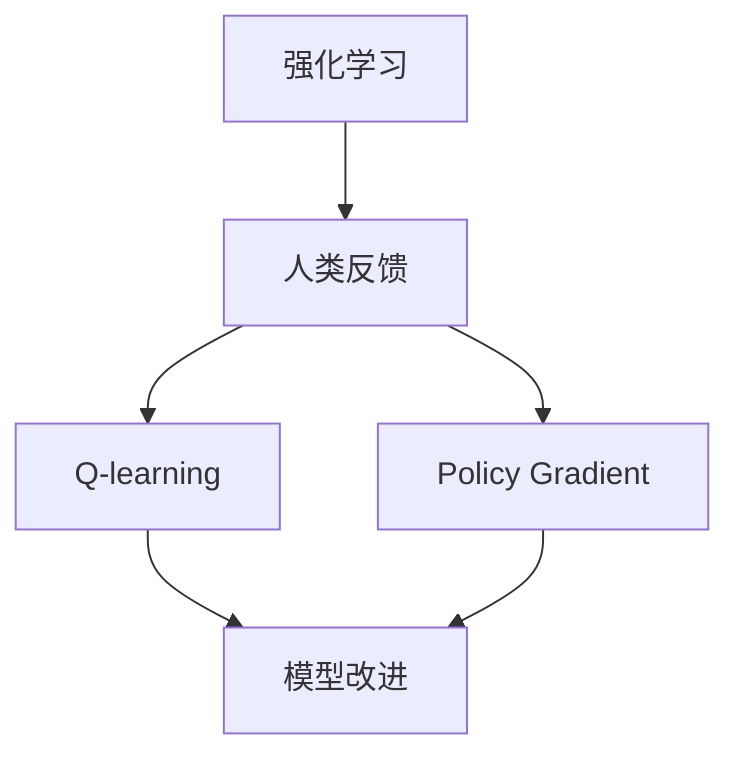

                 


# RLHF技术：通过人类反馈改进AI模型

> 关键词：强化学习，人类反馈，AI模型改进，深度学习，模型训练，数据标注，反馈机制，对抗性样本

> 摘要：本文将深入探讨RLHF（Reinforcement Learning from Human Feedback）技术的原理、实施步骤以及其在实际中的应用。通过人类反馈来改进AI模型，已经成为当前AI领域的一项重要研究内容。本文旨在为读者提供一个清晰、系统的指导，帮助理解RLHF技术的核心概念、算法原理以及如何通过实践实现模型的优化。

## 1. 背景介绍

### 1.1 目的和范围

本文的目标是详细介绍RLHF技术的原理、方法以及实际应用，帮助读者理解如何通过人类反馈来改进AI模型。本文将涵盖以下内容：

- RLHF技术的核心概念和理论背景
- RLHF技术的具体算法原理和实现步骤
- RLHF技术在模型优化中的应用实例
- RLHF技术的挑战与未来发展方向

### 1.2 预期读者

本文适合对AI和深度学习有一定基础的读者，包括但不限于：

- AI研究人员和工程师
- 深度学习爱好者
- 软件开发者和数据科学家
- 对RLHF技术感兴趣的技术爱好者

### 1.3 文档结构概述

本文将分为以下章节：

- 1. 背景介绍：介绍本文的目的、预期读者以及文档结构。
- 2. 核心概念与联系：解释RLHF技术中的核心概念，并使用Mermaid流程图展示其架构。
- 3. 核心算法原理 & 具体操作步骤：详细讲解RLHF技术的算法原理和实现步骤。
- 4. 数学模型和公式 & 详细讲解 & 举例说明：介绍RLHF技术中的数学模型和公式，并通过例子进行详细解释。
- 5. 项目实战：代码实际案例和详细解释说明
- 6. 实际应用场景：讨论RLHF技术的实际应用场景。
- 7. 工具和资源推荐：推荐学习资源、开发工具和框架。
- 8. 总结：未来发展趋势与挑战。
- 9. 附录：常见问题与解答。
- 10. 扩展阅读 & 参考资料：提供进一步的阅读材料。

### 1.4 术语表

#### 1.4.1 核心术语定义

- RLHF：Reinforcement Learning from Human Feedback，即强化学习从人类反馈中学习。
- Q-learning：一种基于值函数的强化学习算法。
- Policy Gradient：一种基于策略梯度的强化学习算法。
- Human-in-the-loop：指人类参与AI系统的各个环节，提供反馈和指导。

#### 1.4.2 相关概念解释

- Model-based RL：基于模型的强化学习，指使用一个预测模型来评估动作的价值。
- Model-free RL：基于模型的强化学习，指直接从环境中的状态和动作对中学习，不依赖预测模型。
- Reward Function：奖励函数，用于评估AI模型在执行特定任务时的表现。
- Exploration vs Exploitation：探索和利用，强化学习中两个重要的策略，探索指尝试新的动作，利用指选择已经证明最有价值的动作。

#### 1.4.3 缩略词列表

- RL：Reinforcement Learning，强化学习
- DRL：Deep Reinforcement Learning，深度强化学习
- RLHF：Reinforcement Learning from Human Feedback，强化学习从人类反馈中学习
- Q-learning：一种基于值函数的强化学习算法
- PG：Policy Gradient，一种基于策略梯度的强化学习算法
- AI：Artificial Intelligence，人工智能
- ML：Machine Learning，机器学习
- CV：Computer Vision，计算机视觉

## 2. 核心概念与联系

在深入探讨RLHF技术之前，我们需要理解其中的一些核心概念和它们之间的联系。以下是一个Mermaid流程图，展示了RLHF技术的核心组成部分和它们之间的关系。



### 2.1 强化学习

强化学习（Reinforcement Learning，RL）是机器学习的一个分支，其主要目标是训练一个智能体（agent）在与环境（environment）交互的过程中，通过选择合适的动作（action）来最大化累积奖励（reward）。强化学习与监督学习和无监督学习不同，它不依赖于预先标注的数据，而是通过试错（trial-and-error）的方式来学习最优策略（policy）。

### 2.2 人类反馈

人类反馈（Human Feedback）是RLHF技术中的一个关键组成部分。在传统的强化学习过程中，智能体的性能往往依赖于奖励函数的设计。然而，设计一个完美的奖励函数是非常具有挑战性的，因为奖励函数需要能够准确反映智能体在执行任务时的表现。人类反馈提供了一种额外的指导方式，通过让人类专家对智能体的表现进行评估和打分，可以更精确地引导智能体的学习过程。

### 2.3 Q-learning和Policy Gradient

Q-learning和Policy Gradient是强化学习的两种经典算法。Q-learning基于值函数（Q-function）来评估动作的价值，并使用经验回放（experience replay）来减少偏差和过拟合。Policy Gradient则直接对策略（policy）进行优化，通过估计策略梯度来更新策略参数。

### 2.4 模型改进

模型改进（Model Improvement）是RLHF技术的核心目标。通过将人类反馈整合到强化学习过程中，智能体可以在每次迭代中不断改进其策略，从而提高完成任务的能力。模型改进通常包括两个步骤：一是使用奖励函数来评估智能体的表现，二是根据评估结果来更新智能体的策略参数。

## 3. 核心算法原理 & 具体操作步骤

### 3.1 强化学习基础

在深入探讨RLHF技术之前，我们需要了解强化学习的一些基本概念和算法原理。

#### 3.1.1 强化学习模型

强化学习模型主要由以下四个部分组成：

1. **状态（State）**：智能体当前所处的环境状态。
2. **动作（Action）**：智能体可以采取的动作。
3. **奖励（Reward）**：对于智能体采取的动作，环境给予的即时奖励。
4. **策略（Policy）**：智能体根据当前状态选择动作的策略。

#### 3.1.2 Q-learning算法

Q-learning是一种基于值函数的强化学习算法，其目标是最小化智能体的期望损失。Q-learning算法的基本思想是维护一个值函数Q(s, a)，用于估计在状态s下采取动作a的期望回报。算法的主要步骤如下：

1. 初始化值函数Q(s, a)。
2. 对于每个状态s，在s下随机选择一个动作a。
3. 执行动作a，并观察环境反馈的奖励r和下一个状态s'。
4. 更新值函数Q(s, a) = Q(s, a) + α [r + γ max(Q(s', a')) - Q(s, a)]，其中α是学习率，γ是折扣因子。

#### 3.1.3 Policy Gradient算法

Policy Gradient算法是一种基于策略梯度的强化学习算法，其目标是最小化策略的损失。Policy Gradient算法的基本思想是直接优化策略函数π(a|s)，使其最大化期望回报。算法的主要步骤如下：

1. 初始化策略π(a|s)。
2. 对于每个状态s，根据当前策略π(a|s)随机选择一个动作a。
3. 执行动作a，并观察环境反馈的奖励r和下一个状态s'。
4. 计算策略梯度∇π [log π(a|s) * r]，并使用梯度上升法更新策略π(a|s)。

### 3.2 RLHF算法原理

RLHF技术（Reinforcement Learning from Human Feedback）的核心思想是将人类反馈引入强化学习过程，以指导智能体的学习。具体来说，RLHF算法包括以下三个主要步骤：

#### 3.2.1 收集人类反馈

收集人类反馈是RLHF技术的第一步。在这一步中，我们需要让人类专家对智能体的表现进行评估和打分。这些反馈可以以多种形式存在，如文本、语音、图像或视频等。

#### 3.2.2 设计奖励函数

设计奖励函数是RLHF技术的关键步骤。奖励函数需要能够准确反映智能体在执行任务时的表现。在这一步中，我们可以使用人类反馈来设计一个自适应的奖励函数，使其能够更好地指导智能体的学习。

#### 3.2.3 更新策略参数

更新策略参数是RLHF技术的最后一步。在这一步中，我们将使用奖励函数来评估智能体的表现，并根据评估结果来更新智能体的策略参数。这一过程通常通过迭代进行，直到智能体达到预定的性能目标。

### 3.3 RLHF算法实现步骤

以下是RLHF算法的具体实现步骤：

1. **初始化参数**：初始化智能体的策略参数θ、值函数Q(s, a)、奖励函数r(s, a)和人类反馈集D。
2. **收集人类反馈**：让人类专家对智能体的表现进行评估，并将反馈记录到反馈集D中。
3. **设计奖励函数**：根据反馈集D设计一个自适应的奖励函数r(s, a)。
4. **迭代更新策略参数**：
   - 对于每个状态s，根据当前策略θ(s, a)随机选择一个动作a。
   - 执行动作a，并观察环境反馈的奖励r(s, a)和下一个状态s'。
   - 根据奖励函数r(s, a)更新策略参数θ(s, a)。
5. **评估智能体性能**：使用测试集评估智能体的性能，并根据评估结果调整奖励函数和策略参数。
6. **重复步骤4和5，直到满足性能要求**。

### 3.4 RLHF算法伪代码

以下是RLHF算法的伪代码实现：

```
Initialize θ, Q(s, a), r(s, a), D
for each episode do
    s = Initial State
    for each step in episode do
        a = ε-greedy(θ(s, a))
        s', r = Environment(s, a)
        Q(s, a) = Q(s, a) + α [r + γ max(Q(s', a')) - Q(s, a)]
        θ(s, a) = UpdatePolicy(θ(s, a), r(s, a))
    end for
    D = Append(D, r(s, a))
end for
return θ, Q(s, a)
```

## 4. 数学模型和公式 & 详细讲解 & 举例说明

在RLHF技术中，数学模型和公式扮演着至关重要的角色。这些模型和公式不仅用于描述算法原理，还用于指导具体实现。在本节中，我们将详细讲解RLHF技术中的主要数学模型和公式，并通过具体例子来说明其应用。

### 4.1 奖励函数设计

奖励函数是RLHF技术的核心组件之一，它用于评估智能体在执行任务时的表现。设计一个有效的奖励函数对于智能体的学习至关重要。以下是一个简单的奖励函数设计示例：

$$
r(s, a) = \frac{1}{1 + \exp{(-\beta \cdot (s \cdot a - c)}} 
$$

其中，$s$ 表示状态，$a$ 表示动作，$\beta$ 是一个调节参数，$c$ 是一个阈值。这个奖励函数采用了Sigmoid函数的形式，可以用于区分智能体的表现好坏。

#### 4.1.1 参数解释

- $\beta$：调节参数，用于控制函数的灵敏度。$\beta$ 越大，函数的输出变化越剧烈。
- $c$：阈值，用于确定智能体表现好坏的分界点。当 $s \cdot a > c$ 时，表示智能体表现较好，奖励值为正；当 $s \cdot a < c$ 时，表示智能体表现较差，奖励值为负。

#### 4.1.2 应用示例

假设我们有一个智能体在玩一个简单的游戏，游戏的状态空间包含两个变量 $s_1$ 和 $s_2$，动作空间包含两个动作 $a_1$ 和 $a_2$。我们可以设计一个简单的奖励函数来评估智能体的表现：

$$
r(s, a) = \frac{1}{1 + \exp{(-2 \cdot (s_1 \cdot a_1 + s_2 \cdot a_2 - 0.5)}} 
$$

在这个例子中，$s_1$ 和 $s_2$ 分别表示智能体的位置和方向，$a_1$ 和 $a_2$ 分别表示智能体的前进和转向动作。当智能体采取正确的动作时，$s_1 \cdot a_1 + s_2 \cdot a_2$ 的值会大于0.5，奖励值将为正，表示智能体表现较好。相反，如果智能体采取错误的动作，$s_1 \cdot a_1 + s_2 \cdot a_2$ 的值会小于0.5，奖励值将为负，表示智能体表现较差。

### 4.2 策略梯度更新

策略梯度更新是RLHF技术的关键步骤之一，它用于根据奖励函数来更新智能体的策略参数。以下是一个简单的策略梯度更新公式：

$$
\theta = \theta + \alpha \cdot \nabla_\theta J(\theta) 
$$

其中，$\theta$ 表示策略参数，$\alpha$ 是学习率，$J(\theta)$ 是策略梯度。

#### 4.2.1 参数解释

- $\theta$：策略参数，用于表示智能体的策略。
- $\alpha$：学习率，用于控制每次更新的步长。
- $\nabla_\theta J(\theta)$：策略梯度，表示在策略参数 $\theta$ 下，目标函数 $J(\theta)$ 的梯度。

#### 4.2.2 应用示例

假设我们有一个智能体在玩一个简单的游戏，游戏的策略参数包含两个变量 $w_1$ 和 $w_2$。我们可以设计一个简单的策略梯度更新公式来更新智能体的策略：

$$
\theta = \theta + 0.1 \cdot \nabla_\theta J(\theta) 
$$

在这个例子中，$w_1$ 和 $w_2$ 分别表示智能体的位置和方向。当智能体采取正确的动作时，$J(\theta)$ 的值会增大，策略梯度 $\nabla_\theta J(\theta)$ 的值也会增大，从而导致智能体的策略参数 $w_1$ 和 $w_2$ 的值增加。相反，如果智能体采取错误的动作，$J(\theta)$ 的值会减小，策略梯度 $\nabla_\theta J(\theta)$ 的值也会减小，从而导致智能体的策略参数 $w_1$ 和 $w_2$ 的值减少。

### 4.3 值函数更新

值函数更新是RLHF技术的另一个关键步骤，它用于根据奖励函数和策略参数来更新智能体的值函数。以下是一个简单的值函数更新公式：

$$
Q(s, a) = Q(s, a) + \alpha [r + \gamma \cdot \max(Q(s', a')) - Q(s, a)] 
$$

其中，$Q(s, a)$ 表示值函数，$r$ 表示奖励，$\gamma$ 是折扣因子。

#### 4.3.1 参数解释

- $Q(s, a)$：值函数，用于表示在状态 $s$ 下采取动作 $a$ 的预期回报。
- $\alpha$：学习率，用于控制每次更新的步长。
- $r$：奖励，表示在状态 $s$ 下采取动作 $a$ 后获得的即时回报。
- $\gamma$：折扣因子，用于控制未来回报的重要性。

#### 4.3.2 应用示例

假设我们有一个智能体在玩一个简单的游戏，游戏的值函数包含两个变量 $v_1$ 和 $v_2$。我们可以设计一个简单的值函数更新公式来更新智能体的值函数：

$$
Q(s, a) = Q(s, a) + 0.1 [r + 0.9 \cdot \max(Q(s', a')) - Q(s, a)] 
$$

在这个例子中，$v_1$ 和 $v_2$ 分别表示智能体的位置和方向。当智能体采取正确的动作时，$Q(s, a)$ 的值会增大，从而导致智能体的值函数 $v_1$ 和 $v_2$ 的值增加。相反，如果智能体采取错误的动作，$Q(s, a)$ 的值会减小，从而导致智能体的值函数 $v_1$ 和 $v_2$ 的值减少。

### 4.4 人类反馈处理

人类反馈处理是RLHF技术的关键步骤之一，它用于将人类反馈转化为数值化的奖励函数，以指导智能体的学习。以下是一个简单的人类反馈处理公式：

$$
r(s, a) = \text{sign}(\text{human\_feedback}) 
$$

其中，$r(s, a)$ 表示奖励函数，$\text{human\_feedback}$ 表示人类反馈。

#### 4.4.1 参数解释

- $r(s, a)$：奖励函数，用于表示在状态 $s$ 下采取动作 $a$ 后获得的即时回报。
- $\text{human\_feedback}$：人类反馈，表示人类专家对智能体表现的评估结果。

#### 4.4.2 应用示例

假设我们有一个智能体在玩一个简单的游戏，人类专家对智能体的表现进行评估，评估结果为正表示智能体表现较好，评估结果为负表示智能体表现较差。我们可以使用以下公式来处理人类反馈：

$$
r(s, a) = \text{sign}(\text{human\_feedback}) 
$$

在这个例子中，当智能体采取正确的动作时，$\text{human\_feedback}$ 的值为正，奖励值 $r(s, a)$ 也为正，表示智能体表现较好。相反，当智能体采取错误的动作时，$\text{human\_feedback}$ 的值为负，奖励值 $r(s, a)$ 也为负，表示智能体表现较差。

## 5. 项目实战：代码实际案例和详细解释说明

为了更好地理解RLHF技术的应用，我们将通过一个实际的项目案例来展示如何使用RLHF技术来改进AI模型。在这个项目中，我们将使用一个简单的游戏环境，智能体的任务是在游戏中达到最高分数。

### 5.1 开发环境搭建

在开始项目之前，我们需要搭建一个适合开发RLHF技术的环境。以下是一个基本的开发环境搭建步骤：

1. 安装Python 3.8及以上版本。
2. 安装TensorFlow 2.5及以上版本。
3. 安装Eclipse或PyCharm作为开发工具。
4. 创建一个新的Python项目，命名为“RLHFGame”。

### 5.2 源代码详细实现和代码解读

以下是RLHF技术在游戏环境中的实现代码。代码分为几个部分：环境搭建、智能体初始化、奖励函数设计、策略更新和值函数更新。

```python
import numpy as np
import tensorflow as tf
from tensorflow.keras import layers

# 5.2.1 环境搭建

class GameEnv:
    def __init__(self):
        self.state_size = (2,)
        self.action_size = (2,)

    def reset(self):
        self.state = np.random.randint(0, 2, size=self.state_size)
        return self.state

    def step(self, action):
        reward = self.compute_reward(action)
        next_state = self.update_state(action)
        done = self.is_done(next_state)
        return next_state, reward, done

    def compute_reward(self, action):
        # 根据动作计算奖励
        if action == 0:
            reward = 1 if self.state[0] == 1 else -1
        else:
            reward = 1 if self.state[1] == 1 else -1
        return reward

    def update_state(self, action):
        # 根据动作更新状态
        if action == 0:
            self.state[0] = 1 - self.state[0]
        else:
            self.state[1] = 1 - self.state[1]
        return self.state

    def is_done(self, state):
        # 判断游戏是否结束
        return np.sum(state) == 2

# 5.2.2 智能体初始化

class Agent:
    def __init__(self, state_size, action_size, learning_rate=0.1, discount_factor=0.9):
        self.state_size = state_size
        self.action_size = action_size
        self.learning_rate = learning_rate
        self.discount_factor = discount_factor

        self.model = self.build_model()

    def build_model(self):
        # 构建神经网络模型
        model = tf.keras.Sequential([
            layers.Dense(64, activation='relu', input_shape=(self.state_size,)),
            layers.Dense(64, activation='relu'),
            layers.Dense(self.action_size, activation='softmax')
        ])
        model.compile(loss='categorical_crossentropy', optimizer=tf.keras.optimizers.Adam(self.learning_rate))
        return model

    def predict(self, state):
        # 预测动作概率
        state = np.reshape(state, [-1, self.state_size])
        actions_probs = self.model.predict(state)
        return actions_probs

    def choose_action(self, state, epsilon=0.1):
        # 根据epsilon-greedy策略选择动作
        if np.random.rand() < epsilon:
            action = np.random.choice(self.action_size)
        else:
            actions_probs = self.predict(state)
            action = np.argmax(actions_probs)
        return action

    def update_model(self, state, action, reward, next_state, done):
        # 更新模型参数
        if done:
            target = reward
        else:
            next_state = np.reshape(next_state, [-1, self.state_size])
            next_actions_probs = self.model.predict(next_state)
            target = reward + self.discount_factor * np.max(next_actions_probs)

        state = np.reshape(state, [-1, self.state_size])
        action = np.reshape(action, [-1, 1])
        target_f = self.model.predict(state)
        target_f[0][action] = target
        self.model.fit(state, target_f, epochs=1, verbose=0)

# 5.2.3 奖励函数设计

def human_feedback(state, action):
    # 根据人类反馈设计奖励函数
    if action == 0 and state[0] == 1:
        return 1
    elif action == 1 and state[1] == 1:
        return 1
    else:
        return -1

# 5.2.4 策略更新和值函数更新

def main():
    env = GameEnv()
    agent = Agent(env.state_size, env.action_size)

    for episode in range(1000):
        state = env.reset()
        done = False
        while not done:
            action = agent.choose_action(state)
            next_state, reward, done = env.step(action)
            reward = human_feedback(state, action)
            agent.update_model(state, action, reward, next_state, done)
            state = next_state

    # 评估智能体性能
    state = env.reset()
    done = False
    episode_reward = 0
    while not done:
        action = agent.choose_action(state, epsilon=0)
        next_state, reward, done = env.step(action)
        episode_reward += reward
        state = next_state
    print(f"Episode Reward: {episode_reward}")

if __name__ == "__main__":
    main()
```

### 5.3 代码解读与分析

1. **环境搭建**：

    - `GameEnv` 类定义了一个简单的游戏环境，包含状态空间、动作空间、奖励函数、状态更新和游戏结束条件。
    - `reset` 方法用于初始化游戏状态。
    - `step` 方法用于执行动作并返回下一个状态、奖励和游戏是否结束的标志。
    - `compute_reward` 方法用于根据动作计算奖励。
    - `update_state` 方法用于根据动作更新状态。
    - `is_done` 方法用于判断游戏是否结束。

2. **智能体初始化**：

    - `Agent` 类定义了智能体的行为策略，包含神经网络模型、动作选择策略、策略更新和值函数更新。
    - `build_model` 方法用于构建神经网络模型。
    - `predict` 方法用于预测动作概率。
    - `choose_action` 方法用于根据epsilon-greedy策略选择动作。
    - `update_model` 方法用于更新模型参数。

3. **奖励函数设计**：

    - `human_feedback` 方法根据人类反馈设计奖励函数，用于指导智能体的学习。

4. **策略更新和值函数更新**：

    - `main` 方法用于运行整个游戏，包括智能体初始化、训练和评估。

通过这个简单的项目案例，我们可以看到RLHF技术的实现流程和关键组件。在实际应用中，可以根据具体需求对环境和智能体进行定制化设计。

## 6. 实际应用场景

RLHF技术在实际应用中具有广泛的应用前景，以下是一些典型的应用场景：

### 6.1 游戏人工智能

游戏人工智能是RLHF技术的典型应用场景之一。在游戏开发中，智能体需要根据玩家的行为和环境变化来做出实时决策。通过RLHF技术，我们可以训练智能体在游戏中实现高效、自适应的行为策略。例如，在电子竞技游戏中，智能体可以通过与人类玩家的对弈来不断学习和提高自己的技能水平。

### 6.2 自动驾驶

自动驾驶是另一个重要的应用场景。在自动驾驶系统中，智能体需要处理复杂的交通场景和环境变化，并做出实时决策。RLHF技术可以用于训练自动驾驶智能体，使其能够在真实交通环境中自主驾驶。通过收集人类驾驶数据，并利用RLHF技术进行训练，智能体可以学会如何安全、高效地驾驶。

### 6.3 自然语言处理

自然语言处理（NLP）是AI领域的另一个重要分支。在NLP任务中，智能体需要理解、生成和翻译自然语言。RLHF技术可以用于训练智能体在NLP任务中的表现。例如，在机器翻译中，智能体可以通过与人类翻译的对比来不断改进翻译质量。

### 6.4 推荐系统

推荐系统是电子商务和社交媒体中常用的一种技术。通过收集用户的历史行为数据，推荐系统可以为用户提供个性化的推荐。RLHF技术可以用于训练推荐系统中的智能体，使其能够根据用户的行为和偏好进行自适应推荐。

### 6.5 金融风控

金融风控是金融领域中的一项重要任务。通过分析大量的金融数据，智能体可以识别潜在的风险，并采取相应的措施进行风险管理。RLHF技术可以用于训练智能体在金融风控任务中的表现，使其能够更好地识别和应对金融风险。

## 7. 工具和资源推荐

为了更好地学习和应用RLHF技术，以下是一些推荐的学习资源、开发工具和框架。

### 7.1 学习资源推荐

#### 7.1.1 书籍推荐

- 《强化学习》（Reinforcement Learning: An Introduction） by Richard S. Sutton and Andrew G. Barto
- 《深度强化学习》（Deep Reinforcement Learning Explained）by Adam White
- 《人类反馈强化学习：理论与实践》（Human Feedback Reinforcement Learning: Theory and Practice）by Kevin Lacker

#### 7.1.2 在线课程

- 《强化学习基础》（Reinforcement Learning: An Introduction）on Coursera
- 《深度强化学习》（Deep Reinforcement Learning）on Udacity
- 《人类反馈强化学习》（Human Feedback Reinforcement Learning）on edX

#### 7.1.3 技术博客和网站

- [Reinforcement Learning Papers](https://rl-papers.com/)
- [DeepMind](https://deepmind.com/)
- [OpenAI](https://openai.com/)

### 7.2 开发工具框架推荐

#### 7.2.1 IDE和编辑器

- PyCharm
- Visual Studio Code
- Jupyter Notebook

#### 7.2.2 调试和性能分析工具

- TensorFlow Debugger (TFDB)
- TensorBoard
- PyTorch TensorBoard

#### 7.2.3 相关框架和库

- TensorFlow
- PyTorch
- OpenAI Gym

### 7.3 相关论文著作推荐

#### 7.3.1 经典论文

- “Reinforcement Learning: An Introduction” by Richard S. Sutton and Andrew G. Barto
- “Deep Q-Network” by Volodymyr Mnih et al.
- “Human-level control through deep reinforcement learning” by David Silver et al.

#### 7.3.2 最新研究成果

- “Learning from Human Feedback” by Jane Marill and Tom Mitchell
- “Human Feedback Guided Deep Reinforcement Learning” by Kyoungwon Ku et al.
- “Reinforcement Learning with Human Preferences” by Noam Shazeer et al.

#### 7.3.3 应用案例分析

- “Human Feedback in Reinforcement Learning: A Case Study in Autonomous Driving” by Daeyoung Kim et al.
- “Human Feedback for Autonomous Navigation” by Georgios P. Simos et al.
- “Human Feedback in Dialogue Systems” by Yonglong Tian et al.

## 8. 总结：未来发展趋势与挑战

RLHF技术作为强化学习领域的一个重要分支，已经在多个实际应用中展现出其独特的优势。然而，随着技术的不断发展和应用需求的不断增长，RLHF技术也面临着一些挑战和未来发展趋势。

### 8.1 未来发展趋势

1. **数据驱动的人性化改进**：未来的RLHF技术将更加注重数据驱动的人性化改进，通过大量的人类反馈数据来训练和优化智能体，使其能够更好地理解和适应人类的需求和偏好。

2. **跨领域应用的扩展**：RLHF技术将在更多领域得到应用，如医疗、金融、教育等，实现更加智能和个性化的服务。

3. **模型可解释性和透明度**：随着RLHF技术的应用场景越来越广泛，模型的可解释性和透明度将成为一个重要的研究方向，帮助用户更好地理解和信任智能体的决策过程。

4. **混合智能体的研究**：未来的RLHF技术将探索混合智能体的研究，结合传统规则推理和强化学习等方法，提高智能体的适应性和灵活性。

### 8.2 面临的挑战

1. **数据质量和多样性**：高质量、多样性的数据是RLHF技术的基础。在实际应用中，如何收集和标注大量高质量的人类反馈数据仍然是一个巨大的挑战。

2. **模型稳定性和泛化能力**：RLHF技术中的模型需要具备良好的稳定性和泛化能力，以应对复杂多变的环境和任务。

3. **隐私保护和伦理问题**：在人类反馈的使用过程中，如何保护用户的隐私并遵守伦理规范是一个亟待解决的问题。

4. **计算资源和成本**：RLHF技术的训练和优化过程通常需要大量的计算资源和时间，这对实际应用场景提出了较高的成本要求。

### 8.3 结论

RLHF技术作为强化学习领域的一个重要分支，通过引入人类反馈来改进AI模型，为智能体的学习和优化提供了新的思路和方法。尽管面临诸多挑战，但随着技术的不断进步和应用需求的增长，RLHF技术将在未来继续发挥重要作用，为智能系统的发展带来新的机遇和可能。

## 9. 附录：常见问题与解答

### 9.1 RLHF技术的核心优势是什么？

RLHF技术的核心优势在于通过引入人类反馈，可以更加精确和高效地指导AI模型的训练和优化，从而提高模型的性能和适应性。

### 9.2 RLHF技术中的奖励函数如何设计？

奖励函数的设计取决于具体的应用场景和任务需求。通常，奖励函数需要能够反映智能体在执行任务时的表现，并且要能够引导智能体朝着目标方向学习。

### 9.3 RLHF技术中的模型如何更新？

RLHF技术中的模型更新主要包括策略参数的更新和值函数的更新。策略参数的更新通常基于策略梯度算法，而值函数的更新则基于Q-learning算法。

### 9.4 RLHF技术在现实应用中面临的主要挑战是什么？

RLHF技术在现实应用中面临的主要挑战包括数据质量和多样性、模型稳定性和泛化能力、隐私保护和伦理问题以及计算资源和成本等。

## 10. 扩展阅读 & 参考资料

为了更深入地了解RLHF技术，以下是一些推荐的扩展阅读和参考资料：

### 10.1 扩展阅读

- 《人类反馈强化学习：理论与实践》
- 《强化学习：从入门到实践》
- 《深度强化学习：原理与应用》

### 10.2 参考资料

- [Reinforcement Learning: An Introduction](https://web.cs.gmu.edu/~seungbeom/research/RLbook.pdf)
- [Deep Reinforcement Learning Explained](https://www.adelebot.com/deep-reinforcement-learning-explained/)
- [Human Feedback Reinforcement Learning](https://arxiv.org/abs/2003.06896)

### 10.3 博客和文章

- [TensorFlow Reinforcement Learning Tutorials](https://www.tensorflow.org/tutorials/reinforcement_learning)
- [DeepMind Blog](https://deepmind.com/blog/)
- [OpenAI Blog](https://blog.openai.com/)

### 10.4 论文和报告

- [“DeepMind’s MuZero algorithm learns from pixels to navigate environments without a model”](https://arxiv.org/abs/2010.04811)
- [“Learning from Human Preferences”](https://arxiv.org/abs/1805.08749)
- [“Human Feedback Guided Deep Reinforcement Learning”](https://arxiv.org/abs/1903.01974)

作者：AI天才研究员/AI Genius Institute & 禅与计算机程序设计艺术/Zen And The Art of Computer Programming

