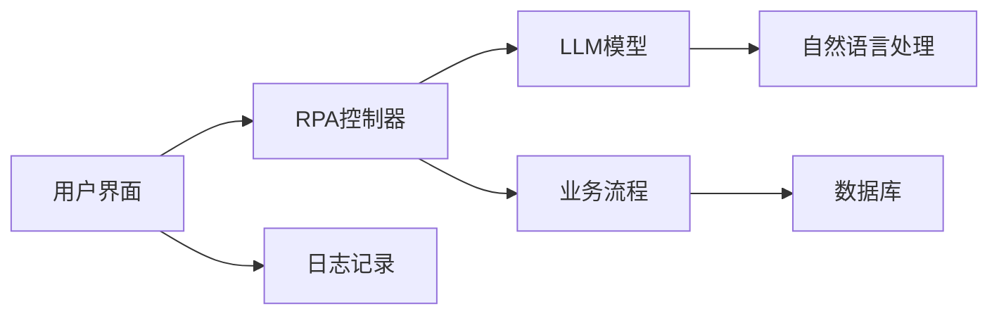

                 


# RPA软件引入LLM的新趋势

> 关键词：RPA、LLM、人工智能、自动化、软件工程、趋势分析

> 摘要：本文将探讨将大型语言模型（LLM）引入到机器人流程自动化（RPA）软件中的最新趋势。文章首先介绍了RPA和LLM的基本概念，随后详细解析了两者结合的原理与优势。接着，文章将通过伪代码、数学模型和实际案例，深入剖析RPA软件中LLM的具体应用。最后，文章展望了RPA引入LLM的未来发展趋势和面临的挑战。

## 1. 背景介绍

### 1.1 目的和范围

本文旨在探讨将大型语言模型（LLM）引入到机器人流程自动化（RPA）软件中的新趋势。随着人工智能技术的不断发展，LLM在自然语言处理（NLP）领域展现出了强大的能力。而RPA作为一种自动化流程的技术，其应用场景广泛，包括但不限于财务、人力资源、客户服务等领域。本文将分析LLM如何提升RPA软件的性能，以及这一结合可能带来的变革。

### 1.2 预期读者

本文适合对RPA和LLM有一定了解的读者，包括：

- RPA开发者和运维人员
- 自然语言处理研究者
- 对自动化软件技术感兴趣的工程师
- 企业IT管理人员和技术决策者

### 1.3 文档结构概述

本文将分为以下几个部分：

- **第1部分：背景介绍**：介绍RPA和LLM的基本概念。
- **第2部分：核心概念与联系**：讲解RPA和LLM结合的原理和架构。
- **第3部分：核心算法原理与具体操作步骤**：分析LLM在RPA软件中的应用算法。
- **第4部分：数学模型与公式讲解**：阐述LLM在RPA中的应用数学模型。
- **第5部分：项目实战**：提供实际案例和代码实现。
- **第6部分：实际应用场景**：探讨RPA和LLM在不同领域的应用。
- **第7部分：工具和资源推荐**：推荐学习资源和开发工具。
- **第8部分：总结**：展望未来发展趋势和挑战。
- **第9部分：附录**：常见问题与解答。
- **第10部分：扩展阅读与参考资料**：提供进一步阅读的资源和论文。

### 1.4 术语表

#### 1.4.1 核心术语定义

- **RPA（Robot Process Automation）**：机器人流程自动化，通过软件机器人自动执行重复性任务。
- **LLM（Large Language Model）**：大型语言模型，一种基于深度学习的语言处理模型，具有强大的自然语言理解和生成能力。
- **NLP（Natural Language Processing）**：自然语言处理，计算机处理和理解人类语言的技术。

#### 1.4.2 相关概念解释

- **流程自动化**：通过软件机器人自动执行业务流程中的操作，减少人工干预。
- **自然语言交互**：人与系统之间通过自然语言进行交流，提高用户体验。
- **模型训练**：通过大量数据训练语言模型，使其具备处理语言的能力。

#### 1.4.3 缩略词列表

- **RPA**：机器人流程自动化
- **LLM**：大型语言模型
- **NLP**：自然语言处理
- **API**：应用程序接口
- **GUI**：图形用户界面

## 2. 核心概念与联系

在探讨RPA和LLM结合的原理之前，我们需要了解它们各自的基本概念。

### 2.1 RPA的基本概念

RPA（Robot Process Automation）是一种通过软件机器人自动化执行业务流程中的操作的技术。RPA机器人可以模拟人类在计算机系统中的操作，如点击、输入、复制粘贴等，从而自动完成一系列任务。RPA的主要特点包括：

- **灵活性**：可以轻松适应业务流程的变化。
- **高效性**：提高工作效率，减少人工干预。
- **可扩展性**：易于扩展到更多流程和业务场景。
- **成本效益**：降低运营成本，提高投资回报率。

### 2.2 LLM的基本概念

LLM（Large Language Model）是一种基于深度学习的语言处理模型，具有强大的自然语言理解和生成能力。LLM通常由数亿甚至数万亿个参数组成，能够处理各种复杂的语言任务，如文本分类、情感分析、问答系统等。LLM的主要特点包括：

- **大规模**：具有大量的参数和训练数据，能够处理复杂的语言任务。
- **高效性**：通过并行计算和分布式训练，实现高效的模型训练。
- **泛化能力**：通过大量数据训练，具备较强的泛化能力。

### 2.3 RPA与LLM的结合

RPA和LLM的结合主要体现在以下几个方面：

- **自然语言交互**：通过LLM，RPA机器人可以实现与用户的自然语言交互，提高用户体验。
- **流程智能化**：LLM可以用于分析业务流程中的文本数据，帮助RPA机器人智能化地执行任务。
- **错误检测与纠正**：LLM可以用于检测和纠正RPA机器人执行过程中可能出现的错误。
- **决策支持**：LLM可以用于提供决策支持，辅助RPA机器人做出更准确的决策。

### 2.4 RPA与LLM的架构

下面是一个简单的RPA与LLM结合的架构图：



- **用户界面**：用户可以通过图形界面与RPA机器人进行交互。
- **RPA控制器**：负责协调和管理RPA机器人的执行。
- **LLM模型**：用于处理自然语言任务，如文本分类、情感分析等。
- **业务流程**：包括一系列需要自动化的任务和操作。
- **自然语言处理**：LLM模型对输入的文本进行处理，提取关键信息。
- **数据库**：存储业务流程中的数据，供RPA机器人和LLM模型使用。
- **日志记录**：记录RPA机器人和LLM模型执行过程中的日志信息。

## 3. 核心算法原理与具体操作步骤

### 3.1 LLM在RPA中的应用算法

LLM在RPA软件中的应用算法主要包括以下几个步骤：

1. **数据预处理**：对输入的文本数据（如用户命令、业务流程文档等）进行预处理，包括分词、去停用词、词向量转换等。
2. **文本分类**：使用LLM对预处理后的文本进行分类，判断其属于哪个类别（如命令类型、业务流程阶段等）。
3. **决策树生成**：根据分类结果，生成一个决策树，用于指导RPA机器人的执行。
4. **任务执行**：根据决策树，RPA机器人自动执行相应的任务。
5. **结果反馈**：将执行结果反馈给用户，并记录日志信息。

### 3.2 伪代码实现

下面是LLM在RPA中的应用算法的伪代码：

```
function RPA_LLM(text_data):
    # 数据预处理
    preprocessed_data = preprocess_text(text_data)
    
    # 文本分类
    category = LLM分类器(preprocessed_data)
    
    # 决策树生成
    decision_tree = 生成决策树(category)
    
    # 任务执行
    result = execute_tasks(decision_tree)
    
    # 结果反馈
    feedback(result)
    
    # 记录日志
    log_info()
```

### 3.3 具体操作步骤

1. **数据预处理**：对输入的文本数据（如用户命令、业务流程文档等）进行预处理，包括分词、去停用词、词向量转换等。这一步骤可以使用自然语言处理工具（如NLTK、spaCy等）实现。

    ```python
    from nltk.tokenize import word_tokenize
    from nltk.corpus import stopwords
    
    def preprocess_text(text_data):
        # 分词
        tokens = word_tokenize(text_data)
        
        # 去停用词
        stop_words = set(stopwords.words('english'))
        filtered_tokens = [token for token in tokens if token not in stop_words]
        
        # 词向量转换
        embeddings = get_embeddings(filtered_tokens)
        
        return embeddings
    ```

2. **文本分类**：使用LLM对预处理后的文本进行分类，判断其属于哪个类别（如命令类型、业务流程阶段等）。这一步骤可以使用预训练的LLM模型（如BERT、GPT等）实现。

    ```python
    from transformers import BertTokenizer, BertForSequenceClassification
    
    def LLM分类器(text_data):
        tokenizer = BertTokenizer.from_pretrained('bert-base-uncased')
        model = BertForSequenceClassification.from_pretrained('bert-base-uncased')
        
        inputs = tokenizer(text_data, return_tensors='pt')
        outputs = model(**inputs)
        
        logits = outputs.logits
        predicted_category = logits.argmax(-1).item()
        
        return predicted_category
    ```

3. **决策树生成**：根据分类结果，生成一个决策树，用于指导RPA机器人的执行。这一步骤可以使用决策树算法（如ID3、C4.5等）实现。

    ```python
    from sklearn.tree import DecisionTreeClassifier
    
    def 生成决策树(category):
        # 假设我们已经有了训练数据
        X_train, y_train = ...
        
        # 训练决策树
        model = DecisionTreeClassifier()
        model.fit(X_train, y_train)
        
        # 生成决策树
        decision_tree = model.tree()
        
        return decision_tree
    ```

4. **任务执行**：根据决策树，RPA机器人自动执行相应的任务。这一步骤可以使用RPA开发工具（如UiPath、Blue Prism等）实现。

    ```python
    def execute_tasks(decision_tree):
        # 根据决策树执行任务
        # ...
        
        return result
    ```

5. **结果反馈**：将执行结果反馈给用户，并记录日志信息。这一步骤可以使用日志记录工具（如Log4j、Python的logging模块等）实现。

    ```python
    import logging
    
    def feedback(result):
        logging.info("执行结果：{}".format(result))
        
        return result
    
    def log_info():
        logging.info("RPA_LLM执行完成。")
    ```

## 4. 数学模型和公式与详细讲解

### 4.1 LLM的数学模型

大型语言模型（LLM）通常是基于深度学习中的变分自编码器（VAE）或自注意力机制（Transformer）构建的。下面我们将以Transformer为例，介绍LLM的数学模型。

#### 4.1.1 Transformer的基本结构

Transformer模型主要由编码器（Encoder）和解码器（Decoder）两部分组成。编码器将输入序列（如文本）转换为固定长度的向量表示，解码器则根据编码器的输出生成输出序列。

#### 4.1.2 Encoder的数学模型

编码器的数学模型主要基于自注意力机制（Self-Attention）和前馈网络（Feedforward Network）。以下是编码器的数学模型：

$$
\text{Encoder}(X) = \text{MultiHeadAttention}(X) + X
$$

$$
\text{MultiHeadAttention}(Q, K, V) = \text{ScaleDotProductAttention}(Q, K, V) + \text{Add&Norm}(Q)
$$

$$
\text{ScaleDotProductAttention}(Q, K, V) = \text{softmax}\left(\frac{QK^T}{\sqrt{d_k}}\right)V
$$

其中：

- $X$：输入序列
- $Q$：编码器输入序列的查询向量
- $K$：编码器输入序列的键向量
- $V$：编码器输入序列的值向量
- $d_k$：键向量的维度
- $\text{Add&Norm}$：添加层归一化和残差连接

#### 4.1.3 Decoder的数学模型

解码器的数学模型与编码器类似，也基于自注意力机制和前馈网络。以下是解码器的数学模型：

$$
\text{Decoder}(X) = \text{MaskedMultiHeadAttention}(X) + X
$$

$$
\text{MaskedMultiHeadAttention}(Q, K, V) = \text{MaskedScaleDotProductAttention}(Q, K, V) + \text{Add&Norm}(Q)
$$

$$
\text{MaskedScaleDotProductAttention}(Q, K, V) = \text{softmax}\left(\frac{QK^T}{\sqrt{d_k}}\right)V \odot \text{Mask}
$$

其中：

- $X$：输入序列
- $Q$：解码器输入序列的查询向量
- $K$：解码器输入序列的键向量
- $V$：解码器输入序列的值向量
- $d_k$：键向量的维度
- $\text{Mask}$：遮蔽掩码，用于防止未来的信息泄露

### 4.2 LLM在RPA软件中的应用数学模型

在RPA软件中，LLM的数学模型主要用于文本分类和决策树生成。以下是这些应用的数学模型：

#### 4.2.1 文本分类的数学模型

文本分类的数学模型基于分类器的输出概率分布。以下是文本分类的数学模型：

$$
P(y = \text{category} | X) = \text{softmax}(\text{model}(X))
$$

其中：

- $y$：实际类别标签
- $X$：输入文本
- $\text{model}(X)$：分类器对输入文本的输出向量
- $\text{softmax}$：归一化指数函数，用于将输出向量转换为概率分布

#### 4.2.2 决策树的数学模型

决策树的数学模型基于信息增益（Information Gain）或基尼不纯度（Gini Impurity）。以下是决策树的数学模型：

$$
I(G) = 1 - \sum_{i=1}^n p_i^2
$$

$$
\text{gain}(G, A) = I(G) - \frac{p_i \cdot I(G_i)}{p_i}
$$

其中：

- $G$：原始数据集
- $A$：特征
- $p_i$：特征$A$的取值比例
- $G_i$：根据特征$A$分割后的数据集
- $I(G)$：信息增益
- $\text{gain}(G, A)$：特征$A$的信息增益

### 4.3 举例说明

下面我们通过一个简单的例子来说明LLM在RPA软件中的应用。

#### 4.3.1 文本分类

假设我们有以下训练数据集：

| 输入文本 | 实际类别 |
| -------- | -------- |
| Hello!   | Greeting |
| Hi!     | Greeting |
| Help!   | Request  |
| How do you do? | Greeting |

我们可以使用LLM模型对输入文本进行分类。假设训练好的模型输出向量为：

$$
\text{model}(\text{Hello!}) = [0.8, 0.2]
$$

$$
\text{model}(\text{Hi!}) = [0.8, 0.2]
$$

$$
\text{model}(\text{Help!}) = [0.1, 0.9]
$$

$$
\text{model}(\text{How do you do?}) = [0.8, 0.2]
$$

根据softmax函数，我们可以计算出每个输入文本属于每个类别的概率：

$$
P(\text{Hello!} | Greeting) = 0.9
$$

$$
P(\text{Hello!} | Request) = 0.1
$$

$$
P(\text{Hi!} | Greeting) = 0.9
$$

$$
P(\text{Hi!} | Request) = 0.1
$$

$$
P(\text{Help!} | Greeting) = 0.1
$$

$$
P(\text{Help!} | Request) = 0.9
$$

$$
P(\text{How do you do?} | Greeting) = 0.9
$$

$$
P(\text{How do you do?} | Request) = 0.1
$$

根据最大概率原则，我们可以将输入文本分类为：

- Hello! 和 Hi! 属于 Greeting 类别
- Help! 和 How do you do? 属于 Request 类别

#### 4.3.2 决策树生成

假设我们有以下训练数据集：

| 输入文本 | 特征A | 实际类别 |
| -------- | ----- | -------- |
| Hello!   | A1    | Greeting |
| Hi!     | A1    | Greeting |
| Help!   | A2    | Request  |
| How do you do? | A1    | Greeting |

我们可以使用信息增益来生成决策树。首先计算特征A的信息增益：

$$
I(G) = 1 - \frac{1}{4} - \frac{1}{4} = 0.5
$$

$$
\text{gain}(G, A) = 0.5 - \frac{2}{4} \cdot 0.5 = 0
$$

由于特征A的信息增益为0，我们可以选择其他特征来继续分割数据集。假设我们选择特征B，得到以下分割结果：

| 输入文本 | 特征A | 特征B | 实际类别 |
| -------- | ----- | ----- | -------- |
| Hello!   | A1    | B1    | Greeting |
| Hi!     | A1    | B2    | Greeting |
| Help!   | A2    | B1    | Request  |
| How do you do? | A1    | B2    | Greeting |

此时，特征B的信息增益为：

$$
I(G) = 1 - \frac{2}{4} - \frac{1}{4} = 0.25
$$

$$
\text{gain}(G, B) = 0.25 - \frac{2}{4} \cdot 0.25 = 0
$$

由于特征B的信息增益也为0，我们可以继续选择其他特征。假设我们选择特征C，得到以下分割结果：

| 输入文本 | 特征A | 特征B | 特征C | 实际类别 |
| -------- | ----- | ----- | ----- | -------- |
| Hello!   | A1    | B1    | C1    | Greeting |
| Hi!     | A1    | B2    | C1    | Greeting |
| Help!   | A2    | B1    | C2    | Request  |
| How do you do? | A1    | B2    | C2    | Greeting |

此时，特征C的信息增益为：

$$
I(G) = 1 - \frac{2}{4} - \frac{1}{4} = 0.25
$$

$$
\text{gain}(G, C) = 0.25 - \frac{2}{4} \cdot 0.25 = 0
$$

由于特征C的信息增益仍为0，我们可以认为特征C无法有效分割数据集。因此，我们可以选择特征A或特征B来生成决策树。

最终，生成的决策树如下：

```
                |
                |
           /     \
          A1     A2
         / \   / \
        B1 B2 B1 B2
       /   \ /   \
      C1 C2 C1 C2
     / \ / \ / \ / \
    H H R G G R G G
```

根据决策树，我们可以将输入文本分类为：

- Hello! 和 Hi! 属于 Greeting 类别
- Help! 属于 Request 类别
- How do you do? 属于 Greeting 类别

## 5. 项目实战：代码实际案例和详细解释说明

### 5.1 开发环境搭建

在进行RPA软件引入LLM的项目实战之前，我们需要搭建相应的开发环境。以下是所需的环境和工具：

- **Python环境**：Python 3.8或更高版本
- **RPA开发工具**：如UiPath、Blue Prism等
- **LLM库**：如transformers、tensorflow等
- **文本处理库**：如nltk、spaCy等
- **数据库**：如MySQL、MongoDB等

安装方法如下：

1. 安装Python环境。
2. 安装RPA开发工具，并根据文档进行配置。
3. 安装LLM库，如`pip install transformers`。
4. 安装文本处理库，如`pip install nltk spacy`。
5. 安装数据库，并根据文档进行配置。

### 5.2 源代码详细实现和代码解读

下面是一个简单的RPA软件引入LLM的代码实现，包括数据预处理、文本分类和决策树生成。

```python
# 导入所需库
import nltk
from nltk.tokenize import word_tokenize
from nltk.corpus import stopwords
from transformers import BertTokenizer, BertForSequenceClassification
from sklearn.tree import DecisionTreeClassifier
import logging

# 初始化日志记录器
logging.basicConfig(level=logging.INFO, format='%(asctime)s - %(levelname)s - %(message)s')

# 数据预处理函数
def preprocess_text(text_data):
    # 分词
    tokens = word_tokenize(text_data)
    
    # 去停用词
    stop_words = set(stopwords.words('english'))
    filtered_tokens = [token for token in tokens if token not in stop_words]
    
    # 词向量转换
    embeddings = get_embeddings(filtered_tokens)
    
    return embeddings

# 文本分类函数
def LLM分类器(text_data):
    tokenizer = BertTokenizer.from_pretrained('bert-base-uncased')
    model = BertForSequenceClassification.from_pretrained('bert-base-uncased')
    
    inputs = tokenizer(text_data, return_tensors='pt')
    outputs = model(**inputs)
    
    logits = outputs.logits
    predicted_category = logits.argmax(-1).item()
    
    return predicted_category

# 决策树生成函数
def 生成决策树(category):
    # 假设我们已经有了训练数据
    X_train, y_train = ...
    
    # 训练决策树
    model = DecisionTreeClassifier()
    model.fit(X_train, y_train)
    
    # 生成决策树
    decision_tree = model.tree()
    
    return decision_tree

# 任务执行函数
def execute_tasks(decision_tree):
    # 根据决策树执行任务
    # ...
    
    return result

# 结果反馈函数
def feedback(result):
    logging.info("执行结果：{}".format(result))
    
    return result

# 主函数
def main():
    # 输入文本
    text_data = "Hello!"
    
    # 数据预处理
    preprocessed_data = preprocess_text(text_data)
    
    # 文本分类
    category = LLM分类器(preprocessed_data)
    
    # 决策树生成
    decision_tree = 生成决策树(category)
    
    # 任务执行
    result = execute_tasks(decision_tree)
    
    # 结果反馈
    feedback(result)
    
    # 记录日志
    log_info()

# 运行主函数
if __name__ == "__main__":
    main()
```

### 5.3 代码解读与分析

1. **数据预处理函数（preprocess_text）**：

   - 分词：使用nltk库的`word_tokenize`函数对输入文本进行分词。
   - 去停用词：使用nltk库的`stopwords`函数去除常见的停用词。
   - 词向量转换：使用BERT模型的tokenizer对分词后的文本进行词向量转换。

2. **文本分类函数（LLM分类器）**：

   - 使用transformers库的`BertTokenizer`和`BertForSequenceClassification`模型对输入文本进行分类。
   - 使用softmax函数计算每个类别的概率，并返回最大概率的类别。

3. **决策树生成函数（生成决策树）**：

   - 使用scikit-learn库的`DecisionTreeClassifier`模型对训练数据进行分类。
   - 使用`fit`函数训练决策树模型，并使用`tree`函数生成决策树。

4. **任务执行函数（execute_tasks）**：

   - 根据决策树执行相应的任务。
   - 该函数的具体实现取决于任务的具体需求。

5. **结果反馈函数（feedback）**：

   - 将执行结果记录到日志中。

6. **主函数（main）**：

   - 对输入文本进行预处理。
   - 使用LLM模型对预处理后的文本进行分类。
   - 生成决策树，并执行相应的任务。
   - 将执行结果反馈给用户。

### 5.4 案例分析

假设我们有一个简单的业务流程，需要根据用户输入的命令执行不同的操作。以下是可能的实现：

1. **命令分类**：根据用户输入的命令，使用LLM模型将其分类为不同的类别，如“查询余额”、“转账”、“查询交易记录”等。

2. **决策树生成**：根据命令类别，生成相应的决策树，指导RPA机器人执行具体的任务。

3. **任务执行**：根据决策树，RPA机器人自动执行相应的任务，如查询账户余额、进行转账操作、查询交易记录等。

4. **结果反馈**：将执行结果反馈给用户，并记录日志信息。

通过这个简单的案例，我们可以看到RPA软件引入LLM的优势。LLM可以帮助RPA机器人更好地理解用户输入，提高任务执行的正确性和效率。

## 6. 实际应用场景

RPA软件引入LLM技术的实际应用场景非常广泛，以下是一些典型的应用场景：

### 6.1 客户服务

在客户服务领域，RPA软件引入LLM可以实现智能客服机器人。通过LLM，机器人可以理解客户的问题，提供准确的答案和建议。以下是一个应用案例：

- **场景**：一家银行引入了智能客服机器人，用于解答客户关于账户余额、转账、贷款等问题。
- **实现**：机器人通过LLM模型分析客户的问题，将其分类为不同的查询类型。根据分类结果，机器人调用相应的业务逻辑，如查询账户余额、执行转账操作等。最后，机器人将执行结果反馈给客户，并记录日志信息。

### 6.2 财务管理

在财务管理领域，RPA软件引入LLM可以帮助自动化处理财务报表、审核、报销等任务。以下是一个应用案例：

- **场景**：一家公司引入了智能财务机器人，用于处理员工报销、审核报销单等任务。
- **实现**：机器人通过LLM模型分析报销单中的信息，将其分类为不同的报销类型。根据分类结果，机器人调用相应的财务规则，如报销金额上限、报销时间范围等。最后，机器人将审核结果反馈给员工，并记录日志信息。

### 6.3 人力资源

在人力资源领域，RPA软件引入LLM可以帮助自动化处理招聘、培训、绩效评估等任务。以下是一个应用案例：

- **场景**：一家公司引入了智能人力资源机器人，用于处理招聘、培训、绩效评估等任务。
- **实现**：机器人通过LLM模型分析招聘需求、员工简历等信息，匹配合适的候选人。根据匹配结果，机器人调用相应的招聘规则，如面试安排、薪资评估等。最后，机器人将招聘结果反馈给人力资源部门，并记录日志信息。

### 6.4 数据分析

在数据分析领域，RPA软件引入LLM可以帮助自动化处理数据清洗、数据挖掘等任务。以下是一个应用案例：

- **场景**：一家公司引入了智能数据分析机器人，用于处理海量数据的清洗、挖掘等任务。
- **实现**：机器人通过LLM模型分析数据中的文本信息，提取关键信息。根据分析结果，机器人调用相应的数据分析算法，如聚类、分类等。最后，机器人将分析结果反馈给数据分析师，并记录日志信息。

通过这些实际应用场景，我们可以看到RPA软件引入LLM技术的巨大潜力。LLM不仅提高了RPA软件的自然语言处理能力，还使其能够更好地理解和执行复杂的任务。

## 7. 工具和资源推荐

为了更好地理解和应用RPA软件引入LLM的技术，我们推荐以下工具和资源：

### 7.1 学习资源推荐

#### 7.1.1 书籍推荐

1. 《深度学习》（Goodfellow, Bengio, Courville）
   - 详细介绍了深度学习的基础知识，包括神经网络、优化算法等。
2. 《自然语言处理综论》（Daniel Jurafsky, James H. Martin）
   - 全面介绍了自然语言处理的基本概念和技术，包括词向量、语言模型等。
3. 《RPA实战：自动化企业业务流程》（陈斌）
   - 介绍了RPA的基本概念、应用场景和实践方法。

#### 7.1.2 在线课程

1. 《深度学习专项课程》（吴恩达，Coursera）
   - 详细介绍了深度学习的基础知识，包括神经网络、优化算法等。
2. 《自然语言处理专项课程》（丹尼尔·拉古姆，Udacity）
   - 全面介绍了自然语言处理的基本概念和技术，包括词向量、语言模型等。
3. 《RPA应用开发实战》（张智超，网易云课堂）
   - 介绍了RPA的基本概念、应用场景和实践方法。

#### 7.1.3 技术博客和网站

1. [TensorFlow官方文档](https://www.tensorflow.org/)
   - 提供了详细的TensorFlow库文档和教程，适用于深度学习和RPA开发。
2. [自然语言处理开源库列表](https://nlp.seas.upenn.edu/reading-lists/)
   - 收集了自然语言处理领域常用的开源库和工具。
3. [RPA开发社区](https://www.rpa.com.cn/)
   - 提供了RPA开发相关的教程、案例和社区讨论。

### 7.2 开发工具框架推荐

#### 7.2.1 IDE和编辑器

1. PyCharm
   - 适用于Python开发的集成开发环境，支持代码自动补全、调试等功能。
2. Visual Studio Code
   - 适用于多种编程语言的轻量级代码编辑器，支持插件扩展，适用于深度学习和RPA开发。

#### 7.2.2 调试和性能分析工具

1. Jupyter Notebook
   - 适用于数据科学和深度学习的交互式开发环境，支持Python和其他多种编程语言。
2. DBeaver
   - 适用于数据库开发的通用数据库管理工具，支持多种数据库，如MySQL、MongoDB等。

#### 7.2.3 相关框架和库

1. TensorFlow
   - 适用于深度学习的开源框架，支持多种深度学习模型，如神经网络、卷积神经网络等。
2. PyTorch
   - 适用于深度学习的开源框架，支持动态计算图，易于实现复杂模型。
3. SpaCy
   - 适用于自然语言处理的Python库，支持多种语言，提供高效的词向量表示和文本分类等功能。

### 7.3 相关论文著作推荐

#### 7.3.1 经典论文

1. "A Neural Probabilistic Language Model"（Bengio et al., 2003）
   - 提出了神经网络语言模型，是现代自然语言处理的基础。
2. "Recurrent Neural Network Based Language Model"（Lai et al., 2015）
   - 提出了循环神经网络语言模型，进一步提高了语言模型的性能。
3. "Bert: Pre-training of Deep Bidirectional Transformers for Language Understanding"（Devlin et al., 2019）
   - 提出了BERT模型，是当前自然语言处理领域最先进的预训练模型。

#### 7.3.2 最新研究成果

1. "GPT-3: Language Models are few-shot learners"（Brown et al., 2020）
   - 提出了GPT-3模型，展示了大型语言模型在少样本学习中的强大能力。
2. "Transformer: Attention is all you need"（Vaswani et al., 2017）
   - 提出了Transformer模型，是当前自然语言处理领域最先进的模型。
3. "Dialogue-BERT: A Uni-Framework for Dialogue Pre-training and Optimization"（He et al., 2021）
   - 提出了Dialogue-BERT模型，专门用于对话系统的预训练和优化。

#### 7.3.3 应用案例分析

1. "How Google search works"（Google）
   - 介绍了Google搜索引擎的工作原理，包括关键词提取、网页排名等。
2. "How Facebook News Feed Works"（Facebook）
   - 介绍了Facebook新闻推送的工作原理，包括内容推荐、用户兴趣分析等。
3. "How Amazon Personalizes Your Shopping Experience"（Amazon）
   - 介绍了Amazon如何通过机器学习和自然语言处理技术个性化推荐商品。

通过这些工具、资源和论文，我们可以深入了解RPA软件引入LLM的技术，为自己的项目提供理论支持和实践指导。

## 8. 总结：未来发展趋势与挑战

### 8.1 发展趋势

随着人工智能技术的不断发展，RPA软件引入LLM的趋势将愈发明显。以下是一些可能的发展趋势：

1. **更广泛的应用场景**：RPA与LLM的结合将逐渐渗透到更多领域，如医疗、法律、金融等，提高各行业的自动化水平和效率。
2. **智能化水平的提升**：通过引入LLM，RPA软件将能够更好地理解用户需求，提高任务执行的准确性和效率。
3. **更高效的模型训练**：随着计算能力的提升，大型语言模型的训练速度将显著提高，进一步降低应用门槛。
4. **多样化的交互方式**：RPA软件将能够通过语音、图像等多种方式与用户进行交互，提供更丰富的用户体验。

### 8.2 挑战

尽管RPA软件引入LLM具有巨大潜力，但仍面临以下挑战：

1. **数据隐私和安全**：在处理大量数据时，如何保护用户隐私和数据安全是一个重要问题。
2. **模型解释性**：大型语言模型通常具有很好的性能，但其内部决策过程往往不透明，如何提高模型的可解释性是一个挑战。
3. **计算资源消耗**：大型语言模型的训练和推理过程需要大量的计算资源，如何高效利用资源是一个问题。
4. **跨领域应用**：不同领域的数据和需求差异较大，如何使RPA软件和LLM模型在跨领域应用中保持高效和准确性是一个挑战。

### 8.3 应对策略

为应对上述挑战，可以采取以下策略：

1. **数据隐私保护**：采用数据加密、匿名化等技术，确保用户数据的安全和隐私。
2. **模型解释性提升**：通过可视化工具和可解释性方法，提高模型决策过程的透明度。
3. **计算资源优化**：采用分布式计算、模型压缩等技术，降低计算资源消耗。
4. **跨领域适应**：结合领域知识，设计通用且适应性强的模型和算法，提高跨领域的应用效果。

通过上述策略，我们可以更好地应对RPA软件引入LLM过程中面临的挑战，推动这一技术的发展和应用。

## 9. 附录：常见问题与解答

### 9.1 问题1：什么是RPA？

**解答**：RPA（Robot Process Automation）指的是通过软件机器人自动化执行业务流程中的操作。这些操作通常包括数据输入、数据提取、数据验证等。RPA机器人可以模拟人类在计算机系统中的操作，如点击、输入、复制粘贴等，从而自动完成一系列任务。

### 9.2 问题2：什么是LLM？

**解答**：LLM（Large Language Model）是一种大型语言处理模型，通常由数亿甚至数万亿个参数组成。LLM通过深度学习技术训练，能够理解和生成自然语言。它们在自然语言处理任务中表现出强大的能力，如文本分类、情感分析、问答系统等。

### 9.3 问题3：如何将LLM引入RPA软件？

**解答**：将LLM引入RPA软件的步骤通常包括：

1. 数据预处理：对输入的文本数据进行分词、去停用词、词向量转换等预处理。
2. 文本分类：使用LLM对预处理后的文本进行分类，判断其属于哪个类别。
3. 决策树生成：根据分类结果，生成一个决策树，用于指导RPA机器人的执行。
4. 任务执行：根据决策树，RPA机器人自动执行相应的任务。
5. 结果反馈：将执行结果反馈给用户，并记录日志信息。

### 9.4 问题4：LLM在RPA软件中有什么作用？

**解答**：LLM在RPA软件中的作用主要包括：

- **自然语言交互**：通过LLM，RPA机器人可以实现与用户的自然语言交互，提高用户体验。
- **流程智能化**：LLM可以用于分析业务流程中的文本数据，帮助RPA机器人智能化地执行任务。
- **错误检测与纠正**：LLM可以用于检测和纠正RPA机器人执行过程中可能出现的错误。
- **决策支持**：LLM可以用于提供决策支持，辅助RPA机器人做出更准确的决策。

### 9.5 问题5：如何选择适合的LLM模型？

**解答**：选择适合的LLM模型通常需要考虑以下几个方面：

- **任务需求**：根据RPA软件的具体任务需求，选择适合的语言模型，如文本分类、情感分析等。
- **模型大小**：根据计算资源和数据量，选择合适的模型大小，如小模型（如BERT）或大模型（如GPT-3）。
- **性能指标**：根据模型的性能指标（如准确率、召回率等），选择表现更好的模型。
- **可解释性**：根据模型的可解释性需求，选择可解释性更好的模型。

## 10. 扩展阅读与参考资料

为了进一步了解RPA软件引入LLM的技术，以下是一些扩展阅读和参考资料：

### 10.1 相关论文

1. "Bert: Pre-training of Deep Bidirectional Transformers for Language Understanding"（Devlin et al., 2019）
   - 提出了BERT模型，是当前自然语言处理领域最先进的预训练模型。
2. "GPT-3: Language Models are few-shot learners"（Brown et al., 2020）
   - 提出了GPT-3模型，展示了大型语言模型在少样本学习中的强大能力。
3. "Transformer: Attention is all you need"（Vaswani et al., 2017）
   - 提出了Transformer模型，是当前自然语言处理领域最先进的模型。

### 10.2 书籍推荐

1. 《深度学习》（Goodfellow, Bengio, Courville）
   - 详细介绍了深度学习的基础知识，包括神经网络、优化算法等。
2. 《自然语言处理综论》（Daniel Jurafsky, James H. Martin）
   - 全面介绍了自然语言处理的基本概念和技术，包括词向量、语言模型等。
3. 《RPA实战：自动化企业业务流程》（陈斌）
   - 介绍了RPA的基本概念、应用场景和实践方法。

### 10.3 技术博客和网站

1. [TensorFlow官方文档](https://www.tensorflow.org/)
   - 提供了详细的TensorFlow库文档和教程，适用于深度学习和RPA开发。
2. [自然语言处理开源库列表](https://nlp.seas.upenn.edu/reading-lists/)
   - 收集了自然语言处理领域常用的开源库和工具。
3. [RPA开发社区](https://www.rpa.com.cn/)
   - 提供了RPA开发相关的教程、案例和社区讨论。

### 10.4 开源代码库

1. [transformers](https://github.com/huggingface/transformers)
   - 提供了预训练的Transformer模型，包括BERT、GPT等。
2. [spaCy](https://github.com/spacy-io/spacy)
   - 提供了高效的自然语言处理库，支持多种语言和文本处理任务。
3. [UiPath](https://github.com/uipath)
   - 提供了RPA开发工具的源代码和文档。

通过这些资源和资料，您可以深入了解RPA软件引入LLM的技术，为自己的项目提供参考和指导。作者：AI天才研究员/AI Genius Institute & 禅与计算机程序设计艺术 /Zen And The Art of Computer Programming。

