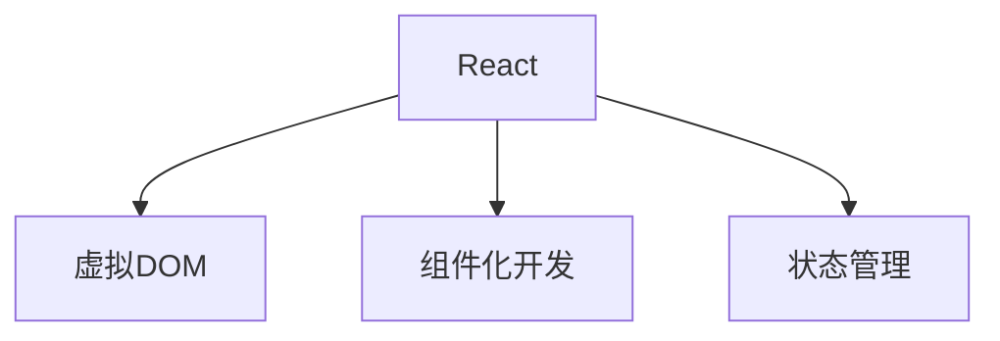
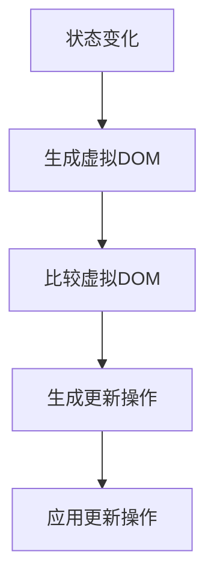
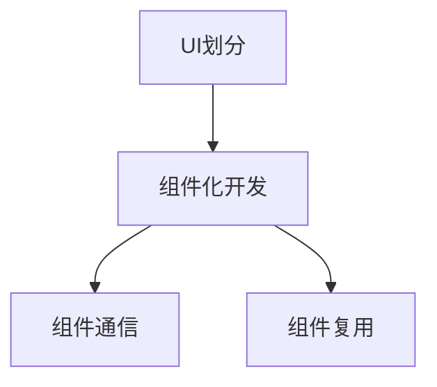
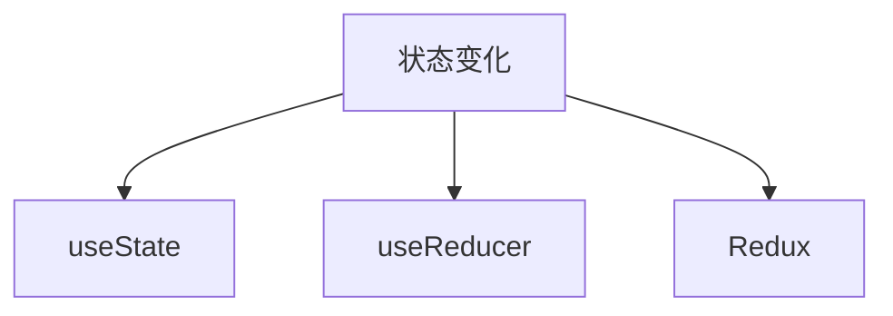

                 

# React 和前端框架：构建动态用户界面

> **关键词：** React、前端框架、动态用户界面、组件化开发、虚拟DOM、状态管理、性能优化

> **摘要：** 本文章将深入探讨React及其相关前端框架的核心概念和原理，通过一步步的分析和实例，讲解如何利用React构建动态用户界面。读者将了解React的虚拟DOM、组件化开发、状态管理等核心机制，掌握前端框架的应用技巧和性能优化策略。

## 1. 背景介绍

### 1.1 目的和范围

本文旨在帮助读者深入理解React及其相关前端框架，掌握构建动态用户界面所需的核心技能。我们将从React的基本概念开始，逐步深入到其核心机制，并结合实际案例，讲解如何在实际项目中应用React。

### 1.2 预期读者

本文适用于有一定前端基础，希望深入了解React及其应用的开发者。无论是初学者还是经验丰富的开发人员，都能从本文中获得有价值的信息。

### 1.3 文档结构概述

本文结构如下：

1. 背景介绍：介绍本文的目的、范围和预期读者。
2. 核心概念与联系：讲解React及相关前端框架的核心概念和架构。
3. 核心算法原理 & 具体操作步骤：分析React的核心算法原理和操作步骤。
4. 数学模型和公式 & 详细讲解 & 举例说明：阐述React中的数学模型和公式。
5. 项目实战：通过代码案例讲解React在实际项目中的应用。
6. 实际应用场景：分析React在不同领域的应用。
7. 工具和资源推荐：推荐学习资源和开发工具。
8. 总结：总结React的发展趋势与挑战。
9. 附录：常见问题与解答。
10. 扩展阅读 & 参考资料：提供进一步学习的资料。

### 1.4 术语表

#### 1.4.1 核心术语定义

- **React**：一种用于构建用户界面的JavaScript库。
- **虚拟DOM**：React用于优化性能的一种技术。
- **组件化开发**：将UI划分为多个组件，便于复用和维护。
- **状态管理**：管理组件的状态，确保数据的一致性。

#### 1.4.2 相关概念解释

- **JSX**：一种JavaScript的语法扩展，用于描述UI结构。
- **Hooks**：React 16.8 引入的新特性，用于在函数组件中管理状态和副作用。
- **路由**：在单页应用中，用于在不同页面间切换的技术。

#### 1.4.3 缩略词列表

- **SPA**：单页应用
- **VDOM**：虚拟DOM
- **JSX**：JavaScript XML
- **Hooks**：钩子函数

## 2. 核心概念与联系

React是一个用于构建用户界面的JavaScript库，其核心概念包括虚拟DOM、组件化开发、状态管理等。下面是一个简化的React架构的Mermaid流程图，展示这些核心概念之间的联系。



### 2.1 虚拟DOM

虚拟DOM是React的核心机制之一。它通过将真实的DOM结构映射到一个虚拟的结构，来实现UI的高效更新。当组件的状态发生变化时，React会首先更新虚拟DOM，然后通过比较虚拟DOM与实际DOM的差异，生成最小化的更新操作，最后将更新应用到实际DOM上。



### 2.2 组件化开发

组件化开发是将UI划分为多个组件，每个组件负责一个特定的功能或UI结构。组件化开发使得代码更易于复用和维护，同时也能提高开发效率。



### 2.3 状态管理

状态管理是React中的另一个重要概念。它用于管理组件的状态，确保数据的一致性。React提供了多种状态管理方案，如useState、useReducer、Redux等。



## 3. 核心算法原理 & 具体操作步骤

React的核心算法原理包括虚拟DOM的生成、比较和更新。下面使用伪代码详细阐述这些步骤。

### 3.1 虚拟DOM的生成

```python
function createElement(type, props, ...children):
    return {
        type: type,
        props: props,
        children: children
    }

# 示例：
# 创建一个div元素，包含一个文本子节点
virtualDOM = createElement('div', { className: 'container' }, createElement('span', {}, 'Hello, World!'))
```

### 3.2 虚拟DOM的比较

```python
function diffVirtualDOM(virtualDOM1, virtualDOM2):
    if virtualDOM1.type !== virtualDOM2.type:
        return false
    if virtualDOM1.props !== virtualDOM2.props:
        return false
    if len(virtualDOM1.children) !== len(virtualDOM2.children):
        return false
    for i in range(len(virtualDOM1.children)):
        if not diffVirtualDOM(virtualDOM1.children[i], virtualDOM2.children[i]):
            return false
    return true
```

### 3.3 虚拟DOM的更新

```python
function updateVirtualDOM(virtualDOM, updatedProps):
    virtualDOM.props = updatedProps
    return virtualDOM
```

## 4. 数学模型和公式 & 详细讲解 & 举例说明

React中的数学模型主要包括差分法和合并算法。下面使用LaTeX格式详细讲解这些模型。

### 4.1 差分法

差分法是一种用于比较两个虚拟DOM结构的数学模型。其核心思想是通过比较两个结构的差异，生成一个最小的更新操作集。

$$
D = \Delta(V_1, V_2) = (T \cup U \cup D')
$$

其中，$D$表示更新操作集，$T$表示删除操作集，$U$表示更新操作集，$D'$表示插入操作集。

### 4.2 合并算法

合并算法用于将多个虚拟DOM结构合并成一个最终的虚拟DOM结构。其核心思想是递归地将两个虚拟DOM结构进行合并，直到生成最终的虚拟DOM结构。

$$
V_{merge}(V_1, V_2) = \begin{cases}
    \{V_1\} & \text{如果 } V_1 = V_2 \\
    \{V_1, V_2\} & \text{否则}
\end{cases}
$$

### 4.3 示例

假设有两个虚拟DOM结构：

$$
V_1 = \text{div}\{\text{className}: 'container'\}
$$

$$
V_2 = \text{div}\{\text{className}: 'container'\}
$$

则使用差分法和合并算法可以计算得到最终的虚拟DOM结构：

$$
D = \Delta(V_1, V_2) = \emptyset
$$

$$
V_{merge}(V_1, V_2) = \{V_1, V_2\}
$$

## 5. 项目实战：代码实际案例和详细解释说明

### 5.1 开发环境搭建

在开始项目实战之前，我们需要搭建一个React的开发环境。以下是搭建React开发环境的步骤：

1. 安装Node.js（版本需大于14.0）
2. 安装Create React App工具（使用命令 `npx create-react-app my-app` 创建一个新项目）
3. 进入项目目录（使用命令 `cd my-app`）
4. 启动开发服务器（使用命令 `npm start`）

### 5.2 源代码详细实现和代码解读

下面是一个简单的React组件，用于展示一个计数器：

```jsx
import React, { useState } from 'react';

function Counter() {
    const [count, setCount] = useState(0);

    return (
        <div>
            <h1>计数器</h1>
            <p>当前计数：{count}</p>
            <button onClick={() => setCount(count + 1)}>增加</button>
            <button onClick={() => setCount(count - 1)}>减少</button>
        </div>
    );
}

export default Counter;
```

### 5.3 代码解读与分析

1. **导入React和useState钩子**：首先，我们导入了React库和useState钩子。useState是React提供的用于在函数组件中管理状态的钩子。

2. **组件定义**：我们定义了一个名为Counter的函数组件。

3. **使用useState钩子**：在组件内部，我们使用useState钩子初始化count状态变量，并将其设置为0。

4. **渲染UI**：我们使用JSX语法渲染了一个简单的计数器界面。包括一个标题、当前计数、以及两个按钮，用于增加和减少计数。

5. **事件处理**：我们使用`onClick`属性绑定事件处理函数。当用户点击增加或减少按钮时，会触发对应的处理函数，更新count状态的值。

6. **状态更新**：当count状态发生变化时，React会自动重新渲染组件，显示最新的计数值。

### 5.4 组件化开发

在实际项目中，我们可以将Counter组件进一步拆分为更小的组件，如标题组件、计数文本组件和按钮组件。这样有助于提高代码的复用性和可维护性。

```jsx
// Counter组件拆分为子组件
function Title() {
    return <h1>计数器</h1>;
}

function CountText({ count }) {
    return <p>当前计数：{count}</p>;
}

function Button({ text, onClick }) {
    return <button onClick={onClick}>{text}</button>;
}

function Counter() {
    const [count, setCount] = useState(0);

    return (
        <div>
            <Title />
            <CountText count={count} />
            <Button text="增加" onClick={() => setCount(count + 1)} />
            <Button text="减少" onClick={() => setCount(count - 1)} />
        </div>
    );
}
```

## 6. 实际应用场景

React及其相关前端框架在多个领域都有广泛的应用，以下是一些实际应用场景：

1. **Web应用**：React是构建Web应用的理想选择，其组件化开发和虚拟DOM技术使得开发过程更加高效和便捷。
2. **移动应用**：React Native是一个基于React的前端框架，用于构建原生移动应用。它允许开发者使用JavaScript和React语法编写移动应用，从而提高开发效率。
3. **桌面应用**：Electron是一个基于Chrome渲染引擎的框架，用于构建桌面应用。React结合Electron，可以构建出跨平台的桌面应用。
4. **服务器端渲染**：React Server Components是一种将React组件渲染到服务器端的技术。它有助于提高Web应用的性能和首屏加载速度。

## 7. 工具和资源推荐

### 7.1 学习资源推荐

#### 7.1.1 书籍推荐

1. 《React核心技术揭秘》（作者：张鑫旭）
2. 《深入React技术栈》（作者：王兴）
3. 《React Up & Running》（作者：Stefan Schubert）

#### 7.1.2 在线课程

1. React官方教程（https://reactjs.org/tutorial/tutorial.html）
2. Udemy上的《React for Beginners》课程
3. Pluralsight上的《React and Redux: The Essentials》课程

#### 7.1.3 技术博客和网站

1. React官网博客（https://reactjs.org/blog/）
2. FreeCodeCamp的React教程（https://www.freecodecamp.org/news/learn-react-in-3-hours-10ad5b2e9d0a/）
3. Medium上的React相关文章（https://medium.com/topic/react-js）

### 7.2 开发工具框架推荐

#### 7.2.1 IDE和编辑器

1. Visual Studio Code（https://code.visualstudio.com/）
2. WebStorm（https://www.jetbrains.com/webstorm/）
3. Atom（https://atom.io/）

#### 7.2.2 调试和性能分析工具

1. React DevTools（https://github.com/facebook/react-devtools）
2. Lighthouse（https://developers.google.com/web/tools/lighthouse）
3. WebPageTest（https://www.webpagetest.org/）

#### 7.2.3 相关框架和库

1. Redux（https://redux.js.org/）
2. React Router（https://reactrouter.com/）
3. Material-UI（https://material-ui.com/）

### 7.3 相关论文著作推荐

#### 7.3.1 经典论文

1. "A Framework for Building Interactive Graphical User Interfaces"（作者：Jamie Zawinski）
2. "The Technology Behind Google Web Toolkit"（作者：Bruce Lee et al.）

#### 7.3.2 最新研究成果

1. "Incremental Rendering: A Study of Memory and Performance in Reactive Programming"（作者：Samuel A. Ramirez et al.）
2. "Building Scalable React Applications with Redux and Reselect"（作者：Aaron Frost）

#### 7.3.3 应用案例分析

1. "How Airbnb Builds its Website with React"（作者：Airbnb技术团队）
2. "React at Netflix: Building a Multi-Tier Frontend Architecture"（作者：Netflix技术团队）

## 8. 总结：未来发展趋势与挑战

React作为前端框架的领军者，在未来仍将继续引领前端开发趋势。随着Web技术的不断发展和演进，React有望在以下方面取得突破：

1. **性能优化**：React将在性能优化方面不断突破，通过更高效的渲染引擎和优化策略，提升Web应用的性能。
2. **功能增强**：React将引入更多功能，如更好地支持服务器端渲染、更好的状态管理方案等。
3. **生态完善**：React的生态系统将不断完善，为开发者提供更多高质量的库和工具。

然而，React也将面临一些挑战：

1. **学习曲线**：React的学习曲线相对较陡，对于初学者来说，需要一定的时间和精力来掌握。
2. **框架选择**：前端框架众多，开发者需要在React和其他框架之间做出选择。

## 9. 附录：常见问题与解答

### 9.1 React是什么？

React是一个用于构建用户界面的JavaScript库，由Facebook开发。它通过组件化开发和虚拟DOM技术，提高了前端开发的效率和性能。

### 9.2 什么是虚拟DOM？

虚拟DOM是一种编程概念，它通过将真实的DOM结构映射到一个内存中的数据结构，来实现UI的高效更新。React使用虚拟DOM来优化性能，减少实际DOM的操作。

### 9.3 React的状态管理如何实现？

React的状态管理可以通过useState、useReducer、Redux等方案实现。useState是React提供的用于在函数组件中管理状态的钩子，而useReducer和Redux则是更复杂的状态管理方案。

### 9.4 React和Vue哪个更好？

React和Vue都是优秀的前端框架，各自有着不同的特点和优势。选择哪个框架取决于项目的具体需求和开发者的个人偏好。React在社区和生态方面较为强大，而Vue在易用性和文档方面表现突出。

## 10. 扩展阅读 & 参考资料

1. 《React核心技术揭秘》：张鑫旭，电子工业出版社，2018年。
2. 《深入React技术栈》：王兴，电子工业出版社，2017年。
3. React官方文档：https://reactjs.org/docs/getting-started.html
4. React Router官方文档：https://reactrouter.com/web/guides/quick-start
5. Redux官方文档：https://redux.js.org/introduction/getting-started
6. React Native官方文档：https://reactnative.dev/docs/getting-started

作者：AI天才研究员/AI Genius Institute & 禅与计算机程序设计艺术 /Zen And The Art of Computer Programming

