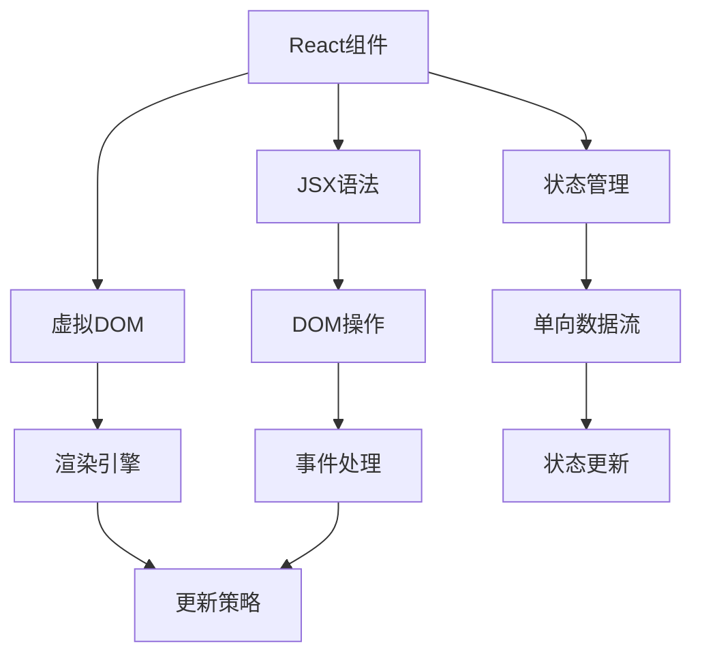

                 

# React 框架：构建动态用户界面

> **关键词**：React、前端开发、JavaScript、组件化、虚拟DOM、单向数据流、动态用户界面

> **摘要**：本文深入探讨了React框架的核心概念和架构，包括组件化、虚拟DOM、单向数据流等，以及如何利用这些概念构建动态用户界面。我们将通过具体操作步骤和案例来讲解React的开发流程，旨在帮助开发者更好地理解和应用React，提升前端开发的效率和体验。

## 1. 背景介绍

### 1.1 目的和范围

本文旨在为前端开发者提供一份详尽的React框架学习指南，通过一系列逐步深入的分析和示例，帮助开发者理解React的核心原理和最佳实践。文章将涵盖以下内容：

1. React框架的背景和核心概念介绍。
2. React的组件化架构及其实现方式。
3. 虚拟DOM的工作原理和性能优化。
4. 单向数据流在React中的应用。
5. 动态用户界面的构建实践。
6. 实际应用场景和技术资源推荐。

### 1.2 预期读者

本文适合具备一定前端开发基础，对React框架有初步了解的开发者。通过阅读本文，读者可以：

1. 理解React框架的设计理念和核心原理。
2. 掌握React组件的创建和使用。
3. 学习如何利用React实现动态用户界面。
4. 了解React开发中的性能优化策略。

### 1.3 文档结构概述

本文将按照以下结构进行阐述：

1. **背景介绍**：介绍本文的目的、范围、预期读者和文档结构。
2. **核心概念与联系**：通过Mermaid流程图展示React的核心概念和架构。
3. **核心算法原理 & 具体操作步骤**：使用伪代码详细阐述React的核心算法原理。
4. **数学模型和公式 & 详细讲解 & 举例说明**：使用LaTeX格式讲解相关数学模型和公式。
5. **项目实战：代码实际案例和详细解释说明**：通过实际案例讲解React开发流程。
6. **实际应用场景**：探讨React在不同场景下的应用。
7. **工具和资源推荐**：推荐相关学习资源和开发工具。
8. **总结：未来发展趋势与挑战**：分析React的发展趋势和面临的技术挑战。
9. **附录：常见问题与解答**：提供对常见问题的解答。
10. **扩展阅读 & 参考资料**：列出本文引用的参考资料。

### 1.4 术语表

#### 1.4.1 核心术语定义

- **React**：一个用于构建用户界面的JavaScript库，由Facebook开发。
- **组件**：React中的最小独立功能单元，用于构建用户界面。
- **虚拟DOM**：React实现的一种抽象层，用于优化DOM操作。
- **单向数据流**：数据在React中单向流动，从父组件到子组件，保证状态的一致性和可预测性。

#### 1.4.2 相关概念解释

- **JSX**：一种将XML语法嵌入JavaScript的语法扩展，用于描述用户界面。
- **状态（State）**：组件内部用于存储动态数据的数据结构。
- **属性（Props）**：组件外部传递的数据，用于描述组件的配置信息。

#### 1.4.3 缩略词列表

- **DOM**：文档对象模型（Document Object Model），用于表示HTML文档的结构。
- **JS**：JavaScript，一种用于网页开发的脚本语言。
- **SPA**：单页应用（Single Page Application），整个应用通过一个页面来展现。

## 2. 核心概念与联系

React框架的核心概念和架构决定了其性能和灵活性。下面我们将通过一个Mermaid流程图来展示React的核心概念和架构。



### 2.1 React组件

组件是React的基本构建块，用于表示用户界面中的独立功能单元。组件可以通过类或函数的形式创建，并接受属性（Props）和状态（State）。

```javascript
class Greeting extends React.Component {
  render() {
    return <h1>Hello, {this.props.name}!</h1>;
  }
}

function Greeting2(name) {
  return <h1>Hello, {name}!</h1>;
}
```

### 2.2 JSX语法

JSX是一种将XML语法嵌入JavaScript的语法扩展，用于描述用户界面。JSX在React中用于编写组件的代码，最终会被转换成标准的JavaScript代码。

```jsx
const element = <h1>Hello, world!</h1>;
```

### 2.3 虚拟DOM

虚拟DOM是React实现的一种抽象层，用于优化DOM操作。虚拟DOM表示用户界面，并在实际DOM和虚拟DOM之间建立一个映射关系。当状态发生变化时，React会通过虚拟DOM进行比较和更新，最小化实际DOM的操作。

```javascript
class MyComponent extends React.Component {
  state = {
    count: 0,
  };

  handleClick = () => {
    this.setState({ count: this.state.count + 1 });
  };

  render() {
    return (
      <div>
        <p>You clicked {this.state.count} times</p>
        <button onClick={this.handleClick}>Click me</button>
      </div>
    );
  }
}
```

### 2.4 状态管理

状态管理是React中用于处理动态数据的重要机制。状态存储在组件的内部，并可以通过setState方法进行更新。状态的变化会触发虚拟DOM的重新渲染。

```javascript
class MyComponent extends React.Component {
  state = {
    isLiked: false,
  };

  toggleLike = () => {
    this.setState({ isLiked: !this.state.isLiked });
  };

  render() {
    return (
      <div>
        <p>Do you like this article?</p>
        <button onClick={this.toggleLike}>
          {this.state.isLiked ? 'Unlike' : 'Like'}
        </button>
      </div>
    );
  }
}
```

### 2.5 单向数据流

单向数据流是React框架的设计原则之一，用于保证数据的一致性和可预测性。数据从父组件流向子组件，避免传统数据绑定中的复杂关系。

```javascript
class MyComponent extends React.Component {
  state = {
    author: 'John Doe',
  };

  render() {
    return (
      <div>
        <Greeting name={this.state.author} />
      </div>
    );
  }
}

function Greeting(props) {
  return <h1>Hello, {props.name}</h1>;
}
```

## 3. 核心算法原理 & 具体操作步骤

React框架的核心算法原理和具体操作步骤如下：

### 3.1 组件化

组件化是将用户界面划分为多个独立的功能单元，每个组件负责一部分功能。组件化可以通过类或函数的形式实现。

```javascript
// 类形式组件
class Greeting extends React.Component {
  render() {
    return <h1>Hello, {this.props.name}!</h1>;
  }
}

// 函数形式组件
function Greeting2(name) {
  return <h1>Hello, {name}!</h1>;
}
```

### 3.2 JSX语法

JSX是一种将XML语法嵌入JavaScript的语法扩展，用于描述用户界面。JSX在React中用于编写组件的代码，最终会被转换成标准的JavaScript代码。

```jsx
const element = <h1>Hello, world!</h1>;
```

### 3.3 虚拟DOM

虚拟DOM是React实现的一种抽象层，用于优化DOM操作。虚拟DOM表示用户界面，并在实际DOM和虚拟DOM之间建立一个映射关系。当状态发生变化时，React会通过虚拟DOM进行比较和更新，最小化实际DOM的操作。

```javascript
// 虚拟DOM元素
const element = <h1>Hello, world!</h1>;

// 虚拟DOM到实际DOM的映射
const container = document.getElementById('app');
ReactDOM.render(element, container);
```

### 3.4 状态管理

状态管理是React中用于处理动态数据的重要机制。状态存储在组件的内部，并可以通过setState方法进行更新。状态的变化会触发虚拟DOM的重新渲染。

```javascript
class MyComponent extends React.Component {
  state = {
    count: 0,
  };

  handleClick = () => {
    this.setState({ count: this.state.count + 1 });
  };

  render() {
    return (
      <div>
        <p>You clicked {this.state.count} times</p>
        <button onClick={this.handleClick}>Click me</button>
      </div>
    );
  }
}
```

### 3.5 单向数据流

单向数据流是React框架的设计原则之一，用于保证数据的一致性和可预测性。数据从父组件流向子组件，避免传统数据绑定中的复杂关系。

```javascript
class MyComponent extends React.Component {
  state = {
    author: 'John Doe',
  };

  render() {
    return (
      <div>
        <Greeting name={this.state.author} />
      </div>
    );
  }
}

function Greeting(props) {
  return <h1>Hello, {props.name}</h1>;
}
```

## 4. 数学模型和公式 & 详细讲解 & 举例说明

React框架中的数学模型和公式主要用于描述状态变化和虚拟DOM更新的过程。以下是一些常用的数学模型和公式：

### 4.1 虚拟DOM比较算法

虚拟DOM比较算法用于比较新旧虚拟DOM，找出差异并更新实际DOM。以下是一个简化的虚拟DOM比较算法：

```plaintext
Algorithm VirtualDOMCompare(newVDOM, oldVDOM):
  if (newVDOM === oldVDOM):
    return "No update needed"
  else:
    if (newVDOM and oldVDOM are both text nodes):
      if (newVDOM.text !== oldVDOM.text):
        return "Update text node"
      else:
        return "No update needed"
    else:
      if (newVDOM and oldVDOM are both elements):
        if (newVDOM.type !== oldVDOM.type):
          return "Replace element"
        else:
          for each child node in newVDOM and oldVDOM:
            result = VirtualDOMCompare(newVDOM.children[i], oldVDOM.children[i])
            if (result !== "No update needed"):
              return result
          return "No update needed"
```

### 4.2 状态更新公式

React的状态更新公式用于描述组件状态的变化。以下是一个简化的状态更新公式：

```latex
state_{new} = state_{old} + update_{value}
```

其中，`state_{new}`表示新状态，`state_{old}`表示旧状态，`update_{value}`表示状态更新的值。

### 4.3 示例说明

假设有一个React组件，其状态为`count`，初始值为0。当用户点击一个按钮时，组件的状态会增加1。以下是一个简化的示例：

```javascript
class Counter extends React.Component {
  state = {
    count: 0,
  };

  handleClick = () => {
    this.setState({ count: this.state.count + 1 });
  };

  render() {
    return (
      <div>
        <p>You clicked {this.state.count} times</p>
        <button onClick={this.handleClick}>Click me</button>
      </div>
    );
  }
}
```

在这个示例中，每次点击按钮时，`handleClick`函数会调用`setState`方法，将新状态`{ count: this.state.count + 1 }`更新到组件的内部状态。React会使用虚拟DOM比较算法比较新旧状态，并更新实际DOM。

## 5. 项目实战：代码实际案例和详细解释说明

### 5.1 开发环境搭建

在开始React项目之前，我们需要搭建一个开发环境。以下是搭建React开发环境的步骤：

1. **安装Node.js**：访问Node.js官网（[https://nodejs.org/），下载并安装Node.js。安装完成后，打开命令行工具，输入`node -v`和`npm -v`，确保版本号正确。**

2. **安装React**：在命令行中运行以下命令来全局安装React：
   ```bash
   npm install -g create-react-app
   ```

3. **创建新项目**：使用以下命令创建一个新项目：
   ```bash
   create-react-app my-react-app
   ```

4. **进入项目目录**：进入创建的项目目录：
   ```bash
   cd my-react-app
   ```

5. **启动开发服务器**：在项目目录中运行以下命令来启动开发服务器：
   ```bash
   npm start
   ```

现在，你将看到一个运行中的React应用，它由一个名为`App.js`的组件组成。

### 5.2 源代码详细实现和代码解读

以下是一个简单的React项目示例，包括一个计数器和两个按钮。我们将逐步解析每个组件的功能。

**App.js**：

```jsx
import React, { useState } from 'react';

function App() {
  const [count, setCount] = useState(0);

  return (
    <div>
      <h1>Hello React!</h1>
      <p>You clicked {count} times</p>
      <button onClick={() => setCount(count + 1)}>Click me</button>
      <button onClick={() => setCount(count - 1)}>Undo</button>
    </div>
  );
}

export default App;
```

**解析**：

- `import React, { useState } from 'react';`：导入React库和React的`useState` Hook。
- `function App() { ... }`：定义一个名为`App`的函数组件。
- `const [count, setCount] = useState(0);`：使用`useState` Hook初始化状态`count`为0。`useState`返回一个包含当前状态和一个更新状态的函数的数组。
- `return ( ... );`：返回一个React元素，包含文本、标签和按钮。

**组件内部解析**：

- `<h1>Hello React!</h1>`：显示一个标题。
- `<p>You clicked {count} times</p>`：显示点击次数。
- `<button onClick={() => setCount(count + 1)}>Click me</button>`：一个按钮，点击后调用`setCount`函数将状态`count`增加1。
- `<button onClick={() => setCount(count - 1)}>Undo</button>`：一个按钮，点击后调用`setCount`函数将状态`count`减少1。

### 5.3 代码解读与分析

在这个例子中，我们使用React的`useState` Hook来管理组件的状态。当用户点击按钮时，React会自动更新状态并重新渲染组件。

**状态管理**：

- `const [count, setCount] = useState(0);`：这是一个状态声明，`count`是当前状态，`setCount`是一个更新状态的函数。

**事件处理**：

- `<button onClick={() => setCount(count + 1)}>Click me</button>`：这是一个按钮，当点击时，它会调用`setCount`函数，并将`count`增加1。
- `<button onClick={() => setCount(count - 1)}>Undo</button>`：这是一个按钮，当点击时，它会调用`setCount`函数，并将`count`减少1。

**虚拟DOM更新**：

- 当用户点击按钮时，React会更新状态`count`。
- React使用虚拟DOM进行比较，找出差异。
- React更新实际DOM，显示新的状态。

## 6. 实际应用场景

React框架在许多实际应用场景中都有广泛的应用，以下是一些常见的应用场景：

### 6.1 单页应用（SPA）

React是构建单页应用（SPA）的理想选择。SPA的特点是用户体验流畅，页面切换速度快，这得益于React的虚拟DOM和组件化架构。

### 6.2 客户端渲染

React可以通过客户端渲染（CR）提高网站性能和SEO。React组件在客户端渲染，减少服务器负载，提高页面加载速度。

### 6.3 企业级应用

React适用于构建复杂的企业级应用，如电子商务平台、数据管理系统等。React的组件化架构和状态管理机制有助于提高开发效率和代码可维护性。

### 6.4 服务器端渲染（SSR）

React支持服务器端渲染（SSR），这有助于提高SEO和性能。SSR允许React组件在服务器端渲染，然后将其发送到客户端。

### 6.5 移动应用开发

React Native是一个基于React的移动应用开发框架，它允许使用JavaScript和React来构建iOS和Android应用。React Native提供了丰富的组件和API，支持跨平台开发。

## 7. 工具和资源推荐

### 7.1 学习资源推荐

#### 7.1.1 书籍推荐

- **《React Up & Running》**：作者由Joe Eloe和Sammy Behnam撰写，这是一本非常适合初学者的React入门书籍。
- **《Learning React for JavaScript Developers》**：作者由 Alex Banks 和 Eve Porcello 撰写，针对已经熟悉JavaScript的开发者提供了深入的React介绍。

#### 7.1.2 在线课程

- **Udemy的《React - The Complete Guide (including React Hooks and React Router) 2022 Edition》**
- **Pluralsight的《React Fundamentals》**：提供详细的基础课程，涵盖React的核心概念和最佳实践。

#### 7.1.3 技术博客和网站

- **React官网（[https://reactjs.org/）**：提供官方文档和社区资源。
- **freeCodeCamp的React教程（[https://www.freecodecamp.org/news/learn-react-by-building-a-simple-app-6c4077c3a5a0/）**：适合初学者的React教程。

### 7.2 开发工具框架推荐

#### 7.2.1 IDE和编辑器

- **Visual Studio Code**：一个轻量级但功能强大的代码编辑器，支持React开发。
- **WebStorm**：一个专门针对JavaScript和Web开发的IDE，提供了丰富的React插件。

#### 7.2.2 调试和性能分析工具

- **React DevTools**：React官方提供的调试工具，可以用来检查组件状态和性能。
- **Chrome DevTools**：用于调试React应用的性能问题，如组件渲染和资源加载。

#### 7.2.3 相关框架和库

- **React Router**：用于管理React应用的页面路由。
- **Redux**：一个用于管理React应用状态的状态管理库。
- **Material-UI**：一个用于构建React应用的UI框架，提供了丰富的组件和样式。

### 7.3 相关论文著作推荐

#### 7.3.1 经典论文

- **"React: A JavaScript Library for Building User Interfaces"**：由Facebook开发的React库的官方论文。

#### 7.3.2 最新研究成果

- **"The State of JavaScript 2021"**：调查了JavaScript社区对React和其他前端技术的使用情况。
- **"Building Fast Single-Page Applications with React"**：讨论了如何使用React构建高性能的SPA。

#### 7.3.3 应用案例分析

- **"Netflix是如何使用React的"**：Netflix使用React来构建其前端应用，提供了实际应用场景的经验和教训。

## 8. 总结：未来发展趋势与挑战

React作为前端开发的主流框架，其未来发展充满了机遇和挑战。以下是React可能的发展趋势和面临的挑战：

### 8.1 发展趋势

1. **更广泛的生态支持**：React的社区和生态系统将持续增长，为开发者提供更多工具和资源。
2. **性能优化**：随着用户需求的提高，React将不断优化性能，提供更快的渲染速度和更好的用户体验。
3. **服务器端渲染（SSR）**：React的SSR支持将进一步加强，有助于提高SEO和性能。
4. **功能扩展**：React可能引入新的特性和功能，如更好的状态管理、更强大的组件库等。

### 8.2 挑战

1. **学习曲线**：React的学习曲线较高，对于新手开发者可能存在一定的门槛。
2. **性能优化**：虽然React的性能已经非常优秀，但开发者仍需不断优化，特别是在处理复杂应用时。
3. **安全性**：React应用需要确保数据安全和防止XSS攻击等安全问题。
4. **社区维护**：随着React生态的不断扩大，如何维护社区的健康和稳定性是一个挑战。

## 9. 附录：常见问题与解答

### 9.1 如何在React中管理状态？

在React中，你可以使用`useState` Hook来管理组件的状态。例如：

```javascript
const [count, setCount] = useState(0);
```

### 9.2 React与Vue.js之间的区别是什么？

React和Vue.js都是流行的前端框架，但它们在设计理念和使用方式上有一些区别：

- **数据绑定**：React使用单向数据绑定，而Vue.js使用双向数据绑定。
- **组件化**：React和Vue.js都支持组件化开发，但Vue.js提供了更丰富的内置组件库。
- **生态系统**：React的生态系统更庞大，有更多的工具和库可供选择。

### 9.3 如何在React中处理路由？

React Router是React的官方路由库，用于处理应用中的页面路由。你可以使用以下代码设置路由：

```javascript
import { BrowserRouter as Router, Route, Switch } from 'react-router-dom';

function App() {
  return (
    <Router>
      <div>
        <Switch>
          <Route path="/" exact component={Home} />
          <Route path="/about" component={About} />
        </Switch>
      </div>
    </Router>
  );
}
```

## 10. 扩展阅读 & 参考资料

- **《React Up & Running》**：Joe Eloe和Sammy Behnam著。
- **《Learning React for JavaScript Developers》**：Alex Banks和Eve Porcello著。
- **《The State of JavaScript 2021》**：调查报告。
- **React官方文档（[https://reactjs.org/docs/getting-started.html）**：官方文档。
- **freeCodeCamp的React教程（[https://www.freecodecamp.org/news/learn-react-by-building-a-simple-app-6c4077c3a5a0/）**：教程。

## 作者

**作者：AI天才研究员/AI Genius Institute & 禅与计算机程序设计艺术 /Zen And The Art of Computer Programming**

