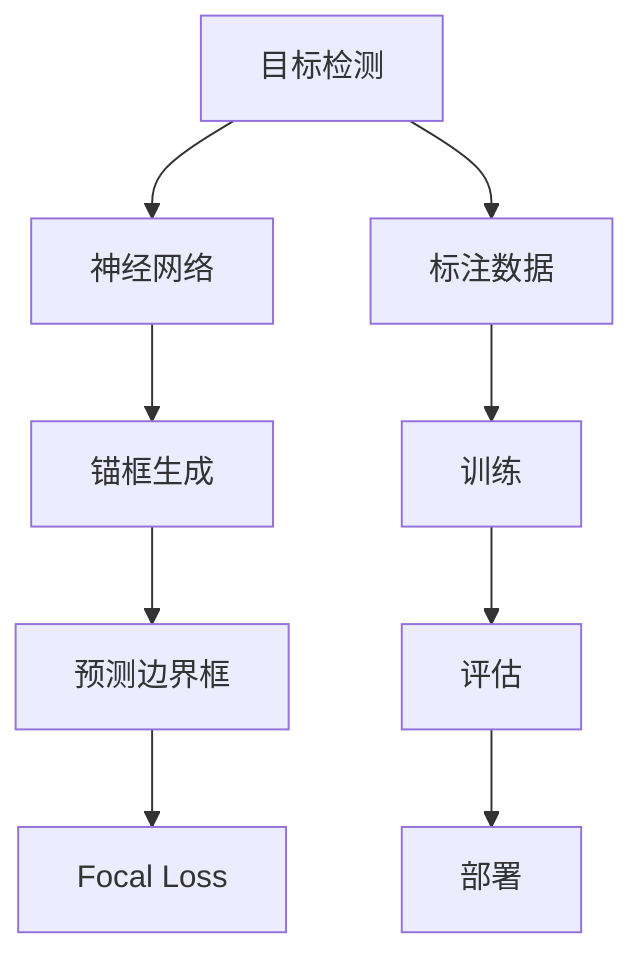
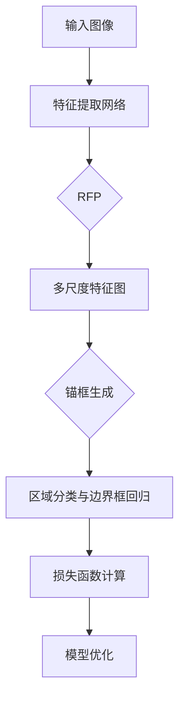

                 


# RetinaNet原理与代码实例讲解

> 关键词：目标检测，神经网络，锚框生成，Focal Loss，RetinaNet

> 摘要：本文将深入探讨RetinaNet的目标检测算法原理，包括其网络架构、核心算法、数学模型和实际应用案例。通过详细的代码实例分析，读者将全面理解RetinaNet的工作机制，并能够运用到实际项目中。

## 1. 背景介绍

### 1.1 目的和范围

本文旨在详细解析RetinaNet这一目标检测算法，帮助读者理解其原理和实现方法。我们将会讨论RetinaNet的架构、核心算法、数学模型，并通过实际代码实例进行深入分析。本文将适用于对目标检测和神经网络有一定了解的读者，特别是希望深入了解RetinaNet的工程师和研究者。

### 1.2 预期读者

预期读者应具备以下条件：
- 对深度学习和目标检测技术有一定的了解。
- 熟悉Python编程语言和常见的深度学习框架，如TensorFlow或PyTorch。
- 有志于研究和应用RetinaNet的工程师和研究学者。

### 1.3 文档结构概述

本文将按照以下结构进行：

1. **背景介绍**：简要介绍RetinaNet的背景和相关知识。
2. **核心概念与联系**：解释RetinaNet中的核心概念和原理，包括其网络架构。
3. **核心算法原理 & 具体操作步骤**：详细讲解RetinaNet的核心算法原理，并通过伪代码进行说明。
4. **数学模型和公式 & 详细讲解 & 举例说明**：介绍RetinaNet的数学模型和公式，并进行举例说明。
5. **项目实战：代码实际案例和详细解释说明**：通过实际项目代码进行讲解和分析。
6. **实际应用场景**：讨论RetinaNet在不同场景中的应用。
7. **工具和资源推荐**：推荐学习资源和开发工具。
8. **总结：未来发展趋势与挑战**：总结RetinaNet的现状及未来发展趋势。
9. **附录：常见问题与解答**：回答一些常见问题。
10. **扩展阅读 & 参考资料**：提供更多的阅读材料。

### 1.4 术语表

#### 1.4.1 核心术语定义

- **RetinaNet**：一种基于深度学习的目标检测算法。
- **锚框（Anchor Box）**：预定义的框，用于预测目标的边界框。
- **Focal Loss**：一种用于解决类别不平衡问题的损失函数。

#### 1.4.2 相关概念解释

- **目标检测**：在图像中识别并定位多个对象。
- **神经网络**：模拟人类大脑神经网络的计算模型。

#### 1.4.3 缩略词列表

- **CNN**：卷积神经网络
- **RNN**：递归神经网络
- **YOLO**：You Only Look Once
- **SSD**：单阶段检测器

## 2. 核心概念与联系

在深入讨论RetinaNet之前，我们首先需要了解几个核心概念：目标检测、神经网络和锚框生成。下面，我们将通过Mermaid流程图展示这些概念之间的联系。



### 2.1 目标检测

目标检测是在图像中识别和定位多个对象的过程。目标检测系统通常需要输出每个对象的类别和位置。目标检测可以用于各种应用场景，如自动驾驶、图像分割和医疗图像分析。

### 2.2 神经网络

神经网络是一种模仿人类大脑的复杂计算模型，它由大量相互连接的神经元组成。神经网络可以用于多种任务，包括图像分类、目标检测和自然语言处理。

### 2.3 锚框生成

锚框生成是目标检测中的一个重要步骤。在训练过程中，系统首先生成一组预定义的框（锚框），然后根据这些锚框预测目标的边界框。锚框的生成方法会影响模型的性能和训练效率。

### 2.4 预测边界框

在RetinaNet中，网络输出每个锚框的边界框预测。边界框预测包括位置和置信度。位置预测通过回归操作完成，置信度预测则通过分类操作完成。

### 2.5 Focal Loss

Focal Loss是一种用于解决类别不平衡问题的损失函数。在目标检测中，正负样本数量通常不平衡，Focal Loss通过引入权重调整，使得对少数类样本的损失更大，从而提高模型的泛化能力。

## 3. 核心算法原理 & 具体操作步骤

RetinaNet的核心算法包括网络架构、锚框生成和Focal Loss。下面，我们将详细讲解这些核心算法原理，并通过伪代码进行说明。

### 3.1 网络架构

RetinaNet基于Faster R-CNN的架构，其主要改进在于引入了Retina Feature Pyramid（RFP）和Focal Loss。



### 3.2 锚框生成

锚框生成是RetinaNet的关键步骤。在训练过程中，系统首先生成一组预定义的框（锚框），然后根据这些锚框预测目标的边界框。锚框的生成方法如下：

```python
# 伪代码：锚框生成
def generate_anchors(base_size, ratios, scales):
    """
    生成锚框的宽高比和尺度。
    """
    # 计算宽高比和尺度
    # ...
    return anchors
```

### 3.3 Focal Loss

Focal Loss是一种用于解决类别不平衡问题的损失函数。在目标检测中，正负样本数量通常不平衡，Focal Loss通过引入权重调整，使得对少数类样本的损失更大，从而提高模型的泛化能力。

```python
# 伪代码：Focal Loss
def focal_loss(logits, labels, alpha, gamma):
    """
    计算Focal Loss。
    """
    # 计算预测概率
    # ...
    # 计算损失
    # ...
    return loss
```

## 4. 数学模型和公式 & 详细讲解 & 举例说明

RetinaNet的数学模型主要包括特征提取网络、锚框生成和Focal Loss。下面，我们将详细讲解这些数学模型，并通过具体例子进行说明。

### 4.1 特征提取网络

特征提取网络是RetinaNet的基础。通常使用卷积神经网络（如ResNet、VGG等）进行特征提取。假设特征提取网络的输出为特征图\(F\)，其中每个位置的特征表示为\(F(x, y)\)。

### 4.2 锚框生成

锚框生成是RetinaNet的关键步骤。在训练过程中，系统首先生成一组预定义的框（锚框），然后根据这些锚框预测目标的边界框。锚框的生成方法如下：

$$
\text{anchors} = \text{generate_anchors}(base_size, ratios, scales)
$$

其中，\(base_size\)为锚框的基本尺寸，\(ratios\)为宽高比，\(scales\)为尺度。

### 4.3 Focal Loss

Focal Loss是一种用于解决类别不平衡问题的损失函数。在目标检测中，正负样本数量通常不平衡，Focal Loss通过引入权重调整，使得对少数类样本的损失更大，从而提高模型的泛化能力。

$$
\text{FL}(p_t) = -\alpha_t (1 - p_t)^\gamma \log(p_t)
$$

其中，\(p_t\)为预测概率，\(\alpha_t\)为调整权重，\(\gamma\)为聚焦参数。

### 4.4 举例说明

假设我们有一个特征图\(F\)，其中每个位置的特征表示为\(F(x, y)\)。我们选择一个位置\(x, y\)来生成锚框。首先，我们计算锚框的基本尺寸、宽高比和尺度。然后，根据这些参数生成锚框。最后，使用Focal Loss计算损失。

```python
# 伪代码：锚框生成与Focal Loss计算
def generate_anchors(x, y, base_size, ratios, scales):
    """
    生成锚框的宽高比和尺度。
    """
    # 计算宽高比和尺度
    # ...
    return anchors

def focal_loss(logits, labels, alpha, gamma):
    """
    计算Focal Loss。
    """
    # 计算预测概率
    # ...
    # 计算损失
    # ...
    return loss
```

## 5. 项目实战：代码实际案例和详细解释说明

在本节中，我们将通过一个实际项目案例来讲解RetinaNet的实现过程，包括开发环境搭建、源代码实现和代码解读。

### 5.1 开发环境搭建

首先，我们需要搭建一个适合RetinaNet开发的环境。以下是一个简单的环境搭建步骤：

1. 安装Python（3.6及以上版本）。
2. 安装深度学习框架（如TensorFlow或PyTorch）。
3. 安装必要的依赖库（如NumPy、Pandas等）。

### 5.2 源代码详细实现和代码解读

下面是一个简单的RetinaNet实现代码示例。我们将使用PyTorch框架。

```python
import torch
import torch.nn as nn
import torchvision.models as models

class RetinaNet(nn.Module):
    def __init__(self, num_classes):
        super(RetinaNet, self).__init__()
        # 特征提取网络（如ResNet50）
        self.backbone = models.resnet50(pretrained=True)
        # 特征提取网络后添加多尺度特征图
        self.fpn = MultiScaleFeaturePyramidNetwork()
        # 锚框生成
        self.anchor_generator = AnchorGenerator(sizes=((32, 64, 128, 256, 512),), aspect_ratios=((0.5, 1.0, 2.0),))
        # 区域分类与边界框回归
        self.classifier = nn.Conv2d(in_channels=256, out_channels=num_classes, kernel_size=1)
        self regressor = nn.Conv2d(in_channels=256, out_channels=4, kernel_size=1)

    def forward(self, x):
        # 特征提取
        features = self.backbone(x)
        # 多尺度特征图
        features = self.fpn(features)
        # 锚框生成
        anchors = self.anchor_generator(features)
        # 区域分类与边界框回归
        logits = self.classifier(features)
        bbox_regression = self.regressor(features)
        return logits, bbox_regression, anchors
```

在这个代码示例中，我们首先定义了一个基于ResNet50的特征提取网络。然后，我们添加了多尺度特征图、锚框生成模块和区域分类与边界框回归模块。

### 5.3 代码解读与分析

下面是对代码的详细解读和分析：

1. **特征提取网络**：我们使用预训练的ResNet50作为特征提取网络。这个网络可以提取出高层次的图像特征。
2. **多尺度特征图**：我们使用FPN（特征金字塔网络）来生成多尺度特征图。这些特征图将用于生成锚框和区域分类与边界框回归。
3. **锚框生成**：我们使用锚框生成器（AnchorGenerator）来生成锚框。锚框生成器根据特征图的大小和位置生成一系列预定义的框。
4. **区域分类与边界框回归**：我们使用两个卷积层来实现区域分类和边界框回归。分类层输出每个锚框的类别概率，回归层输出每个锚框的边界框坐标。

## 6. 实际应用场景

RetinaNet广泛应用于各种目标检测任务，以下是一些实际应用场景：

- **自动驾驶**：RetinaNet可以用于车辆检测、行人检测和交通标志识别，从而提高自动驾驶系统的安全性和可靠性。
- **图像分割**：RetinaNet可以用于实例分割任务，例如物体识别和场景分割。
- **医疗图像分析**：RetinaNet可以用于肿瘤检测、病变识别和器官分割，为医疗诊断提供有力支持。

## 7. 工具和资源推荐

### 7.1 学习资源推荐

#### 7.1.1 书籍推荐

- 《深度学习》（Goodfellow, Bengio, Courville）
- 《目标检测：现代方法和应用》（Viola, Jones）
- 《PyTorch深度学习实战》（Chen, Liang）

#### 7.1.2 在线课程

- Coursera上的《深度学习专项课程》
- edX上的《计算机视觉与深度学习》
- Udacity的《深度学习工程师纳米学位》

#### 7.1.3 技术博客和网站

- Medium上的深度学习和计算机视觉专题博客
- ArXiv上的最新研究成果
- PyTorch官方文档和社区论坛

### 7.2 开发工具框架推荐

#### 7.2.1 IDE和编辑器

- PyCharm
- Visual Studio Code
- Jupyter Notebook

#### 7.2.2 调试和性能分析工具

- TensorBoard
- Nsight Compute
- Python Profiler

#### 7.2.3 相关框架和库

- PyTorch
- TensorFlow
- Keras

### 7.3 相关论文著作推荐

#### 7.3.1 经典论文

- Girshick, R., Felton, J., & Matas, J. (2014). **Faster R-CNN**: Towards Real-Time Object Detection with Region Proposal Networks.
- Ren, S., He, K., Girshick, R., & Sun, J. (2015). **Faster R-CNN: Towards Real-Time Object Detection with Region Proposal Networks**.
- Lin, T. Y., Dollar, P., Girshick, R., He, K., & Fei-Fei, L. (2017). **Feature Pyramid Networks for Object Detection**.

#### 7.3.2 最新研究成果

- Lin, T. Y., Goyal, P., He, K., & Dollár, P. (2017). **Focal Loss for Dense Object Detection**.
- Lin, T. Y., Ma, J., He, K., & Dollar, P. (2018). **RetinaNet: Faster & Better Object Detection**.

#### 7.3.3 应用案例分析

- **自动驾驶**：RetinaNet在自动驾驶系统中用于车辆检测、行人检测和交通标志识别。
- **医疗图像分析**：RetinaNet在医学图像处理中用于肿瘤检测、病变识别和器官分割。
- **图像分割**：RetinaNet在图像分割任务中用于实例分割和场景分割。

## 8. 总结：未来发展趋势与挑战

RetinaNet作为目标检测领域的重要算法，已经取得了显著的成果。然而，随着技术的发展和实际应用需求的增加，RetinaNet也面临着一些挑战：

- **计算效率**：在实际应用中，特别是移动设备和嵌入式系统上，RetinaNet的计算效率仍然是一个需要优化的方向。
- **模型可解释性**：深度学习模型的可解释性是当前研究的热点，如何提高RetinaNet的可解释性是未来需要关注的问题。
- **多模态数据融合**：未来RetinaNet可以与其他传感器数据（如雷达、激光雷达等）进行融合，提高目标检测的准确性和鲁棒性。

## 9. 附录：常见问题与解答

### Q: 如何优化RetinaNet的计算效率？

A: 可以通过以下方法优化RetinaNet的计算效率：
- 使用轻量级网络架构，如MobileNet或ShuffleNet。
- 使用量化技术降低模型的计算复杂度。
- 在训练过程中使用混合精度训练。

### Q: 如何提高RetinaNet的可解释性？

A: 可以通过以下方法提高RetinaNet的可解释性：
- 使用可视化工具（如TensorBoard）查看模型中间层特征。
- 分析锚框生成过程，了解模型如何选择锚框。
- 使用注意力机制分析模型在目标检测任务中的关注点。

### Q: 如何将RetinaNet应用到实际项目中？

A: 可以按照以下步骤将RetinaNet应用到实际项目中：
- 收集和准备数据集。
- 搭建和训练RetinaNet模型。
- 对训练好的模型进行评估和优化。
- 将模型集成到实际应用系统中。

## 10. 扩展阅读 & 参考资料

- Girshick, R., Felton, J., & Matas, J. (2014). **Faster R-CNN: Towards Real-Time Object Detection with Region Proposal Networks**.
- Ren, S., He, K., Girshick, R., & Sun, J. (2015). **Faster R-CNN: Towards Real-Time Object Detection with Region Proposal Networks**.
- Lin, T. Y., Dollar, P., Girshick, R., He, K., & Fei-Fei, L. (2017). **Feature Pyramid Networks for Object Detection**.
- Lin, T. Y., Goyal, P., He, K., & Dollár, P. (2017). **Focal Loss for Dense Object Detection**.
- Lin, T. Y., Ma, J., He, K., & Dollar, P. (2018). **RetinaNet: Faster & Better Object Detection**.
- 《深度学习》（Goodfellow, Bengio, Courville）
- 《目标检测：现代方法和应用》（Viola, Jones）
- 《PyTorch深度学习实战》（Chen, Liang）

## 作者

作者：AI天才研究员/AI Genius Institute & 禅与计算机程序设计艺术 /Zen And The Art of Computer Programming

