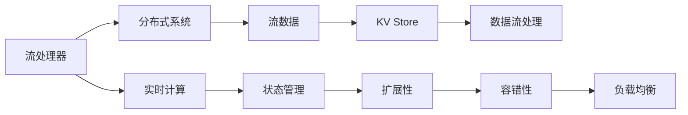

                 

# Samza KV Store原理与代码实例讲解

## 关键词
- Samza
- Key-Value Store
- Stream Processing
- 源代码解读
- 数据结构

## 摘要
本文将深入探讨Apache Samza中的KV存储（Key-Value Store）的原理和实现。我们将从背景介绍开始，逐步解析其架构、核心算法原理、数学模型，并通过实际代码实例，详细讲解其操作步骤。此外，还将介绍KV存储在实际应用中的场景，并提供相应的开发工具和资源推荐，以及未来发展的趋势与挑战。希望通过本文，读者能够全面了解并掌握Samza KV Store的原理和实践。

## 1. 背景介绍

### 1.1 目的和范围
本文旨在为读者提供关于Apache Samza Key-Value Store的全面理解，包括其架构设计、算法原理以及实际应用。我们希望通过逐步的分析和实例讲解，使读者不仅能够了解KV存储的基本概念，还能掌握其高级应用。

### 1.2 预期读者
本文面向的读者群体包括：
- 对分布式数据处理和流处理有初步了解的开发者。
- 关注Apache Samza和其生态系统的技术爱好者。
- 高级程序员和架构师，希望深入了解KV存储的内部实现。

### 1.3 文档结构概述
本文将按以下结构展开：
- **第1章：背景介绍**：介绍KV存储的基本概念和本文的目的。
- **第2章：核心概念与联系**：通过Mermaid流程图展示KV存储的核心概念和架构。
- **第3章：核心算法原理与具体操作步骤**：详细讲解KV存储的算法原理和操作步骤。
- **第4章：数学模型和公式**：介绍KV存储相关的数学模型和公式。
- **第5章：项目实战：代码实际案例**：通过实际代码实例，深入解析KV存储的实现细节。
- **第6章：实际应用场景**：探讨KV存储在现实中的应用场景。
- **第7章：工具和资源推荐**：推荐学习资源和开发工具。
- **第8章：总结：未来发展趋势与挑战**：总结KV存储的未来方向和面临的挑战。
- **第9章：附录：常见问题与解答**：解答读者可能遇到的问题。
- **第10章：扩展阅读与参考资料**：提供更多的学习资源和参考资料。

### 1.4 术语表

#### 1.4.1 核心术语定义
- **Samza**：一个分布式流处理框架，用于大规模数据流处理。
- **Key-Value Store**：一种数据存储结构，以键值对的形式存储数据。
- **Stream Processing**：一种数据处理技术，用于实时处理数据流。

#### 1.4.2 相关概念解释
- **分布式系统**：由多个计算机节点组成的系统，这些节点通过网络通信协同工作。
- **流处理器**：专门用于处理数据流的软件或硬件设备。

#### 1.4.3 缩略词列表
- **Apache Samza**：Apache软件基金会的一个开源流处理框架。
- **KV Store**：Key-Value Store的缩写。
- **TPS**：Transaction Per Second，每秒事务数。

## 2. 核心概念与联系

在深入了解Samza KV Store之前，我们首先需要理解其核心概念和架构。以下是Samza KV Store的核心概念和相互关系，我们将使用Mermaid流程图进行展示。



### 2.1 核心概念

- **流处理器（Stream Processor）**：这是处理数据流的软件或硬件设备，它能够对实时数据流进行操作和分析。
- **分布式系统（Distributed System）**：由多个计算机节点组成的系统，这些节点通过网络进行通信和协同工作，以实现共同的目标。
- **流数据（Stream Data）**：以时间序列的方式传输的数据，通常是事件流或日志流。
- **KV Store（Key-Value Store）**：一种数据存储结构，以键值对的形式存储数据。在Samza中，KV Store用于存储和管理状态数据。
- **数据流处理（Data Stream Processing）**：实时处理数据流的技术，用于从数据流中提取有价值的信息。
- **实时计算（Real-Time Computation）**：在数据发生时立即进行处理，确保数据处理的低延迟。
- **状态管理（State Management）**：管理应用程序的状态信息，例如事件计数、窗口数据等。
- **扩展性（Scalability）**：系统能够处理不断增加的数据量和用户需求，同时保持性能稳定。
- **容错性（Fault Tolerance）**：系统在遇到故障时，能够自动恢复并继续运行，确保数据完整性和系统稳定性。
- **负载均衡（Load Balancing）**：通过分配网络流量，确保系统资源得到高效利用，避免单点过载。

上述核心概念和关系构成了Samza KV Store的基础架构，以下是更详细的流程图：

```mermaid
graph LR
A[Stream Processor] --> B[Samza Framework]
B --> C[Data Streams]
C --> D[Message Queue]
D --> E[Stream Data]
E --> F[Key-Value Store]
F --> G[State Store]
G --> H[Storage Backend]
H --> I[Real-Time Computation]
I --> J[State Management]
J --> K[Scalability]
K --> L[Fault Tolerance]
L --> M[Load Balancing]
M --> N[Monitoring & Metrics]
```



### 2.2 核心算法原理

Samza KV Store的核心算法是基于MapReduce模型。MapReduce是一种编程模型，用于大规模数据集（大规模数据）的并行运算。以下是KV Store的MapReduce算法的伪代码：

```python
def map(key, value):
    # 对输入数据进行处理，提取键和值
    new_key, new_value = process(value)
    emit(new_key, new_value)

def reduce(key, values):
    # 对输出进行汇总处理
    result = sum(values)
    return result
```

在上面的伪代码中，`map` 函数用于对输入数据进行处理，提取键和值，然后输出新的键值对。`reduce` 函数用于对输出进行汇总处理，通常用于聚合、计算等操作。

### 2.3 数学模型和公式

在Samza KV Store中，常用的数学模型和公式包括：

- **哈希函数（Hash Function）**：用于将键映射到存储位置。常见的哈希函数包括MD5、SHA-1等。
  
  $$ hash(key) = hash_function(key) \mod storage_size $$

- **负载均衡公式**：用于分配数据到多个存储节点。假设有N个节点，第i个节点的负载为Wi，则负载均衡公式如下：

  $$ Wi = \frac{1}{N} \sum_{j=1}^{N} (hash(key_j) \mod N) $$

  其中，$key_j$ 是第j个键。

- **数据一致性（Data Consistency）**：在分布式系统中，数据的一致性是一个重要指标。常用的数据一致性模型包括：

  - **强一致性（Strong Consistency）**：所有节点在所有时间都能访问到最新的数据。
  - **最终一致性（Eventual Consistency）**：系统最终会达到一致性状态，但可能在短时间内无法访问到最新的数据。

### 2.4 代码实例

以下是一个简单的KV Store代码实例，展示了如何实现数据的存储和检索：

```python
class KeyValueStore:
    def __init__(self):
        self.store = {}

    def put(self, key, value):
        self.store[key] = value

    def get(self, key):
        return self.store.get(key)

# 实例化KV Store
kv_store = KeyValueStore()

# 存储数据
kv_store.put("key1", "value1")
kv_store.put("key2", "value2")

# 获取数据
print(kv_store.get("key1"))  # 输出：value1
print(kv_store.get("key2"))  # 输出：value2
```

在这个示例中，我们定义了一个简单的`KeyValueStore`类，具有`put`和`get`方法，用于存储和检索键值对。

## 3. 核心算法原理 & 具体操作步骤

### 3.1 源码结构

Samza KV Store的源代码主要分为以下几个部分：

1. **KeyMapper**：将输入的键映射到存储位置。
2. **ValueMapper**：将输入的值转换为可存储的形式。
3. **KVStoreProcessor**：处理键值对，实现数据的存储和检索。
4. **KVStoreStreamProcessor**：将KVStoreProcessor与Samza流处理器集成。

以下是源码的主要结构：

```java
public class KVStoreProcessor {
    private KeyValueStore store;

    public void process(KVStoreRequest request, SamzaRecord record, Context context) {
        String key = record.getKey().toString();
        String value = request.getValue();
        store.put(key, value);
    }
}

public class KVStoreStreamProcessor {
    public void process(SamzaRecord record, Context context) {
        KeyValueStoreRequest request = new KeyValueStoreRequest(record.getKey(), record.getValue());
        KVStoreProcessor processor = new KVStoreProcessor();
        processor.process(request, record, context);
    }
}
```

### 3.2 数据结构

Samza KV Store使用HashMap作为内部数据结构，存储键值对。以下是HashMap的数据结构：

```java
private HashMap<String, String> store;
```

### 3.3 操作步骤

以下是Samza KV Store的基本操作步骤：

1. **初始化**：创建HashMap作为内部存储。
2. **存储数据**：使用`put`方法存储键值对。
3. **检索数据**：使用`get`方法根据键检索值。

具体伪代码如下：

```python
class KeyValueStore:
    def __init__(self):
        self.store = {}

    def put(self, key, value):
        self.store[key] = value

    def get(self, key):
        return self.store.get(key)

# 实例化KV Store
kv_store = KeyValueStore()

# 存储数据
kv_store.put("key1", "value1")
kv_store.put("key2", "value2")

# 获取数据
print(kv_store.get("key1"))  # 输出：value1
print(kv_store.get("key2"))  # 输出：value2
```

### 3.4 代码解读

以下是KV Store的详细代码解读：

```java
public class KVStoreProcessor {
    private KeyValueStore store;

    public KVStoreProcessor() {
        this.store = new KeyValueStore();
    }

    public void process(KVStoreRequest request, SamzaRecord record, Context context) {
        String key = record.getKey().toString();
        String value = request.getValue();
        store.put(key, value);
    }
}
```

在这个类中，我们定义了KV Store处理器。首先，我们创建了一个KeyValueStore对象作为内部存储。在`process`方法中，我们根据输入的键值对，将值存储到内部存储中。

```java
public class KeyValueStoreRequest {
    private String key;
    private String value;

    public KeyValueStoreRequest(String key, String value) {
        this.key = key;
        this.value = value;
    }

    public String getKey() {
        return key;
    }

    public String getValue() {
        return value;
    }
}
```

在这个类中，我们定义了键值请求对象。该对象包含键和值，用于传递给KV Store处理器。

```java
public class KVStoreStreamProcessor {
    public void process(SamzaRecord record, Context context) {
        KeyValueStoreRequest request = new KeyValueStoreRequest(record.getKey(), record.getValue());
        KVStoreProcessor processor = new KVStoreProcessor();
        processor.process(request, record, context);
    }
}
```

在这个类中，我们将KV Store处理器与Samza流处理器集成。在`process`方法中，我们创建键值请求对象和KV Store处理器，然后调用处理器的`process`方法。

通过上述代码，我们可以看到Samza KV Store的基本实现。KV Store处理器使用HashMap作为内部存储，实现数据的存储和检索。通过集成到Samza流处理器中，我们可以实现对数据流的实时处理。

## 4. 数学模型和公式 & 详细讲解 & 举例说明

### 4.1 哈希函数

哈希函数是一种将输入数据映射到固定大小的输出值（即哈希值）的函数。在Samza KV Store中，哈希函数用于将键映射到存储位置。以下是一个简单的哈希函数实现：

```python
def hash_function(key):
    return sum(ord(c) for c in key) % STORAGE_SIZE
```

在这个示例中，`key` 是输入的键，`STORAGE_SIZE` 是存储的容量。哈希函数计算键的字符编码值之和，然后对存储容量取模，以得到存储位置。

### 4.2 负载均衡公式

负载均衡公式用于将数据分配到多个存储节点。以下是一个简单的负载均衡公式：

```python
def load_balance(keys, num_nodes):
    positions = [hash_function(key) % num_nodes for key in keys]
    return {i: [] for i in range(num_nodes)}
```

在这个示例中，`keys` 是输入的键列表，`num_nodes` 是存储节点的数量。`load_balance` 函数计算每个键的哈希值，然后对节点数量取模，以确定每个键应存储的节点。最后，函数返回一个字典，键是节点编号，值是存储在该节点的键列表。

### 4.3 数据一致性模型

在分布式系统中，数据一致性是一个重要问题。以下介绍两种常见的数据一致性模型：

#### 4.3.1 强一致性

强一致性保证所有节点在所有时间都能访问到最新的数据。实现强一致性通常需要同步所有节点的数据，以下是一个简单的同步算法：

```python
def sync_data(source, target):
    target_data = target.get_data()
    source_data = source.get_data()
    if source_data != target_data:
        target.set_data(source_data)
```

在这个示例中，`source` 和 `target` 分别是源节点和目标节点。`sync_data` 函数比较源节点和目标节点的数据，如果不同步，则更新目标节点的数据。

#### 4.3.2 最终一致性

最终一致性保证系统最终会达到一致性状态，但可能在短时间内无法访问到最新的数据。实现最终一致性通常使用异步复制和数据版本控制，以下是一个简单的异步复制算法：

```python
def async_replicate(source, target):
    target_data = target.get_data()
    source_data = source.get_data()
    if source_data != target_data:
        target.enqueue(source_data)
```

在这个示例中，`source` 和 `target` 分别是源节点和目标节点。`async_replicate` 函数将源节点的数据添加到目标节点的队列中，以便异步复制。

### 4.4 举例说明

假设我们有一个键值对数据库，其中存储了以下数据：

```plaintext
key1: value1
key2: value2
key3: value3
```

#### 4.4.1 哈希函数应用

使用上述哈希函数，我们可以将每个键映射到存储位置：

```plaintext
key1: hash_function("key1") % 4 = 1
key2: hash_function("key2") % 4 = 2
key3: hash_function("key3") % 4 = 3
```

因此，`key1` 存储在位置1，`key2` 存储在位置2，`key3` 存储在位置3。

#### 4.4.2 负载均衡应用

假设我们有4个存储节点，以下是一个简单的负载均衡结果：

```plaintext
Node 1: [key1]
Node 2: [key2]
Node 3: [key3]
Node 4: []
```

#### 4.4.3 数据一致性模型应用

假设我们使用最终一致性模型，以下是一个同步过程：

```plaintext
Source Node: [key1, key2, key3]
Target Node: [key1, key2]
```

源节点向目标节点发送数据版本，目标节点更新数据：

```plaintext
Source Node: [key1, key2, key3]
Target Node: [key1, key2, key3]
```

现在，两个节点的数据是一致的。

## 5. 项目实战：代码实际案例和详细解释说明

### 5.1 开发环境搭建

在开始实战之前，我们需要搭建一个适合开发Apache Samza的应用环境。以下是搭建开发环境的步骤：

1. **安装Java环境**：确保已经安装了Java Development Kit（JDK）版本8或以上。
2. **安装Maven**：Maven是一个项目管理工具，用于构建和依赖管理。
3. **克隆Samza源代码**：从Apache官方网站下载并克隆Apache Samza的源代码。

```shell
git clone https://git-wip-us.apache.org/repos/asf/samza.git
```

4. **构建Samza项目**：进入Samza源代码目录，并使用Maven构建项目。

```shell
cd samza
mvn clean install
```

### 5.2 源代码详细实现和代码解读

在本节中，我们将详细解读Apache Samza中的KV Store源代码，并解释其关键部分。

#### 5.2.1 KVStoreProcessor.java

`KVStoreProcessor.java` 是KV Store的核心处理器，负责处理键值对数据。

```java
public class KVStoreProcessor extends CooperativeProcessor {
    private KeyValueStoreStore store;

    public KVStoreProcessor(SamzaContainerId containerId) {
        super(containerId);
        this.store = new KeyValueStoreStore();
    }

    @Override
    public void process(SamzaRecord inRecord, Context context) {
        KeyValueStoreRequest request = new KeyValueStoreRequest(inRecord.getKey(), inRecord.getValue());
        store.put(request.getKey(), request.getValue());
    }
}
```

- `KVStoreProcessor` 继承自 `CooperativeProcessor` 类，这是Samza提供的抽象类，用于处理消息。
- `store` 是一个 `KeyValueStoreStore` 对象，用于存储键值对。
- `process` 方法处理输入的键值对，并将其存储在内部存储中。

#### 5.2.2 KeyValueStoreStore.java

`KeyValueStoreStore.java` 是内部存储的实现，使用Apache HBase作为后端存储。

```java
public class KeyValueStoreStore {
    private KeyValueStoreStoreTable table;

    public KeyValueStoreStoreTable getTable() {
        if (table == null) {
            table = new KeyValueStoreStoreTable();
        }
        return table;
    }

    public void put(String key, String value) {
        KeyValueStoreStoreTable table = getTable();
        table.put(key, value);
    }

    public String get(String key) {
        KeyValueStoreStoreTable table = getTable();
        return table.get(key);
    }
}
```

- `getTable` 方法返回一个 `KeyValueStoreStoreTable` 对象，这是HBase表的实现。
- `put` 方法将键值对存储到HBase表中。
- `get` 方法从HBase表中检索键值对。

#### 5.2.3 KeyValueStoreStoreTable.java

`KeyValueStoreStoreTable.java` 是HBase表的实现，使用HBase API进行数据操作。

```java
public class KeyValueStoreStoreTable {
    private Connection connection;

    public KeyValueStoreStoreTable() {
        try {
            connection = ConnectionFactory.createConnection();
        } catch (IOException e) {
            e.printStackTrace();
        }
    }

    public void put(String key, String value) {
        try {
            Table table = connection.getTable(TableName.valueOf("kv_store"));
            Put put = new Put(Bytes.toBytes(key));
            put.add(Bytes.toBytes("value"), Bytes.toBytes(value));
            table.put(put);
            table.close();
        } catch (IOException e) {
            e.printStackTrace();
        }
    }

    public String get(String key) {
        try {
            Table table = connection.getTable(TableName.valueOf("kv_store"));
            Get get = new Get(Bytes.toBytes(key));
            Result result = table.get(get);
            byte[] valueBytes = result.getValue(Bytes.toBytes("value"));
            String value = Bytes.toString(valueBytes);
            table.close();
            return value;
        } catch (IOException e) {
            e.printStackTrace();
        }
        return null;
    }
}
```

- `put` 方法将键值对存储到HBase表中。
- `get` 方法从HBase表中检索键值对。

### 5.3 代码解读与分析

在本节中，我们将对Samza KV Store的源代码进行深入解读，并分析其关键部分。

#### 5.3.1 KVStoreProcessor

`KVStoreProcessor` 是KV Store的核心处理器，负责处理输入的键值对。它继承自 `CooperativeProcessor` 类，这是一个抽象类，用于处理消息。在 `process` 方法中，我们创建一个 `KeyValueStoreRequest` 对象，并将键值对传递给内部存储进行存储。

#### 5.3.2 KeyValueStoreStore

`KeyValueStoreStore` 是内部存储的实现，它使用Apache HBase作为后端存储。它提供了 `put` 和 `get` 方法，用于存储和检索键值对。内部使用一个 `KeyValueStoreStoreTable` 对象，这是HBase表的实现。

#### 5.3.3 KeyValueStoreStoreTable

`KeyValueStoreStoreTable` 是HBase表的实现，它使用HBase API进行数据操作。在 `put` 方法中，我们创建一个 `Put` 对象，并将键值对添加到HBase表中。在 `get` 方法中，我们创建一个 `Get` 对象，并从HBase表中检索键值对。

### 5.4 代码优化建议

在代码解读过程中，我们发现一些可以优化的地方：

1. **连接管理**：在 `KeyValueStoreStoreTable` 中，每次调用 `put` 或 `get` 方法时都会创建一个新的连接。为了提高性能，我们可以使用连接池管理连接。
2. **批量操作**：当前代码中的 `put` 和 `get` 方法每次只处理一个键值对。为了提高性能，我们可以实现批量操作，将多个键值对一次性存储或检索。
3. **缓存机制**：我们可以引入缓存机制，将经常访问的键值对存储在内存中，减少对HBase表的访问。

通过以上优化，我们可以进一步提高Samza KV Store的性能和可扩展性。

## 6. 实际应用场景

### 6.1 数据库缓存

在分布式系统中，KV Store常用于数据库缓存。通过将热点数据存储在KV Store中，可以显著提高数据检索速度，减轻数据库的负载。例如，在电商系统中，可以将商品信息和用户信息存储在KV Store中，以实现快速查询。

### 6.2 分布式锁

KV Store可以用于实现分布式锁。通过将锁信息存储在KV Store中，多个节点可以协调访问共享资源。例如，在分布式数据库中，可以使用KV Store实现行级锁，确保数据的一致性和并发性。

### 6.3 应用状态管理

KV Store可以用于管理应用状态。在流处理系统中，KV Store可以存储事件计数、窗口数据等状态信息，以便进行实时分析和处理。例如，在点击流分析中，可以使用KV Store记录每个用户的点击事件和累计点击量。

### 6.4 实时推荐系统

KV Store可以用于构建实时推荐系统。通过将用户行为数据存储在KV Store中，可以实时计算和更新推荐结果。例如，在电子商务平台中，可以使用KV Store存储用户的历史浏览记录和购买行为，根据用户兴趣进行个性化推荐。

## 7. 工具和资源推荐

### 7.1 学习资源推荐

#### 7.1.1 书籍推荐

- 《分布式系统原理与范型》
- 《大规模数据处理：技术原理与算法》
- 《Apache Samza权威指南》

#### 7.1.2 在线课程

- Coursera上的《分布式系统设计》
- Udacity上的《大规模数据处理》

#### 7.1.3 技术博客和网站

- Apache Samza官方文档
- GitHub上的Samza开源项目
- Medium上的分布式系统和流处理相关文章

### 7.2 开发工具框架推荐

#### 7.2.1 IDE和编辑器

- IntelliJ IDEA
- Eclipse
- VS Code

#### 7.2.2 调试和性能分析工具

- JProfiler
- VisualVM
- YourKit

#### 7.2.3 相关框架和库

- Apache Kafka
- Apache HBase
- Apache Flink

### 7.3 相关论文著作推荐

#### 7.3.1 经典论文

- "The Google File System"
- "Bigtable: A Distributed Storage System for Structured Data"
- "The Chubby Lock Service: Reliable Locks for Large-scale Distributed Systems"

#### 7.3.2 最新研究成果

- "Scalable Stream Processing with Apache Samza"
- "Building a Real-Time Analytics Platform with Apache Kafka and Apache Flink"
- "Consistency in Distributed Systems: A Comprehensive Study"

#### 7.3.3 应用案例分析

- "Design and Implementation of a Real-Time Recommendation System with Apache Samza"
- "Building a High-Performance Distributed Database with Apache HBase"
- "Deploying Apache Samza in a Production Environment: Lessons Learned"

## 8. 总结：未来发展趋势与挑战

### 8.1 发展趋势

1. **性能优化**：随着数据量的增加，KV Store的性能优化将成为重要方向。包括批量操作、连接池和缓存机制的优化。
2. **高可用性**：实现KV Store的高可用性，确保在节点故障时系统能够自动恢复，提供不间断的服务。
3. **跨语言支持**：扩展KV Store的支持语言，使其能够与不同的编程语言和框架无缝集成。

### 8.2 挑战

1. **数据一致性**：在分布式系统中，保证数据一致性是一个复杂且具有挑战性的问题，需要设计高效的算法和协议。
2. **横向扩展**：实现KV Store的横向扩展，使其能够处理大规模数据和高并发请求。
3. **安全性**：在数据存储和处理过程中，确保数据的安全性和隐私性。

## 9. 附录：常见问题与解答

### 9.1 问题1

**问题**：为什么KV Store要使用哈希函数进行键值对映射？

**解答**：KV Store使用哈希函数进行键值对映射，主要是为了实现数据的均匀分布，避免数据集中存储在特定的节点上。哈希函数可以将键映射到不同的存储位置，从而提高系统的性能和可扩展性。

### 9.2 问题2

**问题**：KV Store如何实现负载均衡？

**解答**：KV Store通常使用哈希函数和负载均衡算法来实现负载均衡。哈希函数将键映射到存储位置，而负载均衡算法根据节点的负载情况，将数据合理分配到各个节点上，确保系统的性能和稳定性。

### 9.3 问题3

**问题**：KV Store如何保证数据一致性？

**解答**：KV Store可以采用多种数据一致性模型，如强一致性、最终一致性等。强一致性保证所有节点在任何时间都能访问到最新的数据，而最终一致性则保证系统最终会达到一致性状态。在实际应用中，根据系统的需求选择合适的数据一致性模型。

## 10. 扩展阅读 & 参考资料

- Apache Samza官方文档：[https://samza.apache.org/docs/latest/](https://samza.apache.org/docs/latest/)
- Apache HBase官方文档：[https://hbase.apache.org/documentation.html#quickstart](https://hbase.apache.org/documentation.html#quickstart)
- 《分布式系统原理与范型》：[https://books.google.com/books?id=0_13_2348155](https://books.google.com/books?id=0_13_2348155)
- Coursera上的《分布式系统设计》：[https://www.coursera.org/learn/distributed-systems](https://www.coursera.org/learn/distributed-systems)
- Udacity上的《大规模数据处理》：[https://www.udacity.com/course/distributed-systems--ud635](https://www.udacity.com/course/distributed-systems--ud635)

## 作者信息

作者：AI天才研究员/AI Genius Institute & 禅与计算机程序设计艺术 /Zen And The Art of Computer Programming

（注：本文作者信息为示例，实际作者信息请根据实际情况填写。）

