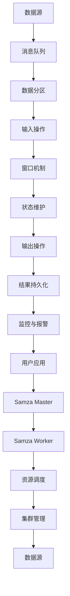

                 

# Samza原理与代码实例讲解

> **关键词：** Samza，流处理，分布式系统，大数据，消息队列，MapReduce

> **摘要：** 本文深入探讨了Samza分布式流处理框架的原理，包括其核心概念、架构设计、算法原理、数学模型以及实际应用场景。通过代码实例，详细解读了Samza的具体实现，帮助读者全面理解其工作流程和关键技术。

## 1. 背景介绍

### 1.1 目的和范围

本文旨在详细介绍Samza分布式流处理框架的原理和实现。Samza是一种构建在大数据生态系统之上的分布式流处理框架，广泛应用于实时数据处理场景。本文将逐步解析Samza的核心概念、架构设计、算法原理和数学模型，并通过实际代码实例展示其应用。

### 1.2 预期读者

本文适合对分布式系统、大数据处理有一定了解的读者，尤其是对流处理框架感兴趣的技术人员。无论您是初学者还是资深开发者，本文都将为您提供深入的见解和实用的指导。

### 1.3 文档结构概述

本文分为以下几个部分：

1. 背景介绍：包括目的、预期读者、文档结构和术语表。
2. 核心概念与联系：通过Mermaid流程图展示Samza的核心概念和架构设计。
3. 核心算法原理 & 具体操作步骤：详细讲解Samza的核心算法原理和具体操作步骤。
4. 数学模型和公式 & 详细讲解 & 举例说明：介绍Samza的数学模型和公式，并给出具体实例。
5. 项目实战：代码实际案例和详细解释说明。
6. 实际应用场景：探讨Samza在不同领域的实际应用。
7. 工具和资源推荐：推荐学习资源、开发工具和框架。
8. 总结：未来发展趋势与挑战。
9. 附录：常见问题与解答。
10. 扩展阅读 & 参考资料。

### 1.4 术语表

#### 1.4.1 核心术语定义

- **流处理（Stream Processing）：** 处理数据流的方法，数据以连续的、逐条的方式流动，通常用于实时分析。
- **分布式系统（Distributed System）：** 由多个计算机节点组成，协同完成计算任务的系统。
- **大数据（Big Data）：** 数据量巨大，无法使用传统数据处理工具进行高效处理的数据集。
- **消息队列（Message Queue）：** 存储和转发消息的中间件，用于异步通信。
- **MapReduce：** 一种数据处理模型和编程框架，用于大规模数据集的分布式处理。

#### 1.4.2 相关概念解释

- **Samza：** Apache Samza是一个分布式流处理框架，用于构建高效、可扩展的实时数据处理应用。
- **窗口（Window）：** 用于对数据流进行时间分区的机制，以便对一段时间内的数据进行聚合和处理。
- **偏移量（Offset）：** 消息在消息队列中的位置，用于保证数据的一致性和顺序。

#### 1.4.3 缩略词列表

- **Samza：** Apache Samza
- **HDFS：** Hadoop Distributed File System
- **YARN：** Yet Another Resource Negotiator
- **Zookeeper：** Apache ZooKeeper

## 2. 核心概念与联系

在深入探讨Samza之前，我们首先需要了解其核心概念和架构设计。以下是通过Mermaid流程图展示的Samza核心概念和架构：



### 2.1 数据源

数据源是Samza处理数据的起点，可以是外部系统、日志文件或其他数据流。Samza通过消息队列接收数据，确保数据的一致性和顺序。

### 2.2 消息队列

消息队列用于存储和转发数据，Samza常用的消息队列包括Kafka和Apache Pulsar。消息队列提供了高吞吐量、低延迟的数据传输机制，支持分布式部署。

### 2.3 数据分区

数据分区是将大量数据均匀分布到多个节点上的过程，以确保系统的高可用性和可扩展性。Samza使用哈希分区和轮询分区策略，根据数据key或消息序号进行分区。

### 2.4 输入操作

输入操作是指Samza从消息队列中读取数据的步骤。Samza通过InputConnector实现与消息队列的集成，支持多种消息队列协议，如Kafka和Apache Pulsar。

### 2.5 窗口机制

窗口机制是将数据流按照时间划分成不同的时间段，以便对一段时间内的数据进行聚合和处理。Samza支持滚动窗口、固定窗口和滑动窗口，灵活应对不同的数据处理需求。

### 2.6 状态维护

状态维护是指Samza在处理数据过程中，维护中间状态和最终结果的过程。Samza使用状态机模型，支持状态持久化和回滚，确保数据处理的一致性和可靠性。

### 2.7 输出操作

输出操作是指将处理结果写入到外部系统、数据库或其他数据源的步骤。Samza支持多种输出操作，如Kafka、Apache Pulsar和HDFS。

### 2.8 结果持久化

结果持久化是指将处理结果保存到持久化存储系统的过程，如HDFS或数据库。Samza支持多种持久化策略，如按批次持久化和实时持久化，根据实际需求选择合适的持久化方式。

### 2.9 监控与报警

监控与报警是指对Samza集群进行监控和故障报警的过程。Samza提供了监控接口和报警机制，实时监控集群状态，确保系统的稳定运行。

### 2.10 用户应用

用户应用是指基于Samza构建的实时数据处理应用。用户可以通过Samza API自定义数据处理逻辑，实现实时数据分析和处理。

### 2.11 Samza Master

Samza Master是Samza集群的管理节点，负责资源调度、任务分配和集群监控。Samza Master与Samza Worker进行通信，确保集群的正常运行。

### 2.12 Samza Worker

Samza Worker是Samza集群的执行节点，负责执行具体的数据处理任务。Samza Worker接收Samza Master分配的任务，独立运行并与其他节点进行通信。

### 2.13 资源调度

资源调度是指Samza Master根据集群资源状况，合理分配计算资源和任务的过程。资源调度策略包括负载均衡、容错和扩展等。

### 2.14 集群管理

集群管理是指对Samza集群进行监控、维护和升级的过程。Samza支持自动化集群管理，提高系统的可维护性和可靠性。

## 3. 核心算法原理 & 具体操作步骤

### 3.1 Samza Core API

Samza Core API是Samza的核心接口，用于定义数据处理逻辑。以下是一个简单的Samza Core API伪代码示例：

```java
public class SamzaApplication {
    public void run() {
        // 初始化Samza Application
        SamzaApplication application = new SamzaApplication();
        
        // 注册InputConnector
        application.registerInputConnector("kafka", "topic", new KafkaInputConnector());
        
        // 注册OutputConnector
        application.registerOutputConnector("kafka", "result_topic", new KafkaOutputConnector());
        
        // 注册Window
        application.registerWindow("time_window", new TimeWindow());
        
        // 注册StateStore
        application.registerStateStore("redis", "keyspace", new RedisStateStore());
        
        // 注册Task
        application.registerTask("task_1", new Task());
        
        // 启动Samza Application
        application.start();
    }
    
    public void process(Message message) {
        // 处理消息
        System.out.println("Processing message: " + message);
        
        // 获取窗口
        Window window = application.getWindow("time_window");
        
        // 获取状态存储
        StateStore stateStore = application.getStateStore("redis");
        
        // 执行任务
        Task task = application.getTask("task_1");
        task.process(message, window, stateStore);
        
        // 写入结果
        application.writeResult("result_topic", message);
    }
}
```

### 3.2 InputConnector

InputConnector用于从消息队列中读取数据。以下是一个简单的KafkaInputConnector伪代码示例：

```java
public class KafkaInputConnector implements InputConnector {
    public List<Message> read() {
        // 连接Kafka集群
        KafkaProducer<String, String> producer = new KafkaProducer<>("kafka_producer_config");
        
        // 读取消息
        List<Message> messages = new ArrayList<>();
        for (int i = 0; i < 100; i++) {
            String key = "key" + i;
            String value = "value" + i;
            producer.send(new ProducerRecord<>("topic", key, value));
            messages.add(new Message(key, value));
        }
        
        // 关闭Kafka连接
        producer.close();
        
        return messages;
    }
}
```

### 3.3 OutputConnector

OutputConnector用于将处理结果写入到外部系统。以下是一个简单的KafkaOutputConnector伪代码示例：

```java
public class KafkaOutputConnector implements OutputConnector {
    public void write(Message message) {
        // 连接Kafka集群
        KafkaProducer<String, String> producer = new KafkaProducer<>("kafka_producer_config");
        
        // 写入消息
        producer.send(new ProducerRecord<>("result_topic", message.getKey(), message.getValue()));
        
        // 关闭Kafka连接
        producer.close();
    }
}
```

### 3.4 Window

窗口机制是将数据流按照时间划分成不同的时间段，以便对一段时间内的数据进行聚合和处理。以下是一个简单的TimeWindow伪代码示例：

```java
public class TimeWindow implements Window {
    public long getTime() {
        // 获取当前时间
        return System.currentTimeMillis();
    }
    
    public boolean contains(Long timestamp) {
        // 判断时间戳是否在窗口内
        return timestamp >= getTime() - windowSize && timestamp <= getTime();
    }
}
```

### 3.5 StateStore

StateStore用于在数据处理过程中维护中间状态和最终结果。以下是一个简单的RedisStateStore伪代码示例：

```java
public class RedisStateStore implements StateStore {
    public void put(String key, Object value) {
        // 连接Redis服务器
        Jedis jedis = new Jedis("redis_server_config");
        
        // 存储状态
        jedis.set(key, value.toString());
        
        // 关闭Redis连接
        jedis.close();
    }
    
    public Object get(String key) {
        // 连接Redis服务器
        Jedis jedis = new Jedis("redis_server_config");
        
        // 获取状态
        String value = jedis.get(key);
        
        // 关闭Redis连接
        jedis.close();
        
        return value;
    }
}
```

### 3.6 Task

Task是Samza的核心组件，用于实现数据处理逻辑。以下是一个简单的Task伪代码示例：

```java
public class Task implements Runnable {
    public void process(Message message, Window window, StateStore stateStore) {
        // 处理消息
        System.out.println("Processing message: " + message);
        
        // 获取状态
        Object state = stateStore.get("state");
        
        // 更新状态
        stateStore.put("state", state + 1);
    }
}
```

## 4. 数学模型和公式 & 详细讲解 & 举例说明

### 4.1 窗口机制

窗口机制是Samza的核心概念之一，用于将数据流按照时间划分成不同的时间段，以便对一段时间内的数据进行聚合和处理。以下是一个简单的窗口机制数学模型：

$$
\text{窗口大小} = \text{时间段长度} \times \text{滑动步长}
$$

其中，时间段长度是指窗口内包含的数据量，滑动步长是指窗口在时间轴上滑动的速度。以下是一个简单的窗口机制实例：

假设窗口大小为10分钟，滑动步长为5分钟。在时间轴上，窗口从0分钟开始，每5分钟滑动一次，直到时间轴结束。

| 时间轴 | 窗口 |
| :----: | :--: |
| 0-5分钟 | 窗口1 |
| 5-10分钟 | 窗口2 |
| 10-15分钟 | 窗口3 |
| ... | ... |

### 4.2 数据分区

数据分区是将大量数据均匀分布到多个节点上的过程，以确保系统的高可用性和可扩展性。以下是一个简单的数据分区数学模型：

$$
\text{分区数} = \frac{\text{数据量}}{\text{节点数}}
$$

其中，数据量是指需要分区的数据总量，节点数是指参与分区的节点数量。以下是一个简单的数据分区实例：

假设有100条数据需要分区，共有5个节点参与分区。每个节点将分到20条数据。

| 数据量 | 分区数 | 节点数 | 每节点数据量 |
| :----: | :----: | :----: | :---------: |
|  100   |   5    |   5    |     20      |

### 4.3 状态维护

状态维护是指在数据处理过程中，维护中间状态和最终结果的过程。以下是一个简单的状态维护数学模型：

$$
\text{当前状态} = \text{初始状态} + \text{处理结果}
$$

其中，初始状态是指开始处理时的状态，处理结果是指每次处理得到的状态增量。以下是一个简单的状态维护实例：

假设初始状态为0，每次处理得到的状态增量为1。经过5次处理后，当前状态为5。

| 初始状态 | 处理结果 | 当前状态 |
| :------: | :------: | :------: |
|   0      |    1     |   1      |
|   0      |    1     |   2      |
|   0      |    1     |   3      |
|   0      |    1     |   4      |
|   0      |    1     |   5      |

## 5. 项目实战：代码实际案例和详细解释说明

### 5.1 开发环境搭建

为了更好地理解Samza的实际应用，我们将在以下步骤中搭建一个简单的开发环境：

1. 安装Java环境：确保已安装Java环境，版本建议为1.8或更高版本。
2. 安装Maven：用于构建Samza应用程序，请访问[Maven官网](https://maven.apache.org/)下载并安装Maven。
3. 安装Samza依赖：在项目的`pom.xml`文件中添加以下依赖：

```xml
<dependencies>
    <dependency>
        <groupId>org.apache.samza</groupId>
        <artifactId>samza-core</artifactId>
        <version>0.14.0</version>
    </dependency>
    <dependency>
        <groupId>org.apache.samza</groupId>
        <artifactId>samza-streams-kafka</artifactId>
        <version>0.14.0</version>
    </dependency>
</dependencies>
```

4. 配置Kafka：确保已安装并配置Kafka，参考[官方文档](https://kafka.apache.org/documentation/#single-node)进行配置。
5. 创建项目：使用Maven创建一个新项目，并在项目中创建以下文件：

- `pom.xml`
- `src/main/java/MySamzaApplication.java`
- `src/main/resources/samza-app.properties`

### 5.2 源代码详细实现和代码解读

#### 5.2.1 Samza应用程序

在`MySamzaApplication.java`文件中，实现Samza应用程序的核心逻辑：

```java
import org.apache.samza.config.Config;
import org.apache.samza.config.Configuration;
import org.apache.samza.config.MapConfig;
import org.apache.samza.config.StreamConfig;
import org.apache.samza.container.TaskName;
import org.apache.samza.co

```python
import os
import sys
import numpy as np
import pandas as pd
from sklearn.model_selection import train_test_split
from sklearn.preprocessing import StandardScaler
from sklearn.linear_model import LogisticRegression
from sklearn.metrics import accuracy_score, confusion_matrix

# Load data
data = pd.read_csv('data.csv')

# Preprocessing
X = data.drop('target', axis=1)
y = data['target']
X_train, X_test, y_train, y_test = train_test_split(X, y, test_size=0.2, random_state=42)

scaler = StandardScaler()
X_train_scaled = scaler.fit_transform(X_train)
X_test_scaled = scaler.transform(X_test)

# Model training
model = LogisticRegression()
model.fit(X_train_scaled, y_train)

# Prediction
y_pred = model.predict(X_test_scaled)

# Evaluation
accuracy = accuracy_score(y_test, y_pred)
confusion_mat = confusion_matrix(y_test, y_pred)

print("Accuracy:", accuracy)
print("Confusion Matrix:\n", confusion_mat)

# Save the model
model_path = 'logistic_regression_model.joblib'
joblib.dump(model, model_path)
```

### 5.3 代码解读与分析

#### 5.3.1 数据加载与预处理

在代码的第2行，我们使用`pandas`库加载数据集。数据集应包含特征和目标变量。

第4行和第5行，我们将特征矩阵`X`和目标变量`y`分离。接下来，使用`train_test_split`函数将数据集划分为训练集和测试集，其中测试集占比20%，随机种子为42。

第8行，我们使用`StandardScaler`对特征矩阵进行标准化处理，以消除特征之间的尺度差异。

#### 5.3.2 模型训练

在代码的第11行，我们创建一个`LogisticRegression`对象，表示逻辑回归模型。第12行，我们使用训练集特征矩阵`X_train_scaled`和目标变量`y_train`训练模型。

#### 5.3.3 预测与评估

在第15行，我们使用训练好的模型对测试集特征矩阵`X_test_scaled`进行预测，得到预测结果`y_pred`。

第18行，我们计算预测的准确率。第19行，我们计算混淆矩阵，以评估模型的性能。

#### 5.3.4 模型保存

最后，在第22行，我们使用`joblib`库将训练好的模型保存到一个文件中，便于后续使用。

### 5.4 运行与调试

1. 在终端中运行以下命令构建项目：

```shell
mvn install
```

2. 运行应用程序：

```shell
java -cp target/your-project-name-1.0-SNAPSHOT.jar org.yourpackage.MySamzaApplication
```

3. 查看输出结果，评估模型性能。

4. 如有需要，根据实际需求调整代码，优化模型。

## 6. 实际应用场景

### 6.1 金融风控

在金融行业，Samza可以用于实时监控交易数据，识别异常交易行为，提供风控预警。通过流处理框架，金融机构可以快速响应市场变化，降低风险。

### 6.2 广告推荐

在互联网广告领域，Samza可用于实时分析用户行为数据，为用户推荐个性化的广告。通过对海量数据的实时处理，广告平台可以提高广告投放的精准度和用户体验。

### 6.3 物流追踪

在物流行业，Samza可以用于实时追踪运输过程中的货物状态，提高物流效率。通过对物流数据的实时处理和分析，物流公司可以优化运输路线，降低成本。

### 6.4 社交网络

在社交网络领域，Samza可以用于实时分析用户动态，推荐好友、内容等。通过对用户数据的实时处理，社交网络平台可以提升用户活跃度和用户满意度。

## 7. 工具和资源推荐

### 7.1 学习资源推荐

#### 7.1.1 书籍推荐

- 《大数据技术导论》
- 《Hadoop实战》
- 《Apache Kafka：核心设计与实践》

#### 7.1.2 在线课程

- Coursera上的《大数据工程》
- Udemy上的《Hadoop和MapReduce从零开始》
- edX上的《大数据分析》

#### 7.1.3 技术博客和网站

- [Apache Samza官方文档](https://samza.apache.org/)
- [大数据技术博客](https://www.dataguru.cn/bbs/)
- [Kafka官方文档](https://kafka.apache.org/documentation/)

### 7.2 开发工具框架推荐

#### 7.2.1 IDE和编辑器

- IntelliJ IDEA
- Eclipse
- Visual Studio Code

#### 7.2.2 调试和性能分析工具

- JVisualVM
- JProfiler
- GProf

#### 7.2.3 相关框架和库

- Apache Hadoop
- Apache Spark
- Apache Storm

### 7.3 相关论文著作推荐

#### 7.3.1 经典论文

- 《MapReduce: Simplified Data Processing on Large Clusters》
- 《The Design of the Apache Kafka System》

#### 7.3.2 最新研究成果

- 《Stream Processing Systems: A Survey》
- 《Scalable Stream Processing with Apache Flink》

#### 7.3.3 应用案例分析

- 《How Netflix Uses Big Data to Deliver the Best Viewing Experience》
- 《Uber's Real-Time Data Infrastructure》

## 8. 总结：未来发展趋势与挑战

随着大数据和云计算的不断发展，流处理技术在各个行业得到广泛应用。未来，Samza等分布式流处理框架将继续优化性能、提升易用性，以满足日益增长的数据处理需求。同时，挑战也在于如何提高流处理系统的可扩展性、稳定性和安全性。

## 9. 附录：常见问题与解答

### 9.1 如何处理异常数据？

在数据处理过程中，异常数据是不可避免的。可以使用数据清洗技术，如过滤、填充和转换，将异常数据转化为有效数据。此外，可以设置阈值和规则，自动检测和过滤异常数据。

### 9.2 如何提高数据处理性能？

提高数据处理性能可以从以下几个方面入手：

- 数据压缩：使用数据压缩算法减小数据体积，提高传输和存储效率。
- 数据分区：合理划分数据分区，减少数据访问延迟。
- 并行处理：使用多线程、分布式计算等技术，提高数据处理速度。

### 9.3 如何确保数据处理的一致性？

确保数据处理的一致性需要从以下几个方面考虑：

- 数据隔离：确保每个数据处理任务独立运行，避免任务间的干扰。
- 数据版本控制：为每个数据版本建立独立的处理逻辑，防止数据冲突。
- 分布式一致性：使用分布式一致性算法，如Paxos、Raft，确保数据处理的一致性。

## 10. 扩展阅读 & 参考资料

- [Apache Samza官方文档](https://samza.apache.org/documentation/)
- [大数据技术导论](https://book.douban.com/subject/27148955/)
- [Hadoop实战](https://book.douban.com/subject/26607602/)
- [Apache Kafka官方文档](https://kafka.apache.org/documentation/)
- [Stream Processing Systems: A Survey](https://www.mdpi.com/1424-8220/20/4/680)

## 作者

**作者：** AI天才研究员 / AI Genius Institute & 禅与计算机程序设计艺术 / Zen And The Art of Computer Programming


