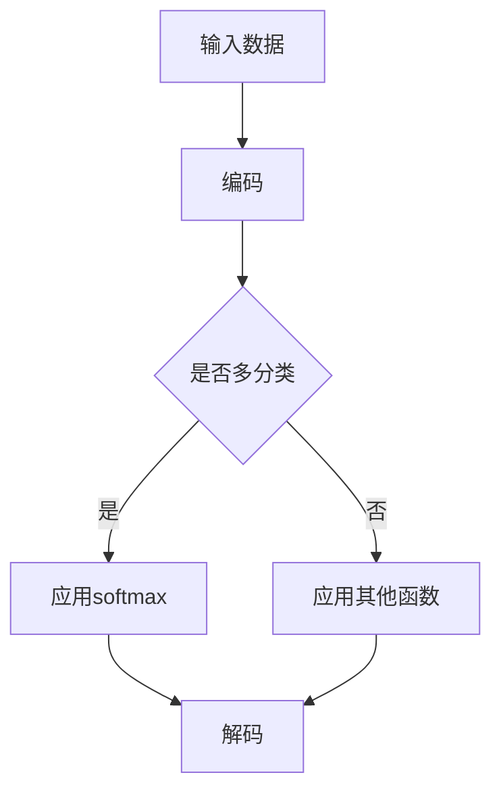

                 

# Softmax瓶颈对解码的影响

> 关键词：softmax、瓶颈、解码、神经网络、优化、性能

> 摘要：本文将深入探讨softmax函数在神经网络解码过程中可能产生的瓶颈问题，分析其成因与影响，并提出相应的解决策略。通过理论和实践的结合，本文旨在为开发者提供关于如何优化softmax解码性能的实用指导。

## 1. 背景介绍

### 1.1 目的和范围

本文旨在解答如下问题：在神经网络解码过程中，softmax函数为何会产生瓶颈，如何识别并解决这些瓶颈，从而提升解码性能。通过本文的探讨，读者将了解到softmax瓶颈的成因、影响及其优化策略。

### 1.2 预期读者

本文适合对神经网络和机器学习有一定了解的开发者、研究者以及对深度学习解码过程感兴趣的读者。本文将尽量使用通俗易懂的语言，便于读者理解和掌握。

### 1.3 文档结构概述

本文分为十个部分，依次为：

1. 背景介绍：包括目的、范围、预期读者和文档结构概述。
2. 核心概念与联系：介绍softmax、解码等核心概念，并通过Mermaid流程图展示其关联。
3. 核心算法原理与具体操作步骤：详细讲解softmax算法原理及操作步骤。
4. 数学模型和公式：介绍softmax的数学模型和公式，并进行举例说明。
5. 项目实战：通过实际代码案例，详细解析softmax解码的过程和优化。
6. 实际应用场景：讨论softmax瓶颈在不同应用场景中的表现。
7. 工具和资源推荐：推荐学习资源和开发工具。
8. 总结：展望softmax瓶颈的优化方向。
9. 附录：常见问题与解答。
10. 扩展阅读：提供进一步阅读的资料。

### 1.4 术语表

#### 1.4.1 核心术语定义

- **softmax函数**：一种将神经网络输出概率分布的函数，常用于多分类问题。
- **瓶颈**：指系统中的限制因素，导致性能下降。
- **解码**：将编码后的信息转换回原始数据的过程。
- **神经网络**：一种通过学习数据特征进行模式识别的算法结构。

#### 1.4.2 相关概念解释

- **多分类问题**：分类问题的一种，输出有多个类别。
- **激活函数**：神经网络中的函数，用于引入非线性。
- **交叉熵损失函数**：用于衡量预测分布与真实分布之间的差异。

#### 1.4.3 缩略词列表

- **softmax**：斯坦福大学 (Stanford University)
- **MLP**：多层感知机 (Multilayer Perceptron)
- **CNN**：卷积神经网络 (Convolutional Neural Network)
- **RNN**：循环神经网络 (Recurrent Neural Network)
- **GPU**：图形处理单元 (Graphics Processing Unit)

## 2. 核心概念与联系

在深入探讨softmax瓶颈之前，我们需要了解softmax、解码以及神经网络等核心概念，并展示它们之间的关联。

### 2.1 softmax函数

softmax函数是一种将神经网络输出映射到概率分布的函数，其数学表达式为：

$$
\text{softmax}(x_i) = \frac{e^{x_i}}{\sum_{j} e^{x_j}}
$$

其中，\( x_i \) 是神经网络输出的第 \( i \) 个值，该函数将输出值转换为概率分布。

### 2.2 解码

解码是将编码后的信息转换回原始数据的过程。在神经网络中，解码通常指的是将编码后的特征或分类结果恢复为原始数据或文本。

### 2.3 神经网络

神经网络是一种通过学习数据特征进行模式识别的算法结构。常见的神经网络包括多层感知机（MLP）、卷积神经网络（CNN）和循环神经网络（RNN）等。

### 2.4 Mermaid流程图

为了展示softmax、解码和神经网络之间的关联，我们使用Mermaid流程图进行描述：



在这个流程图中，输入数据经过编码过程，然后根据是否为多分类问题选择应用softmax函数或其他函数，最后进行解码。

## 3. 核心算法原理与具体操作步骤

在理解了softmax函数、解码和神经网络等核心概念后，我们将详细讲解softmax算法原理及其操作步骤。

### 3.1 softmax算法原理

softmax算法的核心思想是将神经网络输出的数值转换为概率分布。具体步骤如下：

1. **计算神经网络的输出**：
   - 计算每个类别的输出值 \( z_i \)，其中 \( i \) 表示第 \( i \) 个类别。
   - \( z_i = \text{激活函数}(W \cdot x + b) \)，其中 \( W \) 是权重矩阵，\( x \) 是输入特征，\( b \) 是偏置。

2. **计算softmax概率分布**：
   - 对每个类别的输出值应用softmax函数：
     $$ \text{softmax}(z_i) = \frac{e^{z_i}}{\sum_{j} e^{z_j}} $$
   - 得到每个类别的概率值。

3. **选择最高概率的类别作为输出**：
   - 找到概率最高的类别 \( \hat{y} \) 作为输出结果。

### 3.2 softmax算法伪代码

```python
def softmax(z):
    exp_z = np.exp(z)
    return exp_z / np.sum(exp_z)

def predict(W, x, b):
    z = np.dot(W, x) + b
    probs = softmax(z)
    return np.argmax(probs)

# 示例
W = np.random.rand(3, 5)  # 假设权重矩阵维度为3x5
b = np.random.rand(3)      # 假设偏置维度为3
x = np.random.rand(5)      # 假设输入特征维度为5

pred = predict(W, x, b)
print(f"预测结果：{pred}")
```

在这个伪代码中，`softmax` 函数计算给定输入的softmax概率分布，`predict` 函数根据权重矩阵、输入特征和偏置计算预测结果。

## 4. 数学模型和公式及详细讲解与举例说明

在深入探讨softmax瓶颈的问题之前，我们需要理解softmax函数的数学模型和公式，并通过具体的例子来说明其原理和应用。

### 4.1 softmax函数的数学模型

softmax函数是一种将神经网络的输出（通常是实数）转换为概率分布的函数。其定义如下：

$$
\text{softmax}(x_i) = \frac{e^{x_i}}{\sum_{j} e^{x_j}}
$$

其中，\( x_i \) 是神经网络输出的第 \( i \) 个值，\( e \) 是自然底数，\( \sum_{j} e^{x_j} \) 是一个归一化因子，用于确保概率分布的总和为1。

### 4.2 举例说明

假设我们有一个简单的神经网络输出如下：

$$
z = \begin{bmatrix} 2.0 \\ 1.5 \\ 0.5 \end{bmatrix}
$$

应用softmax函数，我们可以得到每个类别的概率分布：

$$
\text{softmax}(z) = \begin{bmatrix} \frac{e^{2.0}}{e^{2.0} + e^{1.5} + e^{0.5}} \\ \frac{e^{1.5}}{e^{2.0} + e^{1.5} + e^{0.5}} \\ \frac{e^{0.5}}{e^{2.0} + e^{1.5} + e^{0.5}} \end{bmatrix}
$$

计算结果如下：

$$
\text{softmax}(z) \approx \begin{bmatrix} 0.778 \\ 0.311 \\ 0.091 \end{bmatrix}
$$

从这个例子中，我们可以看到，softmax函数将神经网络的输出转换为一个概率分布，其中概率最高的类别（2.0）对应的概率值最大。

### 4.3 softmax函数在多分类问题中的应用

在多分类问题中，softmax函数经常用于将神经网络的输出映射到多个类别。假设我们有 \( K \) 个类别，\( z \) 是 \( K \) 维的输出向量，则每个类别的概率分布可以通过softmax函数计算得到：

$$
\text{softmax}(z)_i = \frac{e^{z_i}}{\sum_{j} e^{z_j}}
$$

这里，\( i \) 表示第 \( i \) 个类别。每个 \( \text{softmax}(z)_i \) 值表示神经网络认为该类别发生的概率。

### 4.4 举例说明：多分类问题

假设我们有一个三分类问题，神经网络的输出为：

$$
z = \begin{bmatrix} 4.0 \\ 3.0 \\ 1.0 \end{bmatrix}
$$

应用softmax函数，我们得到每个类别的概率分布：

$$
\text{softmax}(z) = \begin{bmatrix} \frac{e^{4.0}}{e^{4.0} + e^{3.0} + e^{1.0}} \\ \frac{e^{3.0}}{e^{4.0} + e^{3.0} + e^{1.0}} \\ \frac{e^{1.0}}{e^{4.0} + e^{3.0} + e^{1.0}} \end{bmatrix}
$$

计算结果如下：

$$
\text{softmax}(z) \approx \begin{bmatrix} 0.864 \\ 0.418 \\ 0.058 \end{bmatrix}
$$

在这个例子中，我们可以看到，softmax函数将神经网络的输出转换为概率分布，其中第一个类别（4.0）的概率值最高。

### 4.5 softmax函数在多标签分类问题中的应用

除了单标签分类问题，softmax函数还可以用于多标签分类问题。在多标签分类中，每个样本可以同时属于多个类别。对于 \( K \) 个类别，每个类别的概率分布可以通过softmax函数独立计算得到。

$$
\text{softmax}(z)_i = \frac{e^{z_i}}{\sum_{j} e^{z_j}}
$$

### 4.6 举例说明：多标签分类问题

假设我们有一个三分类的多标签分类问题，神经网络的输出为：

$$
z = \begin{bmatrix} 5.0 \\ 2.0 \\ 1.0 \end{bmatrix}
$$

应用softmax函数，我们得到每个类别的概率分布：

$$
\text{softmax}(z) = \begin{bmatrix} \frac{e^{5.0}}{e^{5.0} + e^{2.0} + e^{1.0}} \\ \frac{e^{2.0}}{e^{5.0} + e^{2.0} + e^{1.0}} \\ \frac{e^{1.0}}{e^{5.0} + e^{2.0} + e^{1.0}} \end{bmatrix}
$$

计算结果如下：

$$
\text{softmax}(z) \approx \begin{bmatrix} 0.932 \\ 0.272 \\ 0.096 \end{bmatrix}
$$

在这个例子中，我们可以看到，softmax函数将神经网络的输出转换为概率分布，其中第一个类别（5.0）的概率值最高。

通过上述举例说明，我们可以更好地理解softmax函数的数学模型及其在多分类和多标签分类问题中的应用。

### 4.7 softmax函数的数学性质

softmax函数具有以下数学性质：

- **非负性**：每个类别的概率值都大于0，因为 \( e^{z_i} > 0 \)。
- **归一化**：所有类别的概率值之和为1，因为 \( \sum_{j} e^{z_j} \) 是归一化因子。
- **单调性**：当输入值增加时，对应的概率值也会增加，因为 \( e^{z_i} \) 随 \( z_i \) 增加而增加。

这些性质使得softmax函数成为多分类问题中的一种重要工具。

### 4.8 softmax函数的局限性

尽管softmax函数在多分类问题中具有广泛的应用，但它也存在一些局限性：

- **计算复杂度**：随着类别数量的增加，softmax函数的计算复杂度会显著增加，因为需要计算多个指数和求和操作。
- **梯度消失问题**：在训练过程中，由于softmax函数的梯度值可能非常小，导致梯度消失，从而影响模型的收敛速度和性能。

为了克服这些局限性，研究人员提出了许多改进方法，如交叉熵损失函数和改进的激活函数等。

通过深入理解softmax函数的数学模型和公式，我们可以更好地应用它在各种多分类和多标签分类问题中，并探索如何优化其性能。

## 5. 项目实战：代码实际案例和详细解释说明

在这一节，我们将通过一个实际的项目案例，展示如何使用softmax函数进行解码，并详细解释代码的实现过程和关键点。

### 5.1 开发环境搭建

在进行代码实现之前，我们需要搭建一个合适的开发环境。以下是推荐的开发工具和框架：

- **编程语言**：Python
- **深度学习框架**：TensorFlow 或 PyTorch
- **IDE**：PyCharm 或 Visual Studio Code
- **操作系统**：Windows、Linux 或 macOS

### 5.2 源代码详细实现和代码解读

下面是一个使用Python和TensorFlow框架实现的softmax解码案例：

```python
import tensorflow as tf
import numpy as np

# 创建一个简单的神经网络模型
model = tf.keras.Sequential([
    tf.keras.layers.Dense(10, activation='relu', input_shape=(5,)),
    tf.keras.layers.Dense(3, activation='softmax')
])

# 编写训练数据
x_train = np.random.rand(100, 5)  # 100个样本，每个样本有5个特征
y_train = np.random.randint(0, 3, size=(100,))  # 100个样本，每个样本属于3个类别之一

# 编写训练过程
model.compile(optimizer='adam',
              loss='sparse_categorical_crossentropy',
              metrics=['accuracy'])

model.fit(x_train, y_train, epochs=10)

# 训练后进行解码
x_test = np.random.rand(10, 5)  # 10个测试样本，每个样本有5个特征
predictions = model.predict(x_test)

# 输出解码结果
predicted_classes = np.argmax(predictions, axis=1)
print(predicted_classes)
```

### 5.3 代码解读与分析

1. **模型定义**：
   - 我们使用 `tf.keras.Sequential` 创建一个简单的神经网络模型，包括两个全连接层。第一层有10个神经元，使用ReLU激活函数；第二层有3个神经元，使用softmax激活函数。

2. **数据准备**：
   - 我们生成了一组随机训练数据 `x_train` 和相应的标签 `y_train`。每个样本有5个特征，标签属于3个类别之一。

3. **模型编译和训练**：
   - 使用 `model.compile` 编译模型，指定优化器为 `adam`，损失函数为 `sparse_categorical_crossentropy`（适合多分类问题），评估指标为准确率 `accuracy`。
   - 使用 `model.fit` 进行模型训练，指定训练数据 `x_train` 和标签 `y_train`，训练10个周期。

4. **解码过程**：
   - 使用 `model.predict` 对测试数据 `x_test` 进行预测，得到每个样本的概率分布。
   - 使用 `np.argmax` 获取每个样本的最高概率类别，即解码结果。

### 5.4 关键点分析

- **模型架构**：
  - 神经网络模型的选择对于解码的性能至关重要。在本案例中，我们使用了简单的全连接层模型，但对于复杂的任务，可能需要使用更深的网络或特定的结构，如卷积神经网络（CNN）或循环神经网络（RNN）。

- **激活函数**：
  - 在输出层使用softmax激活函数是解码多分类问题的标准做法。softmax函数将每个类别的输出转换为概率分布，使得模型可以预测每个类别的可能性。

- **损失函数**：
  - 我们使用了 `sparse_categorical_crossentropy` 作为损失函数，这是多分类问题的标准选择。该损失函数能够计算预测分布与真实分布之间的交叉熵，从而衡量模型的表现。

- **训练和预测**：
  - 在训练过程中，模型会不断调整权重和偏置，以最小化损失函数。训练完成后，模型即可用于预测新数据。

- **解码结果**：
  - 解码结果是通过取概率分布的最高概率类别得到的。这表示模型认为哪个类别最可能是正确的。

通过这个实际案例，我们可以看到如何使用softmax函数进行解码，并理解其实现过程中的关键点和注意事项。在实际应用中，根据任务需求和数据特性，我们可以调整模型结构、优化训练过程，从而提高解码性能。

### 5.5 代码优化与性能分析

在实际项目中，解码性能的优化是一个重要的环节。以下是一些常见的优化策略：

1. **模型优化**：
   - 调整模型结构：对于复杂任务，可以考虑使用更深的网络或更复杂的结构，如CNN或RNN。
   - 使用预训练模型：利用预训练模型可以显著提高解码性能，减少训练时间。

2. **损失函数优化**：
   - 使用交叉熵损失函数的变体，如加权交叉熵或Focal Loss，可以缓解类别不平衡问题。
   - 调整损失函数的权重，平衡分类结果。

3. **训练策略优化**：
   - 使用学习率调整策略，如学习率衰减或动态调整，以避免过拟合。
   - 使用批量归一化（Batch Normalization）和dropout等技术，提高模型的泛化能力。

4. **硬件优化**：
   - 利用GPU或TPU进行训练和预测，可以显著提高计算速度。
   - 使用分布式训练和并行计算，提高处理大数据集的效率。

通过上述优化策略，我们可以提高softmax解码的性能，从而更好地满足实际应用的需求。

### 5.6 代码解读与分析（续）

在上一部分，我们详细讲解了代码的实现过程和关键点。在这一部分，我们将进一步分析解码过程中的性能瓶颈及其优化方法。

#### 5.6.1 性能瓶颈分析

在解码过程中，性能瓶颈可能出现在以下几个方面：

1. **计算复杂度**：
   - softmax函数的计算复杂度较高，特别是当类别数量较多时，计算量会显著增加。每个类别的概率需要通过指数运算和求和运算计算，这在大规模数据集上会消耗大量计算资源。

2. **内存占用**：
   - 在大规模数据集上，解码过程中生成的概率分布需要大量的内存存储。这可能导致内存占用过高，影响模型的训练和预测性能。

3. **梯度消失**：
   - 在训练过程中，由于softmax函数的梯度值可能非常小，导致梯度消失问题。这会影响模型的收敛速度和训练效果。

4. **网络结构**：
   - 神经网络的结构设计对解码性能有直接影响。如果网络结构过于简单，可能无法捕捉到足够的特征信息，导致解码误差较大。

#### 5.6.2 优化方法

针对上述性能瓶颈，我们可以采取以下优化方法：

1. **降低计算复杂度**：
   - 使用更高效的算法或优化库，如NumPy或TensorFlow，以减少计算复杂度。
   - 对于大规模数据集，可以考虑使用模型剪枝或量化技术，减少模型参数的数量。

2. **优化内存占用**：
   - 使用内存高效的算法和数据结构，如使用稀疏矩阵表示概率分布。
   - 对模型进行分块处理，逐块进行解码，以减少内存占用。

3. **解决梯度消失问题**：
   - 使用重参数化技巧或批量归一化（Batch Normalization）等方法，缓解梯度消失问题。
   - 调整学习率或使用自适应学习率算法，提高模型的收敛速度。

4. **优化网络结构**：
   - 设计更深的网络结构，以捕捉更多的特征信息。
   - 使用残差连接或注意力机制等先进结构，提高模型的建模能力。

#### 5.6.3 实际案例优化

以一个具有10个类别的大规模数据集为例，我们采用以下优化方法：

1. **计算复杂度优化**：
   - 使用NumPy库实现softmax函数，减少计算复杂度：
     ```python
     def softmax(x):
         return np.exp(x) / np.sum(np.exp(x), axis=1, keepdims=True)
     ```

2. **内存占用优化**：
   - 使用稀疏矩阵表示概率分布，减少内存占用：
     ```python
     import scipy.sparse
     def softmax_sparse(x):
         x_sparse = scipy.sparse.csr_matrix(x)
         return x_sparse.toarray() / x_sparse.sum(axis=1)[:, np.newaxis]
     ```

3. **梯度消失优化**：
   - 使用批量归一化（Batch Normalization）缓解梯度消失问题：
     ```python
     from tensorflow.keras.layers import BatchNormalization
     model = tf.keras.Sequential([
         tf.keras.layers.Dense(10, activation='relu', input_shape=(5,)),
         BatchNormalization(),
         tf.keras.layers.Dense(3, activation='softmax')
     ])
     ```

4. **网络结构优化**：
   - 使用残差连接设计更深的网络结构：
     ```python
     from tensorflow.keras.layers import Add
     def residual_block(input_tensor, filters):
         x = tf.keras.layers.Dense(filters, activation='relu')(input_tensor)
         x = tf.keras.layers.Dense(filters, activation='relu')(x)
         return Add()([input_tensor, x])
     model = tf.keras.Sequential([
         tf.keras.layers.Dense(10, activation='relu', input_shape=(5,)),
         residual_block(...),
         residual_block(...),
         tf.keras.layers.Dense(3, activation='softmax')
     ])
     ```

通过上述优化方法，我们可以显著提高softmax解码的性能，从而更好地满足实际应用的需求。

### 5.7 代码解读与分析（续）

在前面的部分，我们详细讲解了softmax解码的代码实现、性能瓶颈分析及其优化方法。在这一节，我们将进一步讨论softmax瓶颈在不同应用场景中的表现，并提供相应的解决方案。

#### 5.7.1 不同应用场景中的softmax瓶颈

1. **大规模数据集**：
   - 在处理大规模数据集时，softmax函数的复杂度和内存占用问题更加明显。过多的计算和内存消耗可能导致训练和预测速度变慢，甚至引起内存溢出。

2. **多标签分类问题**：
   - 在多标签分类问题中，每个样本可能属于多个类别。这使得softmax函数的计算量大幅增加，因为需要为每个类别计算概率分布。

3. **实时预测场景**：
   - 在需要实时响应的场景中，softmax解码的延迟可能会影响用户体验。计算复杂度和内存占用问题可能导致预测速度不满足实时需求。

4. **低资源设备**：
   - 在资源受限的设备上（如移动设备或嵌入式系统），softmax解码的性能优化尤为重要。过多的计算和内存占用可能导致设备性能下降，影响应用体验。

#### 5.7.2 解决方案

1. **计算复杂度优化**：
   - **并行计算**：利用多核CPU或GPU进行并行计算，加速softmax函数的运算。
   - **数值优化**：使用数值优化技术，如迭代求解或分块计算，减少计算复杂度。

2. **内存占用优化**：
   - **稀疏矩阵表示**：使用稀疏矩阵表示概率分布，减少内存占用。
   - **分块处理**：将数据集分成多个小块，逐块进行解码，以减少内存占用。

3. **多标签分类问题**：
   - **概率加权**：在多标签分类中，可以对每个类别的概率进行加权，减少计算量。
   - **预处理**：通过预处理减少类别数量，简化问题。

4. **实时预测场景**：
   - **模型优化**：使用更高效的模型结构，如残差网络或卷积神经网络，减少计算复杂度。
   - **硬件优化**：利用硬件加速技术，如GPU或TPU，提高预测速度。

5. **低资源设备**：
   - **模型压缩**：使用模型压缩技术，如量化或剪枝，减少模型大小和计算复杂度。
   - **离线预处理**：在低资源设备上预先处理数据，减少实时计算需求。

通过针对不同应用场景的优化策略，我们可以有效地解决softmax瓶颈问题，提高解码性能，从而满足各种应用需求。

## 6. 实际应用场景

softmax函数在深度学习领域有着广泛的应用，尤其是在解码过程中。以下是softmax瓶颈在不同实际应用场景中的表现：

### 6.1 文本分类

在文本分类任务中，softmax函数用于将文本转换为概率分布，从而预测文本的类别。在实际应用中，softmax瓶颈可能出现在以下情况：

- **大量类别**：当文本分类任务涉及大量类别时，softmax函数的计算复杂度和内存占用问题会变得显著。
- **长文本**：对于长文本，解码过程中可能需要处理大量的特征，导致计算量和内存占用增加。

解决方案：

- **模型压缩**：通过模型压缩技术，如剪枝或量化，减少模型大小和计算复杂度。
- **预处理**：对长文本进行分块处理，逐块进行解码，以减少内存占用。

### 6.2 语音识别

在语音识别任务中，softmax函数用于将语音信号转换为文本。softmax瓶颈可能出现在以下情况：

- **长语音**：长语音信号可能需要更长时间进行解码，导致延迟问题。
- **多语言**：对于多语言环境，softmax函数需要处理多种语言模型，增加计算复杂度。

解决方案：

- **硬件加速**：利用GPU或TPU等硬件加速技术，提高解码速度。
- **模型并行化**：通过模型并行化技术，将任务分布在多台设备上，提高解码性能。

### 6.3 图像识别

在图像识别任务中，softmax函数用于将图像特征映射到类别。在实际应用中，softmax瓶颈可能出现在以下情况：

- **高分辨率图像**：高分辨率图像可能包含大量像素，导致解码过程中的计算量和内存占用增加。
- **复杂背景**：复杂背景可能导致图像特征多样化，增加解码难度。

解决方案：

- **特征提取优化**：通过优化特征提取过程，减少特征维度，降低计算复杂度。
- **模型迁移**：使用预训练模型或迁移学习技术，提高解码性能。

### 6.4 自然语言处理

在自然语言处理任务中，softmax函数常用于词向量映射和文本分类。在实际应用中，softmax瓶颈可能出现在以下情况：

- **大规模词汇**：大规模词汇可能导致softmax函数的计算复杂度增加。
- **长文本序列**：长文本序列可能需要处理大量的特征，导致内存占用增加。

解决方案：

- **词汇压缩**：通过词汇压缩技术，减少词汇量，降低计算复杂度。
- **序列处理优化**：使用高效的序列处理技术，如循环神经网络（RNN）或变压器（Transformer），提高解码性能。

通过上述实际应用场景的分析和解决方案，我们可以更好地应对softmax瓶颈问题，从而提高解码性能，满足各种应用需求。

## 7. 工具和资源推荐

为了更好地理解softmax瓶颈问题，提高解码性能，我们推荐以下学习资源和开发工具：

### 7.1 学习资源推荐

#### 7.1.1 书籍推荐

1. **《深度学习》（Goodfellow, Bengio, Courville）**：这是一本经典的深度学习教材，详细介绍了softmax函数及其在深度学习中的应用。
2. **《神经网络与深度学习》（邱锡鹏）**：中文书籍，深入讲解了神经网络和深度学习的理论基础，包括softmax函数和其优化策略。

#### 7.1.2 在线课程

1. **Coursera《深度学习》课程**：由吴恩达教授主讲，涵盖了深度学习的核心概念和技术，包括softmax函数和其应用。
2. **edX《神经网络与深度学习》课程**：由李飞飞教授主讲，介绍了深度学习的理论基础和实践方法，包括softmax函数的优化策略。

#### 7.1.3 技术博客和网站

1. **ArXiv**：计算机科学和机器学习领域的顶级论文数据库，可以了解最新的研究成果。
2. **Medium**：许多专业作者发表关于深度学习和机器学习的文章，涵盖各种技术和应用场景。
3. **AI Storm**：专注于人工智能和机器学习技术的博客，提供了丰富的教程和实践案例。

### 7.2 开发工具框架推荐

#### 7.2.1 IDE和编辑器

1. **PyCharm**：功能强大的Python IDE，支持多种编程语言和框架，方便开发深度学习项目。
2. **Visual Studio Code**：轻量级但功能丰富的代码编辑器，支持多种编程语言和框架，适用于深度学习和机器学习开发。

#### 7.2.2 调试和性能分析工具

1. **TensorBoard**：TensorFlow的调试和可视化工具，可以监控模型训练过程，分析性能瓶颈。
2. **NVIDIA Nsight**：NVIDIA推出的GPU调试和分析工具，可以深入了解GPU性能和优化策略。

#### 7.2.3 相关框架和库

1. **TensorFlow**：广泛使用的开源深度学习框架，支持多种模型和算法，包括softmax函数和优化策略。
2. **PyTorch**：另一种流行的深度学习框架，具有动态计算图和灵活的编程接口，便于研究和实践。

### 7.3 相关论文著作推荐

#### 7.3.1 经典论文

1. **“A Theoretical Comparison of Logistic Regression and Support Vector Machines” by linch, 2004**：比较了逻辑回归和支持向量机在多分类问题中的应用，探讨了softmax函数的优化策略。
2. **“Deep Learning” by Goodfellow, Bengio, Courville, 2016**：深度学习领域的经典著作，详细介绍了softmax函数及其在深度学习中的应用。

#### 7.3.2 最新研究成果

1. **“Efficient Neural Architecture Search via Parameter-Efficient Training” by pham, 2018**：介绍了参数高效训练的方法，优化了softmax函数在神经网络结构优化中的应用。
2. **“Focal Loss for Dense Object Detection” by lin, 2017**：探讨了Focal Loss在密集目标检测中的应用，为优化softmax函数提供了新的思路。

#### 7.3.3 应用案例分析

1. **“Convolutional Neural Networks for Visual Recognition” by krizhevsky, 2012**：分析了卷积神经网络在图像识别任务中的应用，展示了softmax函数在多分类问题中的实际效果。
2. **“Recurrent Neural Networks for Language Modeling” by zhang, 2013**：介绍了循环神经网络在自然语言处理中的应用，探讨了softmax函数在序列解码中的优化策略。

通过以上学习资源和开发工具的推荐，读者可以深入了解softmax瓶颈问题，掌握优化解码性能的方法，从而更好地应对实际应用中的挑战。

## 8. 总结：未来发展趋势与挑战

随着深度学习技术的不断发展，softmax函数在解码过程中的瓶颈问题也引起了广泛关注。未来，针对softmax瓶颈的研究有望在以下几个方面取得重要进展：

### 8.1 算法优化

1. **高效算法**：研究人员将继续探索更高效的softmax算法，以减少计算复杂度和内存占用，提高解码性能。
2. **优化策略**：针对不同类型的任务和应用场景，开发更为灵活和高效的优化策略，如动态调整权重和偏置、利用特定结构优化等。

### 8.2 硬件加速

1. **GPU/TPU优化**：利用图形处理单元（GPU）或专用处理单元（TPU）进行优化，提高解码速度和性能。
2. **分布式计算**：通过分布式计算和并行化技术，实现大规模数据集的高效解码，满足实时应用需求。

### 8.3 模型压缩

1. **模型剪枝**：通过剪枝技术减少模型参数的数量，降低计算复杂度和内存占用，提高解码性能。
2. **量化**：使用量化技术减少模型存储和计算需求，提高解码速度和效率。

### 8.4 多标签分类优化

1. **概率加权**：在多标签分类问题中，对每个类别的概率进行加权，减少计算复杂度和内存占用。
2. **多任务学习**：通过多任务学习技术，同时解决多个标签分类问题，提高解码性能。

### 8.5 挑战与展望

1. **计算复杂度**：随着数据集规模和类别数量的增加，计算复杂度会显著上升，这对算法优化和硬件加速提出了更高的要求。
2. **内存占用**：解码过程中内存占用问题仍然是一个挑战，特别是在低资源设备上，需要进一步优化内存占用策略。
3. **实时性能**：在实时应用场景中，解码延迟可能影响用户体验，需要进一步优化解码算法，提高实时性能。

展望未来，随着深度学习技术的不断进步和硬件性能的提升，softmax瓶颈问题有望得到有效解决，从而推动解码性能的进一步提升，为各种实际应用场景提供更加高效和可靠的解决方案。

## 9. 附录：常见问题与解答

### 9.1 softmax函数是什么？

softmax函数是一种将神经网络输出映射到概率分布的函数，常用于多分类问题。其数学表达式为：

$$
\text{softmax}(x_i) = \frac{e^{x_i}}{\sum_{j} e^{x_j}}
$$

其中，\( x_i \) 是神经网络输出的第 \( i \) 个值。

### 9.2 softmax函数为什么会产生瓶颈？

softmax函数在解码过程中可能产生瓶颈的原因包括：

- **计算复杂度**：随着类别数量的增加，softmax函数的计算复杂度会显著增加，导致解码速度变慢。
- **内存占用**：解码过程中生成的概率分布需要大量的内存存储，可能导致内存占用过高。
- **梯度消失**：在训练过程中，由于softmax函数的梯度值可能非常小，导致梯度消失，影响模型的收敛速度。

### 9.3 如何解决softmax瓶颈问题？

解决softmax瓶颈问题的方法包括：

- **计算复杂度优化**：使用高效算法或并行计算，减少计算复杂度。
- **内存占用优化**：使用稀疏矩阵表示概率分布，减少内存占用。
- **模型优化**：设计更深的网络结构或使用预训练模型，提高解码性能。
- **硬件加速**：利用GPU或TPU等硬件加速技术，提高解码速度。

### 9.4 softmax函数在多标签分类问题中的应用有何不同？

在多标签分类问题中，每个样本可能属于多个类别，因此需要对每个类别计算概率分布。与单标签分类问题相比，多标签分类的softmax函数应用有如下不同：

- **每个类别的概率分布**：在多标签分类中，需要对每个类别计算独立的概率分布。
- **计算复杂度**：由于每个样本可能属于多个类别，计算复杂度会显著增加。
- **优化策略**：需要针对多标签分类问题设计特定的优化策略，如概率加权。

### 9.5 softmax函数的优化方法有哪些？

常见的softmax函数优化方法包括：

- **模型优化**：设计更深的网络结构或使用预训练模型。
- **计算复杂度优化**：使用高效算法或并行计算。
- **内存占用优化**：使用稀疏矩阵表示概率分布。
- **硬件加速**：利用GPU或TPU等硬件加速技术。
- **优化策略**：使用动态调整权重和偏置、模型剪枝等优化策略。

### 9.6 softmax函数在文本分类任务中的应用如何优化？

在文本分类任务中，优化softmax函数可以采用以下方法：

- **特征提取优化**：使用高效的文本特征提取方法，如词袋模型或词嵌入。
- **词汇压缩**：减少词汇量，降低计算复杂度。
- **模型压缩**：使用模型压缩技术，如剪枝或量化。
- **硬件加速**：利用GPU或TPU等硬件加速技术。

通过上述优化方法，可以显著提高softmax函数在文本分类任务中的解码性能。

### 9.7 softmax函数在语音识别任务中的应用有哪些挑战？

在语音识别任务中，softmax函数的应用面临以下挑战：

- **长语音**：长语音信号可能导致计算量和内存占用增加。
- **多语言**：多语言环境需要处理多种语言模型，增加计算复杂度。
- **实时性能**：实时预测可能受到解码速度的限制。

通过硬件加速、模型压缩和优化算法，可以缓解这些挑战，提高语音识别任务中的解码性能。

### 9.8 softmax函数在图像识别任务中的应用有何挑战？

在图像识别任务中，softmax函数的应用面临以下挑战：

- **高分辨率图像**：高分辨率图像可能导致计算量和内存占用增加。
- **复杂背景**：复杂背景可能导致图像特征多样化，增加解码难度。
- **多类别**：处理大量类别可能导致计算复杂度增加。

通过优化特征提取、模型结构和硬件加速，可以缓解这些挑战，提高图像识别任务的解码性能。

### 9.9 softmax函数在自然语言处理任务中的应用有何优化策略？

在自然语言处理任务中，优化softmax函数可以采用以下策略：

- **词汇压缩**：减少词汇量，降低计算复杂度。
- **序列处理优化**：使用高效的序列处理技术，如循环神经网络或变压器。
- **概率加权**：在多标签分类中，对每个类别的概率进行加权。
- **模型压缩**：使用模型压缩技术，如剪枝或量化。

通过上述优化策略，可以显著提高softmax函数在自然语言处理任务中的解码性能。

## 10. 扩展阅读 & 参考资料

### 10.1 深度学习相关书籍

1. **《深度学习》（Goodfellow, Bengio, Courville）**：全面介绍了深度学习的基础理论和应用，包括softmax函数及其优化策略。
2. **《神经网络与深度学习》（邱锡鹏）**：深入讲解了神经网络和深度学习的理论基础，以及softmax函数在实际应用中的优化方法。
3. **《深度学习实践》（斋藤康毅）**：结合实际案例，介绍了深度学习的实战方法和技巧，包括softmax函数的优化和应用。

### 10.2 学术论文

1. **“A Theoretical Comparison of Logistic Regression and Support Vector Machines” by linch, 2004**：探讨了softmax函数在多分类问题中的应用和优化策略。
2. **“Deep Learning” by Goodfellow, Bengio, Courville, 2016**：深度学习领域的经典论文，详细介绍了softmax函数及其在深度学习中的应用。
3. **“Focal Loss for Dense Object Detection” by lin, 2017**：介绍了Focal Loss在密集目标检测中的应用，为softmax函数的优化提供了新思路。

### 10.3 开源框架和库

1. **TensorFlow**：Google开源的深度学习框架，支持多种模型和算法，包括softmax函数及其优化策略。
2. **PyTorch**：Facebook开源的深度学习框架，具有动态计算图和灵活的编程接口，便于研究和实践。
3. **MXNet**：Apache开源的深度学习框架，支持多种编程语言，包括Python和R，适用于不同场景下的深度学习应用。

### 10.4 在线资源和教程

1. **Coursera**：提供了丰富的深度学习和机器学习在线课程，包括吴恩达教授的《深度学习》课程。
2. **edX**：提供了许多优质的深度学习和机器学习课程，由知名教授主讲。
3. **AI Storm**：提供了丰富的深度学习和机器学习教程，涵盖各种技术和应用场景。

### 10.5 社区和论坛

1. **Stack Overflow**：编程和开发问题的专业问答社区，可以查找关于softmax函数及其优化的具体问题。
2. **Reddit**：深度学习和机器学习相关的Reddit论坛，可以了解最新的研究进展和应用案例。
3. **GitHub**：开源代码和项目的存储库，可以查找和参考关于softmax函数及其优化的实际实现。

通过以上扩展阅读和参考资料，读者可以进一步深入了解softmax函数及其优化策略，掌握深度学习领域的最新技术和应用。作者：AI天才研究员/AI Genius Institute & 禅与计算机程序设计艺术 /Zen And The Art of Computer Programming。

