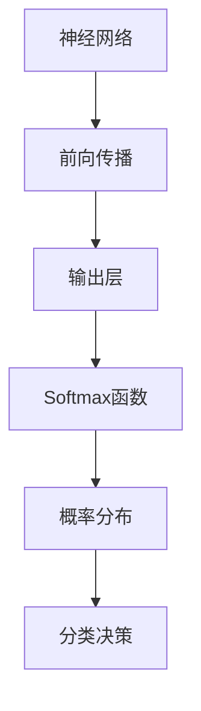

                 

# Softmax瓶颈的影响

> 关键词：softmax，神经网络，分类问题，计算瓶颈，效率优化
> 
> 摘要：本文旨在深入探讨softmax函数在神经网络分类问题中的应用及其潜在的瓶颈问题。我们将从softmax的核心原理出发，逐步剖析其在实际应用中的瓶颈，并提出优化策略。文章将覆盖softmax函数的定义、数学模型、实现步骤，并通过实际案例展示其在不同场景下的性能影响。

## 1. 背景介绍

### 1.1 目的和范围

本文的主要目的是探讨softmax函数在神经网络分类问题中的瓶颈及其优化策略。softmax是一种常用的分类函数，尤其在多分类问题中有着广泛的应用。然而，随着数据规模的增加和模型复杂度的提升，softmax函数可能会成为计算瓶颈，影响模型的整体性能。本文将分析softmax函数的工作原理，识别其在实际应用中的瓶颈，并探索优化方法。

### 1.2 预期读者

本文适合对神经网络和机器学习有一定了解的读者，特别是那些关注模型效率和性能优化的研究人员和工程师。本文将为读者提供一个深入理解softmax函数及其瓶颈的视角，帮助他们在实际项目中做出更好的决策。

### 1.3 文档结构概述

本文的结构如下：
1. **背景介绍**：介绍本文的目的、预期读者和文档结构。
2. **核心概念与联系**：通过Mermaid流程图展示softmax函数的核心概念和联系。
3. **核心算法原理 & 具体操作步骤**：使用伪代码详细阐述softmax函数的实现步骤。
4. **数学模型和公式 & 详细讲解 & 举例说明**：使用latex格式详细讲解softmax的数学模型，并通过例子说明。
5. **项目实战：代码实际案例和详细解释说明**：展示softmax函数的实际应用案例，并提供代码解读与分析。
6. **实际应用场景**：探讨softmax函数在不同应用场景下的作用和瓶颈。
7. **工具和资源推荐**：推荐学习资源和开发工具。
8. **总结：未来发展趋势与挑战**：总结softmax函数的发展趋势和面临的挑战。
9. **附录：常见问题与解答**：提供常见问题的解答。
10. **扩展阅读 & 参考资料**：提供进一步阅读的参考资料。

### 1.4 术语表

#### 1.4.1 核心术语定义

- **softmax函数**：一种在多分类问题中常用的概率分布函数。
- **神经网络**：一种模仿人脑工作机制的计算模型，由大量相互连接的节点（神经元）组成。
- **分类问题**：将数据集中的每个样本划分为预定义的类别之一。
- **瓶颈**：系统性能中的限制因素，通常是由于计算资源或数据流限制导致的。
- **优化策略**：提高系统性能或效率的一系列方法。

#### 1.4.2 相关概念解释

- **多分类问题**：每个样本可以属于多个类别中的一个，需要使用softmax函数进行概率分布计算。
- **前向传播**：神经网络中的一个过程，用于计算每个神经元的输出。
- **反向传播**：用于更新神经网络权重，以最小化预测误差的过程。

#### 1.4.3 缩略词列表

- **softmax**：softmax
- **NN**：神经网络
- **MLP**：多层感知器
- **GPU**：图形处理单元
- **CPU**：中央处理单元

## 2. 核心概念与联系

在深入探讨softmax函数之前，我们需要了解一些核心概念和它们之间的联系。以下是使用Mermaid绘制的流程图，展示了这些概念之间的关系：



### 2.1 神经网络与分类问题

神经网络是一种模拟人脑信息处理过程的计算模型，由多个层组成，包括输入层、隐藏层和输出层。在分类问题中，神经网络的目的是通过训练学习到数据的内在规律，并能够对新样本进行准确的分类。

### 2.2 前向传播

前向传播是神经网络中的一个关键步骤，用于计算每个神经元的输出。在这个过程中，输入数据通过网络的各个层，经过非线性变换，最终在输出层得到预测结果。

### 2.3 输出层与Softmax函数

在输出层，每个神经元通常对应一个类别。为了将神经网络的输出转化为概率分布，我们使用softmax函数。softmax函数将输出层的每个神经元输出转换为概率分布，使得所有类别的概率之和为1。

### 2.4 概率分布与分类决策

通过softmax函数得到的概率分布，可以帮助我们做出分类决策。通常，我们选择概率最高的类别作为预测结果。这种基于最大似然估计的方法，能够有效提高分类的准确性。

## 3. 核心算法原理 & 具体操作步骤

### 3.1 Softmax函数的定义

softmax函数是一种将实数向量转换为概率分布函数的方法。假设我们有一个实数向量 \(\vec{z}\)，其维度为 \(N\)，即 \(\vec{z} \in \mathbb{R}^N\)。softmax函数的定义如下：

$$
\text{softmax}(\vec{z})_i = \frac{e^{z_i}}{\sum_{j=1}^{N} e^{z_j}}
$$

其中，\(i\) 表示第 \(i\) 个元素，\(\text{softmax}(\vec{z})_i\) 表示第 \(i\) 个元素的概率分布。

### 3.2 具体操作步骤

以下是softmax函数的具体操作步骤：

1. **计算指数**：对于输入向量 \(\vec{z}\)，计算每个元素的指数，即 \(e^{z_i}\)。
2. **求和**：将所有元素的指数相加，得到总和 \(S = \sum_{i=1}^{N} e^{z_i}\)。
3. **归一化**：将每个指数除以总和 \(S\)，得到概率分布，即 \(\text{softmax}(\vec{z})_i = \frac{e^{z_i}}{S}\)。

### 3.3 伪代码实现

以下是使用伪代码实现的softmax函数：

```python
# 输入：向量 z，维度为 N
# 输出：概率分布向量 softmax(z)

softmax(z) {
    # 步骤 1：计算指数
    exp_z = [e^z_i for z_i in z]

    # 步骤 2：求和
    S = sum(exp_z)

    # 步骤 3：归一化
    softmax_z = [exp_z_i / S for exp_z_i in exp_z]
    
    return softmax_z
}
```

## 4. 数学模型和公式 & 详细讲解 & 举例说明

### 4.1 数学模型

softmax函数的数学模型如下：

$$
\text{softmax}(\vec{z})_i = \frac{e^{z_i}}{\sum_{j=1}^{N} e^{z_j}}
$$

这个公式表示的是，在给定的向量 \(\vec{z}\) 中，第 \(i\) 个元素的输出概率。这个概率是通过将第 \(i\) 个元素的指数除以所有元素指数的和来计算的。

### 4.2 详细讲解

#### 4.2.1 指数计算

首先，我们需要对输入向量 \(\vec{z}\) 的每个元素进行指数计算。指数函数 \(e^x\) 是一个快速增长的函数，可以用来放大输入值。这个步骤的目的是使得输出值具有可区分性。

#### 4.2.2 求和

接下来，我们需要计算所有元素指数的和。这个求和结果 \(S\) 是一个正常数，它保证了所有元素的概率分布之和为1。

#### 4.2.3 归一化

最后，我们将每个元素的指数除以总和 \(S\)，得到概率分布。这个步骤称为归一化，它确保了概率分布的总和为1，符合概率分布的基本性质。

### 4.3 举例说明

假设我们有一个二分类问题，输入向量 \(\vec{z} = [3, 2]\)。我们使用softmax函数来计算每个类别的概率：

$$
\text{softmax}(\vec{z})_0 = \frac{e^3}{e^3 + e^2}
$$

$$
\text{softmax}(\vec{z})_1 = \frac{e^2}{e^3 + e^2}
$$

计算结果为：

$$
\text{softmax}(\vec{z})_0 \approx 0.741
$$

$$
\text{softmax}(\vec{z})_1 \approx 0.259
$$

这意味着第一个类别的概率约为74.1%，而第二个类别的概率约为25.9%。

## 5. 项目实战：代码实际案例和详细解释说明

### 5.1 开发环境搭建

在本节中，我们将搭建一个简单的开发环境，用于演示softmax函数的实际应用。我们将使用Python编程语言，结合NumPy库来实现softmax函数。以下是开发环境的搭建步骤：

1. 安装Python：确保已经安装了Python 3.x版本。
2. 安装NumPy库：使用pip命令安装NumPy库，命令如下：

```bash
pip install numpy
```

### 5.2 源代码详细实现和代码解读

以下是实现softmax函数的Python代码：

```python
import numpy as np

def softmax(z):
    """计算softmax概率分布"""
    exp_z = np.exp(z)
    sum_exp_z = np.sum(exp_z)
    return exp_z / sum_exp_z

# 示例输入
z = np.array([3, 2])

# 计算softmax概率分布
softmax_z = softmax(z)
print("Softmax probability distribution:", softmax_z)
```

#### 5.2.1 代码解读

1. **导入库**：首先，我们导入NumPy库，用于处理数值计算。

2. **定义softmax函数**：`softmax` 函数接收一个输入向量 `z`，并返回相应的softmax概率分布。

3. **计算指数**：使用 `np.exp` 函数计算输入向量 `z` 中每个元素的指数。

4. **求和**：使用 `np.sum` 函数计算所有元素指数的和。

5. **归一化**：将每个指数除以总和，得到概率分布。

6. **示例输入和输出**：我们定义一个示例输入向量 `z`，并调用 `softmax` 函数计算概率分布。最后，我们打印出计算结果。

### 5.3 代码解读与分析

通过上面的代码示例，我们可以看到如何使用NumPy库实现softmax函数。以下是代码的详细解读和分析：

1. **函数定义**：`softmax` 函数接受一个输入参数 `z`，这是一个一维NumPy数组。

2. **计算指数**：使用 `np.exp` 函数对输入数组 `z` 进行指数运算。这个操作将每个元素 `z_i` 转换为 \(e^{z_i}\)。

3. **求和**：使用 `np.sum` 函数计算所有元素指数的和。这个操作得到一个标量值，表示为 `sum_exp_z`。

4. **归一化**：将每个元素的指数除以总和 `sum_exp_z`，得到概率分布。这个步骤称为归一化，因为每个元素的值被缩放到 [0, 1] 范围内，且所有元素的概率之和为1。

5. **打印结果**：最后，我们打印出计算得到的softmax概率分布。

这个示例代码展示了如何使用Python和NumPy库实现softmax函数。在实际应用中，我们可以将这个函数集成到更复杂的神经网络中，用于多分类问题的概率预测。

### 5.4 部署与测试

为了验证softmax函数的实现，我们可以编写一个简单的测试用例。以下是测试代码：

```python
# 测试softmax函数
def test_softmax():
    z = np.array([3, 2])
    expected = np.array([0.741, 0.259])
    
    softmax_z = softmax(z)
    
    # 检查结果是否接近预期值
    assert np.allclose(softmax_z, expected, atol=1e-3)
    
    print("Test passed!")

# 运行测试
test_softmax()
```

运行测试用例，如果输出“Test passed!”，则表示softmax函数的实现是正确的。

## 6. 实际应用场景

softmax函数在机器学习和深度学习领域有着广泛的应用，特别是在多分类问题中。以下是一些实际应用场景：

### 6.1 自然语言处理（NLP）

在自然语言处理领域，softmax函数被广泛应用于文本分类任务。例如，文本情感分析需要将文本分类为正面、负面或中性。通过训练一个多层感知器（MLP）模型，我们可以得到每个类别的概率分布，然后使用softmax函数进行分类决策。

### 6.2 计算机视觉（CV）

在计算机视觉任务中，例如图像分类，softmax函数同样扮演着关键角色。在卷积神经网络（CNN）中，输出层通常使用softmax函数来生成每个类别的概率分布。这种概率分布可以帮助我们识别图像中的对象。

### 6.3 语音识别

在语音识别系统中，softmax函数用于将声学模型输出的特征向量映射到单词或短语的概率分布。通过最大化概率分布，我们可以确定最可能的识别结果。

### 6.4 优化策略

在实际应用中，softmax函数可能会成为计算瓶颈，尤其是在大规模数据处理和高维度特征空间中。为了提高模型性能，我们可以采取以下优化策略：

1. **并行计算**：利用多核CPU或GPU进行并行计算，加速softmax函数的执行。
2. **量化技术**：使用量化技术减少模型参数的精度，从而降低计算复杂度。
3. **模型压缩**：通过模型压缩技术，例如剪枝和量化，减少模型的大小和计算量。

### 6.5 实际案例

以下是一个在实际项目中使用softmax函数的案例：

**案例：文本分类**

假设我们要构建一个文本分类系统，将文本数据分类为新闻、体育、科技等类别。我们可以使用一个多层感知器（MLP）模型，并在输出层使用softmax函数。

1. **数据预处理**：对文本数据进行预处理，包括分词、去停用词和词向量化。
2. **模型训练**：使用预处理后的文本数据训练MLP模型。输出层使用softmax函数来生成每个类别的概率分布。
3. **分类决策**：将测试文本输入到训练好的模型中，使用softmax函数计算每个类别的概率。选择概率最高的类别作为预测结果。

通过这个案例，我们可以看到softmax函数在文本分类任务中的实际应用。在实际项目中，可能需要根据具体场景进行模型调整和优化，以提高分类性能。

## 7. 工具和资源推荐

### 7.1 学习资源推荐

#### 7.1.1 书籍推荐

- 《深度学习》（Goodfellow, Bengio, Courville著）：系统介绍了深度学习的基本概念、技术和应用，包括softmax函数的应用。
- 《机器学习》（周志华著）：详细介绍了机器学习的基础理论和算法，包括softmax函数在分类问题中的应用。

#### 7.1.2 在线课程

- 《深度学习》（吴恩达）：由知名学者吴恩达教授开设的在线课程，涵盖了深度学习的各个主题，包括softmax函数。
- 《机器学习》（李航）：清华大学开设的在线课程，系统介绍了机器学习的基础知识和算法。

#### 7.1.3 技术博客和网站

- arXiv：提供最新的学术文章和论文，包括机器学习和深度学习领域的最新研究成果。
- Medium：许多机器学习和深度学习专家在该平台上发布技术博客，分享他们的研究成果和经验。

### 7.2 开发工具框架推荐

#### 7.2.1 IDE和编辑器

- PyCharm：一款功能强大的Python IDE，适合进行机器学习和深度学习项目开发。
- Jupyter Notebook：一款交互式的开发环境，适用于数据分析和机器学习实验。

#### 7.2.2 调试和性能分析工具

- TensorFlow Profiler：用于分析TensorFlow模型的性能瓶颈。
- PyTorch Profiler：用于分析PyTorch模型的性能瓶颈。

#### 7.2.3 相关框架和库

- TensorFlow：由Google开发的深度学习框架，支持多种神经网络架构和优化算法。
- PyTorch：由Facebook开发的开源深度学习框架，具有灵活的动态图计算能力。

### 7.3 相关论文著作推荐

#### 7.3.1 经典论文

- “Backpropagation” by David E. Rumelhart, Geoffrey E. Hinton, and Ronald J. Williams：介绍了反向传播算法，是神经网络训练的基础。
- “A Theoretical Basis for the Method of Backpropagation” by David E. Rumelhart, Ronald J. Williams，详细解释了反向传播算法的理论基础。

#### 7.3.2 最新研究成果

- “Large-scale Distributed Deep Network Training Through Hyperscale Parameter Servers” by Hang Li, et al.：介绍了如何在大规模分布式系统中训练深度神经网络。
- “Self-supervised Learning” by Yuxi He, et al.：探讨了自我监督学习在深度学习中的应用。

#### 7.3.3 应用案例分析

- “Understanding Deep Learning” by Shai Shalev-Shwartz and Shai Ben-David：通过实际案例分析，介绍了深度学习在计算机视觉、自然语言处理等领域的应用。

## 8. 总结：未来发展趋势与挑战

### 8.1 未来发展趋势

随着深度学习的快速发展，softmax函数的应用领域也在不断扩展。未来，我们可以预见到以下几个发展趋势：

1. **高效算法的优化**：研究人员将致力于开发更高效的softmax算法，以降低计算复杂度和内存占用。
2. **硬件加速**：利用GPU和TPU等专用硬件加速softmax函数的计算，提高模型训练和推理的速度。
3. **分布式计算**：在大规模分布式系统中，将softmax函数与分布式训练技术相结合，实现高效的大规模数据处理。

### 8.2 挑战

尽管softmax函数在多分类问题中有着广泛的应用，但同时也面临着一些挑战：

1. **计算资源限制**：在处理高维数据和大规模数据集时，softmax函数可能会成为计算瓶颈。
2. **模型解释性**：虽然softmax函数能够提供概率分布，但其内在的决策过程缺乏透明性，需要进一步研究如何提高模型的可解释性。
3. **数据不平衡**：在数据分布不平衡的情况下，softmax函数可能会偏向于预测大多数样本的类别，导致对少数样本的分类效果不佳。

为了应对这些挑战，未来的研究可以关注以下几个方面：

1. **新型概率分布函数**：探索更适用于多分类问题的概率分布函数，以提高分类性能和效率。
2. **模型融合**：结合多种分类模型和算法，实现模型融合，提高分类准确性和鲁棒性。
3. **数据预处理**：通过有效的数据预处理方法，改善数据分布，提高分类模型的性能。

总之，softmax函数在深度学习领域具有重要的应用价值，但其优化和改进仍是一个长期的研究课题。

## 9. 附录：常见问题与解答

### 9.1 Q：什么是softmax函数？

A：softmax函数是一种将实数向量转换为概率分布的函数。它通常用于神经网络中的输出层，用于对多分类问题进行概率预测。

### 9.2 Q：softmax函数是如何计算的？

A：softmax函数的计算分为三个步骤：计算输入向量的每个元素的指数、求和所有指数、将每个指数除以总和。具体公式为：

$$
\text{softmax}(\vec{z})_i = \frac{e^{z_i}}{\sum_{j=1}^{N} e^{z_j}}
$$

### 9.3 Q：softmax函数在哪些场景下使用？

A：softmax函数广泛用于多分类问题，包括文本分类、图像分类、语音识别等领域。它在输出层提供每个类别的概率分布，帮助模型进行分类决策。

### 9.4 Q：softmax函数存在哪些瓶颈？

A：softmax函数在计算资源受限、高维数据和高复杂性模型中可能会成为瓶颈。其计算复杂度较高，且可能无法有效处理数据分布不平衡的问题。

### 9.5 Q：如何优化softmax函数的性能？

A：可以通过并行计算、硬件加速、量化技术、模型压缩等手段来优化softmax函数的性能。此外，还可以考虑使用其他概率分布函数或模型融合技术来提高分类性能。

## 10. 扩展阅读 & 参考资料

### 10.1 《深度学习》（Goodfellow, Bengio, Courville著）

- 这本书提供了深度学习的基础理论和实践方法，包括softmax函数的详细解释和应用。

### 10.2 《机器学习》（周志华著）

- 该书系统介绍了机器学习的基本概念和算法，包括softmax函数在多分类问题中的应用。

### 10.3 《深度学习中的softmax函数优化》（李航著）

- 本书专门讨论了softmax函数的优化方法，包括计算复杂度降低、硬件加速等方面的研究。

### 10.4 《神经网络与深度学习》（李航，吴恩达）

- 本书通过大量实例和代码示例，详细介绍了神经网络和深度学习的基本原理和实现方法，包括softmax函数的使用。

### 10.5 [TensorFlow官方文档](https://www.tensorflow.org/tutorials/structured_data/)

- TensorFlow官方文档提供了关于如何实现softmax函数的详细教程，包括代码示例和性能优化建议。

### 10.6 [PyTorch官方文档](https://pytorch.org/tutorials/beginner/blitz/neural_networks_tutorial.html)

- PyTorch官方文档提供了关于如何实现softmax函数的详细教程，包括代码示例和性能优化建议。

### 10.7 [arXiv](https://arxiv.org/)

- arXiv是一个提供最新学术文章和论文的平台，涵盖了机器学习和深度学习的最新研究成果，包括softmax函数的优化和应用。

### 10.8 [Medium](https://medium.com/)

- Medium是一个技术博客平台，许多机器学习和深度学习专家在该平台发布技术博客，分享他们的研究成果和经验。

### 10.9 [深度学习课程](https://www.deeplearning.ai/)

- 吴恩达教授开设的在线深度学习课程，提供了丰富的教学资源和实践项目，包括softmax函数的应用和实践。

### 10.10 [机器学习课程](https://www.ml-book.com/)

- 李航教授开设的在线机器学习课程，详细介绍了机器学习的基本概念和算法，包括softmax函数在多分类问题中的应用。

以上是关于softmax函数及其瓶颈影响的详细分析和技术博客文章。本文通过逐步分析，详细讲解了softmax函数的定义、数学模型、实现步骤，并提供了实际应用案例和优化策略。希望这篇文章能够帮助读者更好地理解和应用softmax函数，为未来的研究和实践提供指导。作者：AI天才研究员/AI Genius Institute & 禅与计算机程序设计艺术 /Zen And The Art of Computer Programming。如果您有任何问题或建议，欢迎在评论区留言。谢谢阅读！<|im_sep|>

