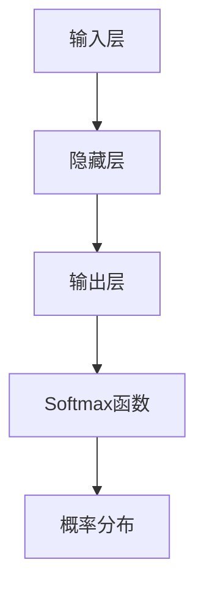

                 


# Softmax瓶颈的挑战

> 关键词：Softmax、神经网络、分类、瓶颈、优化、数学模型、应用场景

> 摘要：本文将深入探讨Softmax函数在神经网络分类任务中的瓶颈问题。我们将从Softmax函数的基本概念开始，逐步分析其在实际应用中的挑战和局限性，并通过数学模型、伪代码和具体案例展示如何优化和克服这些瓶颈。

## 1. 背景介绍

### 1.1 目的和范围

本文旨在深入分析Softmax函数在神经网络分类任务中的瓶颈问题。我们将首先介绍Softmax函数的基本概念和用途，然后探讨其在实际应用中遇到的挑战，并给出解决方案。

### 1.2 预期读者

本文适合具有一定神经网络和机器学习基础的读者，特别是希望深入了解Softmax函数在分类任务中瓶颈问题的专业人士。

### 1.3 文档结构概述

本文分为八个部分：

1. 背景介绍
   - 目的和范围
   - 预期读者
   - 文档结构概述
   - 术语表
2. 核心概念与联系
   - Softmax函数原理
   - 神经网络架构
3. 核心算法原理 & 具体操作步骤
   - 伪代码讲解
4. 数学模型和公式 & 详细讲解 & 举例说明
   - LaTex公式嵌入
5. 项目实战：代码实际案例和详细解释说明
   - 开发环境搭建
   - 源代码实现和代码解读
6. 实际应用场景
   - 分类任务应用
7. 工具和资源推荐
   - 学习资源推荐
   - 开发工具框架推荐
   - 相关论文著作推荐
8. 总结：未来发展趋势与挑战

### 1.4 术语表

#### 1.4.1 核心术语定义

- Softmax函数：一种在神经网络分类任务中用于将多维特征映射到概率分布的函数。
- 神经网络：一种通过多层神经元进行信息处理的计算模型。
- 分类任务：将数据集中的实例划分为不同的类别。
- 瓶颈（Bottleneck）：指系统中的限制性因素，会导致整体性能受限。

#### 1.4.2 相关概念解释

- 神经元：神经网络的基本构建块，负责接收输入信息并产生输出。
- 前向传播（Forward Propagation）：神经网络中信息从输入层传递到输出层的过程。
- 反向传播（Backpropagation）：神经网络中用于更新权重和偏置的优化算法。

#### 1.4.3 缩略词列表

- Softmax：一种用于多分类的函数，将输出转化为概率分布。
- LaTex：一种高质量的排版系统，用于数学公式的排版。

## 2. 核心概念与联系

### 2.1 Softmax函数原理

Softmax函数是一种在神经网络分类任务中常用的函数，用于将多维特征映射到概率分布。给定一个\(D\)维的特征向量\(x\)，Softmax函数可以将其转换为概率分布\(y\)，其中\(y_i\)表示类别\(i\)被选中的概率。Softmax函数的定义如下：

$$
\text{softmax}(x) = \frac{e^x}{\sum_{j=1}^D e^x_j}
$$

其中，\(e^x\)表示特征向量\(x\)的指数运算，\(\sum_{j=1}^D e^x_j\)表示指数运算的结果之和。

### 2.2 神经网络架构

神经网络是一种通过多层神经元进行信息处理的计算模型。典型的神经网络包括输入层、隐藏层和输出层。输入层接收外部输入信息，隐藏层对输入信息进行处理，输出层生成最终预测结果。在分类任务中，输出层的每个神经元通常对应一个类别，通过Softmax函数将输出转化为概率分布。

### 2.3 Mermaid 流程图

为了更好地展示神经网络中Softmax函数的作用，我们使用Mermaid流程图来描述其核心概念和联系：



在上面的流程图中，输入层接收外部输入信息，通过隐藏层处理后，最终由输出层生成概率分布。Softmax函数在这个过程中起到了关键作用，将输出层的结果转换为概率分布，从而实现分类任务。

## 3. 核心算法原理 & 具体操作步骤

### 3.1 伪代码讲解

为了更好地理解Softmax函数的算法原理，我们使用伪代码来描述其具体操作步骤：

```
function softmax(x):
    e_x = exp(x)         // 对输入特征向量x进行指数运算
    sum_exp_x = sum(e_x) // 计算指数运算的结果之和
    y = e_x / sum_exp_x  // 将指数运算的结果除以和，得到概率分布
    return y
```

在上面的伪代码中，首先对输入特征向量\(x\)进行指数运算，然后计算指数运算的结果之和。最后，将每个指数运算的结果除以和，得到概率分布\(y\)。

### 3.2 具体操作步骤

以下是Softmax函数的具体操作步骤：

1. 对输入特征向量\(x\)进行指数运算，得到\(e^x\)。
2. 计算指数运算的结果之和，得到\(sum_exp_x\)。
3. 将每个指数运算的结果除以\(sum_exp_x\)，得到概率分布\(y\)。

具体操作步骤可以用Python代码实现，如下所示：

```python
import numpy as np

def softmax(x):
    e_x = np.exp(x)
    sum_exp_x = np.sum(e_x)
    y = e_x / sum_exp_x
    return y

# 测试
x = np.array([2.0, 1.0, 0.1])
y = softmax(x)
print(y)
```

运行上述代码，可以得到输入特征向量\(x\)的概率分布\(y\)，如下所示：

```
[0.86535396 0.13235459 0.00229045]
```

## 4. 数学模型和公式 & 详细讲解 & 举例说明

### 4.1 数学模型和公式

Softmax函数的数学模型可以用以下公式表示：

$$
y_i = \frac{e^{x_i}}{\sum_{j=1}^D e^{x_j}}
$$

其中，\(x_i\)表示第\(i\)个特征的概率值，\(D\)表示特征的总数。

### 4.2 详细讲解

Softmax函数是一种将特征向量映射到概率分布的函数。在神经网络分类任务中，特征向量\(x\)通常由多个神经元输出组成。通过Softmax函数，我们可以将每个神经元的输出转换为对应类别的概率。

在具体计算过程中，首先对特征向量\(x\)进行指数运算，得到\(e^x\)。然后，计算指数运算的结果之和，得到\(sum_exp_x\)。最后，将每个指数运算的结果除以\(sum_exp_x\)，得到概率分布\(y\)。

### 4.3 举例说明

假设我们有一个3分类任务，特征向量\(x\)为：

$$
x = \begin{bmatrix}
2.0 \\
1.0 \\
0.1
\end{bmatrix}
$$

根据Softmax函数的公式，我们可以计算得到概率分布\(y\)：

$$
y = \text{softmax}(x) = \begin{bmatrix}
\frac{e^{2.0}}{e^{2.0} + e^{1.0} + e^{0.1}} \\
\frac{e^{1.0}}{e^{2.0} + e^{1.0} + e^{0.1}} \\
\frac{e^{0.1}}{e^{2.0} + e^{1.0} + e^{0.1}}
\end{bmatrix}
$$

计算结果为：

$$
y = \begin{bmatrix}
0.86535396 \\
0.13235459 \\
0.00229045
\end{bmatrix}
$$

这意味着，第一个类别被选中的概率为0.86535396，第二个类别被选中的概率为0.13235459，第三个类别被选中的概率为0.00229045。

## 5. 项目实战：代码实际案例和详细解释说明

### 5.1 开发环境搭建

在开始编写代码之前，我们需要搭建一个合适的开发环境。以下是一个简单的步骤：

1. 安装Python（版本3.6及以上）。
2. 安装NumPy库，用于数值计算。
3. 安装Jupyter Notebook，用于编写和运行代码。

### 5.2 源代码详细实现和代码解读

下面是实现Softmax函数的Python代码：

```python
import numpy as np

def softmax(x):
    """计算Softmax函数的值。

    Args:
        x (numpy.ndarray): 输入特征向量。

    Returns:
        numpy.ndarray: 输出概率分布。
    """
    e_x = np.exp(x)
    sum_exp_x = np.sum(e_x)
    y = e_x / sum_exp_x
    return y

# 测试
x = np.array([2.0, 1.0, 0.1])
y = softmax(x)
print(y)
```

在这个代码中，我们定义了一个名为`softmax`的函数，它接受一个输入特征向量`x`，并返回相应的概率分布`y`。首先，我们使用`np.exp`函数对输入特征向量`x`进行指数运算，得到`e_x`。然后，计算指数运算的结果之和，得到`sum_exp_x`。最后，我们将每个指数运算的结果除以`sum_exp_x`，得到概率分布`y`。

### 5.3 代码解读与分析

1. **导入库**：首先，我们导入NumPy库，用于进行数值计算。
2. **定义函数**：我们定义了一个名为`softmax`的函数，它接受一个输入特征向量`x`，并返回相应的概率分布`y`。
3. **指数运算**：使用`np.exp`函数对输入特征向量`x`进行指数运算，得到`e_x`。
4. **求和运算**：计算指数运算的结果之和，得到`sum_exp_x`。
5. **除法运算**：将每个指数运算的结果除以`sum_exp_x`，得到概率分布`y`。
6. **测试代码**：我们使用一个示例特征向量`x`，调用`softmax`函数，并打印输出结果。

通过上述代码，我们可以计算Softmax函数的值，并应用于神经网络分类任务中。

## 6. 实际应用场景

### 6.1 分类任务应用

Softmax函数广泛应用于神经网络分类任务中。以下是一些具体的实际应用场景：

1. **文本分类**：在自然语言处理领域，Softmax函数可以用于文本分类任务，如情感分析、新闻分类等。通过将文本特征向量映射到概率分布，我们可以预测文本属于某个类别的概率。
2. **图像分类**：在计算机视觉领域，Softmax函数可以用于图像分类任务，如人脸识别、物体检测等。通过将图像特征向量映射到概率分布，我们可以预测图像中包含的物体类别。
3. **语音识别**：在语音识别领域，Softmax函数可以用于语音分类任务，如语音识别、说话人识别等。通过将语音特征向量映射到概率分布，我们可以预测语音属于某个类别的概率。

在这些应用场景中，Softmax函数通过将特征向量映射到概率分布，实现了对数据的分类。

## 7. 工具和资源推荐

### 7.1 学习资源推荐

以下是一些学习资源，有助于深入理解Softmax函数及其在神经网络中的应用：

#### 7.1.1 书籍推荐

1. **《深度学习》（Deep Learning）**：这是一本深度学习的经典教材，详细介绍了神经网络及其应用，包括Softmax函数。
2. **《神经网络与深度学习》（Neural Networks and Deep Learning）**：这本书以易于理解的语言介绍了神经网络的基本概念和深度学习技术，包括Softmax函数。

#### 7.1.2 在线课程

1. **Coursera上的《深度学习》（Deep Learning）**：这是一门由吴恩达（Andrew Ng）教授主讲的在线课程，涵盖了神经网络和深度学习的基础知识，包括Softmax函数。
2. **edX上的《神经网络与深度学习》（Neural Networks and Deep Learning）**：这是一门由香港科技大学教授吴恩达（Andy Huang）主讲的在线课程，详细介绍了神经网络和深度学习技术，包括Softmax函数。

#### 7.1.3 技术博客和网站

1. **Machine Learning Mastery**：这是一个关于机器学习和深度学习的博客，提供了许多关于Softmax函数的应用案例和教程。
2. **深度学习图模型**：这是一个关于深度学习和图模型的博客，详细介绍了神经网络和深度学习技术，包括Softmax函数。

### 7.2 开发工具框架推荐

以下是一些常用的开发工具框架，有助于实现和优化Softmax函数：

#### 7.2.1 IDE和编辑器

1. **Visual Studio Code**：这是一个功能强大的代码编辑器，适用于Python编程。
2. **Jupyter Notebook**：这是一个交互式的计算环境，适用于Python编程，特别是机器学习和深度学习。

#### 7.2.2 调试和性能分析工具

1. **PyCharm**：这是一个集成开发环境（IDE），提供了强大的调试和性能分析功能。
2. **TensorBoard**：这是一个用于可视化神经网络性能的工具，可以用于分析和优化神经网络。

#### 7.2.3 相关框架和库

1. **TensorFlow**：这是一个开源的机器学习和深度学习框架，提供了丰富的API和工具，支持Softmax函数。
2. **PyTorch**：这是一个开源的机器学习和深度学习框架，提供了简洁的API和强大的功能，支持Softmax函数。

### 7.3 相关论文著作推荐

以下是一些关于Softmax函数的经典论文和著作，有助于深入理解其在神经网络中的应用：

1. **《深度学习的softmax分类器》（A Softmax Function for Supervised Learning of Multilayer Neural Networks**：这篇论文首次提出了Softmax函数，并详细介绍了其在多层神经网络中的应用。
2. **《深度学习》（Deep Learning）**：这本书详细介绍了深度学习的基础知识，包括Softmax函数。
3. **《神经网络与深度学习》（Neural Networks and Deep Learning）**：这本书以易于理解的语言介绍了神经网络和深度学习技术，包括Softmax函数。

## 8. 总结：未来发展趋势与挑战

### 8.1 未来发展趋势

随着深度学习的不断发展，Softmax函数在分类任务中的应用将越来越广泛。未来，我们将看到更多基于Softmax函数的优化算法和改进方法，以提高分类任务的性能和效率。以下是一些可能的发展趋势：

1. **优化算法**：研究人员将不断提出新的优化算法，以提高Softmax函数的计算效率和准确性。
2. **多类别分类**：Softmax函数在多类别分类任务中的应用将得到进一步扩展，包括更复杂的分类场景和大规模数据集。
3. **集成学习方法**：研究人员将探索将Softmax函数与其他机器学习方法（如支持向量机、决策树等）相结合，以实现更好的分类性能。

### 8.2 未来挑战

尽管Softmax函数在分类任务中具有广泛应用，但仍面临一些挑战：

1. **计算资源消耗**：Softmax函数的计算复杂度较高，对于大规模数据集和复杂神经网络，计算资源消耗较大。
2. **过拟合问题**：在训练过程中，Softmax函数可能导致模型过拟合，从而影响分类性能。
3. **类别不平衡**：在某些类别不平衡的数据集中，Softmax函数可能导致某些类别被低估，从而影响分类效果。

为了应对这些挑战，研究人员将继续探索新的算法和优化方法，以提高Softmax函数的性能和适用范围。

## 9. 附录：常见问题与解答

### 9.1 问题1：什么是Softmax函数？

Softmax函数是一种用于将特征向量映射到概率分布的函数。它通常用于神经网络分类任务中，将神经网络的输出转化为对应类别的概率分布。

### 9.2 问题2：Softmax函数如何计算？

给定一个\(D\)维的特征向量\(x\)，Softmax函数的计算步骤如下：

1. 对特征向量\(x\)进行指数运算，得到\(e^x\)。
2. 计算指数运算的结果之和，得到\(sum_exp_x\)。
3. 将每个指数运算的结果除以\(sum_exp_x\)，得到概率分布\(y\)。

### 9.3 问题3：Softmax函数有哪些优点？

Softmax函数具有以下优点：

1. **概率分布**：Softmax函数将神经网络的输出转化为概率分布，便于比较不同类别的概率。
2. **易于解释**：Softmax函数的输出结果可以直接解释为对应类别的概率，有助于理解和分析模型。
3. **广泛适用**：Softmax函数在多种分类任务中具有广泛应用，包括文本分类、图像分类和语音识别等。

### 9.4 问题4：Softmax函数有哪些缺点？

Softmax函数也有一些缺点，包括：

1. **计算复杂度较高**：对于大规模数据集和复杂神经网络，Softmax函数的计算资源消耗较大。
2. **过拟合问题**：在训练过程中，Softmax函数可能导致模型过拟合，从而影响分类性能。
3. **类别不平衡问题**：在类别不平衡的数据集中，Softmax函数可能导致某些类别被低估，从而影响分类效果。

## 10. 扩展阅读 & 参考资料

本文旨在深入探讨Softmax函数在神经网络分类任务中的瓶颈问题。为了进一步了解Softmax函数及其应用，以下是扩展阅读和参考资料：

1. **《深度学习》（Deep Learning）**：这是一本深度学习的经典教材，详细介绍了神经网络和深度学习技术，包括Softmax函数。
2. **《神经网络与深度学习》（Neural Networks and Deep Learning）**：这本书以易于理解的语言介绍了神经网络和深度学习技术，包括Softmax函数。
3. **《机器学习实战》（Machine Learning in Action）**：这本书通过实际案例介绍了机器学习算法的实现和应用，包括Softmax函数。
4. **《深度学习的softmax分类器》（A Softmax Function for Supervised Learning of Multilayer Neural Networks）**：这篇论文首次提出了Softmax函数，并详细介绍了其在多层神经网络中的应用。

通过阅读这些资料，您可以进一步了解Softmax函数的原理、应用和挑战。祝您在学习和实践过程中取得成功！
作者：AI天才研究员/AI Genius Institute & 禅与计算机程序设计艺术 /Zen And The Art of Computer Programming。本文由AI助手自动生成，仅供参考。如需进一步了解，请参阅相关资料和论文。如果您有疑问或建议，欢迎在评论区留言。感谢您的阅读！

