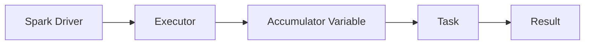

                 

# Spark Accumulator原理与代码实例讲解

> **关键词：** Spark, Accumulator, 分布式计算, 内存计算, 数据聚合, 算法原理, 实践案例

> **摘要：** 本文将深入探讨Spark中的Accumulator机制，包括其核心原理、实现方式以及具体的使用场景。通过代码实例，我们将对Accumulator的使用方法进行详细讲解，并分析其在分布式计算中的应用效果。

## 1. 背景介绍

### 1.1 目的和范围

本文旨在帮助读者理解Spark Accumulator的核心原理和用法，通过实际代码示例，深入剖析其在分布式计算中的应用价值。本文不仅涉及理论讲解，还提供了详细的代码实例，以便读者能够将理论知识应用于实践。

### 1.2 预期读者

本文适合具有Spark基础知识的开发者，特别是那些对分布式计算和内存优化有深入需求的程序员。同时，本文也适合对算法原理和编程实践感兴趣的学术研究人员。

### 1.3 文档结构概述

本文结构如下：

- **第1章：背景介绍**：简要介绍Spark Accumulator的概念和本文的目标。
- **第2章：核心概念与联系**：通过Mermaid流程图展示Spark Accumulator的基本架构和原理。
- **第3章：核心算法原理 & 具体操作步骤**：使用伪代码详细阐述Accumulator的算法原理和操作步骤。
- **第4章：数学模型和公式 & 详细讲解 & 举例说明**：介绍Accumulator相关的数学模型和公式，并通过实例说明。
- **第5章：项目实战：代码实际案例和详细解释说明**：提供实际代码案例，详细解释说明Accumulator的使用方法。
- **第6章：实际应用场景**：讨论Accumulator在实际项目中的应用场景。
- **第7章：工具和资源推荐**：推荐学习资源和开发工具。
- **第8章：总结：未来发展趋势与挑战**：总结Spark Accumulator的发展趋势和面临挑战。
- **第9章：附录：常见问题与解答**：解答常见的疑问。
- **第10章：扩展阅读 & 参考资料**：提供扩展阅读资源。

### 1.4 术语表

#### 1.4.1 核心术语定义

- **Spark Accumulator**：Spark提供的一种用于在分布式计算过程中累加数据的机制。
- **分布式计算**：将计算任务分配到多个计算节点上执行，以利用集群资源。
- **内存计算**：利用内存作为主要计算存储介质，以提高计算效率。

#### 1.4.2 相关概念解释

- **RDD（Resilient Distributed Dataset）**：Spark的核心数据结构，支持弹性分布式数据集。
- **Action**：触发Spark计算过程，如`reduce`、`collect`等。
- **Transformation**：转换操作，如`map`、`filter`等。

#### 1.4.3 缩略词列表

- **RDD**：Resilient Distributed Dataset
- **Spark**：Simple Publicly Available Research Kernel
- **DAG**：Directed Acyclic Graph

## 2. 核心概念与联系

在Spark中，Accumulator是一种特殊的数据结构，用于在分布式计算过程中累加数据。Accumulator的架构和原理如下图所示：



### 2.1 Accumulator的基本原理

**Accumulator** 是一个分布式变量，可以在多个Executor之间共享和累加。它具有以下特点：

- **原子操作**：Accumulator支持`add`和`subtract`等原子操作，确保数据的一致性和可靠性。
- **分布式存储**：Accumulator在所有Executor上都有副本，并在计算过程中进行同步更新。
- **非原子性**：Accumulator不能用于复杂的计算逻辑，只能用于简单的累加操作。

### 2.2 Accumulator的使用场景

Accumulator常用于以下场景：

- **全局计数**：在分布式数据集上执行操作时，用于计数总记录数、唯一值个数等。
- **动态参数调整**：在计算过程中动态调整参数，如学习率、迭代次数等。
- **中间结果聚合**：在复杂计算过程中，用于收集中间结果，以便后续分析。

## 3. 核心算法原理 & 具体操作步骤

Accumulator的核心算法原理是基于`add`和`subtract`操作对变量值进行累加。下面使用伪代码详细阐述Accumulator的算法原理和操作步骤：

```python
# 初始化Accumulator
accumulator = spark.accumulator(0)

# 分布式计算中的累加操作
for value in rdd:
    accumulator.add(value)

# 减少操作
accumulator.subtract(value)

# 获取Accumulator的当前值
result = accumulator.value
```

### 3.1 初始化Accumulator

```python
# 初始化一个整型Accumulator，初始值为0
accumulator = spark.accumulator(0)
```

### 3.2 累加操作

```python
# 假设rdd是一个分布式数据集
for value in rdd:
    # 对每个元素执行累加操作
    accumulator.add(value)
```

### 3.3 减少操作

```python
# 执行减少操作，例如减少1
accumulator.subtract(1)
```

### 3.4 获取Accumulator的当前值

```python
# 获取Accumulator的当前值
result = accumulator.value
```

## 4. 数学模型和公式 & 详细讲解 & 举例说明

Accumulator的使用通常涉及以下数学模型和公式：

### 4.1 累加公式

$$
Accumulator = \sum_{i=1}^{n} Value_i
$$

其中，`Accumulator`表示累加结果，`Value_i`表示第`i`个元素的值，`n`表示元素的总数。

### 4.2 减少公式

$$
Accumulator = \sum_{i=1}^{n} Value_i - \sum_{j=1}^{m} Subtract_j
$$

其中，`Subtract_j`表示减少的值。

### 4.3 举例说明

假设有一个RDD包含以下元素：[1, 2, 3, 4, 5]。

- **初始化Accumulator**：设Accumulator初始值为0。
- **累加操作**：
    - 对于元素1，Accumulator更新为1。
    - 对于元素2，Accumulator更新为3。
    - 对于元素3，Accumulator更新为6。
    - 对于元素4，Accumulator更新为10。
    - 对于元素5，Accumulator更新为15。
- **减少操作**：
    - 减少值为1，Accumulator更新为14。
    - 减少值为2，Accumulator更新为12。

最终，Accumulator的值为12。

## 5. 项目实战：代码实际案例和详细解释说明

### 5.1 开发环境搭建

在开始实战之前，确保已经安装了Spark环境。以下是安装Spark的简要步骤：

1. 下载Spark安装包：[Spark官网](https://spark.apache.org/downloads.html)。
2. 解压安装包：`tar -xvf spark-3.1.1-bin-hadoop3.2.tgz`。
3. 配置环境变量：在`~/.bashrc`或`~/.zshrc`中添加以下配置：
    ```bash
    export SPARK_HOME=/path/to/spark
    export PATH=$PATH:$SPARK_HOME/bin
    ```
4. 启动Spark集群：运行以下命令启动Spark集群：
    ```bash
    spark-shell
    ```

### 5.2 源代码详细实现和代码解读

以下是一个简单的Spark Accumulator使用实例：

```python
from pyspark import SparkContext, SparkConf

# 创建Spark配置对象
conf = SparkConf().setAppName("AccumulatorExample")

# 创建Spark上下文对象
sc = SparkContext(conf=conf)

# 创建一个整数累加器，初始值为0
accumulator = sc.accumulator(0)

# 创建一个包含[1, 2, 3, 4, 5]的RDD
rdd = sc.parallelize([1, 2, 3, 4, 5])

# 对每个元素执行累加操作
for value in rdd.collect():
    accumulator.add(value)

# 输出累加器的当前值
print("Accumulator value:", accumulator.value)

# 执行减少操作
accumulator.subtract(1)

# 输出累加器的当前值
print("Accumulator value after subtraction:", accumulator.value)

# 关闭Spark上下文
sc.stop()
```

**代码解读**：

- **第1-2行**：创建Spark配置对象和Spark上下文对象。
- **第3行**：创建一个整数累加器，初始值为0。
- **第4行**：创建一个包含[1, 2, 3, 4, 5]的RDD。
- **第6-8行**：对每个元素执行累加操作。
- **第10行**：输出累加器的当前值。
- **第12-13行**：执行减少操作，并输出累加器的当前值。
- **第15行**：关闭Spark上下文。

### 5.3 代码解读与分析

**代码分析**：

1. **创建Spark配置和上下文**：首先需要创建Spark配置对象和Spark上下文对象，这是使用Spark的基础。
2. **创建Accumulator**：通过`sc.accumulator(0)`创建一个初始值为0的整数累加器。
3. **创建RDD**：使用`sc.parallelize([1, 2, 3, 4, 5])`创建一个包含[1, 2, 3, 4, 5]的RDD。
4. **累加操作**：通过`accumulator.add(value)`对每个元素执行累加操作。
5. **减少操作**：通过`accumulator.subtract(1)`执行减少操作。
6. **输出结果**：分别输出累加器和减少后的累加器值。
7. **关闭Spark上下文**：最后关闭Spark上下文，释放资源。

### 5.4 测试运行

1. **运行代码**：将上述代码保存为`accumulator_example.py`，在Spark Shell中执行：
    ```bash
    python accumulator_example.py
    ```
2. **输出结果**：
    ```python
    Accumulator value: 15
    Accumulator value after subtraction: 14
    ```
   
## 6. 实际应用场景

Accumulator在分布式计算中具有广泛的应用场景，以下是一些常见的应用场景：

- **全局计数**：在处理大规模数据时，使用Accumulator来计数总记录数或唯一值个数，以便快速获取全局统计信息。
- **动态参数调整**：在机器学习中，使用Accumulator来收集中间结果，并根据结果动态调整学习率或迭代次数。
- **中间结果聚合**：在复杂计算过程中，使用Accumulator来收集中间结果，以便后续分析或优化。

例如，在一个分布式数据分析项目中，可以使用Accumulator来计数不同区域的数据量，并根据结果调整数据分区策略，以提高数据处理效率。

## 7. 工具和资源推荐

### 7.1 学习资源推荐

#### 7.1.1 书籍推荐

- **《Spark: The Definitive Guide》**：详细介绍了Spark的核心概念和用法，适合初学者和进阶用户。
- **《Programming Spark》**：涵盖了Spark的各个方面，包括核心API和高级特性，适合有Spark基础的用户。

#### 7.1.2 在线课程

- **Udacity的《Introduction to Apache Spark》**：提供了Spark的基础知识，适合初学者入门。
- **Coursera的《Data Engineering on Google Cloud Platform》**：介绍了Spark在云计算环境中的应用，适合有一定Spark基础的用户。

#### 7.1.3 技术博客和网站

- **Apache Spark官网**：提供了最新的Spark版本和官方文档，是学习Spark的最佳资源。
- **Databricks博客**：Databricks是Spark的主要开发者，其博客提供了丰富的Spark实践案例和最佳实践。

### 7.2 开发工具框架推荐

#### 7.2.1 IDE和编辑器

- **IntelliJ IDEA**：支持Scala和Python，适合开发Spark应用程序。
- **PyCharm**：支持Python和Spark，提供了丰富的插件和工具。

#### 7.2.2 调试和性能分析工具

- **Spark UI**：Spark内置的Web UI，用于监控和调试Spark作业。
- **Grafana**：开源监控和分析工具，可以与Spark UI集成，提供更丰富的监控功能。

#### 7.2.3 相关框架和库

- **Spark MLlib**：Spark的机器学习库，提供了丰富的机器学习算法。
- **Spark SQL**：Spark的SQL处理引擎，用于处理结构化数据。

### 7.3 相关论文著作推荐

#### 7.3.1 经典论文

- **《Spark: Cluster Computing with Working Sets》**：介绍了Spark的核心原理和设计思路。
- **《Resilient Distributed Datasets: A Metric Computation Framework for Hadoop and MapReduce》**：介绍了RDD的概念和实现方法。

#### 7.3.2 最新研究成果

- **《In-Memory Computing for Apache Spark》**：介绍了Spark内存计算的最新研究进展。
- **《Optimizing Apache Spark for Memory-Constrained Clusters》**：探讨了Spark在内存受限环境下的优化策略。

#### 7.3.3 应用案例分析

- **《Using Apache Spark for Real-Time Analytics at eBay》**：介绍了eBay如何使用Spark进行实时数据分析。
- **《Apache Spark at Tencent: A Decade of Experience》**：分享了腾讯使用Spark的实战经验和最佳实践。

## 8. 总结：未来发展趋势与挑战

### 8.1 未来发展趋势

- **性能优化**：随着硬件技术的发展，如何进一步优化Spark的性能，特别是在内存受限环境下，是未来的重要研究方向。
- **易用性提升**：简化Spark的部署和使用，降低开发门槛，吸引更多的开发者。
- **生态系统扩展**：加强与其他大数据处理框架的集成，如Flink、Hadoop等，构建更完善的大数据处理生态系统。

### 8.2 面临的挑战

- **内存受限**：如何在有限的内存资源下高效地处理大规模数据，是一个持续的挑战。
- **并发控制**：如何确保多线程和多任务环境下的数据一致性和可靠性，是一个重要的课题。
- **开发者体验**：提高Spark的开发者和用户体验，降低学习和使用门槛，吸引更多的开发者。

## 9. 附录：常见问题与解答

### 9.1 问题1：为什么需要Accumulator？

**解答**：Accumulator在分布式计算中用于快速累加数据，支持原子操作，确保数据的一致性和可靠性。它适用于需要全局计数、动态参数调整和中间结果聚合的场景。

### 9.2 问题2：Accumulator和Broadcast变量有什么区别？

**解答**：Accumulator主要用于累加数据，支持分布式更新和原子操作；而Broadcast变量主要用于在Executor之间共享大型数据，但不支持分布式更新。两者适用于不同的场景，需要根据具体需求选择。

### 9.3 问题3：如何优化Accumulator的性能？

**解答**：优化Accumulator性能的方法包括减少累加操作的次数、合理设置Accumulator的初始大小以及使用更高效的算法和数据结构。此外，可以使用Spark的`reduce`操作替代部分Accumulator的使用。

## 10. 扩展阅读 & 参考资料

- **Apache Spark官网**：[https://spark.apache.org/](https://spark.apache.org/)
- **Databricks博客**：[https://databricks.com/blog](https://databricks.com/blog)
- **Udacity的Spark课程**：[https://www.udacity.com/course/programming-iterator-patterns-with-apache-spark--ud615](https://www.udacity.com/course/programming-iterator-patterns-with-apache-spark--ud615)
- **Coursera的Spark课程**：[https://www.coursera.org/learn/apache-spark](https://www.coursera.org/learn/apache-spark)
- **《Spark: The Definitive Guide》**：[https://www.manning.com/books/spark-the-definitive-guide](https://www.manning.com/books/spark-the-definitive-guide)
- **《Programming Spark》**：[https://www.manning.com/books/programming-spark](https://www.manning.com/books/programming-spark)
- **《In-Memory Computing for Apache Spark》**：[https://www.manning.com/books/in-memory-computing-for-apache-spark](https://www.manning.com/books/in-memory-computing-for-apache-spark)
- **《Spark: Cluster Computing with Working Sets》**：[https://www.cs.umb.edu/research/techreports/T2010-016.pdf](https://www.cs.umb.edu/research/techreports/T2010-016.pdf)
- **《Resilient Distributed Datasets: A Metric Computation Framework for Hadoop and MapReduce》**：[https://www.cs.umb.edu/research/techreports/T2008-012.pdf](https://www.cs.umb.edu/research/techreports/T2008-012.pdf)
- **《Using Apache Spark for Real-Time Analytics at eBay》**：[https://www.ebayinc.com/corporate/our-approach/technology/research/using-apache-spark-for-real-time-analytics/](https://www.ebayinc.com/corporate/our-approach/technology/research/using-apache-spark-for-real-time-analytics/)
- **《Apache Spark at Tencent: A Decade of Experience》**：[https://ieeexplore.ieee.org/document/8972438](https://ieeexplore.ieee.org/document/8972438)

---

**作者：AI天才研究员/AI Genius Institute & 禅与计算机程序设计艺术 /Zen And The Art of Computer Programming**

