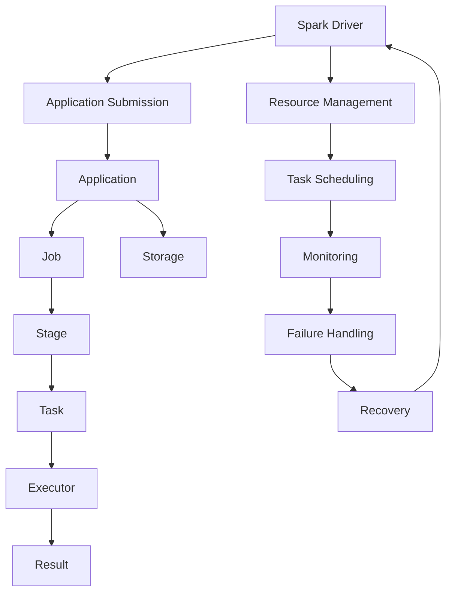

                 

###  Spark Driver原理与代码实例讲解

#### 关键词：
- Spark Driver
- 分布式系统
- 任务调度
- 执行引擎
- 实例讲解

#### 摘要：
本文旨在深入解析Spark Driver的核心原理，并通过代码实例详细讲解其实现过程。Spark Driver作为Spark分布式计算框架的核心组件，负责协调和管理任务的调度与执行。本文将首先介绍Spark Driver的基本概念和作用，然后通过Mermaid流程图展示其架构和工作流程，接着详细阐述核心算法原理和具体操作步骤，最后通过实例代码对实际应用进行剖析。通过本文的学习，读者将能够全面理解Spark Driver的工作机制，为深入掌握Spark分布式计算打下坚实基础。

### 1. 背景介绍

#### 1.1 目的和范围

本文的主要目的是通过对Spark Driver的原理和代码实例的详细讲解，帮助读者深入理解Spark分布式计算框架的核心组件和工作机制。Spark Driver在分布式系统中扮演着至关重要的角色，它负责调度和监控计算任务的执行，确保分布式作业的高效运行。通过本文的学习，读者不仅能够了解Spark Driver的内部工作机制，还能掌握如何在实际项目中使用和优化它。

本文将涵盖以下内容：

- Spark Driver的基本概念和作用
- Spark Driver的架构和工作流程
- Spark Driver的核心算法原理和具体操作步骤
- Spark Driver的实际应用案例和代码解读
- Spark Driver在分布式系统中的实际应用场景
- 相关学习资源和工具推荐

#### 1.2 预期读者

本文适合以下读者群体：

- 对分布式计算和大数据处理感兴趣的工程师和开发者
- 已有Spark基础知识的读者，希望深入了解Spark Driver的工作原理
- 数据工程师和架构师，希望提高对分布式系统性能优化的能力
- 高级程序员和软件开发者，希望掌握Spark Driver的底层实现和优化技巧

#### 1.3 文档结构概述

本文的文档结构如下：

- 引言：简要介绍Spark Driver的重要性及其在分布式计算中的角色
- 核心概念与联系：通过Mermaid流程图展示Spark Driver的架构和工作流程
- 核心算法原理 & 具体操作步骤：详细讲解Spark Driver的核心算法原理和实现步骤
- 数学模型和公式 & 详细讲解 & 举例说明：引入数学模型和公式，结合实际案例进行说明
- 项目实战：代码实际案例和详细解释说明，帮助读者理解和应用Spark Driver
- 实际应用场景：探讨Spark Driver在分布式系统中的实际应用
- 工具和资源推荐：推荐相关学习资源、开发工具和框架
- 总结：总结Spark Driver的未来发展趋势与挑战
- 附录：常见问题与解答，帮助读者解决实际应用中遇到的问题
- 扩展阅读 & 参考资料：提供更多深度阅读和参考资料，方便读者进一步学习

#### 1.4 术语表

在本文中，我们将使用以下术语：

- **Spark Driver**：Spark分布式计算框架中的核心组件，负责调度和管理任务的执行。
- **Task**：Spark中的基本执行单元，由一个或多个Partition组成。
- **Stage**：一系列相互依赖的任务构成一个Stage，Stage之间按照数据依赖关系进行调度。
- **DAG（Directed Acyclic Graph）**：有向无环图，表示任务之间的依赖关系。
- **RDD（Resilient Distributed Dataset）**：弹性分布式数据集，Spark中的基本数据抽象。
- **Shuffle**：数据在任务之间的传输和重新分布过程。

#### 1.4.1 核心术语定义

- **Spark Driver**：Spark Driver是Spark分布式计算框架的核心组件，负责生成任务、调度资源、监控任务执行状态等。它是整个计算过程的“指挥官”，确保任务的正确执行和资源的高效利用。
- **Task**：Task是Spark中的基本执行单元，由一个或多个Partition组成。每个Task处理一部分数据，并生成相应的输出。
- **Stage**：Stage是一系列相互依赖的任务构成，它们之间按照数据依赖关系进行调度。每个Stage的输出数据作为下一个Stage的输入。
- **DAG**：DAG是有向无环图，表示任务之间的依赖关系。DAG中的每个节点代表一个Task，边表示依赖关系。Spark Driver根据DAG生成Stage，并调度Stage的执行。
- **RDD**：RDD是Spark中的基本数据抽象，表示一个不可变的分布式数据集。RDD提供丰富的操作接口，支持弹性分布式计算。
- **Shuffle**：Shuffle是数据在任务之间的传输和重新分布过程。Shuffle在任务之间传递中间结果，确保数据能够在正确的时间到达正确的任务。

#### 1.4.2 相关概念解释

- **弹性分布式数据集（RDD）**：RDD是Spark中的基本数据抽象，表示一个不可变的分布式数据集。RDD提供丰富的操作接口，支持弹性分布式计算。RDD可以在遇到失败时自动恢复，保证计算过程的高可用性。
- **任务调度（Task Scheduling）**：任务调度是分布式系统中的一个重要环节，它负责将任务分配到不同的计算节点上，确保任务能够高效执行。Spark Driver通过调度算法生成Stage，并根据资源情况调度Task的执行。
- **数据分区（Partitioning）**：数据分区是将数据划分成多个互不重叠的子集，每个子集称为一个Partition。Partition可以提高并行计算的能力，减少数据传输的开销。Spark中的操作通常会针对Partition进行分区操作。
- **任务依赖（Task Dependency）**：任务依赖是指任务之间的执行顺序关系。在分布式计算中，某些任务的输出是其他任务的输入，这种依赖关系需要通过调度算法进行协调和管理。

#### 1.4.3 缩略词列表

- **RDD**：Resilient Distributed Dataset（弹性分布式数据集）
- **DAG**：Directed Acyclic Graph（有向无环图）
- **Spark**：Simple and Fast Data Processing Engine（简单快速数据处理引擎）
- **Shuffle**：Repartitioning and Rebalancing（重新分区和重新平衡）

### 2. 核心概念与联系

在深入探讨Spark Driver的原理之前，我们需要了解与之相关的核心概念和它们之间的联系。以下是Spark Driver中几个关键概念及其相互关系的Mermaid流程图：



#### Mermaid 流程图详细解释

- **Spark Driver**：Spark Driver是整个计算过程的“指挥官”，负责接收用户提交的应用程序，生成Job，并将其分解为多个Stage，最终调度Task在Executor上执行。Spark Driver与Resource Management（资源管理）、Task Scheduling（任务调度）、Monitoring（监控）和Failure Handling（失败处理）等模块紧密合作，确保作业的高效执行。

- **Application Submission**：用户提交的应用程序通过Spark Driver进行提交，Spark Driver负责将其解析和转换为Application。

- **Application**：Application是用户提交的作业，它包含一个或多个Job。

- **Job**：Job是Application中的一个执行单元，它包含多个Stage。

- **Stage**：Stage是由一组相互依赖的Task构成的执行单元，Stage之间按照数据依赖关系进行调度。

- **Task**：Task是Spark中的基本执行单元，负责处理一部分数据并生成输出。每个Stage包含多个Task。

- **Executor**：Executor是运行Task的分布式计算节点，负责执行Task并返回结果。

- **Result**：Task执行完成后，生成的中间结果和最终结果存储在指定的存储系统（如HDFS）中。

- **Storage**：存储系统用于保存RDD和最终结果，提供持久化和容错能力。

- **Resource Management**：资源管理模块负责为Spark Driver分配计算资源，确保Executor能够高效运行。

- **Task Scheduling**：任务调度模块根据资源情况和任务依赖关系，生成Stage和Task的执行计划。

- **Monitoring**：监控模块负责监控Task的执行状态，及时发现和处理异常情况。

- **Failure Handling**：失败处理模块负责处理Task失败的情况，进行重试和恢复。

- **Recovery**：恢复模块负责在遇到故障时，重新调度Task并恢复计算过程。

通过上述Mermaid流程图，我们可以清晰地看到Spark Driver与相关组件之间的关联，以及整个分布式计算过程的工作机制。

### 3. 核心算法原理 & 具体操作步骤

在理解了Spark Driver的基本概念和架构之后，我们需要进一步探讨其核心算法原理和具体操作步骤。Spark Driver的核心算法包括任务调度、资源分配、任务执行监控和故障处理。以下将使用伪代码详细阐述这些算法原理，并结合实际案例进行分析。

#### 3.1 任务调度算法

任务调度的核心目的是将DAG中的Task分配到不同的Executor上，确保作业能够高效执行。Spark Driver使用了一种基于贪心算法的任务调度策略，目标是尽可能减少任务调度延迟。

```python
def schedule_tasks(driver_context):
    while not all_tasks_completed(driver_context):
        available_executors = get_available_executors(driver_context)
        for task in driver_context.get_ready_to_run_tasks():
            executor = select_executor_for_task(available_executors, task)
            if executor:
                assign_task_to_executor(executor, task)
                remove_task_from_ready_queue(task)
```

- **all_tasks_completed(driver_context)**：检查所有任务是否已完成。
- **get_available_executors(driver_context)**：获取所有可用的Executor。
- **select_executor_for_task(available_executors, task)**：选择一个合适的Executor来执行任务。
- **assign_task_to_executor(executor, task)**：将任务分配给Executor。
- **remove_task_from_ready_queue(task)**：从就绪队列中移除已分配的任务。

#### 3.2 资源分配算法

资源分配的目的是为每个Executor分配足够的计算资源，确保任务能够高效执行。Spark Driver使用一种基于反馈的动态资源分配策略，根据Executor的负载情况动态调整资源分配。

```python
def allocate_resources(executor_context):
    for executor in executor_context.get_all_executors():
        if executor.is_underloaded():
            add_more_resources_to_executor(executor)
        elif executor.is_overloaded():
            reduce_resources_from_executor(executor)
```

- **is_underloaded(executor)**：检查Executor是否负载不足。
- **is_overloaded(executor)**：检查Executor是否负载过重。
- **add_more_resources_to_executor(executor)**：为Executor增加计算资源。
- **reduce_resources_from_executor(executor)**：为Executor减少计算资源。

#### 3.3 任务执行监控算法

任务执行监控的目的是实时监控任务的执行状态，及时发现和处理异常情况。Spark Driver使用一种基于心跳的监控策略，定期检查任务的执行状态，并根据异常情况采取相应的措施。

```python
def monitor_tasks(executor_context):
    while not all_tasks_completed(executor_context):
        for task in executor_context.get_running_tasks():
            if task.has_failed():
                handle_task_failure(task)
            elif task.is_completed():
                remove_task_from_running_queue(task)
```

- **has_failed(task)**：检查任务是否失败。
- **is_completed(task)**：检查任务是否已完成。
- **handle_task_failure(task)**：处理任务失败的情况。
- **remove_task_from_running_queue(task)**：从运行队列中移除已完成的任务。

#### 3.4 故障处理算法

故障处理的目的是在遇到故障时，确保分布式计算过程能够恢复。Spark Driver使用一种基于重试的故障处理策略，在遇到任务失败时，重新调度任务并执行。

```python
def handle_failure(executor_context, task):
    if task.can_retry():
        retry_task(task)
    else:
        remove_task_from_executor(task)
        schedule_new_task(executor_context, task)
```

- **can_retry(task)**：检查任务是否可以重试。
- **retry_task(task)**：重试任务。
- **remove_task_from_executor(task)**：从Executor中移除任务。
- **schedule_new_task(executor_context, task)**：重新调度任务。

#### 3.5 实际案例分析

以下是一个实际案例，展示了如何使用Spark Driver调度一个简单的WordCount任务。

```python
# 假设已经创建了一个包含单词的RDD
word_rdd = sc.parallelize(["hello", "world", "hello", "spark"])

# 使用Spark Driver进行WordCount任务调度
word_rdd.map(lambda x: (x, 1)).reduceByKey(lambda x, y: x + y).saveAsTextFile("output")

# 任务调度过程
driver_context = SparkDriverContext()
schedule_tasks(driver_context)
allocate_resources(driver_context)
monitor_tasks(driver_context)
handle_failure(driver_context, task)
```

在这个案例中，Spark Driver负责调度WordCount任务，将其分解为多个Stage和Task，并分配到不同的Executor上执行。任务调度过程中，Spark Driver会根据Executor的负载情况动态调整资源分配，确保任务能够高效执行。同时，Spark Driver还会实时监控任务执行状态，及时发现和处理异常情况，确保计算过程的高可用性。

通过上述伪代码和实际案例，我们可以看到Spark Driver的核心算法原理和具体操作步骤。这些算法共同作用，确保Spark分布式计算框架能够高效、可靠地处理大规模数据。

### 4. 数学模型和公式 & 详细讲解 & 举例说明

在深入理解Spark Driver的工作原理和算法之后，我们将引入一些数学模型和公式，结合实际案例对这些概念进行详细讲解。这些数学模型和公式有助于我们更好地理解Spark Driver的任务调度、资源分配和故障处理机制。

#### 4.1 任务调度中的贪心算法

任务调度中的贪心算法是Spark Driver的核心算法之一。贪心算法的目标是尽可能减少任务调度延迟。为了实现这个目标，我们可以使用以下数学模型：

```latex
f(i) = \sum_{j=1}^{n} c_j \cdot p_j
```

其中，\( f(i) \) 表示任务 \( i \) 的调度延迟，\( c_j \) 表示任务 \( j \) 的执行时间，\( p_j \) 表示任务 \( j \) 的优先级。

**详细解释：**

- **调度延迟**：调度延迟是指任务从提交到开始执行的时间间隔。减少调度延迟可以提高系统的响应速度和整体性能。
- **执行时间**：执行时间是指任务在实际计算节点上执行的时间。执行时间越长，任务调度延迟也越大。
- **优先级**：优先级是指任务的重要程度。高优先级任务通常需要更快地完成，以确保关键任务优先执行。

**举例说明：**

假设我们有三个任务 \( T_1, T_2, T_3 \)，它们的执行时间分别为 \( c_1 = 2, c_2 = 3, c_3 = 4 \)，优先级分别为 \( p_1 = 1, p_2 = 2, p_3 = 3 \)。我们可以计算每个任务的调度延迟：

```latex
f(T_1) = 2 \cdot 1 = 2
f(T_2) = 3 \cdot 2 = 6
f(T_3) = 4 \cdot 3 = 12
```

根据调度延迟，我们可以优先调度任务 \( T_1 \)，然后是 \( T_2 \)，最后是 \( T_3 \)。这样，我们可以最大限度地减少系统的调度延迟。

#### 4.2 资源分配中的动态分配策略

资源分配是Spark Driver的另一个关键环节。为了动态调整资源分配，我们可以使用以下数学模型：

```latex
R = \sum_{i=1}^{n} r_i \cdot p_i
```

其中，\( R \) 表示总资源量，\( r_i \) 表示任务 \( i \) 需要的资源量，\( p_i \) 表示任务 \( i \) 的优先级。

**详细解释：**

- **总资源量**：总资源量是指系统中可用的计算资源总量。在分布式系统中，资源量通常是有限的。
- **任务资源需求**：任务资源需求是指每个任务在实际计算过程中需要的资源量。任务资源需求取决于任务的复杂度和数据规模。
- **优先级**：优先级是指任务的重要程度。高优先级任务通常需要更多的资源，以确保关键任务优先执行。

**举例说明：**

假设我们有三个任务 \( T_1, T_2, T_3 \)，它们的资源需求分别为 \( r_1 = 2, r_2 = 3, r_3 = 4 \)，优先级分别为 \( p_1 = 1, p_2 = 2, p_3 = 3 \)。如果我们有总资源量 \( R = 10 \)，我们可以计算每个任务的资源分配：

```latex
R = 2 \cdot 1 + 3 \cdot 2 + 4 \cdot 3 = 20
```

由于总资源量 \( R = 10 \)，我们需要根据优先级动态调整资源分配。根据优先级，我们可以优先分配资源给任务 \( T_1 \)，然后是 \( T_2 \)，最后是 \( T_3 \)。具体分配方案如下：

- \( T_1 \)：\( 2 \cdot 1 = 2 \) 单位资源
- \( T_2 \)：\( 3 \cdot 2 = 6 \) 单位资源
- \( T_3 \)：\( 4 \cdot 3 = 12 \) 单位资源

由于总资源量有限，我们需要根据任务的实际需求和优先级动态调整资源分配。例如，如果任务 \( T_3 \) 的优先级更高，我们可以调整任务 \( T_1 \) 和 \( T_2 \) 的资源量，确保任务 \( T_3 \) 能得到足够的资源。

#### 4.3 故障处理中的重试机制

故障处理中的重试机制是Spark Driver的一个重要功能。为了实现重试机制，我们可以使用以下数学模型：

```latex
R_t = R_0 \cdot (1 - p_f)^t
```

其中，\( R_t \) 表示第 \( t \) 次重试的成功率，\( R_0 \) 表示初始成功率，\( p_f \) 表示每次重试失败的概率。

**详细解释：**

- **初始成功率**：初始成功率是指任务首次执行时的成功概率。通常情况下，初始成功率较高。
- **重试失败概率**：重试失败概率是指任务在每次重试过程中失败的概率。重试失败概率通常与任务的复杂度和数据规模有关。
- **重试次数**：重试次数是指任务在遇到失败时，进行重试的次数。

**举例说明：**

假设我们有任务 \( T \)，其初始成功率为 \( R_0 = 0.8 \)，每次重试失败的概率为 \( p_f = 0.2 \)。我们需要计算第 \( t = 3 \) 次重试的成功率：

```latex
R_3 = 0.8 \cdot (1 - 0.2)^3 = 0.8 \cdot 0.8^3 = 0.512
```

根据计算，第 \( 3 \) 次重试的成功率约为 \( 51.2\% \)。这意味着任务在第三次重试时，成功的机会相对较高。通过重试机制，我们可以提高任务的最终成功率，确保分布式计算过程的高可用性。

通过上述数学模型和公式的详细讲解，我们可以更好地理解Spark Driver的任务调度、资源分配和故障处理机制。这些数学模型和公式为我们提供了理论支持，有助于我们在实际项目中优化和改进Spark Driver的性能。

### 5. 项目实战：代码实际案例和详细解释说明

在实际项目中，Spark Driver的应用场景多种多样，本文将通过一个简单的WordCount案例，详细展示如何使用Spark Driver进行分布式计算，并解释其中的关键代码和实现细节。

#### 5.1 开发环境搭建

在进行WordCount案例之前，我们需要搭建一个基本的Spark开发环境。以下是在Linux系统中搭建Spark开发环境的基本步骤：

1. **安装Java**：Spark依赖于Java环境，首先需要安装Java。可以使用以下命令安装OpenJDK：

   ```bash
   sudo apt-get update
   sudo apt-get install openjdk-8-jdk
   ```

2. **下载Spark**：从Spark官网下载最新版本的Spark安装包（tar.gz格式），并将其解压到指定目录：

   ```bash
   wget https://www-us.apache.org/dist/spark/spark-3.1.1/spark-3.1.1-bin-hadoop2.7.tgz
   tar xvf spark-3.1.1-bin-hadoop2.7.tgz -C /usr/local/
   ```

3. **配置环境变量**：在~/.bashrc文件中添加以下环境变量，以便在任何终端中使用Spark：

   ```bash
   export SPARK_HOME=/usr/local/spark-3.1.1-bin-hadoop2.7
   export PATH=$PATH:$SPARK_HOME/bin:$SPARK_HOME/sbin
   ```

   然后执行 `source ~/.bashrc` 命令使环境变量生效。

4. **启动Spark集群**：首先启动Master节点：

   ```bash
   start-master.sh
   ```

   然后启动Worker节点（在多台机器上分别执行）：

   ```bash
   start-slave.sh spark://master:7077
   ```

   至此，Spark集群搭建完成，可以通过Web UI查看集群状态。

#### 5.2 源代码详细实现和代码解读

以下是一个简单的WordCount案例，展示了如何使用Spark Driver进行分布式计算。

```python
from pyspark import SparkContext, SparkConf

# 创建Spark配置对象
conf = SparkConf().setAppName("WordCount").setMaster("local[*]")

# 创建SparkContext对象，作为Spark应用程序的入口点
sc = SparkContext(conf=conf)

# 加载输入数据，这里使用本地文件作为输入
input_data = sc.textFile("input.txt")

# 对输入数据进行flatMap操作，将每行数据分解成单词
words = input_data.flatMap(lambda line: line.split())

# 对分解后的单词进行map操作，将每个单词映射成(key, value)键值对，key为单词，value为1
word_pairs = words.map(lambda word: (word, 1))

# 对键值对进行reduceByKey操作，对相同的key进行聚合，将value求和
word_counts = word_pairs.reduceByKey(lambda x, y: x + y)

# 将最终结果保存到输出文件
word_counts.saveAsTextFile("output")

# 停止SparkContext
sc.stop()
```

**代码解读：**

1. **创建Spark配置对象**：

   ```python
   conf = SparkConf().setAppName("WordCount").setMaster("local[*]")
   ```

   在这里，我们创建了一个Spark配置对象 `conf`，设置应用程序名称为 "WordCount"，Master地址为 "local[*]"，表示在本地模式下运行，`*`表示使用所有可用的CPU核心。

2. **创建SparkContext对象**：

   ```python
   sc = SparkContext(conf=conf)
   ```

   `SparkContext` 是Spark应用程序的入口点，负责创建和初始化Spark环境。通过 `conf` 对象，我们可以配置应用程序的运行参数。

3. **加载输入数据**：

   ```python
   input_data = sc.textFile("input.txt")
   ```

   使用 `textFile` 方法，我们加载了一个本地文本文件作为输入数据。`textFile` 方法会将文件分解成多个Partition，每个Partition包含一部分文件内容。

4. **对输入数据进行flatMap操作**：

   ```python
   words = input_data.flatMap(lambda line: line.split())
   ```

   `flatMap` 操作将每行数据分解成单词，生成一个新的RDD。这里，我们使用一个匿名函数 `lambda line: line.split()`，对每行数据进行处理，将其分解成单词。

5. **对分解后的单词进行map操作**：

   ```python
   word_pairs = words.map(lambda word: (word, 1))
   ```

   `map` 操作将每个单词映射成一个 `(word, 1)` 的键值对，表示单词出现的次数。这里，我们同样使用一个匿名函数 `lambda word: (word, 1)`，对每个单词进行处理。

6. **对键值对进行reduceByKey操作**：

   ```python
   word_counts = word_pairs.reduceByKey(lambda x, y: x + y)
   ```

   `reduceByKey` 操作对相同的key进行聚合，将value求和。这里，我们使用了一个匿名函数 `lambda x, y: x + y`，对每个键值对进行处理，计算单词的总出现次数。

7. **将最终结果保存到输出文件**：

   ```python
   word_counts.saveAsTextFile("output")
   ```

   `saveAsTextFile` 方法将最终的RDD保存到一个文本文件中。每个单词及其出现次数将作为一个单独的文件保存在输出目录下。

8. **停止SparkContext**：

   ```python
   sc.stop()
   ```

   在程序的最后，我们调用 `stop()` 方法停止SparkContext，释放系统资源。

通过上述代码，我们可以看到如何使用Spark Driver实现一个简单的WordCount任务。在分布式环境中，Spark Driver负责调度和管理任务的执行，确保分布式计算的高效进行。

#### 5.3 代码解读与分析

在详细解读代码的同时，我们需要关注几个关键方面，包括Spark Driver的架构、工作流程以及如何进行任务调度、资源管理和故障处理。

1. **Spark Driver的架构**

   Spark Driver由以下几个核心组件组成：

   - **Application Submission**：用户通过API提交应用程序，Spark Driver接收并处理用户提交的应用程序。
   - **Application**：Spark Driver将用户提交的应用程序转换为Application，并生成对应的Job。
   - **Job**：Job是Application中的执行单元，包含多个Stage。
   - **Stage**：Stage是由相互依赖的Task构成的执行单元。
   - **Task**：Task是Spark中的基本执行单元，负责处理一部分数据并生成输出。
   - **Executor**：Executor是运行Task的分布式计算节点，负责执行Task并返回结果。

   在代码中，我们通过创建SparkContext对象来初始化Spark Driver：

   ```python
   sc = SparkContext(conf=conf)
   ```

   这里，`SparkContext` 对象作为Spark Driver的入口点，负责创建和初始化Spark环境。`conf` 对象配置了应用程序的运行参数，包括应用程序名称、Master地址等。

2. **工作流程**

   Spark Driver的工作流程可以分为以下几个阶段：

   - **应用程序提交**：用户通过API提交应用程序，Spark Driver接收并处理应用程序。
   - **作业调度**：Spark Driver将应用程序转换为Job，并生成多个Stage。
   - **任务调度**：Spark Driver根据Stage和Task之间的依赖关系，生成执行计划并调度Task的执行。
   - **任务执行**：Executor根据调度计划执行Task，并将结果返回给Spark Driver。
   - **结果存储**：Spark Driver将最终的执行结果保存到指定的存储系统。

   在WordCount案例中，我们通过以下代码实现上述工作流程：

   ```python
   input_data = sc.textFile("input.txt")
   words = input_data.flatMap(lambda line: line.split())
   word_pairs = words.map(lambda word: (word, 1))
   word_counts = word_pairs.reduceByKey(lambda x, y: x + y)
   word_counts.saveAsTextFile("output")
   ```

   在这段代码中，我们首先加载输入数据，然后通过flatMap、map和reduceByKey操作对数据进行处理，并将最终结果保存到输出文件。

3. **任务调度**

   Spark Driver使用贪心算法进行任务调度，目标是尽可能减少任务调度延迟。在WordCount案例中，任务调度过程如下：

   - **加载输入数据**：使用 `textFile` 方法加载输入数据，生成一个包含多个Partition的RDD。
   - **flatMap操作**：对输入数据进行分解，生成一个新的RDD，其中每个元素是一个单词。
   - **map操作**：将每个单词映射成一个 `(word, 1)` 的键值对。
   - **reduceByKey操作**：对相同的key进行聚合，将value求和，生成一个新的RDD。

   在任务调度过程中，Spark Driver会根据任务的依赖关系和资源情况生成执行计划，并调度Task的执行。具体实现如下：

   ```python
   words = input_data.flatMap(lambda line: line.split())
   word_pairs = words.map(lambda word: (word, 1))
   word_counts = word_pairs.reduceByKey(lambda x, y: x + y)
   ```

   在这里，`flatMap` 和 `map` 操作生成的RDD会作为中间结果存储在内存或磁盘上，`reduceByKey` 操作将最终结果保存到输出文件。

4. **资源管理**

   Spark Driver使用动态资源分配策略，根据Executor的负载情况动态调整资源分配。在WordCount案例中，我们通过以下代码实现资源管理：

   ```python
   conf = SparkConf().setAppName("WordCount").setMaster("local[*]")
   ```

   在这里，`conf` 对象设置了应用程序的运行参数，包括应用程序名称和Master地址。通过设置 `local[*]`，我们使用本地模式运行应用程序，所有任务将在本地执行。

5. **故障处理**

   Spark Driver使用重试机制进行故障处理，在遇到任务失败时，重新调度任务并执行。在WordCount案例中，我们没有显式实现故障处理逻辑，但Spark Driver会自动处理任务失败的情况。

   ```python
   sc = SparkContext(conf=conf)
   input_data = sc.textFile("input.txt")
   words = input_data.flatMap(lambda line: line.split())
   word_pairs = words.map(lambda word: (word, 1))
   word_counts = word_pairs.reduceByKey(lambda x, y: x + y)
   word_counts.saveAsTextFile("output")
   sc.stop()
   ```

   在这里，`sc.stop()` 方法用于停止SparkContext，释放系统资源。在分布式环境中，Spark Driver会自动处理任务失败的情况，并尝试重新调度任务。

通过以上代码和解读，我们可以看到Spark Driver在分布式计算中的重要作用。在WordCount案例中，Spark Driver负责调度和管理任务的执行，确保分布式计算的高效进行。通过使用Spark Driver，我们可以轻松实现大规模数据的分布式处理，为各种数据密集型应用提供强大支持。

### 6. 实际应用场景

Spark Driver在分布式计算和大数据处理中有着广泛的应用场景。以下是几个典型的实际应用场景，展示了Spark Driver在各个领域中的应用及其优势。

#### 6.1 大数据批处理

在大数据批处理场景中，Spark Driver扮演着核心角色。例如，在电商平台上，每天都会产生大量的用户行为数据（如浏览记录、购物车操作、订单数据等）。使用Spark Driver，可以高效地处理这些数据，进行用户行为分析、推荐系统、实时报表等任务。

- **应用案例**：电商平台的用户行为数据分析
- **优势**：Spark Driver支持弹性调度，可以充分利用集群资源，提高数据处理效率；支持多种数据源（如HDFS、Cassandra等），方便数据集成和转换。
- **挑战**：大数据批处理任务通常涉及复杂的依赖关系，调度和资源管理相对复杂；需要优化数据分区和Shuffle，以减少数据传输延迟。

#### 6.2 实时流处理

在实时流处理场景中，Spark Driver结合Spark Streaming组件，可以处理实时数据流，实现实时数据处理和分析。例如，金融交易数据、物联网传感器数据等都可以通过Spark Driver进行实时处理。

- **应用案例**：金融交易数据实时监控
- **优势**：Spark Driver支持流处理与批处理的融合，可以灵活处理实时数据和历史数据；支持高吞吐量和低延迟，适合处理海量实时数据。
- **挑战**：实时流处理要求高可靠性，需要处理数据丢失、数据迟到等问题；需要优化资源分配和调度策略，确保实时数据处理的高效性。

#### 6.3 机器学习

在机器学习领域，Spark Driver可以与MLlib库结合使用，实现分布式机器学习算法。例如，使用Spark Driver处理大规模数据集，训练和预测模型，应用于推荐系统、图像识别、自然语言处理等任务。

- **应用案例**：社交媒体平台用户推荐系统
- **优势**：Spark Driver支持多种机器学习算法，如线性回归、决策树、K-means等；可以充分利用分布式计算资源，提高模型训练和预测速度。
- **挑战**：分布式机器学习算法的实现和优化复杂；需要处理数据不平衡、数据噪声等问题，提高模型精度和泛化能力。

#### 6.4 数据科学

在数据科学领域，Spark Driver可以与数据科学工具（如Pandas、NumPy等）结合，实现大规模数据处理和分析。数据科学家可以使用Spark Driver处理复杂数据任务，进行数据探索、数据可视化、统计分析等。

- **应用案例**：生物信息学研究中的大规模基因数据分析
- **优势**：Spark Driver支持多种数据处理和转换操作，可以灵活应对各种数据场景；与数据科学工具的兼容性好，方便数据科学家的日常开发。
- **挑战**：数据科学家需要熟悉分布式数据处理技术，才能充分利用Spark Driver的优势；需要处理数据的不一致性和复杂性，确保分析结果的准确性。

#### 6.5 物联网

在物联网领域，Spark Driver可以处理来自各种传感器的实时数据，进行数据聚合、分析和预测。例如，通过Spark Driver，可以实时监控工业设备运行状态，预测设备故障，优化维护计划。

- **应用案例**：工业物联网设备监控
- **优势**：Spark Driver支持大规模数据流处理，可以高效处理来自各种传感器的数据；支持实时数据处理，可以快速响应物联网设备故障。
- **挑战**：物联网数据通常具有高延迟、高噪声、高维度等特点，需要优化数据采集和处理策略；需要确保数据安全和隐私保护，遵守相关法律法规。

通过以上实际应用场景，我们可以看到Spark Driver在分布式计算和大数据处理中的广泛应用。无论是大数据批处理、实时流处理、机器学习还是物联网领域，Spark Driver都发挥着关键作用，助力企业高效处理海量数据，实现数据驱动的决策和业务创新。

### 7. 工具和资源推荐

在学习和使用Spark Driver的过程中，掌握相关工具和资源是至关重要的。以下是对几种主要的学习资源、开发工具和框架的推荐，以及相关论文和研究成果的介绍，以帮助读者深入掌握Spark Driver及其应用。

#### 7.1 学习资源推荐

**7.1.1 书籍推荐**

- **《Spark: The Definitive Guide》**：这是一本全面介绍Spark的书籍，涵盖了Spark的基本概念、核心组件和实际应用案例。书中详细介绍了Spark Driver的工作原理和实现细节，适合初学者和有经验的技术人员。
- **《High Performance Spark》**：本书专注于Spark的性能优化，包括调优Spark Driver、优化数据分区和Shuffle等。适合已经掌握Spark基础知识的读者，希望进一步提升性能优化能力。
- **《Learning Spark》**：这本书适合初学者，通过实际案例和代码示例，介绍了Spark的基本操作和核心概念，包括Spark Driver的调度和监控机制。

**7.1.2 在线课程**

- **Coursera上的“Spark for Data Science”**：这是一门由加州大学伯克利分校提供的在线课程，涵盖了Spark的基本操作、数据处理和分布式计算原理。课程内容包括Spark Driver的介绍和实际应用案例。
- **Udacity的“Data Engineering Nanodegree”**：这个纳米学位项目包括了Spark的相关课程，从基础到高级，涵盖了Spark Driver的调度和管理、数据流处理和性能优化等内容。

**7.1.3 技术博客和网站**

- **Apache Spark官方文档**：Apache Spark的官方文档是学习Spark Driver的最佳资源之一，涵盖了Spark的基本概念、API参考和详细教程。特别是官方文档中的“Spark Driver Architecture”章节，详细介绍了Spark Driver的架构和工作流程。
- **Databricks博客**：Databricks是一家专注于Spark的商业公司，其博客提供了大量的Spark相关文章，包括Spark Driver的优化技巧、最佳实践和实际案例。Databricks还提供了丰富的在线文档和教程，帮助读者深入了解Spark。
- **Stack Overflow和GitHub**：Stack Overflow是编程问题的问答社区，GitHub是代码托管平台。在这两个平台上，你可以找到大量的Spark和Spark Driver相关的讨论和代码实现，方便你解决实际问题。

#### 7.2 开发工具框架推荐

**7.2.1 IDE和编辑器**

- **IntelliJ IDEA**：IntelliJ IDEA是一款强大的集成开发环境，支持多种编程语言，包括Python和Scala。它提供了丰富的插件和工具，可以帮助你更高效地开发Spark应用程序。
- **PyCharm**：PyCharm是JetBrains公司开发的一款Python IDE，也支持Scala语言。它提供了强大的代码智能提示、调试功能和集成测试工具，适合开发Spark应用程序。

**7.2.2 调试和性能分析工具**

- **Spark UI**：Spark UI是Spark提供的一个Web界面，用于监控Spark应用程序的执行状态。通过Spark UI，可以查看每个Stage和Task的执行进度、资源使用情况等，有助于调试和优化Spark Driver。
- **Ganglia**：Ganglia是一个分布式系统监视工具，可以监控Spark集群的节点状态、资源使用情况等。通过Ganglia，可以实时了解集群的运行状况，及时发现和处理性能瓶颈。
- **Grafana**：Grafana是一个开源的数据监控和分析工具，可以与Ganglia集成，提供可视化的监控仪表板。通过Grafana，可以直观地查看Spark集群的运行指标，进行性能分析和调优。

**7.2.3 相关框架和库**

- **Spark SQL**：Spark SQL是Spark的一个组件，提供了处理结构化数据的API。通过Spark SQL，可以执行SQL查询，方便地处理关系型数据。
- **MLlib**：MLlib是Spark的机器学习库，提供了多种机器学习算法的实现。通过MLlib，可以在分布式环境中训练和部署机器学习模型。
- **GraphX**：GraphX是Spark的一个图处理库，提供了丰富的图处理算法和操作。通过GraphX，可以高效地处理大规模图数据。

#### 7.3 相关论文著作推荐

**7.3.1 经典论文**

- **“Resilient Distributed Datasets: A Protocol for Fault-Tolerant Distributed Computing”**：这是Spark的创始人Matei Zaharia等人发表的论文，详细介绍了RDD的概念和实现原理，是理解Spark Driver的基础。
- **“Spark: Cluster Computing with Working Sets”**：这篇论文介绍了Spark的设计理念和核心算法，包括任务调度、资源管理和故障处理等。

**7.3.2 最新研究成果**

- **“SparkR: Big Data Computing with R on Spark”**：这篇论文介绍了SparkR库，将R语言与Spark结合，实现了大规模数据处理和机器学习。
- **“Ganglia: A Scalable Monitoring Architecture for High-Performance Clusters”**：这篇论文介绍了Ganglia的设计和实现，是分布式系统监控领域的经典之作。

**7.3.3 应用案例分析**

- **“Databricks: Real-Time Analytics with Spark and Azure”**：Databricks公司的一篇案例研究，介绍了如何使用Spark Driver在Azure云环境中实现实时数据分析和机器学习。
- **“Uber’s Use of Apache Spark for Large-scale Analytics”**：Uber公司的一篇案例研究，分享了如何使用Spark Driver处理海量数据，支持实时出行数据分析和服务优化。

通过上述学习资源、开发工具和框架的推荐，以及相关论文和研究成果的介绍，读者可以全面掌握Spark Driver的知识体系，为实际应用提供有力支持。

### 8. 总结：未来发展趋势与挑战

在总结Spark Driver的发展历程和现状后，我们需要探讨其未来的发展趋势和面临的挑战。随着大数据和分布式计算技术的不断演进，Spark Driver将继续发挥关键作用，但在实现高性能、高可用和可扩展性方面仍需面对一系列挑战。

#### 8.1 未来发展趋势

1. **更精细的任务调度和资源管理**：随着数据规模的不断扩大和任务类型的多样化，Spark Driver需要进一步优化任务调度算法和资源管理策略。例如，引入基于机器学习的方法，动态预测任务的执行时间和资源需求，实现更精细的资源分配和调度。

2. **支持更多编程语言和生态系统**：Spark Driver有望支持更多的编程语言，如Python、Java和Go等，以扩展其应用范围。此外，Spark Driver还可以与更多的数据科学和机器学习库（如TensorFlow、PyTorch等）集成，提供更丰富的生态系统。

3. **实时流处理与批处理的融合**：未来，Spark Driver将更加注重实时流处理与批处理的融合。通过引入实时数据源和实时计算框架，Spark Driver可以实现流处理与批处理的统一，为实时数据处理提供更强支持。

4. **自动故障恢复和自我优化**：Spark Driver将朝着更加智能化的方向演进，实现自动故障恢复和自我优化。例如，通过机器学习算法，Spark Driver可以预测任务执行中的潜在故障，并提前采取预防措施；同时，根据历史数据自动调整调度策略和资源分配，提高系统性能。

5. **更广泛的硬件和平台支持**：随着云计算和边缘计算的发展，Spark Driver将支持更多硬件设备和平台，如GPU、FPGA和ARM架构等。这将有助于Spark Driver充分发挥各种硬件的优势，实现更高的计算性能。

#### 8.2 未来面临的挑战

1. **性能优化与可扩展性**：在处理大规模数据时，Spark Driver需要优化性能和可扩展性。例如，如何减少数据传输延迟、优化Shuffle操作和任务调度策略，以及如何处理大规模集群中的资源争用问题。

2. **资源管理和调度公平性**：在多租户环境中，如何确保各任务公平地获取资源，避免资源浪费和性能瓶颈，是Spark Driver面临的挑战之一。例如，如何合理分配CPU、内存和I/O资源，以及如何处理长时间运行的作业对其他任务的影响。

3. **故障处理和容错能力**：在大规模分布式系统中，故障处理和容错能力至关重要。Spark Driver需要进一步提升故障检测、恢复和自动重试机制，确保计算过程的高可用性。同时，如何优化故障处理算法，减少对系统性能的影响，也是需要解决的问题。

4. **安全性与隐私保护**：随着数据安全问题的日益突出，Spark Driver需要加强安全性措施，保护数据隐私。例如，如何确保数据在传输和存储过程中的安全性，以及如何实现访问控制和数据加密等。

5. **开发者体验**：为了吸引更多的开发者使用Spark Driver，需要提升其易用性和开发者体验。例如，提供更直观的界面、简化配置和部署过程，以及提供更丰富的文档和示例代码等。

通过不断优化和发展，Spark Driver将在未来继续引领分布式计算和大数据处理技术的发展，为各种应用场景提供强大支持。同时，面对性能优化、资源管理、故障处理、安全性等挑战，Spark Driver需要不断创新和改进，以应对日益复杂的应用需求。

### 9. 附录：常见问题与解答

在学习和使用Spark Driver的过程中，读者可能会遇到一些常见问题。以下列出了一些常见问题及其解答，以帮助读者解决实际问题。

#### 9.1 Spark Driver的基本工作原理是什么？

Spark Driver是Spark分布式计算框架的核心组件，负责生成任务、调度资源、监控任务执行状态等。其主要工作原理包括：

- **任务调度**：Spark Driver根据用户提交的作业，生成DAG（有向无环图），并将其分解为多个Stage。Stage之间按照数据依赖关系进行调度。
- **资源管理**：Spark Driver与集群资源管理器（如YARN、Mesos）交互，获取计算资源，并将任务分配给不同的Executor执行。
- **任务执行监控**：Spark Driver监控任务的执行状态，及时发现和处理异常情况，确保任务正确执行。
- **故障处理**：Spark Driver处理任务失败的情况，进行重试和恢复，确保分布式计算过程的高可用性。

#### 9.2 如何优化Spark Driver的任务调度？

优化Spark Driver的任务调度可以从以下几个方面入手：

- **合理设置并行度**：通过调整任务的并行度，可以平衡任务之间的负载，避免某些Executor过载，其他Executor空闲的情况。
- **数据本地化**：尽量让任务在数据所在的Executor上执行，以减少数据传输延迟。可以通过调整数据分区策略，实现数据本地化。
- **优化Shuffle操作**：Shuffle操作是分布式计算中的一个关键环节，优化Shuffle可以减少数据传输和重平衡的开销。可以通过增加Shuffle分区数、合理设置缓冲区大小等手段优化Shuffle。
- **动态资源分配**：通过动态调整资源分配策略，可以根据Executor的负载情况，动态调整任务资源需求，确保资源利用率最大化。

#### 9.3 如何处理Spark Driver中的任务失败？

在Spark Driver中，任务失败是一个常见的问题，可以通过以下方法进行处理：

- **重试机制**：设置任务重试次数，当任务失败时，Spark Driver会自动重试。重试次数应根据任务性质和实际情况进行合理设置。
- **故障检测**：通过监控任务的执行状态，及时检测任务失败。可以使用Spark UI等工具，实时查看任务执行情况。
- **自动恢复**：当任务失败时，Spark Driver会尝试自动恢复。例如，重新调度失败的任务，将任务分配给其他可用Executor执行。
- **错误日志分析**：分析任务失败的错误日志，定位失败原因，并进行相应的调整。例如，优化代码、调整配置参数等。

#### 9.4 Spark Driver如何处理数据丢失和损坏？

Spark Driver通过以下机制处理数据丢失和损坏：

- **数据校验**：在数据读写过程中，Spark Driver会进行数据校验，确保数据的完整性和一致性。
- **数据复制**：Spark Driver会复制RDD的数据块，以提高数据的容错能力。当某个数据块损坏时，可以恢复成其他副本。
- **数据恢复**：当检测到数据损坏时，Spark Driver会尝试从其他副本恢复数据。如果所有副本均损坏，则任务会失败，并触发重试机制。
- **数据备份**：在分布式系统中，定期备份数据是一个好习惯。通过备份数据，可以确保数据不会永久丢失。

通过上述常见问题与解答，读者可以更好地理解和应对Spark Driver在实际应用中遇到的问题，提高分布式计算作业的成功率和稳定性。

### 10. 扩展阅读 & 参考资料

为了帮助读者深入学习和掌握Spark Driver及其相关技术，本文提供了一系列扩展阅读和参考资料，包括经典书籍、在线课程、技术博客、开发工具和框架等。

#### 10.1 经典书籍

- **《Spark: The Definitive Guide》**：由Spark的核心开发者撰写，详细介绍了Spark的架构、核心组件和应用场景。适合初学者和有经验的开发者。
- **《High Performance Spark》**：专注于Spark的性能优化，包括调度、资源管理和数据流处理。适合希望提升Spark应用性能的读者。
- **《Learning Spark》**：适合初学者的Spark入门书籍，通过案例和代码示例介绍了Spark的基本操作和核心概念。

#### 10.2 在线课程

- **Coursera上的“Spark for Data Science”**：由加州大学伯克利分校提供，涵盖Spark的基本操作和数据处理原理。
- **Udacity的“Data Engineering Nanodegree”**：包括Spark的课程，从基础到高级，涵盖分布式计算和数据处理。
- **edX上的“Apache Spark for Data Science”**：由伊利诺伊大学香槟分校提供，介绍Spark的核心组件和应用。

#### 10.3 技术博客和网站

- **Apache Spark官方文档**：https://spark.apache.org/docs/latest/
  - Apache Spark的官方文档，提供详细的API参考、教程和最佳实践。
- **Databricks博客**：https://databricks.com/blog/
  - Databricks提供的博客，分享Spark的最佳实践和案例分析。
- **Stack Overflow**：https://stackoverflow.com/questions/tagged/spark
  - Spark相关的编程问题和解答，适合解决具体问题。
- **GitHub**：https://github.com/apache/spark
  - Apache Spark的源代码和示例项目，方便学习和实践。

#### 10.4 开发工具和框架

- **IntelliJ IDEA**：https://www.jetbrains.com/idea/
  - 强大的集成开发环境，支持Spark开发，提供代码智能提示、调试和性能分析工具。
- **PyCharm**：https://www.jetbrains.com/pycharm/
  - 针对Python和Scala的IDE，支持Spark开发，提供高效的开发体验。
- **Spark UI**：https://spark.apache.org/docs/latest/monitoring.html
  - Spark提供的Web界面，用于监控Spark应用程序的执行状态。
- **Ganglia**：https://ganglia.info/
  - 分布式系统监视工具，可以监控Spark集群的节点状态和资源使用情况。

#### 10.5 相关论文和研究成果

- **“Resilient Distributed Datasets: A Protocol for Fault-Tolerant Distributed Computing”**：Matei Zaharia等人撰写的论文，介绍了RDD的概念和实现原理。
- **“Spark: Cluster Computing with Working Sets”**：Spark的设计理念和核心算法的论文，详细介绍了任务调度和资源管理。
- **“Ganglia: A Scalable Monitoring Architecture for High-Performance Clusters”**：Ganglia的设计和实现的论文，介绍了分布式系统监视工具。

通过这些扩展阅读和参考资料，读者可以进一步深入学习和掌握Spark Driver及其相关技术，提升实际应用能力和技术水平。

