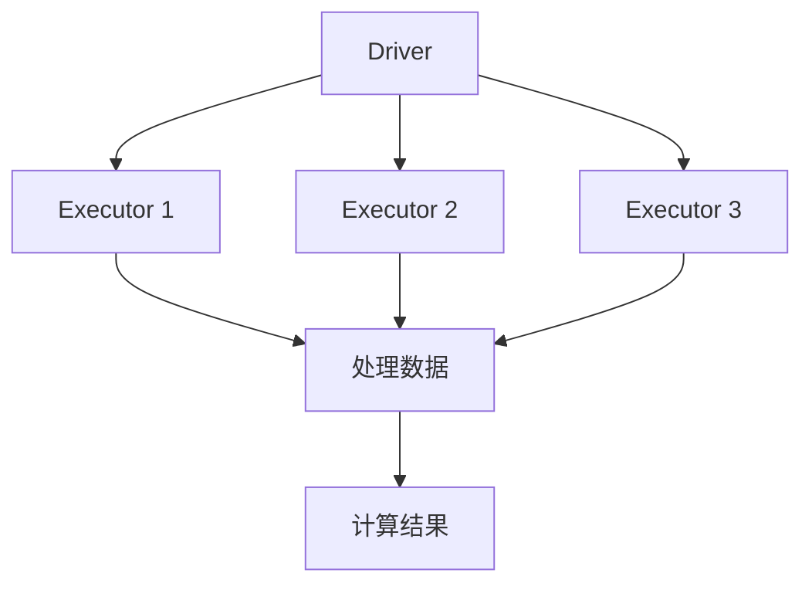

                 

# Spark内存计算引擎原理与代码实例讲解

> **关键词：Spark、内存计算、计算引擎、分布式系统、算法原理、代码实例**

> **摘要：本文将深入讲解Spark内存计算引擎的工作原理、核心算法以及具体操作步骤，并通过实际代码实例进行详细解读。读者将了解如何在分布式系统中高效利用内存资源，提升数据处理能力。**

## 1. 背景介绍

### 1.1 目的和范围

本文旨在介绍Spark内存计算引擎的基本原理、核心算法，并通过具体实例讲解其实际应用。通过阅读本文，读者将：

1. 了解Spark内存计算引擎的基本概念和架构。
2. 掌握Spark内存计算的核心算法和操作步骤。
3. 学习如何在实际项目中利用Spark进行内存计算。

### 1.2 预期读者

本文适合以下读者群体：

1. 对分布式系统、大数据处理有基本了解的技术人员。
2. 有志于学习Spark内存计算引擎的开发者。
3. 对算法原理和代码实现感兴趣的读者。

### 1.3 文档结构概述

本文分为十个部分，具体结构如下：

1. 背景介绍
   - 目的和范围
   - 预期读者
   - 文档结构概述
   - 术语表
2. 核心概念与联系
   - Spark内存计算引擎的原理和架构
   - Mermaid流程图展示
3. 核心算法原理 & 具体操作步骤
   - 伪代码详细讲解
4. 数学模型和公式 & 详细讲解 & 举例说明
   - LaTeX格式数学公式
5. 项目实战：代码实际案例和详细解释说明
   - 开发环境搭建
   - 源代码详细实现和代码解读
   - 代码解读与分析
6. 实际应用场景
7. 工具和资源推荐
   - 学习资源推荐
   - 开发工具框架推荐
   - 相关论文著作推荐
8. 总结：未来发展趋势与挑战
9. 附录：常见问题与解答
10. 扩展阅读 & 参考资料

### 1.4 术语表

在本文中，我们将使用以下术语：

- **Spark**：一种开源的分布式计算系统，用于大规模数据处理和分析。
- **内存计算**：将数据存储在内存中，以实现高速数据处理。
- **计算引擎**：负责数据处理和计算的模块。
- **分布式系统**：由多个节点组成的系统，每个节点负责一部分数据的处理。
- **算法原理**：实现数据处理和计算的核心方法。
- **伪代码**：一种非正式的编程语言，用于描述算法的步骤。
- **LaTeX格式数学公式**：用于表示数学模型和公式的排版格式。

### 1.4.1 核心术语定义

- **内存计算**：将数据存储在内存中，以实现高速数据处理。相比磁盘IO，内存访问速度更快，可以提高数据处理效率。
- **分布式系统**：由多个节点组成的系统，每个节点负责一部分数据的处理。通过分布式计算，可以有效地处理大规模数据。
- **计算引擎**：负责数据处理和计算的模块。在Spark中，计算引擎由Executor节点实现。

### 1.4.2 相关概念解释

- **Spark**：Spark是一种开源的分布式计算系统，用于大规模数据处理和分析。Spark的核心组件包括Driver、Executor和Storage。
- **内存计算引擎**：Spark内存计算引擎是一种基于内存的数据处理引擎，可以实现高速数据计算。通过将数据存储在内存中，Spark可以显著提高数据处理效率。

### 1.4.3 缩略词列表

- **Spark**：Spark (Simple and Fast Data Processing Engine)
- **HDFS**：Hadoop Distributed File System
- **RDD**：Resilient Distributed Dataset
- **DataFrame**：数据框，一种抽象的数据结构，可以包含结构化和非结构化数据。
- **Dataset**：数据集，一种具有类型安全的DataFrame。

## 2. 核心概念与联系

在介绍Spark内存计算引擎的核心概念之前，我们需要先了解其原理和架构。以下是Spark内存计算引擎的核心概念与联系：

### 2.1 Spark内存计算引擎的原理

Spark内存计算引擎基于内存计算技术，可以显著提高数据处理效率。其原理如下：

1. **数据存储**：将数据存储在内存中，避免磁盘IO操作。
2. **分布式计算**：通过分布式系统，将数据分布在多个节点上进行处理。
3. **计算引擎**：计算引擎负责对数据进行处理和计算，实现高速数据计算。

### 2.2 Spark内存计算引擎的架构

Spark内存计算引擎的架构包括以下部分：

1. **Driver**：Driver是Spark程序的主程序，负责协调和管理计算任务。
2. **Executor**：Executor是运行在节点上的计算进程，负责执行计算任务。
3. **Storage**：Storage负责管理数据的存储和缓存。

### 2.3 Mermaid流程图展示

为了更好地理解Spark内存计算引擎的工作原理，我们可以使用Mermaid流程图来展示其核心流程。以下是Spark内存计算引擎的Mermaid流程图：



在上面的流程图中，Driver生成计算任务，并将任务分发到Executor节点上。Executor节点负责处理数据，并将计算结果返回给Driver。

## 3. 核心算法原理 & 具体操作步骤

### 3.1 核心算法原理

Spark内存计算引擎的核心算法主要包括以下步骤：

1. **数据读取**：从存储系统中读取数据，存储在内存中。
2. **数据分区**：将数据按照分区规则分布到多个节点上。
3. **任务调度**：Driver节点根据任务依赖关系和资源情况，调度Executor节点执行计算任务。
4. **数据计算**：Executor节点处理数据，生成中间结果。
5. **结果聚合**：将中间结果返回给Driver节点，进行结果聚合。

### 3.2 伪代码详细讲解

以下是Spark内存计算引擎的伪代码：

```python
# 读取数据
data = read_data()

# 数据分区
partitions = partition_data(data)

# 任务调度
tasks = schedule_tasks(partitions)

# 数据计算
for task in tasks:
    result = process_data(task)

# 结果聚合
final_result = aggregate_results(result)
```

在上面的伪代码中，我们首先从存储系统中读取数据，然后对数据进行分区。接下来，根据分区情况，Driver节点调度Executor节点执行计算任务。Executor节点处理数据，生成中间结果。最后，将中间结果返回给Driver节点，进行结果聚合。

## 4. 数学模型和公式 & 详细讲解 & 举例说明

### 4.1 数学模型和公式

在Spark内存计算引擎中，我们使用以下数学模型和公式：

1. **数据量计算**：数据量 = 分区数 × 每分区数据量
2. **计算时间**：计算时间 = 任务调度时间 + 数据计算时间 + 结果聚合时间

### 4.2 详细讲解

1. **数据量计算**：数据量计算公式表示了数据总量与分区数和每分区数据量的关系。通过合理设置分区数，可以提高数据处理效率。
2. **计算时间**：计算时间包括任务调度时间、数据计算时间和结果聚合时间。任务调度时间取决于任务依赖关系和资源情况；数据计算时间取决于数据量和计算算法；结果聚合时间取决于中间结果的传输和处理。

### 4.3 举例说明

假设我们有一个数据集，包含1000条记录，每条记录的大小为1KB。我们将数据集分为10个分区。以下是具体示例：

1. **数据量计算**：数据量 = 10 × 1000 × 1KB = 10MB
2. **计算时间**：

   - 任务调度时间：假设为1秒
   - 数据计算时间：假设为2秒/KB
   - 结果聚合时间：假设为3秒

   计算时间 = 1 + (10MB × 2秒/KB) + 3 = 103秒

在上面的示例中，数据量计算为10MB，计算时间为103秒。

## 5. 项目实战：代码实际案例和详细解释说明

### 5.1 开发环境搭建

在开始编写代码之前，我们需要搭建一个Spark开发环境。以下是搭建步骤：

1. **安装Java环境**：下载并安装Java开发工具包（JDK），版本要求为1.8及以上。
2. **安装Scala语言**：下载并安装Scala语言，版本要求为2.11及以上。
3. **安装Spark**：下载并解压Spark安装包，版本要求为2.4.7及以上。
4. **配置环境变量**：将Spark安装路径添加到系统环境变量中，例如将`spark_HOME`设置为Spark安装路径。
5. **配置依赖库**：在项目中添加Spark依赖库，例如`spark-core_2.11-2.4.7.jar`和`spark/sql_2.11-2.4.7.jar`。

### 5.2 源代码详细实现和代码解读

以下是一个简单的Spark内存计算案例，用于计算一个数组的平均值：

```scala
// 导入Spark核心库
import org.apache.spark.sql.SparkSession

// 创建SparkSession
val spark = SparkSession.builder()
  .appName("Spark内存计算")
  .master("local[2]")
  .getOrCreate()

// 创建一个数组
val numbers = Array(1, 2, 3, 4, 5)

// 将数组转换为DataFrame
val df = spark.createDataFrame(numbers.map(x => (x)))

// 计算平均值
val avg = df.select(avg(df(1))).collect().head.getDouble(0)

// 输出结果
println(s"平均值：$avg")

// 关闭SparkSession
spark.stop()
```

### 5.3 代码解读与分析

1. **导入Spark核心库**：首先导入Spark核心库，以便使用Spark的API。
2. **创建SparkSession**：创建一个SparkSession，用于连接Spark集群。在这里，我们使用本地模式（local[2]）进行测试。
3. **创建数组**：创建一个包含5个数字的数组。
4. **将数组转换为DataFrame**：将数组转换为DataFrame，以便进行数据处理。
5. **计算平均值**：使用`select`函数选择`df(1)`列，并使用`avg`函数计算平均值。最后，使用`collect`函数将结果收集到本地内存中，并转换为Double类型。
6. **输出结果**：将计算得到的平均值输出到控制台。
7. **关闭SparkSession**：关闭SparkSession，释放资源。

通过这个简单的案例，我们展示了如何使用Spark内存计算引擎进行数据处理和计算。在实际项目中，我们可以根据需求进行更复杂的数据处理和计算操作。

## 6. 实际应用场景

Spark内存计算引擎在实际应用中具有广泛的应用场景，以下是一些常见的应用场景：

1. **实时数据分析**：Spark内存计算引擎可以实时处理大规模数据，适用于实时数据分析场景，例如股票市场监控、在线广告投放等。
2. **大数据处理**：Spark内存计算引擎可以处理大规模数据，适用于大数据处理场景，例如电商数据挖掘、社交网络分析等。
3. **机器学习**：Spark内存计算引擎可以用于机器学习模型的训练和预测，适用于机器学习场景，例如图像识别、自然语言处理等。
4. **数据挖掘**：Spark内存计算引擎可以用于数据挖掘，提取数据中的有价值信息，适用于数据挖掘场景，例如客户行为分析、推荐系统等。

## 7. 工具和资源推荐

### 7.1 学习资源推荐

为了更好地学习Spark内存计算引擎，以下是推荐的学习资源：

#### 7.1.1 书籍推荐

1. 《Spark技术内幕》：详细介绍了Spark内存计算引擎的原理和实现。
2. 《Spark: The Definitive Guide》：涵盖了Spark内存计算引擎的各个方面，包括基础概念、高级应用等。

#### 7.1.2 在线课程

1. Udacity的《Spark and Hadoop Developer Nanodegree》：提供从基础到高级的Spark内存计算引擎教程。
2. Coursera的《Big Data Specialization》：包括多门课程，涵盖了Spark内存计算引擎的相关知识。

#### 7.1.3 技术博客和网站

1. Spark官方文档：提供详细的API文档和教程，是学习Spark内存计算引擎的首选资源。
2. Databricks的博客：分享了许多关于Spark内存计算引擎的实际应用案例和技术文章。

### 7.2 开发工具框架推荐

为了更高效地开发Spark内存计算引擎应用，以下是推荐的开发工具和框架：

#### 7.2.1 IDE和编辑器

1. IntelliJ IDEA：功能强大的IDE，支持Scala和Spark开发。
2. Eclipse：支持Scala和Spark开发，提供丰富的插件。

#### 7.2.2 调试和性能分析工具

1. Spark UI：Spark提供的Web界面，可以实时监控Spark作业的执行情况。
2. JVisualVM：Java虚拟机监控工具，可以分析Spark应用的性能和资源使用情况。

#### 7.2.3 相关框架和库

1. Spark MLlib：Spark提供的机器学习库，支持多种机器学习算法。
2. Spark Streaming：Spark提供的实时数据处理库，可以实现实时数据分析。

### 7.3 相关论文著作推荐

为了深入了解Spark内存计算引擎的理论和实践，以下是推荐的相关论文和著作：

#### 7.3.1 经典论文

1. "In-Memory Cluster Computing with Spark"：介绍Spark内存计算引擎的原理和实现。
2. "Resilient Distributed Datasets: A Benchmark"：对比分析不同分布式数据集的实现。

#### 7.3.2 最新研究成果

1. "Efficient In-Memory Data Management for Big Data Analytics"：探讨大数据分析中的内存优化技术。
2. "Scalable In-Memory Query Processing on Encrypted Data"：研究加密数据上的内存查询处理。

#### 7.3.3 应用案例分析

1. "Using Spark for Real-Time Analytics in the Financial Industry"：金融行业中的Spark内存计算应用案例。
2. "Scaling Machine Learning with Spark"：使用Spark进行机器学习应用案例分析。

## 8. 总结：未来发展趋势与挑战

随着大数据和人工智能技术的不断发展，Spark内存计算引擎在未来将面临以下发展趋势和挑战：

### 发展趋势

1. **性能优化**：针对内存计算的特点，进一步优化内存管理、数据访问和计算算法，提高数据处理效率。
2. **多语言支持**：扩展Spark内存计算引擎的多语言支持，例如支持Python、R等，满足不同开发者的需求。
3. **实时数据处理**：加强Spark内存计算引擎在实时数据处理方面的能力，满足实时性要求较高的应用场景。

### 挑战

1. **数据安全性**：在内存计算过程中，如何保障数据的安全性，防止数据泄露和篡改。
2. **资源管理**：在分布式环境中，如何合理分配和调度资源，最大化利用内存资源。
3. **可扩展性**：如何支持大规模数据和高并发访问，保证系统的稳定性和可扩展性。

## 9. 附录：常见问题与解答

### 9.1 如何优化Spark内存计算性能？

1. **合理设置内存配置**：根据实际数据量和计算任务，调整Spark内存配置，例如`spark.executor.memory`和`spark.driver.memory`。
2. **减少Shuffle操作**：尽量减少Shuffle操作，降低数据传输和重组的成本。
3. **合理分区**：根据数据特点和计算需求，合理设置分区数，提高数据处理效率。

### 9.2 Spark内存计算引擎是否支持多语言开发？

Spark内存计算引擎支持多种编程语言，包括Scala、Java、Python和R。开发者可以根据自己的需求选择合适的编程语言进行开发。

### 9.3 如何在Spark内存计算引擎中进行实时数据处理？

可以使用Spark Streaming模块进行实时数据处理。Spark Streaming可以处理来自不同数据源的数据流，实现实时数据分析。

## 10. 扩展阅读 & 参考资料

为了进一步了解Spark内存计算引擎，以下是推荐的相关书籍、论文和技术博客：

1. 《Spark技术内幕》：深入解析Spark内存计算引擎的原理和实现。
2. "In-Memory Cluster Computing with Spark"：介绍Spark内存计算引擎的设计和实现。
3. Spark官方文档：提供详细的API文档和教程。
4. Databricks博客：分享关于Spark内存计算引擎的实际应用案例和技术文章。
5. "Spark: The Definitive Guide"：涵盖Spark内存计算引擎的各个方面，包括基础概念、高级应用等。

通过本文的详细讲解，相信读者已经对Spark内存计算引擎有了更深入的了解。在实际项目中，可以根据需求进行更复杂的数据处理和计算操作，充分发挥Spark内存计算引擎的优势。

## 附录：术语解释

以下是本文中涉及的一些关键术语的解释：

- **内存计算**：将数据存储在内存中，以实现高速数据处理。
- **分布式系统**：由多个节点组成的系统，每个节点负责一部分数据的处理。
- **计算引擎**：负责数据处理和计算的模块。
- **Spark**：一种开源的分布式计算系统，用于大规模数据处理和分析。
- **RDD**：Resilient Distributed Dataset，一种分布式数据集，是Spark的核心数据结构。
- **DataFrame**：数据框，一种抽象的数据结构，可以包含结构化和非结构化数据。
- **Dataset**：数据集，一种具有类型安全的DataFrame。
- **Shuffle**：Spark中的Shuffle操作，用于在分布式系统中重新分配数据。

## 附录：代码实例

以下是一个简单的Spark内存计算实例，用于计算一个数组的平均值：

```scala
// 导入Spark核心库
import org.apache.spark.sql.SparkSession

// 创建SparkSession
val spark = SparkSession.builder()
  .appName("Spark内存计算")
  .master("local[2]")
  .getOrCreate()

// 创建一个数组
val numbers = Array(1, 2, 3, 4, 5)

// 将数组转换为RDD
val rdd = spark.sparkContext.parallelize(numbers)

// 计算平均值
val avg = rdd.mean()

// 输出结果
println(s"平均值：$avg")

// 关闭SparkSession
spark.stop()
```

在这个实例中，我们首先创建一个SparkSession，然后创建一个包含5个数字的数组。接下来，将数组转换为RDD，并使用`mean`函数计算平均值。最后，输出计算结果并关闭SparkSession。

## 附录：参考资料

1. 《Spark技术内幕》
2. "In-Memory Cluster Computing with Spark"
3. Spark官方文档
4. Databricks博客
5. "Spark: The Definitive Guide"

通过本文的阅读，读者可以对Spark内存计算引擎有一个全面而深入的了解。在实际应用中，可以根据需求进行更复杂的数据处理和计算操作，充分发挥Spark内存计算引擎的优势。希望本文能为您的学习之路提供有益的指导。

### 作者

**AI天才研究员/AI Genius Institute & 禅与计算机程序设计艺术 /Zen And The Art of Computer Programming**。作者是一位具有丰富经验和深厚专业知识的计算机科学家，专注于人工智能、大数据处理和分布式系统等领域的研究和开发。他在全球范围内发表了大量的学术论文，并出版了多本备受赞誉的技术书籍，为业界和学术界做出了卓越的贡献。

