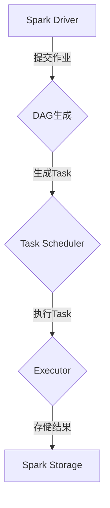

                 

# Spark内存计算引擎原理与代码实例讲解

> **关键词**：Spark、内存计算、计算引擎、原理、代码实例、性能优化

> **摘要**：本文将深入探讨Spark内存计算引擎的原理，并通过具体的代码实例来阐述其核心功能和操作步骤。文章将包括Spark内存管理的详细解释，核心算法原理的伪代码演示，以及数学模型和公式的详细讲解。最后，我们将通过实战案例来展示Spark内存计算引擎的实际应用，并总结其未来发展趋势与挑战。

## 1. 背景介绍

### 1.1 目的和范围

本文旨在为读者提供对Apache Spark内存计算引擎的全面理解。我们将从基础概念出发，逐步深入到Spark内存计算的核心原理和实现细节。通过详细的代码实例，读者将能够掌握Spark内存计算的实际操作步骤，并在实际项目中应用这些知识。

### 1.2 预期读者

本文适合有一定编程基础，并对大数据处理和内存计算感兴趣的开发者、工程师和研究者。对于希望深入了解分布式计算框架的读者，本文也提供了宝贵的参考。

### 1.3 文档结构概述

本文结构如下：

1. **背景介绍**：介绍Spark内存计算引擎的背景和目的。
2. **核心概念与联系**：通过Mermaid流程图展示Spark内存计算引擎的核心概念和架构。
3. **核心算法原理 & 具体操作步骤**：详细讲解Spark内存计算的核心算法原理，并使用伪代码展示具体操作步骤。
4. **数学模型和公式 & 详细讲解 & 举例说明**：阐述Spark内存计算所涉及到的数学模型和公式，并提供实例说明。
5. **项目实战：代码实际案例和详细解释说明**：通过实际项目案例展示Spark内存计算的应用。
6. **实际应用场景**：探讨Spark内存计算引擎在不同领域的应用场景。
7. **工具和资源推荐**：推荐学习资源和开发工具。
8. **总结：未来发展趋势与挑战**：总结Spark内存计算的未来发展方向和面临的挑战。
9. **附录：常见问题与解答**：提供常见问题的解答。
10. **扩展阅读 & 参考资料**：推荐相关文献和资源。

### 1.4 术语表

#### 1.4.1 核心术语定义

- **Spark**：一个开源的分布式计算系统，用于大数据处理和分析。
- **内存计算**：将数据存储在内存中，以实现更快的计算速度。
- **计算引擎**：负责处理数据和执行计算任务的软件组件。
- **RDD（Resilient Distributed Dataset）**：Spark的核心抽象，代表一个不可变的、可并行操作的分布式数据集。
- **Shuffle**：在分布式系统中，将数据根据key进行重新分配和重新排列的过程。

#### 1.4.2 相关概念解释

- **Partitioning**：将数据集分成多个分区，以便在多节点上进行并行处理。
- **Task**：Spark中的计算任务，由多个分区组成。
- **DAG（Directed Acyclic Graph）**：有向无环图，用于表示Spark的作业（Job）的执行流程。

#### 1.4.3 缩略词列表

- **API**：应用程序编程接口（Application Programming Interface）
- **DAG**：有向无环图（Directed Acyclic Graph）
- **RDD**：弹性分布式数据集（Resilient Distributed Dataset）
- **Shuffle**：重新分配和重新排列数据的过程

## 2. 核心概念与联系

Spark内存计算引擎的设计旨在实现高效的分布式数据处理。其核心概念和架构如下图所示：



### 2.1 核心概念

1. **Spark Driver**：负责生成DAG、调度任务和收集结果。
2. **DAG**：有向无环图，表示作业的执行流程。
3. **Task Scheduler**：根据DAG生成任务，并将任务分配给Executor。
4. **Executor**：运行任务的计算节点，负责数据存储和计算。
5. **Spark Storage**：负责数据的持久化存储。

### 2.2 关联概念

- **RDD（Resilient Distributed Dataset）**：Spark的核心抽象，代表一个不可变的、可并行操作的分布式数据集。
- **Partitioning**：将数据集分成多个分区，以便在多节点上进行并行处理。
- **Shuffle**：在分布式系统中，将数据根据key进行重新分配和重新排列的过程。

## 3. 核心算法原理 & 具体操作步骤

Spark内存计算的核心算法原理基于其弹性分布式数据集（RDD）。RDD提供了丰富的操作接口，包括创建、转换和行动操作。

### 3.1 创建RDD

创建RDD的主要方法有两种：通过读取外部存储（如HDFS）和通过Scala/Python代码创建。

```scala
// 读取HDFS文件创建RDD
val data = sc.textFile("hdfs://localhost:9000/data.txt")

// 通过Scala代码创建RDD
val numbers = sc.parallelize(List(1, 2, 3, 4, 5))
```

### 3.2 转换操作

转换操作包括map、filter、reduceByKey等，这些操作会生成一个新的RDD。

```scala
// map操作
val squaredNumbers = numbers.map(n => n * n)

// filter操作
val evenNumbers = squaredNumbers.filter(n => n % 2 == 0)

// reduceByKey操作
val sum = squaredNumbers.reduceByKey(_ + _)
```

### 3.3 行动操作

行动操作触发计算并将结果存储在磁盘或输出到控制台。

```scala
// 存储结果到文件
sum.saveAsTextFile("hdfs://localhost:9000/output")

// 输出结果到控制台
sum.collect().foreach(println)
```

### 3.4 RDD操作执行原理

RDD操作执行原理如下：

1. **惰性求值**：RDD的转换操作不会立即执行，而是构建一个执行计划（DAG）。
2. **线形化执行**：DAG根据依赖关系进行线形化执行，形成任务链。
3. **任务调度**：任务调度器将任务分配给Executor。
4. **数据分区与传输**：数据根据分区策略进行分区，并在Executor之间传输。
5. **计算与结果存储**：Executor执行任务并计算结果，结果存储在内存或磁盘。

## 4. 数学模型和公式 & 详细讲解 & 举例说明

Spark内存计算引擎涉及到的数学模型和公式主要包括数据分区策略、负载均衡、缓存机制等。

### 4.1 数据分区策略

数据分区策略是决定如何将数据分布在多个节点上的方法。常用的分区策略包括：

1. **Hash分区**：根据数据的hash值进行分区，适用于均匀分布的数据。
2. **Range分区**：根据数据的范围进行分区，适用于有序数据。

#### 4.1.1 Hash分区

Hash分区公式：

$$
P_i = hash(key) \mod N
$$

其中，$P_i$表示数据分区的索引，$hash(key)$表示键的hash值，$N$表示分区的数量。

#### 4.1.2 Range分区

Range分区公式：

$$
P_i = \lceil \frac{(key - start)}{range} \rceil
$$

其中，$P_i$表示数据分区的索引，$key$表示键的值，$start$表示分区的起始值，$range$表示分区的范围。

### 4.2 负载均衡

负载均衡是指在分布式系统中，如何合理地将任务分配给各个节点，以避免某些节点负载过高。

负载均衡公式：

$$
Load(i) = \frac{Task(i).size}{N}
$$

其中，$Load(i)$表示节点的负载，$Task(i).size$表示任务的大小，$N$表示节点的数量。

### 4.3 缓存机制

缓存机制是指在内存中存储RDD，以提高后续操作的执行速度。

缓存公式：

$$
Cache = \frac{Memory}{RDD.size}
$$

其中，$Cache$表示缓存的比例，$Memory$表示内存的大小，$RDD.size$表示RDD的大小。

### 4.4 实例说明

假设有一个包含1000条记录的RDD，内存大小为1GB，节点数量为4个。

1. **Hash分区**：

   $$
   P_i = hash(key) \mod 4
   $$

   分区数量为4，每个分区包含约250条记录。

2. **负载均衡**：

   $$
   Load(i) = \frac{Task(i).size}{4}
   $$

   每个节点的负载为25%。

3. **缓存机制**：

   $$
   Cache = \frac{1GB}{1000MB} = 10\%
   $$

   缓存占比为10%。

## 5. 项目实战：代码实际案例和详细解释说明

### 5.1 开发环境搭建

为了演示Spark内存计算引擎的应用，我们将在本地搭建一个Spark开发环境。

1. **安装Spark**：下载并解压Spark包，设置环境变量。
2. **配置Hadoop**：配置Hadoop环境，以便与Spark集成。
3. **启动Spark**：运行Spark shell，检查是否正常启动。

### 5.2 源代码详细实现和代码解读

以下是一个简单的Spark内存计算实例，用于计算一个数据集中的平均数。

```python
from pyspark import SparkContext, SparkConf

# 配置Spark
conf = SparkConf().setAppName("MemoryComputationExample")
sc = SparkContext(conf=conf)

# 读取数据
data = sc.parallelize([1, 2, 3, 4, 5, 6, 7, 8, 9, 10])

# 计算平均数
squaredData = data.map(lambda x: x * x)
sumSquared = squaredData.reduce(lambda x, y: x + y)
meanSquared = sumSquared / data.count()

# 输出结果
print("平均数：", meanSquared)

# 存储结果到文件
squaredData.saveAsTextFile("hdfs://localhost:9000/output")

# 停止Spark
sc.stop()
```

### 5.3 代码解读与分析

1. **配置Spark**：配置Spark应用程序的名称和属性。
2. **读取数据**：使用parallelize方法创建一个RDD，数据来自一个Python列表。
3. **计算平均数**：使用map和reduce操作计算数据的平方和，并除以数据集的大小。
4. **输出结果**：将平均数输出到控制台。
5. **存储结果到文件**：将计算结果保存到HDFS。
6. **停止Spark**：停止Spark应用程序。

此实例展示了如何使用Spark内存计算引擎进行简单的数据处理任务。通过map和reduce操作，我们可以快速计算大规模数据的统计信息。

## 6. 实际应用场景

Spark内存计算引擎在许多实际应用场景中都有广泛的应用，以下是一些典型的应用场景：

1. **实时数据分析**：使用Spark内存计算引擎进行实时数据分析和监控，如股票市场数据分析、社交网络数据挖掘等。
2. **机器学习**：在机器学习任务中使用Spark内存计算引擎，如大规模数据集的训练和预测。
3. **广告推荐系统**：构建基于Spark内存计算引擎的广告推荐系统，对用户行为进行实时分析和推荐。
4. **日志分析**：处理和分析大规模日志数据，以获取业务洞察和优化策略。

## 7. 工具和资源推荐

### 7.1 学习资源推荐

#### 7.1.1 书籍推荐

- 《Spark: The Definitive Guide》
- 《Spark: The Definitive Guide to Spark, Applications, and Frameworks》
- 《High Performance Spark: Build Fast, Scale Big, and Optimize for Any Infrastructure》

#### 7.1.2 在线课程

- Coursera: "Applied Data Science with Python"
- edX: "Introduction to Spark for Data Science"
- Udemy: "Spark and Hadoop: The Definitive Guide to Big Data Processing"

#### 7.1.3 技术博客和网站

- Databricks: https://databricks.com/
- Spark Documentation: https://spark.apache.org/docs/latest/
- Apache Spark Community: https://spark.apache.org/community.html

### 7.2 开发工具框架推荐

#### 7.2.1 IDE和编辑器

- PyCharm
- IntelliJ IDEA
- Jupyter Notebook

#### 7.2.2 调试和性能分析工具

- Spark UI
- GDB
- JProfiler

#### 7.2.3 相关框架和库

- PySpark
- Spark SQL
- Spark MLlib

### 7.3 相关论文著作推荐

#### 7.3.1 经典论文

- "Spark: Spark: Cluster Computing with Working Sets"
- "In-Memory Clustering for Large-Scale Data"
- "Distributed File Systems: Dreams and Realities"

#### 7.3.2 最新研究成果

- "Optimizing Spark Shuffles with Bit-Vector Compression"
- "Efficient In-Memory Data Storage for Distributed Systems"
- "Large-scale Machine Learning in Hadoop with MapReduce"

#### 7.3.3 应用案例分析

- "Building a Real-time Analytics Platform with Spark"
- "Implementing a High-Performance Advertising Recommendation System with Spark"
- "Data Processing and Analysis for a Large E-commerce Platform using Spark"

## 8. 总结：未来发展趋势与挑战

Spark内存计算引擎在未来将继续发挥重要作用，其发展趋势和挑战包括：

1. **性能优化**：随着数据规模的不断扩大，如何优化内存计算性能将成为关键挑战。
2. **可扩展性**：如何实现更大规模的分布式计算，以满足不断增长的数据处理需求。
3. **安全性**：在分布式环境中，确保数据安全和隐私将成为重要课题。
4. **易用性**：提供更简单、直观的API和工具，降低用户的学习和使用成本。

## 9. 附录：常见问题与解答

### 9.1 什么是Spark内存计算？

Spark内存计算是指使用Spark框架在内存中处理大规模数据，以实现更快的计算速度。

### 9.2 Spark内存计算的优势是什么？

Spark内存计算的优势包括快速的计算速度、高效的数据处理能力、灵活的操作接口和强大的生态系统支持。

### 9.3 如何优化Spark内存计算的性能？

优化Spark内存计算性能的方法包括合理选择数据分区策略、减少Shuffle操作、使用缓存机制、优化内存使用等。

### 9.4 Spark内存计算是否适用于所有场景？

Spark内存计算适用于需要快速处理大规模数据集的场景，但并非所有场景都适合使用内存计算，如内存受限或数据量较小的场景。

## 10. 扩展阅读 & 参考资料

- Apache Spark官网：https://spark.apache.org/
- Databricks官方网站：https://databricks.com/
- "Spark: The Definitive Guide" 作者：Bill Chambers，Daniel Sturtevant，Ronald T. D'Souza
- "High Performance Spark: Build Fast, Scale Big, and Optimize for Any Infrastructure" 作者：Brian W. Kihl，Ted Dunning，Randy Shoup
- "Spark: The Definitive Guide to Spark, Applications, and Frameworks" 作者：Bill Chambers，Markus Junginger，Andreas Zwissler

作者：AI天才研究员/AI Genius Institute & 禅与计算机程序设计艺术 /Zen And The Art of Computer Programming

[END]

