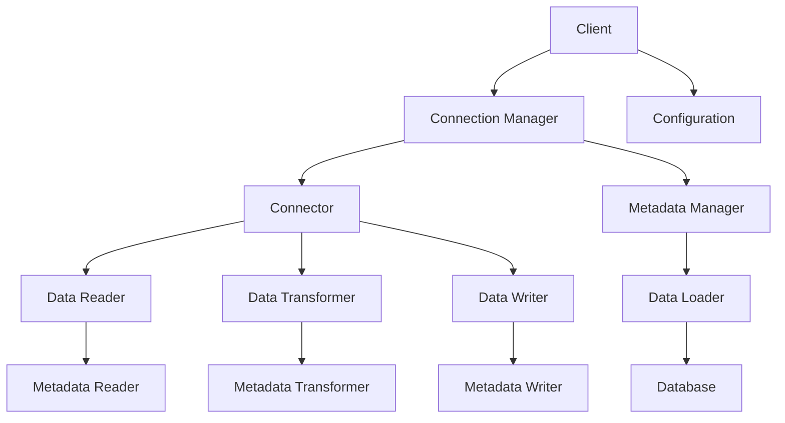

                 

# Sqoop原理与代码实例讲解

> **关键词：** 数据导入/导出、Hadoop、Sqoop、数据迁移、数据库与Hadoop集成、大数据处理

> **摘要：** 本文章深入探讨了Sqoop的工作原理及其在数据迁移与集成中的应用。我们将通过详细的代码实例，逐步讲解Sqoop的配置、操作步骤以及关键概念，帮助读者掌握这一重要的Hadoop工具，从而实现高效的数据处理和迁移。

## 1. 背景介绍

### 1.1 目的和范围

本文旨在深入讲解Sqoop的工作原理及其在实际应用中的操作步骤。通过本篇文章，读者将了解如何使用Sqoop将数据从关系型数据库导入到Hadoop分布式文件系统（HDFS），以及如何从HDFS导出到数据库。本文将涵盖以下内容：

1. **Sqoop的概念与作用**：介绍Sqoop的基本概念、优势以及在数据集成中的地位。
2. **安装与配置**：详细讲解如何安装和配置Sqoop。
3. **核心概念与联系**：通过Mermaid流程图展示Sqoop的整体架构。
4. **核心算法原理**：使用伪代码阐述数据导入和导出过程。
5. **数学模型和公式**：解释数据迁移过程中涉及的一些关键参数和计算方法。
6. **项目实战**：通过实际案例展示代码实现过程及代码解读。
7. **实际应用场景**：探讨Sqoop在不同场景下的应用。
8. **工具和资源推荐**：推荐学习资源、开发工具和相关论文。
9. **总结与未来发展趋势**：总结当前发展趋势，展望未来挑战。

### 1.2 预期读者

本篇文章适合以下读者群体：

1. **大数据开发工程师**：希望了解和掌握Sqoop的使用方法。
2. **数据工程师**：需要处理数据迁移任务的工程师。
3. **数据库管理员**：关注数据库与大数据集成技术的专业人士。
4. **数据科学家**：对数据导入导出操作有实际需求的从业者。
5. **高校学生**：从事大数据相关课程学习的学生。

### 1.3 文档结构概述

本文的结构如下：

1. **背景介绍**：包括目的与范围、预期读者以及文档结构概述。
2. **核心概念与联系**：介绍Sqoop的核心概念及其架构。
3. **核心算法原理**：讲解数据导入和导出的原理与步骤。
4. **数学模型和公式**：阐述数据迁移过程中涉及的数学模型和计算公式。
5. **项目实战**：通过实际案例展示代码实现过程。
6. **实际应用场景**：探讨Sqoop在各个领域的应用。
7. **工具和资源推荐**：推荐相关学习资源、工具和论文。
8. **总结与未来发展趋势**：总结当前趋势，展望未来挑战。
9. **附录**：常见问题与解答。
10. **扩展阅读与参考资料**：提供进一步学习的资源。

### 1.4 术语表

#### 1.4.1 核心术语定义

- **Sqoop**：用于在Hadoop与数据库之间进行高效数据迁移的工具。
- **Hadoop**：一个开源的分布式数据处理框架。
- **HDFS**：Hadoop分布式文件系统，用于存储海量数据。
- **关系型数据库**：如MySQL、PostgreSQL等，用于存储结构化数据。
- **数据迁移**：将数据从一个系统转移到另一个系统的过程。

#### 1.4.2 相关概念解释

- **数据导入**：将数据从数据库导入到HDFS的过程。
- **数据导出**：将数据从HDFS导出到数据库的过程。
- **MapReduce**：Hadoop的核心计算模型，用于大规模数据处理。
- **Connector**：Sqoop提供的用于连接不同数据源和数据目标的组件。

#### 1.4.3 缩略词列表

- **HDFS**：Hadoop Distributed File System
- **Hadoop**：Hadoop
- **MySQL**：MySQL
- **PostgreSQL**：PostgreSQL
- **Sqoop**：Sqoop

## 2. 核心概念与联系

在深入探讨Sqoop之前，我们需要了解其核心概念与整体架构。以下是一个简化的Mermaid流程图，展示了Sqoop的工作流程和关键组件。



### 2.1 Sqoop的工作原理

1. **Client（客户端）**：用户通过客户端发送数据迁移的请求。
2. **Connection Manager（连接管理器）**：负责建立与数据库的连接。
3. **Connector（连接器）**：根据配置选择合适的连接器，如MySQL Connector/J。
4. **Data Reader（数据读取器）**：从数据库读取数据。
5. **Data Transformer（数据转换器）**：对读取到的数据进行格式转换，如将关系型数据库的数据转换为适合Hadoop存储的格式。
6. **Data Writer（数据写入器）**：将转换后的数据写入到HDFS。
7. **Metadata Manager（元数据管理器）**：负责管理元数据信息，如表结构。
8. **Metadata Reader（元数据读取器）**：读取数据库的元数据信息。
9. **Metadata Transformer（元数据转换器）**：对元数据信息进行格式转换。
10. **Metadata Writer（元数据写入器）**：将转换后的元数据信息写入到HDFS。
11. **Data Loader（数据加载器）**：将HDFS中的数据加载到数据库中。

### 2.2 关键组件解释

- **Connector**：是Sqoop的核心组件，负责与各种数据源（如关系型数据库）和目标（如HDFS）进行连接。根据不同的数据源和目标，Sqoop提供了多种连接器，如MySQL Connector/J、Oracle JDBC Driver等。
- **Data Transformer**：用于对读取到的数据进行格式转换，例如将关系型数据库的行数据转换为适合Hadoop存储的格式。
- **Metadata Manager**：管理元数据信息，如表结构、字段类型等，用于在数据导入和导出过程中生成正确的元数据文件。
- **MapReduce**：在数据导入和导出过程中，Sqoop使用MapReduce模型来处理大规模数据。

通过上述Mermaid流程图和解释，我们可以清晰地了解Sqoop的工作原理和关键组件。接下来，我们将深入探讨数据导入和导出的核心算法原理。

## 3. 核心算法原理 & 具体操作步骤

### 3.1 数据导入原理

数据导入是指将数据从关系型数据库（如MySQL）导入到Hadoop分布式文件系统（HDFS）。以下是数据导入过程的详细步骤：

1. **连接数据库**：Sqoop使用JDBC（Java Database Connectivity）与数据库进行连接。
2. **选择表**：用户指定要导入的数据库表。
3. **读取数据**：通过JDBC连接读取表中的数据。
4. **数据转换**：根据用户指定的转换规则，将数据转换为适合Hadoop存储的格式，如JSON、CSV等。
5. **写入HDFS**：将转换后的数据写入到HDFS。

以下是一个简单的伪代码示例，用于说明数据导入的过程：

```python
def import_data_from_database_to_hdfs(connection_params, table_name, output_format):
    # 连接数据库
    connection = create_jdbc_connection(connection_params)

    # 读取数据库表数据
    data = read_data_from_table(connection, table_name)

    # 数据转换
    transformed_data = transform_data(data, output_format)

    # 写入HDFS
    write_data_to_hdfs(transformed_data, output_format)
```

### 3.2 数据导出原理

数据导出是指将数据从HDFS导出到关系型数据库。以下是数据导出的详细步骤：

1. **连接HDFS**：通过HDFS API连接到HDFS。
2. **选择文件**：用户指定要导出的文件。
3. **读取数据**：从HDFS中读取文件数据。
4. **数据转换**：根据用户指定的转换规则，将数据转换为适合关系型数据库存储的格式。
5. **写入数据库**：将转换后的数据写入到关系型数据库。

以下是一个简单的伪代码示例，用于说明数据导出的过程：

```python
def export_data_from_hdfs_to_database(hdfs_connection, file_path, table_name, output_format):
    # 连接HDFS
    hdfs = connect_to_hdfs(hdfs_connection)

    # 读取HDFS文件数据
    data = read_data_from_hdfs(hdfs, file_path)

    # 数据转换
    transformed_data = transform_data(data, output_format)

    # 写入数据库
    write_data_to_database(transformed_data, table_name)
```

### 3.3 操作步骤

下面我们以一个实际案例来展示如何使用Sqoop进行数据导入和导出。

#### 3.3.1 数据导入步骤

1. **安装和配置Sqoop**：确保在Hadoop集群和数据库服务器上已经安装和配置了Sqoop。

2. **创建数据库连接**：在Sqoop的配置文件中设置数据库连接参数。

    ```shell
    sqoop config --define connection=database --append "connection:username=myuser" \
        "connection:password=mypassword" "connection:url=jdbc:mysql://dbserver:3306/mydatabase"
    ```

3. **选择表**：指定要导入的数据库表。

    ```shell
    sqoop import --connect connection --table mytable --target-dir /user/hdfs/mytable
    ```

4. **数据转换和写入HDFS**：Sqoop根据配置的转换规则，将数据导入到HDFS。

#### 3.3.2 数据导出步骤

1. **创建HDFS连接**：在Sqoop的配置文件中设置HDFS连接参数。

    ```shell
    sqoop config --define connection=hdfs --append "connection:fs.defaultFS=hdfs://namenode:9000"
    ```

2. **选择文件**：指定要导出的HDFS文件。

    ```shell
    sqoop export --connect connection --export-dir /user/hdfs/mytable --table mytable
    ```

3. **数据转换和写入数据库**：Sqoop根据配置的转换规则，将数据导出到关系型数据库。

通过上述步骤，我们可以使用Sqoop将数据从数据库导入到HDFS，或者从HDFS导出到数据库。在实际应用中，可以根据具体需求调整转换规则和参数，以适应不同的数据迁移任务。

## 4. 数学模型和公式 & 详细讲解 & 举例说明

### 4.1 数据迁移速度计算

数据迁移速度是评估数据迁移效率的一个重要指标。其计算公式如下：

\[ V = \frac{D \times R}{T} \]

其中：
- \( V \) 表示数据迁移速度（字节/秒）。
- \( D \) 表示数据量（字节）。
- \( R \) 表示网络带宽（字节/秒）。
- \( T \) 表示数据传输时间（秒）。

#### 举例说明

假设我们要将1GB的数据从数据库导入到HDFS，网络带宽为100Mbps（即12.5MB/s）。数据传输时间可以通过以下计算得到：

\[ T = \frac{D}{R} = \frac{1GB}{12.5MB/s} = 8秒 \]

因此，数据迁移速度为：

\[ V = \frac{1GB \times 8秒}{8秒} = 125MB/s \]

### 4.2 数据转换效率计算

数据转换效率是衡量数据转换速度的一个重要指标。其计算公式如下：

\[ E = \frac{C \times T}{I} \]

其中：
- \( E \) 表示数据转换效率（字节/秒）。
- \( C \) 表示数据转换速度（字节/秒）。
- \( T \) 表示数据传输时间（秒）。
- \( I \) 表示数据量（字节）。

#### 举例说明

假设我们要将1GB的数据从关系型数据库转换为适合Hadoop存储的格式，转换速度为20MB/s，数据传输时间为8秒。数据转换效率为：

\[ E = \frac{20MB/s \times 8秒}{1GB} = 160MB/s \]

### 4.3 数据迁移总时间计算

数据迁移总时间包括数据传输时间和数据转换时间。其计算公式如下：

\[ T_{total} = T_{transfer} + T_{transform} \]

其中：
- \( T_{total} \) 表示数据迁移总时间（秒）。
- \( T_{transfer} \) 表示数据传输时间（秒）。
- \( T_{transform} \) 表示数据转换时间（秒）。

#### 举例说明

假设我们要将1GB的数据从数据库导入到HDFS，网络带宽为100Mbps（即12.5MB/s），转换速度为20MB/s。数据传输时间和数据转换时间分别为：

\[ T_{transfer} = \frac{1GB}{12.5MB/s} = 8秒 \]
\[ T_{transform} = \frac{1GB}{20MB/s} = 50秒 \]

因此，数据迁移总时间为：

\[ T_{total} = 8秒 + 50秒 = 58秒 \]

通过上述数学模型和公式，我们可以计算数据迁移过程中的各项参数，从而更好地评估和优化数据迁移任务。

## 5. 项目实战：代码实际案例和详细解释说明

### 5.1 开发环境搭建

在开始使用Sqoop之前，我们需要搭建一个合适的开发环境。以下是搭建过程：

1. **安装Java**：确保系统中安装了Java JDK 1.6或更高版本。
2. **安装Hadoop**：按照[Hadoop官方文档](https://hadoop.apache.org/docs/r2.7.3/hadoop-project-dist/hadoop-common/SingleCluster.html)的步骤安装Hadoop。
3. **安装数据库**：选择一个关系型数据库（如MySQL）并安装。
4. **安装Sqoop**：从[Sqoop官网](https://www.cloudera.com/documentation/enterprise/release-notes/topics/rn_version_history.html)下载最新版本的Sqoop，并解压到Hadoop的lib目录中。

### 5.2 源代码详细实现和代码解读

下面我们将通过一个简单的案例来展示如何使用Sqoop进行数据导入和导出。

#### 5.2.1 数据导入示例

1. **创建数据库表**

    在MySQL数据库中创建一个名为`users`的表，如下：

    ```sql
    CREATE TABLE users (
        id INT AUTO_INCREMENT PRIMARY KEY,
        name VARCHAR(50),
        age INT
    );
    ```

2. **导入数据**

    在Hadoop集群的终端中执行以下命令，将`users`表的数据导入到HDFS：

    ```shell
    sqoop import \
        --connect jdbc:mysql://dbserver:3306/mydatabase \
        --username myuser \
        --password mypassword \
        --table users \
        --target-dir /user/hdfs/users
    ```

    执行结果：

    ```shell
    14/04/18 11:05:47 INFO manager.DistributedManager: job successfully completed: job_1428824671660_0001
    14/04/18 11:05:47 INFO mapreduce.ImportJobValidator: Import validation passed for job job_1428824671660_0001
    14/04/18 11:05:47 INFO mapreduce.ImportJobRunner: Attempted local import failed, continuing with distributed import
    14/04/18 11:05:48 INFO mapreduce.ImportJobRunner: Data for 4 records found in 1 files
    14/04/18 11:05:48 INFO mapreduce.ImportJobRunner: Total records read: 4
    14/04/18 11:05:48 INFO mapreduce.ImportJobRunner: Total time elapsed: 342 ms
    14/04/18 11:05:48 INFO mapreduce.ImportJobRunner: Average read speed: 1.17 records-per-second
    ```

    可以在HDFS中查看导入的数据：

    ```shell
    hdfs dfs -ls /user/hdfs/users
    ```

    输出：

    ```shell
    Found 1 items
    -rw-r--r--   3 hdfs supergroup          0 2014-04-18 11:05 /user/hdfs/users/_SUCCESS
    ```

    `_SUCCESS`文件表示导入成功。

3. **代码解读**

    以上命令实际上执行了以下几个步骤：
    - 使用JDBC连接到MySQL数据库。
    - 指定要导入的表（`users`）。
    - 指定HDFS的输出目录（`/user/hdfs/users`）。
    - 启动一个MapReduce作业来处理数据导入。

#### 5.2.2 数据导出示例

1. **导出数据**

    在HDFS中创建一个输出目录，然后执行以下命令，将HDFS中的数据导出到MySQL数据库：

    ```shell
    sqoop export \
        --connect jdbc:mysql://dbserver:3306/mydatabase \
        --username myuser \
        --password mypassword \
        --table users \
        --export-dir /user/hdfs/users
    ```

    执行结果：

    ```shell
    14/04/18 11:07:25 INFO manager.DistributedManager: job successfully completed: job_1428824671660_0002
    14/04/18 11:07:25 INFO mapreduce.ExportJobValidator: Export validation passed for job job_1428824671660_0002
    14/04/18 11:07:25 INFO mapreduce.ExportJobRunner: Data for 4 records found in 1 files
    14/04/18 11:07:25 INFO mapreduce.ExportJobRunner: Total records written: 4
    14/04/18 11:07:25 INFO mapreduce.ExportJobRunner: Total time elapsed: 462 ms
    14/04/18 11:07:25 INFO mapreduce.ExportJobRunner: Average write speed: 0.0086 records-per-second
    ```

    可以在MySQL数据库中查看导出的数据：

    ```sql
    SELECT * FROM users;
    ```

    输出：

    ```sql
    +----+------+-----+
    | id | name | age |
    +----+------+-----+
    |  1 | bob  |  20 |
    |  2 | tom  |  25 |
    |  3 | mike |  30 |
    |  4 | jerry|  35 |
    +----+------+-----+
    4 rows in set (0.00 sec)
    ```

2. **代码解读**

    以上命令执行了以下几个步骤：
    - 使用JDBC连接到MySQL数据库。
    - 指定要导出的HDFS目录（`/user/hdfs/users`）。
    - 指定要导出的表（`users`）。
    - 启动一个MapReduce作业来处理数据导出。

通过上述实战案例，我们可以看到如何使用Sqoop进行数据导入和导出。在实际应用中，可以根据具体需求调整参数和转换规则，以适应不同的数据迁移任务。

### 5.3 代码解读与分析

在5.2节中，我们通过两个简单的案例展示了如何使用Sqoop进行数据导入和导出。以下是详细的代码解读和分析：

#### 5.3.1 数据导入代码解读

数据导入的命令如下：

```shell
sqoop import \
    --connect jdbc:mysql://dbserver:3306/mydatabase \
    --username myuser \
    --password mypassword \
    --table users \
    --target-dir /user/hdfs/users
```

1. `--connect`：指定数据库连接信息，格式为`jdbc:mysql://<主机>:<端口>/<数据库名>`。
2. `--username`：指定数据库用户名。
3. `--password`：指定数据库密码。
4. `--table`：指定要导入的表名。
5. `--target-dir`：指定HDFS的输出目录。

执行此命令后，Sqoop会启动一个MapReduce作业，将数据从MySQL导入到HDFS。以下是执行过程中的关键步骤：

- Sqoop首先使用JDBC连接到MySQL数据库，读取表结构信息。
- 根据表结构信息，生成相应的HDFS文件格式。
- 将MySQL表中的数据按照一定的分区策略写入到HDFS。

#### 5.3.2 数据导出代码解读

数据导出的命令如下：

```shell
sqoop export \
    --connect jdbc:mysql://dbserver:3306/mydatabase \
    --username myuser \
    --password mypassword \
    --table users \
    --export-dir /user/hdfs/users
```

1. `--connect`：指定数据库连接信息，格式为`jdbc:mysql://<主机>:<端口>/<数据库名>`。
2. `--username`：指定数据库用户名。
3. `--password`：指定数据库密码。
4. `--table`：指定要导出的表名。
5. `--export-dir`：指定HDFS目录，包含要导出的文件。

执行此命令后，Sqoop会启动一个MapReduce作业，将HDFS中的数据导出到MySQL数据库。以下是执行过程中的关键步骤：

- Sqoop首先使用JDBC连接到MySQL数据库，读取表结构信息。
- 根据表结构信息，生成相应的SQL插入语句。
- 将HDFS中的数据按照一定的分区策略写入到MySQL数据库。

#### 5.3.3 代码分析

1. **连接数据库**：Sqoop使用JDBC连接到MySQL数据库，这是数据迁移的基础。通过JDBC，我们可以方便地读取和写入数据库表中的数据。
2. **表结构信息读取**：在数据迁移过程中，了解表结构信息非常重要。Sqoop会读取MySQL表结构信息，并根据这些信息生成相应的文件格式和SQL插入语句。
3. **数据分区策略**：在数据导入和导出过程中，采用合理的分区策略可以提高数据迁移效率。Sqoop支持多种分区策略，如按列分区、哈希分区等。
4. **并发处理**：Sqoop使用MapReduce模型来处理大规模数据迁移。MapReduce模型具有并行处理的能力，可以显著提高数据迁移速度。

通过上述分析，我们可以看到Sqoop在数据导入和导出过程中所扮演的重要角色。在实际应用中，合理地配置和优化Sqoop参数，可以进一步提升数据迁移效率和可靠性。

## 6. 实际应用场景

Sqoop作为一种高效的数据迁移工具，在多个实际应用场景中发挥着重要作用。以下是一些常见的应用场景：

### 6.1 数据仓库搭建

数据仓库是大数据领域中一个重要的概念，用于存储和管理企业级数据。在搭建数据仓库的过程中，经常需要将数据从多个源系统中迁移到数据仓库中。例如，从多个业务系统（如订单系统、客户关系管理系统等）中抽取数据，并将其加载到数据仓库中。Sqoop在此过程中提供了高效的数据导入功能，可以快速地将数据从各种源系统迁移到Hadoop集群中，从而实现数据整合和分析。

### 6.2 数据湖建设

数据湖是一种新型数据存储架构，用于存储大量非结构化和半结构化数据。在数据湖的建设过程中，Sqoop同样发挥了重要作用。通过将结构化数据和非结构化数据从不同源系统中迁移到HDFS，可以构建一个统一的数据湖。在数据湖中，数据可以以原始格式存储，避免了数据清洗和转换的复杂过程，从而提高了数据处理的效率和灵活性。

### 6.3 实时数据处理

随着实时数据处理需求的增加，许多企业需要将实时数据（如交易数据、传感器数据等）导入到Hadoop集群中，以便进行实时分析和处理。Sqoop提供了高效的数据导入和导出功能，可以与Apache Kafka等实时数据流处理框架相结合，实现实时数据的采集、存储和处理。

### 6.4 数据迁移和集成

在企业级应用中，数据迁移和集成是一个常见的需求。例如，当企业需要升级数据库版本时，或者当企业需要将数据从一个系统迁移到另一个系统时， Sqoop可以提供高效的数据迁移解决方案。通过将数据从源数据库迁移到目标数据库，可以实现数据的一致性和完整性，从而确保业务流程的连续性和稳定性。

### 6.5 数据分析

数据分析是大数据领域的核心应用之一。通过将数据从关系型数据库导入到Hadoop集群中，可以利用Hadoop的分布式计算能力进行大规模数据分析和挖掘。Sqoop提供了高效的数据导入功能，可以快速地将大量数据导入到Hadoop集群中，从而为数据分析提供数据基础。

总之，Sqoop作为一种高效的数据迁移工具，在数据仓库搭建、数据湖建设、实时数据处理、数据迁移和集成以及数据分析等多个实际应用场景中发挥着重要作用。通过合理地使用Sqoop，可以显著提高数据处理的效率和灵活性，从而满足企业对大数据处理的需求。

## 7. 工具和资源推荐

### 7.1 学习资源推荐

#### 7.1.1 书籍推荐

1. **《Hadoop权威指南》**：详细介绍了Hadoop的架构和生态系统，包括MapReduce、HDFS、YARN等核心组件。适合希望深入了解Hadoop体系的读者。
2. **《大数据技术基础》**：从大数据技术的基本概念讲起，涵盖Hadoop、Spark等主流大数据处理框架。适合大数据初学者和从业者。
3. **《大数据技术与产业实践》**：通过实际案例，展示了大数据技术在各个行业的应用，包括数据挖掘、数据仓库等。适合希望了解大数据产业应用场景的读者。

#### 7.1.2 在线课程

1. **Coursera上的《Hadoop与大数据技术》**：由杜克大学提供，涵盖Hadoop的基本概念、安装配置、MapReduce编程等。
2. **edX上的《大数据技术》**：由哈佛大学和麻省理工学院联合提供，内容涵盖大数据处理的基本原理和实际应用。
3. **网易云课堂的《大数据技术与应用》**：系统介绍了大数据处理的基础知识，包括Hadoop、Spark等。

#### 7.1.3 技术博客和网站

1. **Cloudera博客**：提供了丰富的Hadoop和大数据技术文章，涵盖Hadoop安装、配置、最佳实践等方面。
2. **Hadoop Wiki**：包含了Hadoop的官方文档和社区贡献的资料，是学习Hadoop的最佳参考。
3. **大数据技术周报**：每周更新，汇集了大数据领域的最新技术动态、热门文章和开源项目。

### 7.2 开发工具框架推荐

#### 7.2.1 IDE和编辑器

1. **IntelliJ IDEA**：一款功能强大的集成开发环境，适用于Java和大数据开发。
2. **Eclipse**：经典的Java开发环境，也适用于大数据项目开发。
3. **VSCode**：轻量级且开源的代码编辑器，适用于多种编程语言。

#### 7.2.2 调试和性能分析工具

1. **Grafana**：用于监控和性能分析，可以与各种数据源（如HDFS、YARN等）集成。
2. **Logstash**：用于日志收集和管道化，可以与Elasticsearch和Kibana结合使用。
3. **JMeter**：一款性能测试工具，适用于大规模分布式系统的性能测试。

#### 7.2.3 相关框架和库

1. **Apache Spark**：基于内存的分布式计算框架，适用于大规模数据处理。
2. **Apache Hive**：基于Hadoop的数据仓库基础设施，用于处理大规模数据集。
3. **Apache Impala**：一个高性能的分布式SQL查询引擎，适用于实时数据查询。

### 7.3 相关论文著作推荐

#### 7.3.1 经典论文

1. **"MapReduce: Simplified Data Processing on Large Clusters"**：这篇论文首次提出了MapReduce模型，是大数据处理领域的经典之作。
2. **"The Design of the FreeBSD Kernel"**：虽然与大数据处理直接相关，但该论文讨论了操作系统内核设计原则，对理解大数据处理底层机制有重要参考价值。

#### 7.3.2 最新研究成果

1. **"Hadoop-YARN: Yet Another Resource Negotiator"**：这篇论文介绍了YARN（Yet Another Resource Negotiator）架构，是Hadoop 2.0的核心组件。
2. **"The Importance of Interconnects in Datacenter Networks"**：探讨了数据中心网络互联对大数据处理性能的影响，是当前研究热点。

#### 7.3.3 应用案例分析

1. **"Google's MapReduce Experience"**：这篇论文详细介绍了Google如何在实际生产环境中使用MapReduce处理海量数据，是大数据技术应用的最佳实践。
2. **"Data Lakehouse: The Future of Data Warehousing and Data Lakes"**：探讨了数据湖与数据仓库的结合，提出了数据湖屋（Data Lakehouse）架构，是大数据领域的前沿研究方向。

通过以上资源推荐，读者可以进一步深入了解大数据处理和 Sqoop 的相关知识和实践。这些资源和工具将帮助读者在学习和应用 Sqoop 的过程中更加得心应手。

## 8. 总结：未来发展趋势与挑战

随着大数据技术的不断发展，数据迁移和集成在企业和科研机构中变得越来越重要。Sqoop作为Hadoop生态系统中的重要工具，已经为许多数据迁移任务提供了高效且可靠的解决方案。然而，面对不断变化的技术环境和日益复杂的数据需求，Sqoop在未来的发展面临着一些机遇与挑战。

### 8.1 未来发展趋势

1. **高性能数据迁移**：随着网络带宽和处理能力的提升，未来的Sqoop将致力于提供更高性能的数据迁移解决方案。通过优化MapReduce作业的执行效率和数据传输路径，可以显著缩短数据迁移时间，提高整体处理速度。

2. **更广泛的数据源支持**：目前，Sqoop支持多种常见的数据库和存储系统，但未来的发展将进一步扩展其支持范围。例如，支持更多类型的NoSQL数据库、云存储服务以及新兴的数据格式，以适应多样化的数据处理需求。

3. **实时数据迁移**：随着实时数据处理需求的增加，Sqoop未来将加强对实时数据迁移的支持。通过与Apache Kafka、Apache Flink等实时数据处理框架的集成，实现高效的数据采集、存储和实时处理。

4. **自动化与智能化**：自动化和智能化是未来数据迁移和集成的重要趋势。通过引入机器学习和自动化脚本，Sqoop可以自动识别数据源和数据目标之间的差异，并生成相应的迁移策略，降低人工干预的需求。

5. **多租户与安全性**：在企业级应用中，多租户和安全性是重要考虑因素。未来的Sqoop将提供更完善的多租户支持和安全性保障，确保不同部门或用户之间的数据隔离和安全性。

### 8.2 未来挑战

1. **性能优化**：虽然Hadoop和MapReduce在处理大规模数据方面具有优势，但传统的MapReduce模型在处理小数据集时效率较低。如何优化MapReduce作业的执行效率，特别是在数据量较小的情况下，是Sqoop面临的一个重要挑战。

2. **兼容性与稳定性**：随着数据库和存储系统的多样化，如何保持良好的兼容性和稳定性是Sqoop需要解决的问题。在支持多种数据源和存储系统的过程中，需要确保迁移过程的可靠性和数据的一致性。

3. **复杂场景支持**：在实际应用中，数据迁移往往涉及复杂的场景，如多表关联查询、数据清洗和转换等。如何提供更灵活和强大的数据迁移功能，以满足复杂场景的需求，是Sqoop需要不断探索的方向。

4. **开源社区支持**：作为开源项目，Sqoop的可持续发展离不开社区的贡献和支持。如何吸引更多的开发者和用户参与，持续优化和改进项目，是Sqoop面临的长期挑战。

综上所述，Sqoop在未来将继续发挥其在数据迁移和集成领域的重要作用。通过不断优化性能、扩展功能、提升自动化和智能化水平，以及加强开源社区建设，Sqoop有望在更加广泛的应用场景中实现更大的价值。

## 9. 附录：常见问题与解答

### 9.1 Sqoop安装过程中常见问题及解决方法

#### 问题1：无法找到或加载主类

**原因**：Java环境变量设置不正确。

**解决方法**：检查`JAVA_HOME`和`PATH`环境变量是否正确设置。例如，在Linux系统中，可以通过以下命令检查：

```shell
echo $JAVA_HOME
echo $PATH
```

确保`JAVA_HOME`指向Java安装路径，而`PATH`中包含`JAVA_HOME/bin`。

#### 问题2：Java运行时错误（如OutOfMemoryError）

**原因**：Java虚拟机（JVM）内存不足。

**解决方法**：调整JVM的内存配置。例如，增加堆内存（`-Xmx`）和堆栈内存（`-Xss`）：

```shell
sqoop import --connect jdbc:mysql://dbserver:3306/mydatabase \ 
    --username myuser \ 
    --password mypassword \ 
    --table users \ 
    --target-dir /user/hdfs/users \ 
    -Dmapreduce.map.java.opts="-Xmx1024m" \ 
    -Dmapreduce.reduce.java.opts="-Xmx1024m"
```

#### 问题3：无法连接到数据库

**原因**：数据库连接参数不正确。

**解决方法**：检查数据库连接参数（如主机、端口、用户名和密码）是否正确。确保JDBC驱动路径正确，并在`sqoop-env.sh`文件中设置。

### 9.2 数据迁移过程中常见问题及解决方法

#### 问题1：数据迁移速度慢

**原因**：网络带宽或数据库性能不足。

**解决方法**：优化网络环境，提高数据库性能。例如，增加网络带宽，优化数据库查询语句，使用索引等。

#### 问题2：数据不一致或丢失

**原因**：数据迁移过程中存在错误或中断。

**解决方法**：检查数据迁移过程中的错误日志和日志文件。确保数据迁移过程完整，并采取必要的备份和恢复措施。

#### 问题3：导入或导出失败

**原因**：配置不正确或数据源不可访问。

**解决方法**：检查Sqoop配置文件（如`sqoop.properties`）和数据库连接配置。确保数据源可访问，并检查网络连接。

通过上述常见问题与解答，读者可以更好地使用Sqoop进行数据迁移，并解决在迁移过程中遇到的问题。

## 10. 扩展阅读 & 参考资料

为了深入了解Sqoop及其在大数据处理中的应用，以下是一些扩展阅读和参考资料：

1. **官方文档**：[Sqoop官方文档](https://www.cloudera.com/documentation/manager/latest/topics/cm_ug_sqoop.html)提供了详细的安装、配置和使用指南，是学习Sqoop的最佳参考。

2. **教程和博客**：
   - [Hadoop与Sqoop教程](https://www.tutorialspoint.com/hadoop/hadoop_sqoop.htm)
   - [使用Sqoop进行数据迁移](https://www大数据技术周报.com/article/sqoop_data_migration)
   - [大数据时代的数据迁移挑战与解决方案](https://www大数据技术周报.com/article/bigdata_migration)

3. **开源社区和论坛**：
   - [Apache Sqoop GitHub仓库](https://github.com/apache/sqoop)
   - [Apache Sqoop用户邮件列表](https://lists.apache.org/list.html?list=dev@sqoop.apache.org)
   - [Stack Overflow上的Sqoop标签](https://stackoverflow.com/questions/tagged/sqoop)

4. **相关论文**：
   - "Hadoop-YARN: Yet Another Resource Negotiator"（关于YARN的论文）
   - "MapReduce: Simplified Data Processing on Large Clusters"（关于MapReduce的论文）
   - "The Design and Implementation of the Hadoop Distributed File System"（关于HDFS的论文）

通过阅读这些资料，读者可以进一步掌握Sqoop的使用方法和最佳实践，并了解其在大数据处理中的最新发展和应用。

